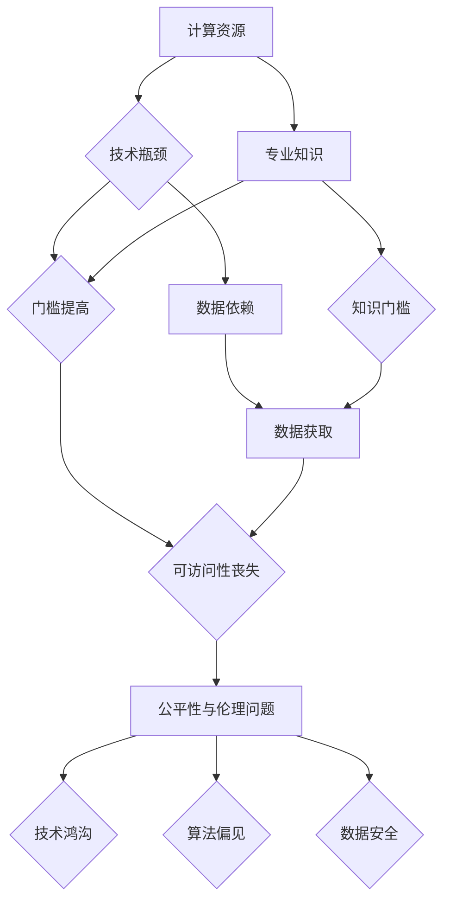

# 基础模型的可访问性丧失

> 关键词：基础模型，可访问性，人工智能，技术发展，公平性，开源，闭源，伦理

## 1. 背景介绍

随着人工智能技术的迅猛发展，基础模型（如GPT、BERT等）已成为推动NLP、CV、语音识别等领域的革命性力量。这些模型通过在大量数据上进行预训练，积累了丰富的知识和经验，为下游任务提供了强大的基础。然而，随着模型的复杂性和计算需求不断提升，基础模型的可访问性正逐渐丧失，这引发了学术界和工业界对于技术发展、公平性、伦理等问题的广泛关注。

### 1.1 技术发展的双刃剑

基础模型的兴起，一方面极大地推动了人工智能技术的进步，为解决实际问题提供了新的思路和方法。另一方面，随着模型规模和复杂性的提升，对计算资源、存储空间和专业知识的要求也越来越高，使得基础模型的可访问性受到了挑战。

### 1.2 可访问性的丧失

基础模型的可访问性丧失主要表现在以下几个方面：

1. **计算资源瓶颈**：训练和推理大规模基础模型需要大量的GPU、TPU等高性能计算资源，这对于普通研究者和企业来说是一个巨大的负担。
2. **专业知识门槛**：理解和应用基础模型需要具备深厚的数学、计算机科学和人工智能知识，这对于普通用户来说是一个难以跨越的门槛。
3. **数据依赖性**：基础模型的训练和微调需要大量标注数据，而高质量标注数据的获取成本高昂，限制了模型的广泛应用。
4. **模型复杂度**：随着模型规模的扩大，模型的复杂度也不断升高，使得模型的可解释性和可调试性降低，增加了使用难度。

### 1.3 公平性与伦理问题

基础模型的可访问性丧失还引发了公平性和伦理问题：

1. **技术鸿沟**：基础模型的高成本和高门槛，加剧了技术鸿沟，使得弱势群体难以享受人工智能带来的便利。
2. **算法偏见**：基础模型在训练过程中可能学习到数据中的偏见，导致模型在特定群体上的不公平对待。
3. **数据安全**：基础模型对数据有很高的依赖性，数据泄露和滥用问题不容忽视。

## 2. 核心概念与联系

为了更好地理解基础模型可访问性丧失的问题，以下给出核心概念原理和架构的Mermaid流程图：



从流程图中可以看出，计算资源、专业知识和数据依赖是导致基础模型可访问性丧失的主要原因，进而引发公平性与伦理问题。

## 3. 核心算法原理 & 具体操作步骤

### 3.1 算法原理概述

基础模型的原理主要基于深度学习，包括以下几个关键步骤：

1. **数据采集**：收集大量文本、图像、音频等数据。
2. **数据预处理**：对数据进行清洗、去噪、标注等预处理操作。
3. **模型训练**：使用深度学习算法对数据进行训练，如卷积神经网络（CNN）、循环神经网络（RNN）、Transformer等。
4. **模型评估**：使用测试集评估模型的性能。
5. **模型部署**：将训练好的模型部署到实际应用中。

### 3.2 算法步骤详解

基础模型的算法步骤如下：

1. **数据采集**：首先需要收集大量高质量的文本、图像、音频等数据。数据来源可以包括公开数据集、企业内部数据、在线收集等。
2. **数据预处理**：对采集到的数据进行清洗、去噪、标注等预处理操作。清洗操作包括去除重复数据、去除无关信息等；去噪操作包括去除噪声、填补缺失值等；标注操作包括标注文本内容、标注图像标签、标注音频特征等。
3. **模型训练**：根据任务需求选择合适的深度学习算法进行模型训练。例如，对于图像识别任务，可以使用CNN；对于自然语言处理任务，可以使用RNN或Transformer。
4. **模型评估**：使用测试集评估模型的性能，包括准确率、召回率、F1值等指标。根据评估结果调整模型结构和参数。
5. **模型部署**：将训练好的模型部署到实际应用中。部署方式可以是服务器、云端、边缘计算等。

### 3.3 算法优缺点

基础模型算法的优点如下：

1. **强大的学习能力**：深度学习算法能够从大量数据中学习到丰富的知识和经验，具有较强的泛化能力。
2. **可解释性**：与传统的机器学习算法相比，深度学习算法的可解释性较差，但近年来随着注意力机制、可解释AI等技术的发展，模型的可解释性得到了一定程度的提升。
3. **自适应能力**：深度学习算法能够根据不同的任务和数据特点进行自适应调整，适应性强。

基础模型算法的缺点如下：

1. **计算资源消耗大**：深度学习算法需要大量的计算资源，包括GPU、TPU等。
2. **数据依赖性强**：深度学习算法的性能很大程度上取决于训练数据的质量和数量。
3. **可解释性较差**：深度学习算法的决策过程通常较为复杂，难以解释。

### 3.4 算法应用领域

基础模型算法在多个领域得到了广泛应用，包括：

1. **自然语言处理（NLP）**：文本分类、机器翻译、情感分析、问答系统等。
2. **计算机视觉（CV）**：图像识别、目标检测、图像分割等。
3. **语音识别**：语音识别、语音合成、语音转文字等。
4. **推荐系统**：个性化推荐、协同过滤等。

## 4. 数学模型和公式 & 详细讲解 & 举例说明

### 4.1 数学模型构建

以Transformer模型为例，其数学模型如下：

$$
\begin{align*}
\text{Encoder} &= \text{Multi-Head Attention}(\text{Positional Encoding}) \\
\text{Decoder} &= \text{Multi-Head Attention}(\text{MaskedLM}, \text{Positional Encoding}) \\
\text{Transformer} &= \text{Encoder} + \text{Decoder}
\end{align*}
$$

其中，$\text{Multi-Head Attention}$ 表示多头注意力机制，$\text{Positional Encoding}$ 表示位置编码。

### 4.2 公式推导过程

以多头注意力机制为例，其计算公式如下：

$$
\begin{align*}
\text{Query} &= W_Q \cdot \text{Input} \\
\text{Key} &= W_K \cdot \text{Input} \\
\text{Value} &= W_V \cdot \text{Input} \\
\text{Attention(Q,K,V)} &= \text{Softmax}(\frac{\text{QK}^T}{\sqrt{d_k}}) \cdot V \\
\text{Output} &= \text{Concat}(\text{head}_1, \text{head}_2, ..., \text{head}_h) \cdot W_O
\end{align*}
$$

其中，$W_Q, W_K, W_V, W_O$ 分别表示查询、键、值、输出的权重矩阵，$\text{Softmax}$ 表示softmax函数，$d_k$ 表示键的维度，$h$ 表示头的数量。

### 4.3 案例分析与讲解

以下以BERT模型在文本分类任务中的应用为例，分析其数学模型和推导过程。

BERT模型的输入为一段文本，输出为该文本的类别标签。其数学模型如下：

$$
\text{Output} = \text{Softmax}(\text{分类器}(\text{Transformer}(\text{Positional Encoding}(x)))
$$

其中，$\text{Transformer}$ 表示Transformer编码器，$\text{Positional Encoding}$ 表示位置编码，$x$ 表示输入文本。

在文本分类任务中，我们通常将文本按照特定的格式进行编码，例如将句子中的每个词转换为词向量，并将词向量拼接起来作为输入。然后，将输入文本送入Transformer编码器，得到文本的表示。最后，将文本表示送入分类器，得到文本的类别标签。

## 5. 项目实践：代码实例和详细解释说明

### 5.1 开发环境搭建

以下以PyTorch框架为例，介绍如何搭建开发环境：

1. 安装Python和pip：从Python官网下载并安装Python，然后安装pip包管理器。
2. 安装PyTorch：从PyTorch官网下载并安装适合自己硬件的PyTorch版本。
3. 安装其他依赖库：使用pip安装transformers、torchvision等库。

### 5.2 源代码详细实现

以下以BERT模型在文本分类任务中的实现为例，给出PyTorch代码：

```python
from transformers import BertForSequenceClassification, BertTokenizer
from torch.utils.data import DataLoader, Dataset

class TextDataset(Dataset):
    def __init__(self, texts, labels):
        self.texts = texts
        self.labels = labels

    def __len__(self):
        return len(self.texts)

    def __getitem__(self, idx):
        text = self.texts[idx]
        label = self.labels[idx]
        return text, label

# 加载数据集
train_texts = ...
train_labels = ...
test_texts = ...
test_labels = ...

train_dataset = TextDataset(train_texts, train_labels)
test_dataset = TextDataset(test_texts, test_labels)

# 加载预训练模型和分词器
tokenizer = BertTokenizer.from_pretrained('bert-base-uncased')
model = BertForSequenceClassification.from_pretrained('bert-base-uncased')

# 训练模型
def train(model, dataset, epochs, learning_rate):
    dataloader = DataLoader(dataset, batch_size=32, shuffle=True)
    optimizer = torch.optim.AdamW(model.parameters(), lr=learning_rate)
    criterion = torch.nn.CrossEntropyLoss()

    model.train()
    for epoch in range(epochs):
        for text, label in dataloader:
            optimizer.zero_grad()
            output = model(text, labels=label)
            loss = criterion(output.logits, label)
            loss.backward()
            optimizer.step()

# 评估模型
def evaluate(model, dataset):
    dataloader = DataLoader(dataset, batch_size=32, shuffle=False)
    model.eval()
    total = 0
    correct = 0
    with torch.no_grad():
        for text, label in dataloader:
            output = model(text, labels=label)
            _, predicted = torch.max(output.logits, 1)
            total += label.size(0)
            correct += (predicted == label).sum().item()
    return correct / total

train(model, train_dataset, epochs=3, learning_rate=2e-5)
print('Test accuracy:', evaluate(model, test_dataset))
```

### 5.3 代码解读与分析

以上代码展示了如何使用PyTorch和Transformers库实现BERT模型在文本分类任务中的微调。代码首先定义了数据集和数据加载器，然后加载预训练的BERT模型和分词器。接着，定义了训练和评估函数，最后进行模型训练和评估。

## 6. 实际应用场景

基础模型在各个领域都有广泛的应用，以下列举几个典型案例：

### 6.1 自然语言处理

1. **机器翻译**：将一种语言的文本翻译成另一种语言。
2. **文本分类**：对文本进行分类，如情感分析、主题分类等。
3. **问答系统**：根据用户的问题给出答案。

### 6.2 计算机视觉

1. **图像识别**：识别图像中的物体、场景等。
2. **目标检测**：检测图像中的物体并定位其位置。
3. **图像分割**：将图像分割成不同的区域。

### 6.3 语音识别

1. **语音识别**：将语音信号转换为文本。
2. **语音合成**：将文本转换为语音信号。

## 7. 工具和资源推荐

### 7.1 学习资源推荐

1. 《深度学习》 - Ian Goodfellow、Yoshua Bengio、Aaron Courville
2. 《自然语言处理综论》 - Christopher D. Manning、Prabhakar Raghavan、Hinrich Schütze
3. 《计算机视觉：算法与应用》 - David Forsyth、Jean Ponce

### 7.2 开发工具推荐

1. PyTorch
2. TensorFlow
3. Hugging Face Transformers

### 7.3 相关论文推荐

1. "Attention is All You Need" - Ashish Vaswani et al.
2. "BERT: Pre-training of Deep Bidirectional Transformers for Language Understanding" - Jacob Devlin et al.
3. "Generative Adversarial Textuality" - Ilya Sutskever et al.

## 8. 总结：未来发展趋势与挑战

### 8.1 研究成果总结

基础模型在人工智能领域取得了显著的成果，推动了各个领域的进步。然而，基础模型的可访问性丧失、公平性与伦理问题仍然需要解决。

### 8.2 未来发展趋势

1. **模型轻量化**：降低模型复杂度和计算需求，提高模型的可访问性。
2. **模型可解释性**：提高模型的可解释性，增强用户对模型的信任。
3. **数据隐私保护**：保护用户数据隐私，避免数据泄露和滥用。

### 8.3 面临的挑战

1. **计算资源瓶颈**：降低模型训练和推理的计算需求，提高计算效率。
2. **专业知识门槛**：降低模型应用门槛，让更多用户能够使用基础模型。
3. **数据依赖性**：降低模型对标注数据的依赖，提高模型的泛化能力。
4. **公平性与伦理问题**：消除算法偏见，提高模型的公平性和可解释性。

### 8.4 研究展望

未来，基础模型的研究将朝着以下方向发展：

1. **跨模态学习**：将文本、图像、语音等多模态信息进行整合，实现更全面的信息理解。
2. **少样本学习**：减少对标注数据的依赖，提高模型的泛化能力。
3. **可解释人工智能**：提高模型的可解释性，增强用户对模型的信任。
4. **伦理人工智能**：消除算法偏见，提高模型的公平性和可解释性。

基础模型的可访问性丧失是一个复杂的问题，需要学术界和工业界共同努力，推动基础模型技术的健康发展，为人类创造更多价值。

## 9. 附录：常见问题与解答

**Q1：什么是基础模型？**

A：基础模型是一种在大规模数据上进行预训练，能够学习到丰富知识和经验的深度学习模型。基础模型是人工智能领域的重要基石，为下游任务提供了强大的基础。

**Q2：基础模型有哪些优点？**

A：基础模型具有以下优点：

1. **强大的学习能力**：能够从大量数据中学习到丰富的知识和经验，具有较强的泛化能力。
2. **可解释性**：与传统的机器学习算法相比，深度学习算法的可解释性较差，但近年来随着注意力机制、可解释AI等技术的发展，模型的可解释性得到了一定程度的提升。
3. **自适应能力**：深度学习算法能够根据不同的任务和数据特点进行自适应调整，适应性强。

**Q3：基础模型有哪些缺点？**

A：基础模型具有以下缺点：

1. **计算资源消耗大**：深度学习算法需要大量的计算资源，包括GPU、TPU等。
2. **数据依赖性强**：深度学习算法的性能很大程度上取决于训练数据的质量和数量。
3. **可解释性较差**：深度学习算法的决策过程通常较为复杂，难以解释。

**Q4：如何降低基础模型的可访问性？**

A：降低基础模型的可访问性可以从以下几个方面入手：

1. **模型轻量化**：降低模型复杂度和计算需求，提高模型的可访问性。
2. **模型可解释性**：提高模型的可解释性，增强用户对模型的信任。
3. **数据隐私保护**：保护用户数据隐私，避免数据泄露和滥用。

**Q5：如何应对基础模型的公平性与伦理问题？**

A：应对基础模型的公平性与伦理问题可以从以下几个方面入手：

1. **消除算法偏见**：通过数据清洗、算法改进等手段消除算法偏见。
2. **提高可解释性**：提高模型的可解释性，增强用户对模型的信任。
3. **建立伦理规范**：制定人工智能伦理规范，约束模型的使用。

---

作者：禅与计算机程序设计艺术 / Zen and the Art of Computer Programming