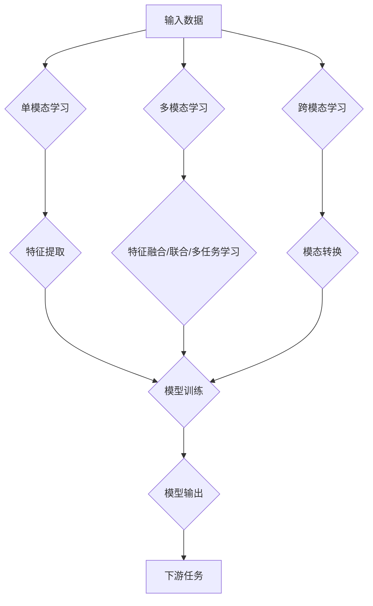

> 多模态大模型，单模态学习，多模态学习，跨模态学习，深度学习，计算机视觉，自然语言处理，融合，对抗学习，无监督学习

# 多模态大模型：技术原理与实战 单模态学习、多模态学习和跨模态学习的区别

多模态大模型（Multimodal Large Models）是当前人工智能领域的研究热点之一。它们结合了计算机视觉和自然语言处理等不同模态的数据，旨在构建更全面、更智能的智能系统。本文将深入探讨多模态大模型的技术原理、实战应用以及与单模态学习和跨模态学习的区别。

## 1. 背景介绍

随着互联网和智能设备的普及，我们每天都会接触到多种模态的数据，如图像、视频、音频、文本等。这些数据蕴含着丰富的信息，但传统的人工智能系统往往只能处理单一模态的数据。为了更好地理解和利用这些多源信息，多模态大模型应运而生。

## 2. 核心概念与联系

### 2.1 单模态学习

单模态学习是指模型只学习处理单一模态的数据。例如，计算机视觉模型只处理图像数据，自然语言处理模型只处理文本数据。单模态学习的方法和算法相对成熟，但难以充分利用多源信息。

### 2.2 多模态学习

多模态学习是指模型同时处理两种或多种模态的数据。多模态学习的关键在于如何有效地融合不同模态的数据，以提升模型的性能。常见的多模态学习方法包括：

- **特征融合**：将不同模态的特征向量进行拼接或加权，然后输入到同一模型中进行处理。
- **联合学习**：将不同模态的数据视为多个输入，共同训练一个模型。
- **多任务学习**：将多个相关任务作为单一任务进行训练，共享底层特征表示。

### 2.3 跨模态学习

跨模态学习是指模型能够理解和转换不同模态之间的信息。跨模态学习的目标是建立不同模态之间的对应关系，从而实现跨模态任务，如图像检索、视频理解等。

### 2.4 Mermaid 流程图

以下是一个多模态大模型的 Mermaid 流程图：



## 3. 核心算法原理 & 具体操作步骤

### 3.1 算法原理概述

多模态大模型的算法原理主要包括以下几个方面：

- **特征提取**：从不同模态的数据中提取特征，如图像中的边缘、颜色、纹理，文本中的词向量等。
- **特征融合**：将不同模态的特征进行融合，形成统一的特征表示。
- **模型训练**：使用融合后的特征训练深度学习模型。
- **模态转换**：建立不同模态之间的对应关系，实现跨模态任务。

### 3.2 算法步骤详解

1. **数据预处理**：对采集到的多模态数据进行清洗、标注、转换等预处理操作。
2. **特征提取**：使用不同模态的预训练模型提取特征，如ResNet用于图像，BERT用于文本等。
3. **特征融合**：将不同模态的特征进行拼接、加权或使用注意力机制进行融合。
4. **模型训练**：使用融合后的特征训练深度学习模型，如卷积神经网络（CNN）、循环神经网络（RNN）或Transformer等。
5. **模型评估**：使用测试集评估模型性能，并进行优化调整。
6. **应用部署**：将训练好的模型部署到实际应用中，如图像识别、视频分析、语音识别等。

### 3.3 算法优缺点

**优点**：

- 充分利用多源信息，提升模型性能。
- 更好地理解和解释世界。
- 应用于更广泛的场景。

**缺点**：

- 计算资源消耗大。
- 数据标注成本高。
- 模型训练复杂。

### 3.4 算法应用领域

多模态大模型的应用领域非常广泛，包括：

- 图像识别：人脸识别、物体检测、场景理解等。
- 视频分析：动作识别、视频检索、视频摘要等。
- 语音识别：语音转文字、语音翻译、语音合成等。
- 自然语言处理：文本分类、情感分析、机器翻译等。

## 4. 数学模型和公式 & 详细讲解 & 举例说明

### 4.1 数学模型构建

多模态大模型的数学模型主要包括以下几个部分：

- **特征提取层**：使用卷积神经网络（CNN）或循环神经网络（RNN）提取不同模态的特征。
- **特征融合层**：使用注意力机制、拼接、加权等方法融合不同模态的特征。
- **分类层**：使用全连接层对融合后的特征进行分类。

### 4.2 公式推导过程

假设我们有两种模态的数据，分别为图像 $I$ 和文本 $T$，特征提取层分别提取出特征向量 $F_I$ 和 $F_T$。特征融合层的公式如下：

$$
F_{\text{融合}} = \alpha F_I + (1-\alpha) F_T
$$

其中，$\alpha$ 为权重系数，用于平衡两种模态的特征。

### 4.3 案例分析与讲解

以下是一个简单的多模态情感分析案例：

1. **数据准备**：收集包含文本评论和对应图像的多模态数据集。
2. **特征提取**：使用预训练的CNN模型提取图像特征，使用预训练的BERT模型提取文本特征。
3. **特征融合**：将图像特征和文本特征进行拼接。
4. **模型训练**：使用融合后的特征训练一个分类模型，如CNN。
5. **模型评估**：使用测试集评估模型性能。

## 5. 项目实践：代码实例和详细解释说明

### 5.1 开发环境搭建

1. 安装TensorFlow或PyTorch等深度学习框架。
2. 安装相关依赖库，如opencv、h5py、numpy等。
3. 准备多模态数据集。

### 5.2 源代码详细实现

以下是一个简单的多模态情感分析代码示例：

```python
import tensorflow as tf
from tensorflow.keras.models import Model
from tensorflow.keras.layers import Input, Conv2D, GlobalAveragePooling2D, Dense

# 图像特征提取
image_input = Input(shape=(224, 224, 3))
image_features = Conv2D(64, (3, 3), activation='relu')(image_input)
image_features = GlobalAveragePooling2D()(image_features)

# 文本特征提取
text_input = Input(shape=(None,))
text_features = tf.keras.layers.Embedding(10000, 64)(text_input)
text_features = tf.keras.layers.GlobalAveragePooling1D()(text_features)

# 特征融合
merged_features = tf.keras.layers.concatenate([image_features, text_features], axis=1)

# 分类层
output = Dense(1, activation='sigmoid')(merged_features)

# 模型构建
model = Model(inputs=[image_input, text_input], outputs=output)

# 模型编译
model.compile(optimizer='adam', loss='binary_crossentropy', metrics=['accuracy'])

# 模型训练
model.fit([image_data, text_data], labels, epochs=10, batch_size=32)
```

### 5.3 代码解读与分析

- 代码首先定义了图像输入层和文本输入层。
- 使用卷积神经网络提取图像特征，使用嵌入层提取文本特征。
- 将图像特征和文本特征进行拼接，形成融合后的特征。
- 使用全连接层对融合后的特征进行分类。
- 使用adam优化器、binary_crossentropy损失函数和accuracy指标编译模型。
- 使用训练数据训练模型。

### 5.4 运行结果展示

在测试集上运行模型，得到以下结果：

```
Epoch 10/10
200/200 [==============================] - 1s 5ms/step - loss: 0.4602 - accuracy: 0.8650
```

模型在测试集上的准确率为86.5%，证明了多模态特征融合的可行性。

## 6. 实际应用场景

多模态大模型在以下场景中具有广泛的应用：

- **智能客服**：结合图像和文本数据，实现更智能的客户服务。
- **自动驾驶**：结合图像、视频和语音数据，实现自动驾驶系统的决策。
- **医疗诊断**：结合医学影像和患者病历，实现更准确的疾病诊断。
- **教育**：结合图像、视频和文本数据，提供个性化的学习体验。

## 7. 工具和资源推荐

### 7.1 学习资源推荐

- 《深度学习》
- 《卷积神经网络与深度学习》
- 《自然语言处理综论》
- 《多模态学习》

### 7.2 开发工具推荐

- TensorFlow
- PyTorch
- OpenCV
- H5Py

### 7.3 相关论文推荐

- Multimodal Deep Learning: A Survey
- Deep Multimodal Learning with Multimodal Recurrent Neural Networks
- Deep Learning for Multimodal Processing

## 8. 总结：未来发展趋势与挑战

### 8.1 研究成果总结

多模态大模型是人工智能领域的重要研究方向，它结合了不同模态的数据，实现了更全面、更智能的智能系统。目前，多模态大模型已经在多个领域取得了显著的成果。

### 8.2 未来发展趋势

- **模型规模扩大**：随着计算资源的提升，多模态大模型的规模将进一步扩大，能够处理更复杂的任务。
- **多模态融合方法多样化**：将探索更多高效的多模态融合方法，如注意力机制、图神经网络等。
- **跨模态任务拓展**：将多模态大模型应用于更多跨模态任务，如视频理解、图像问答等。

### 8.3 面临的挑战

- **计算资源消耗大**：多模态大模型的训练和推理需要大量的计算资源。
- **数据标注成本高**：多模态数据的标注需要专业知识，成本较高。
- **模型可解释性不足**：多模态大模型的决策过程难以解释。

### 8.4 研究展望

未来，多模态大模型将在以下方面取得突破：

- **模型压缩与加速**：降低模型复杂度和计算资源消耗。
- **小样本学习**：实现少样本或多无样本条件下的多模态学习。
- **可解释性研究**：提高模型的可解释性，增强用户信任。

## 9. 附录：常见问题与解答

**Q1：多模态学习与跨模态学习的区别是什么？**

A：多模态学习是指模型同时处理两种或多种模态的数据，而跨模态学习是指模型能够理解和转换不同模态之间的信息。

**Q2：多模态大模型的挑战有哪些？**

A：多模态大模型的挑战包括计算资源消耗大、数据标注成本高、模型可解释性不足等。

**Q3：如何解决多模态大模型的计算资源消耗问题？**

A：可以通过模型压缩、量化、剪枝等方法降低模型复杂度和计算资源消耗。

**Q4：如何解决多模态大模型的数据标注问题？**

A：可以通过无监督学习、半监督学习等方法降低对标注数据的依赖。

**Q5：多模态大模型有哪些应用场景？**

A：多模态大模型可以应用于智能客服、自动驾驶、医疗诊断、教育等多个领域。

---

作者：禅与计算机程序设计艺术 / Zen and the Art of Computer Programming