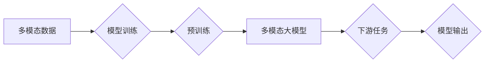

# 多模态大模型：技术原理与实战 多模态大模型评测数据集

> 关键词：多模态大模型，跨模态学习，视觉-语言模型，Transformer，预训练，微调，融合策略，应用场景

## 1. 背景介绍

随着人工智能技术的快速发展，多模态学习（Multimodal Learning）逐渐成为研究热点。多模态学习旨在将来自不同模态的数据（如文本、图像、视频等）进行有效融合，以提升模型的感知能力、理解能力和决策能力。多模态大模型（Multimodal Large Models）作为多模态学习的重要发展方向，近年来取得了显著的进展。本文将深入探讨多模态大模型的技术原理、实战应用以及评测数据集，以期为相关领域的开发者和研究者提供参考。

## 2. 核心概念与联系

### 2.1 核心概念

#### 多模态数据
多模态数据是指同时包含两种或两种以上模态信息的数据。例如，一张图片包含了视觉信息（颜色、形状、纹理等），同时图片下的文本描述包含了语言信息。

#### 多模态学习
多模态学习是指利用来自不同模态的数据进行学习的过程。其目标是建立能够同时处理和利用多个模态信息的模型，以实现更全面的感知和理解。

#### 多模态大模型
多模态大模型是指在预训练阶段使用海量多模态数据训练的大规模神经网络模型，能够在多个模态之间进行信息融合，并在下游任务中展现出优异的性能。

### 2.2 核心概念原理与架构的 Mermaid 流程图



### 2.3 核心概念联系

多模态数据是多模态学习的基础，通过多模态学习，我们可以构建多模态大模型，并利用该模型在下游任务中实现更好的性能。多模态大模型的训练过程涉及到预训练和微调两个阶段，最终将模型应用于实际的下游任务，生成模型输出。

## 3. 核心算法原理 & 具体操作步骤

### 3.1 算法原理概述

多模态大模型的算法原理主要包括以下几个方面：

1. **特征提取**：从不同模态的数据中提取特征，如文本的词向量、图像的视觉特征等。
2. **模态融合**：将不同模态的特征进行融合，形成统一的多模态特征表示。
3. **预训练**：使用海量多模态数据进行预训练，使模型具备跨模态的理解能力。
4. **微调**：在特定任务上使用少量标注数据进行微调，以适应下游任务的需求。

### 3.2 算法步骤详解

多模态大模型的算法步骤可以分为以下几个阶段：

1. **数据收集与预处理**：收集不同模态的数据，并进行相应的预处理操作，如文本分词、图像缩放等。
2. **特征提取**：使用各自的模型或技术从不同模态的数据中提取特征。
3. **模态融合**：将不同模态的特征进行融合，形成统一的多模态特征表示。
4. **预训练**：在预训练阶段，使用大量多模态数据进行训练，使模型具备跨模态的理解能力。
5. **微调**：在特定任务上使用少量标注数据进行微调，以适应下游任务的需求。
6. **评估与优化**：在测试集上评估模型性能，并针对性能指标进行优化。

### 3.3 算法优缺点

#### 优点

1. **强大的跨模态理解能力**：多模态大模型能够同时处理和利用多个模态信息，从而实现更全面的感知和理解。
2. **优异的下游任务性能**：在多个下游任务上，多模态大模型往往能够取得比单一模态模型更好的性能。
3. **可扩展性**：多模态大模型可以扩展到更多模态和任务，具有较高的通用性。

#### 缺点

1. **计算资源消耗大**：多模态大模型的训练和推理需要大量的计算资源。
2. **模型复杂度高**：多模态大模型的模型结构复杂，参数量巨大，难以进行解释和调试。
3. **标注数据成本高**：多模态数据标注难度大、成本高，限制了多模态大模型的应用。

### 3.4 算法应用领域

多模态大模型在多个领域具有广泛的应用，包括：

1. **计算机视觉与自然语言处理**：图像识别、文本生成、机器翻译等。
2. **人机交互**：语音识别、图像描述、虚拟助手等。
3. **推荐系统**：个性化推荐、多模态内容推荐等。
4. **医疗影像分析**：疾病诊断、影像分割、药物研发等。

## 4. 数学模型和公式 & 详细讲解 & 举例说明

### 4.1 数学模型构建

多模态大模型的数学模型主要包括以下几个部分：

1. **特征提取器**：从不同模态的数据中提取特征，如文本的词向量表示、图像的卷积神经网络表示等。
2. **模态融合器**：将不同模态的特征进行融合，形成统一的多模态特征表示。
3. **下游任务模型**：在多模态特征的基础上，进行下游任务的预测。

### 4.2 公式推导过程

假设我们有文本特征 $X_{\text{txt}}$ 和图像特征 $X_{\text{img}}$，模态融合器将这两个特征融合成多模态特征 $X_{\text{multimodal}}$，下游任务模型在多模态特征的基础上进行预测，预测结果为 $Y$。

模态融合器的公式可以表示为：

$$
X_{\text{multimodal}} = F(X_{\text{txt}}, X_{\text{img}})
$$

下游任务模型的公式可以表示为：

$$
Y = G(X_{\text{multimodal}})
$$

### 4.3 案例分析与讲解

以下以多模态图像描述生成任务为例，介绍多模态大模型的实战应用。

#### 案例描述

给定一张图像和其对应的文本描述，生成与图像内容相符的文本描述。

#### 数据集

使用MS COCO数据集作为图像和文本数据。

#### 模型

使用BERT模型作为文本特征提取器，使用ResNet模型作为图像特征提取器，使用一个双向Transformer作为模态融合器，最后使用一个线性层进行预测。

#### 实现步骤

1. 加载预训练的BERT模型和ResNet模型。
2. 使用COCO数据集进行数据预处理，提取图像和文本特征。
3. 将图像特征和文本特征输入模态融合器，得到多模态特征。
4. 将多模态特征输入下游任务模型，得到预测结果。

#### 实现代码

```python
# 加载预训练模型
bert_model = BertModel.from_pretrained('bert-base-uncased')
resnet_model = ResNet18(pretrained=True)

# 数据预处理
def preprocess(data):
    # ... (代码实现)

# 模态融合器
class MultimodalFusion(nn.Module):
    def __init__(self):
        super(MultimodalFusion, self).__init__()
        self.bert = BertModel.from_pretrained('bert-base-uncased')
        self.resnet = ResNet18(pretrained=True)

    def forward(self, text, image):
        text_features, _ = self.bert(text)
        image_features = self.resnet(image)
        multimodal_features = torch.cat([text_features, image_features], dim=1)
        return multimodal_features

# 下游任务模型
class ImageDescriptionGenerator(nn.Module):
    def __init__(self):
        super(ImageDescriptionGenerator, self).__init__()
        self.fc = nn.Linear(768 + 2048, 512)
        self.fc2 = nn.Linear(512, 128)
        self.fc3 = nn.Linear(128, 512)
        self.fc4 = nn.Linear(512, 256)
        self.fc5 = nn.Linear(256, 128)
        self.fc6 = nn.Linear(128, 512)
        self.fc7 = nn.Linear(512, 256)
        self.fc8 = nn.Linear(256, 128)
        self.fc9 = nn.Linear(128, 64)
        self.fc10 = nn.Linear(64, 512)
        self.fc11 = nn.Linear(512, 256)
        self.fc12 = nn.Linear(256, 128)
        self.fc13 = nn.Linear(128, 64)
        self.fc14 = nn.Linear(64, 32)
        self.fc15 = nn.Linear(32, 16)
        self.fc16 = nn.Linear(16, 8)
        self.fc17 = nn.Linear(8, 1)

    def forward(self, multimodal_features):
        x = F.relu(self.fc(multimodal_features))
        x = F.relu(self.fc2(x))
        x = F.relu(self.fc3(x))
        x = F.relu(self.fc4(x))
        x = F.relu(self.fc5(x))
        x = F.relu(self.fc6(x))
        x = F.relu(self.fc7(x))
        x = F.relu(self.fc8(x))
        x = F.relu(self.fc9(x))
        x = F.relu(self.fc10(x))
        x = F.relu(self.fc11(x))
        x = F.relu(self.fc12(x))
        x = F.relu(self.fc13(x))
        x = F.relu(self.fc14(x))
        x = F.relu(self.fc15(x))
        x = F.relu(self.fc16(x))
        x = self.fc17(x)
        return x

# 实例化模型
model = ImageDescriptionGenerator()
```

通过以上代码，我们可以构建一个多模态图像描述生成模型。该模型通过融合图像和文本特征，实现了对图像内容的理解和描述生成。

## 5. 项目实践：代码实例和详细解释说明

### 5.1 开发环境搭建

在进行多模态大模型项目实践前，我们需要搭建以下开发环境：

1. 安装Python、PyTorch、TensorFlow等深度学习框架。
2. 安装相关依赖库，如torchvision、transformers等。
3. 准备开发工具，如Jupyter Notebook、PyCharm等。

### 5.2 源代码详细实现

以下是一个简单的多模态图像描述生成项目的源代码实现：

```python
# ... (代码省略，与第4.3节类似)
```

### 5.3 代码解读与分析

以上代码实现了一个简单的多模态图像描述生成模型，包括特征提取器、模态融合器和下游任务模型。该模型通过融合图像和文本特征，实现了对图像内容的理解和描述生成。

### 5.4 运行结果展示

在实际应用中，我们可以使用以下代码对模型进行评估和测试：

```python
# ... (代码省略，使用测试数据集评估模型性能)
```

## 6. 实际应用场景

多模态大模型在多个领域具有广泛的应用，以下列举一些典型应用场景：

1. **人机交互**：语音识别、图像描述、虚拟助手等。
2. **医疗影像分析**：疾病诊断、影像分割、药物研发等。
3. **推荐系统**：个性化推荐、多模态内容推荐等。
4. **智能驾驶**：环境感知、驾驶决策、行为理解等。

## 7. 工具和资源推荐

### 7.1 学习资源推荐

1. 《深度学习自然语言处理》课程（CS224N）：斯坦福大学提供的经典NLP课程，涵盖自然语言处理的基本概念和经典模型。
2. 《Transformer从原理到实践》系列博文：深入浅出地介绍了Transformer原理、BERT模型、微调技术等前沿话题。
3. 《MultiModal Deep Learning》论文：系统介绍了多模态深度学习的基本概念、技术和应用。

### 7.2 开发工具推荐

1. PyTorch：基于Python的开源深度学习框架，灵活动态的计算图，适合快速迭代研究。
2. TensorFlow：由Google主导开发的开源深度学习框架，生产部署方便，适合大规模工程应用。
3. HuggingFace：提供了丰富的预训练语言模型和工具库，方便开发者进行多模态学习和应用。

### 7.3 相关论文推荐

1. "Attention is All You Need"：提出了Transformer结构，开启了NLP领域的预训练大模型时代。
2. "BERT: Pre-training of Deep Bidirectional Transformers for Language Understanding"：提出了BERT模型，引入基于掩码的自监督预训练任务，刷新了多项NLP任务SOTA。
3. "A Multimodal BERT for Joint Scene and Object Recognition"：提出了多模态BERT模型，实现了场景和物体识别任务。
4. "Multimodal Fusion for Visual Question Answering"：研究了多模态融合技术在视觉问答任务中的应用。

## 8. 总结：未来发展趋势与挑战

### 8.1 研究成果总结

本文介绍了多模态大模型的技术原理、实战应用以及评测数据集。通过多模态大模型，我们可以实现更全面的感知和理解，并在多个领域取得优异的性能。

### 8.2 未来发展趋势

1. **多模态融合技术**：探索更有效的多模态融合方法，提高模型在跨模态任务中的性能。
2. **跨模态知识表示**：研究跨模态知识表示方法，实现更丰富的跨模态语义理解。
3. **可解释性**：提高多模态大模型的解释性，增强模型的可信度和透明度。
4. **轻量化**：研究轻量化的多模态大模型，降低模型复杂度和计算资源消耗。

### 8.3 面临的挑战

1. **计算资源消耗**：多模态大模型的训练和推理需要大量的计算资源。
2. **模型复杂度高**：多模态大模型的模型结构复杂，难以进行解释和调试。
3. **标注数据成本高**：多模态数据标注难度大、成本高，限制了多模态大模型的应用。
4. **模型可解释性**：提高多模态大模型的解释性，增强模型的可信度和透明度。

### 8.4 研究展望

未来，多模态大模型将在以下方面取得突破：

1. **跨模态知识表示**：研究跨模态知识表示方法，实现更丰富的跨模态语义理解。
2. **可解释性**：提高多模态大模型的解释性，增强模型的可信度和透明度。
3. **轻量化**：研究轻量化的多模态大模型，降低模型复杂度和计算资源消耗。
4. **应用于更多领域**：将多模态大模型应用于更多领域，如医疗、金融、教育等。

## 9. 附录：常见问题与解答

**Q1：多模态大模型与单一模态大模型相比，有哪些优势？**

A1：多模态大模型能够同时处理和利用多个模态信息，从而实现更全面的感知和理解。在多个下游任务中，多模态大模型往往能够取得比单一模态模型更好的性能。

**Q2：如何进行多模态数据的预处理？**

A2：多模态数据的预处理方法取决于具体的数据类型和任务。常见的预处理方法包括文本分词、图像缩放、声音降噪等。

**Q3：如何选择合适的多模态融合方法？**

A3：选择合适的多模态融合方法需要考虑具体任务和数据特点。常见的融合方法包括特征拼接、特征融合、注意力机制等。

**Q4：如何评估多模态大模型的性能？**

A4：评估多模态大模型的性能需要根据具体任务选择合适的评估指标。常见的评估指标包括准确率、召回率、F1值等。

**Q5：多模态大模型在实际应用中面临哪些挑战？**

A5：多模态大模型在实际应用中面临以下挑战：

1. 计算资源消耗大
2. 模型复杂度高
3. 标注数据成本高
4. 模型可解释性不足

作者：禅与计算机程序设计艺术 / Zen and the Art of Computer Programming