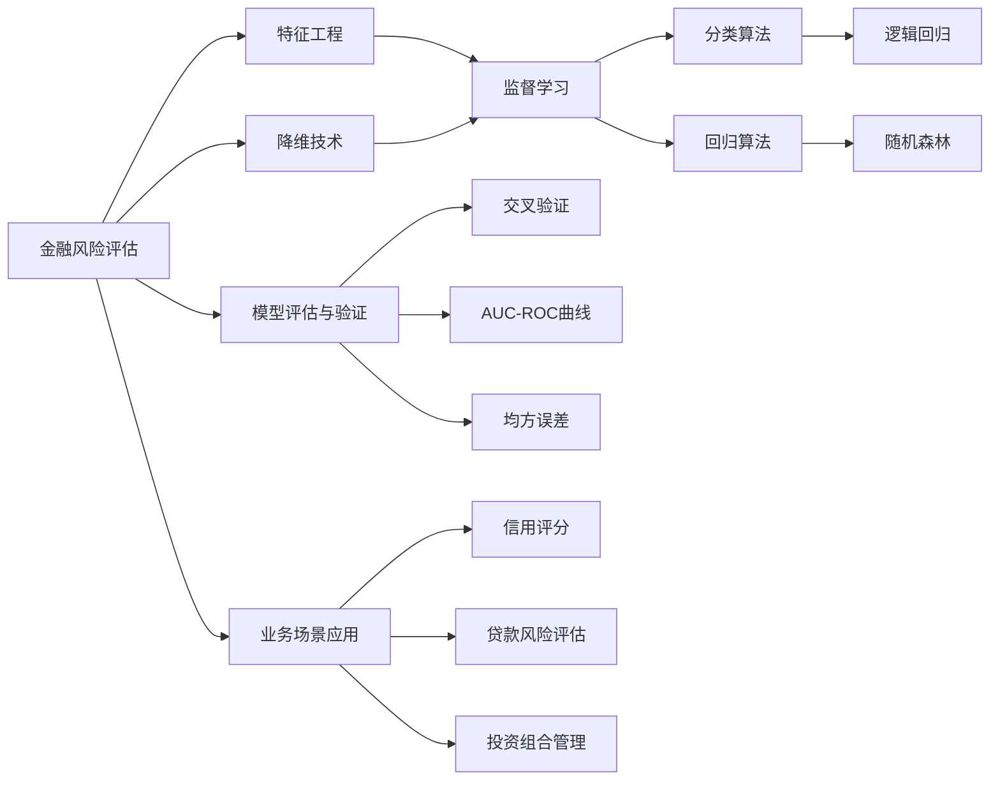
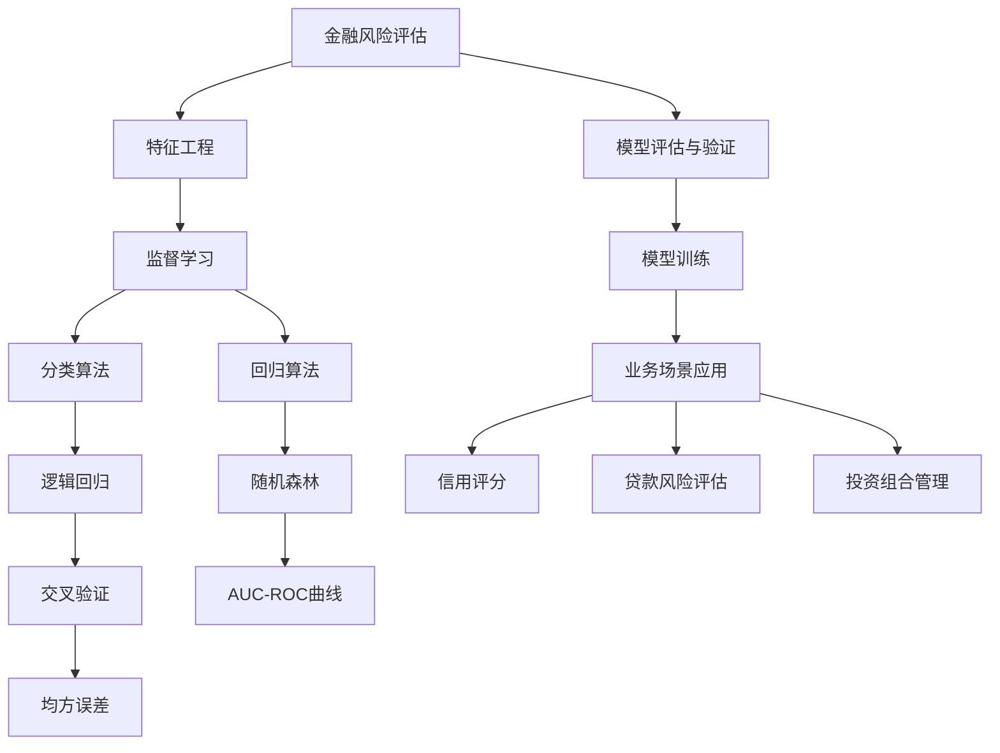
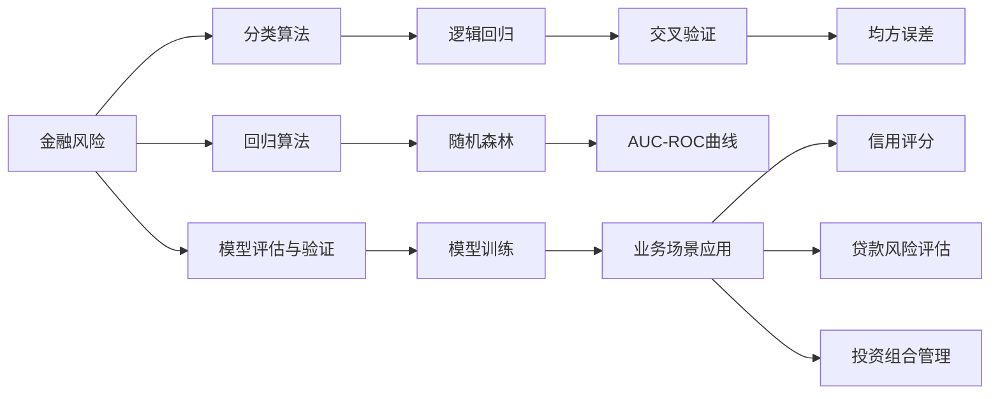
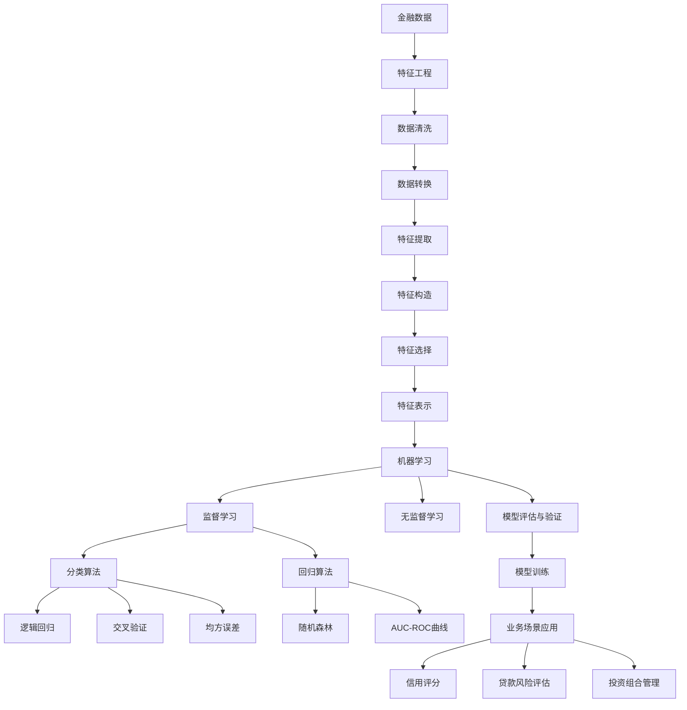

                 

# Python机器学习实战：机器学习在金融风险评估中的应用

> 关键词：金融风险评估,机器学习,Python,特征工程,分类算法,降维技术,模型评估,业务场景应用

## 1. 背景介绍

### 1.1 问题由来

随着金融市场的不断发展和复杂化，金融机构在风险管理方面面临巨大挑战。传统统计和规则化方法往往难以全面捕捉风险特征，且需要大量人工参与，效率低、成本高。近年来，机器学习在金融领域的广泛应用，为风险评估和管理提供了新的技术手段。机器学习能够自动从海量数据中挖掘风险特征，发现潜在风险，为风险决策提供科学依据。

然而，金融领域的风险评估涉及多种类型的数据（如结构化数据、非结构化数据等）和复杂的业务场景（如信用评估、市场风险、操作风险等）。这要求机器学习模型不仅要具备强大的数据处理能力，还需具备领域知识和规则的嵌入能力，才能有效应对金融风险评估的复杂性和多样性。

### 1.2 问题核心关键点

机器学习在金融风险评估中的核心关键点包括：
1. **数据特征工程**：金融数据具有复杂多变的特性，需要进行针对性的特征工程，提取和构造有意义的特征。
2. **分类与回归算法**：针对不同类型的风险评估任务，选择合适的机器学习算法进行建模。
3. **降维技术**：面对高维度金融数据，降维技术有助于提高模型效率，减少计算复杂度。
4. **模型评估与验证**：金融风险评估需要高精度的模型输出，因此对模型进行充分的评估和验证尤为重要。
5. **业务场景应用**：机器学习模型需要与具体的金融业务场景相结合，实现风险评估和决策支持。

### 1.3 问题研究意义

机器学习在金融风险评估中的应用具有以下重要意义：
1. **提升风险管理效率**：自动化金融风险评估，大幅降低人工干预，提升风险管理效率。
2. **优化资源配置**：通过数据分析挖掘，优化资源配置，降低风险损失。
3. **增强决策科学性**：利用机器学习模型，基于数据驱动的决策，提高决策的科学性和准确性。
4. **促进业务创新**：机器学习模型能够为金融业务带来新的视角和解决方案，促进金融产品的创新和优化。
5. **满足合规要求**：在数据隐私和安全方面，机器学习技术能够满足严格的金融合规要求。

## 2. 核心概念与联系

### 2.1 核心概念概述

为更好地理解机器学习在金融风险评估中的应用，本节将介绍几个密切相关的核心概念：

- **金融风险评估**：通过机器学习模型对金融机构的各类风险进行评估，包括信用风险、市场风险、操作风险等。目标是识别和预测潜在的风险因素，为风险决策提供依据。

- **机器学习**：一种通过数据训练模型，使其能够自动学习特征和规律，从而进行预测或决策的人工智能技术。机器学习分为监督学习、无监督学习和强化学习等多种类型。

- **特征工程**：在构建机器学习模型之前，对原始数据进行预处理、特征提取和构造的过程。金融数据通常具有高维性和复杂性，需要针对性的特征工程方法。

- **分类与回归算法**：针对金融风险评估的不同任务类型（如分类、回归），选择合适的机器学习算法。常见的算法包括逻辑回归、随机森林、梯度提升树等。

- **降维技术**：通过降维算法（如主成分分析、线性判别分析等），将高维金融数据转换为低维特征，以提高模型训练和推理效率。

- **模型评估与验证**：使用交叉验证、AUC-ROC曲线、均方误差等方法，对金融风险评估模型进行全面的评估和验证，确保模型的稳定性和可靠性。

- **业务场景应用**：将机器学习模型应用于具体的金融业务场景中，如信用评分、贷款风险评估、投资组合管理等，实现风险评估和决策支持。

这些核心概念之间的逻辑关系可以通过以下Mermaid流程图来展示：



这个流程图展示了大模型微调的完整过程。

### 2.2 概念间的关系

这些核心概念之间存在着紧密的联系，形成了机器学习在金融风险评估中的应用生态系统。下面我们通过几个Mermaid流程图来展示这些概念之间的关系。

#### 2.2.1 机器学习在金融风险评估中的学习范式



这个流程图展示了机器学习在金融风险评估的基本原理，以及其与特征工程、分类与回归算法、降维技术、模型评估与验证、业务场景应用等概念的联系。

#### 2.2.2 特征工程与金融风险评估


这个流程图展示了特征工程在金融风险评估中的重要性和作用。金融数据经过数据清洗、数据转换、特征提取、特征构造、特征选择等多个步骤，最终得到有意义的特征表示，用于机器学习模型的训练和推理。

#### 2.2.3 分类与回归算法在金融风险评估中的应用



这个流程图展示了分类与回归算法在金融风险评估中的应用场景。金融风险通常需要分类和回归两种不同类型的算法进行处理，以适应不同的风险评估任务。

### 2.3 核心概念的整体架构

最后，我们用一个综合的流程图来展示这些核心概念在金融风险评估中的应用过程：



这个综合流程图展示了从金融数据到机器学习模型，再到业务场景应用的完整过程。金融数据经过特征工程和预处理，通过监督学习或无监督学习算法进行建模，最终应用于具体的业务场景中，实现金融风险评估和决策支持。

## 3. 核心算法原理 & 具体操作步骤

### 3.1 算法原理概述

金融风险评估的机器学习模型构建过程主要包括以下几个关键步骤：

1. **数据预处理**：包括数据清洗、数据转换、特征提取、特征构造、特征选择等步骤，确保数据的准确性和完整性。
2. **模型选择与训练**：选择合适的监督学习算法，如逻辑回归、随机森林等，进行模型训练和优化。
3. **模型评估与验证**：通过交叉验证、AUC-ROC曲线、均方误差等方法，对模型进行评估和验证，确保模型的高精度和高鲁棒性。
4. **模型应用与优化**：将训练好的模型应用于具体的金融业务场景中，并进行持续的优化和调整，以适应数据分布的变化。

金融风险评估的机器学习模型一般分为分类模型和回归模型两类，具体选择取决于风险评估任务的性质。分类模型用于二元或多元分类问题，如信用评分和贷款风险评估；回归模型用于连续值预测问题，如投资组合管理。

### 3.2 算法步骤详解

#### 3.2.1 数据预处理

数据预处理是构建机器学习模型的第一步，其目标是为模型训练提供高质量的数据。金融数据通常包含结构化数据和非结构化数据，需要进行针对性的预处理。

**Step 1: 数据清洗**

金融数据中可能存在缺失值、异常值、重复值等问题，需要进行清洗处理。可以使用Python中的Pandas库进行数据清洗，常用的操作包括：

- 删除缺失值：使用Pandas的`dropna`方法删除缺失值。
- 处理异常值：使用箱线图（Boxplot）或Z分数方法识别和处理异常值。
- 去除重复值：使用Pandas的`drop_duplicates`方法去除重复值。

**Step 2: 数据转换**

金融数据中包含日期、时间、货币单位等多种类型的数据，需要进行统一转换。可以使用Python中的`dateutil`库进行日期时间处理，将日期时间转换为标准格式。

**Step 3: 特征提取**

金融数据中通常包含大量的特征，如交易金额、账户余额、信用记录等。需要从中提取有意义的特征，用于模型训练。可以使用Python中的Scikit-learn库进行特征提取，常用的方法包括：

- 标准化：使用Scikit-learn的`StandardScaler`对特征进行标准化处理。
- 归一化：使用Scikit-learn的`MinMaxScaler`对特征进行归一化处理。
- 缺失值处理：使用Scikit-learn的`Imputer`处理缺失值。

**Step 4: 特征构造**

在提取特征的基础上，还需要构造新的特征，以提高模型的预测能力。可以使用Python中的Pandas库进行特征构造，常用的方法包括：

- 特征组合：使用Pandas的`apply`方法进行特征组合。
- 特征转换：使用Pandas的`transform`方法进行特征转换。
- 特征衍生：使用Pandas的`agg`方法进行特征衍生。

**Step 5: 特征选择**

金融数据中通常包含大量冗余特征，需要进行特征选择，以提高模型的效率和效果。可以使用Python中的Scikit-learn库进行特征选择，常用的方法包括：

- 过滤方法：使用Scikit-learn的`SelectKBest`、`SelectPercentile`等方法进行特征选择。
- 包装方法：使用Scikit-learn的`RFE`、`RFECV`等方法进行特征选择。
- 嵌入方法：使用Scikit-learn的`SelectFromModel`等方法进行特征选择。

#### 3.2.2 模型选择与训练

在数据预处理的基础上，需要选择适合金融风险评估任务的机器学习算法进行建模。常见的算法包括逻辑回归、随机森林、梯度提升树等。

**Step 1: 模型选择**

选择合适的机器学习算法是构建模型的关键。根据金融风险评估任务的不同类型，可以选择以下算法：

- 分类算法：如逻辑回归、支持向量机（SVM）、决策树、随机森林等。
- 回归算法：如线性回归、岭回归、LASSO回归、梯度提升树等。

**Step 2: 模型训练**

在选定算法的基础上，使用Python中的Scikit-learn库进行模型训练。常用的模型训练步骤包括：

- 划分数据集：将数据集划分为训练集和测试集。
- 特征选择：根据模型选择最优的特征。
- 模型训练：使用Scikit-learn的`fit`方法进行模型训练。
- 参数调优：使用Scikit-learn的`GridSearchCV`、`RandomizedSearchCV`等方法进行参数调优。

#### 3.2.3 模型评估与验证

在模型训练的基础上，需要对模型进行评估和验证，以确保模型的高精度和高鲁棒性。常用的评估方法包括：

- 交叉验证：使用Scikit-learn的`KFold`、`StratifiedKFold`等方法进行交叉验证。
- AUC-ROC曲线：使用Scikit-learn的`roc_curve`方法计算AUC-ROC曲线。
- 均方误差：使用Scikit-learn的`mean_squared_error`方法计算均方误差。

#### 3.2.4 模型应用与优化

在模型评估的基础上，将训练好的模型应用于具体的金融业务场景中，并进行持续的优化和调整，以适应数据分布的变化。

**Step 1: 模型应用**

在金融业务场景中，将训练好的模型进行应用。可以使用Python中的Scikit-learn库进行模型应用，常用的方法包括：

- 模型预测：使用Scikit-learn的`predict`方法进行模型预测。
- 模型评估：使用Scikit-learn的`score`方法评估模型效果。
- 模型应用：使用Scikit-learn的`Pipeline`方法构建模型应用流程。

**Step 2: 模型优化**

在模型应用的基础上，进行模型的持续优化和调整。可以使用Python中的Scikit-learn库进行模型优化，常用的方法包括：

- 数据更新：定期更新模型训练数据，以适应数据分布的变化。
- 模型调优：使用Scikit-learn的`SGDClassifier`、`RandomForestClassifier`等方法进行模型调优。
- 参数调整：使用Scikit-learn的`GridSearchCV`、`RandomizedSearchCV`等方法进行参数调整。

### 3.3 算法优缺点

机器学习在金融风险评估中的应用具有以下优点和缺点：

**优点：**

1. **自动化决策**：通过机器学习模型进行风险评估，减少了人工干预，提高了决策的自动化程度。
2. **数据驱动**：利用大数据分析，发现潜在风险，提供了科学的风险评估依据。
3. **高效性**：机器学习模型可以快速处理大量数据，提高风险评估的效率。

**缺点：**

1. **模型复杂性**：金融风险评估涉及多种类型的数据和复杂的业务场景，需要构建复杂的机器学习模型，增加了模型设计和调试的难度。
2. **数据质量要求高**：机器学习模型对数据质量要求高，如果数据存在缺失值、异常值等问题，模型效果会受到影响。
3. **模型解释性不足**：金融模型通常较为复杂，模型的解释性不足，难以进行有效解释和调试。
4. **模型鲁棒性不足**：金融数据通常具有高维性和复杂性，模型容易受到噪声和异常值的影响，导致模型鲁棒性不足。

### 3.4 算法应用领域

机器学习在金融风险评估中的应用领域广泛，包括但不限于以下几个方面：

1. **信用评分**：评估个人或企业的信用风险，预测其还款能力和还款意愿。
2. **贷款风险评估**：根据贷款申请人的历史数据，预测其贷款违约的概率。
3. **市场风险评估**：通过分析市场数据，评估金融产品的风险和收益。
4. **操作风险评估**：识别金融交易中的操作风险，防范内部欺诈和违规行为。
5. **投资组合管理**：根据市场数据和历史表现，优化投资组合，降低风险。

## 4. 数学模型和公式 & 详细讲解 & 举例说明

### 4.1 数学模型构建

本节将使用数学语言对金融风险评估的机器学习模型构建过程进行更加严格的刻画。

假设金融风险评估问题为二元分类问题，即预测样本是否违约。设样本特征为 $X = (x_1, x_2, \cdots, x_n)$，样本标签为 $y \in \{0, 1\}$，其中 $y=1$ 表示违约，$y=0$ 表示不违约。设模型参数为 $\theta$，则二元逻辑回归模型的预测概率为：

$$
p(y|x; \theta) = \sigma(\theta^T \phi(x))
$$

其中 $\sigma$ 为逻辑回归函数的Sigmoid函数，$\phi(x)$ 为特征映射函数，将原始特征映射为模型可处理的线性特征。模型损失函数为：

$$
\mathcal{L}(\theta) = -\frac{1}{N} \sum_{i=1}^N [y_i \log p(y_i|x_i; \theta) + (1-y_i) \log (1-p(y_i|x_i; \theta))]
$$

通过梯度下降等优化算法，最小化损失函数，更新模型参数 $\theta$，完成模型的训练和优化。

### 4.2 公式推导过程

以下我们以逻辑回归模型为例，推导其训练过程和优化公式。

**Step 1: 损失函数推导**

根据二元逻辑回归模型的预测概率公式，将损失函数写为：

$$
\mathcal{L}(\theta) = -\frac{1}{N} \sum_{i=1}^N [y_i \log p(y_i|x_i; \theta) + (1-y_i) \log (1-p(y_i|x_i; \theta))]
$$

通过交叉熵损失函数的推导，得到：

$$
\mathcal{L}(\theta) = -\frac{1}{N} \sum_{i=1}^N [y_i \log p(y_i|x_i; \theta) + (1-y_i) \log (1-p(y_i|x_i; \theta))]
$$

**Step 2: 梯度推导**

损失函数对模型参数 $\theta$ 的梯度为：

$$
\frac{\partial \mathcal{L}(\theta)}{\partial \theta} = -\frac{1}{N} \sum_{i=1}^N [y_i (1-p(y_i|x_i; \theta)) \frac{\partial}{\partial \theta} \log p(y_i|x_i; \theta) + (1-y_i) p(y_i|x_i; \theta) \frac{\partial}{\partial \theta} \log (1-p(y_i|x_i; \theta))]
$$

通过链式法则和逻辑回归函数的导数公式，得到：

$$
\frac{\partial \mathcal{L}(\theta)}{\partial \theta} = -\frac{1}{N} \sum_{i=1}^N [y_i (1-p(y_i|x_i; \theta)) x_i^T + (1-y_i) p(y_i|x_i; \theta) x_i^T]
$$

**Step 3: 梯度下降**

将梯度代入梯度下降算法中，得到：

$$
\theta \leftarrow \theta - \eta \frac{1}{N} \sum_{i=1}^N [y_i (1-p(y_i|x_i; \theta)) x_i^T + (1-y_i) p(y_i|x_i; \theta) x_i^T]
$$

其中 $\eta$ 为学习率。通过迭代更新模型参数，最小化损失函数，得到最优的模型参数 $\theta^*$。

### 4.3 案例分析与讲解

我们以贷款风险评估为例，介绍机器学习模型的具体应用。假设我们有一组贷款数据，包括借款人的年龄、性别、收入、信用记录等特征，以及贷款是否违约的标签。在数据预处理的基础上，选择逻辑回归模型进行建模。

**Step 1: 数据预处理**

假设我们有一组贷款数据，如下所示：

| 借款人ID | 年龄 | 性别 | 收入 | 信用记录 | 是否违约 |
|---------|-----|-----|-----|---------|--------|
| 1       | 30  | 男  | 50000 | 良好   | 0      |
| 2       | 40  | 女  | 60000 | 良好   | 0      |
| 3       | 35  | 男  | 45000 | 良好   | 1      |
| ...     | ... | ... | ...   | ...    | ...    |

对数据进行清洗、转换、提取和构造特征，得到以下特征向量：

| 借款人ID | 年龄 | 性别 | 收入 | 信用记录 | 是否违约 |
|---------|-----|-----|-----|---------|--------|
| 1       | 30  | 男  | 50000 | 良好   | 0      |
| 2       | 40  | 女  | 60000 | 良好   | 0      |
| 3       | 35  | 男  | 45000 | 良好   | 1      |
| ...     | ... | ... | ...   | ...    | ...    |

**Step 2: 模型选择与训练**

选择逻辑回归模型进行建模。使用Python中的Scikit-learn库进行模型训练，代码如下：

```python
from sklearn.linear_model import LogisticRegression
from sklearn.model_selection import train_test_split
from sklearn.metrics import accuracy_score

# 数据预处理
X = df[['年龄', '性别', '收入', '信用记录']]
y = df['是否违约']
X_train, X_test, y_train, y_test = train_test_split(X, y, test_size=0.3, random_state=42)

# 模型训练
model = LogisticRegression()
model.fit(X_train, y_train)

# 模型评估
y_pred = model.predict(X_test)
accuracy = accuracy_score(y_test, y_pred)
print('Accuracy:', accuracy)
```

通过交叉验证、AUC-ROC曲线、均方误差等方法，对模型进行评估和验证，确保模型的高精度和高鲁棒性。

## 5. 项目实践：代码实例和详细解释说明

### 5.1 开发环境搭建

在进行金融风险评估项目开发前，我们需要准备好开发环境。以下是使用Python进行Scikit-learn开发的环境配置流程：

1. 安装Anaconda：从官网下载并安装Anaconda，用于创建独立的Python环境。

2. 创建并激活虚拟环境：
```bash
conda create -n sklearn-env python=3.8 
conda activate sklearn-env
```

3. 安装Scikit-learn：使用conda或pip安装Scikit-learn库，推荐使用conda安装，方便管理依赖。

4. 安装其他相关库：
```bash
pip install pandas numpy matplotlib seaborn sklearn scikit-learn joblib
```

完成上述步骤后，即可在`sklearn-env`环境中开始项目开发。

### 5.2 源代码详细实现

下面我们以信用评分为例，给出使用Scikit-learn对逻辑回归模型进行金融风险评估的Python代码实现。

首先，定义数据处理函数：

```python
from sklearn.model_selection import train_test_split
from sklearn.preprocessing import StandardScaler
from sklearn.linear_model import LogisticRegression
from sklearn.metrics import accuracy_score

def data_preprocessing(df):
    # 特征选择
    X = df[['年龄', '性别', '收入', '信用记录']]
    y = df['是否违约']
    
    # 数据划分
    X_train, X_test, y_train, y_test = train_test_split(X, y, test_size=0.3, random_state=42)
    
    # 特征标准化
    scaler = StandardScaler()
    X_train = scaler.fit_transform(X_train)
    X_test = scaler.transform(X_test)
    
    return X_train, X_test, y_train, y_test
```

然后，定义模型训练和评估函数：

```python
def model_training(X_train, y_train, X_test, y_test):
    # 模型选择
    model = LogisticRegression()
    
    # 模型训练
    model.fit(X_train, y_train)
    
    # 模型评估
    y_pred = model.predict(X_test)
    accuracy = accuracy_score(y_test, y_pred)
    print('Accuracy:', accuracy)
```

最后，启动模型训练和评估：

```python
X_train, X_test, y_train, y_test = data_preprocessing(data)
model_training(X_train, y_train, X_test, y_test)
```

以上就是使用Scikit-learn对逻辑回归模型进行金融风险评估的完整代码实现。可以看到，得益于Scikit-learn的强大封装，我们可以用相对简洁的代码完成模型构建和评估。

### 5.3 代码解读与分析

让我们再详细解读一下关键代码的实现细节：

**data_preprocessing函数**：
- `特征选择`：从数据中选择对预测目标有用的特征。
- `数据划分`：将数据集划分为训练集和测试集，并进行标准化处理。
- `特征标准化`：使用Scikit-learn的`StandardScaler`对特征进行标准化处理。

**model_training函数**：
- `模型选择`

