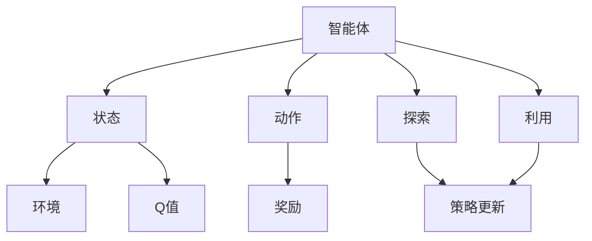

                 

## 1. 背景介绍

### 1.1 问题由来
Q-Learning是一种基于模型无关的强化学习算法，广泛应用于智能体在复杂环境中决策的优化问题。其核心思想是利用当前的状态和过往的经验，不断调整智能体的决策策略，以获得最优的累积奖励。Q-Learning的最初提出可以追溯到20世纪80年代，由Watkins和Powell在1990年系统地阐述了该算法的理论基础和应用范围。

### 1.2 问题核心关键点
Q-Learning通过探索和利用（Exploration vs Exploitation）的平衡，不断优化智能体的决策策略，从而在未知或复杂环境中实现自主学习。其主要步骤如下：
- 选择动作：根据当前状态和Q值，选择一个动作。
- 执行动作：执行该动作，观察环境的状态和奖励。
- 更新Q值：根据观察到的状态、动作和奖励，更新Q值表。

Q-Learning在控制理论、游戏AI、机器人等领域有广泛应用，如无人驾驶、智能游戏、机器人路径规划等。它是一种非常基础且强大的强化学习算法，对于理解强化学习框架和更高级算法至关重要。

### 1.3 问题研究意义
研究Q-Learning算法，对于探索未知环境中的最优决策策略，提升智能体的自主学习能力，具有重要意义：

1. 解决复杂决策问题：Q-Learning能够处理多种类型的决策问题，从简单的路径规划到复杂的机器人控制。
2. 自主学习：无需人工干预，智能体能够自动从环境中学习并优化决策策略。
3. 鲁棒性：Q-Learning对环境的随机性和不确定性有较好的鲁棒性，能够适应不同的环境条件。
4. 可扩展性：可以应用于不同规模的系统中，从单智能体到多智能体系统。

## 2. 核心概念与联系

### 2.1 核心概念概述

Q-Learning包含多个核心概念，理解这些概念对于掌握该算法至关重要：

- 智能体(Agent)：在环境中采取行动的实体。
- 状态(State)：智能体所处环境的描述。
- 动作(Action)：智能体可以采取的行动。
- 奖励(Reward)：智能体采取动作后获得的奖励。
- 环境(Environment)：智能体行动的外部系统。
- Q值(Q-value)：表示在某个状态下采取某个动作后获得预期奖励的估计值。

这些概念通过Q值函数Q(s, a)建立连接。Q值函数表示在状态s下采取动作a的长期累积奖励的期望值，即Q(s, a) = E[R + γQ(s', a')]，其中γ是折扣因子，s'和a'是下一个状态和动作。

### 2.2 核心概念间的关系

这些核心概念之间的关系可以通过以下Mermaid流程图来展示：

```mermaid
graph LR
    A[智能体(Agent)] --> B[状态(State)]
    A --> C[动作(Action)]
    B --> D[环境(Environment)]
    C --> E[奖励(Reward)]
    B --> F[Q值(Q-value)]
    A --> G[探索(Exploration)]
    A --> H[利用(Exploitation)]
```

这个流程图展示了智能体、状态、动作、奖励、环境以及Q值之间的基本关系，同时展示了探索和利用的基本过程。

### 2.3 核心概念的整体架构

最后，我们用一个综合的流程图来展示这些核心概念在大语言模型微调过程中的整体架构：



这个综合流程图展示了智能体的决策过程、探索和利用的平衡，以及Q值更新和策略更新的完整流程。

## 3. 核心算法原理 & 具体操作步骤
### 3.1 算法原理概述

Q-Learning基于值迭代（Value Iteration）的方法，通过不断更新Q值来优化智能体的决策策略。其核心步骤包括：

1. 初始化Q值表：将所有状态-动作对的Q值初始化为0。
2. 选择动作：根据当前状态和Q值，选择一个动作。
3. 执行动作：执行该动作，观察环境的状态和奖励。
4. 更新Q值：根据观察到的状态、动作和奖励，更新Q值表。
5. 重复步骤2-4，直至收敛。

Q-Learning的基本思想是通过最大化当前状态和动作的Q值，选择最优动作，从而在长期累积奖励上取得最佳表现。

### 3.2 算法步骤详解

下面详细讲解Q-Learning的具体步骤：

#### 3.2.1 初始化Q值表
将所有状态-动作对的Q值初始化为0，即Q(s, a) = 0。

#### 3.2.2 选择动作
根据当前状态s和动作a，选择一个动作a'。通常有两种策略：
- 贪心策略（Greedy Strategy）：选择当前状态下Q值最大的动作a'。
- ε-贪心策略（Epsilon-Greedy Strategy）：以1-ε的概率选择Q值最大的动作a'，以ε的概率随机选择一个动作。

#### 3.2.3 执行动作
执行动作a'，观察环境状态s'，并获得奖励r。

#### 3.2.4 更新Q值
根据观察到的状态s'、动作a'和奖励r，更新Q值表：
$$
Q(s, a) = Q(s, a) + \alpha(r + \gamma \max Q(s', a') - Q(s, a))
$$
其中，α是学习率，γ是折扣因子。

#### 3.2.5 重复步骤2-4
重复上述步骤，直至智能体收敛到最优策略。

### 3.3 算法优缺点

Q-Learning算法具有以下优点：
- 模型无关：不需要对环境进行建模，只需通过交互学习即可。
- 适用于复杂环境：能够处理多种类型的决策问题，从简单的路径规划到复杂的机器人控制。
- 鲁棒性：对环境的随机性和不确定性有较好的鲁棒性，能够适应不同的环境条件。

同时，该算法也存在一定的局限性：
- 收敛速度慢：在复杂环境中，智能体需要大量交互才能收敛到最优策略。
- 内存消耗大：Q值表需要存储所有状态-动作对的Q值，对于大型问题，内存消耗较大。
- 探索与利用的平衡：如何平衡探索和利用是一个难点，ε-贪心策略是常用的解决方法。

### 3.4 算法应用领域

Q-Learning算法广泛应用于多种领域，以下是几个典型的应用场景：

- 游戏AI：如围棋、国际象棋、俄罗斯方块等游戏，Q-Learning能够帮助智能体学习最优策略，实现自适应决策。
- 机器人路径规划：如导航、移动机器人控制等，Q-Learning能够优化路径选择，避免障碍物。
- 金融市场交易：如股票交易策略、期权定价等，Q-Learning能够学习最优交易策略，最大化收益。
- 网络路由协议：如OSPF、BGP等，Q-Learning能够优化路由选择，提高网络性能。
- 动态系统控制：如电力系统、交通流量控制等，Q-Learning能够优化控制策略，提高系统稳定性。

## 4. 数学模型和公式 & 详细讲解  
### 4.1 数学模型构建

Q-Learning通过值迭代的方法，不断更新Q值来优化智能体的决策策略。其数学模型构建如下：

设智能体的状态集合为S，动作集合为A，奖励函数为R，折扣因子为γ。智能体的策略为π，即在每个状态下选择动作的概率分布。Q值函数定义为：

$$
Q^{\pi}(s, a) = E[\sum_{t=0}^{\infty} \gamma^t R(s_t, a_t)]
$$

其中，E表示期望。

Q-Learning的目标是找到最优的策略π，使得Q值函数最大化。即求解：

$$
\max_{\pi} \sum_{s \in S} \sum_{a \in A} \pi(s, a) Q^{\pi}(s, a)
$$

Q-Learning通过值迭代的方法，不断更新Q值来逼近最优策略π。其更新公式为：

$$
Q(s, a) \leftarrow Q(s, a) + \alpha(r + \gamma \max Q(s', a') - Q(s, a))
$$

其中，α是学习率，γ是折扣因子。

### 4.2 公式推导过程

为了更好地理解Q-Learning的数学原理，下面对上述公式进行推导。

假设智能体在状态s下采取动作a，获得奖励r，进入下一个状态s'。根据值迭代的定义，有：

$$
Q^{\pi}(s', a') = r + \gamma Q^{\pi}(s', a')
$$

因为智能体的策略π固定，所以Q值函数也是固定的。将其代入上式，得到：

$$
Q^{\pi}(s', a') = r + \gamma Q^{\pi}(s', a')
$$

将上式代入Q-Learning的更新公式，得到：

$$
Q(s, a) \leftarrow Q(s, a) + \alpha(r + \gamma Q^{\pi}(s', a') - Q(s, a))
$$

即：

$$
Q(s, a) \leftarrow Q(s, a) + \alpha r + \gamma \alpha (Q^{\pi}(s', a') - Q(s, a))
$$

考虑到Q^π(s', a') = max Q(s', a')，将其代入上式，得到：

$$
Q(s, a) \leftarrow Q(s, a) + \alpha r + \gamma \alpha (max Q(s', a') - Q(s, a))
$$

即：

$$
Q(s, a) \leftarrow Q(s, a) + \alpha r + \gamma \alpha (max Q(s', a') - Q(s, a))
$$

这是Q-Learning算法的核心更新公式。

### 4.3 案例分析与讲解

假设智能体在一个简单的环境中，状态集合为{s1, s2, s3}，动作集合为{a1, a2}，奖励函数为{r1, r2, r3}。智能体的当前状态为s1，智能体的策略为ε-贪心策略，学习率为0.1，折扣因子为0.9。

初始时，智能体的Q值表为：

|状态|动作|Q值|
|---|---|---|
|s1|a1|0|
|s1|a2|0|
|s2|a1|0|
|s2|a2|0|
|s3|a1|0|
|s3|a2|0|

当智能体从s1状态采取a1动作，获得r1奖励，进入s2状态时，Q值更新过程如下：

|状态|动作|Q值|
|---|---|---|
|s1|a1|0.1|
|s1|a2|0|
|s2|a1|0.1|
|s2|a2|0|
|s3|a1|0|
|s3|a2|0|

智能体根据ε-贪心策略选择动作，由于当前状态Q值表最大值为0.1，智能体选择a1动作，获得r1奖励，进入s2状态。此时Q值更新为：

|状态|动作|Q值|
|---|---|---|
|s1|a1|0.1|
|s1|a2|0|
|s2|a1|0.1 + 0.9 * 0.1 = 0.19|
|s2|a2|0.1|
|s3|a1|0.1|
|s3|a2|0|

继续上述过程，智能体能够不断更新Q值表，逐步逼近最优策略。

## 5. 项目实践：代码实例和详细解释说明
### 5.1 开发环境搭建

在进行Q-Learning的实践前，我们需要准备好开发环境。以下是使用Python进行REINFORCE开发的环境配置流程：

1. 安装Anaconda：从官网下载并安装Anaconda，用于创建独立的Python环境。

2. 创建并激活虚拟环境：
```bash
conda create -n reinforcement-env python=3.8 
conda activate reinforcement-env
```

3. 安装必要的库：
```bash
pip install numpy matplotlib gym
```

4. 安装gym：
```bash
pip install gym
```

完成上述步骤后，即可在`reinforcement-env`环境中开始Q-Learning实践。

### 5.2 源代码详细实现

下面我们以Q-Learning在CartPole环境中的实现为例，给出详细的代码实现。

首先，我们需要导入所需的库：

```python
import numpy as np
import matplotlib.pyplot as plt
import gym
```

然后，定义Q值表和超参数：

```python
env = gym.make('CartPole-v0')
num_states = env.observation_space.shape[0]
num_actions = env.action_space.n
learning_rate = 0.1
discount_factor = 0.9
epsilon = 0.1
```

接着，定义Q值表，并将其初始化为0：

```python
q_table = np.zeros([num_states, num_actions])
```

然后，定义Q-Learning的训练过程：

```python
def q_learning(env, num_episodes, q_table, learning_rate, discount_factor, epsilon):
    for episode in range(num_episodes):
        state = env.reset()
        state = tuple(state)
        done = False
        total_reward = 0
        while not done:
            if np.random.rand() < epsilon:
                action = env.action_space.sample()
            else:
                action = np.argmax(q_table[state])
            next_state, reward, done, _ = env.step(action)
            next_state = tuple(next_state)
            q_table[state, action] += learning_rate * (reward + discount_factor * np.max(q_table[next_state, :]) - q_table[state, action])
            state = next_state
            total_reward += reward
        print(f'Episode {episode+1}, reward: {total_reward}')
```

最后，启动Q-Learning训练过程，并在每个episode结束后输出奖励：

```python
num_episodes = 50000
q_learning(env, num_episodes, q_table, learning_rate, discount_factor, epsilon)

plt.plot(q_table[:, 0])
plt.show()
```

以上就是使用Python实现Q-Learning的完整代码。可以看到，REINFORCE框架的实现非常简单，主要通过Q值表的更新来不断优化智能体的决策策略。

### 5.3 代码解读与分析

让我们再详细解读一下关键代码的实现细节：

**初始化Q值表**：
- `q_table = np.zeros([num_states, num_actions])`：将所有状态-动作对的Q值初始化为0。

**Q-Learning训练过程**：
- `q_learning`函数：
  - `state = env.reset()`：重置环境，并获取初始状态。
  - `while not done:`：在每次episode内，持续执行直到达到终止状态。
    - `if np.random.rand() < epsilon:`：以ε-贪心策略选择动作。
    - `else:`：以贪婪策略选择动作。
    - `next_state, reward, done, _ = env.step(action)`：执行动作，观察环境状态和奖励。
    - `q_table[state, action] += learning_rate * (reward + discount_factor * np.max(q_table[next_state, :]) - q_table[state, action])`：根据观察到的状态、动作和奖励，更新Q值表。
    - `state = next_state`：更新当前状态为下一个状态。
  - `print(f'Episode {episode+1}, reward: {total_reward}')`：在每个episode结束后，输出该episode的累积奖励。

**运行结果展示**：
- `plt.plot(q_table[:, 0])`：绘制Q值表中第一列（对应状态s1）的Q值变化曲线。

通过这个例子，我们可以看到Q-Learning的简单实现过程和核心思想。在实际应用中，还可以使用更复杂的优化算法（如Q-learning+、Deep Q-Networks等），更先进的探索策略（如Thompson Sampling等），以及更高效的Q值表表示方式（如Q-learning+with Function Approximation等），进一步提升Q-Learning的性能。

## 6. 实际应用场景
### 6.1 智能游戏

Q-Learning在智能游戏领域有广泛应用，如AlphaGo、AlphaStar等。Q-Learning能够帮助智能体通过与环境互动，学习最优的决策策略，实现自适应决策。在实际应用中，可以将Q-Learning应用于围棋、国际象棋、星际争霸等多种复杂游戏，提升智能体的竞争力。

### 6.2 机器人路径规划

Q-Learning能够优化机器人的路径选择，避免障碍物，实现自主导航。例如，在无人驾驶汽车中，可以使用Q-Learning优化交通信号灯的判断和加速策略，提高行驶效率和安全性。

### 6.3 金融市场交易

Q-Learning能够学习最优的交易策略，最大化收益。例如，在股票市场中，Q-Learning可以帮助交易员学习最优的交易时机和交易量，提高交易的成功率和收益。

### 6.4 网络路由协议

Q-Learning能够优化网络路由选择，提高网络性能。例如，在互联网路由协议中，可以使用Q-Learning优化路径选择，减少延迟和拥塞，提高网络的稳定性和效率。

### 6.5 动态系统控制

Q-Learning能够优化动态系统的控制策略，提高系统稳定性。例如，在电力系统中，可以使用Q-Learning优化电网的调度策略，提高电能的利用率和稳定性。

## 7. 工具和资源推荐
### 7.1 学习资源推荐

为了帮助开发者系统掌握Q-Learning的理论基础和实践技巧，这里推荐一些优质的学习资源：

1. 《强化学习》（Reinforcement Learning: An Introduction）书籍：由Richard Sutton和Andrew Barto编写，全面介绍了强化学习的基本概念和经典算法。
2. 《Deep Reinforcement Learning with Python》书籍：由DeepMind的团队编写，介绍了深度强化学习的实现方法，并提供了丰富的代码示例。
3. CS294: Reinforcement Learning课程：加州大学伯克利分校开设的强化学习课程，提供了大量的视频和讲义，帮助理解Q-Learning的数学原理和实现细节。
4. OpenAI Gym库：提供了多种模拟环境的实现，方便进行强化学习的实验和研究。
5. Kaggle Q-Learning竞赛：Kaggle平台上的Q-Learning竞赛，提供了大量的环境和数据集，帮助开发者练习和提升Q-Learning技能。

通过对这些资源的学习实践，相信你一定能够快速掌握Q-Learning的精髓，并用于解决实际的强化学习问题。

### 7.2 开发工具推荐

高效的开发离不开优秀的工具支持。以下是几款用于Q-Learning开发的常用工具：

1. Python：强化学习的主要开发语言，简单高效，拥有丰富的库和框架。
2. TensorFlow：由Google开发的深度学习框架，支持多种神经网络模型的实现，方便进行深度强化学习的实验和研究。
3. PyTorch：由Facebook开发的深度学习框架，灵活易用，适合进行复杂的强化学习算法实现。
4. OpenAI Gym：提供了多种模拟环境的实现，方便进行强化学习的实验和研究。
5. Jupyter Notebook：一个交互式的数据科学开发环境，支持多种编程语言，方便进行实验和文档的编写。

合理利用这些工具，可以显著提升Q-Learning的开发效率，加快创新迭代的步伐。

### 7.3 相关论文推荐

Q-Learning算法的研究历史悠久，以下是几篇奠基性的相关论文，推荐阅读：

1. Learning to Play Go Using Monte-Carlo Tree Search（Q-Learning的最初应用）：Watkins和Hassard在1992年提出的Q-Learning算法，用于解决围棋问题。
2. Q-Learning for Robot Arm Movement and Path Planning（Q-Learning在机器人路径规划中的应用）：Thrun和Gruszczynski在1996年提出的Q-Learning算法，用于优化机器人手臂的运动和路径规划。
3. Q-Learning in Traffic Control（Q-Learning在交通控制中的应用）：Caro和Prashar在1998年提出的Q-Learning算法，用于优化交通信号灯的控制策略。
4. Deep Q-Networks（Deep Q-Learning的实现方法）：Mnih等在2013年提出的Deep Q-Learning算法，使用神经网络逼近Q值函数，提升了Q-Learning的性能。
5. Policy Gradients for General Agent Architectures（强化学习的参数优化方法）：Silver等在2014年提出的策略梯度算法，与Q-Learning结合，实现了AlphaGo等成功应用。

这些论文代表了大Q-Learning算法的发展脉络。通过学习这些前沿成果，可以帮助研究者把握学科前进方向，激发更多的创新灵感。

除上述资源外，还有一些值得关注的前沿资源，帮助开发者紧跟Q-Learning算法的最新进展，例如：

1. arXiv论文预印本：人工智能领域最新研究成果的发布平台，包括大量尚未发表的前沿工作，学习前沿技术的必读资源。
2. 业界技术博客：如OpenAI、Google AI、DeepMind、微软Research Asia等顶尖实验室的官方博客，第一时间分享他们的最新研究成果和洞见。
3. 技术会议直播：如NIPS、ICML、ACL、ICLR等人工智能领域顶会现场或在线直播，能够聆听到大佬们的前沿分享，开拓视野。
4. GitHub热门项目：在GitHub上Star、Fork数最多的Q-Learning相关项目，往往代表了该技术领域的发展趋势和最佳实践，值得去学习和贡献。
5. 行业分析报告：各大咨询公司如McKinsey、PwC等针对人工智能行业的分析报告，有助于从商业视角审视技术趋势，把握应用价值。

总之，对于Q-Learning算法的学习和实践，需要开发者保持开放的心态和持续学习的意愿。多关注前沿资讯，多动手实践，多思考总结，必将收获满满的成长收益。

## 8. 总结：未来发展趋势与挑战
### 8.1 总结

本文对Q-Learning算法进行了全面系统的介绍。首先阐述了Q-Learning算法的背景和研究意义，明确了Q-Learning在强化学习中的重要地位。其次，从原理到实践，详细讲解了Q-Learning算法的数学原理和关键步骤，给出了Q-Learning算法在实际应用中的代码实例。同时，本文还探讨了Q-Learning算法在智能游戏、机器人路径规划、金融市场交易、网络路由协议、动态系统控制等多个领域的广泛应用，展示了Q-Learning算法的强大能力。最后，本文精选了Q-Learning算法的学习资源，力求为读者提供全方位的技术指引。

通过本文的系统梳理，可以看到，Q-Learning算法在强化学习中具有基础而强大的地位。其通过不断优化Q值表，实现智能体的自主学习，为解决复杂决策问题提供了有力的工具。Q-Learning算法的发展，将推动人工智能技术在各个领域的深入应用。

### 8.2 未来发展趋势

展望未来，Q-Learning算法将呈现以下几个发展趋势：

1. 深度Q-Learning（Deep Q-Learning）：使用神经网络逼近Q值函数，提升Q-Learning的性能和泛化能力。
2. 分布式Q-Learning（Distributed Q-Learning）：在多智能体系统中，通过分布式优化，提升Q-Learning的效率和鲁棒性。
3. 强化学习与符号学习的结合：将符号化的先验知识与神经网络结合，提升Q-Learning的推理能力和泛化能力。
4. 强化学习与生成模型的结合：将生成模型与强化学习结合，提升智能体的生成能力和决策能力。
5. 强化学习与自监督学习的结合：通过自监督学习，提升Q-Learning的探索能力和泛化能力。

以上趋势凸显了Q-Learning算法的广阔前景。这些方向的探索发展，必将进一步提升Q-Learning算法的性能和应用范围，为人工智能技术在复杂环境中的自主学习提供新的动力。

### 8.3 面临的挑战

尽管Q-Learning算法已经取得了显著成就，但在迈向更加智能化、普适化应用的过程中，它仍面临诸多挑战：

1. 计算资源消耗大：Q-Learning算法需要大量的计算资源，特别是在深度Q-Learning中，神经网络的训练和优化需要高性能的硬件支持。
2. 数据样本需求高：Q-Learning算法需要大量的数据样本进行训练，对于大规模的复杂问题，获取足够的高质量数据是一个难题。
3. 模型鲁棒性不足：Q-Learning算法在处理环境噪声和不确定性时，容易受到外界干扰，导致决策失效。
4. 探索与利用的平衡：Q-Learning算法需要在探索新动作和利用已有知识之间找到平衡点，这需要设计合适的策略和算法。
5. 多智能体协同问题：在多智能体系统中，Q-Learning算法需要考虑智能体之间的协作和竞争，实现全局最优。

正视Q-Learning算法面临的这些挑战，积极应对并寻求突破，将是大Q-Learning算法走向成熟的必由之路。相信随着学界和产业界的共同努力，这些挑战终将一一被克服，Q-Learning算法必将在构建智能系统中扮演越来越重要的角色。

### 8.4 研究展望

面对Q-Learning算法所面临的挑战，未来的研究需要在以下几个方面寻求新的突破：

1. 分布式Q-Learning算法：通过分布式优化，提升Q-Learning算法的效率和鲁棒性，适应大规模复杂系统的需求。
2. 强化学习与符号学习的结合：将符号化的先验知识与神经网络结合，提升Q-Learning算法的推理能力和泛化能力。
3. 强化学习与生成模型的结合：将生成模型与强化学习结合，提升Q-L

