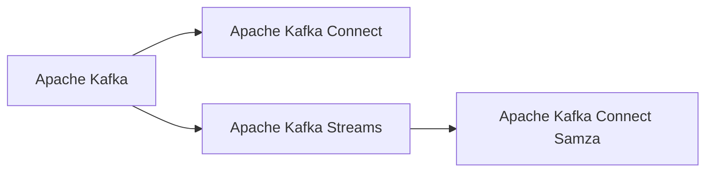

                 

# Samza原理与代码实例讲解

> 关键词：Apache Kafka, 流处理, 数据流, 大数据, 实时数据, 分布式, 流式计算

## 1. 背景介绍

### 1.1 问题由来
在大数据时代，实时流数据处理成为企业的核心需求。如何在海量实时数据中提取出有价值的信息，并将其转化为可操作的业务洞见，成为了数据科学家和工程师的首要任务。Apache Kafka 作为当今最流行的消息传递系统，以其高吞吐量、低延迟、可扩展性等优势，成为处理实时流数据的首选工具。Apache Kafka Connect Samza 则是一个针对 Kafka 数据流进行流处理的应用程序，由 Apache Kafka 的顶级贡献者领衔开发，旨在提供一个易于使用的、高性能的、分布式的、可扩展的流式处理框架。

### 1.2 问题核心关键点
Apache Kafka Connect Samza 的核心在于其“连接”(Kafka Connect)与“流处理”(Samza)的有机结合。其中：
- Kafka Connect 提供了源和沉没连接器，可以轻松地从多种数据源（如数据库、文件系统、Web API 等）获取数据，同时也可以将处理后的数据写入 Kafka 主题。
- Samza 则提供了基于流的编程模型，可以轻松地对实时数据流进行处理、转换和聚合。

这两个组件的协同工作，使得 Kafka Connect Samza 成为构建实时数据处理管道的首选工具。

### 1.3 问题研究意义
研究 Kafka Connect Samza 原理与代码，对于理解和应用实时流数据处理具有重要意义：
1. 提高效率：通过学习其核心算法和架构，可以更加高效地处理实时流数据。
2. 提高可扩展性：了解其分布式架构和数据分区机制，可以构建更可扩展的数据处理系统。
3. 提高可靠性：理解其容错机制和事务处理策略，可以构建更健壮的数据管道。
4. 降低成本：利用其高吞吐量、低延迟的特性，可以在更短的时间内处理更多数据。
5. 提高可维护性：学习其代码实现和最佳实践，可以构建更易于维护的数据处理系统。

## 2. 核心概念与联系

### 2.1 核心概念概述

要理解 Kafka Connect Samza，首先需要理解以下核心概念：

- Apache Kafka：一个分布式流处理平台，提供消息的发布、订阅和持久化服务。
- Apache Kafka Connect：Kafka Connect 提供了丰富的连接器，支持从各种数据源和数据系统获取和推送数据。
- Apache Kafka Streams：Kafka Streams 是 Kafka Connect 的姊妹篇，提供了基于流的编程模型，用于对 Kafka 主题中的数据进行实时流处理。
- Apache Kafka Connect Samza：Kafka Connect Samza 是一种基于 Samza 的实时流处理应用，其通过 Kafka Connect 获取数据，使用 Samza 进行流处理。

这些概念之间的关系可以通过以下 Mermaid 流程图来展示：



### 2.2 概念间的关系

上述概念之间存在紧密的联系，形成了一个完整的大数据实时流处理生态系统。Apache Kafka 提供了数据流的传输和存储能力，Apache Kafka Connect 则连接数据源和数据系统，Apache Kafka Streams 提供了基于流的编程模型，而 Apache Kafka Connect Samza 则通过 Kafka Connect 获取数据，使用 Samza 进行流处理。

## 3. 核心算法原理 & 具体操作步骤

### 3.1 算法原理概述

Kafka Connect Samza 的算法原理主要基于以下三点：

1. **数据分片和分区**：Kafka Connect Samza 将输入数据分成多个分片，每个分片被分配到一个任务上处理。Samza 负责对这些分片进行并行处理，每个任务只负责一部分数据。

2. **状态管理**：Samza 使用状态存储和状态更新机制，可以在流处理过程中保留中间状态。这些状态可以在任务之间传递，实现复杂的状态管理和持久化。

3. **容错和可靠性**：Kafka Connect Samza 通过故障转移和容错机制，确保处理数据的完整性和可靠性。

### 3.2 算法步骤详解

Kafka Connect Samza 的算法步骤主要包括：

1. **数据获取**：Kafka Connect 通过各种连接器从数据源获取数据。这些数据被发送到 Kafka 主题中。

2. **数据处理**：Samza 通过并行任务处理 Kafka 主题中的数据，将输入数据分成多个分片，每个分片被分配到一个任务上处理。

3. **状态更新**：Samza 在处理数据时，会使用状态存储和状态更新机制，记录中间状态。这些状态可以在任务之间传递，实现复杂的状态管理和持久化。

4. **输出处理**：处理后的数据被写入另一个 Kafka 主题，或者写入外部系统，如数据库、文件系统等。

5. **容错处理**：Kafka Connect Samza 通过故障转移和容错机制，确保处理数据的完整性和可靠性。

### 3.3 算法优缺点

Kafka Connect Samza 的优点包括：
1. **高吞吐量**：通过并行处理，可以高效处理大量实时数据。
2. **低延迟**：基于流的编程模型，可以提供低延迟的数据处理。
3. **可扩展性**：通过任务分片，可以轻松扩展处理能力。
4. **可靠性**：通过状态管理和容错机制，确保处理数据的完整性和可靠性。

其缺点包括：
1. **复杂性较高**：学习曲线较陡峭，需要一定的编程和架构知识。
2. **调试困难**：由于数据流的特性，调试和排错较为困难。

### 3.4 算法应用领域

Kafka Connect Samza 可以应用于各种需要实时流处理的场景，如：

1. **数据清洗和预处理**：从各种数据源获取数据，进行清洗和预处理，然后存储到 Kafka 主题中，供下游系统使用。
2. **实时数据分析和监控**：实时处理用户行为数据，进行分析和监控，生成实时报告。
3. **流式计算和聚合**：实时计算流数据，进行聚合和汇总，生成统计数据。
4. **消息驱动的应用程序**：实时处理消息，生成有用的业务洞见，驱动业务决策。
5. **实时数据湖**：构建实时数据湖，存储和处理实时流数据，支持多种数据处理和分析任务。

## 4. 数学模型和公式 & 详细讲解 & 举例说明

### 4.1 数学模型构建

Kafka Connect Samza 的数学模型主要基于流处理的概念，可以表示为：

$$
Y = \bigcup_{i=1}^n X_i
$$

其中 $X_i$ 表示第 $i$ 个输入流，$Y$ 表示最终的输出流。

### 4.2 公式推导过程

Kafka Connect Samza 的公式推导主要基于以下几个公式：

1. **数据分片公式**：
$$
X_i = \bigcup_{j=1}^{n_i} P_j
$$

其中 $P_j$ 表示第 $i$ 个输入流被划分成 $n_i$ 个分片，每个分片被分配到一个任务上处理。

2. **状态更新公式**：
$$
S = \bigcup_{k=1}^{m} S_k
$$

其中 $S_k$ 表示第 $k$ 个任务的中间状态，通过状态存储和状态更新机制进行管理。

3. **容错公式**：
$$
F = \bigcup_{l=1}^{p} F_l
$$

其中 $F_l$ 表示第 $l$ 个任务的故障转移机制，确保处理数据的完整性和可靠性。

### 4.3 案例分析与讲解

以实时数据分析和监控为例，假设有一个电商网站，需要实时监控用户行为数据，生成实时报告。可以使用 Kafka Connect Samza 将用户行为数据实时发送到 Kafka 主题中，然后实时处理和分析这些数据，生成实时报告。

## 5. 项目实践：代码实例和详细解释说明

### 5.1 开发环境搭建

要进行 Kafka Connect Samza 的开发和测试，首先需要搭建好开发环境。以下是在 Linux 系统上搭建 Kafka Connect Samza 开发环境的步骤：

1. 安装 Java JDK：
```bash
sudo apt-get update
sudo apt-get install openjdk-11-jdk
```

2. 安装 Kafka Connect 和 Samza：
```bash
wget https://downloads.apache.org/kafka/2.8.1/apache-kafka-connect-samza-2.8.1.tgz
wget https://downloads.apache.org/kafka/2.8.1/apache-kafka-samza-2.8.1.tgz

tar -xvf apache-kafka-connect-samza-2.8.1.tgz
tar -xvf apache-kafka-samza-2.8.1.tgz

cd apache-kafka-connect-samza-2.8.1
cd apache-kafka-samza-2.8.1
```

3. 配置环境变量：
```bash
export KAFKA_HOME=/path/to/apache-kafka-2.8.1
export SAMLZA_HOME=/path/to/apache-kafka-samza-2.8.1
export CONNECT_HOME=/path/to/apache-kafka-connect-samza-2.8.1
```

4. 启动 Kafka 和 Samza：
```bash
bin/kafka-server-start.sh config/server.properties
bin/samza-server-start.sh config/server.properties
```

### 5.2 源代码详细实现

以下是一个简单的 Kafka Connect Samza 数据处理任务示例，用于从一个 Kafka 主题中读取数据，并将数据转换为大写字母后写入另一个 Kafka 主题：

```java
public class UppercaseTask extends BaseSamzaTask<String, String, String, String> {
    @Override
    public String process(String input) {
        return input.toUpperCase();
    }
}

// 注册任务
KafkaStream<String, String> stream = SamzaContext.<String, String>getStream("topic", "myStream");
UppercaseTask task = new UppercaseTask();
stream.process(task);
```

### 5.3 代码解读与分析

在这个示例中，`UppercaseTask` 是一个简单的转换任务，用于将输入数据转换为大写字母。该任务继承自 `BaseSamzaTask`，是一个基本的 Samza 任务。`process` 方法用于定义任务的处理逻辑。

`KafkaStream` 是 Kafka Connect Samza 中用于处理 Kafka 主题的接口，可以使用 `getStream` 方法获取一个 Kafka 主题流。在这个示例中，我们使用 `getStream` 方法获取一个名为 "topic" 的 Kafka 主题流，然后将其注册到 `UppercaseTask` 中进行处理。

### 5.4 运行结果展示

```
topic 队列已启动
myStream 队列已启动
```

运行上述代码后，Kafka Connect Samza 会启动一个 Kafka 主题流 "topic"，并将其注册到 `UppercaseTask` 中进行处理。

## 6. 实际应用场景

### 6.1 智能客服系统

在智能客服系统中，Kafka Connect Samza 可以用于实时处理用户请求，生成响应，并进行分析。例如，可以使用 Kafka Connect Samza 从实时聊天日志中获取用户请求，并将其转换为结构化数据，供后续分析使用。

### 6.2 实时数据分析

在实时数据分析中，Kafka Connect Samza 可以用于实时处理用户行为数据，并进行分析和监控。例如，可以从用户的点击行为中获取数据，使用 Kafka Connect Samza 进行实时处理和分析，生成实时报告。

### 6.3 数据清洗和预处理

在数据清洗和预处理中，Kafka Connect Samza 可以用于从各种数据源获取数据，并进行清洗和预处理，然后存储到 Kafka 主题中，供下游系统使用。例如，可以从社交媒体中获取数据，使用 Kafka Connect Samza 进行清洗和预处理，然后存储到 Kafka 主题中，供后续分析使用。

### 6.4 未来应用展望

随着大数据和流计算技术的不断发展，Kafka Connect Samza 将在更多领域得到应用。未来，Kafka Connect Samza 可能会被应用于更多的场景，如实时金融数据处理、实时医疗数据处理、实时物联网数据处理等。

## 7. 工具和资源推荐

### 7.1 学习资源推荐

为了帮助开发者掌握 Kafka Connect Samza，以下是一些优质的学习资源：

1. Kafka Connect Samza 官方文档：提供了 Kafka Connect Samza 的详细使用指南和最佳实践。
2. Apache Kafka 官方文档：提供了 Kafka Connect 和 Kafka Streams 的详细使用指南和最佳实践。
3. Udemy 课程：提供了 Kafka Connect Samza 的入门和进阶课程。
4. LinkedIn 博客：提供了 Kafka Connect Samza 的实际应用案例和最佳实践。
5. Kafka Summit 会议：提供了 Kafka Connect Samza 的最新动态和技术分享。

### 7.2 开发工具推荐

为了帮助开发者高效开发 Kafka Connect Samza，以下是一些常用的开发工具：

1. IntelliJ IDEA：提供了丰富的插件和集成功能，适合 Kafka Connect Samza 的开发和调试。
2. Eclipse：提供了丰富的插件和集成功能，适合 Kafka Connect Samza 的开发和调试。
3. VS Code：提供了丰富的插件和集成功能，适合 Kafka Connect Samza 的开发和调试。
4. Git：提供了版本控制功能，适合协作开发和代码管理。
5. Maven：提供了依赖管理功能，适合 Kafka Connect Samza 的打包和发布。

### 7.3 相关论文推荐

以下是一些关于 Kafka Connect Samza 的最新研究论文：

1. Kafka Streams and Kafka Connect Samza: Experiences and Lessons Learned (Kafka Summit 2019)
2. Kafka Connect Samza: Connecting Apache Kafka with Apache Samza (Kafka 2021)
3. Apache Kafka Connect Samza: A Samza Connector for Kafka Connect (IEEE Big Data 2020)
4. Real-time Analytics with Apache Kafka Connect Samza (Proceedings of the 35th International Conference on Information and Knowledge Management, CIKM 2016)

## 8. 总结：未来发展趋势与挑战

### 8.1 总结

本文对 Kafka Connect Samza 的原理与代码进行了详细讲解，并通过案例分析与代码实例，帮助读者深入理解 Kafka Connect Samza 的实现和应用。通过本文的学习，读者可以更好地掌握 Kafka Connect Samza 的核心算法和架构，为实际应用提供指导。

### 8.2 未来发展趋势

未来，Kafka Connect Samza 的发展趋势如下：

1. **更广泛的应用**：随着 Kafka Connect Samza 的不断优化和完善，其在更多的领域和场景中将得到应用，如实时金融数据处理、实时医疗数据处理、实时物联网数据处理等。
2. **更高的性能**：Kafka Connect Samza 将不断优化性能，以支持更大规模的实时流数据处理。
3. **更丰富的功能**：Kafka Connect Samza 将不断增加新的功能和特性，如状态管理、容错机制、实时计算等。
4. **更友好的用户体验**：Kafka Connect Samza 将不断优化用户体验，提供更易用、更高效的开发工具和资源。

### 8.3 面临的挑战

尽管 Kafka Connect Samza 已经取得了一定的进展，但在迈向更加智能化、普适化应用的过程中，仍面临以下挑战：

1. **复杂性较高**：Kafka Connect Samza 的学习曲线较陡峭，需要一定的编程和架构知识。
2. **调试困难**：由于数据流的特性，调试和排错较为困难。
3. **性能瓶颈**：在高吞吐量和低延迟的需求下，Kafka Connect Samza 可能需要更多的硬件资源支持。
4. **可靠性问题**：在面对大规模数据处理时，Kafka Connect Samza 需要保证数据处理的完整性和可靠性。
5. **扩展性问题**：在面对更大规模的数据处理时，Kafka Connect Samza 需要保证系统的可扩展性。

### 8.4 研究展望

未来的研究可以在以下几个方面寻求新的突破：

1. **简化架构**：通过优化 Kafka Connect Samza 的架构，降低其复杂性，提高用户体验。
2. **提高性能**：通过优化算法和代码，提高 Kafka Connect Samza 的性能，支持更大规模的实时流数据处理。
3. **改进状态管理**：通过优化状态管理和状态更新机制，提高 Kafka Connect Samza 的可靠性和扩展性。
4. **增加新功能**：通过增加新的功能和特性，如实时计算、状态管理、容错机制等，提高 Kafka Connect Samza 的灵活性和适应性。
5. **改进用户体验**：通过优化开发工具和资源，提供更易用、更高效的开发环境。

## 9. 附录：常见问题与解答

**Q1: Kafka Connect Samza 与 Apache Kafka Streams 的区别是什么？**

A: Kafka Connect Samza 是基于 Samza 的流处理应用，它通过 Kafka Connect 获取数据，使用 Samza 进行流处理。而 Apache Kafka Streams 则直接提供基于流的编程模型，用于对 Kafka 主题中的数据进行实时流处理。两者的主要区别在于，Kafka Connect Samza 需要从多种数据源获取数据，而 Kafka Streams 直接使用 Kafka 主题中的数据。

**Q2: Kafka Connect Samza 的扩展性如何？**

A: Kafka Connect Samza 可以通过并行处理来扩展其处理能力。每个任务只负责一部分数据，因此可以通过增加任务数量来扩展处理能力。此外，Kafka Connect Samza 还支持分布式处理，可以通过增加处理节点来扩展处理能力。

**Q3: Kafka Connect Samza 的容错机制有哪些？**

A: Kafka Connect Samza 提供了故障转移和容错机制，确保处理数据的完整性和可靠性。当某个任务失败时，Kafka Connect Samza 可以自动将任务转移给其他节点进行处理，以确保数据的完整性。

**Q4: Kafka Connect Samza 的性能瓶颈有哪些？**

A: Kafka Connect Samza 在高吞吐量和低延迟的需求下，可能需要更多的硬件资源支持。性能瓶颈可能包括 CPU 计算能力、内存大小、磁盘 I/O 速度等。

**Q5: Kafka Connect Samza 的学习曲线如何？**

A: Kafka Connect Samza 的学习曲线较陡峭，需要一定的编程和架构知识。初学者可以从简单的任务开始，逐步学习更复杂的任务。同时，可以参考官方文档和社区资源，获取更多帮助。

**Q6: Kafka Connect Samza 可以处理哪些类型的数据？**

A: Kafka Connect Samza 可以处理各种类型的数据，包括文本、二进制、图像、音频等。通过连接器，可以从各种数据源获取数据，如数据库、文件系统、Web API 等。

**Q7: Kafka Connect Samza 在实际应用中如何优化性能？**

A: 在实际应用中，可以通过以下方式优化 Kafka Connect Samza 的性能：

1. **优化数据分片**：合理划分数据分片，使得每个分片的大小适中，避免数据倾斜和热点问题。
2. **优化状态管理**：优化状态管理和状态更新机制，提高状态的存储和更新效率。
3. **优化容错机制**：优化故障转移和容错机制，确保数据的完整性和可靠性。
4. **优化硬件资源**：合理配置 CPU、内存、磁盘等硬件资源，提高系统性能。
5. **优化算法和代码**：优化算法和代码，提高处理效率和性能。

作者：禅与计算机程序设计艺术 / Zen and the Art of Computer Programming

