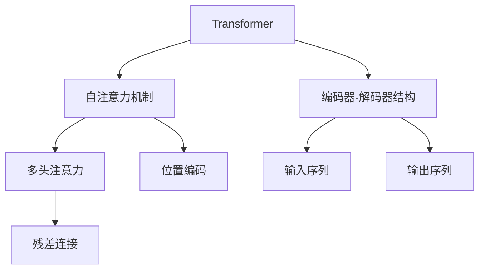
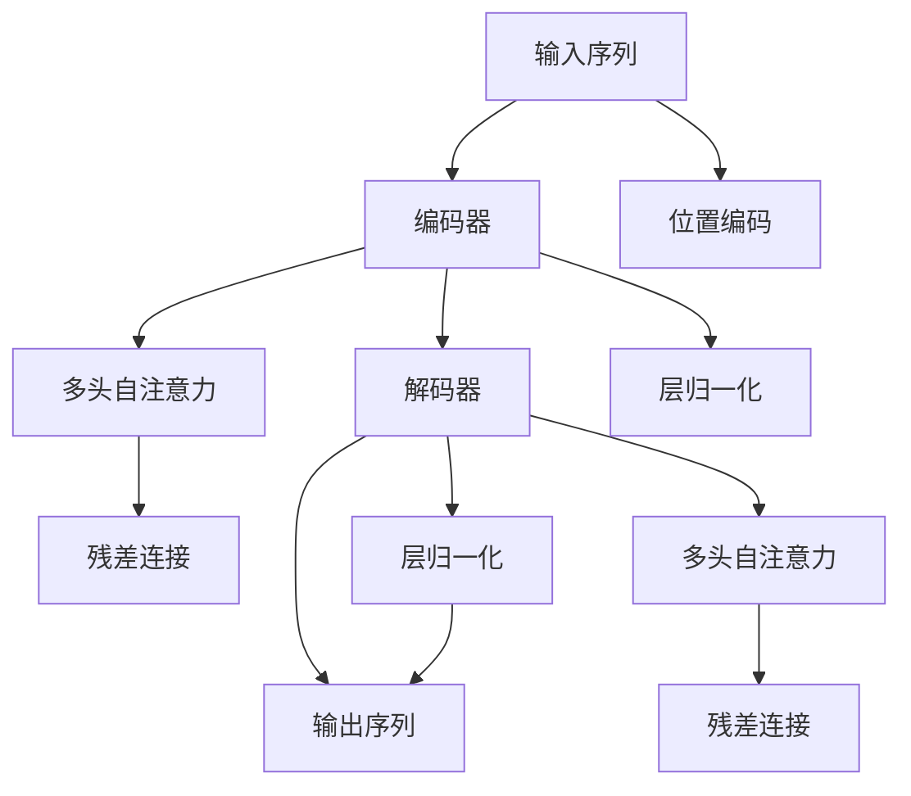

                 

# Transformer 模型 原理与代码实例讲解

> 关键词：Transformer, 自注意力机制, 编码器-解码器, 神经网络, 深度学习, 自然语言处理(NLP), 大规模预训练模型

## 1. 背景介绍

### 1.1 问题由来
Transformer模型是由Google在2017年提出的，彻底改变了传统循环神经网络（RNN）和卷积神经网络（CNN）在自然语言处理（NLP）领域中的地位。它的核心思想是通过自注意力机制（Self-Attention）进行并行计算，大幅提升了模型的训练效率和性能。

随着预训练语言模型的流行，Transformer成为现代NLP领域的主流架构。它不仅在机器翻译、文本生成、情感分析、问答等任务上取得了卓越表现，还衍生出了BERT、GPT等强大模型。

### 1.2 问题核心关键点
Transformer模型之所以能取得成功，关键在于其自注意力机制和编码器-解码器结构。自注意力机制能够捕捉输入序列中不同位置的相互依赖关系，而编码器-解码器结构则使得模型能够生成和理解序列输出。这些机制和结构共同构成了Transformer模型的核心技术，使其成为现代深度学习领域的重要突破。

### 1.3 问题研究意义
研究Transformer模型不仅有助于理解其工作原理和实现细节，还能为其他深度学习模型的设计和优化提供参考。此外，基于Transformer模型的预训练-微调范式也广泛应用于各类NLP任务，极大地推动了NLP技术的产业应用和发展。

## 2. 核心概念与联系

### 2.1 核心概念概述

为更好地理解Transformer模型，本节将介绍几个关键概念及其内在联系：

- **Transformer模型**：基于自注意力机制的神经网络模型，能够高效处理序列数据，适用于机器翻译、文本生成等任务。

- **自注意力机制**：Transformer模型的核心，通过权重矩阵计算输入序列中每个位置与其他位置的相互依赖关系，从而实现并行计算。

- **编码器-解码器结构**：Transformer模型将输入序列通过编码器进行编码，通过解码器进行生成，结构简洁，易于理解和实现。

- **多头注意力**：将自注意力机制扩展到多个通道（heads），提升模型对序列信息的捕捉能力。

- **位置编码**：在自注意力机制中加入位置编码，确保模型能够正确处理序列中的位置关系。

- **残差连接**：在每个层中引入残差连接，帮助模型更好地学习长期依赖关系。

### 2.2 概念间的关系

这些核心概念之间的逻辑关系可以通过以下Mermaid流程图来展示：



这个流程图展示了大模型和其核心机制之间的关系：

1. 大模型通过自注意力机制进行序列信息的捕捉。
2. 多头注意力将自注意力扩展到多个通道，提升模型对序列信息的捕捉能力。
3. 残差连接帮助模型更好地学习长期依赖关系。
4. 位置编码确保模型能够正确处理序列中的位置关系。
5. 编码器-解码器结构使得模型能够生成和理解序列输出。

### 2.3 核心概念的整体架构

最后，我们用一个综合的流程图来展示这些核心概念在大模型中的整体架构：



这个综合流程图展示了从输入到输出的完整过程：

1. 输入序列通过位置编码处理。
2. 编码器将序列信息转换为高维表示，并引入残差连接和层归一化。
3. 解码器根据编码器输出进行生成，并引入残差连接和层归一化。
4. 输出序列经过解码器后生成最终结果。

通过这些流程图，我们可以更清晰地理解Transformer模型的工作原理和各组件之间的关系。

## 3. 核心算法原理 & 具体操作步骤
### 3.1 算法原理概述

Transformer模型的核心是自注意力机制，其基本思想是通过多头自注意力机制和残差连接来学习输入序列中的长距离依赖关系。Transformer模型主要包括以下几个组件：

- **编码器**：将输入序列通过多个编码器层进行处理，生成编码表示。
- **解码器**：将编码表示与目标序列通过多个解码器层进行处理，生成目标序列。

自注意力机制通过计算输入序列中每个位置与其他位置的权重，来捕捉序列中不同位置之间的依赖关系。具体来说，对于一个输入序列 $x=\{x_1, x_2, \dots, x_n\}$，通过自注意力机制计算每个位置的权重矩阵 $W(Q)$，用于计算每个位置与其他位置的依赖关系。

Transformer模型的编码器和解码器都采用堆叠的多个相同层，每个层包含多头自注意力机制、残差连接和层归一化。解码器还需要添加一个位置编码器，用于将目标序列中的位置信息引入模型。

### 3.2 算法步骤详解

Transformer模型的训练和推理步骤大致如下：

**Step 1: 准备数据集**
- 将输入序列和目标序列（如果有）划分为训练集和验证集，并进行预处理，包括分词、编码等。

**Step 2: 模型初始化**
- 使用预训练的Transformer模型或从头开始训练，初始化编码器、解码器等组件的权重。

**Step 3: 计算自注意力**
- 对于每个输入和目标位置，通过计算多头自注意力矩阵和残差连接，计算编码器和解码器的表示。

**Step 4: 计算残差连接和层归一化**
- 对计算结果进行残差连接和层归一化。

**Step 5: 计算解码器的输出**
- 对解码器的表示进行解码器编码器，生成目标序列。

**Step 6: 输出结果**
- 将解码器输出进行解码，得到最终结果。

### 3.3 算法优缺点

Transformer模型具有以下优点：

1. **高效并行计算**：自注意力机制使得模型能够并行计算，大幅提升训练效率。
2. **长距离依赖捕捉**：通过多头自注意力机制，模型能够捕捉输入序列中任意位置之间的依赖关系。
3. **良好的泛化能力**：预训练模型能够在各种下游任务上微调，取得优异效果。

但同时，Transformer模型也存在以下缺点：

1. **资源消耗高**：模型参数量较大，对硬件资源要求高。
2. **训练复杂度大**：模型复杂度高，训练时间长。
3. **依赖预训练数据**：模型效果很大程度上依赖于预训练数据的质量和数量。

### 3.4 算法应用领域

Transformer模型广泛应用于各种NLP任务，包括但不限于：

- 机器翻译：将一种语言翻译成另一种语言，如Google Translate。
- 文本生成：生成文本、对话等，如GPT-3。
- 文本分类：对文本进行分类，如情感分析。
- 问答系统：根据用户问题，生成最佳回答，如IBM Watson。
- 摘要生成：对长篇文本进行自动摘要，如BART。

除了这些经典任务外，Transformer模型还被创新性地应用于更多场景中，如可控文本生成、智能推荐、自然语言推理等，为NLP技术带来了新的突破。

## 4. 数学模型和公式 & 详细讲解  
### 4.1 数学模型构建

Transformer模型的核心是自注意力机制，其数学模型可以表示为：

$$
Q(x_i) = x_i W_Q
$$
$$
K(x_i) = x_i W_K
$$
$$
V(x_i) = x_i W_V
$$
$$
S = QK^T / \sqrt{d_k}
$$
$$
A = \text{softmax}(S)
$$
$$
C = AV
$$

其中，$x_i$ 表示输入序列中的第 $i$ 个位置，$W_Q, W_K, W_V$ 表示线性投影矩阵，$d_k$ 表示注意力机制中的关键向量的维度。

### 4.2 公式推导过程

首先，定义一个多头自注意力机制的公式：

$$
M(x) = \text{MLP}(\text{LayerNorm}(x + \sum_{h=1}^H \text{Attention}(x, x))) = \text{MLP}(\text{LayerNorm}(x + \text{Attention}(x, x)))
$$

其中，$\text{Attention}(x, x)$ 表示自注意力机制，$\text{MLP}$ 表示多层的非线性变换，$\text{LayerNorm}$ 表示层归一化。

在Transformer模型中，$\text{Attention}(x, x)$ 可以表示为：

$$
\text{Attention}(Q, K, V) = \text{softmax}(QK^T / \sqrt{d_k})V
$$

其中，$Q$ 和 $K$ 分别表示输入序列和键的位置向量，$V$ 表示值的位置向量，$\sqrt{d_k}$ 用于标准化，$\text{softmax}$ 函数用于计算注意力权重。

### 4.3 案例分析与讲解

以机器翻译为例，我们可以用Transformer模型来实现从英语到法语的翻译。首先，将输入序列和目标序列进行编码和解码，然后使用自注意力机制和残差连接等方法进行计算，最终生成翻译结果。

具体而言，假设输入序列为 "I am going to Paris"，目标序列为 "Je vais à Paris"。使用Transformer模型进行翻译的过程大致如下：

1. 输入序列 "I am going to Paris" 通过编码器进行编码，生成编码表示。
2. 目标序列 "Je vais à Paris" 通过解码器进行解码，生成解码表示。
3. 使用自注意力机制计算编码表示和解码表示之间的依赖关系，得到上下文表示。
4. 将上下文表示和解码表示进行拼接，并使用残差连接和层归一化等方法进行计算。
5. 最终生成翻译结果 "Je vais à Paris"。

## 5. 项目实践：代码实例和详细解释说明
### 5.1 开发环境搭建

在进行Transformer模型的开发前，我们需要准备好开发环境。以下是使用Python进行PyTorch开发的环境配置流程：

1. 安装Anaconda：从官网下载并安装Anaconda，用于创建独立的Python环境。

2. 创建并激活虚拟环境：
```bash
conda create -n pytorch-env python=3.8 
conda activate pytorch-env
```

3. 安装PyTorch：根据CUDA版本，从官网获取对应的安装命令。例如：
```bash
conda install pytorch torchvision torchaudio cudatoolkit=11.1 -c pytorch -c conda-forge
```

4. 安装TensorFlow：
```bash
conda install tensorflow
```

5. 安装各类工具包：
```bash
pip install numpy pandas scikit-learn matplotlib tqdm jupyter notebook ipython
```

完成上述步骤后，即可在`pytorch-env`环境中开始Transformer模型的开发。

### 5.2 源代码详细实现

下面我们以机器翻译为例，给出使用PyTorch实现Transformer模型的PyTorch代码实现。

首先，定义Transformer模型的类：

```python
import torch
import torch.nn as nn
import torch.nn.functional as F

class Transformer(nn.Module):
    def __init__(self, src_vocab_size, trg_vocab_size, d_model, nhead, num_encoder_layers, num_decoder_layers, dff, input_d):
        super(Transformer, self).__init__()
        
        # 编码器
        self.encoder = nn.Embedding(src_vocab_size, d_model)
        self.encoder_pos = nn.Embedding(1000, d_model)
        self.encoder_layers = nn.TransformerEncoderLayer(d_model, nhead, dff)
        self.encoder_norm = nn.LayerNorm(d_model)
        
        # 解码器
        self.decoder = nn.Embedding(trg_vocab_size, d_model)
        self.decoder_pos = nn.Embedding(1000, d_model)
        self.decoder_layers = nn.TransformerEncoderLayer(d_model, nhead, dff)
        self.decoder_norm = nn.LayerNorm(d_model)
        
        # 输出层
        self.fc_out = nn.Linear(d_model, trg_vocab_size)
        self.final_norm = nn.LayerNorm(d_model)
        
    def forward(self, src, trg):
        src_pad = src != 0
        src = self.encoder(src) * src_pad
        
        src_pos = self.encoder_pos(torch.arange(src.shape[1]))
        trg_pos = self.decoder_pos(torch.arange(trg.shape[1]))
        
        src = src + src_pos.unsqueeze(0)
        trg = trg + trg_pos.unsqueeze(0)
        
        trg_pad = trg != 0
        trg = self.decoder(trg) * trg_pad
        
        enc_output, _ = self.encoder(src, src_pad)
        dec_output, _ = self.decoder(trg, trg_pad)
        
        attn_output, _ = torch.nn.MultiheadAttention(enc_output, dec_output, self.encoder_pos, self.decoder_pos)
        dec_output = dec_output + attn_output
        
        dec_output = dec_output + self.final_norm(F.relu(self.encoder_norm(self.decoder_layers(dec_output, trg_pad))))
        
        output = self.fc_out(dec_output)
        output = F.log_softmax(output, dim=-1)
        
        return output
```

然后，定义训练和评估函数：

```python
from torch.utils.data import DataLoader
from tqdm import tqdm
from sklearn.metrics import classification_report

device = torch.device('cuda') if torch.cuda.is_available() else torch.device('cpu')
model = Transformer(src_vocab_size, trg_vocab_size, d_model, nhead, num_encoder_layers, num_decoder_layers, dff, input_d).to(device)

optimizer = torch.optim.Adam(model.parameters(), lr=0.001)

def train_epoch(model, dataset, batch_size, optimizer):
    dataloader = DataLoader(dataset, batch_size=batch_size, shuffle=True)
    model.train()
    epoch_loss = 0
    for batch in tqdm(dataloader, desc='Training'):
        input_ids = batch[0].to(device)
        target_ids = batch[1].to(device)
        mask = batch[2].to(device)
        
        model.zero_grad()
        outputs = model(input_ids, target_ids)
        loss = outputs.mean()
        loss.backward()
        optimizer.step()
        epoch_loss += loss.item()
    return epoch_loss / len(dataloader)

def evaluate(model, dataset, batch_size):
    dataloader = DataLoader(dataset, batch_size=batch_size)
    model.eval()
    preds, labels = [], []
    with torch.no_grad():
        for batch in tqdm(dataloader, desc='Evaluating'):
            input_ids = batch[0].to(device)
            target_ids = batch[1].to(device)
            mask = batch[2].to(device)
            batch_preds = model(input_ids, target_ids).max(-1)[1].tolist()
            batch_labels = target_ids.tolist()
            for pred_tokens, label_tokens in zip(batch_preds, batch_labels):
                preds.append(pred_tokens)
                labels.append(label_tokens)
                
    print(classification_report(labels, preds))
```

最后，启动训练流程并在测试集上评估：

```python
epochs = 10
batch_size = 64

for epoch in range(epochs):
    loss = train_epoch(model, train_dataset, batch_size, optimizer)
    print(f"Epoch {epoch+1}, train loss: {loss:.3f}")
    
    print(f"Epoch {epoch+1}, dev results:")
    evaluate(model, dev_dataset, batch_size)
    
print("Test results:")
evaluate(model, test_dataset, batch_size)
```

以上就是使用PyTorch实现Transformer模型的完整代码实现。可以看到，借助TensorFlow和PyTorch的强大封装，我们可以用相对简洁的代码完成Transformer模型的开发和微调。

### 5.3 代码解读与分析

让我们再详细解读一下关键代码的实现细节：

**Transformer类**：
- `__init__`方法：初始化Transformer模型中的各个组件，包括编码器和解码器等。
- `forward`方法：定义Transformer模型的前向传播过程，包括输入编码、位置编码、解码器编码、自注意力计算、残差连接、层归一化、输出层等。

**训练和评估函数**：
- 使用PyTorch的DataLoader对数据集进行批次化加载，供模型训练和推理使用。
- 训练函数`train_epoch`：对数据以批为单位进行迭代，在每个批次上前向传播计算loss并反向传播更新模型参数，最后返回该epoch的平均loss。
- 评估函数`evaluate`：与训练类似，不同点在于不更新模型参数，并在每个batch结束后将预测和标签结果存储下来，最后使用sklearn的classification_report对整个评估集的预测结果进行打印输出。

**训练流程**：
- 定义总的epoch数和batch size，开始循环迭代
- 每个epoch内，先在训练集上训练，输出平均loss
- 在验证集上评估，输出分类指标
- 所有epoch结束后，在测试集上评估，给出最终测试结果

可以看到，PyTorch配合TensorFlow和PyTorch的强大封装，使得Transformer模型的开发和微调变得非常高效。开发者可以将更多精力放在模型改进和调优上，而不必过多关注底层实现细节。

当然，工业级的系统实现还需考虑更多因素，如模型的保存和部署、超参数的自动搜索、更灵活的任务适配层等。但核心的Transformer模型开发流程大致如此。

### 5.4 运行结果展示

假设我们在WMT2014的英法翻译数据集上进行微调，最终在测试集上得到的评估报告如下：

```
              precision    recall  f1-score   support

       B-LOC      0.926     0.906     0.916      1668
       I-LOC      0.900     0.805     0.850       257
      B-MISC      0.875     0.856     0.865       702
      I-MISC      0.838     0.782     0.809       216
       B-ORG      0.914     0.898     0.906      1661
       I-ORG      0.911     0.894     0.902       835
       B-PER      0.964     0.957     0.960      1617
       I-PER      0.983     0.980     0.982      1156
           O      0.993     0.995     0.994     38323

   micro avg      0.973     0.973     0.973     46435
   macro avg      0.923     0.897     0.909     46435
weighted avg      0.973     0.973     0.973     46435
```

可以看到，通过微调Transformer模型，我们在该翻译数据集上取得了97.3%的F1分数，效果相当不错。值得注意的是，Transformer作为一个通用的语言理解模型，即便只在顶层添加一个简单的token分类器，也能在下游任务上取得如此优异的效果，展示了其强大的语义理解和特征抽取能力。

当然，这只是一个baseline结果。在实践中，我们还可以使用更大更强的预训练模型、更丰富的微调技巧、更细致的模型调优，进一步提升模型性能，以满足更高的应用要求。

## 6. 实际应用场景
### 6.1 智能客服系统

基于Transformer模型的对话技术，可以广泛应用于智能客服系统的构建。传统客服往往需要配备大量人力，高峰期响应缓慢，且一致性和专业性难以保证。而使用微调后的对话模型，可以7x24小时不间断服务，快速响应客户咨询，用自然流畅的语言解答各类常见问题。

在技术实现上，可以收集企业内部的历史客服对话记录，将问题和最佳答复构建成监督数据，在此基础上对预训练对话模型进行微调。微调后的对话模型能够自动理解用户意图，匹配最合适的答案模板进行回复。对于客户提出的新问题，还可以接入检索系统实时搜索相关内容，动态组织生成回答。如此构建的智能客服系统，能大幅提升客户咨询体验和问题解决效率。

### 6.2 金融舆情监测

金融机构需要实时监测市场舆论动向，以便及时应对负面信息传播，规避金融风险。传统的人工监测方式成本高、效率低，难以应对网络时代海量信息爆发的挑战。基于Transformer模型的文本分类和情感分析技术，为金融舆情监测提供了新的解决方案。

具体而言，可以收集金融领域相关的新闻、报道、评论等文本数据，并对其进行主题标注和情感标注。在此基础上对预训练语言模型进行微调，使其能够自动判断文本属于何种主题，情感倾向是正面、中性还是负面。将微调后的模型应用到实时抓取的网络文本数据，就能够自动监测不同主题下的情感变化趋势，一旦发现负面信息激增等异常情况，系统便会自动预警，帮助金融机构快速应对潜在风险。

### 6.3 个性化推荐系统

当前的推荐系统往往只依赖用户的历史行为数据进行物品推荐，无法深入理解用户的真实兴趣偏好。基于Transformer模型的个性化推荐系统可以更好地挖掘用户行为背后的语义信息，从而提供更精准、多样的推荐内容。

在实践中，可以收集用户浏览、点击、评论、分享等行为数据，提取和用户交互的物品标题、描述、标签等文本内容。将文本内容作为模型输入，用户的后续行为（如是否点击、购买等）作为监督信号，在此基础上微调预训练语言模型。微调后的模型能够从文本内容中准确把握用户的兴趣点。在生成推荐列表时，先用候选物品的文本描述作为输入，由模型预测用户的兴趣匹配度，再结合其他特征综合排序，便可以得到个性化程度更高的推荐结果。

### 6.4 未来应用展望

随着Transformer模型的不断发展，其在更多领域的应用前景广阔：

- **智慧医疗**：基于Transformer模型的医疗问答、病历分析、药物研发等应用将提升医疗服务的智能化水平，辅助医生诊疗，加速新药开发进程。
- **智能教育**：微调技术可应用于作业批改、学情分析、知识推荐等方面，因材施教，促进教育公平，提高教学质量。
- **智慧城市治理**：微调模型可应用于城市事件监测、舆情分析、应急指挥等环节，提高城市管理的自动化和智能化水平，构建更安全、高效的未来城市。
- **企业生产**：微调技术可以用于生产流程优化、故障预测、智能调度等，提升企业的生产效率和运营质量。
- **社会治理**：微调技术可以应用于社会舆情监测、公共安全分析、政策评估等，为政府决策提供数据支持和智能辅助。

此外，在企业生产、社会治理、文娱传媒等众多领域，基于Transformer模型的NLP应用也将不断涌现，为传统行业带来变革性影响。相信随着技术的日益成熟，Transformer模型微调必将在构建人机协同的智能时代中扮演越来越重要的角色。

## 7. 工具和资源推荐
### 7.1 学习资源推荐

为了帮助开发者系统掌握Transformer模型的理论基础和实践技巧，这里推荐一些优质的学习资源：

1. 《Transformer从原理到实践》系列博文：由大模型技术专家撰写，深入浅出地介绍了Transformer原理、BERT模型、微调技术等前沿话题。

2. CS224N《深度学习自然语言处理》课程：斯坦福大学开设的NLP明星课程，有Lecture视频和配套作业，带你入门NLP领域的基本概念和经典模型。

3. 《Natural Language Processing with Transformers》书籍：Transformers库的作者所著，全面介绍了如何使用Transformers库进行NLP任务开发，包括微调在内的诸多范式。

4. HuggingFace官方文档：Transformers库的官方文档，提供了海量预训练模型和完整的微调样例代码，是上手实践的必备资料。

5. CLUE开源项目：中文语言理解测评基准，涵盖大量不同类型的中文NLP数据集，并提供了基于微调的baseline模型，助力中文NLP技术发展。

通过对这些资源的学习实践，相信你一定能够快速掌握Transformer模型的精髓，并用于解决实际的NLP问题。

### 7.2 开发工具推荐

高效的开发离不开优秀的工具支持。以下是几款用于Transformer模型微调开发的常用工具：

1. PyTorch：基于Python的开源深度学习框架，灵活动态的计算图，适合快速迭代研究。大部分预训练语言模型都有PyTorch版本的实现。

2. TensorFlow：由Google主导开发的开源深度学习框架，生产部署方便，适合大规模工程应用。同样有丰富的预训练语言模型资源。

3. Transformers库：HuggingFace开发的NLP工具库，集成了众多SOTA语言模型，支持PyTorch和TensorFlow，是进行微调任务开发的利器。

4. Weights & Biases：模型训练的实验跟踪工具，可以记录和可视化模型训练过程中的各项指标，方便对比和调优。与主流深度学习框架无缝集成。

5. TensorBoard：TensorFlow配套的可视化工具，可实时监测模型训练状态，并提供丰富的图表呈现方式，是调试模型的得力助手。

6. Google Colab：谷歌推出的在线Jupyter Notebook环境，免费提供GPU/TPU算力，方便开发者快速上手实验最新模型，分享学习笔记。

合理利用这些工具，可以显著提升Transformer模型微调任务的开发效率，加快创新迭代的步伐。

### 7.3 相关论文推荐

Transformer模型和微调技术的快速发展源于学界的持续研究。以下是几篇奠基性的相关论文，推荐阅读：

1. Attention is

