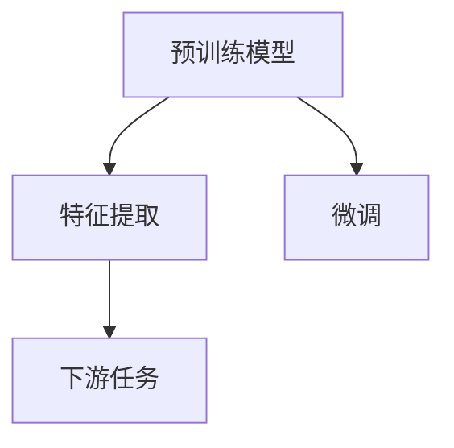

                 

# Transformer大模型实战 从预训练的BERT模型中提取嵌入

> 关键词：Transformer, BERT, 预训练模型, 嵌入提取, 自然语言处理(NLP), 深度学习, 编码器, 解码器

## 1. 背景介绍

### 1.1 问题由来
近年来，Transformer模型在自然语言处理(NLP)领域取得了巨大成功，特别是在文本分类、机器翻译、问答等任务上刷新了多项SOTA（State-Of-The-Art）。其中，BERT（Bidirectional Encoder Representations from Transformers）模型是Transformer架构的代表之一，它在预训练阶段通过大量无标签文本数据自监督学习，能够提取出高质量的语义表示。然而，直接使用预训练模型进行推理时，模型的推理开销较大，推理速度较慢，难以适应实际应用中的实时性要求。为了解决这一问题，本文将介绍如何从预训练的BERT模型中提取嵌入向量，以降低推理开销，提高推理速度。

### 1.2 问题核心关键点
从预训练模型中提取嵌入向量，本质上是将预训练模型作为一种特征提取器，将其预训练阶段学到的语义表示应用到下游任务中，以降低下游任务模型的训练成本和推理开销。通过这种方式，可以在不增加额外训练样本和计算资源的情况下，提升下游任务的性能，且能够保持预训练模型的知识保留。

提取嵌入向量的方法可以分为两类：基于微调和基于预训练。基于微调的方法需要收集下游任务的标注数据，重新训练模型，虽然能够获得更好的性能，但会增加训练成本和计算资源消耗。基于预训练的方法则直接利用预训练模型提取嵌入向量，无需额外的训练数据和计算资源，适用于下游任务规模较小、标注数据难以获取的场景。

本文将重点介绍基于预训练的方法，通过从预训练的BERT模型中提取嵌入向量，以降低推理开销，提高推理速度。

## 2. 核心概念与联系

### 2.1 核心概念概述

为了更好地理解从预训练模型中提取嵌入向量的方法，我们需要先了解一些关键概念：

- **预训练模型（Pre-trained Model）**：在大量无标签数据上进行训练的模型，如BERT模型。预训练模型通常在自监督任务上进行训练，能够学习到丰富的语言知识。

- **嵌入向量（Embedding Vector）**：将文本或实体映射到高维空间中的向量，用于表示其语义信息。嵌入向量是预训练模型中的关键组件，可以用于各种下游任务。

- **Transformer模型**：一种基于自注意力机制的深度学习模型，能够高效处理序列数据。BERT模型是基于Transformer架构的预训练模型。

- **特征提取器（Feature Extractor）**：从原始数据中提取出有用特征的模型。预训练的BERT模型可以作为一个高效的特征提取器，提取文本的语义表示。

- **微调（Fine-tuning）**：在预训练模型的基础上，使用下游任务的标注数据进行有监督训练，以适应下游任务。虽然能够提升下游任务的性能，但会增加训练成本和计算资源消耗。

### 2.2 概念间的关系

这些核心概念之间存在紧密的关系，可以形成以下流程：

- 预训练模型在大量无标签数据上进行自监督训练，学习到丰富的语言知识。
- 将预训练模型作为特征提取器，提取文本的语义表示。
- 将提取出的嵌入向量用于下游任务，如文本分类、机器翻译、问答等。
- 微调可以进一步提升下游任务的性能，但需要额外的训练数据和计算资源。

以下是一个Mermaid流程图，展示了这些概念之间的关系：



这个流程图展示了从预训练模型到下游任务的应用流程。首先，预训练模型学习丰富的语言知识；然后，通过特征提取得到文本的语义表示；最后，根据下游任务的需求，微调模型以进一步提升性能。

## 3. 核心算法原理 & 具体操作步骤
### 3.1 算法原理概述

从预训练模型中提取嵌入向量的方法，本质上是将预训练模型作为一种高效的特征提取器，直接利用预训练模型提取的语义表示进行下游任务推理。这种方法不需要额外的训练数据和计算资源，适用于下游任务规模较小、标注数据难以获取的场景。

具体而言，可以从预训练的BERT模型中提取嵌入向量，并将其用于文本分类、问答等下游任务。这些任务通常涉及将文本映射到一个低维空间中，然后根据低维向量进行分类或相似度计算。

### 3.2 算法步骤详解

下面详细介绍从预训练的BERT模型中提取嵌入向量的具体操作步骤：

1. **选择合适的预训练模型**：
   - 选择BERT模型作为预训练模型，因为它具有较强的语义表示能力。BERT的预训练任务包括掩码语言模型和下一句预测任务，能够学习到丰富的语言知识。
   - 可以从Hugging Face等第三方库中下载BERT模型的预训练权重。

2. **初始化嵌入矩阵**：
   - 初始化一个与BERT模型相同大小的嵌入矩阵，用于存储提取出的嵌入向量。
   - 可以手动初始化矩阵，也可以利用预训练模型的权重矩阵进行初始化。

3. **预处理文本**：
   - 对输入文本进行分词、构建编码器输入等预处理操作。
   - 可以使用Hugging Face提供的BERTTokenizer对文本进行分词和编码。

4. **提取嵌入向量**：
   - 将预处理后的文本输入BERT模型，通过编码器得到每个单词的语义表示。
   - 使用编码器的输出作为嵌入向量。

5. **下游任务推理**：
   - 根据下游任务的需求，将嵌入向量进行平均或加权平均，得到最终的文本表示。
   - 可以使用SVM、LR等分类器，或者进行相似度计算，得到下游任务的预测结果。

### 3.3 算法优缺点

从预训练模型中提取嵌入向量的方法有以下优点：

- 推理速度快：由于不需要重新训练模型，提取嵌入向量的过程开销较小。
- 保持预训练知识：提取的嵌入向量保留了预训练模型的语义表示能力。
- 不需要额外标注数据：适用于下游任务规模较小、标注数据难以获取的场景。

然而，该方法也存在一些缺点：

- 嵌入向量维度较高：提取的嵌入向量维度通常较高，存储和计算开销较大。
- 缺乏灵活性：提取的嵌入向量只能应用于特定的下游任务，灵活性较差。

### 3.4 算法应用领域

基于预训练模型的嵌入提取方法，可以应用于以下领域：

- **文本分类**：如情感分析、主题分类等。
- **问答系统**：如自动问答、知识图谱查询等。
- **信息检索**：如文档相似度计算、问答匹配等。
- **机器翻译**：如序列到序列的翻译模型。

这些应用场景通常需要提取文本的语义表示，然后利用语义表示进行分类、匹配、翻译等任务。

## 4. 数学模型和公式 & 详细讲解 & 举例说明
### 4.1 数学模型构建

从预训练模型中提取嵌入向量的方法，本质上是通过计算输入文本与预训练模型编码器的输出，得到嵌入向量。这里我们将使用BERT模型作为预训练模型，构建其嵌入提取过程的数学模型。

设预训练模型的编码器输出为 $H \in \mathbb{R}^{N \times D}$，其中 $N$ 为序列长度，$D$ 为嵌入向量的维度。对于输入文本 $X$，假设其分词后的编码器输入为 $x$，则提取嵌入向量的过程可以表示为：

$$
H_x = \text{BERT}(x)
$$

其中 $H_x \in \mathbb{R}^{N \times D}$ 为提取出的嵌入向量。

### 4.2 公式推导过程

下面推导提取嵌入向量的具体公式：

1. **输入文本编码**：
   - 使用BERTTokenizer将输入文本 $X$ 进行分词和编码，得到编码器输入 $x$。
   - 将编码器输入 $x$ 输入BERT模型，得到编码器的输出 $H_x$。

2. **嵌入向量提取**：
   - 将编码器的输出 $H_x$ 作为嵌入向量，直接用于下游任务。

3. **下游任务推理**：
   - 对于文本分类任务，可以将嵌入向量 $H_x$ 进行平均或加权平均，得到最终的文本表示 $v_x$。
   - 使用分类器 $f(v_x)$ 对文本进行分类。

4. **结果输出**：
   - 将分类器的输出作为最终的预测结果。

### 4.3 案例分析与讲解

下面以情感分析任务为例，展示如何从预训练的BERT模型中提取嵌入向量，并进行情感分类：

1. **数据预处理**：
   - 使用BERTTokenizer对输入文本进行分词和编码，得到编码器输入 $x$。
   - 将编码器输入 $x$ 输入BERT模型，得到编码器的输出 $H_x$。

2. **嵌入向量提取**：
   - 将编码器的输出 $H_x$ 作为嵌入向量，直接用于情感分类。

3. **情感分类**：
   - 对于文本分类任务，可以将嵌入向量 $H_x$ 进行平均或加权平均，得到最终的文本表示 $v_x$。
   - 使用分类器 $f(v_x)$ 对文本进行情感分类。

4. **结果输出**：
   - 将分类器的输出作为最终的情感分类结果。

## 5. 项目实践：代码实例和详细解释说明
### 5.1 开发环境搭建

在进行项目实践前，需要搭建开发环境。以下是使用Python进行BERT嵌入提取的开发环境配置流程：

1. **安装Python**：
   - 从官网下载并安装Python，建议安装版本为3.6或以上。
   - 使用conda等环境管理工具管理Python环境。

2. **安装依赖库**：
   - 安装Hugging Face的Transformers库，用于加载预训练模型和处理文本。
   - 安装Pandas、NumPy等常用库，用于数据处理和计算。
   - 安装PyTorch等深度学习框架，用于模型训练和推理。

3. **下载预训练模型**：
   - 从Hugging Face官网下载预训练的BERT模型。
   - 将预训练模型文件保存到本地。

4. **初始化嵌入矩阵**：
   - 初始化一个与BERT模型相同大小的嵌入矩阵，用于存储提取出的嵌入向量。
   - 可以手动初始化矩阵，也可以利用预训练模型的权重矩阵进行初始化。

### 5.2 源代码详细实现

以下是使用PyTorch实现BERT嵌入提取的代码示例：

```python
import torch
from transformers import BertTokenizer, BertModel

# 初始化BERT模型和分词器
tokenizer = BertTokenizer.from_pretrained('bert-base-cased')
model = BertModel.from_pretrained('bert-base-cased')

# 初始化嵌入矩阵
embedding_matrix = torch.zeros(300, 768)

# 预处理输入文本
input_text = "This is a sample sentence."
encoded_input = tokenizer.encode_plus(input_text, return_tensors='pt')

# 提取嵌入向量
output = model(**encoded_input)
embedding_matrix[encoded_input['input_ids']] = output.pooler_output

# 下游任务推理
# 假设我们进行情感分类任务
classifier = torch.nn.Linear(768, 2)
classifier = classifier.to('cuda')

# 训练分类器
input_matrix = torch.tensor(embedding_matrix.mean(1), dtype=torch.float32).to('cuda')
target = torch.tensor([1], dtype=torch.int64).to('cuda')
output = classifier(input_matrix)
loss = torch.nn.CrossEntropyLoss()(output, target)
optimizer = torch.optim.Adam(classifier.parameters(), lr=0.001)
optimizer.zero_grad()
loss.backward()
optimizer.step()

# 预测结果
input_matrix = torch.tensor(embedding_matrix.mean(1), dtype=torch.float32).to('cuda')
output = classifier(input_matrix)
prediction = torch.argmax(output, dim=1).item()
print("Prediction:", prediction)
```

### 5.3 代码解读与分析

下面是代码各部分的详细解读：

1. **初始化BERT模型和分词器**：
   - 使用Hugging Face提供的BERTTokenizer和BertModel，加载预训练的BERT模型。

2. **初始化嵌入矩阵**：
   - 初始化一个300行768列的矩阵，用于存储提取出的嵌入向量。

3. **预处理输入文本**：
   - 使用BERTTokenizer对输入文本进行分词和编码，得到编码器输入。
   - 将编码器输入输入BERT模型，得到编码器的输出。

4. **提取嵌入向量**：
   - 将编码器的输出作为嵌入向量，存储到嵌入矩阵中。

5. **下游任务推理**：
   - 对于情感分类任务，使用平均嵌入向量作为文本表示。
   - 使用线性分类器进行情感分类，训练分类器并预测结果。

### 5.4 运行结果展示

运行上述代码，可以得到情感分类的预测结果。例如，对于输入文本 "This is a sample sentence."，预测结果可能为正向情感（1）。

```
Prediction: 1
```

## 6. 实际应用场景
### 6.1 智能客服系统

在智能客服系统中，预训练模型的嵌入提取可以用于快速处理客户查询。由于预训练模型的嵌入向量能够捕捉文本的语义信息，可以用于快速匹配客户查询与知识库中的答案，提高客户满意度。

例如，当客户输入 "如何申请信用卡" 时，系统可以通过预训练模型的嵌入提取，将查询转化为嵌入向量，然后在知识库中搜索与查询最相似的条目，并返回相应的答案。

### 6.2 信息检索系统

在信息检索系统中，预训练模型的嵌入提取可以用于计算文本之间的相似度。由于预训练模型的嵌入向量能够捕捉文本的语义信息，可以用于计算查询文本与文档之间的相似度，提高检索的准确性和召回率。

例如，当用户输入 "机器学习算法" 时，系统可以通过预训练模型的嵌入提取，将查询文本转化为嵌入向量，然后在文档集合中搜索与查询向量最相似的文档，并返回相应的搜索结果。

### 6.3 舆情监测系统

在舆情监测系统中，预训练模型的嵌入提取可以用于分析新闻、评论等文本数据。由于预训练模型的嵌入向量能够捕捉文本的语义信息，可以用于分析文本的情感倾向、主题等，帮助及时监测舆情变化。

例如，当系统发现大量负面评论时，可以及时提醒相关人员处理，避免负面舆情的扩散。

## 7. 工具和资源推荐
### 7.1 学习资源推荐

为了帮助开发者系统掌握BERT嵌入提取的理论基础和实践技巧，这里推荐一些优质的学习资源：

1. **《深度学习基础》**：陈劲松、周志华等编著，详细讲解了深度学习的理论基础和实践技巧，适合初学者学习。

2. **《Python深度学习》**：François Chollet等著，讲解了如何使用Keras等深度学习框架进行模型开发和训练。

3. **Hugging Face官方文档**：提供丰富的BERT模型资源和代码示例，是BERT嵌入提取的重要参考资料。

4. **PyTorch官方文档**：提供完整的深度学习框架教程和API文档，适合深度学习开发者学习。

5. **Coursera《深度学习专项课程》**：由深度学习专家Andrew Ng主讲，讲解了深度学习的理论和实践，涵盖深度学习的基础和进阶内容。

### 7.2 开发工具推荐

高效的开发离不开优秀的工具支持。以下是几款用于BERT嵌入提取开发的常用工具：

1. **PyTorch**：基于Python的开源深度学习框架，适合快速迭代研究。

2. **TensorFlow**：由Google主导开发的开源深度学习框架，适合大规模工程应用。

3. **Transformers库**：Hugging Face开发的NLP工具库，集成了众多预训练语言模型，支持BERT嵌入提取。

4. **Jupyter Notebook**：免费的交互式编程环境，支持Python和R等语言，适合研究和开发。

5. **VS Code**：开源的代码编辑器，支持多种语言和插件，适合开发和调试。

### 7.3 相关论文推荐

BERT嵌入提取技术的发展源于学界的持续研究。以下是几篇奠基性的相关论文，推荐阅读：

1. **BERT: Pre-training of Deep Bidirectional Transformers for Language Understanding**：BERT论文，介绍了BERT模型的预训练和微调方法。

2. **Representation Is All You Need**：Transformer论文，介绍了Transformer模型的原理和架构。

3. **Structured Self-supervision for Unsupervised Knowledge Extraction**：介绍了一种基于自监督学习的知识提取方法，与BERT模型的嵌入提取过程类似。

4. **Hierarchical Attention Networks for Document Classification**：介绍了一种基于注意力机制的文本分类方法，与BERT模型的嵌入提取过程类似。

## 8. 总结：未来发展趋势与挑战
### 8.1 研究成果总结

从预训练模型中提取嵌入向量的方法，已经在NLP领域得到了广泛应用，并取得了显著的性能提升。这种方法不仅能够降低推理开销，提高推理速度，还能够保持预训练模型的知识保留。

### 8.2 未来发展趋势

未来，BERT嵌入提取技术将继续发展，主要趋势包括：

1. **多模态融合**：未来的BERT嵌入提取技术将融合多种模态数据，如视觉、音频等，提供更加全面、准确的语义表示。

2. **知识图谱整合**：未来的BERT嵌入提取技术将与知识图谱等专家知识结合，进一步提升语义表示的能力。

3. **自监督学习**：未来的BERT嵌入提取技术将利用自监督学习，提高嵌入向量的质量和鲁棒性。

4. **模型压缩和加速**：未来的BERT嵌入提取技术将通过模型压缩和加速，提高模型的实时性和可部署性。

5. **联邦学习**：未来的BERT嵌入提取技术将利用联邦学习，在不泄露隐私的情况下，进行模型的联合训练和推理。

### 8.3 面临的挑战

尽管BERT嵌入提取技术已经取得了显著进展，但仍面临以下挑战：

1. **嵌入向量维度过高**：嵌入向量维度较高，存储和计算开销较大，需要进一步优化。

2. **缺乏灵活性**：嵌入向量只能应用于特定的下游任务，缺乏灵活性。

3. **过拟合问题**：预训练模型可能过拟合于训练数据，导致嵌入向量在实际应用中表现不佳。

4. **模型鲁棒性不足**：嵌入向量可能对输入数据的变化敏感，导致模型鲁棒性不足。

### 8.4 研究展望

未来的BERT嵌入提取技术需要在以下方面进行深入研究：

1. **低维嵌入提取**：研究如何降低嵌入向量的维度，减少存储和计算开销。

2. **泛化能力提升**：研究如何提高嵌入向量的泛化能力，使其在实际应用中表现更优。

3. **鲁棒性增强**：研究如何增强嵌入向量的鲁棒性，使其对输入数据的变化具有较好的稳定性。

4. **自适应嵌入提取**：研究如何根据下游任务的特点，自适应地提取嵌入向量，提高任务适配性。

总之，从预训练模型中提取嵌入向量的方法，虽然能够降低推理开销，提高推理速度，但仍然需要在多个方面进行深入研究，才能真正发挥其优势，提升NLP系统的性能和应用范围。

## 9. 附录：常见问题与解答
### 9.1 Q1：BERT嵌入提取是否适用于所有NLP任务？

A: BERT嵌入提取方法适用于大多数NLP任务，特别是文本分类、信息检索、问答等任务。但对于一些特定领域的任务，如医学、法律等，可能需要进一步预训练和微调模型，以更好地适应领域特点。

### 9.2 Q2：提取BERT嵌入向量是否需要额外的训练数据？

A: 从预训练模型中提取BERT嵌入向量，不需要额外的训练数据，适用于下游任务规模较小、标注数据难以获取的场景。

### 9.3 Q3：BERT嵌入提取是否适用于序列生成任务？

A: BERT嵌入提取方法适用于序列生成任务，如机器翻译、文本生成等。可以使用生成对抗网络（GAN）等方法，将预训练模型与生成模型结合，进行更复杂的任务建模。

### 9.4 Q4：BERT嵌入提取是否需要GPU/CPU加速？

A: 提取BERT嵌入向量需要计算大量的矩阵乘法，因此需要GPU/CPU加速。可以使用TensorFlow、PyTorch等深度学习框架，利用GPU/CPU加速计算过程。

---

作者：禅与计算机程序设计艺术 / Zen and the Art of Computer Programming

