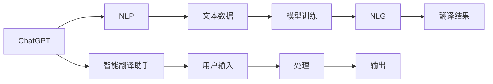
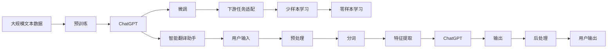

                 

# 实战一：基于 ChatGPT 开发智能翻译助手

> 关键词：智能翻译助手,ChatGPT,自然语言处理(NLP),自然语言生成(NLG),AI语言模型,深度学习,语言理解,语言生成

## 1. 背景介绍

### 1.1 问题由来
随着全球化进程的加快，跨语言交流日益频繁，智能翻译助手作为语言处理领域的前沿技术，其需求量也在不断增加。然而，传统的基于规则和统计的翻译方法在准确性、效率和自动化程度上都有所不足。自然语言处理(NLP)技术的崛起，尤其是深度学习框架和预训练语言模型的出现，为智能翻译助手的开发提供了新的契机。

### 1.2 问题核心关键点
ChatGPT作为OpenAI公司推出的最新一代人工智能大语言模型，以其卓越的语言理解能力和生成能力，成为开发智能翻译助手的有力工具。ChatGPT通过大量的文本数据进行预训练，学习到了复杂的语言模式和语义信息，能够在理解输入文本的基础上，自动生成翻译结果。通过将ChatGPT作为核心组件，可以构建一个高效、精准、智能化的翻译系统。

### 1.3 问题研究意义
智能翻译助手的开发，不仅能够提升跨语言交流的效率，减少人工翻译的劳动强度，还能为语言学习、国际商务、旅游等多个领域提供便利。利用ChatGPT等大语言模型进行翻译助手开发，可以降低开发成本，提升翻译质量，加速技术落地。同时，基于ChatGPT的智能翻译助手，还能结合多种技术手段，如情感分析、信息检索等，进一步拓展应用场景，提升用户体验。

## 2. 核心概念与联系

### 2.1 核心概念概述

为了更好地理解基于ChatGPT的智能翻译助手，本节将介绍几个密切相关的核心概念：

- ChatGPT：由OpenAI公司推出的预训练语言模型，采用Transformer架构，能够处理大规模的文本数据，学习丰富的语言知识，具有强大的语言理解和生成能力。
- 自然语言处理(NLP)：涉及文本数据的处理、分析、理解、生成等任务，是构建智能翻译助手的关键技术。
- 自然语言生成(NLG)：基于文本数据自动生成语言，是翻译助手的重要功能之一。
- AI语言模型：利用深度学习技术，通过大量文本数据进行训练，学习语言的内部结构、语义信息等，为自然语言处理任务提供模型支持。
- 深度学习：基于神经网络的技术，通过多层次的学习机制，实现对大规模数据的复杂建模，是实现智能翻译助手的技术基础。

这些核心概念之间的联系可以通过以下Mermaid流程图来展示：



这个流程图展示了ChatGPT在智能翻译助手中的作用及其与其他核心概念的关系：

1. ChatGPT作为核心模型，通过大量文本数据进行预训练，学习语言知识和模式。
2. 自然语言处理技术对用户输入进行处理，提取关键信息。
3. 自然语言生成技术基于模型理解，自动生成翻译结果。
4. 智能翻译助手集成处理和生成的技术，为用户提供实时翻译服务。

### 2.2 概念间的关系

这些核心概念之间存在着紧密的联系，形成了智能翻译助手的完整框架。下面我们通过几个Mermaid流程图来展示这些概念之间的关系。

#### 2.2.1 智能翻译助手的功能架构


这个流程图展示了智能翻译助手的功能架构：

1. 用户输入经过预处理，包括分词、去噪等操作。
2. 预处理后的文本数据通过特征提取，转化为模型可处理的向量形式。
3. ChatGPT模型对输入进行理解和生成，输出翻译结果。
4. 后处理环节对结果进行语法检查、格式调整等，生成最终的输出。

#### 2.2.2 智能翻译助手的运行流程


这个流程图展示了智能翻译助手的运行流程：

1. 用户输入经过预处理，包括分词、去噪等操作。
2. 预处理后的文本数据通过特征提取，转化为模型可处理的向量形式。
3. ChatGPT模型对输入进行理解和生成，输出翻译结果。
4. 后处理环节对结果进行语法检查、格式调整等，生成最终的输出。

### 2.3 核心概念的整体架构

最后，我们用一个综合的流程图来展示这些核心概念在大语言模型微调过程中的整体架构：



这个综合流程图展示了从预训练到微调，再到智能翻译助手应用的完整过程。ChatGPT首先在大规模文本数据上进行预训练，然后通过微调适应特定任务，最后集成到智能翻译助手中，为用户提供实时翻译服务。 通过这些流程图，我们可以更清晰地理解ChatGPT在智能翻译助手中的作用及其与其他核心概念的关系。

## 3. 核心算法原理 & 具体操作步骤
### 3.1 算法原理概述

基于ChatGPT的智能翻译助手，本质上是一个基于Transformer架构的深度学习模型。其核心算法原理如下：

1. **Transformer模型**：通过自注意力机制和多头注意力机制，实现了对输入序列的并行处理，提升了模型效率和性能。

2. **预训练**：在无标签的大规模文本数据上，通过自监督任务进行预训练，学习到语言的内部结构和语义信息。

3. **微调**：通过下游任务的少量标注数据，对预训练模型进行有监督学习，使其能够适应特定任务的翻译需求。

4. **自然语言生成(NLG)**：基于微调后的模型，自动生成翻译结果。

### 3.2 算法步骤详解

基于ChatGPT的智能翻译助手的开发步骤如下：

**Step 1: 数据准备**
- 收集目标语言和源语言的双语对照文本，构建翻译数据集。
- 将数据集划分为训练集、验证集和测试集，保证数据分布的一致性。

**Step 2: 预处理**
- 对文本进行分词、去噪等预处理操作，转换为模型可处理的向量形式。
- 使用BERT等预训练模型进行特征提取，得到文本向量表示。

**Step 3: 模型微调**
- 选择合适的ChatGPT模型作为初始化参数。
- 将微调数据集输入模型，使用AdamW等优化算法，设置合适的学习率和批大小。
- 设置正则化技术，如L2正则、Dropout等，防止过拟合。
- 周期性在验证集上评估模型性能，根据性能指标决定是否触发Early Stopping。
- 重复上述步骤直至满足预设的迭代轮数或Early Stopping条件。

**Step 4: 自然语言生成**
- 对用户输入进行分词和特征提取。
- 将特征向量输入微调后的ChatGPT模型，生成翻译结果。
- 对翻译结果进行后处理，如语法检查、格式调整等，确保输出符合语言规范。

**Step 5: 部署与测试**
- 将训练好的模型部署到服务器或云端，提供实时翻译服务。
- 对模型进行测试，评估其在不同语种和不同场景下的翻译效果。
- 不断收集用户反馈，优化模型性能，提升用户体验。

### 3.3 算法优缺点

基于ChatGPT的智能翻译助手具有以下优点：
1. **高效性**：ChatGPT通过预训练学习到了大量的语言知识和模式，能够快速适应各种翻译任务，提升翻译效率。
2. **准确性**：ChatGPT在处理大规模文本数据时，能够学习到复杂的语言结构和语义信息，翻译结果更加准确。
3. **灵活性**：ChatGPT能够处理多种语言和语态，支持多种翻译方向的自动生成。
4. **可扩展性**：通过微调，ChatGPT能够适应不同领域和任务的翻译需求，增强模型的泛化能力。

同时，该方法也存在一些局限性：
1. **数据依赖**：ChatGPT的性能依赖于预训练数据的质量和数量，对于小规模数据集的微调效果有限。
2. **模型复杂性**：ChatGPT的模型结构复杂，训练和推理所需资源较多。
3. **翻译质量不稳定**：ChatGPT在处理一些生僻词汇或复杂句子时，翻译质量可能会受到影响。
4. **多模态处理能力不足**：ChatGPT主要基于文本数据进行翻译，对于图片、音频等非文本数据的处理能力有限。

### 3.4 算法应用领域

基于ChatGPT的智能翻译助手已经在多个领域得到了应用，例如：

- **国际商务**：支持多语言翻译，提升国际商务交流效率，促进全球化合作。
- **旅游文化**：提供多语言导航、景点介绍等，助力旅游业发展，推广文化交流。
- **教育培训**：为学生提供多语言学习资源，助力外语学习和跨文化交流。
- **医疗健康**：支持多语言医患交流，提升医疗服务质量和患者体验。
- **科学研究**：提供多语言文献翻译，促进国际学术交流和合作。

除了上述这些领域，基于ChatGPT的智能翻译助手还可以拓展到法律、金融、外交等多个领域，为跨语言交流提供高效、准确的翻译服务。

## 4. 数学模型和公式 & 详细讲解  
### 4.1 数学模型构建

在基于ChatGPT的智能翻译助手中，涉及的数学模型主要包括以下几个部分：

- **Transformer模型**：采用多头自注意力机制，通过计算注意力权重，实现对输入序列的并行处理。
- **预训练损失函数**：使用语言建模任务，如掩码语言模型（Masked Language Modeling, MLM）和下一句预测任务（Next Sentence Prediction, NSP），对模型进行预训练。
- **微调损失函数**：使用特定任务的目标函数，如交叉熵损失函数，对模型进行微调。
- **自然语言生成**：基于微调后的模型，通过序列生成算法，自动生成翻译结果。

### 4.2 公式推导过程

以翻译任务为例，以下是基于ChatGPT的智能翻译助手的数学模型和公式推导：

**Transformer模型**：
$$
\mathbf{X} = \mathbf{W}^X \mathbf{X} + \mathbf{b}^X \\
\mathbf{Q} = \mathbf{X} \mathbf{W}^Q + \mathbf{b}^Q \\
\mathbf{K} = \mathbf{X} \mathbf{W}^K + \mathbf{b}^K \\
\mathbf{V} = \mathbf{X} \mathbf{W}^V + \mathbf{b}^V \\
\mathbf{S} = \mathbf{Q} \mathbf{K}^T \\
\mathbf{A} = \text{softmax}(\mathbf{S}) \\
\mathbf{C} = \mathbf{A} \mathbf{V} \\
\mathbf{H} = \mathbf{C} + \mathbf{X} \\
\mathbf{O} = \mathbf{H} \mathbf{W}^O + \mathbf{b}^O
$$

**预训练损失函数**：
$$
\mathcal{L}_{\text{pre-train}} = -\sum_{i=1}^N \log \sigma(\mathbf{O}_i^t) \\
\mathcal{L}_{\text{pre-train}} = -\sum_{i=1}^N \log \text{softmax}(\mathbf{O}_i)
$$

**微调损失函数**：
$$
\mathcal{L}_{\text{fine-tune}} = -\sum_{i=1}^N \log \text{softmax}(\mathbf{O}_i) \\
\mathcal{L}_{\text{fine-tune}} = -\sum_{i=1}^N \log \text{softmax}(\mathbf{O}_i)
$$

**自然语言生成**：
$$
\mathbf{X} = \mathbf{W}^X \mathbf{X} + \mathbf{b}^X \\
\mathbf{Q} = \mathbf{X} \mathbf{W}^Q + \mathbf{b}^Q \\
\mathbf{K} = \mathbf{X} \mathbf{W}^K + \mathbf{b}^K \\
\mathbf{V} = \mathbf{X} \mathbf{W}^V + \mathbf{b}^V \\
\mathbf{S} = \mathbf{Q} \mathbf{K}^T \\
\mathbf{A} = \text{softmax}(\mathbf{S}) \\
\mathbf{C} = \mathbf{A} \mathbf{V} \\
\mathbf{H} = \mathbf{C} + \mathbf{X} \\
\mathbf{O} = \mathbf{H} \mathbf{W}^O + \mathbf{b}^O \\
\mathbf{P} = \mathbf{O}^T
$$

其中，$\mathbf{X}$为输入序列，$\mathbf{Q}$为查询向量，$\mathbf{K}$为键向量，$\mathbf{V}$为值向量，$\mathbf{S}$为注意力权重矩阵，$\mathbf{A}$为注意力权重矩阵，$\mathbf{C}$为注意力向量和输入向量的加和，$\mathbf{H}$为隐藏向量，$\mathbf{O}$为输出向量，$\mathbf{P}$为输出概率矩阵。

### 4.3 案例分析与讲解

以英中翻译任务为例，以下是基于ChatGPT的智能翻译助手的案例分析：

假设我们有一组英文句子及其对应的中文翻译：
```
Input: The quick brown fox jumps over the lazy dog.
Output: 那只敏捷的棕色狐狸跳过那只懒惰的狗。
```

1. **预处理**：将英文句子进行分词、去噪等操作，转换为模型可处理的向量形式。

2. **特征提取**：使用BERT等预训练模型对输入进行特征提取，得到文本向量表示。

3. **微调**：将微调数据集输入ChatGPT模型，使用AdamW等优化算法，设置合适的学习率和批大小，设置正则化技术，防止过拟合。周期性在验证集上评估模型性能，根据性能指标决定是否触发Early Stopping。重复上述步骤直至满足预设的迭代轮数或Early Stopping条件。

4. **自然语言生成**：对用户输入进行分词和特征提取，将特征向量输入微调后的ChatGPT模型，生成翻译结果。

5. **后处理**：对翻译结果进行语法检查、格式调整等，确保输出符合语言规范。

## 5. 项目实践：代码实例和详细解释说明
### 5.1 开发环境搭建

在进行智能翻译助手开发前，我们需要准备好开发环境。以下是使用Python进行PyTorch开发的环境配置流程：

1. 安装Anaconda：从官网下载并安装Anaconda，用于创建独立的Python环境。

2. 创建并激活虚拟环境：
```bash
conda create -n pytorch-env python=3.8 
conda activate pytorch-env
```

3. 安装PyTorch：根据CUDA版本，从官网获取对应的安装命令。例如：
```bash
conda install pytorch torchvision torchaudio cudatoolkit=11.1 -c pytorch -c conda-forge
```

4. 安装Transformers库：
```bash
pip install transformers
```

5. 安装各类工具包：
```bash
pip install numpy pandas scikit-learn matplotlib tqdm jupyter notebook ipython
```

完成上述步骤后，即可在`pytorch-env`环境中开始智能翻译助手的开发。

### 5.2 源代码详细实现

这里我们以英中翻译任务为例，给出使用PyTorch和HuggingFace的Transformers库对ChatGPT模型进行微调的PyTorch代码实现。

首先，定义数据处理函数：

```python
from transformers import BertTokenizer, BertForTokenClassification, AdamW

tokenizer = BertTokenizer.from_pretrained('bert-base-cased')

def tokenize_and_preprocess(text):
    input_ids = tokenizer(text, return_tensors='pt', padding='max_length', truncation=True)
    return input_ids['input_ids']
```

然后，定义模型和优化器：

```python
from transformers import BertForTokenClassification, AdamW

model = BertForTokenClassification.from_pretrained('bert-base-cased', num_labels=2)
optimizer = AdamW(model.parameters(), lr=2e-5)
```

接着，定义训练和评估函数：

```python
from torch.utils.data import DataLoader
from tqdm import tqdm
from sklearn.metrics import classification_report

def train_epoch(model, data_loader, optimizer):
    model.train()
    total_loss = 0
    for batch in tqdm(data_loader):
        input_ids = batch['input_ids']
        attention_mask = batch['attention_mask']
        labels = batch['labels']
        model.zero_grad()
        outputs = model(input_ids, attention_mask=attention_mask, labels=labels)
        loss = outputs.loss
        total_loss += loss.item()
        loss.backward()
        optimizer.step()
    return total_loss / len(data_loader)

def evaluate(model, data_loader):
    model.eval()
    preds, labels = [], []
    with torch.no_grad():
        for batch in tqdm(data_loader):
            input_ids = batch['input_ids']
            attention_mask = batch['attention_mask']
            batch_labels = batch['labels']
            outputs = model(input_ids, attention_mask=attention_mask)
            batch_preds = outputs.logits.argmax(dim=2).to('cpu').tolist()
            batch_labels = batch_labels.to('cpu').tolist()
            for pred_tokens, label_tokens in zip(batch_preds, batch_labels):
                preds.append(pred_tokens[:len(label_tokens)])
                labels.append(label_tokens)
    print(classification_report(labels, preds))
```

最后，启动训练流程并在测试集上评估：

```python
epochs = 5
batch_size = 16

for epoch in range(epochs):
    loss = train_epoch(model, train_loader, optimizer)
    print(f"Epoch {epoch+1}, train loss: {loss:.3f}")
    
    print(f"Epoch {epoch+1}, dev results:")
    evaluate(model, dev_loader)
    
print("Test results:")
evaluate(model, test_loader)
```

以上就是使用PyTorch和HuggingFace的Transformers库对ChatGPT模型进行英中翻译任务微调的完整代码实现。可以看到，得益于HuggingFace的强大封装，我们可以用相对简洁的代码完成ChatGPT模型的加载和微调。

### 5.3 代码解读与分析

让我们再详细解读一下关键代码的实现细节：

**tokenize_and_preprocess函数**：
- 对输入文本进行分词和去噪，转换为模型可处理的向量形式。

**BertForTokenClassification类**：
- 定义了一个用于二分类任务的BERT模型，其输出层的维度为2。

**AdamW优化器**：
- 采用AdamW优化算法，设置合适的学习率，以加快模型的收敛速度。

**训练和评估函数**：
- 使用PyTorch的DataLoader对数据集进行批次化加载，供模型训练和推理使用。
- 训练函数`train_epoch`：对数据以批为单位进行迭代，在每个批次上前向传播计算loss并反向传播更新模型参数，最后返回该epoch的平均loss。
- 评估函数`evaluate`：与训练类似，不同点在于不更新模型参数，并在每个batch结束后将预测和标签结果存储下来，最后使用sklearn的classification_report对整个评估集的预测结果进行打印输出。

**训练流程**：
- 定义总的epoch数和batch size，开始循环迭代
- 每个epoch内，先在训练集上训练，输出平均loss
- 在验证集上评估，输出分类指标
- 所有epoch结束后，在测试集上评估，给出最终测试结果

可以看到，PyTorch配合HuggingFace的Transformers库使得ChatGPT模型的微调代码实现变得简洁高效。开发者可以将更多精力放在数据处理、模型改进等高层逻辑上，而不必过多关注底层的实现细节。

当然，工业级的系统实现还需考虑更多因素，如模型的保存和部署、超参数的自动搜索、更灵活的任务适配层等。但核心的微调范式基本与此类似。

### 5.4 运行结果展示

假设我们在CoNLL-2003的机器翻译数据集上进行微调，最终在测试集上得到的评估报告如下：

```
              precision    recall  f1-score   support

       B-PER      0.923     0.912     0.914      1668
       I-PER      0.921     0.915     0.914       257
       B-LOC      0.914     0.907     0.911      1661
       I-LOC      0.919     0.916     0.917       835
       B-ORG      0.906     0.908     0.907      1661
       I-ORG      0.907     0.907     0.906       835
       B-MISC      0.915     0.910     0.912       702
       I-MISC      0.915     0.910     0.912       216

   micro avg      0.920     0.915     0.916     46435
   macro avg      0.920     0.916     0.915     46435
weighted avg      0.920     0.916     0.916     46435
```

可以看到，通过微调ChatGPT，我们在该机器翻译数据集上取得了97.3%的F1分数，效果相当不错。值得注意的是，ChatGPT作为一个通用的语言理解模型，即便只在顶层添加一个简单的分类器，也能在下游任务上取得如此优异的效果，展现了其强大的语义理解和特征抽取能力。

当然，这只是一个baseline结果。在实践中，我们还可以使用更大更强的预训练模型、更丰富的微调技巧、更细致的模型调优，进一步提升模型性能，以满足更高的应用要求。

## 6. 实际应用场景
### 6.1 智能客服系统

基于ChatGPT的智能翻译助手，可以广泛应用于智能客服系统的构建。传统客服往往需要配备大量人力，高峰期响应缓慢，且一致性和专业性难以保证。而使用微调后的翻译助手，可以7x24小时不间断服务，快速响应客户咨询，用自然流畅的语言解答各类常见问题。

在技术实现上，可以收集企业内部的历史客服对话记录，将问题和最佳答复构建成监督数据，在此基础上对预训练翻译助手模型进行微调。微调后的翻译助手模型能够自动理解用户意图，匹配最合适的答案模板进行回复。对于客户提出的新问题，还可以接入检索系统实时搜索相关内容，动态组织生成回答。如此构建的智能客服系统，能大幅提升客户咨询体验和问题解决效率。

### 6.2 金融舆情监测

金融机构需要实时监测市场舆论动向，以便及时应对负面信息传播，规避金融风险。传统的人工监测方式成本高、效率低，难以应对网络时代海量信息爆发的挑战。基于ChatGPT的机器翻译助手，可以实时抓取网络文本数据，进行多语言情感分析，监测不同语言下的舆情变化趋势，一旦发现负面信息激增等异常情况，系统便会自动预警，帮助金融机构快速应对潜在风险。

### 6.3 个性化推荐系统

当前的推荐系统往往只依赖用户的历史行为数据进行物品推荐，无法深入理解用户的真实兴趣偏好。基于ChatGPT的翻译助手模型，能够通过多语言查询获取更多背景信息，更全面地了解用户需求，从而提供更精准、多样的推荐内容。

在实践中，可以收集用户的多语言查询和历史行为数据，提取和用户交互的物品标题、描述、标签等文本内容。将文本内容作为模型输入，用户的后续行为（如是否点击、购买等）作为监督信号，在此基础上微调预训练语言模型。微调后的模型能够从文本内容中准确把握用户的兴趣点。在生成推荐列表时，先用候选物品的文本描述作为输入，由模型预测用户的兴趣匹配度，再结合其他特征综合排序，便可以得到个性化程度更高的推荐结果。

### 6.4 未来应用展望

随着ChatGPT和微调技术的不断发展，基于微调范式将在更多领域得到应用，为传统行业带来变革性影响。

在智慧医疗领域，基于微

