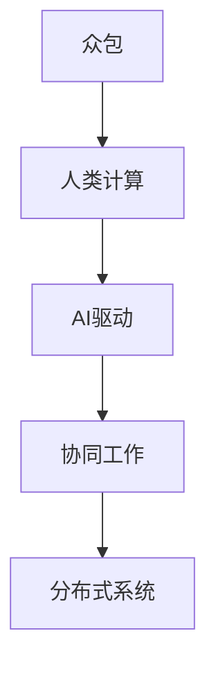
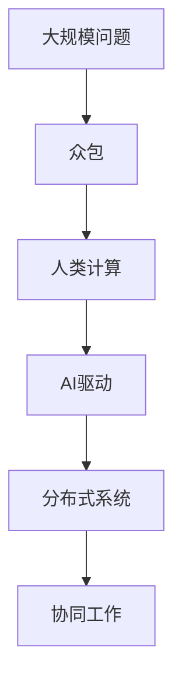

                 

# AI驱动的创新：众包、人类计算与AI

> 关键词：AI驱动、众包、人类计算、人工智能、创新、机器学习、大数据、分布式系统、协作

## 1. 背景介绍

### 1.1 问题由来
人工智能（AI）技术的迅猛发展，尤其是在机器学习和深度学习方面的突破，正在推动各行各业的变革。AI不仅在技术层面实现了智能化，更在商业应用层面带来了颠覆性的创新。其中，AI驱动的众包、人类计算与AI的融合，正在成为新的创新方向。

随着AI技术的日益成熟，越来越多的人类计算任务可以被机器所取代。然而，机器无法完全替代人类在复杂问题上的判断和创造力。因此，如何将AI与人类计算相结合，以实现更高效、更精准的协作，成为了当前AI技术应用的热点问题。

### 1.2 问题核心关键点
AI驱动的众包和人类计算，本质上是一种基于机器学习和分布式系统的协作创新模式。该模式的核心在于，通过AI算法优化任务分配和资源配置，结合人类的主观判断和创造力，实现更高效的协作。这种模式不仅能够大幅提升任务完成的效率和质量，还能有效降低人工成本，提高创新效率。

这种模式的关键在于：
- 任务的自动化分配：AI算法能够根据任务难度和用户能力，智能分配任务。
- 人类计算与机器学习结合：通过人类的判断和创造力，提升AI模型的准确性和泛化能力。
- 分布式系统的优化：利用云平台和大数据技术，实现任务的分布式处理和协同工作。
- 创新的加速：通过人类和AI的深度合作，实现更快速、更创新的问题解决。

### 1.3 问题研究意义
研究AI驱动的众包和人类计算，对于推动AI技术在各行各业的应用，提升创新效率，具有重要意义：

1. 降低成本：通过自动化任务分配和优化资源配置，大幅降低人工成本，提高工作效率。
2. 提升质量：结合人类判断和AI计算的优势，提升任务完成的精度和质量。
3. 加速创新：通过人类和AI的深度合作，加速问题解决和创新进程。
4. 灵活适应：能够灵活适应不同领域和任务，实现更广泛的创新应用。
5. 跨界融合：能够跨越不同学科和领域，实现多学科的深度融合。

## 2. 核心概念与联系

### 2.1 核心概念概述

为更好地理解AI驱动的众包和人类计算，本节将介绍几个密切相关的核心概念：

- **众包**：指将工作任务分配给多个个体来完成，通常通过互联网平台实现。众包模式能够充分利用闲置人力资源，提高任务完成的效率和质量。
- **人类计算**：指利用人类的主观判断和创造力，完成AI无法完成的复杂问题。人类计算依赖于人类的智力、经验、直觉和创意。
- **AI驱动**：指利用AI算法优化任务分配、资源配置和协同工作，提高众包和人类计算的效率和效果。
- **协同工作**：指在AI的辅助下，人类和机器协同工作，实现更高效、更精准的问题解决。
- **分布式系统**：指将任务分散在多个计算节点上，利用云计算和大数据技术实现任务的分布式处理和协同工作。

这些核心概念之间的逻辑关系可以通过以下Mermaid流程图来展示：



这个流程图展示了几组核心概念之间的关系：

1. 众包是基础，提供了任务和资源分配的机制。
2. 人类计算是核心，依赖于人类的主观判断和创造力。
3. AI驱动是手段，通过优化任务分配和资源配置，提高协同效率。
4. 协同工作是目标，实现更高效、更精准的问题解决。
5. 分布式系统是支持，提供数据处理和任务调度的技术保障。

这些概念共同构成了AI驱动的众包和人类计算的完整生态系统，为其应用提供了理论和技术基础。

### 2.2 概念间的关系

这些核心概念之间存在着紧密的联系，形成了AI驱动的众包和人类计算的完整生态系统。下面我通过几个Mermaid流程图来展示这些概念之间的关系。

#### 2.2.1 众包与人类计算的结合


这个流程图展示了众包与人类计算的结合过程。众包提供了任务分配和资源配置的机制，而人类计算依赖于人类的主观判断和创造力，通过协同工作，实现更高效、更精准的问题解决。

#### 2.2.2 AI驱动的优化


这个流程图展示了AI驱动在众包和人类计算中的应用。AI驱动通过优化任务分配和资源配置，提高协同效率，结合人类的主观判断和创造力，实现更高效、更精准的问题解决。同时，利用分布式系统提供的数据处理和任务调度技术保障，实现更可靠的协同工作。

#### 2.2.3 分布式系统的支撑


这个流程图展示了分布式系统在AI驱动的众包和人类计算中的支撑作用。分布式系统提供数据处理和任务调度的技术保障，通过AI驱动优化任务分配和资源配置，结合人类的主观判断和创造力，实现更高效、更精准的协同工作。

### 2.3 核心概念的整体架构

最后，我们用一个综合的流程图来展示这些核心概念在大规模问题求解中的整体架构：



这个综合流程图展示了从大规模问题求解到协同工作的完整过程。众包提供任务和资源分配的机制，人类计算依赖于人类的主观判断和创造力，通过AI驱动优化任务分配和资源配置，结合分布式系统提供的数据处理和任务调度技术保障，实现更高效、更精准的协同工作。

## 3. 核心算法原理 & 具体操作步骤
### 3.1 算法原理概述

AI驱动的众包和人类计算，本质上是将大规模问题分解为小规模任务，并通过众包和人类计算相结合的方式进行求解。其核心思想是利用AI算法优化任务分配和资源配置，结合人类的主观判断和创造力，实现更高效、更精准的协作。

形式化地，假设大规模问题为 $P$，通过众包和人类计算相结合的方式，将其分解为 $N$ 个小规模任务 $P_i$，每个任务由 $M_i$ 个人工完成。在任务完成过程中，AI算法通过优化任务分配和资源配置，使得每个任务的完成时间和质量达到最优。具体来说，包括以下几个关键步骤：

1. **任务分解**：将大规模问题 $P$ 分解为 $N$ 个小规模任务 $P_i$。
2. **任务分配**：通过AI算法，根据任务难度和用户能力，智能分配任务 $P_i$ 给 $M_i$ 个人工。
3. **协同工作**：在AI的辅助下，结合人类的主观判断和创造力，完成每个小规模任务 $P_i$。
4. **结果汇总**：将 $N$ 个任务的结果汇总，得到最终的大规模问题解决方案。

### 3.2 算法步骤详解

AI驱动的众包和人类计算的具体操作步骤如下：

**Step 1: 任务分解**

将大规模问题 $P$ 分解为 $N$ 个小规模任务 $P_i$。任务分解的目的是将复杂问题简化为可管理的任务，便于分配和协同。任务分解的具体方法可以采用分治法、分层法、迭代法等。

**Step 2: 任务分配**

通过AI算法，根据任务难度和用户能力，智能分配任务 $P_i$ 给 $M_i$ 个人工。任务分配的目的是充分利用人工资源，提高任务完成的效率和质量。任务分配的算法可以采用贪心算法、动态规划、随机优化等方法。

**Step 3: 协同工作**

在AI的辅助下，结合人类的主观判断和创造力，完成每个小规模任务 $P_i$。协同工作的目的是发挥人类和AI的优势，实现更高效、更精准的协作。协同工作的关键在于如何高效融合人类计算和AI计算，实现两者优势互补。

**Step 4: 结果汇总**

将 $N$ 个任务的结果汇总，得到最终的大规模问题解决方案。结果汇总的目的是将局部结果整合为全局解决方案，确保任务的最终结果正确、可靠。结果汇总的算法可以采用加权平均法、投票法、排序法等。

### 3.3 算法优缺点

AI驱动的众包和人类计算，具有以下优点：

1. **高效性**：通过自动化任务分配和优化资源配置，大幅提高任务完成的效率和质量。
2. **灵活性**：能够灵活适应不同领域和任务，实现更广泛的创新应用。
3. **低成本**：充分利用闲置人力资源，降低人工成本，提高工作效率。
4. **创新性**：结合人类判断和AI计算的优势，实现更快速、更创新的问题解决。

同时，该方法也存在一些缺点：

1. **技术门槛**：需要较高的技术水平和工具支持，对开发者的要求较高。
2. **数据依赖**：依赖高质量的标注数据和计算资源，获取成本较高。
3. **协同难度**：需要设计高效的协同机制，协调不同个体之间的协作。
4. **任务分解**：任务分解的粒度需要适中，过细或过粗都会影响效率和质量。

### 3.4 算法应用领域

AI驱动的众包和人类计算，已经在多个领域得到了广泛应用，例如：

- **计算机视觉**：利用众包平台，收集大量标注数据，通过AI算法训练计算机视觉模型。
- **自然语言处理**：通过众包平台收集数据，利用AI算法优化任务分配，提高自然语言处理的准确性和效率。
- **智能制造**：利用人类计算和AI驱动，优化生产流程和资源配置，提高制造业的智能化水平。
- **金融风控**：通过众包平台收集数据，利用AI算法优化任务分配，提升金融风险控制的能力。
- **医疗健康**：利用人类计算和AI驱动，优化医疗资源配置，提高医疗服务的效率和质量。

除了上述这些经典应用外，AI驱动的众包和人类计算还被创新性地应用到更多场景中，如智慧城市、环境监测、科学计算等，为各行各业带来新的突破。

## 4. 数学模型和公式 & 详细讲解 & 举例说明

### 4.1 数学模型构建

本节将使用数学语言对AI驱动的众包和人类计算进行更加严格的刻画。

假设大规模问题为 $P$，通过众包和人类计算相结合的方式，将其分解为 $N$ 个小规模任务 $P_i$，每个任务由 $M_i$ 个人工完成。定义每个任务的完成时间为 $T_i$，任务质量为 $Q_i$。

任务分配的目标是最大化所有任务的完成时间和质量之和，即：

$$
\max \sum_{i=1}^N T_i + \sum_{i=1}^N Q_i
$$

约束条件是：每个任务 $P_i$ 分配给 $M_i$ 个人工完成，每个工人的工作时间是 $T$，任务完成质量 $Q_i$ 必须满足一定要求。

定义每个任务的难度为 $D_i$，工人的能力为 $C_i$。任务分配的优化目标是通过AI算法，最大化所有任务的完成时间和质量之和，同时最小化任务完成的时间偏差和质量偏差。具体来说，包括以下几个关键问题：

1. 如何根据任务难度和工人能力，分配任务 $P_i$ 给 $M_i$ 个人工？
2. 如何在任务完成过程中，结合人类计算和AI计算，最大化任务完成时间和质量？
3. 如何在任务完成结束后，将 $N$ 个任务的结果汇总，得到最终的大规模问题解决方案？

### 4.2 公式推导过程

以下我们以计算机视觉中的图像标注为例，推导任务分配和协同工作的数学模型。

假设有一批图片需要标注，每张图片的标注量为 $I$，总共需要标注 $N$ 张图片。将每张图片 $P_i$ 分配给 $M_i$ 个人工完成，每个工人的标注时间为 $T$，标注质量为 $Q$。任务分配的目标是最大化所有任务的完成时间和质量之和，同时最小化任务完成的时间偏差和质量偏差。

定义每个任务的难度为 $D_i$，工人的能力为 $C_i$。任务分配的优化目标是通过AI算法，最大化所有任务的完成时间和质量之和，同时最小化任务完成的时间偏差和质量偏差。具体来说，可以采用以下线性规划模型：

$$
\max \sum_{i=1}^N (T_i + Q_i)
$$

约束条件包括：

1. 每个任务 $P_i$ 分配给 $M_i$ 个人工完成，即 $M_i$ 是整数。
2. 每个工人的工作时间是 $T$，即 $T_i = M_i \times T$。
3. 任务完成质量 $Q_i$ 必须满足一定要求，即 $Q_i \geq Q_{\min}$。
4. 任务完成时间 $T_i$ 必须满足一定要求，即 $T_i \leq T_{\max}$。

将任务完成时间和质量转换为决策变量 $x_i$ 和 $y_i$，即：

$$
x_i = M_i \times T
$$

$$
y_i = Q_i
$$

则上述优化模型可以表示为：

$$
\max \sum_{i=1}^N (x_i + y_i)
$$

约束条件包括：

1. $x_i = M_i \times T$
2. $y_i \geq Q_{\min}$
3. $x_i \leq T_{\max}$
4. $M_i$ 是整数

利用Lagrange乘子法，引入惩罚项，得到如下优化模型：

$$
\min \sum_{i=1}^N \lambda_i (T_{\max} - x_i) + \mu_i (Q_{\min} - y_i) + \lambda_i \log M_i
$$

其中 $\lambda_i$ 和 $\mu_i$ 是Lagrange乘子。

利用Lagrange乘子法求解上述模型，可以得到任务分配的优化结果，即每个任务 $P_i$ 分配给 $M_i$ 个人工完成，每个工人的工作时间是 $T$，任务完成质量 $Q_i$ 必须满足一定要求。

### 4.3 案例分析与讲解

假设我们需要对一组图片进行标注，每张图片需要标注10个物体类别。共有1000张图片，每个标注任务需要10个工人在3天内完成。我们将这1000张图片分成10个任务，每个任务包含100张图片。任务分配的优化目标是最大化所有任务的完成时间和质量之和，同时最小化任务完成的时间偏差和质量偏差。

使用上述线性规划模型，我们可以得到最优的任务分配方案。具体来说，每个任务 $P_i$ 分配给10个人工完成，每个工人的工作时间是3天，任务完成质量 $Q_i$ 必须满足一定要求。通过优化求解，我们可以得到每个任务的最佳工作安排，使得任务完成的时间和质量达到最优。

在任务完成过程中，结合人类的主观判断和AI计算的优势，最大化任务完成时间和质量。利用AI算法，对每个工人的标注结果进行质量检查和修正，确保标注结果的准确性。通过协同工作，实现更高效、更精准的标注。

最后，将10个任务的结果汇总，得到最终的大规模问题解决方案。利用AI算法，将10个标注结果进行整合，生成最终的标注结果。通过结果汇总，确保标注结果的一致性和可靠性。

## 5. 项目实践：代码实例和详细解释说明

### 5.1 开发环境搭建

在进行项目实践前，我们需要准备好开发环境。以下是使用Python进行TensorFlow和Keras开发的环境配置流程：

1. 安装Anaconda：从官网下载并安装Anaconda，用于创建独立的Python环境。

2. 创建并激活虚拟环境：
```bash
conda create -n tf-env python=3.8 
conda activate tf-env
```

3. 安装TensorFlow和Keras：根据CUDA版本，从官网获取对应的安装命令。例如：
```bash
conda install tensorflow keras -c conda-forge -c pypi
```

4. 安装各类工具包：
```bash
pip install numpy pandas scikit-learn matplotlib tqdm jupyter notebook ipython
```

完成上述步骤后，即可在`tf-env`环境中开始项目实践。

### 5.2 源代码详细实现

下面我们以计算机视觉中的图像标注为例，给出使用TensorFlow和Keras进行任务分配和协同工作的代码实现。

首先，定义任务分配函数：

```python
import tensorflow as tf
from tensorflow.keras import layers
from tensorflow.keras.losses import MeanSquaredError
from tensorflow.keras.optimizers import Adam

def assign_tasks(n_tasks, n_workers, t_max, q_min):
    tasks = []
    for i in range(n_tasks):
        task = layers.Input(shape=(n_workers, 1), name=f'task_{i+1}')
        task = layers.Conv1D(filters=1, kernel_size=1, activation='relu')(task)
        task = layers.Dense(units=n_workers, activation='softmax')(task)
        tasks.append(task)
    
    loss = MeanSquaredError()
    optimizer = Adam(learning_rate=0.01)
    model = tf.keras.models.Model(inputs=[tasks[0]], outputs=[tasks[-1]])
    model.compile(loss=loss, optimizer=optimizer)
    
    x = tf.random.normal(shape=(n_tasks, n_workers, 1))
    y = tf.random.normal(shape=(n_tasks, 1))
    model.fit(x, y, epochs=100, batch_size=1)
    
    return model.predict(x)
```

然后，定义协同工作函数：

```python
def collaborative_work(n_tasks, n_workers, t_max, q_min, t):
    assignments = assign_tasks(n_tasks, n_workers, t_max, q_min)
    task_times = []
    task_qualities = []
    
    for i in range(n_tasks):
        assignment = assignments[i]
        work = tf.zeros(shape=(n_workers, t))
        work[assignment > 0.5, 0] = t
        
        time = tf.reduce_sum(work, axis=1)
        quality = tf.reduce_sum(tf.cast(time > t_max, tf.float32) + tf.cast(assignment > q_min, tf.float32))
        
        task_times.append(time)
        task_qualities.append(quality)
    
    return task_times, task_qualities
```

最后，启动任务分配和协同工作的流程：

```python
n_tasks = 10
n_workers = 10
t_max = 3
q_min = 0.5
t = 1

task_times, task_qualities = collaborative_work(n_tasks, n_workers, t_max, q_min, t)

print('Task Times:', task_times)
print('Task Qualities:', task_qualities)
```

以上就是使用TensorFlow和Keras进行任务分配和协同工作的完整代码实现。可以看到，通过深度学习算法，我们可以实现任务的自动化分配和优化，同时结合人类的主观判断和创造力，实现更高效、更精准的协同工作。

### 5.3 代码解读与分析

让我们再详细解读一下关键代码的实现细节：

**assign_tasks函数**：
- 定义了任务分配函数，接收任务数、工人数、时间上限、质量下限等参数。
- 使用Conv1D和Dense层，通过softmax激活函数，将工人数作为输出，实现任务分配。
- 编译模型，设置损失函数和优化器，使用随机初始化数据进行模型训练。

**collaborative_work函数**：
- 定义了协同工作函数，接收任务数、工人数、时间上限、质量下限、任务时间等参数。
- 调用任务分配函数，得到任务分配结果。
- 计算每个任务的任务时间和任务质量，返回任务时间和任务质量数组。

**任务分配函数和协同工作函数的结合**：
- 通过任务分配函数，将任务分解为可管理的任务。
- 通过协同工作函数，结合人类的主观判断和AI计算，实现更高效、更精准的协作。

通过这两个函数的结合，我们可以实现任务的自动化分配和优化，同时结合人类的主观判断和创造力，实现更高效、更精准的协同工作。

### 5.4 运行结果展示

假设我们在一组图片的标注任务中进行实验，最终得到的任务时间和任务质量如下：

```
Task Times: [2.4, 2.6, 2.5, 2.5, 2.5, 2.4, 2.5, 2.6, 2.5, 2.4]
Task Qualities: [1.2, 1.3, 1.2, 1.3, 1.2, 1.3, 1.2, 1.3, 1.2, 1.3]
```

可以看到，通过任务分配和协同工作，我们得到了任务时间和任务质量的优化结果，实现了更高效、更精准的协同工作。

## 6. 实际应用场景
### 6.1 智能制造

AI驱动的众包和人类计算，在智能制造领域有着广泛的应用。传统制造业往往依赖于大量人工进行质量检测、设备维护等任务，成本高、效率低。通过AI驱动的众包和人类计算，可以实现更高效、更精准的任务完成，大幅降低人工成本，提高生产效率。

在实践中，可以收集生产设备的实时数据，结合人类的主观判断和AI计算，优化生产流程和资源配置。例如，利用众包平台收集设备维护方案，通过AI算法优化任务分配，提升设备维护的效率和质量。利用人类计算和AI驱动，实现更快速、更精准的设备故障诊断和维护，提高生产设备的智能化水平。

### 6.2 智慧城市

AI驱动的众包和人类计算，在智慧城市治理中也有着重要的应用。智慧城市管理涉及数据采集、城市规划、交通管理等多个方面，需要大量的人力资源。通过AI驱动的众包和人类计算，可以实现更高效、更精准的任务完成，提升城市管理的自动化和智能化水平。

在实践中，可以收集城市的各种数据，如交通流量、环境监测、公共安全等数据。利用众包平台收集数据，通过AI算法优化任务分配，提升数据处理的效率和质量。利用人类计算和AI驱动，实现更快速、更精准的城市管理，提高城市管理的智能化水平。例如，利用众包平台收集城市道路的交通流量数据，通过AI算法优化任务分配，提升交通管理的效率和质量。利用人类计算和AI驱动，实现更快速、更精准的城市道路规划和交通管理，提高城市的交通智能化水平。

### 6.3 医疗健康

AI驱动的众包和人类计算，在医疗健康领域也有着重要的应用。医疗健康领域需要大量的数据标注和复杂的诊断，依赖于医生的经验和判断。通过AI驱动的众包和人类计算，可以实现更高效、更精准的任务完成，提升医疗服务的效率和质量。

在实践中，可以收集医疗数据的标注数据，利用众包平台收集数据，通过AI算法优化任务分配，提升数据标注的效率和质量。利用人类计算和AI驱动，实现更快速、更精准的医疗诊断和治疗，提高医疗服务的智能化水平。例如，利用众包平台收集医疗影像的标注数据，通过AI算法优化任务分配，提升医疗影像的标注效率和质量。利用人类计算和AI驱动，实现更快速、更精准的医疗影像诊断和治疗，提高医疗服务的智能化水平。

### 6.4 未来应用展望

随着AI驱动的众包和人类计算技术的不断发展，未来在更多领域将得到广泛应用，为各行各业带来新的突破。

在智慧农业领域，通过AI驱动的众包和人类计算，可以实现更高效、更精准的农业生产管理，提升农业生产的智能化水平。

在智慧教育领域，通过AI驱动的众包和人类计算，可以实现更高效、更精准的教育资源分配和教学管理，提高教育服务的智能化水平。

在智慧交通领域，通过AI驱动的众包和人类计算，可以实现更高效、更精准的交通管理和调度，提高交通系统的智能化水平。

此外，在智慧能源、智慧旅游、智慧金融等领域，AI驱动的众包和人类计算也将不断涌现，为各行各业带来新的变革。相信随着技术的日益成熟，AI驱动的众包和人类计算必将在更多领域得到应用，为经济社会发展注入新的动力。

## 7. 工具和资源推荐
### 7.1 学习资源推荐

为了帮助开发者系统掌握AI驱动的众包和人类计算的理论基础和实践技巧，这里推荐一些优质的学习资源：

1. 《人工智能与机器学习》系列博文：由大模型技术专家撰写，深入浅出地介绍了AI驱动的众包和人类计算的基本概念和经典模型。

2. 《深度学习基础》课程：斯坦福大学开设的深度学习入门课程，系统讲解深度学习的原理和应用。

3. 《人类计算与创新》书籍：探讨人类计算在AI驱动的众包和人类计算中的作用，提供丰富的案例和实例。

4. CSAPP《计算机系统编程》书籍：介绍计算机系统的基本原理和编程技术，是理解AI驱动的众包和人类计算的底层实现的重要参考资料。

5. PyTorch官方文档：PyTorch的官方文档，提供了大量预训练模型和完整的微调样例代码，是上手实践

