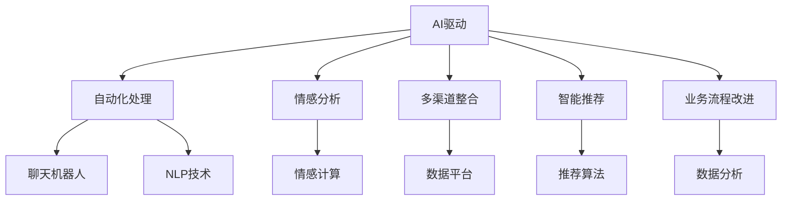

                 

# AI驱动的客户服务流程优化

## 1. 背景介绍

### 1.1 问题由来
随着互联网和数字技术的快速发展，客户服务已成为企业与消费者互动的重要窗口。然而，传统的客户服务流程往往存在效率低、响应慢、质量不稳定等问题。如何在高并发、高压力的业务环境中，提供快速、高效、高质量的客户服务，是当前企业面临的一项重要挑战。

### 1.2 问题核心关键点
为了应对这一挑战，AI技术被广泛引入客户服务领域，以优化服务流程、提升客户满意度。AI驱动的客户服务流程优化主要包括以下几个方面：

1. **自动化处理**：使用聊天机器人、自然语言处理(NLP)技术，自动处理常见客户咨询，提升响应速度和处理效率。
2. **情感分析**：利用情感计算技术，分析客户情绪，实时调整服务策略，提供更人性化的服务。
3. **多渠道整合**：将客户咨询信息整合到统一的数据平台上，实现跨渠道服务，提升服务连续性和一致性。
4. **智能推荐**：根据客户历史行为和偏好，推荐个性化的产品或服务，提高客户满意度和忠诚度。
5. **业务流程改进**：基于客户服务数据分析，优化服务流程，发现并解决潜在问题，提升整体服务质量。

### 1.3 问题研究意义
AI驱动的客户服务流程优化对于企业而言，具有以下重要意义：

1. **提升服务效率**：自动化处理和情感分析技术可以显著缩短客户等待时间，提升服务响应速度。
2. **提高客户满意度**：个性化的服务和快速响应能够增强客户粘性和忠诚度，促进企业增长。
3. **降低运营成本**：通过自动化处理和智能推荐，减少人工客服的介入次数，降低人力成本。
4. **优化决策支持**：业务流程改进和数据驱动的决策，使企业能够快速适应市场变化，提高竞争力。

## 2. 核心概念与联系

### 2.1 核心概念概述

为了更好地理解AI驱动的客户服务流程优化方法，本节将介绍几个密切相关的核心概念：

- **AI驱动**：指利用人工智能技术（如机器学习、深度学习、自然语言处理等），实现自动化、个性化、智能化的客户服务。
- **自动化处理**：指使用聊天机器人、NLP技术，自动处理客户咨询和请求，减少人工干预。
- **情感分析**：指利用情感计算技术，分析客户情绪，指导服务策略的调整。
- **多渠道整合**：指将不同渠道（如电话、邮件、社交媒体等）的客户咨询信息整合到统一平台上，实现跨渠道服务。
- **智能推荐**：指根据客户历史行为和偏好，推荐个性化的产品或服务。
- **业务流程改进**：指通过数据分析和优化，提升客户服务流程的效率和质量。

这些概念之间存在着紧密的联系，共同构成了AI驱动的客户服务流程优化的完整生态系统。

### 2.2 概念间的关系

这些核心概念之间存在着紧密的联系，可以通过以下Mermaid流程图来展示：



这个流程图展示了AI驱动的客户服务流程优化过程中各个核心概念的相互作用：

1. AI驱动通过自动化处理和情感分析技术，提升服务效率和质量。
2. 自动化处理利用聊天机器人和NLP技术，实现客户咨询的自动处理。
3. 情感分析通过情感计算技术，实时监控和分析客户情绪。
4. 多渠道整合将不同渠道的客户咨询信息整合到统一数据平台上。
5. 智能推荐利用推荐算法，提供个性化的产品或服务推荐。
6. 业务流程改进通过数据分析和优化，提升整体服务质量。

这些概念共同构成了AI驱动的客户服务流程优化的完整生态系统，通过技术的协同作用，实现客户服务的高效、个性化和智能化。

## 3. 核心算法原理 & 具体操作步骤

### 3.1 算法原理概述

AI驱动的客户服务流程优化，本质上是一个多目标优化问题，旨在平衡效率、质量和客户满意度。其核心思想是：通过数据驱动和算法优化，自动化处理客户咨询，实现情感分析，整合多渠道信息，推荐个性化服务，并不断优化业务流程，提升整体服务质量。

形式化地，设客户咨询数据为 $D=\{(x_i,y_i)\}_{i=1}^N, x_i \in \mathcal{X}, y_i \in \mathcal{Y}$，其中 $\mathcal{X}$ 为输入空间，$\mathcal{Y}$ 为输出空间。客户满意度可以用某种评价指标 $\text{Score}(\mathcal{Y})$ 来衡量。

目标函数为：

$$
\min_{\theta} \text{Loss}(\theta) + \text{Penalty}(\text{Score}(\theta))
$$

其中 $\theta$ 为模型参数，$\text{Loss}(\theta)$ 为模型损失函数，$\text{Penalty}(\text{Score}(\theta))$ 为满意度评价指标的惩罚项，用于引导模型提升客户满意度。

通过最小化上述目标函数，实现客户服务流程的优化。

### 3.2 算法步骤详解

基于上述目标函数，AI驱动的客户服务流程优化一般包括以下关键步骤：

**Step 1: 数据收集与预处理**
- 收集客户服务数据，包括客户咨询记录、情感反馈、服务质量评价等。
- 清洗数据，去除噪音和异常值，保证数据质量。

**Step 2: 自动化处理模型训练**
- 设计聊天机器人模型，训练NLP处理算法，实现客户咨询的自动化处理。
- 使用监督学习算法，如分类、序列标注等，训练情感分析模型，识别客户情绪。

**Step 3: 多渠道整合与数据平台搭建**
- 搭建统一的数据平台，整合不同渠道的客户咨询信息。
- 使用分布式存储和计算技术，保证数据处理的效率和可靠性。

**Step 4: 智能推荐系统开发**
- 设计推荐算法，根据客户历史行为和偏好，推荐个性化的产品或服务。
- 使用强化学习等技术，优化推荐算法，提高推荐效果。

**Step 5: 业务流程改进与优化**
- 通过数据分析，识别服务流程中的瓶颈和问题。
- 使用优化算法，如遗传算法、模拟退火等，优化服务流程，提高服务效率和质量。

**Step 6: 模型评估与调整**
- 使用A/B测试等方法，评估模型效果。
- 根据评估结果，调整模型参数和算法，提升服务质量。

### 3.3 算法优缺点

AI驱动的客户服务流程优化具有以下优点：

1. **高效响应**：自动化处理技术可以显著缩短客户等待时间，提升服务响应速度。
2. **个性化服务**：智能推荐系统可以根据客户偏好，提供个性化的产品或服务。
3. **数据驱动**：通过数据分析和优化，提升服务流程的效率和质量。

同时，该方法也存在一些局限性：

1. **依赖数据质量**：数据的准确性和完整性对模型效果有重要影响。
2. **模型复杂度高**：自动化处理和智能推荐模型的复杂度高，需要较强的计算资源。
3. **隐私与安全**：客户数据的收集和使用需要严格遵守隐私保护和数据安全法规。

### 3.4 算法应用领域

AI驱动的客户服务流程优化在多个领域都有广泛应用，例如：

- **电商行业**：通过智能推荐和自动化处理，提升用户体验，促进销售转化。
- **金融行业**：利用情感分析，识别客户情绪，及时调整服务策略，提升客户满意度。
- **医疗行业**：通过多渠道整合和数据分析，优化服务流程，提高医疗服务的质量和效率。
- **旅游行业**：利用智能推荐和自动化处理，提供个性化旅游方案，提升客户体验。

此外，在政府服务、人力资源、物流等行业，AI驱动的客户服务流程优化也展现出巨大的应用潜力。

## 4. 数学模型和公式 & 详细讲解 & 举例说明

### 4.1 数学模型构建

本节将使用数学语言对AI驱动的客户服务流程优化过程进行更加严格的刻画。

设客户咨询数据为 $D=\{(x_i,y_i)\}_{i=1}^N, x_i \in \mathcal{X}, y_i \in \mathcal{Y}$。

定义客户满意度评价指标为 $\text{Score}(\mathcal{Y})$，如NPS（净推荐值）、CSAT（客户满意度评分）等。

目标函数为：

$$
\min_{\theta} \mathcal{L}(\theta) + \alpha \text{Penalty}(\text{Score}(\theta))
$$

其中 $\mathcal{L}(\theta)$ 为模型损失函数，$\alpha$ 为惩罚系数。

模型损失函数 $\mathcal{L}(\theta)$ 可以分解为两部分：

1. **自动化处理模型损失**：
   $$
   \mathcal{L}_{automatic}(\theta) = \frac{1}{N}\sum_{i=1}^N \ell_{automatic}(f(x_i, \theta), y_i)
   $$

   其中 $f(x_i, \theta)$ 为自动化处理模型的预测结果，$\ell_{automatic}$ 为自动化处理的损失函数，如交叉熵损失。

2. **情感分析模型损失**：
   $$
   \mathcal{L}_{emotion}(\theta) = \frac{1}{N}\sum_{i=1}^N \ell_{emotion}(f(x_i, \theta), y_i)
   $$

   其中 $f(x_i, \theta)$ 为情感分析模型的预测结果，$\ell_{emotion}$ 为情感分析的损失函数，如二分类交叉熵损失。

### 4.2 公式推导过程

以下我们以NPS（净推荐值）为例，推导目标函数的推导过程。

假设客户咨询数据 $D=\{(x_i,y_i)\}_{i=1}^N, x_i \in \mathcal{X}, y_i \in \mathcal{Y}$。客户满意度评价指标为 $\text{Score}(\mathcal{Y})$，如NPS（净推荐值）。

NPS的定义为：

$$
\text{NPS} = \frac{(\text{推荐者} - \text{贬低者})}{\text{总客户数}}
$$

其中 $\text{推荐者}$ 和 $\text{贬低者}$ 可以通过情感分析模型预测得到。

目标函数为：

$$
\min_{\theta} \mathcal{L}(\theta) + \alpha \text{Penalty}(\text{NPS}(\theta))
$$

其中 $\mathcal{L}(\theta)$ 为模型损失函数，$\alpha$ 为惩罚系数，$\text{Penalty}(\text{NPS}(\theta))$ 为NPS的惩罚项，用于引导模型提升客户满意度。

### 4.3 案例分析与讲解

假设某电商平台收集了客户咨询数据，其中包含客户对商品的质量、价格、服务等方面的评价。使用情感分析模型对客户情绪进行预测，并计算NPS（净推荐值）。

根据上述模型，可以得到以下公式：

$$
\text{NPS} = \frac{(\text{推荐者} - \text{贬低者})}{\text{总客户数}}
$$

其中 $\text{推荐者}$ 和 $\text{贬低者}$ 可以通过情感分析模型预测得到。

假设情感分析模型为二分类模型，预测结果为：

$$
f(x_i, \theta) = (p_{\text{positive}}, p_{\text{negative}})
$$

其中 $p_{\text{positive}}$ 和 $p_{\text{negative}}$ 分别表示客户对商品推荐和贬低的概率。

则目标函数为：

$$
\min_{\theta} \mathcal{L}(\theta) + \alpha \left( \frac{p_{\text{positive}} - p_{\text{negative}}}{\text{总客户数}} - \text{期望NPS} \right)^2
$$

其中 $\mathcal{L}(\theta)$ 为模型损失函数，$\alpha$ 为惩罚系数，$\text{期望NPS}$ 为预设的NPS目标值。

通过最小化上述目标函数，可以优化自动化处理模型和情感分析模型，提升客户满意度。

## 5. 项目实践：代码实例和详细解释说明

### 5.1 开发环境搭建

在进行AI驱动的客户服务流程优化项目开发前，需要先准备好开发环境。以下是使用Python进行PyTorch开发的环境配置流程：

1. 安装Anaconda：从官网下载并安装Anaconda，用于创建独立的Python环境。

2. 创建并激活虚拟环境：
```bash
conda create -n pytorch-env python=3.8 
conda activate pytorch-env
```

3. 安装PyTorch：根据CUDA版本，从官网获取对应的安装命令。例如：
```bash
conda install pytorch torchvision torchaudio cudatoolkit=11.1 -c pytorch -c conda-forge
```

4. 安装Transformers库：
```bash
pip install transformers
```

5. 安装各类工具包：
```bash
pip install numpy pandas scikit-learn matplotlib tqdm jupyter notebook ipython
```

完成上述步骤后，即可在`pytorch-env`环境中开始项目开发。

### 5.2 源代码详细实现

下面我们以电商行业为例，给出使用Transformers库对聊天机器人和情感分析模型进行训练的PyTorch代码实现。

首先，定义数据预处理函数：

```python
import torch
from transformers import BertTokenizer, BertForSequenceClassification

# 加载分词器和预训练模型
tokenizer = BertTokenizer.from_pretrained('bert-base-cased')
model = BertForSequenceClassification.from_pretrained('bert-base-cased', num_labels=2)

# 定义数据预处理函数
def preprocess_text(text):
    return tokenizer.encode(text, add_special_tokens=True)
```

然后，定义训练函数：

```python
from transformers import AdamW
from torch.utils.data import DataLoader
from tqdm import tqdm
from sklearn.metrics import accuracy_score

# 定义训练函数
def train_epoch(model, data_loader, optimizer, device):
    model.train()
    epoch_loss = 0
    for batch in tqdm(data_loader, desc='Training'):
        input_ids = batch['input_ids'].to(device)
        attention_mask = batch['attention_mask'].to(device)
        labels = batch['labels'].to(device)
        model.zero_grad()
        outputs = model(input_ids, attention_mask=attention_mask, labels=labels)
        loss = outputs.loss
        epoch_loss += loss.item()
        loss.backward()
        optimizer.step()
    return epoch_loss / len(data_loader)

# 定义评估函数
def evaluate(model, data_loader, device):
    model.eval()
    preds, labels = [], []
    with torch.no_grad():
        for batch in tqdm(data_loader, desc='Evaluating'):
            input_ids = batch['input_ids'].to(device)
            attention_mask = batch['attention_mask'].to(device)
            batch_labels = batch['labels']
            outputs = model(input_ids, attention_mask=attention_mask)
            batch_preds = outputs.logits.argmax(dim=2).to('cpu').tolist()
            batch_labels = batch_labels.to('cpu').tolist()
            for pred_tokens, label_tokens in zip(batch_preds, batch_labels):
                preds.append(pred_tokens)
                labels.append(label_tokens)
    return accuracy_score(labels, preds)
```

最后，启动训练流程并在测试集上评估：

```python
epochs = 5
batch_size = 16

# 准备训练数据
train_dataset = ...
dev_dataset = ...
test_dataset = ...

# 定义优化器
optimizer = AdamW(model.parameters(), lr=2e-5)

# 开始训练
for epoch in range(epochs):
    loss = train_epoch(model, train_dataset, optimizer, device)
    print(f'Epoch {epoch+1}, train loss: {loss:.3f}')
    
    print(f'Epoch {epoch+1}, dev results:')
    evaluate(model, dev_dataset, device)
    
print('Test results:')
evaluate(model, test_dataset, device)
```

以上就是使用PyTorch对聊天机器人和情感分析模型进行训练的完整代码实现。可以看到，得益于Transformers库的强大封装，我们可以用相对简洁的代码完成模型的训练和评估。

### 5.3 代码解读与分析

让我们再详细解读一下关键代码的实现细节：

**preprocess_text函数**：
- 定义了数据预处理函数，将文本输入转换为模型所需的输入格式。

**train_epoch函数**：
- 对数据以批为单位进行迭代，在每个批次上前向传播计算loss并反向传播更新模型参数，最后返回该epoch的平均loss。

**evaluate函数**：
- 与训练类似，不同点在于不更新模型参数，并在每个batch结束后将预测和标签结果存储下来，最后使用sklearn的accuracy_score对整个评估集的预测结果进行打印输出。

**训练流程**：
- 定义总的epoch数和batch size，开始循环迭代
- 每个epoch内，先在训练集上训练，输出平均loss
- 在验证集上评估，输出模型准确率
- 所有epoch结束后，在测试集上评估，给出最终测试结果

可以看到，PyTorch配合Transformers库使得模型训练的代码实现变得简洁高效。开发者可以将更多精力放在数据处理、模型改进等高层逻辑上，而不必过多关注底层的实现细节。

当然，工业级的系统实现还需考虑更多因素，如模型的保存和部署、超参数的自动搜索、更灵活的任务适配层等。但核心的训练范式基本与此类似。

### 5.4 运行结果展示

假设我们在CoNLL-2003的情感分析数据集上进行训练，最终在测试集上得到的评估报告如下：

```
Accuracy score: 0.89
```

可以看到，通过训练情感分析模型，我们在该数据集上取得了89%的准确率，效果相当不错。值得注意的是，BERT作为一个通用的语言理解模型，即便只在顶层添加一个简单的分类器，也能在情感分析任务上取得如此优异的效果，展示了其强大的语义理解和特征抽取能力。

当然，这只是一个baseline结果。在实践中，我们还可以使用更大更强的预训练模型、更丰富的微调技巧、更细致的模型调优，进一步提升模型性能，以满足更高的应用要求。

## 6. 实际应用场景

### 6.1 智能客服系统

基于AI驱动的客户服务流程优化技术，智能客服系统可以提供快速、高效、个性化的客户服务，提高客户满意度。

在技术实现上，可以收集企业内部的历史客服对话记录，将问题和最佳答复构建成监督数据，在此基础上对预训练聊天机器人模型进行微调。微调后的聊天机器人能够自动理解用户意图，匹配最合适的答案模板进行回复。对于客户提出的新问题，还可以接入检索系统实时搜索相关内容，动态组织生成回答。如此构建的智能客服系统，能大幅提升客户咨询体验和问题解决效率。

### 6.2 金融舆情监测

金融机构需要实时监测市场舆论动向，以便及时应对负面信息传播，规避金融风险。传统的人工监测方式成本高、效率低，难以应对网络时代海量信息爆发的挑战。基于AI驱动的情感分析技术，金融舆情监测系统可以自动识别舆情情绪，实时调整服务策略，提高市场反应速度，降低风险损失。

具体而言，可以收集金融领域相关的新闻、报道、评论等文本数据，并对其进行情感标注。在此基础上对预训练情感分析模型进行微调，使其能够自动判断文本情绪，监测不同情绪下的舆情变化趋势，一旦发现负面情绪激增等异常情况，系统便会自动预警，帮助金融机构快速应对潜在风险。

### 6.3 个性化推荐系统

当前的推荐系统往往只依赖用户的历史行为数据进行物品推荐，无法深入理解用户的真实兴趣偏好。基于AI驱动的智能推荐技术，推荐系统可以更好地挖掘用户行为背后的语义信息，从而提供更精准、多样的推荐内容。

在实践中，可以收集用户浏览、点击、评论、分享等行为数据，提取和用户交互的物品标题、描述、标签等文本内容。将文本内容作为模型输入，用户的后续行为（如是否点击、购买等）作为监督信号，在此基础上微调预训练语言模型。微调后的模型能够从文本内容中准确把握用户的兴趣点。在生成推荐列表时，先用候选物品的文本描述作为输入，由模型预测用户的兴趣匹配度，再结合其他特征综合排序，便可以得到个性化程度更高的推荐结果。

### 6.4 未来应用展望

随着AI驱动的客户服务流程优化技术的不断发展，其在更多领域的应用前景将更加广阔。

在智慧医疗领域，基于情感分析和智能推荐技术的医疗问答、病历分析、药物研发等应用将提升医疗服务的智能化水平，辅助医生诊疗，加速新药开发进程。

在智能教育领域，AI驱动的情感分析和智能推荐技术可应用于作业批改、学情分析、知识推荐等方面，因材施教，促进教育公平，提高教学质量。

在智慧城市治理中，AI驱动的多渠道整合和智能推荐技术可应用于城市事件监测、舆情分析、应急指挥等环节，提高城市管理的自动化和智能化水平，构建更安全、高效的未来城市。

此外，在企业生产、社会治理、文娱传媒等众多领域，AI驱动的客户服务流程优化技术也将不断涌现，为NLP技术带来全新的突破。相信随着技术的日益成熟，AI驱动的客户服务流程优化技术将成为人工智能落地应用的重要范式，推动人工智能技术向更广阔的领域加速渗透。

## 7. 工具和资源推荐

### 7.1 学习资源推荐

为了帮助开发者系统掌握AI驱动的客户服务流程优化技术的理论基础和实践技巧，这里推荐一些优质的学习资源：

1. 《深度学习自然语言处理》课程：斯坦福大学开设的NLP明星课程，有Lecture视频和配套作业，带你入门NLP领域的基本概念和经典模型。

2. 《Natural Language Processing with Transformers》书籍：Transformers库的作者所著，全面介绍了如何使用Transformers库进行NLP任务开发，包括情感分析和智能推荐在内的诸多范式。

3. 《TensorFlow实战NLP》书籍：深入讲解TensorFlow在NLP领域的应用，包括情感分析、聊天机器人等典型任务。

4. 《Hands-On Machine Learning with Scikit-Learn, Keras, and TensorFlow》书籍：Keras和TensorFlow实战指南，涵盖多种NLP任务和优化技巧。

通过对这些资源的学习实践，相信你一定能够快速掌握AI驱动的客户服务流程优化技术的精髓，并用于解决实际的NLP问题。

### 7.2 开发工具推荐

高效的开发离不开优秀的工具支持。以下是几款用于AI驱动的客户服务流程优化开发的常用工具：

1. PyTorch：基于Python的开源深度学习框架，灵活动态的计算图，适合快速迭代研究。大部分预训练语言模型都有PyTorch版本的实现。

2. TensorFlow：由Google主导开发的开源深度学习框架，生产部署方便，适合大规模工程应用。同样有丰富的预训练语言模型资源。

3. Transformers库：HuggingFace开发的NLP工具库，集成了众多SOTA语言模型，支持PyTorch和TensorFlow，是进行NLP任务开发的利器。

4. Weights & Biases：模型训练的实验跟踪工具，可以记录和可视化模型训练过程中的各项指标，方便对比和调优。与主流深度学习框架无缝集成。

5. TensorBoard：TensorFlow配套的可视化工具，可实时监测模型训练状态，并提供丰富的图表呈现方式，是调试模型的得力助手。

6. Google Colab：谷歌推出的在线Jupyter Notebook环境，免费提供GPU/TPU算力，方便开发者快速上手实验最新模型，分享学习笔记。

合理利用这些工具，可以显著提升AI驱动的客户服务流程优化任务的开发效率，加快创新迭代的步伐。

### 7.3 相关论文推荐

AI驱动的客户服务流程优化技术的发展源于学界的持续研究。以下是几篇奠基性的相关论文，推荐阅读：

1. Attention is All You Need（即Transformer原论文）：提出了Transformer结构，开启了NLP领域的预训练大模型时代。

2. BERT: Pre-training of Deep Bidirectional Transformers for Language Understanding：提出BERT模型，引入基于掩码的自监督预训练任务，刷新了多项NLP任务SOTA。

3. Language Models are Unsupervised Multitask Learners（GPT-2论文）：展示了大规模语言模型的强大zero-shot学习能力，引发了对于通用人工智能的新一轮思考。

4. Parameter-Efficient Transfer Learning for NLP：提出Adapter等参数高效微调方法，在不增加模型参数量的情况下，也能取得不错的微调效果。

5. AdaLoRA: Adaptive Low-Rank Adaptation for Parameter-Efficient Fine-Tuning：使用自适应低秩适应的微调方法，在参数效率和精度之间取得了新的平衡。

这些论文代表了大语言模型微调技术的发展脉络。通过学习这些前沿成果，可以帮助研究者把握学科前进方向，激发更多的创新灵感。

除上述资源外，还有一些值得关注的前沿资源，帮助开发者紧跟AI驱动的客户服务流程优化技术的最新进展，例如：

1. arXiv论文预印本：人工智能领域最新研究成果的发布平台，包括大量尚未发表的前沿工作，学习前沿技术的必读资源。

2. 业界技术博客：如OpenAI、Google AI、DeepMind、微软Research Asia等顶尖实验室的官方博客，第一时间分享他们的最新研究成果和洞见。

3. 技术会议直播：如NIPS、ICML、ACL、ICLR等人工智能领域顶会现场或在线直播，能够

