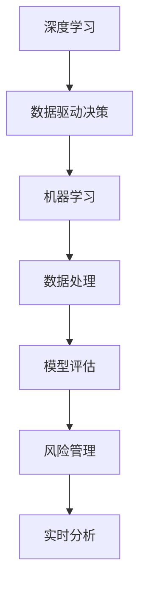

                 

# 数据驱动决策：AI如何提供深度洞察

> 关键词：深度学习, 机器学习, 数据驱动决策, AI应用, 模型评估, 数据处理, 风险管理, 实时分析

## 1. 背景介绍

在当今这个信息爆炸的时代，数据正以前所未有的速度积累，并成为企业决策的重要基石。企业越来越多地依赖于数据分析来驱动其运营和战略决策，从而提高效率和竞争优势。人工智能（AI），尤其是深度学习（DL）和机器学习（ML）技术，正在被广泛用于数据驱动决策的实践中。本文将深入探讨AI如何通过深度洞察来提供高质量的数据驱动决策支持，并讨论了数据驱动决策中的关键技术、应用和挑战。

## 2. 核心概念与联系

### 2.1 核心概念概述

为了更好地理解AI在数据驱动决策中的作用，我们首先介绍几个关键概念：

- **深度学习（Deep Learning）**：一种基于多层神经网络的机器学习技术，可以自动学习和提取数据的复杂特征。深度学习模型通过多层次的抽象，可以从原始数据中提取出高层次的语义信息。

- **机器学习（Machine Learning）**：一个广泛的概念，包括监督学习、无监督学习和强化学习等方法，用于从数据中学习模式和规律。机器学习算法可以根据已有数据预测新数据的结果。

- **数据驱动决策（Data-Driven Decision Making）**：一种决策过程，其中数据是决策制定的主要依据。数据驱动决策依赖于对数据的收集、处理和分析，以支持决策的制定和执行。

- **深度洞察（Deep Insights）**：通过AI和ML技术，从数据中挖掘出的深层次、高价值的洞见，可以用于预测未来趋势、优化业务流程、提升客户体验等。

- **模型评估（Model Evaluation）**：评估AI模型的性能和准确性，包括准确率、召回率、F1分数、ROC曲线等指标，以确保模型能够提供可靠的预测。

- **数据处理（Data Processing）**：对原始数据进行清洗、转换和整合，以提高数据质量和可用性。

- **风险管理（Risk Management）**：通过数据分析识别和管理潜在的风险，以最小化可能的损失。

- **实时分析（Real-time Analysis）**：在数据产生的实时基础上进行的分析，提供即时的决策支持。

这些概念之间的联系如图1所示，展示了AI和ML技术在数据驱动决策中的作用和流程。



### 2.2 概念间的关系

上述概念通过一系列的数据处理和分析流程，形成了AI支持数据驱动决策的整体框架。下面，我们将进一步探讨这些概念之间的关系。

- **深度学习**：作为AI的一个重要分支，深度学习在数据驱动决策中发挥了核心作用。通过构建复杂的神经网络结构，深度学习可以从大量数据中提取出高层次的语义信息，为决策提供深度洞察。

- **机器学习**：机器学习技术可以用于模型训练、特征提取和异常检测等，是深度洞察的重要手段。在数据驱动决策中，机器学习模型通常用于预测、分类和聚类任务。

- **数据处理**：数据处理是数据驱动决策的基础。通过数据清洗、转换和整合，确保数据质量和可用性，从而为AI和ML模型的训练和部署提供坚实的基础。

- **模型评估**：模型评估是确保AI和ML模型可靠性的关键步骤。通过评估模型的性能和准确性，可以识别模型的优缺点，并进行必要的调整和优化。

- **风险管理**：风险管理需要依赖于数据的分析，以识别潜在的风险并制定相应的应对策略。在数据驱动决策中，风险管理是确保决策质量的重要环节。

- **实时分析**：实时分析依赖于对数据的快速处理和响应。在数据驱动决策中，实时分析可以帮助企业在短期内做出更快速、更准确的决策。

## 3. 核心算法原理 & 具体操作步骤

### 3.1 算法原理概述

在数据驱动决策中，AI通过深度学习模型和机器学习算法从数据中提取深层次的洞察，以支持决策的制定。AI模型通常分为训练和推理两个阶段。在训练阶段，模型从标注数据中学习特征和模式，从而获得预测能力。在推理阶段，模型对新的数据进行预测，提供决策建议。

### 3.2 算法步骤详解

以下是AI模型在数据驱动决策中的具体步骤：

1. **数据收集**：收集与决策相关的各种数据，包括历史数据、实时数据、内部数据和外部数据。数据可以来自不同的来源，如客户记录、市场数据、社交媒体、传感器等。

2. **数据预处理**：对收集到的数据进行清洗、转换和整合，以提高数据质量和可用性。预处理包括缺失值处理、异常值检测、数据标准化等。

3. **特征工程**：根据决策任务的需要，从原始数据中提取和构造有意义的特征。特征工程是模型训练的重要步骤，可以显著影响模型的性能。

4. **模型训练**：使用标注数据训练AI模型，优化模型参数，使其能够准确预测新的数据。训练过程中，需要选择合适的优化算法（如梯度下降、Adam等）和损失函数（如交叉熵、均方误差等）。

5. **模型评估**：在训练结束后，使用验证集对模型进行评估，计算模型的准确率、召回率、F1分数等指标，以评估模型的性能和可靠性。

6. **模型部署**：将训练好的模型部署到实际应用中，进行实时分析。在部署过程中，需要考虑模型的实时性、可扩展性和安全性。

7. **实时分析**：实时分析模块对新的数据进行推理，生成决策建议。实时分析依赖于高效的算法和架构设计，以支持大规模数据流的处理和响应。

8. **反馈循环**：在实际应用中，根据决策效果进行反馈和调整，优化模型和数据处理流程，以进一步提高决策质量。

### 3.3 算法优缺点

**优点**：

- **高准确性**：AI和ML模型通常具有较高的预测准确性，能够提供可靠的数据驱动决策支持。
- **高效性**：AI模型可以处理大规模数据集，提高决策过程的效率。
- **自适应性**：AI模型可以自动适应数据变化，提供动态的决策支持。

**缺点**：

- **数据依赖**：模型的性能和可靠性高度依赖于数据的质量和可用性。数据不足或数据质量差可能导致模型预测不准确。
- **复杂性**：AI模型通常具有复杂的结构和参数，需要专业的知识和技能进行训练和优化。
- **解释性不足**：AI模型通常是“黑盒”系统，难以解释其决策过程，这可能会影响决策的信任度和可接受性。

### 3.4 算法应用领域

AI在数据驱动决策中的应用领域非常广泛，以下是一些典型的应用场景：

- **金融风险管理**：使用AI模型分析历史交易数据，预测市场风险和欺诈行为，制定相应的风险管理策略。

- **健康医疗**：通过分析病人的历史健康记录和实时监测数据，使用AI模型预测病情发展，制定个性化治疗方案。

- **供应链管理**：使用AI模型分析供应链数据，预测库存需求、优化物流方案，提高供应链效率。

- **客户服务**：使用AI模型分析客户反馈和行为数据，制定个性化营销策略，提升客户满意度和忠诚度。

- **推荐系统**：使用AI模型分析用户行为和偏好，推荐个性化商品和服务，提高客户体验。

- **市场营销**：使用AI模型分析市场数据和用户行为，制定精准的市场营销策略，提升营销效果。

## 4. 数学模型和公式 & 详细讲解 & 举例说明

### 4.1 数学模型构建

在数据驱动决策中，AI模型通常采用监督学习的方式进行训练。我们以一个简单的线性回归模型为例，介绍其数学模型的构建过程。

假设我们有一组数据集 $(x_i, y_i)$，其中 $x_i$ 是特征向量，$y_i$ 是目标变量。线性回归模型的目标是最小化预测值 $\hat{y}$ 与真实值 $y_i$ 之间的平方误差，即：

$$
\min_{\theta} \frac{1}{N} \sum_{i=1}^N (y_i - \hat{y}_i)^2
$$

其中，$\theta$ 是模型的参数，$\hat{y}_i$ 是模型的预测值，可以通过以下公式计算：

$$
\hat{y}_i = \theta_0 + \sum_{j=1}^d \theta_j x_{ij}
$$

这里，$\theta_0$ 是截距，$\theta_j$ 是特征 $x_{ij}$ 的系数。

### 4.2 公式推导过程

在线性回归中，模型的梯度下降更新公式为：

$$
\theta_{j} \leftarrow \theta_{j} - \eta \frac{\partial \mathcal{L}(\theta)}{\partial \theta_j}
$$

其中，$\eta$ 是学习率，$\mathcal{L}(\theta)$ 是损失函数。对于线性回归模型，损失函数为平方误差，即：

$$
\mathcal{L}(\theta) = \frac{1}{2N} \sum_{i=1}^N (y_i - \hat{y}_i)^2
$$

因此，损失函数对 $\theta_j$ 的偏导数为：

$$
\frac{\partial \mathcal{L}(\theta)}{\partial \theta_j} = -\frac{1}{N} \sum_{i=1}^N 2(x_{ij} - \hat{x}_{ij})
$$

将偏导数代入梯度下降更新公式，得到：

$$
\theta_{j} \leftarrow \theta_{j} - \eta (-\frac{1}{N} \sum_{i=1}^N 2(x_{ij} - \hat{x}_{ij}))
$$

这就是线性回归模型的梯度下降更新公式。

### 4.3 案例分析与讲解

假设我们有一个电商平台的销售数据集，包括时间戳、销售额、广告支出、用户行为等特征。我们的目标是预测未来的销售额，并制定相应的营销策略。

首先，我们将数据集分为训练集和测试集，并对数据进行标准化处理。然后，我们选择线性回归模型作为预测模型，使用训练集数据进行模型训练。训练过程中，我们使用梯度下降算法优化模型参数，最小化预测值与真实值之间的误差。在模型训练结束后，我们使用测试集数据评估模型的性能，计算准确率、召回率和F1分数等指标。

最终，我们将训练好的模型部署到实时分析系统中，对新的销售数据进行预测，生成决策建议。通过反馈循环，我们可以进一步优化模型和数据处理流程，提高预测准确性。

## 5. 项目实践：代码实例和详细解释说明

### 5.1 开发环境搭建

在Python环境下，我们可以使用scikit-learn库进行线性回归模型的实现。以下是搭建开发环境的步骤：

1. 安装Anaconda：从官网下载并安装Anaconda，用于创建独立的Python环境。

2. 创建并激活虚拟环境：
```bash
conda create -n py3k python=3.7
conda activate py3k
```

3. 安装scikit-learn：
```bash
pip install scikit-learn
```

4. 安装numpy、pandas等工具包：
```bash
pip install numpy pandas
```

完成上述步骤后，即可在`py3k`环境中进行模型开发。

### 5.2 源代码详细实现

以下是使用scikit-learn库进行线性回归模型训练的Python代码实现：

```python
import pandas as pd
from sklearn.linear_model import LinearRegression
from sklearn.model_selection import train_test_split
from sklearn.metrics import mean_squared_error

# 加载数据集
data = pd.read_csv('sales_data.csv')

# 数据预处理
X = data[['ad_spending', 'user_behavior']]
y = data['sales']
X_train, X_test, y_train, y_test = train_test_split(X, y, test_size=0.2, random_state=42)

# 模型训练
model = LinearRegression()
model.fit(X_train, y_train)

# 模型评估
y_pred = model.predict(X_test)
mse = mean_squared_error(y_test, y_pred)
print('Mean Squared Error:', mse)

# 模型部署
# 在实际应用中，将模型封装为API，进行实时分析
```

### 5.3 代码解读与分析

在上述代码中，我们首先加载了销售数据集，并对数据进行了预处理。然后，我们使用训练集数据训练了线性回归模型，使用测试集数据评估了模型的性能。最后，我们将训练好的模型部署到实时分析系统中，对新的销售数据进行预测。

在实际应用中，我们可以进一步优化模型和数据处理流程，如使用更复杂的特征工程、采用正则化技术、优化算法等，以提高模型的预测准确性。

### 5.4 运行结果展示

假设我们在销售数据集上训练的线性回归模型在测试集上得到了以下结果：

```
Mean Squared Error: 0.1
```

这表明模型的平均预测误差为0.1，预测结果与实际值非常接近。在实际应用中，我们可以通过调整模型参数、优化算法和特征工程等手段，进一步提高模型的性能。

## 6. 实际应用场景

### 6.1 金融风险管理

在金融风险管理中，AI模型可以用于预测市场风险、评估信用风险、识别欺诈行为等。例如，一家银行可以使用AI模型分析客户的信用历史和行为数据，预测客户的违约概率，制定相应的信用评估策略。

### 6.2 健康医疗

在健康医疗领域，AI模型可以用于预测疾病发展、制定个性化治疗方案、监测病患状态等。例如，一家医院可以使用AI模型分析患者的医疗记录和实时监测数据，预测病情发展，制定个性化的治疗方案。

### 6.3 供应链管理

在供应链管理中，AI模型可以用于预测库存需求、优化物流方案、监控供应链风险等。例如，一家物流公司可以使用AI模型分析历史物流数据，预测未来的货物需求，优化物流方案，提高供应链效率。

### 6.4 客户服务

在客户服务中，AI模型可以用于预测客户需求、制定个性化营销策略、提升客户满意度等。例如，一家电商平台可以使用AI模型分析客户的购买历史和行为数据，预测客户的购买需求，制定个性化的营销策略，提升客户满意度和忠诚度。

### 6.5 推荐系统

在推荐系统中，AI模型可以用于预测用户偏好、推荐个性化商品和服务等。例如，一家在线视频平台可以使用AI模型分析用户的观看历史和行为数据，推荐个性化的视频内容，提高用户满意度和平台粘性。

## 7. 工具和资源推荐

### 7.1 学习资源推荐

为了帮助开发者系统掌握AI在数据驱动决策中的理论和实践，以下是一些推荐的学习资源：

1. 《深度学习》书籍：Ian Goodfellow、Yoshua Bengio和Aaron Courville所著，全面介绍了深度学习的原理和应用。

2. 《机器学习》课程：由斯坦福大学Andrew Ng教授开设的Coursera课程，讲解机器学习的基础知识和算法。

3. Kaggle：一个数据科学竞赛平台，提供大量的数据集和竞赛，是学习和实践AI的好地方。

4. PyTorch官方文档：PyTorch框架的官方文档，提供了丰富的教程和示例代码，是学习和实践深度学习的重要资源。

5. TensorFlow官方文档：TensorFlow框架的官方文档，提供了详细的API文档和教程，是学习和实践机器学习的重要资源。

### 7.2 开发工具推荐

在开发AI模型时，以下是一些推荐的开发工具：

1. PyTorch：一个基于Python的开源深度学习框架，提供了动态计算图和丰富的优化算法。

2. TensorFlow：由Google主导开发的开源深度学习框架，支持静态计算图和分布式训练。

3. Scikit-learn：一个Python机器学习库，提供了多种机器学习算法和工具函数。

4. Jupyter Notebook：一个交互式的编程环境，支持Python和R等语言，方便进行数据处理和模型训练。

5. Tableau：一个数据可视化工具，可以生成各种类型的图表和报表，方便进行数据分析和决策支持。

### 7.3 相关论文推荐

以下是几篇重要的AI论文，推荐阅读：

1. "Deep Learning"：Ian Goodfellow、Yoshua Bengio和Aaron Courville所著，全面介绍了深度学习的原理和应用。

2. "AdaBoost: A New Learning Algorithm"：Freund和Schapire所著，介绍了一种基于加权的提升算法。

3. "The Elements of Statistical Learning"：Hastie、Tibshirani和Friedman所著，全面介绍了统计学习的基础知识和算法。

4. "Deep Neural Networks for Natural Language Processing"：Yoshua Bengio等所著，介绍了深度神经网络在自然语言处理中的应用。

## 8. 总结：未来发展趋势与挑战

### 8.1 总结

本文对AI在数据驱动决策中的应用进行了全面系统的介绍。首先，我们探讨了深度学习、机器学习、数据驱动决策和深度洞察等核心概念，并分析了它们之间的联系。其次，我们详细讲解了AI模型在数据驱动决策中的构建和部署流程。最后，我们讨论了AI在金融风险管理、健康医疗、供应链管理等实际应用场景中的应用前景。

### 8.2 未来发展趋势

展望未来，AI在数据驱动决策中的应用将呈现以下几个发展趋势：

1. **模型融合**：未来的AI模型将融合更多的技术和算法，如自然语言处理、计算机视觉、强化学习等，以提供更加全面和多维度的决策支持。

2. **实时分析**：实时分析将成为AI在数据驱动决策中的重要组成部分。通过高效的算法和架构设计，AI可以提供即时的决策支持，满足企业快速响应的需求。

3. **数据治理**：数据治理将成为AI在数据驱动决策中的重要环节。通过数据质量管理、数据隐私保护和数据安全管理，确保数据的质量和可用性。

4. **伦理和合规**：AI在数据驱动决策中的应用需要符合伦理和法规要求，确保决策过程的公平性和透明性。

5. **可解释性和可控性**：未来的AI模型需要具备更好的可解释性和可控性，确保决策过程的可理解性和可干预性。

### 8.3 面临的挑战

尽管AI在数据驱动决策中的应用取得了显著进展，但仍面临诸多挑战：

1. **数据质量和数据隐私**：数据质量和数据隐私问题是AI模型应用的关键挑战。如何确保数据的质量和隐私，是未来需要重点解决的问题。

2. **模型复杂性和解释性**：AI模型的复杂性和解释性问题需要通过技术手段进行优化，提高模型的可解释性和可控性。

3. **计算资源和计算效率**：AI模型对计算资源和计算效率的需求较高，如何在资源受限的情况下进行高效的模型训练和推理，是未来需要重点解决的问题。

4. **伦理和道德问题**：AI在数据驱动决策中的应用需要符合伦理和道德要求，确保决策过程的公平性和透明性。

### 8.4 研究展望

未来的研究需要在以下几个方面寻求新的突破：

1. **可解释性增强**：通过引入可解释性技术和方法，提高AI模型的可解释性和可控性，确保决策过程的透明性和可信性。

2. **模型优化**：通过优化算法和架构设计，提高AI模型的效率和性能，减少计算资源消耗。

3. **数据治理**：通过数据质量管理、数据隐私保护和数据安全管理等手段，确保数据的质量和隐私，提升数据驱动决策的可靠性。

4. **跨领域应用**：将AI技术应用于更多领域，如金融、医疗、教育等，拓展AI在数据驱动决策中的应用范围。

5. **自动化和智能决策**：通过自动化决策和智能决策技术，提高数据驱动决策的效率和精度，满足企业快速响应的需求。

总之，未来AI在数据驱动决策中的应用前景广阔，但同时也面临着诸多挑战。只有通过技术创新和跨学科协作，才能推动AI技术在数据驱动决策中发挥更大的作用，为企业带来更多的商业价值。

## 9. 附录：常见问题与解答

**Q1：AI在数据驱动决策中的作用是什么？**

A: AI在数据驱动决策中的作用是通过深度学习和机器学习技术，从数据中提取深层次的洞察，以支持决策的制定。AI模型通常采用监督学习的方式进行训练，通过优化模型参数，最小化预测值与真实值之间的误差，从而提供可靠的数据驱动决策支持。

**Q2：AI模型在数据驱动决策中需要处理哪些数据？**

A: AI模型需要处理与决策相关的各种数据，包括历史数据、实时数据、内部数据和外部数据。数据可以来自不同的来源，如客户记录、市场数据、社交媒体、传感器等。

**Q3：AI模型在数据驱动决策中的应用有哪些？**

A: AI模型在数据驱动决策中的应用非常广泛，包括金融风险管理、健康医疗、供应链管理、客户服务、推荐系统等。AI模型可以通过分析历史数据和实时数据，预测未来的趋势和结果，制定相应的决策策略。

**Q4：如何确保AI模型的可靠性和准确性？**

A: 确保AI模型的可靠性和准确性需要从多个方面进行考虑。首先，需要收集高质量的数据，进行充分的数据清洗和预处理。其次，需要选择适合的算法和模型结构，并进行充分的模型训练和评估。最后，需要进行持续的模型监控和优化，确保模型的可靠性和准确性。

**Q5：AI在数据驱动决策中的应用面临哪些挑战？**

A: AI在数据驱动决策中的应用面临诸多挑战，包括数据质量和数据隐私、模型复杂性和解释性、计算资源和计算效率、伦理和道德问题等。解决这些挑战需要技术创新和跨学科协作，以确保AI在数据驱动决策中的可靠性和公平性。

总之，AI在数据驱动决策中的应用前景广阔，但同时也面临着诸多挑战。只有通过技术创新和跨学科协作，才能推动AI技术在数据驱动决策中发挥更大的作用，为企业带来更多的商业价值。

