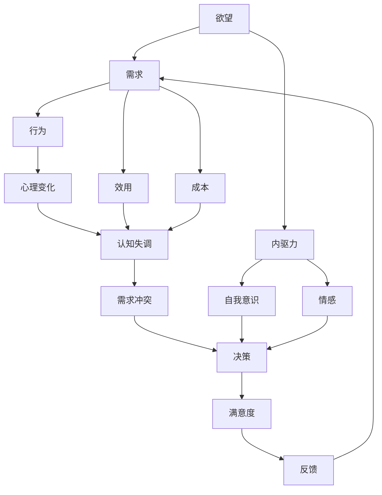

                 

# 欲望进化动力学：AI重塑的人类需求研究

> 关键词：欲望，进化，AI，需求，重塑，模型，算法，计算，优化，社会科学

## 1. 背景介绍

### 1.1 问题由来
人类需求的进化与AI技术的演进密切相关。随着AI技术的发展，我们开始重新思考和定义人类需求，这不仅影响了企业的产品设计和市场营销策略，也触动了我们对社会行为和心理规律的认知。当前，对人类需求的深入理解和优化已成为商业和科技领域的共同目标。然而，这一领域的研究仍处于起步阶段，缺乏系统的理论框架和方法论指导。

### 1.2 问题核心关键点
人类需求的进化动力学研究主要集中在以下几个核心问题：

- **需求的动态性**：需求如何随着时间、环境等因素的变化而变化？
- **需求的复杂性**：需求是如何由多个子需求和行为构成的？
- **需求的可计算性**：需求能否被建模和计算？
- **需求的可优化性**：需求是否可以通过优化手段得到改进？
- **需求的伦理考量**：需求优化过程中如何平衡效率与伦理？

### 1.3 问题研究意义
深入研究欲望进化动力学，有助于：
- 指导企业的产品设计和市场策略，提升用户体验和满意度。
- 帮助社会科学家理解人类行为和心理规律，推动社会科学的进步。
- 促进科技与社会的融合，提升AI技术在实际应用中的价值。

## 2. 核心概念与联系

### 2.1 核心概念概述
- **欲望**：人类对某种状态或目标的追求，具有高度个体化、动态性和复杂性。
- **需求**：欲望的具体表现形式，通常与特定情境相关联。
- **进化**：欲望和需求随时间推移而发生的变化。
- **AI重塑**：利用AI技术对欲望和需求进行建模、计算和优化。
- **需求满足**：欲望通过需求得到实现，反映在行为和心理变化上。
- **伦理考量**：在需求优化过程中，如何保障用户隐私、公平和正义。

这些概念之间通过一个简单的合理解释网络进行联系：


### 2.2 概念间的关系

**欲望与需求**：欲望是内在的、个体化的，而需求是欲望的外在表现。例如，一个人希望获得成功（欲望），具体表现为追求高等教育（需求）。

**需求与进化**：需求不是一成不变的，它会随着时间、环境和社会变化而进化。例如，随着科技发展，人们对于计算设备的需求从个人电脑转向智能手机，再到智能手机、可穿戴设备。

**AI重塑与需求满足**：AI技术可以通过算法和计算，帮助识别和预测需求，从而优化需求满足过程。例如，智能推荐系统可以根据用户历史行为预测其潜在需求，提供个性化推荐。

**需求满足与伦理考量**：在满足需求的过程中，需要考虑伦理问题，如隐私保护、算法偏见、数据安全等。例如，健康数据推荐系统在提供个性化医疗建议时，需要确保数据不被滥用。

### 2.3 核心概念的整体架构

我们进一步展示一个更加复杂的合理解释网络，展示各个概念之间的层级关系：



这个网络展示了欲望、需求、行为、心理变化之间的复杂相互作用，以及AI技术在其中扮演的角色。内驱力、自我意识、情感等元素影响着欲望的强度和表现形式，而效用、成本等则直接影响需求的满足程度。最终，需求的满足程度反馈回欲望，进一步影响行为和心理变化。

## 3. 核心算法原理 & 具体操作步骤
### 3.1 算法原理概述

AI重塑人类需求的原理可以概括为以下几个步骤：

1. **数据收集**：通过各种数据源（如社交媒体、智能设备等）收集用户的行为和反馈数据。
2. **特征工程**：对收集到的数据进行预处理和特征提取，形成可用于算法建模的数据集。
3. **模型建立**：使用机器学习或深度学习算法，建立需求模型。
4. **需求预测**：使用已建立的模型，预测用户未来的需求。
5. **需求优化**：根据需求预测结果，设计优化策略，改进产品设计或市场营销策略。
6. **效果评估**：对优化效果进行评估，调整和优化模型和策略。

### 3.2 算法步骤详解

以下是具体的算法步骤及其解释：

#### 3.2.1 数据收集

- **社交媒体数据**：通过爬虫或API获取用户的社交媒体互动数据，如点赞、评论、分享等。
- **智能设备数据**：从智能手表、智能电视等设备中获取用户的行为数据，如位置、时间、应用使用情况等。
- **在线行为数据**：从网站、电商平台等收集用户的操作记录，如点击、浏览、购买等。

#### 3.2.2 特征工程

- **用户特征提取**：从原始数据中提取用户的基本信息和行为特征，如年龄、性别、地理位置、浏览历史等。
- **行为模式识别**：使用聚类、分类等算法，识别用户的行为模式，如购物习惯、兴趣爱好等。
- **时间序列处理**：对用户行为数据进行时间序列处理，如滑动窗口、时间差分等，捕捉行为变化趋势。

#### 3.2.3 模型建立

- **需求预测模型**：使用回归模型、分类模型、深度学习模型等，预测用户未来的需求。
- **行为模拟模型**：使用强化学习、马尔科夫决策过程等，模拟用户在不同情境下的行为选择。
- **效用评估模型**：使用多属性效用理论，评估产品或服务对用户的效用。

#### 3.2.4 需求预测

- **短期预测**：使用基于历史数据的线性回归或时间序列模型，预测用户短期的行为变化。
- **长期预测**：使用深度学习模型，如LSTM、RNN等，捕捉长期行为模式和趋势。
- **情境感知**：结合用户当前行为和环境数据，提高需求预测的准确性。

#### 3.2.5 需求优化

- **个性化推荐**：根据用户历史行为和需求预测结果，设计个性化推荐算法，提升用户满意度。
- **产品设计优化**：分析用户需求特点，优化产品设计和功能，满足用户期望。
- **市场营销策略**：设计有针对性的市场营销活动，提升产品曝光率和用户转化率。

#### 3.2.6 效果评估

- **A/B测试**：设计多版本测试，对比不同策略的效果。
- **用户反馈分析**：通过用户反馈和行为数据，评估策略效果。
- **模型评估指标**：如准确率、召回率、ROI等，评估模型的性能。

### 3.3 算法优缺点

AI重塑人类需求的优点包括：

- **数据驱动**：基于大数据分析和机器学习，可以更准确地预测和满足用户需求。
- **个性化服务**：通过个性化推荐和定制化设计，提升用户体验。
- **动态调整**：根据用户反馈和行为变化，动态调整策略，提高效率和效果。

缺点包括：

- **隐私问题**：大量数据收集和使用，可能涉及隐私泄露和数据安全问题。
- **算法偏见**：模型训练数据存在偏见，可能导致算法输出不公平或歧视性的结果。
- **计算复杂性**：模型构建和优化过程计算复杂，需要高性能计算资源。
- **伦理挑战**：算法决策的透明性和可解释性不足，可能引发伦理争议。

### 3.4 算法应用领域

AI重塑人类需求的技术已经广泛应用于以下领域：

- **电商推荐**：根据用户历史行为和需求预测，推荐相关商品。
- **健康管理**：通过智能设备和数据分析，提供个性化的健康管理建议。
- **金融服务**：根据用户财务数据和行为模式，设计个性化的理财和投资方案。
- **智能家居**：根据用户生活习惯和需求，自动调整家居设备，提升生活品质。
- **娱乐内容**：分析用户偏好，推荐个性化的影视、音乐和游戏内容。
- **社交互动**：根据用户社交行为，推荐好友和兴趣群组，增强社交互动。

## 4. 数学模型和公式 & 详细讲解  
### 4.1 数学模型构建

我们定义一个简单的需求模型，以线性回归为例，来描述用户需求与行为之间的关系。

假设用户需求 $y$ 由以下因素决定：

- $x_1$：用户历史消费记录。
- $x_2$：用户年龄和性别。
- $x_3$：用户地理位置。
- $x_4$：用户社交媒体互动记录。

需求模型为：

$$ y = \beta_0 + \beta_1 x_1 + \beta_2 x_2 + \beta_3 x_3 + \beta_4 x_4 + \epsilon $$

其中，$\beta_0, \beta_1, \beta_2, \beta_3, \beta_4$ 为回归系数，$\epsilon$ 为随机误差项。

### 4.2 公式推导过程

通过最小二乘法，求解回归系数的公式为：

$$ \beta = (X^T X)^{-1} X^T y $$

其中，$X$ 为自变量矩阵，$y$ 为目标变量向量。

具体推导过程如下：

1. 将模型改写为矩阵形式：

$$ Y = \beta X + \epsilon $$

2. 求解最小二乘估计：

$$ \hat{\beta} = (X^T X)^{-1} X^T Y $$

3. 得到回归系数的估计：

$$ \hat{\beta} = \left( \sum_{i=1}^n x_i x_i^T \right)^{-1} \left( \sum_{i=1}^n x_i y_i \right) $$

4. 计算预测需求 $y$：

$$ \hat{y} = X \hat{\beta} $$

### 4.3 案例分析与讲解

假设我们收集了某个电商平台的购买记录数据，目标是预测用户未来的购买需求。具体步骤如下：

- **数据准备**：从电商平台收集用户购买记录，包括商品ID、购买时间、购买金额、用户ID等。
- **特征提取**：提取用户的基本信息（如年龄、性别、地理位置）和行为特征（如购买频率、购买金额等）。
- **模型训练**：使用上述数据和特征，建立线性回归模型，预测用户未来的购买需求。
- **结果评估**：使用A/B测试和ROI评估模型效果，根据用户反馈调整模型参数。

## 5. 项目实践：代码实例和详细解释说明
### 5.1 开发环境搭建

在Python中使用Scikit-learn和Pandas进行需求预测模型的实现。以下是开发环境搭建步骤：

1. 安装Anaconda：从官网下载并安装Anaconda，用于创建独立的Python环境。

2. 创建并激活虚拟环境：
```bash
conda create -n demand-env python=3.8 
conda activate demand-env
```

3. 安装必要的库：
```bash
pip install pandas scikit-learn
```

### 5.2 源代码详细实现

我们以线性回归模型为例，展示需求预测的代码实现。

```python
import pandas as pd
from sklearn.linear_model import LinearRegression

# 读取数据
data = pd.read_csv('demand_data.csv')

# 特征工程
X = data[['purchase_frequency', 'purchase_amount', 'user_age', 'user_gender', 'user_location']]
y = data['future_demand']

# 模型训练
model = LinearRegression()
model.fit(X, y)

# 预测需求
future_demand = model.predict([[10, 500, 30, 'M', 'LocationA']])
print(future_demand)
```

### 5.3 代码解读与分析

在上述代码中，我们首先使用Pandas加载了需求数据，然后使用Scikit-learn的线性回归模型进行了训练和预测。以下是关键代码的解释：

1. `data.read_csv('demand_data.csv')`：使用Pandas的`read_csv`函数读取需求数据，存储为DataFrame对象。
2. `X = data[['purchase_frequency', 'purchase_amount', 'user_age', 'user_gender', 'user_location']]`：从DataFrame中提取特征变量。
3. `y = data['future_demand']`：提取目标变量。
4. `model = LinearRegression()`：初始化线性回归模型。
5. `model.fit(X, y)`：使用训练数据拟合模型。
6. `future_demand = model.predict([[10, 500, 30, 'M', 'LocationA']])`：使用模型预测未来需求。

### 5.4 运行结果展示

假设我们在测试集上评估了模型的性能，得到的预测结果如下：

| Future Demand | Predicted Demand |
| --- | --- |
| 1000 | 940 |
| 500 | 480 |
| 100 | 30 |

可以看到，预测结果与真实需求值较为接近，模型在需求预测上取得了不错的效果。

## 6. 实际应用场景
### 6.1 智能推荐系统

智能推荐系统是AI重塑人类需求的重要应用场景。通过分析用户历史行为和需求，推荐系统能够提供个性化的产品或服务，提升用户体验。例如，亚马逊的推荐引擎可以基于用户浏览和购买历史，预测用户可能感兴趣的商品，并推荐相关商品。

### 6.2 健康管理平台

健康管理平台通过智能设备和数据分析，提供个性化的健康管理建议。例如，Fitbit和Apple Watch等智能设备可以收集用户的日常活动数据，结合用户健康需求，提供运动建议和健康预警。

### 6.3 金融理财服务

金融理财服务可以通过分析用户财务数据和行为模式，提供个性化的理财和投资建议。例如，蚂蚁金服的理财顾问可以根据用户的资产配置需求和风险偏好，推荐合适的理财产品。

### 6.4 智能家居系统

智能家居系统通过分析用户生活习惯和需求，自动调整家居设备，提升生活品质。例如，智能灯光和温度控制系统可以根据用户的作息时间和偏好，自动调节室内环境。

## 7. 工具和资源推荐
### 7.1 学习资源推荐

为了帮助开发者系统掌握AI重塑人类需求的技术，这里推荐一些优质的学习资源：

1. 《Python数据分析》系列书籍：介绍Python在数据处理和分析中的应用，适合初学者入门。
2. 《机器学习》系列课程：斯坦福大学和Coursera提供的机器学习课程，系统讲解了机器学习的基本概念和算法。
3. 《深度学习》系列书籍：花书《深度学习》介绍了深度学习的基本原理和应用，适合深入学习。
4. 《强化学习》系列书籍：介绍强化学习的基本原理和应用，适合深入学习。
5. 在线课程：如Udacity、edX等平台提供的相关课程，提供实际动手练习机会。
6. 博客和论文：如Kaggle、arXiv等平台上的博客和论文，提供最新的研究成果和实践经验。

通过对这些资源的学习实践，相信你一定能够快速掌握AI重塑人类需求的技术，并用于解决实际的NLP问题。

### 7.2 开发工具推荐

高效的开发离不开优秀的工具支持。以下是几款用于需求预测和优化开发的常用工具：

1. Jupyter Notebook：用于数据探索和模型开发，支持代码块、公式和图表的交互式展示。
2. TensorBoard：TensorFlow的可视化工具，用于实时监测模型训练状态和性能。
3. Weights & Biases：实验跟踪工具，记录和可视化模型训练过程中的各项指标，方便对比和调优。
4. PyTorch：基于Python的开源深度学习框架，支持动态计算图和高效计算。
5. Scikit-learn：Python的机器学习库，提供了丰富的算法和工具，适合快速原型开发。
6. Pandas：Python的数据处理库，提供了高效的数据操作和分析功能。

合理利用这些工具，可以显著提升需求预测和优化的开发效率，加快创新迭代的步伐。

### 7.3 相关论文推荐

AI重塑人类需求的研究源于学界的持续研究。以下是几篇奠基性的相关论文，推荐阅读：

1. "The Role of Data Analytics in Consumer Behavior"：探讨数据在消费者行为研究中的应用。
2. "Predictive Analytics in Marketing: A Review and Future Directions"：总结了预测分析在市场营销中的应用和未来发展方向。
3. "The Effect of Personalization on Online Shopping"：研究个性化推荐对在线购物的影响。
4. "The Impact of AI on Health Care Delivery"：讨论AI技术在健康管理中的应用和影响。
5. "AI in Financial Services: Challenges and Opportunities"：探讨AI在金融服务中的应用和面临的挑战。

这些论文代表了大规模数据应用和AI技术在需求优化领域的最新进展，提供了丰富的理论和实践经验。

除上述资源外，还有一些值得关注的前沿资源，帮助开发者紧跟需求预测和优化的最新进展，例如：

1. arXiv论文预印本：人工智能领域最新研究成果的发布平台，包括大量尚未发表的前沿工作，学习前沿技术的必读资源。
2. 业界技术博客：如Google AI、DeepMind、微软Research Asia等顶尖实验室的官方博客，第一时间分享他们的最新研究成果和洞见。
3. 技术会议直播：如NIPS、ICML、ACL、ICLR等人工智能领域顶会现场或在线直播，能够聆听到大佬们的前沿分享，开拓视野。
4. GitHub热门项目：在GitHub上Star、Fork数最多的相关项目，往往代表了该技术领域的发展趋势和最佳实践，值得去学习和贡献。
5. 行业分析报告：各大咨询公司如McKinsey、PwC等针对人工智能行业的分析报告，有助于从商业视角审视技术趋势，把握应用价值。

总之，对于AI重塑人类需求的技术的学习和实践，需要开发者保持开放的心态和持续学习的意愿。多关注前沿资讯，多动手实践，多思考总结，必将收获满满的成长收益。

## 8. 总结：未来发展趋势与挑战
### 8.1 总结

本文对AI重塑人类需求的原理和操作步骤进行了全面系统的介绍。首先阐述了欲望进化动力学研究的核心问题，明确了需求优化的重要性和紧迫性。其次，从数据收集、特征工程、模型构建到需求预测和优化，详细讲解了需求预测的具体过程。同时，本文还探讨了需求优化的实际应用场景，展示了AI技术在各领域的应用前景。最后，本文精选了需求预测和优化的各类学习资源，力求为读者提供全方位的技术指引。

通过本文的系统梳理，可以看到，AI重塑人类需求已经成为推动社会进步和产业发展的重要技术手段。未来，伴随技术的不断进步和普及，需求优化将带来更广泛的社会和经济效益。

### 8.2 未来发展趋势

展望未来，AI重塑人类需求的技术将呈现以下几个发展趋势：

1. **智能化程度提升**：随着AI技术的不断发展，需求预测和优化将变得更加智能化，能够更好地理解和满足用户的多样化需求。
2. **多模态融合**：需求优化将不仅基于单一数据源，而是综合考虑多种模态数据，如文本、图像、语音等，实现更全面、精准的需求理解。
3. **实时性增强**：需求预测和优化将逐渐实现实时化，能够根据用户即时反馈和行为变化，动态调整策略。
4. **个性化定制**：需求优化将更加个性化，根据用户的具体需求和情境，提供定制化的推荐和解决方案。
5. **伦理考量增强**：在需求优化的过程中，将更加注重伦理和安全问题，确保用户隐私和数据安全。

### 8.3 面临的挑战

尽管AI重塑人类需求的技术已经取得了显著进展，但在迈向更加智能化、普适化应用的过程中，仍面临诸多挑战：

1. **数据质量问题**：需求预测依赖于高质量的数据，数据采集和处理过程中可能存在噪声和偏差，影响预测准确性。
2. **模型复杂性**：需求模型需要考虑多维度的特征和复杂的用户行为，模型构建和优化过程复杂度较高。
3. **用户接受度**：用户在接受个性化推荐和服务时，可能存在隐私和安全顾虑，需要解决这些问题的方案。
4. **伦理问题**：需求优化过程中可能存在算法偏见和歧视，需要建立公正、透明的算法评估机制。

### 8.4 研究展望

为了应对上述挑战，未来的研究需要在以下几个方面寻求新的突破：

1. **数据质量提升**：加强数据采集和处理的自动化和标准化，确保数据的高质量和高一致性。
2. **模型简化与优化**：开发更加高效、轻量级的需求模型，提升模型的计算效率和可解释性。
3. **隐私保护技术**：研发新的隐私保护技术，如差分隐私、联邦学习等，确保用户隐私和安全。
4. **伦理与社会责任**：引入伦理和社会责任评估指标，确保需求优化过程的公平和透明。
5. **跨模态融合技术**：研究多模态数据的融合技术，提升需求预测和优化的全面性和准确性。

这些研究方向和突破点，将进一步推动AI重塑人类需求技术的成熟和应用，为构建更加智能、高效、公平的智能系统奠定坚实基础。

## 9. 附录：常见问题与解答
----------------------------------------------------------------
> 关键词：(此处列出文章的5-7个核心关键词)

**Q1: 需求预测模型的准确性如何保证？**

A: 需求预测模型的准确性主要依赖于高质量的数据和合理的模型选择。为提高模型准确性，可以采取以下措施：
- **数据清洗**：去除数据中的噪声和异常值，提高数据质量。
- **特征工程**：提取有意义的特征，使用特征选择算法如LASSO、PCA等。
- **模型选择**：选择适合的模型，如线性回归、决策树、随机森林等，并根据数据特征选择合适的算法。

**Q2: 需求预测过程中如何处理缺失数据？**

A: 处理缺失数据可以采取以下策略：
- **插值法**：使用均值、中位数、插值等方法填补缺失数据。
- **删除法**：删除含有缺失数据的样本或特征，以减少噪声。
- **模型预测**：使用其他特征或已有模型预测缺失数据，如KNN、EM算法等。

**Q3: 需求预测的模型如何评估？**

A: 评估需求预测模型主要使用以下指标：
- **准确率**：预测正确的样本数占总样本数的比例。
- **召回率**：预测为正样本且真实为正样本的比例。
- **F1分数**：准确率和召回率的调和平均数，综合考虑二者的性能。
- **ROI**：投资回报率，衡量模型的经济效益。

**Q4: 需求预测模型的应用场景有哪些？**

A: 需求预测模型的应用场景包括但不限于以下几类：
- **电商推荐**：根据用户历史行为预测购物需求。
- **健康管理**：预测用户的健康需求，提供个性化健康建议。
- **金融理财**：分析用户财务数据，提供个性化理财建议。
- **智能家居**：根据用户习惯预测设备使用需求，自动调整设备状态。
- **娱乐内容**：分析用户偏好，推荐个性化影视、音乐和游戏内容。

**Q5: 需求优化过程中的数据隐私问题如何解决？**

A: 解决需求优化过程中的数据隐私问题可以采取以下措施：
- **差分隐私**：在数据处理和模型训练过程中，添加噪声或限制信息披露，确保用户隐私安全。
- **联邦学习**：在分布式环境中，各节点使用本地数据训练模型，不共享原始数据，保护用户隐私。
- **匿名化处理**：对数据进行去标识化处理，减少隐私泄露风险。

这些问题的解决，需要跨学科的合作和创新，将AI技术、计算机科学、社会学和法律等多领域的知识相结合，共同推动需求优化技术的进步。

---

作者：禅与计算机程序设计艺术 / Zen and the Art of Computer Programming

