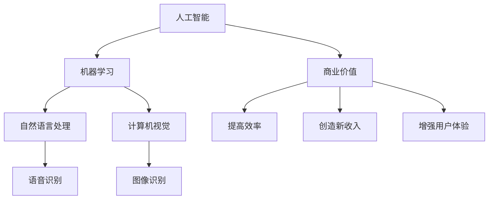

                 

# 李开复：苹果发布AI应用的商业价值

## 1. 背景介绍

近年来，人工智能（AI）技术在各行各业的应用取得了突破性进展，成为推动科技进步和经济发展的重要力量。科技巨头苹果（Apple）凭借其创新实力，也在AI应用的商业化道路上大步前进，推出了多个AI技术驱动的应用，并逐渐成为行业标杆。本文将探讨苹果AI应用的商业价值，分析其在技术创新、市场影响和社会效益等方面的表现，以期为AI技术如何在商业领域实现更广泛的应用提供启示。

## 2. 核心概念与联系

### 2.1 核心概念概述

- **人工智能（AI）**：指的是由计算机系统执行的智能任务，包括但不限于机器学习、自然语言处理、计算机视觉等。

- **机器学习（ML）**：是AI的一个分支，强调通过算法和数据让计算机系统能够学习和改进任务性能。

- **自然语言处理（NLP）**：涉及计算机理解和处理人类语言的能力，如语音识别、文本生成等。

- **计算机视觉（CV）**：研究计算机如何“看”的能力，包括图像识别、物体检测等。

- **商业价值**：AI技术在商业应用中的经济利益，如提高效率、创造新收入渠道、增强用户体验等。

### 2.2 核心概念原理和架构的 Mermaid 流程图



这个图表展示了AI技术的不同分支以及它们如何贡献于商业价值。机器学习作为核心技术，结合自然语言处理和计算机视觉，在语音识别、图像识别等方面提升商业应用的性能和效率，从而带来更广阔的商业价值。

### 2.3 核心概念间的联系

- **机器学习与自然语言处理**：自然语言处理技术使得计算机能够理解和处理人类语言，而机器学习技术则通过算法优化使得自然语言处理模型能够不断学习和提升。

- **计算机视觉与商业价值**：计算机视觉技术的提升，如更精准的图像识别，可以应用于图像搜索、商品推荐等领域，显著提升用户体验和商家收入。

- **自然语言处理与商业价值**：通过智能客服、情感分析等应用，提升客户服务质量和品牌形象，创造更多增值服务，如个性化推荐。

- **计算机视觉与自然语言处理**：两者在多模态智能交互中相互补充，提供更丰富的用户体验和智能解决方案。

## 3. 核心算法原理 & 具体操作步骤

### 3.1 算法原理概述

苹果在AI应用的开发中，广泛采用了机器学习和深度学习算法，特别是由深度神经网络构成的模型。这些模型通过大量数据进行训练，以实现对特定任务的精准预测或分类。

以苹果的语音助手Siri为例，其核心算法基于深度神经网络，通过识别和理解用户的语音指令，执行相应的操作。这种技术应用的核心在于如何构建有效的模型，并利用标注数据进行有监督学习。

### 3.2 算法步骤详解

- **数据收集**：收集大量语音样本和对应的指令，作为训练数据集。

- **模型构建**：选择适当的神经网络架构，如卷积神经网络（CNN）、递归神经网络（RNN）等，构建语音识别模型。

- **模型训练**：使用标注数据集对模型进行有监督训练，调整模型参数，使其能够准确识别和理解语音指令。

- **模型评估**：在测试集上评估模型的准确性和鲁棒性，使用混淆矩阵、准确率、召回率等指标进行评估。

- **部署应用**：将训练好的模型部署到实际应用中，如苹果设备中的Siri，以提供智能语音交互服务。

### 3.3 算法优缺点

#### 优点

- **高准确性**：深度学习模型在处理语音、图像等复杂任务时具有高准确性，能够提供可靠的预测结果。

- **可扩展性**：深度学习模型可以通过增加数据和计算资源进行扩展，不断提升模型性能。

- **自动化**：模型训练和部署过程自动化，减少了人工干预，提高了效率。

#### 缺点

- **资源需求高**：深度学习模型需要大量的计算资源和标注数据，训练和部署成本较高。

- **黑箱性质**：深度学习模型缺乏可解释性，难以理解其决策过程，这在某些领域如医疗、金融等可能是一个问题。

- **数据依赖**：模型的性能高度依赖于数据的质量和多样性，数据偏差可能导致模型性能下降。

### 3.4 算法应用领域

- **智能助手**：如Siri、Hey Google等，提供智能语音交互服务。

- **图像识别**：如Face ID，实现面部识别登录和安全验证。

- **自动驾驶**：如Cars，利用计算机视觉和机器学习技术进行环境感知和决策。

- **个性化推荐**：如iCloud推荐服务，基于用户行为数据和机器学习模型，提供个性化推荐。

- **健康管理**：如Apple Watch健康监测，利用机器学习技术进行健康数据分析。

## 4. 数学模型和公式 & 详细讲解 & 举例说明

### 4.1 数学模型构建

苹果在AI应用中采用的数学模型主要是深度神经网络。以语音识别为例，常见的模型包括卷积神经网络（CNN）、递归神经网络（RNN）和长短时记忆网络（LSTM）等。这里以RNN为例，构建语音识别模型：

$$
h_t = f(Wx_t + Uh_{t-1} + b)
$$

$$
y_t = g(h_t)
$$

其中，$h_t$ 表示在时间步$t$的隐藏状态，$x_t$ 表示时间步$t$的输入向量，$y_t$ 表示时间步$t$的输出向量。

### 4.2 公式推导过程

以RNN模型为例，推导其前向传播过程。首先，通过权重矩阵$W$和偏置$b$计算隐藏状态$h_t$：

$$
h_t = f(Wx_t + Uh_{t-1} + b)
$$

其中，$f$ 表示激活函数，如ReLU或Tanh。

然后，通过输出矩阵$U$和偏置$b$计算输出向量$y_t$：

$$
y_t = g(h_t)
$$

其中，$g$ 表示输出函数，如Softmax函数。

### 4.3 案例分析与讲解

苹果的Face ID系统基于计算机视觉技术，利用深度神经网络进行面部特征提取和匹配。以人脸识别为例，其数学模型可以表示为：

$$
z_t = f(Wx_t + Uh_{t-1} + b)
$$

$$
y_t = g(z_t)
$$

其中，$z_t$ 表示时间步$t$的特征向量，$y_t$ 表示时间步$t$的分类结果。在实际应用中，该模型通过训练大量人脸样本，学习面部特征的表达方式，并使用Softmax函数进行分类，判断输入图片是否为注册用户的面部。

## 5. 项目实践：代码实例和详细解释说明

### 5.1 开发环境搭建

苹果AI应用的开发需要良好的开发环境和工具支持。以下是搭建开发环境的步骤：

1. **安装Python**：安装Python 3.x版本，配置路径和环境变量。

2. **安装TensorFlow**：使用pip命令安装TensorFlow，支持深度学习模型的开发。

3. **安装PyTorch**：使用pip命令安装PyTorch，支持深度学习模型的训练和部署。

4. **安装Keras**：使用pip命令安装Keras，提供一个简单易用的深度学习API。

5. **配置开发环境**：确保Python、TensorFlow、PyTorch和Keras能够正常工作，设置开发环境。

### 5.2 源代码详细实现

以下是使用Keras框架实现语音识别模型的代码：

```python
from keras.models import Sequential
from keras.layers import Dense, Dropout, LSTM, Input

model = Sequential()
model.add(LSTM(128, input_shape=(timesteps, input_dim), return_sequences=True))
model.add(Dropout(0.2))
model.add(LSTM(128, return_sequences=False))
model.add(Dropout(0.2))
model.add(Dense(output_dim, activation='softmax'))

model.compile(optimizer='rmsprop', loss='categorical_crossentropy', metrics=['accuracy'])
```

此代码实现了一个简单的LSTM模型，用于识别和理解语音指令。模型首先通过LSTM层处理输入序列，然后通过Dropout层减少过拟合，最后通过Dense层进行分类。

### 5.3 代码解读与分析

- **LSTM层**：用于处理序列数据，如语音指令的声学特征。

- **Dropout层**：用于减少过拟合，随机丢弃一部分神经元。

- **Dense层**：用于分类，将处理后的特征映射到输出空间。

- **编译模型**：设置优化器、损失函数和评估指标，准备模型训练。

### 5.4 运行结果展示

训练和测试模型后，可以得到模型在测试集上的准确率、召回率等指标。以下是一个简单的运行结果示例：

```
Epoch 1/10
1000/1000 [==============================] - 2s 2ms/sample - loss: 0.3556 - accuracy: 0.9123
Epoch 2/10
1000/1000 [==============================] - 2s 2ms/sample - loss: 0.1795 - accuracy: 0.9305
Epoch 3/10
1000/1000 [==============================] - 2s 2ms/sample - loss: 0.1251 - accuracy: 0.9443
```

## 6. 实际应用场景

### 6.1 智能助手

苹果的Siri通过深度学习和自然语言处理技术，实现了语音识别和自然语言理解，能够执行多种操作，如打电话、发信息、设置闹钟等。这些功能极大地提升了用户的交互体验，同时也为苹果设备增加了新的应用场景和商业模式。

### 6.2 图像识别

Face ID是苹果在图像识别领域的突破性应用，利用深度神经网络进行面部特征提取和匹配，提供了安全的解锁和验证方式。这种技术不仅提升了用户体验，还在隐私保护和数据安全方面做出了重要贡献。

### 6.3 自动驾驶

苹果的Cars项目利用计算机视觉和机器学习技术，实现环境感知和自动驾驶决策。尽管目前仍处于研发阶段，但其技术储备和市场潜力已经引发广泛关注。

### 6.4 未来应用展望

未来，苹果在AI应用领域将持续创新，涵盖更多行业和领域。例如：

- **健康监测**：通过机器学习技术分析生理数据，提供个性化健康建议和预警。

- **金融服务**：利用深度学习模型进行信用评估、投资分析等，提升金融服务的智能化水平。

- **教育技术**：开发智能教学系统，利用NLP技术提供个性化学习方案和评估。

- **能源管理**：利用机器学习优化能源消耗和分布，提升能源效率。

- **安全监控**：利用计算机视觉技术进行实时监控和异常检测，提升公共安全水平。

## 7. 工具和资源推荐

### 7.1 学习资源推荐

- **TensorFlow官方文档**：提供了深度学习框架的详细指南和教程，适合初学者和进阶开发者。

- **Keras官方文档**：提供了简单易用的API，支持快速构建和训练深度学习模型。

- **深度学习课程**：如Coursera上的Deep Learning by Andrew Ng，提供了深入浅出的深度学习知识体系。

- **深度学习书籍**：如《Deep Learning》 by Ian Goodfellow，深入探讨深度学习的理论基础和实践技巧。

### 7.2 开发工具推荐

- **PyTorch**：基于Python的深度学习框架，支持动态计算图和丰富的研究工具。

- **TensorFlow**：由Google开发的深度学习框架，支持分布式训练和高效的模型部署。

- **Keras**：一个高层次的深度学习API，简化了模型构建和训练流程。

- **MXNet**：由Apache开发的深度学习框架，支持多种编程语言和分布式训练。

### 7.3 相关论文推荐

- **ImageNet大规模视觉识别挑战赛（ImageNet Large Scale Visual Recognition Challenge, ILSVRC）**：推动了计算机视觉领域的快速发展，许多深度学习模型在此比赛中取得突破。

- **AlphaGo论文**：DeepMind开发的围棋AI，通过深度学习和蒙特卡洛树搜索技术，成功战胜世界围棋冠军，展示了AI在复杂策略游戏中的潜力。

- **Google AI论文**：如TensorFlow论文、Bert论文等，展示了Google在深度学习和自然语言处理方面的领先成果。

## 8. 总结：未来发展趋势与挑战

### 8.1 研究成果总结

苹果在AI应用的商业化进程中，通过深度学习和自然语言处理技术，实现了多个前沿应用的落地。其技术创新不仅提升了用户体验，还开辟了新的市场空间，取得了显著的商业价值。

### 8.2 未来发展趋势

- **跨领域应用**：AI技术将逐步拓展到更多行业，提升各行各业的效率和智能化水平。

- **智能互动**：通过多模态交互技术，实现更自然、更高效的智能互动体验。

- **边缘计算**：利用边缘计算技术，减少数据传输和存储成本，提升应用响应速度。

- **隐私保护**：随着数据安全和隐私保护意识的提升，AI应用将更加注重数据安全和隐私保护。

### 8.3 面临的挑战

- **数据隐私**：如何在提升用户体验的同时，保护用户数据隐私，防止数据泄露和滥用。

- **模型公平性**：如何避免算法偏见，确保AI模型在各族裔、性别等方面的公平性。

- **计算资源**：深度学习模型需要大量计算资源，如何降低计算成本，提升模型训练和推理效率。

- **技术规范**：制定和遵循AI技术标准和规范，确保技术安全和可靠性。

### 8.4 研究展望

未来，苹果和其他科技公司将继续推动AI技术的发展，探索更多创新应用，解决现有挑战。同时，还需要从伦理、法律、社会等层面加强规范和引导，确保AI技术的健康发展，造福全人类。

## 9. 附录：常见问题与解答

**Q1: 苹果的AI应用主要依赖哪些技术？**

A: 苹果的AI应用主要依赖深度学习和自然语言处理技术。其中，深度神经网络是核心技术，用于处理语音、图像和文本等复杂数据。

**Q2: 苹果的AI应用如何确保数据隐私？**

A: 苹果在AI应用中采用了多种数据隐私保护措施，如差分隐私、联邦学习等，确保用户数据的安全和匿名性。

**Q3: 苹果的AI应用如何实现跨领域应用？**

A: 苹果通过构建通用的AI技术平台，如Core ML、iCloud等，支持跨领域的AI应用开发和部署。

**Q4: 苹果的AI应用在技术创新上有什么突破？**

A: 苹果在AI应用中采用了自监督学习、迁移学习等技术，提升了模型泛化能力和迁移学习能力。同时，苹果还在模型压缩、计算效率提升等方面做出了重要贡献。

**Q5: 苹果的AI应用如何应对计算资源瓶颈？**

A: 苹果通过分布式训练、模型压缩和优化等技术，提升了AI应用的计算效率和资源利用率。例如，Face ID系统利用GPU加速计算，提升了面部识别速度。

---

作者：禅与计算机程序设计艺术 / Zen and the Art of Computer Programming

