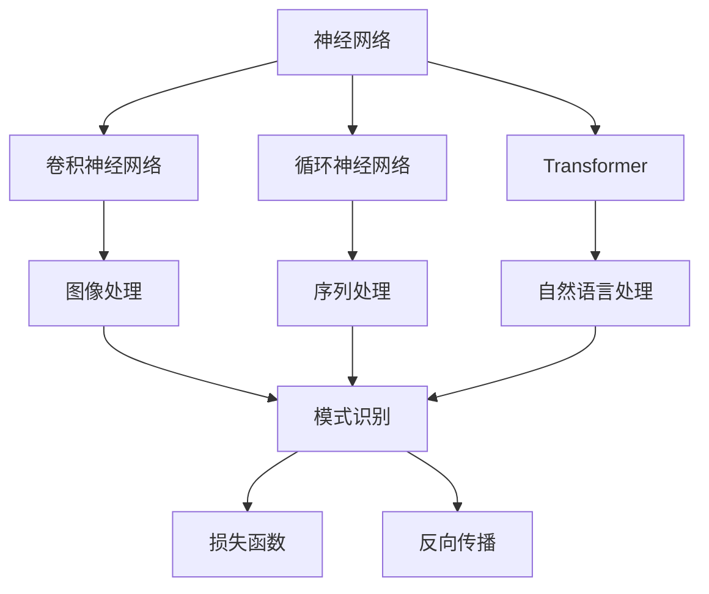
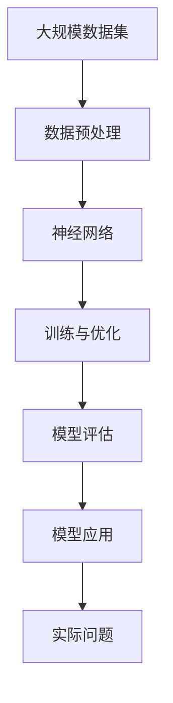

                 

# 模式识别 原理与代码实例讲解

> 关键词：模式识别,算法原理,代码实例,案例分析,应用领域

## 1. 背景介绍

### 1.1 问题由来
模式识别（Pattern Recognition）是人工智能和机器学习领域的重要分支，旨在通过计算机系统自动识别和分类数据中的模式。它的应用范围广泛，涉及图像识别、语音识别、文本分类、行为分析等多个领域。随着深度学习技术的发展，模式识别算法也从传统的统计方法逐渐转向神经网络模型，显著提升了识别的准确率和泛化能力。

近年来，基于深度神经网络的模式识别方法在图像和语音识别等任务上取得了巨大的突破，并在工业界得到了广泛应用。然而，尽管模型复杂度不断提升，但这些方法在训练和推理过程中仍面临诸多挑战，如过拟合、高计算需求和模型解释性差等问题。为了更好地解决这些问题，模式识别领域的研究者和实践者们不断探索新的技术和方法，逐步构建起一个更加完善和有效的模式识别体系。

### 1.2 问题核心关键点
模式识别的核心关键点包括：

1. **数据预处理**：对输入数据进行标准化、归一化和增强，以便于模型学习。
2. **模型选择**：选择合适的神经网络架构（如卷积神经网络、循环神经网络和Transformer等）和优化器（如Adam、SGD等）。
3. **训练与优化**：通过反向传播算法优化模型参数，最小化损失函数，提升模型性能。
4. **模型评估**：使用测试集评估模型性能，通过准确率、召回率、F1分数等指标衡量模型效果。
5. **模型应用**：将训练好的模型应用于实际问题中，进行预测和分类。

这些关键点在模式识别过程中相互交织，共同影响着模型的性能和效果。

### 1.3 问题研究意义
模式识别技术在现代信息社会中扮演着至关重要的角色。它在图像处理、语音识别、医疗诊断、智能推荐等领域的应用，极大地提高了信息处理的效率和准确性，为人们提供了更加便捷和智能的服务。模式识别技术的普及和发展，不仅推动了相关产业的数字化转型，也为科学研究和创新提供了强有力的支持。

本文聚焦于模式识别的算法原理和代码实现，通过深入讲解深度学习模型在模式识别任务中的应用，希望为读者提供一个全面的技术指引。

## 2. 核心概念与联系

### 2.1 核心概念概述

为了更好地理解模式识别的原理和流程，我们首先需要介绍几个核心概念：

- **神经网络**：一种模拟人脑神经元之间的连接的计算模型，广泛应用于图像识别、语音识别和自然语言处理等任务。
- **卷积神经网络（CNN）**：一种专门用于图像处理和模式识别任务的神经网络，通过卷积操作提取特征，具有平移不变性和局部连接性。
- **循环神经网络（RNN）**：一种能够处理序列数据的神经网络，适用于语音识别、自然语言处理等序列任务。
- **Transformer**：一种通过自注意力机制处理序列数据的神经网络，特别适用于自然语言处理任务，具有较好的长序列建模能力。
- **损失函数**：用于衡量模型预测与真实标签之间的差距，常见的损失函数包括交叉熵损失、均方误差损失等。
- **反向传播**：一种通过计算损失函数对模型参数的梯度来更新参数的算法，是深度学习模型的核心。

这些核心概念之间存在紧密的联系，构成了模式识别的理论基础和实现框架。

### 2.2 概念间的关系

以下通过几个Mermaid流程图来展示这些核心概念之间的关系：



这个流程图展示了神经网络模型在模式识别任务中的主要应用场景。卷积神经网络（CNN）适用于图像处理，循环神经网络（RNN）适用于序列数据处理，Transformer适用于自然语言处理任务。这些网络结构通过损失函数和反向传播算法，不断优化模型参数，实现对输入数据的识别和分类。最终，这些分类模型可以应用于各种模式识别任务，如图像识别、语音识别、文本分类等。

### 2.3 核心概念的整体架构

最后，我们用一个综合的流程图来展示这些核心概念在大规模模式识别任务中的整体架构：



这个综合流程图展示了模式识别任务的全流程：从数据预处理、模型训练、模型评估到模型应用，每个环节都至关重要。

## 3. 核心算法原理 & 具体操作步骤
### 3.1 算法原理概述

模式识别算法的核心思想是通过神经网络模型自动学习输入数据中的模式，并根据这些模式进行分类或识别。具体来说，模式识别过程包括以下几个步骤：

1. **数据预处理**：对输入数据进行标准化、归一化和增强，以便于模型学习。
2. **模型选择**：选择合适的神经网络架构（如CNN、RNN、Transformer等）和优化器（如Adam、SGD等）。
3. **训练与优化**：通过反向传播算法优化模型参数，最小化损失函数，提升模型性能。
4. **模型评估**：使用测试集评估模型性能，通过准确率、召回率、F1分数等指标衡量模型效果。
5. **模型应用**：将训练好的模型应用于实际问题中，进行预测和分类。

### 3.2 算法步骤详解

以下是模式识别算法的详细步骤：

**Step 1: 准备数据集**

- 收集和标注数据集，并将其分为训练集、验证集和测试集。训练集用于模型训练，验证集用于模型选择和调参，测试集用于评估模型性能。

**Step 2: 数据预处理**

- 对输入数据进行标准化、归一化和增强，以便于模型学习。例如，对于图像数据，可以应用数据增强技术，如旋转、翻转、缩放等；对于文本数据，可以进行分词和词向量化等预处理步骤。

**Step 3: 选择模型架构**

- 根据任务特点选择合适的神经网络架构。例如，对于图像分类任务，可以选择卷积神经网络（CNN）；对于序列数据分类任务，可以选择循环神经网络（RNN）或Transformer。

**Step 4: 初始化模型参数**

- 使用随机初始化或其他方法初始化模型参数。初始化方法的选择会影响模型的收敛速度和性能。

**Step 5: 训练与优化**

- 使用反向传播算法优化模型参数，最小化损失函数。例如，可以使用Adam、SGD等优化器，并结合学习率衰减等技术。

**Step 6: 模型评估**

- 使用测试集评估模型性能。例如，可以计算准确率、召回率、F1分数等指标。

**Step 7: 模型应用**

- 将训练好的模型应用于实际问题中，进行预测和分类。例如，可以使用CNN进行图像分类，使用RNN进行文本分类，使用Transformer进行语言翻译等。

### 3.3 算法优缺点

模式识别算法的优点包括：

1. **高精度**：深度学习模型通过自动学习数据中的模式，可以实现较高的识别精度。
2. **可扩展性**：模型架构灵活，可以应用于多种数据类型和任务。
3. **泛化能力**：经过充分训练的模型具有较好的泛化能力，能够处理新数据。

然而，模式识别算法也存在一些缺点：

1. **过拟合**：深度学习模型复杂度较高，容易过拟合训练数据。
2. **计算需求高**：深度学习模型需要大量的计算资源进行训练和推理。
3. **可解释性差**：深度学习模型通常是"黑盒"，难以解释模型的决策过程。

### 3.4 算法应用领域

模式识别算法在许多领域都有广泛的应用，包括但不限于：

- **图像识别**：用于人脸识别、物体检测、图像分类等任务。
- **语音识别**：用于语音转写、说话人识别、情感分析等任务。
- **自然语言处理**：用于文本分类、情感分析、机器翻译等任务。
- **行为分析**：用于行为识别、运动分析等任务。

## 4. 数学模型和公式 & 详细讲解 & 举例说明

### 4.1 数学模型构建

在模式识别任务中，常见的数学模型包括：

- **卷积神经网络（CNN）**：
  $$
  y = W \cdot x + b
  $$
  其中 $x$ 为输入特征，$W$ 为卷积核权重，$b$ 为偏置项，$y$ 为输出特征图。

- **循环神经网络（RNN）**：
  $$
  h_t = \tanh(W_xx \cdot [h_{t-1}, x_t] + W_xh \cdot h_{t-1} + b_x)
  $$
  $$
  y_t = softmax(W_yh \cdot h_t + b_y)
  $$
  其中 $x_t$ 为输入序列的第 $t$ 个元素，$h_t$ 为隐藏状态，$y_t$ 为输出序列的第 $t$ 个元素，$W_xx$、$W_xh$、$W_yh$ 为权重矩阵，$b_x$、$b_y$ 为偏置项。

- **Transformer**：
  $$
  y = \text{Attention}(Q, K, V) + b
  $$
  其中 $Q$ 为查询向量，$K$ 为键向量，$V$ 为值向量，$\text{Attention}$ 为自注意力机制，$b$ 为偏置项。

### 4.2 公式推导过程

以下对上述模型的公式进行详细推导：

**卷积神经网络（CNN）**

卷积神经网络通过卷积操作提取输入数据的局部特征。假设输入数据 $x$ 为二维图像，卷积核 $W$ 为 $m \times n$ 的矩阵，输出特征图 $y$ 为 $k \times l$ 的矩阵。卷积操作的公式为：

$$
y_{i,j} = \sum_{p=0}^{m-1}\sum_{q=0}^{n-1} W_{p,q} \cdot x_{i-p,j-q} + b
$$

其中 $p$ 和 $q$ 表示卷积核在输入数据中的位置，$i$ 和 $j$ 表示输出特征图中的位置。

**循环神经网络（RNN）**

循环神经网络通过循环连接处理序列数据。假设输入序列 $x_t$ 为 $t$ 维向量，隐藏状态 $h_t$ 为 $d$ 维向量，输出序列 $y_t$ 为 $t$ 维向量。RNN的公式为：

$$
h_t = \tanh(W_xx \cdot [h_{t-1}, x_t] + W_xh \cdot h_{t-1} + b_x)
$$
$$
y_t = softmax(W_yh \cdot h_t + b_y)
$$

其中 $\tanh$ 表示双曲正切函数，$softmax$ 表示归一化指数函数。

**Transformer**

Transformer通过自注意力机制处理序列数据。假设输入序列 $Q$ 为 $m \times d$ 的矩阵，键向量 $K$ 为 $n \times d$ 的矩阵，值向量 $V$ 为 $n \times d$ 的矩阵。自注意力机制的公式为：

$$
\text{Attention}(Q, K, V) = \text{Softmax}(Q \cdot K^T) \cdot V
$$

其中 $\text{Softmax}$ 表示softmax函数，$\cdot$ 表示矩阵乘法。

### 4.3 案例分析与讲解

以下以图像分类任务为例，对卷积神经网络（CNN）进行详细讲解：

**案例背景**

假设我们要对一组手写数字图像进行分类，任务是识别出每个图像中的数字。我们可以使用MNIST数据集，其中包含60000个训练图像和10000个测试图像。每个图像为 $28 \times 28$ 像素的灰度图像，输出为0到9之间的整数标签。

**模型架构**

我们选择使用一个简单的卷积神经网络（CNN）模型，包含两个卷积层和两个全连接层。模型的架构如下：

```
Layer (type)
0 conv2d (Conv2D)
1 batchnorm2d (BatchNorm2D)
2 relu (ReLU)
3 maxpool2d (MaxPool2D)
4 conv2d (Conv2D)
5 batchnorm2d (BatchNorm2D)
6 relu (ReLU)
7 dropout (Dropout)
8 linear (Linear)
9 relu (ReLU)
10 linear (Linear)
11 softmax (Softmax)
```

**代码实现**

以下是使用PyTorch实现CNN模型的代码：

```python
import torch
import torch.nn as nn
import torchvision.transforms as transforms
import torchvision.datasets as datasets

class CNN(nn.Module):
    def __init__(self):
        super(CNN, self).__init__()
        self.conv1 = nn.Conv2d(1, 16, kernel_size=3, stride=1, padding=1)
        self.bn1 = nn.BatchNorm2d(16)
        self.relu1 = nn.ReLU()
        self.pool1 = nn.MaxPool2d(kernel_size=2, stride=2)
        self.conv2 = nn.Conv2d(16, 32, kernel_size=3, stride=1, padding=1)
        self.bn2 = nn.BatchNorm2d(32)
        self.relu2 = nn.ReLU()
        self.pool2 = nn.MaxPool2d(kernel_size=2, stride=2)
        self.fc1 = nn.Linear(7 * 7 * 32, 64)
        self.relu3 = nn.ReLU()
        self.fc2 = nn.Linear(64, 10)

    def forward(self, x):
        x = self.conv1(x)
        x = self.bn1(x)
        x = self.relu1(x)
        x = self.pool1(x)
        x = self.conv2(x)
        x = self.bn2(x)
        x = self.relu2(x)
        x = self.pool2(x)
        x = x.view(-1, 7 * 7 * 32)
        x = self.fc1(x)
        x = self.relu3(x)
        x = self.fc2(x)
        x = nn.functional.softmax(x, dim=1)
        return x

# 加载数据集
transform = transforms.Compose([
    transforms.ToTensor(),
    transforms.Normalize((0.5,), (0.5,))
])
train_dataset = datasets.MNIST(root='./data', train=True, transform=transform, download=True)
test_dataset = datasets.MNIST(root='./data', train=False, transform=transform, download=True)

# 训练模型
model = CNN()
optimizer = torch.optim.Adam(model.parameters(), lr=0.001)
criterion = nn.CrossEntropyLoss()
device = torch.device('cuda' if torch.cuda.is_available() else 'cpu')
model.to(device)

for epoch in range(10):
    model.train()
    for i, (inputs, labels) in enumerate(train_loader):
        inputs, labels = inputs.to(device), labels.to(device)
        optimizer.zero_grad()
        outputs = model(inputs)
        loss = criterion(outputs, labels)
        loss.backward()
        optimizer.step()

    model.eval()
    with torch.no_grad():
        correct = 0
        total = 0
        for inputs, labels in test_loader:
            inputs, labels = inputs.to(device), labels.to(device)
            outputs = model(inputs)
            _, predicted = torch.max(outputs.data, 1)
            total += labels.size(0)
            correct += (predicted == labels).sum().item()
        print('Accuracy of the network on the test images: {} %'.format(100 * correct / total))

# 测试模型
correct = 0
total = 0
with torch.no_grad():
    for inputs, labels in test_loader:
        inputs, labels = inputs.to(device), labels.to(device)
        outputs = model(inputs)
        _, predicted = torch.max(outputs.data, 1)
        total += labels.size(0)
        correct += (predicted == labels).sum().item()

print('Accuracy of the network on the test images: {} %'.format(100 * correct / total))
```

**代码解读与分析**

以下是代码中的一些关键点及其解读：

- `transforms`模块：用于数据预处理，包括图像归一化、标准化等操作。
- `datasets`模块：用于加载MNIST数据集。
- `nn`模块：用于定义神经网络模型，包括卷积层、全连接层、激活函数、池化层等。
- `Adam`优化器：用于优化模型参数，具有自适应学习率的特点。
- `CrossEntropyLoss`损失函数：用于衡量分类模型的预测结果与真实标签之间的差距。
- `softmax`函数：用于将输出转化为概率分布，方便分类任务的评估。
- `criterion`：定义损失函数，用于计算模型在训练和测试过程中的损失。
- `device`：用于选择GPU或CPU进行计算。
- `model.to(device)`：将模型迁移到指定设备上进行计算。

## 5. 项目实践：代码实例和详细解释说明

### 5.1 开发环境搭建

在进行模式识别项目实践前，我们需要准备好开发环境。以下是使用Python进行PyTorch开发的环境配置流程：

1. 安装Anaconda：从官网下载并安装Anaconda，用于创建独立的Python环境。

2. 创建并激活虚拟环境：
```bash
conda create -n pytorch-env python=3.8 
conda activate pytorch-env
```

3. 安装PyTorch：根据CUDA版本，从官网获取对应的安装命令。例如：
```bash
conda install pytorch torchvision torchaudio cudatoolkit=11.1 -c pytorch -c conda-forge
```

4. 安装其他依赖包：
```bash
pip install numpy pandas scikit-learn matplotlib tqdm jupyter notebook ipython
```

完成上述步骤后，即可在`pytorch-env`环境中开始模式识别项目的开发。

### 5.2 源代码详细实现

以下是使用PyTorch实现图像分类任务的完整代码实现：

```python
import torch
import torch.nn as nn
import torchvision.transforms as transforms
import torchvision.datasets as datasets
from torch.utils.data import DataLoader

class CNN(nn.Module):
    def __init__(self):
        super(CNN, self).__init__()
        self.conv1 = nn.Conv2d(1, 16, kernel_size=3, stride=1, padding=1)
        self.bn1 = nn.BatchNorm2d(16)
        self.relu1 = nn.ReLU()
        self.pool1 = nn.MaxPool2d(kernel_size=2, stride=2)
        self.conv2 = nn.Conv2d(16, 32, kernel_size=3, stride=1, padding=1)
        self.bn2 = nn.BatchNorm2d(32)
        self.relu2 = nn.ReLU()
        self.pool2 = nn.MaxPool2d(kernel_size=2, stride=2)
        self.fc1 = nn.Linear(7 * 7 * 32, 64)
        self.relu3 = nn.ReLU()
        self.fc2 = nn.Linear(64, 10)

    def forward(self, x):
        x = self.conv1(x)
        x = self.bn1(x)
        x = self.relu1(x)
        x = self.pool1(x)
        x = self.conv2(x)
        x = self.bn2(x)
        x = self.relu2(x)
        x = self.pool2(x)
        x = x.view(-1, 7 * 7 * 32)
        x = self.fc1(x)
        x = self.relu3(x)
        x = self.fc2(x)
        x = nn.functional.softmax(x, dim=1)
        return x

# 加载数据集
transform = transforms.Compose([
    transforms.ToTensor(),
    transforms.Normalize((0.5,), (0.5,))
])
train_dataset = datasets.MNIST(root='./data', train=True, transform=transform, download=True)
test_dataset = datasets.MNIST(root='./data', train=False, transform=transform, download=True)

# 创建数据加载器
train_loader = DataLoader(train_dataset, batch_size=64, shuffle=True)
test_loader = DataLoader(test_dataset, batch_size=64, shuffle=False)

# 初始化模型和优化器
model = CNN()
optimizer = torch.optim.Adam(model.parameters(), lr=0.001)
criterion = nn.CrossEntropyLoss()
device = torch.device('cuda' if torch.cuda.is_available() else 'cpu')
model.to(device)

# 训练模型
for epoch in range(10):
    model.train()
    for i, (inputs, labels) in enumerate(train_loader):
        inputs, labels = inputs.to(device), labels.to(device)
        optimizer.zero_grad()
        outputs = model(inputs)
        loss = criterion(outputs, labels)
        loss.backward()
        optimizer.step()

    model.eval()
    with torch.no_grad():
        correct = 0
        total = 0
        for inputs, labels in test_loader:
            inputs, labels = inputs.to(device), labels.to(device)
            outputs = model(inputs)
            _, predicted = torch.max(outputs.data, 1)
            total += labels.size(0)
            correct += (predicted == labels).sum().item()
        print('Accuracy of the network on the test images: {} %'.format(100 * correct / total))

# 测试模型
correct = 0
total = 0
with torch.no_grad():
    for inputs, labels in test_loader:
        inputs, labels = inputs.to(device), labels.to(device)
        outputs = model(inputs)
        _, predicted = torch.max(outputs.data, 1)
        total += labels.size(0)
        correct += (predicted == labels).sum().item()

print('Accuracy of the network on the test images: {} %'.format(100 * correct / total))
```

**代码解读与分析**

以下是代码中的一些关键点及其解读：

- `transforms`模块：用于数据预处理，包括图像归一化、标准化等操作。
- `datasets`模块：用于加载MNIST数据集。
- `nn`模块：用于定义神经网络模型，包括卷积层、全连接层、激活函数、池化层等。
- `Adam`优化器：用于优化模型参数，具有自适应学习率的特点。
- `CrossEntropyLoss`损失函数：用于衡量分类模型的预测结果与真实标签之间的差距。
- `softmax`函数：用于将输出转化为概率分布，方便分类任务的评估。
- `criterion`：定义损失函数，用于计算模型在训练和测试过程中的损失。
- `device`：用于选择GPU或CPU进行计算。
- `model.to(device)`：将模型迁移到指定设备上进行计算。

### 5.3 代码解读与分析

以下是关键代码的实现细节：

**数据加载**

```python
transform = transforms.Compose([
    transforms.ToTensor(),
    transforms.Normalize((0.5,), (0.5,))
])
train_dataset = datasets.MNIST(root='./data', train=True, transform=transform, download=True)
test_dataset = datasets.MNIST(root='./data', train=False, transform=transform, download=True)

train_loader = DataLoader(train_dataset, batch_size=64, shuffle=True)
test_loader = DataLoader(test_dataset, batch_size=64, shuffle=False)
```

- `transforms`模块：用于数据预处理，包括图像归一化、标准化等操作。
- `datasets`模块：用于加载MNIST数据集。
- `DataLoader`：用于批量加载数据集。

**模型训练**

```python
model = CNN()
optimizer = torch.optim.Adam(model.parameters(), lr=0.001)
criterion = nn.CrossEntropyLoss()
device = torch.device('cuda' if torch.cuda.is_available() else 'cpu')
model.to(device)

for epoch in range(10):
    model.train()
    for i, (inputs, labels) in enumerate(train_loader):
        inputs, labels = inputs.to(device), labels.to(device)
        optimizer.zero_grad()
        outputs = model(inputs)
        loss = criterion(outputs, labels)
        loss.backward()
        optimizer.step()

    model.eval()
    with torch.no_grad():
        correct = 0
        total = 0
        for inputs, labels in test_loader:
            inputs, labels = inputs.to(device), labels.to(device)
            outputs = model(inputs)
            _, predicted = torch.max(outputs.data, 1)
            total += labels.size(0)
            correct += (predicted == labels).sum().item()
        print('Accuracy of the network on the test images: {} %'.format(100 * correct / total))

```

- `model.train()`：将模型设置为训练模式。
- `optimizer.zero_grad()`：清除梯度。
- `model.eval()`：将模型设置为评估模式。
- `torch.no_grad()`：关闭梯度计算，加速模型推理。

**模型测试**

```python
correct = 0
total = 0
with torch.no_grad():
    for inputs, labels in test_loader:
        inputs, labels = inputs.to(device), labels.to(device)
        outputs = model(inputs)
        _, predicted = torch.max(outputs.data, 1)
        total += labels.size(0)
        correct += (predicted == labels).sum().item()

print('Accuracy of the network on the test images: {} %'.format(100 * correct / total))
```

- `with torch.no_grad()`：关闭梯度计算，加速模型推理。
- `torch.max()`：计算预测结果中的最大值。

### 5.4

