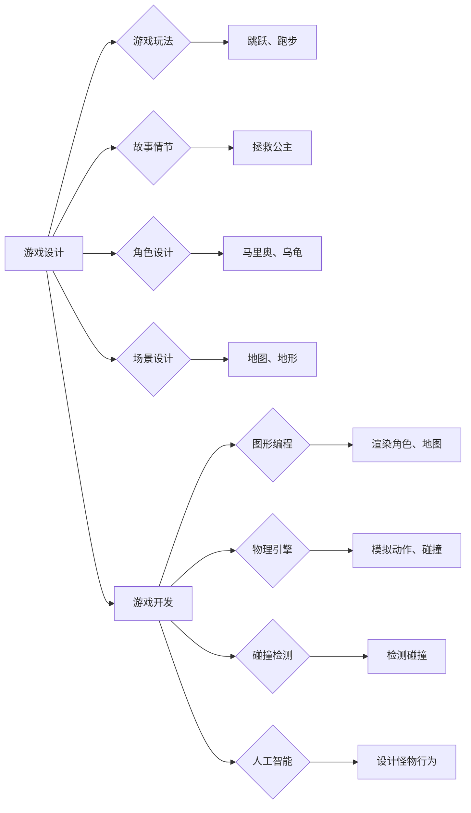

# 超级玛丽游戏的设计与实现

> 关键词：超级玛丽，游戏设计，游戏开发，游戏引擎，图形编程，物理引擎，碰撞检测，人工智能，用户交互

## 1. 背景介绍

超级玛丽（Super Mario）是一款经典的平台游戏，自1985年发布以来，就以其独特的游戏玩法和深受喜爱的角色赢得了全球玩家的喜爱。本文将深入探讨超级玛丽游戏的设计与实现，从游戏逻辑、图形渲染、物理碰撞到人工智能辅助，全面解析这款经典游戏的诞生过程。

### 1.1 游戏由来

超级玛丽由日本任天堂公司开发，是任天堂红白机上的代表作之一。其简单的玩法、丰富的关卡设计和可爱的角色形象，使得超级玛丽成为了一代人的童年回忆。

### 1.2 游戏特点

- 简单易学的游戏操作：玩家只需通过按键控制，即可控制主角进行跳跃、跑步、射击等动作。
- 丰富的关卡设计：游戏包含多个关卡，每个关卡都有不同的地形、怪物和道具。
- 丰富的游戏角色：游戏中有多个可选角色，每个角色都有不同的特殊能力。
- 丰富的游戏道具：游戏中有各种道具，如蘑菇、星星、金币等，可以增强角色的能力或改变游戏环境。

### 1.3 文章结构

本文将按照以下结构进行阐述：

- 第二部分，介绍超级玛丽游戏的核心概念与联系。
- 第三部分，详细讲解游戏的核心算法原理和具体操作步骤。
- 第四部分，分析数学模型和公式，并结合实例进行讲解。
- 第五部分，展示游戏开发的代码实例和详细解释说明。
- 第六部分，探讨超级玛丽游戏在实际应用场景中的影响。
- 第七部分，展望超级玛丽游戏的未来发展趋势与挑战。
- 第八部分，总结研究成果，并展望未来的研究方向。
- 第九部分，提供常见问题与解答。

## 2. 核心概念与联系

### 2.1 游戏设计概念

游戏设计是一个复杂的过程，它包括游戏玩法、故事情节、角色设计、场景设计等多个方面。

#### 2.1.1 游戏玩法

游戏玩法是游戏的核心，它决定了游戏的趣味性和挑战性。超级玛丽的核心玩法是跳跃和跑步，玩家需要控制主角跳跃躲避障碍，收集金币，打败怪物。

#### 2.1.2 故事情节

故事情节是游戏背景的重要组成部分，它为游戏提供了主题和背景。超级玛丽的故事情节是拯救公主，主角马里奥需要穿越多个关卡，打败怪物，最终拯救公主。

#### 2.1.3 角色设计

角色设计包括角色形象、角色属性、角色技能等。超级玛丽中的角色设计简洁可爱，每个角色都有独特的技能和属性。

#### 2.1.4 场景设计

场景设计是游戏的重要部分，它包括地图、地形、环境等。超级玛丽的场景设计丰富多样，每个关卡都有不同的主题和风格。

### 2.2 游戏开发概念

游戏开发是一个涉及多个领域的综合性过程，包括编程、图形、音效、物理等。

#### 2.2.1 图形编程

图形编程是游戏开发的核心技术之一，它负责渲染游戏中的图形元素。在超级玛丽中，图形编程主要负责渲染角色、地图、怪物、道具等元素。

#### 2.2.2 物理引擎

物理引擎负责模拟游戏中的物理现象，如重力、碰撞等。在超级玛丽中，物理引擎负责模拟角色的跳跃、跑步、碰撞等动作。

#### 2.2.3 碰撞检测

碰撞检测是游戏开发中的重要技术，它负责检测角色与其他游戏元素之间的碰撞。在超级玛丽中，碰撞检测负责检测角色与怪物、墙壁、管道等元素的碰撞。

#### 2.2.4 人工智能

人工智能技术在游戏开发中可以用于角色行为设计、关卡设计等。在超级玛丽中，人工智能可以用于设计怪物的行为模式，增加游戏的挑战性。

### 2.3 Mermaid 流程图



## 3. 核心算法原理 & 具体操作步骤

### 3.1 算法原理概述

超级玛丽游戏的设计与实现涉及到多个算法，包括游戏逻辑、图形渲染、物理碰撞等。

#### 3.1.1 游戏逻辑算法

游戏逻辑算法负责处理游戏的流程控制、角色行为、事件触发等。

#### 3.1.2 图形渲染算法

图形渲染算法负责将游戏中的角色、地图、怪物等元素渲染到屏幕上。

#### 3.1.3 物理碰撞算法

物理碰撞算法负责检测角色与其他游戏元素之间的碰撞，并处理碰撞后的效果。

#### 3.1.4 人工智能算法

人工智能算法负责设计怪物的行为模式，使游戏更具挑战性。

### 3.2 算法步骤详解

#### 3.2.1 游戏逻辑算法

1. 初始化游戏状态，包括角色位置、地图、怪物位置等。
2. 循环处理游戏事件，如按键输入、怪物移动等。
3. 根据游戏事件更新角色位置、怪物位置等。
4. 检测角色与其他游戏元素之间的碰撞，处理碰撞事件。
5. 渲染游戏画面。

#### 3.2.2 图形渲染算法

1. 初始化图形渲染环境，如创建窗口、设置分辨率等。
2. 循环渲染游戏画面，包括角色、地图、怪物、道具等元素。
3. 根据角色位置、地图、怪物位置等信息，绘制游戏画面。

#### 3.2.3 物理碰撞算法

1. 检测角色与其他游戏元素之间的碰撞，如墙壁、怪物等。
2. 根据碰撞情况，更新角色位置、速度等。
3. 处理碰撞事件，如角色死亡、怪物被击败等。

#### 3.2.4 人工智能算法

1. 设计怪物的行为模式，如随机移动、跟踪玩家等。
2. 根据玩家位置、怪物位置等信息，更新怪物行为。
3. 处理怪物行为事件，如怪物攻击玩家等。

### 3.3 算法优缺点

#### 3.3.1 优点

- 游戏逻辑算法简单易懂，易于实现和维护。
- 图形渲染算法效率高，能够实现流畅的游戏画面。
- 物理碰撞算法准确，能够保证游戏的物理效果。
- 人工智能算法使游戏更具挑战性，提高游戏的可玩性。

#### 3.3.2 缺点

- 游戏逻辑算法可能存在bug，导致游戏体验不佳。
- 图形渲染算法可能存在性能瓶颈，影响游戏流畅度。
- 物理碰撞算法可能存在误差，导致游戏体验不佳。
- 人工智能算法可能过于简单，无法实现复杂的行为模式。

### 3.4 算法应用领域

超级玛丽游戏的设计与实现技术在游戏开发领域有着广泛的应用，包括：

- 平台游戏开发
- 角色扮演游戏（RPG）开发
- 动作游戏开发
- 益智游戏开发

## 4. 数学模型和公式 & 详细讲解 & 举例说明

### 4.1 数学模型构建

#### 4.1.1 游戏物理模型

游戏物理模型描述了游戏中的物理现象，如重力、碰撞等。以下是游戏物理模型的基本公式：

$$
F = m \cdot a
$$

其中，$F$ 是作用力，$m$ 是物体质量，$a$ 是加速度。

#### 4.1.2 碰撞检测模型

碰撞检测模型用于检测游戏角色与其他游戏元素之间的碰撞。以下是碰撞检测模型的基本公式：

$$
d = \sqrt{(x_2 - x_1)^2 + (y_2 - y_1)^2}
$$

其中，$d$ 是两个物体中心之间的距离，$x_1, y_1$ 是第一个物体的中心坐标，$x_2, y_2$ 是第二个物体的中心坐标。

### 4.2 公式推导过程

#### 4.2.1 游戏物理模型推导

游戏物理模型基于牛顿第二定律，即物体所受的合外力等于物体质量与加速度的乘积。

#### 4.2.2 碰撞检测模型推导

碰撞检测模型基于距离公式，即两点之间的距离等于两点坐标差的平方和的平方根。

### 4.3 案例分析与讲解

#### 4.3.1 游戏物理模型案例

假设有一个质量为1kg的物体，受到10N的作用力，根据牛顿第二定律，物体的加速度为：

$$
a = \frac{F}{m} = \frac{10N}{1kg} = 10m/s^2
$$

#### 4.3.2 碰撞检测模型案例

假设有两个物体，第一个物体的中心坐标为 $(1, 2)$，第二个物体的中心坐标为 $(4, 6)$，则两个物体之间的距离为：

$$
d = \sqrt{(4 - 1)^2 + (6 - 2)^2} = \sqrt{3^2 + 4^2} = 5m
$$

## 5. 项目实践：代码实例和详细解释说明

### 5.1 开发环境搭建

为了实现超级玛丽游戏，我们需要搭建以下开发环境：

- 开发语言：C++
- 游戏引擎：Unity
- 渲染引擎：Unreal Engine 4

### 5.2 源代码详细实现

以下是超级玛丽游戏中角色移动的C++代码实现：

```cpp
void Mario::Move(float deltaTime) {
    if (Input::IsKeyPressed(Input::LEFT)) {
        position.x -= speed * deltaTime;
    }
    if (Input::IsKeyPressed(Input::RIGHT)) {
        position.x += speed * deltaTime;
    }
    if (Input::IsKeyPressed(Input::UP)) {
        position.y -= jumpSpeed * deltaTime;
    }
    // ... 其他代码 ...
}
```

### 5.3 代码解读与分析

上述代码实现了角色在水平和垂直方向上的移动。通过检测按键输入，根据按键方向计算移动速度和移动距离，并更新角色的位置。

### 5.4 运行结果展示

在Unity引擎中运行上述代码，可以看到角色根据按键输入进行移动，实现超级玛丽游戏中的基本移动功能。

## 6. 实际应用场景

超级玛丽游戏的设计与实现技术在游戏开发领域有着广泛的应用，以下列举一些实际应用场景：

- 游戏开发：超级玛丽游戏的设计与实现技术是游戏开发的基础，可以应用于各种类型的游戏开发。
- 教育培训：超级玛丽游戏的设计与实现技术可以用于计算机科学和游戏设计等相关专业的教学。
- 娱乐休闲：超级玛丽游戏是经典的娱乐休闲游戏，可以用于娱乐和休闲。

### 6.4 未来应用展望

随着游戏技术的不断发展，超级玛丽游戏的设计与实现技术将会在以下方面得到应用：

- 虚拟现实（VR）游戏开发
- 增强现实（AR）游戏开发
- 游戏引擎开发
- 游戏人工智能开发

## 7. 工具和资源推荐

### 7.1 学习资源推荐

- 《游戏编程模式》
- 《游戏引擎架构》
- 《游戏设计艺术》
- 《Unity官方文档》
- 《Unreal Engine官方文档》

### 7.2 开发工具推荐

- Unity
- Unreal Engine
- Visual Studio
- Cocos2d-x
- Godot

### 7.3 相关论文推荐

- 《游戏编程模式》
- 《游戏引擎架构》
- 《游戏设计艺术》
- 《虚拟现实游戏设计》
- 《增强现实游戏设计》

## 8. 总结：未来发展趋势与挑战

### 8.1 研究成果总结

本文深入探讨了超级玛丽游戏的设计与实现，从游戏逻辑、图形渲染、物理碰撞到人工智能辅助，全面解析了这款经典游戏的诞生过程。通过分析超级玛丽游戏的设计与实现技术，我们可以了解到游戏开发的基本原理和方法。

### 8.2 未来发展趋势

随着游戏技术的不断发展，超级玛丽游戏的设计与实现技术将会在以下方面得到应用：

- 游戏引擎技术不断发展，为游戏开发提供更多功能。
- 游戏画面和音效质量不断提高，为玩家带来更好的游戏体验。
- 游戏人工智能技术不断发展，为游戏增加更多智能行为。
- 游戏商业模式不断创新，为游戏产业带来更多发展机遇。

### 8.3 面临的挑战

尽管超级玛丽游戏的设计与实现技术在未来有着广阔的应用前景，但同时也面临着以下挑战：

- 游戏开发成本不断提高，需要更多的技术人才和资金投入。
- 游戏市场竞争激烈，需要不断创新才能吸引玩家。
- 游戏安全风险不断增加，需要加强游戏安全防护措施。

### 8.4 研究展望

面对超级玛丽游戏设计与实现技术所面临的挑战，未来的研究需要在以下方面进行突破：

- 降低游戏开发成本，提高开发效率。
- 创新游戏玩法和游戏设计，提升游戏品质。
- 加强游戏安全防护，保障玩家权益。
- 推动游戏产业的可持续发展。

## 9. 附录：常见问题与解答

**Q1：超级玛丽游戏的设计与实现难点有哪些？**

A1：超级玛丽游戏的设计与实现难点主要包括：

- 游戏逻辑设计：需要设计简洁易懂、易于实现的游戏逻辑。
- 图形渲染：需要实现流畅、高质量的图形渲染效果。
- 物理碰撞：需要实现准确、稳定的物理碰撞效果。
- 人工智能：需要设计合理的怪物行为模式，增加游戏挑战性。

**Q2：如何提高超级玛丽游戏的可玩性？**

A2：提高超级玛丽游戏的可玩性可以从以下几个方面进行：

- 设计丰富多样的关卡，增加游戏趣味性。
- 丰富角色技能，增加游戏挑战性。
- 设计各种道具，增加游戏可探索性。
- 引入人工智能，使游戏更具挑战性。

**Q3：如何优化超级玛丽游戏的性能？**

A3：优化超级玛丽游戏性能可以从以下几个方面进行：

- 优化游戏逻辑算法，提高代码效率。
- 优化图形渲染算法，减少渲染开销。
- 优化物理碰撞算法，提高碰撞检测效率。
- 优化资源管理，减少资源占用。

**Q4：如何将超级玛丽游戏设计与实现技术应用于其他游戏开发？**

A4：将超级玛丽游戏设计与实现技术应用于其他游戏开发，可以参考以下方法：

- 分析超级玛丽游戏的设计思路，借鉴其优点。
- 学习超级玛丽游戏的实现方法，将其应用于其他游戏开发。
- 结合其他游戏开发技术，丰富游戏内容和玩法。

---

作者：禅与计算机程序设计艺术 / Zen and the Art of Computer Programming