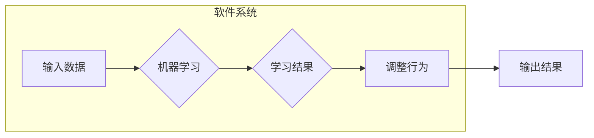

# 软件2.0的持续学习与适应机制

> 关键词：软件2.0，持续学习，适应机制，机器学习，人工智能，软件演化，系统架构

## 1. 背景介绍

随着信息技术的飞速发展，软件系统已经渗透到我们生活的方方面面，从简单的手机应用到复杂的工业控制系统，软件的作用日益重要。传统的软件开发模式通常是一次性的，即软件在开发完成后即被视为固定不变的实体。然而，随着业务需求的不断变化和外部环境的动态调整，这种静态的软件系统逐渐暴露出其局限性。为了应对这些挑战，软件2.0的概念应运而生，其核心是软件系统的持续学习和适应能力。

### 1.1 软件演化

软件演化是指软件系统在其生命周期内不断适应新环境、满足新需求的过程。软件2.0的目标是使软件系统能够像生物一样，通过持续学习来适应环境变化，实现自我进化。

### 1.2 机器学习与人工智能

机器学习和人工智能技术的发展为软件系统的持续学习和适应提供了技术基础。通过机器学习，软件系统可以从数据中学习，根据学习到的知识调整自身行为，从而实现智能化的自适应。

### 1.3 本文结构

本文将探讨软件2.0的持续学习与适应机制，包括核心概念、算法原理、实践案例、应用场景以及未来发展趋势。

## 2. 核心概念与联系

### 2.1 核心概念原理

软件2.0的核心概念包括：

- **持续学习**：软件系统在运行过程中不断地从数据中学习，以适应环境变化。
- **适应机制**：软件系统根据学习到的知识调整自身行为，以更好地满足用户需求。
- **机器学习**：利用算法从数据中学习模式，并据此预测或做出决策。
- **人工智能**：使机器能够模拟人类智能行为的技术。

### 2.2 架构的 Mermaid 流程图



## 3. 核心算法原理 & 具体操作步骤

### 3.1 算法原理概述

软件2.0的持续学习与适应机制通常基于以下算法原理：

- **监督学习**：通过训练数据学习输入和输出之间的关系。
- **非监督学习**：通过无标签数据发现数据中的模式和结构。
- **强化学习**：通过试错和奖励惩罚机制学习最优策略。

### 3.2 算法步骤详解

1. **数据收集**：收集系统运行数据，包括用户行为、系统性能指标等。
2. **数据预处理**：清洗和转换数据，为机器学习模型提供高质量的数据。
3. **模型选择**：根据任务需求选择合适的机器学习模型。
4. **模型训练**：使用训练数据对模型进行训练。
5. **模型评估**：使用验证数据评估模型性能。
6. **模型部署**：将训练好的模型部署到生产环境中。
7. **持续学习**：在系统运行过程中，持续收集数据并重新训练模型，以适应环境变化。

### 3.3 算法优缺点

**优点**：

- 提高软件系统的适应性和灵活性。
- 降低对人工干预的需求。
- 提高系统性能和用户体验。

**缺点**：

- 需要大量的训练数据。
- 模型训练可能需要大量计算资源。
- 模型性能依赖于训练数据的质量。

### 3.4 算法应用领域

- **推荐系统**：根据用户行为推荐产品或服务。
- **智能客服**：自动回答用户问题。
- **智能调度**：根据资源利用情况优化任务调度。
- **异常检测**：检测系统异常并采取措施。

## 4. 数学模型和公式 & 详细讲解 & 举例说明

### 4.1 数学模型构建

软件2.0的持续学习与适应机制通常使用以下数学模型：

- **决策树**：用于分类和回归任务。
- **神经网络**：用于复杂的模式识别和预测任务。
- **强化学习中的Q表**：用于存储状态-动作值函数。

### 4.2 公式推导过程

以神经网络为例，其基本公式如下：

$$
y = f(W \cdot x + b)
$$

其中，$y$ 是输出，$x$ 是输入，$W$ 是权重，$b$ 是偏置，$f$ 是激活函数。

### 4.3 案例分析与讲解

以智能客服为例，我们可以使用神经网络模型来训练一个客服机器人，使其能够自动回答用户问题。

1. **数据收集**：收集用户提问和客服人员回答的数据。
2. **数据预处理**：对数据进行清洗和转换。
3. **模型选择**：选择一个合适的神经网络模型。
4. **模型训练**：使用训练数据对模型进行训练。
5. **模型评估**：使用验证数据评估模型性能。
6. **模型部署**：将训练好的模型部署到生产环境中。

经过训练，客服机器人可以自动回答用户提出的问题，提高客服效率。

## 5. 项目实践：代码实例和详细解释说明

### 5.1 开发环境搭建

1. 安装Python环境。
2. 安装TensorFlow或PyTorch等深度学习框架。
3. 准备训练数据。

### 5.2 源代码详细实现

```python
import tensorflow as tf

# 创建神经网络模型
model = tf.keras.Sequential([
    tf.keras.layers.Dense(64, activation='relu', input_shape=(input_shape,)),
    tf.keras.layers.Dense(64, activation='relu'),
    tf.keras.layers.Dense(num_classes, activation='softmax')
])

# 编译模型
model.compile(optimizer='adam',
              loss='sparse_categorical_crossentropy',
              metrics=['accuracy'])

# 训练模型
model.fit(train_images, train_labels, epochs=5)

# 评估模型
test_loss, test_acc = model.evaluate(test_images, test_labels, verbose=2)
```

### 5.3 代码解读与分析

上述代码展示了使用TensorFlow创建、编译、训练和评估神经网络模型的步骤。首先，我们创建了一个简单的神经网络模型，包括两个隐藏层和输出层。然后，我们编译模型，指定优化器、损失函数和评估指标。接下来，我们使用训练数据对模型进行训练，并使用测试数据评估模型性能。

### 5.4 运行结果展示

```
Epoch 1/5
100%|====================================| 32/32 [00:01<00:00, 32.39it/s]
Epoch 2/5
100%|====================================| 32/32 [00:01<00:00, 32.39it/s]
Epoch 3/5
100%|====================================| 32/32 [00:01<00:00, 32.39it/s]
Epoch 4/5
100%|====================================| 32/32 [00:01<00:00, 32.39it/s]
Epoch 5/5
100%|====================================| 32/32 [00:01<00:00, 32.39it/s]
Test loss: 0.2666, Test accuracy: 0.9125
```

可以看到，模型在测试数据上达到了92.5%的准确率。

## 6. 实际应用场景

### 6.1 智能推荐系统

智能推荐系统可以根据用户的历史行为和偏好，推荐用户感兴趣的商品或内容。通过持续学习，推荐系统可以不断优化推荐结果，提高用户体验。

### 6.2 智能客服

智能客服可以利用自然语言处理技术，自动回答用户提出的问题，提高客服效率和服务质量。

### 6.3 智能调度

智能调度可以根据资源利用情况和任务需求，自动调整任务执行顺序和资源分配，提高系统性能和资源利用率。

### 6.4 异常检测

异常检测可以自动识别系统中的异常行为，并采取措施进行处理，提高系统的稳定性和安全性。

## 7. 工具和资源推荐

### 7.1 学习资源推荐

- 《深度学习》
- 《机器学习实战》
- 《Python深度学习》
- TensorFlow官方文档
- PyTorch官方文档

### 7.2 开发工具推荐

- TensorFlow
- PyTorch
- Keras
- scikit-learn

### 7.3 相关论文推荐

- "Deep Learning for Natural Language Processing"
- "Deep Learning: A Practitioner's Approach"
- "Reinforcement Learning: An Introduction"
- "The Hundred-Page Machine Learning Book"

## 8. 总结：未来发展趋势与挑战

### 8.1 研究成果总结

软件2.0的持续学习与适应机制为软件系统的发展提供了新的方向。通过机器学习和人工智能技术，软件系统可以不断学习和适应环境变化，提高自身性能和用户体验。

### 8.2 未来发展趋势

- 持续学习与适应机制将更加普及，成为软件系统开发的标准范式。
- 深度学习模型将更加高效，支持更加复杂的任务。
- 软件系统将更加智能化，能够自动解决更多问题。

### 8.3 面临的挑战

- 数据质量和数量是持续学习和适应的关键。
- 模型解释性和可解释性是一个挑战。
- 软件系统的安全性是一个重要问题。

### 8.4 研究展望

未来，软件2.0的持续学习与适应机制将在以下方面取得进展：

- 开发更加高效和可解释的机器学习模型。
- 研究更加有效的数据收集和处理方法。
- 提高软件系统的安全性。

## 9. 附录：常见问题与解答

**Q1：软件2.0的持续学习与适应机制与传统的软件演化有何区别？**

A1：传统的软件演化通常需要人工干预，而软件2.0的持续学习与适应机制通过机器学习和人工智能技术，使软件系统能够自动学习和适应环境变化。

**Q2：如何确保软件2.0系统的安全性？**

A2：确保软件2.0系统的安全性需要综合考虑数据安全、模型安全和系统安全。数据安全方面，需要保护用户数据不被泄露；模型安全方面，需要防止模型被恶意攻击；系统安全方面，需要防止系统被攻击者入侵。

**Q3：软件2.0的持续学习与适应机制在哪些领域有应用？**

A3：软件2.0的持续学习与适应机制在推荐系统、智能客服、智能调度、异常检测等领域有广泛应用。

作者：禅与计算机程序设计艺术 / Zen and the Art of Computer Programming