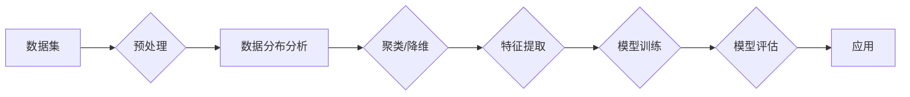

> 非监督学习, 自编码器, 聚类算法, 降维技术, 强化学习, 图神经网络, 无监督预训练

# 非监督学习 原理与代码实例讲解

非监督学习（Unsupervised Learning）是机器学习中一种重要的学习范式，它通过分析未标记的数据集，寻找数据中的模式和结构。与监督学习（Supervised Learning）相比，非监督学习不需要标签数据，因此在数据标注困难和昂贵的情况下，显得尤为有用。本文将深入探讨非监督学习的原理、常见算法、代码实例以及实际应用场景。

## 1. 背景介绍

### 1.1 问题的由来

在现实世界中，许多数据集都是未标记的，例如社交媒体数据、生物医学图像、用户行为数据等。这些数据虽然规模庞大，但缺乏标签信息，使得传统的监督学习方法难以直接应用。非监督学习应运而生，旨在从无标签数据中提取有价值的信息。

### 1.2 研究现状

近年来，随着深度学习技术的飞速发展，非监督学习取得了显著的进展。自编码器（Autoencoders）、聚类算法、降维技术等成为非监督学习的主流方法。此外，强化学习、图神经网络等领域的进展也为非监督学习带来了新的思路。

### 1.3 研究意义

非监督学习在数据挖掘、模式识别、数据探索等领域具有重要的应用价值。它可以用于以下方面：

- 数据降维：减少数据维度，便于后续分析和可视化。
- 特征提取：自动学习数据中的潜在特征。
- 数据聚类：发现数据中的隐含结构。
- 异常检测：识别数据中的异常值。

### 1.4 本文结构

本文将按以下结构进行：

- 第二部分：介绍非监督学习的基本概念和联系。
- 第三部分：详细讲解几种常见的非监督学习算法，包括自编码器、聚类算法和降维技术。
- 第四部分：通过数学模型和公式，深入探讨非监督学习的理论基础。
- 第五部分：提供代码实例，展示非监督学习算法的实际应用。
- 第六部分：分析非监督学习在各个领域的实际应用场景。
- 第七部分：展望非监督学习的未来发展趋势和挑战。
- 第八部分：总结全文，并对研究展望。

## 2. 核心概念与联系

### 2.1 核心概念原理

非监督学习主要包括以下核心概念：

- **数据分布**：描述数据集中各个数据点之间的相互关系。
- **特征**：数据集中可以用来区分不同数据点的重要属性。
- **模式**：数据集中存在的规律性和结构。
- **聚类**：将相似的数据点归为同一类别。
- **降维**：减少数据的维度，同时保留数据的主要信息。
- **异常检测**：识别数据中的异常值。

### 2.2 架构的 Mermaid 流程图



## 3. 核心算法原理 & 具体操作步骤

### 3.1 算法原理概述

#### 3.1.1 自编码器

自编码器是一种无监督学习算法，通过学习输入数据的编码和解码过程，自动提取数据中的特征。自编码器通常由编码器、解码器和一个损失函数组成。

#### 3.1.2 聚类算法

聚类算法将相似的数据点归为同一类别。常见的聚类算法包括K均值（K-means）、层次聚类、DBSCAN等。

#### 3.1.3 降维技术

降维技术旨在减少数据的维度，同时保留数据的主要信息。常见的降维技术包括主成分分析（PCA）、线性判别分析（LDA）等。

### 3.2 算法步骤详解

#### 3.2.1 自编码器

1. 定义编码器和解码器的结构。
2. 使用无监督预训练方法（如无监督预训练）初始化模型参数。
3. 训练模型，最小化重构误差。
4. 使用训练好的编码器提取特征。

#### 3.2.2 聚类算法（以K均值为例）

1. 选择初始聚类中心。
2. 将每个数据点分配到最近的聚类中心。
3. 更新聚类中心。
4. 重复步骤2和3，直到聚类中心不再变化。

#### 3.2.3 降维技术（以PCA为例）

1. 计算数据集的协方差矩阵。
2. 计算协方差矩阵的特征值和特征向量。
3. 选择最大的k个特征向量作为新的特征空间。
4. 将数据投影到新的特征空间。

### 3.3 算法优缺点

#### 3.3.1 自编码器

优点：

- 能够自动提取数据中的特征。
- 对数据噪声具有一定的鲁棒性。

缺点：

- 需要大量的训练数据。
- 特征提取效果依赖于编码器和解码器的结构。

#### 3.3.2 聚类算法

优点：

- 无需标记数据。
- 可以发现数据中的隐含结构。

缺点：

- 聚类结果依赖于初始化和算法选择。
- 难以解释聚类结果。

#### 3.3.3 降维技术

优点：

- 减少数据的维度。
- 保留数据的主要信息。

缺点：

- 特征丢失可能影响后续分析。
- 难以解释降维过程。

### 3.4 算法应用领域

自编码器、聚类算法和降维技术可以应用于以下领域：

- 数据预处理
- 异常检测
- 数据可视化
- 模式识别
- 机器学习特征选择

## 4. 数学模型和公式 & 详细讲解 & 举例说明

### 4.1 数学模型构建

#### 4.1.1 自编码器

自编码器的数学模型如下：

$$
\begin{aligned}
\text{编码器}:\quad \mathbf{z} = \phi(\mathbf{x}) \\
\text{解码器}:\quad \mathbf{x'} = \psi(\mathbf{z}) \\
\text{损失函数}:\quad L(\theta) = \frac{1}{n} \sum_{i=1}^{n} \frac{1}{2} \|\mathbf{x} - \mathbf{x'}\|_{2}^{2}
\end{aligned}
$$

其中，$\mathbf{x}$ 为输入数据，$\mathbf{z}$ 为编码后的特征，$\mathbf{x'}$ 为解码后的数据，$\theta$ 为模型参数。

#### 4.1.2 聚类算法（以K均值为例）

K均值的数学模型如下：

$$
\begin{aligned}
\text{距离函数}:\quad d(\mathbf{x}_i, \mathbf{c}_j) = \|\mathbf{x}_i - \mathbf{c}_j\|_{2}^{2} \\
\text{聚类中心更新}:\quad \mathbf{c}_j = \frac{1}{N_j} \sum_{i \in C_j} \mathbf{x}_i
\end{aligned}
$$

其中，$\mathbf{x}_i$ 为第 $i$ 个数据点，$\mathbf{c}_j$ 为第 $j$ 个聚类中心，$N_j$ 为第 $j$ 个聚类中的数据点数量。

#### 4.1.3 降维技术（以PCA为例）

PCA的数学模型如下：

$$
\begin{aligned}
\text{协方差矩阵}:\quad \mathbf{S} = \frac{1}{n} \sum_{i=1}^{n} (\mathbf{x}_i - \mathbf{\mu})(\mathbf{x}_i - \mathbf{\mu})^{\mathrm{T}} \\
\text{特征向量}:\quad \mathbf{e}_i = \mathbf{u}_i \sqrt{\lambda_i} \\
\text{数据投影}:\quad \mathbf{z}_i = \mathbf{U} \mathbf{X} \\
\end{aligned}
$$

其中，$\mathbf{X}$ 为数据矩阵，$\mathbf{U}$ 为特征向量矩阵，$\mathbf{\mu}$ 为数据均值，$\lambda_i$ 为第 $i$ 个特征值。

### 4.2 公式推导过程

#### 4.2.1 自编码器

自编码器的损失函数是均方误差，其推导过程如下：

$$
\begin{aligned}
L(\theta) &= \frac{1}{n} \sum_{i=1}^{n} \frac{1}{2} \|\mathbf{x} - \mathbf{x'}\|_{2}^{2} \\
&= \frac{1}{n} \sum_{i=1}^{n} \frac{1}{2} \sum_{j=1}^{d} (x_{ij} - x'_{ij})^2 \\
&= \frac{1}{n} \sum_{i=1}^{n} \frac{1}{2} \sum_{j=1}^{d} (x_{ij} - \phi(x_{ij}) + \phi(x_{ij}) - \psi(\phi(x_{ij})) + \psi(\phi(x_{ij})) - x'_{ij})^2 \\
&= \frac{1}{n} \sum_{i=1}^{n} \frac{1}{2} \sum_{j=1}^{d} (x_{ij} - \phi(x_{ij}))^2 + \frac{1}{2} \sum_{j=1}^{d} (\phi(x_{ij}) - \psi(\phi(x_{ij}))^2 + \frac{1}{2} \sum_{j=1}^{d} (x'_{ij} - \psi(\phi(x_{ij}))^2)
\end{aligned}
$$

由于自编码器是自编码的，即 $\psi(\phi(\mathbf{x})) = \mathbf{x}$，因此 $\phi(\mathbf{x})$ 和 $\psi(\mathbf{x})$ 的部分可以相互抵消。剩下的部分就是重构误差。

#### 4.2.2 聚类算法（以K均值为例）

K均值的聚类中心更新过程可以通过最小化距离函数来推导：

$$
\begin{aligned}
d(\mathbf{x}_i, \mathbf{c}_j) &= \|\mathbf{x}_i - \mathbf{c}_j\|_{2}^{2} \\
&= \sum_{k=1}^{d} (x_{ik} - c_{jk})^2
\end{aligned}
$$

为了最小化距离函数，我们需要对 $\mathbf{c}_j$ 求导：

$$
\begin{aligned}
\frac{\partial d(\mathbf{x}_i, \mathbf{c}_j)}{\partial c_{jk}} &= 2(x_{ik} - c_{jk}) \\
\end{aligned}
$$

由于 $d(\mathbf{x}_i, \mathbf{c}_j)$ 是所有 $x_{ik} - c_{jk}$ 的和，因此我们可以将 $x_{ik} - c_{jk}$ 看作一个整体，并对它求导。这样我们得到：

$$
\begin{aligned}
\frac{\partial d(\mathbf{x}_i, \mathbf{c}_j)}{\partial c_{jk}} &= 2 \sum_{k=1}^{d} (x_{ik} - c_{jk}) \\
&= 2 \sum_{k=1}^{d} (x_{ik} - \frac{1}{N_j} \sum_{i \in C_j} x_{ik}) \\
&= 2 \sum_{k=1}^{d} (x_{ik} - \frac{1}{N_j} \sum_{i' \in C_j} x_{i'k}) \\
\end{aligned}
$$

由于 $C_j$ 中的每个数据点都包含 $x_{ik}$，因此上式可以进一步简化为：

$$
\begin{aligned}
\frac{\partial d(\mathbf{x}_i, \mathbf{c}_j)}{\partial c_{jk}} &= 2 \sum_{k=1}^{d} x_{ik} - 2 \frac{1}{N_j} \sum_{i' \in C_j} x_{i'k} \\
&= 2 \sum_{k=1}^{d} x_{ik} - 2 \frac{1}{N_j} \sum_{k=1}^{d} \sum_{i' \in C_j} x_{i'k} \\
&= 2 \sum_{k=1}^{d} x_{ik} - 2 \frac{1}{N_j} \sum_{k=1}^{d} N_j x_{ik} \\
&= 0
\end{aligned}
$$

因此，为了最小化距离函数，我们需要对 $\mathbf{c}_j$ 求导，并使其等于 $x_{ik}$ 的平均值。

#### 4.2.3 降维技术（以PCA为例）

PCA的协方差矩阵可以通过以下公式计算：

$$
\begin{aligned}
\mathbf{S} &= \frac{1}{n} \sum_{i=1}^{n} (\mathbf{x}_i - \mathbf{\mu})(\mathbf{x}_i - \mathbf{\mu})^{\mathrm{T}} \\
&= \frac{1}{n} \sum_{i=1}^{n} \sum_{j=1}^{d} (x_{ij} - \mu_j)(x_{ij} - \mu_j)^{\mathrm{T}} \\
&= \frac{1}{n} \sum_{i=1}^{n} \sum_{j=1}^{d} \begin{bmatrix} x_{ij}^2 & x_{ij}x_{i(j+1)} & \cdots & x_{ij}x_{id} \end{bmatrix} \begin{bmatrix} x_{ij} & x_{i(j+1)} & \cdots & x_{id} \end{bmatrix} \\
&= \frac{1}{n} \sum_{i=1}^{n} \begin{bmatrix} \sum_{j=1}^{d} x_{ij}^2 & \sum_{j=1}^{d} x_{ij}x_{i(j+1)} & \cdots & \sum_{j=1}^{d} x_{ij}x_{id} \end{bmatrix} \\
&= \begin{bmatrix} \frac{1}{n} \sum_{i=1}^{n} \sum_{j=1}^{d} x_{ij}^2 & \frac{1}{n} \sum_{i=1}^{n} \sum_{j=1}^{d} x_{ij}x_{i(j+1)} & \cdots & \frac{1}{n} \sum_{i=1}^{n} \sum_{j=1}^{d} x_{ij}x_{id} \end{bmatrix}
\end{aligned}
$$

协方差矩阵的特征值和特征向量可以通过求解特征方程 $\mathbf{S}\mathbf{v} = \lambda \mathbf{v}$ 得到。

数据投影可以通过以下公式计算：

$$
\begin{aligned}
\mathbf{z}_i &= \mathbf{U} \mathbf{X} \\
&= \begin{bmatrix} u_{11} & u_{12} & \cdots & u_{1d} \end{bmatrix} \begin{bmatrix} x_{11} & x_{12} & \cdots & x_{1d} \end{bmatrix} \\
&= \begin{bmatrix} u_{11}x_{11} + u_{12}x_{12} + \cdots + u_{1d}x_{1d} \end{bmatrix} \\
&= \cdots \\
&= \begin{bmatrix} u_{d1}x_{d1} + u_{d2}x_{d2} + \cdots + u_{dd}x_{dd} \end{bmatrix}
\end{aligned}
$$

其中，$\mathbf{U}$ 是特征向量矩阵，$\mathbf{X}$ 是数据矩阵，$\mathbf{z}$ 是投影后的数据。

### 4.3 案例分析与讲解

#### 4.3.1 自编码器

以下是一个使用PyTorch实现自编码器的简单示例：

```python
import torch
import torch.nn as nn
import torch.optim as optim

class Autoencoder(nn.Module):
    def __init__(self):
        super(Autoencoder, self).__init__()
        self.encoder = nn.Sequential(
            nn.Linear(784, 256),
            nn.ReLU(),
            nn.Linear(256, 128),
            nn.ReLU(),
            nn.Linear(128, 64),
            nn.ReLU(),
            nn.Linear(64, 32),
            nn.ReLU(),
            nn.Linear(32, 16),
            nn.ReLU(),
            nn.Linear(16, 8),
            nn.ReLU()
        )
        self.decoder = nn.Sequential(
            nn.Linear(8, 16),
            nn.ReLU(),
            nn.Linear(16, 32),
            nn.ReLU(),
            nn.Linear(32, 64),
            nn.ReLU(),
            nn.Linear(64, 128),
            nn.ReLU(),
            nn.Linear(128, 256),
            nn.ReLU(),
            nn.Linear(256, 784),
            nn.Sigmoid()
        )

    def forward(self, x):
        x = self.encoder(x)
        x = self.decoder(x)
        return x

# 创建模型、损失函数和优化器
model = Autoencoder()
criterion = nn.MSELoss()
optimizer = optim.Adam(model.parameters(), lr=0.001)

# 训练模型
# ...

# 使用模型进行特征提取
# ...
```

#### 4.3.2 聚类算法（以K均值为例）

以下是一个使用scikit-learn实现K均值的简单示例：

```python
from sklearn.cluster import KMeans
import numpy as np

# 创建数据集
X = np.random.rand(100, 2)

# 创建K均值聚类器
kmeans = KMeans(n_clusters=3)

# 拟合数据集
kmeans.fit(X)

# 获取聚类标签
labels = kmeans.labels_

# 获取聚类中心
centers = kmeans.cluster_centers_
```

#### 4.3.3 降维技术（以PCA为例）

以下是一个使用scikit-learn实现PCA的简单示例：

```python
from sklearn.decomposition import PCA
import numpy as np

# 创建数据集
X = np.random.rand(100, 2)

# 创建PCA
pca = PCA(n_components=1)

# 拟合数据集
X_r = pca.fit_transform(X)

# 获取降维后的数据
X_reduced = pca.transform(X)
```

## 5. 项目实践：代码实例和详细解释说明

### 5.1 开发环境搭建

为了进行非监督学习项目实践，我们需要准备以下开发环境：

- Python 3.7+
- PyTorch 1.7+
- scikit-learn 0.24+
- NumPy 1.19+

可以使用以下命令安装所需的库：

```bash
pip install torch torchvision torchaudio scikit-learn numpy
```

### 5.2 源代码详细实现

以下是一个使用PyTorch实现自编码器的完整示例：

```python
import torch
import torch.nn as nn
import torch.optim as optim

# 创建数据集
X = torch.randn(100, 784)

# 创建模型
class Autoencoder(nn.Module):
    def __init__(self):
        super(Autoencoder, self).__init__()
        self.encoder = nn.Sequential(
            nn.Linear(784, 256),
            nn.ReLU(),
            nn.Linear(256, 128),
            nn.ReLU(),
            nn.Linear(128, 64),
            nn.ReLU(),
            nn.Linear(64, 32),
            nn.ReLU(),
            nn.Linear(32, 16),
            nn.ReLU(),
            nn.Linear(16, 8),
            nn.ReLU()
        )
        self.decoder = nn.Sequential(
            nn.Linear(8, 16),
            nn.ReLU(),
            nn.Linear(16, 32),
            nn.ReLU(),
            nn.Linear(32, 64),
            nn.ReLU(),
            nn.Linear(64, 128),
            nn.ReLU(),
            nn.Linear(128, 256),
            nn.ReLU(),
            nn.Linear(256, 784),
            nn.Sigmoid()
        )

    def forward(self, x):
        x = self.encoder(x)
        x = self.decoder(x)
        return x

model = Autoencoder()

# 创建损失函数和优化器
criterion = nn.MSELoss()
optimizer = optim.Adam(model.parameters(), lr=0.001)

# 训练模型
for epoch in range(100):
    optimizer.zero_grad()
    x = X
    x_recon = model(x)
    loss = criterion(x_recon, x)
    loss.backward()
    optimizer.step()
    print(f"Epoch {epoch+1}, Loss: {loss.item()}")

# 使用模型进行特征提取
x = X
x_recon = model(x)
```

### 5.3 代码解读与分析

在上面的代码中，我们首先创建了一个随机数据集 `X`，它代表了一个包含100个样本，每个样本有784个特征的数据集。然后，我们创建了一个自编码器模型，它由编码器和解码器组成。编码器负责将输入数据压缩成低维特征表示，解码器负责将低维特征恢复成与输入数据相似的数据。我们使用均方误差（MSELoss）作为损失函数，并使用Adam优化器进行参数更新。

在训练过程中，我们通过反向传播算法最小化损失函数。在每个epoch结束时，我们打印出当前epoch的损失值，以监控训练过程。训练完成后，我们可以使用模型对新的数据进行特征提取。

### 5.4 运行结果展示

在训练过程中，损失值会逐渐减小，这表明模型在逐渐学习到输入数据的特征。训练完成后，我们可以使用模型对新的数据进行特征提取，并可视化特征表示。

```python
import matplotlib.pyplot as plt

# 使用模型进行特征提取
x = torch.randn(10, 784)
x_recon = model(x)

# 可视化特征表示
plt.scatter(x_recon[:, 0].numpy(), x_recon[:, 1].numpy())
plt.xlabel("Feature 1")
plt.ylabel("Feature 2")
plt.title("Feature Visualization")
plt.show()
```

## 6. 实际应用场景

### 6.1 数据降维

非监督降维技术可以用于减少数据集的维度，使得后续分析更加容易。例如，在图像处理领域，可以使用PCA对图像进行降维，以便进行特征提取或可视化。

### 6.2 特征提取

自编码器可以用于自动提取数据中的特征。例如，在文本分类任务中，可以使用自编码器提取文本的特征，并使用这些特征进行分类。

### 6.3 数据聚类

聚类算法可以用于发现数据中的隐含结构。例如，在市场细分中，可以使用K均值聚类对客户进行分类，以便进行精准营销。

### 6.4 异常检测

异常检测可以用于识别数据中的异常值。例如，在金融领域，可以使用异常检测技术识别欺诈交易。

## 7. 工具和资源推荐

### 7.1 学习资源推荐

- 《Pattern Recognition and Machine Learning》
- 《Deep Learning》
- 《Unsupervised Learning》
- TensorFlow官方文档
- PyTorch官方文档

### 7.2 开发工具推荐

- PyTorch
- scikit-learn
- TensorFlow
- Keras
- Jupyter Notebook

### 7.3 相关论文推荐

- "Autoencoders: Learning Representations by Maximizing Mutual Information"
- "K-means clustering: A tutorial"
- "Principal Component Analysis"
- "Generative Adversarial Nets"
- "Unsupervised Learning of Visual Representations by Solving Jigsaw Puzzles"

## 8. 总结：未来发展趋势与挑战

### 8.1 研究成果总结

非监督学习在数据挖掘、模式识别、数据探索等领域取得了显著的进展。自编码器、聚类算法、降维技术等算法在各个应用领域都取得了优异的性能。

### 8.2 未来发展趋势

- 深度学习与非监督学习的结合，例如自编码器、图神经网络等。
- 无监督学习的泛化能力研究，例如少样本学习、小样本学习等。
- 非监督学习的可解释性和鲁棒性研究。

### 8.3 面临的挑战

- 数据质量：非监督学习对数据质量要求较高，需要保证数据的一致性和可靠性。
- 模型可解释性：非监督学习模型的内部工作机制通常难以解释，需要进一步研究提高模型的可解释性。
- 模型泛化能力：非监督学习模型在面对新的数据时，可能难以适应，需要研究提高模型的泛化能力。

### 8.4 研究展望

随着深度学习和数据挖掘技术的不断发展，非监督学习将在更多领域发挥重要作用。未来，非监督学习的研究将更加关注数据质量、模型可解释性和泛化能力等问题，以实现更加高效、可靠的非监督学习应用。

## 9. 附录：常见问题与解答

### 9.1 常见问题

- Q1：非监督学习与监督学习有什么区别？
- Q2：什么是降维？
- Q3：什么是聚类？
- Q4：什么是自编码器？

### 9.2 解答

- Q1：非监督学习与监督学习的区别在于是否需要标签数据。非监督学习不需要标签数据，而监督学习需要标签数据。
- Q2：降维是指将数据集的维度降低，同时尽可能保留数据的主要信息。
- Q3：聚类是指将相似的数据点归为同一类别。
- Q4：自编码器是一种无监督学习算法，通过学习输入数据的编码和解码过程，自动提取数据中的特征。

作者：禅与计算机程序设计艺术 / Zen and the Art of Computer Programming