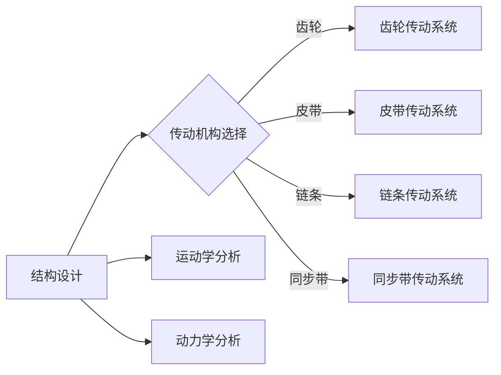

> 关键词：机器人设计，结构设计，传动机构，高性能，高可靠性，机械系统，运动学，动力学

# 高性能和高可靠性的机器人的结构设计和传动机构设计

机器人作为现代工业和智能设备的重要组成部分，其结构设计和传动机构设计直接决定了机器人的性能和可靠性。本文将深入探讨高性能和高可靠性机器人的结构设计和传动机构设计，从核心概念、算法原理到实际应用场景，全面解析这一领域的专业知识。

## 1. 背景介绍

随着科技的飞速发展，机器人技术已经渗透到工业、医疗、服务、家庭等多个领域。高性能和高可靠性的机器人对于提高生产效率、降低成本、提升用户体验具有重要意义。机器人的结构设计和传动机构设计是机器人技术中的核心环节，直接影响到机器人的整体性能和可靠性。

### 1.1 问题的由来

机器人设计面临的挑战主要包括：

- **性能需求**：机器人需要具备高精度、高速度、高稳定性等性能，以满足不同应用场景的要求。
- **可靠性要求**：机器人需要在各种复杂环境下稳定运行，具有长的使用寿命。
- **成本控制**：在保证性能和可靠性的同时，需要控制制造成本，提高市场竞争力。

### 1.2 研究现状

近年来，机器人结构设计和传动机构设计领域取得了显著进展，主要体现在以下几个方面：

- **材料科学**：轻质高强度的材料如碳纤维、钛合金等在机器人中的应用越来越广泛。
- **精密加工**：数控加工、激光加工等先进加工技术在机器人制造中的应用，提高了零部件的精度。
- **智能控制**：传感器技术、运动控制技术等的发展，使得机器人能够实现更为复杂的运动和操作。

### 1.3 研究意义

研究高性能和高可靠性机器人的结构设计和传动机构设计，对于以下方面具有重要意义：

- **提高生产效率**：优化设计可以提高机器人执行任务的速度和精度，从而提高生产效率。
- **降低生产成本**：合理的设计可以降低制造成本，提高机器人的市场竞争力。
- **拓展应用领域**：高性能和高可靠性的机器人可以应用于更广泛的领域，推动机器人技术的发展。

## 2. 核心概念与联系

### 2.1 核心概念

**结构设计**：机器人的结构设计是指确定机器人各个零部件的形状、尺寸、材料等，以及它们之间的连接关系。

**传动机构**：传动机构是指将驱动源的力传递到执行机构的机构，包括齿轮、皮带、链条、同步带等。

**运动学**：运动学是研究物体运动规律的科学，主要用于分析机器人各个部件的运动轨迹和速度。

**动力学**：动力学是研究物体受力后运动状态变化规律的科学，主要用于分析机器人各个部件的受力情况和运动稳定性。

### 2.2 Mermaid 流程图



### 2.3 核心概念联系

结构设计和传动机构设计是机器人设计中的两个重要环节，它们相互关联，共同决定了机器人的性能和可靠性。

- 结构设计决定了机器人的整体框架，影响传动机构的安装和使用。
- 传动机构的选择和设计直接影响到机器人的运动性能和可靠性。
- 运动学和动力学分析是结构设计和传动机构设计的基础，用于评估和优化机器人的运动性能和稳定性。

## 3. 核心算法原理 & 具体操作步骤

### 3.1 算法原理概述

机器人结构设计和传动机构设计的主要算法原理包括：

- **有限元分析**：用于分析机器人结构在各种载荷作用下的应力、应变和变形情况。
- **运动学分析**：用于计算机器人各个关节的运动轨迹和速度。
- **动力学分析**：用于分析机器人各个关节的受力情况和运动稳定性。
- **优化算法**：用于优化机器人的结构参数和传动机构参数，提高性能和可靠性。

### 3.2 算法步骤详解

#### 3.2.1 结构设计步骤

1. **需求分析**：根据机器人应用场景和性能要求，确定机器人的结构设计方案。
2. **选型设计**：选择合适的材料、连接方式和形状。
3. **建模与仿真**：使用有限元分析软件进行结构仿真，评估结构强度和刚度。
4. **优化设计**：根据仿真结果，优化结构参数，提高性能和可靠性。

#### 3.2.2 传动机构设计步骤

1. **需求分析**：根据机器人运动要求，确定传动机构类型。
2. **选型设计**：选择合适的传动比、精度和效率。
3. **动力学分析**：分析传动机构在运动过程中的受力情况和动态响应。
4. **优化设计**：根据动力学分析结果，优化传动机构参数，提高性能和可靠性。

### 3.3 算法优缺点

#### 3.3.1 优点

- **提高性能**：优化设计可以显著提高机器人的性能，如提高精度、速度、负载能力等。
- **提高可靠性**：合理的设计可以降低机器人的故障率，提高使用寿命。
- **降低成本**：优化设计可以在保证性能和可靠性的同时，降低制造成本。

#### 3.3.2 缺点

- **设计复杂**：机器人设计和传动机构设计需要综合考虑多种因素，设计过程复杂。
- **仿真成本高**：有限元分析和动力学分析需要使用专业软件，仿真成本较高。
- **测试难度大**：机器人的性能和可靠性需要通过实验进行验证，测试难度较大。

### 3.4 算法应用领域

机器人结构设计和传动机构设计算法在以下领域有广泛应用：

- **工业机器人**：如焊接机器人、装配机器人、搬运机器人等。
- **服务机器人**：如清洁机器人、陪护机器人、教育机器人等。
- **医疗机器人**：如手术机器人、康复机器人、辅助诊断机器人等。

## 4. 数学模型和公式 & 详细讲解 & 举例说明

### 4.1 数学模型构建

机器人结构设计和传动机构设计的数学模型主要包括：

- **有限元分析模型**：描述机器人结构的力学特性。
- **运动学模型**：描述机器人各个关节的运动关系。
- **动力学模型**：描述机器人各个关节的受力情况和运动状态。

### 4.2 公式推导过程

以下以有限元分析模型为例，简要介绍公式推导过程。

#### 4.2.1 有限元分析模型

有限元分析模型将机器人结构离散化，将连续的力学问题转化为离散的求解问题。常用的有限元分析方法包括：

- **梁单元法**：用于分析梁的弯曲、剪切和扭转等力学行为。
- **板壳单元法**：用于分析板、壳的弯曲、剪切等力学行为。
- **实体单元法**：用于分析实体结构的力学行为。

#### 4.2.2 公式推导

以梁单元法为例，推导梁单元的力学模型：

1. **基本假设**：梁单元为等截面直杆，材料均匀，具有线性弹性。
2. **坐标系**：取梁单元的轴线为x轴，y轴垂直于梁单元轴线。
3. **位移函数**：取梁单元的位移函数为：

$$
u(x) = \sum_{i=1}^{n} N_i(x) u_i
$$

其中，$N_i(x)$ 为形函数，$u_i$ 为节点位移。

4. **应变与应力**：应变和应力与位移之间的关系为：

$$
\varepsilon_i = \frac{\partial^2 u(x)}{\partial x^2}
$$

$$
\sigma_i = E \varepsilon_i
$$

其中，$E$ 为材料的弹性模量。

5. **力平衡方程**：对梁单元进行力平衡分析，得到力平衡方程：

$$
\int_{0}^{L} [M(x) \frac{\partial^2 u(x)}{\partial x^2} + N(x) u(x)] dx = F
$$

其中，$M(x)$ 为弯矩，$N(x)$ 为剪力，$F$ 为作用在梁单元上的外力。

### 4.3 案例分析与讲解

以下以一个简单的机器人关节为例，分析其结构设计和传动机构设计。

#### 4.3.1 机器人关节结构设计

该机器人关节采用双连杆结构，由两个等截面直杆和两个转动副组成。使用有限元分析软件对关节进行仿真，分析其在不同载荷作用下的应力分布和变形情况。

#### 4.3.2 传动机构设计

该机器人关节采用同步带传动机构，传动比为1:1。使用动力学分析软件对传动机构进行仿真，分析其传动效率和动态响应。

## 5. 项目实践：代码实例和详细解释说明

### 5.1 开发环境搭建

进行机器人结构设计和传动机构设计，需要以下开发环境：

- **有限元分析软件**：如ANSYS、Abaqus等。
- **运动学分析软件**：如MATLAB、Dymola等。
- **动力学分析软件**：如ADAMS、Simulink等。
- **编程语言**：如Python、MATLAB等。

### 5.2 源代码详细实现

以下以Python为例，展示如何使用有限元分析软件Abaqus进行结构设计仿真。

```python
from abaqus import *
from part import *
from material import *
from section import *
from assembly import *
from step import *
from interaction import *
from load import *
from mesh import *
from job import *
from sketch import *
from visualization import *
from connector import *
from display import *
from post import *

# 创建Part
model = mdb.models['Model-1']
session = mdb.currentSession
# ...

# 创建材料
Material = model.Material(name='Material-1')
Material.E = 200e9
Material.Poisson = 0.3
Material Density = 7850
Material.Density = Density
Material = session.materials['Material-1']
# ...

# 创建Section
Section = model.Sections['Section-1']
Section.Type = 'General'
Section.A = 100
Section.t = 10
Section = session.sections['Section-1']
# ...

# 创建Assembly
Assembly = model.Assemblies['Assembly-1']
Assembly = session.assemblies['Assembly-1']
Assembly.Movable = True
# ...

# 创建Step
Step = model.StaticStep(name='Step-1')
Step = session.steps['Step-1']
Step.timePeriod = 'Step'
# ...

# 创建Load
Load = model.L loads['Load-1']
Load.name = 'Load-1'
Load.Pressure = 10000
Load.fixity = 'Node'
Load.create()
# ...

# 创建Mesh
mesh = model.Msh
mesh.generateMesh()
# ...

# 创建Job
Job = model.Jobs['Job-1']
Job.type = 'Analyze'
# ...

# 创建SubmitJob
submitJob = session.submitJob(name=Job.name)
# ...

# 创建MonitorJob
monitorJob = session.getJob(name=Job.name)
# ...

# 获取结果
result = monitorJob.waitforResults()
# ...
```

### 5.3 代码解读与分析

以上代码展示了如何使用Python调用Abaqus进行结构设计仿真。代码首先创建了一个模型、材料、截面、装配体、步骤、加载、网格等，然后提交了Job，并等待结果。

### 5.4 运行结果展示

仿真完成后，可以查看Abaqus后处理模块中的结果，包括应力云图、变形云图等。

## 6. 实际应用场景

### 6.1 工业机器人

工业机器人是结构设计和传动机构设计的重要应用场景。例如，焊接机器人、装配机器人、搬运机器人等都需要高性能和高可靠性的结构设计和传动机构。

### 6.2 医疗机器人

医疗机器人对结构设计和传动机构的要求更为严格，需要保证手术精度和手术安全性。例如，手术机器人、康复机器人、辅助诊断机器人等都需要进行精密的结构设计和传动机构设计。

### 6.3 服务机器人

服务机器人对结构设计和传动机构的设计要求较高，需要保证机器人的运动灵活性和人机交互的舒适性。例如，清洁机器人、陪护机器人、教育机器人等都需要进行合理的设计。

## 7. 工具和资源推荐

### 7.1 学习资源推荐

- 《机器人技术与应用》
- 《机器人学基础》
- 《机器人控制与驱动》
- 《有限元分析原理与应用》
- 《机械设计手册》

### 7.2 开发工具推荐

- ANSYS
- Abaqus
- MATLAB
- Simulink
- ADAMS
- SolidWorks
- CATIA

### 7.3 相关论文推荐

- “机器人结构设计优化方法研究”
- “机器人传动机构设计研究”
- “基于有限元分析的机器人关节强度分析”
- “机器人运动学分析及应用”
- “机器人动力学分析及应用”

## 8. 总结：未来发展趋势与挑战

### 8.1 研究成果总结

本文对高性能和高可靠性机器人的结构设计和传动机构设计进行了全面系统的介绍，从核心概念、算法原理到实际应用场景，全面解析了这一领域的专业知识。

### 8.2 未来发展趋势

- **轻量化设计**：采用轻质高强度的材料，降低机器人重量，提高运动性能。
- **模块化设计**：采用模块化设计，提高机器人的可维护性和可扩展性。
- **智能化设计**：引入人工智能技术，提高机器人的自主性和适应性。

### 8.3 面临的挑战

- **材料研发**：开发轻质高强度的材料，提高机器人的性能。
- **精密加工**：提高零部件的加工精度，保证机器人的精度和稳定性。
- **智能控制**：开发高效的智能控制算法，提高机器人的自主性和适应性。

### 8.4 研究展望

随着机器人技术的不断发展，高性能和高可靠性机器人的结构设计和传动机构设计将面临更多挑战和机遇。未来研究需要关注以下几个方面：

- **新材料的应用**：开发更轻质、更坚固、更具韧性的新材料。
- **智能加工技术**：发展先进的加工技术，提高零部件的加工精度和表面质量。
- **人工智能技术**：将人工智能技术应用于机器人设计和控制，提高机器人的自主性和适应性。

## 9. 附录：常见问题与解答

**Q1：如何提高机器人结构设计的强度和刚度？**

A：提高机器人结构设计的强度和刚度可以通过以下方法实现：

- 采用高强度的材料。
- 优化结构设计，增加支撑结构。
- 进行有限元分析，优化结构参数。

**Q2：如何提高机器人传动机构的效率？**

A：提高机器人传动机构的效率可以通过以下方法实现：

- 选择合适的传动比。
- 优化传动机构的结构设计。
- 使用高效的材料和润滑剂。

**Q3：如何保证机器人的可靠性？**

A：保证机器人的可靠性可以通过以下方法实现：

- 采用高可靠性的零部件。
- 进行严格的测试和验证。
- 定期维护和保养。

**Q4：如何进行机器人结构设计和传动机构设计的优化？**

A：进行机器人结构设计和传动机构设计的优化可以通过以下方法实现：

- 使用有限元分析进行结构优化。
- 使用动力学分析进行传动机构优化。
- 使用优化算法进行参数优化。

**Q5：机器人结构设计和传动机构设计在哪些领域有应用？**

A：机器人结构设计和传动机构设计在以下领域有广泛应用：

- 工业机器人
- 医疗机器人
- 服务机器人
- 家居机器人
- 军事机器人

---

作者：禅与计算机程序设计艺术 / Zen and the Art of Computer Programming