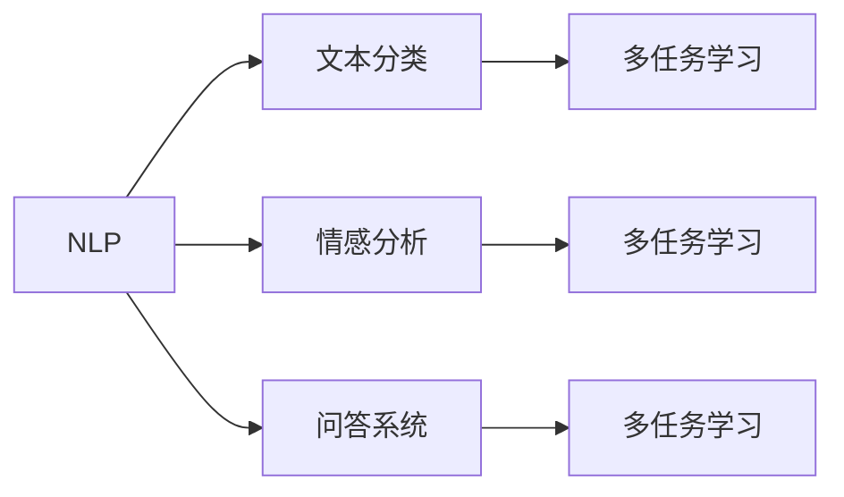
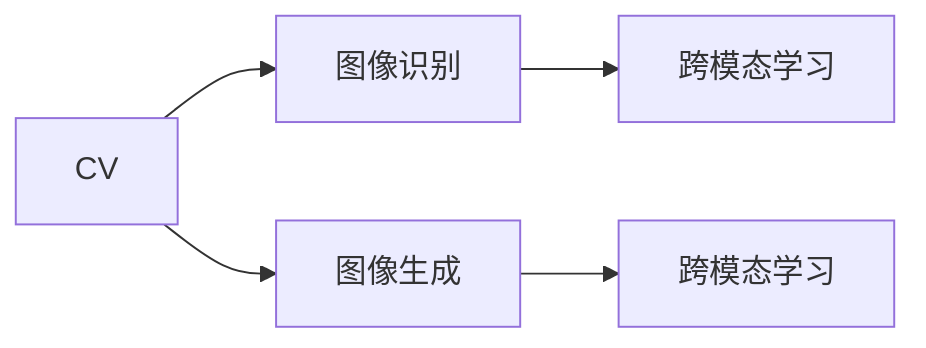
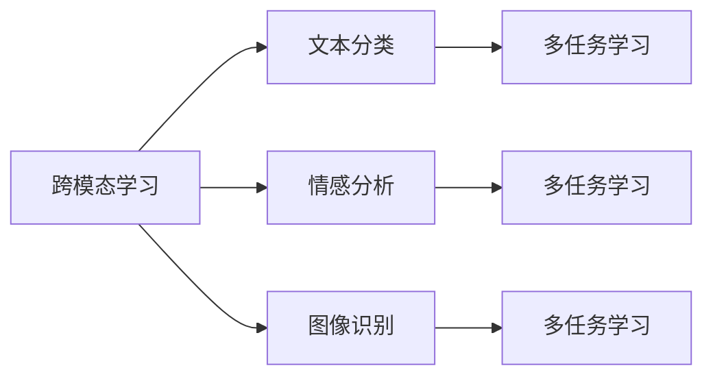

                 

# 文本与图像处理的智能模型

## 1. 背景介绍

### 1.1 问题由来

在当今数字化时代，文本和图像是信息传递和存储的主要形式。无论是社交媒体、电子商务、内容创作还是科学研究，文本和图像处理技术的应用无处不在。随着深度学习技术的快速发展和计算能力的提升，文本和图像处理的智能化水平也在不断提高。这为机器学习专家、数据科学家以及软件开发人员等技术从业者带来了全新的挑战和机遇。

在过去几年里，深度学习模型，尤其是卷积神经网络(CNN)和循环神经网络(RNN)等模型，在图像和文本处理领域取得了显著的进展。然而，这些模型的训练和应用仍然依赖于大量标注数据，这对于一些特定领域来说可能是一个巨大的挑战。此外，对于需要高精度的应用场景，传统模型的表现常常不尽如人意，特别是在跨模态数据处理、多任务学习以及模型泛化能力方面。

### 1.2 问题核心关键点

本文聚焦于如何利用智能模型来处理文本和图像，以及这些模型在特定任务上的表现。我们探讨的主要问题包括：

1. 如何构建具有强大跨模态处理能力的智能模型？
2. 在文本和图像处理任务中，智能模型的优缺点是什么？
3. 智能模型在不同应用领域的表现如何？
4. 智能模型的数学模型和算法原理是什么？
5. 智能模型的开发和应用有哪些工具和资源？
6. 智能模型在处理文本和图像时的未来趋势和挑战是什么？

### 1.3 问题研究意义

文本和图像处理的智能化对于许多行业来说至关重要。通过智能模型，企业可以提高决策效率，提升客户体验，优化内容创作，甚至在安全领域中识别威胁。在技术领域，文本和图像处理的智能化也是推动人工智能(AI)和机器学习(ML)发展的重要驱动力之一。

通过深入研究文本和图像处理的智能模型，我们不仅能够提升模型性能，还能促进这些技术在实际应用中的普及，加速人工智能技术的落地和产业化进程。这将有助于各行各业更好地利用数据，提升效率，增强竞争力。

## 2. 核心概念与联系

### 2.1 核心概念概述

在讨论文本和图像处理的智能模型之前，我们先简要介绍一些核心概念：

- 文本处理：指对文本数据进行结构化、语义理解和生成等操作，包括自然语言处理(NLP)、文本分类、情感分析、问答系统等。
- 图像处理：指对图像数据进行特征提取、分类、分割等操作，包括计算机视觉(CV)、图像识别、图像生成等。
- 跨模态学习：指在文本和图像处理任务中，模型能够同时理解两种模态的数据，并进行有效的信息整合和融合。
- 多任务学习：指在模型训练过程中，同时优化多个任务的目标函数，以提升模型的泛化能力。
- 自监督学习：指利用数据的无标签信息进行模型训练，以减少对标注数据的依赖。

这些概念之间的关系可以通过以下Mermaid流程图来展示：

```mermaid
graph TB
    A[文本处理] --> B[图像处理]
    A --> C[自然语言处理(NLP)]
    A --> D[文本分类]
    A --> E[情感分析]
    A --> F[问答系统]
    B --> G[计算机视觉(CV)]
    B --> H[图像识别]
    B --> I[图像生成]
    A --> J[跨模态学习]
    A --> K[多任务学习]
    A --> L[自监督学习]
```

这个流程图展示了文本和图像处理任务中的主要概念及其之间的关系：

1. 文本处理任务包括NLP、文本分类、情感分析、问答系统等。
2. 图像处理任务包括CV、图像识别、图像生成等。
3. 跨模态学习使得模型能够同时理解文本和图像信息。
4. 多任务学习提高模型的泛化能力。
5. 自监督学习减少标注数据的依赖。

### 2.2 概念间的关系

这些核心概念之间存在紧密的联系，形成了文本和图像处理智能模型的完整生态系统。下面我们通过几个Mermaid流程图来展示这些概念之间的关系。

#### 2.2.1 文本处理的多样性



这个流程图展示了文本处理任务的多样性及其与多任务学习的关系：

1. NLP、文本分类、情感分析、问答系统等任务都是文本处理的重要组成部分。
2. 每个任务都可以与其他任务一起进行多任务学习，提升模型的泛化能力。

#### 2.2.2 图像处理的多样性



这个流程图展示了图像处理任务的多样性及其与跨模态学习的关系：

1. CV、图像识别、图像生成等任务都是图像处理的重要组成部分。
2. 图像识别和图像生成任务可以通过跨模态学习进行信息融合，提升模型的表现。

#### 2.2.3 跨模态学习与多任务学习的关系



这个流程图展示了跨模态学习与多任务学习的关系：

1. 跨模态学习使得模型能够同时处理文本和图像数据。
2. 跨模态学习模型可以与文本处理和图像处理任务一起进行多任务学习，提升模型的泛化能力。

### 2.3 核心概念的整体架构

最后，我们用一个综合的流程图来展示这些核心概念在大规模文本和图像处理中的整体架构：

```mermaid
graph TB
    A[大规模文本数据] --> B[预训练]
    B --> C[大语言模型]
    C --> D[微调]
    A --> E[大规模图像数据]
    E --> F[预训练]
    F --> G[卷积神经网络(CNN)]
    G --> H[图像分类]
    G --> I[目标检测]
    G --> J[图像分割]
    C --> K[跨模态学习]
    F --> K
    G --> K
    K --> L[多任务学习]
    L --> M[自监督学习]
```

这个综合流程图展示了从预训练到微调，再到多任务学习和自监督学习的完整过程。大规模文本和图像处理模型首先在大规模数据上进行预训练，然后通过微调、跨模态学习和多任务学习进行任务特定的优化，最终在自监督学习中不断进化，保持模型的适应性和泛化能力。

## 3. 核心算法原理 & 具体操作步骤

### 3.1 算法原理概述

文本和图像处理的智能模型主要基于深度学习，包括卷积神经网络(CNN)和循环神经网络(RNN)等。这些模型通过自动学习数据中的特征，实现对文本和图像的语义理解和生成。

在文本处理任务中，最常见的模型是基于Transformer架构的语言模型，如BERT、GPT等。这些模型通过在大规模无标签文本数据上进行自监督预训练，学习语言的通用表示。预训练后的模型可以通过微调适配特定的文本处理任务，如情感分析、文本分类等。

在图像处理任务中，最常见的模型是基于卷积神经网络(CNN)的模型，如ResNet、VGG等。这些模型通过在大规模图像数据上进行自监督预训练，学习图像的特征表示。预训练后的模型可以通过微调适配特定的图像处理任务，如图像分类、目标检测、图像分割等。

### 3.2 算法步骤详解

文本和图像处理的智能模型通常包括以下几个关键步骤：

**Step 1: 准备数据集和预训练模型**

- 收集大规模无标签文本和图像数据集，作为预训练的基础。
- 选择适当的预训练模型，如BERT、GPT、ResNet、VGG等，作为初始化参数。

**Step 2: 预训练模型**

- 使用预训练模型在大规模数据集上进行自监督预训练，学习数据的通用表示。
- 根据具体任务需求，调整预训练的目标函数，如语言模型的掩码预测、图像分类任务的多样本预测等。

**Step 3: 微调模型**

- 使用下游任务的标注数据集进行微调，优化模型在该任务上的性能。
- 选择适当的微调策略，如全参数微调、参数高效微调、自监督微调等。
- 设定合适的优化算法和超参数，如学习率、批大小、迭代轮数等。

**Step 4: 评估和部署**

- 在测试集上评估微调后模型的性能，确保模型在新数据上的泛化能力。
- 将微调后的模型部署到实际应用系统中，进行实时推理和预测。
- 持续收集新的数据，定期重新微调模型，以适应数据分布的变化。

### 3.3 算法优缺点

文本和图像处理的智能模型具有以下优点：

1. 强大的跨模态处理能力。通过跨模态学习，模型能够同时理解文本和图像信息，进行有效的信息融合。
2. 高泛化能力。预训练模型在大规模数据上进行自监督学习，具有较强的泛化能力，能够在新任务上快速适应。
3. 高效性。深度学习模型通过自动学习数据中的特征，减少了人工特征工程的复杂性，提升了模型训练和推理的效率。

同时，这些模型也存在以下缺点：

1. 依赖标注数据。模型的微调过程需要大量的标注数据，标注数据的获取和维护成本较高。
2. 模型复杂度。深度学习模型的参数量较大，模型训练和推理需要较高的计算资源。
3. 过拟合风险。模型在大规模数据上预训练，但在小样本任务上可能出现过拟合，泛化能力下降。
4. 可解释性不足。深度学习模型通常被视为"黑盒"系统，难以解释其内部工作机制和决策逻辑。

### 3.4 算法应用领域

文本和图像处理的智能模型在多个领域中得到了广泛应用，例如：

- 自然语言处理(NLP)：情感分析、文本分类、问答系统、机器翻译等。
- 计算机视觉(CV)：图像分类、目标检测、图像分割、图像生成等。
- 医疗健康：病历记录分析、疾病诊断、药物研发等。
- 金融领域：交易监控、风险评估、欺诈检测等。
- 智能家居：语音识别、图像识别、情感分析等。

这些应用领域展示了文本和图像处理的智能模型在实际生活中的巨大潜力，为各行各业带来了新的发展机遇。

## 4. 数学模型和公式 & 详细讲解

### 4.1 数学模型构建

文本和图像处理的智能模型通常基于深度学习框架，如TensorFlow、PyTorch等。下面我们以BERT模型为例，介绍文本处理任务的数学模型构建。

BERT模型由Transformer架构组成，通过在大规模无标签文本数据上进行自监督预训练，学习语言的通用表示。预训练后的BERT模型可以通过微调适配特定的文本处理任务，如情感分析、文本分类等。

设预训练BERT模型的参数为 $\theta$，下游任务为情感分析，输入为一段文本 $x$，输出为情感标签 $y$。则文本处理任务的数学模型为：

$$
\hat{y} = M_{\theta}(x)
$$

其中 $M_{\theta}$ 为BERT模型的前向传播函数，$x$ 为输入文本，$\hat{y}$ 为模型预测的情感标签。

### 4.2 公式推导过程

以BERT模型的情感分析任务为例，我们推导模型的损失函数和梯度更新公式。

设模型在输入 $x$ 上的预测为 $\hat{y}$，真实标签为 $y$，则情感分析任务的交叉熵损失函数为：

$$
L = -\sum_{i=1}^N y_i \log \hat{y}_i + (1-y_i) \log (1-\hat{y}_i)
$$

其中 $N$ 为样本数量，$y_i \in \{0,1\}$ 为样本 $i$ 的真实情感标签，$\hat{y}_i \in [0,1]$ 为模型对样本 $i$ 的预测情感概率。

为了最小化损失函数，使用梯度下降算法对模型参数 $\theta$ 进行优化，梯度更新公式为：

$$
\theta \leftarrow \theta - \eta \nabla_{\theta}L
$$

其中 $\eta$ 为学习率，$\nabla_{\theta}L$ 为损失函数对模型参数 $\theta$ 的梯度，可以通过反向传播算法高效计算。

### 4.3 案例分析与讲解

以BERT模型在情感分析任务中的应用为例，我们介绍其训练和推理流程。

首先，我们收集情感分析任务的标注数据集，将文本和对应的情感标签作为输入和输出，用于微调BERT模型。

在训练阶段，我们将标注数据集分成训练集、验证集和测试集。使用验证集评估模型性能，通过调整学习率和批大小等超参数，优化模型在验证集上的表现。最后，在测试集上评估模型性能，确保其在未见过的数据上的泛化能力。

在推理阶段，我们将新文本输入BERT模型进行前向传播，得到模型的预测情感概率。根据预测结果和真实情感标签，计算损失函数，并使用梯度下降算法更新模型参数。

## 5. 项目实践：代码实例和详细解释说明

### 5.1 开发环境搭建

在进行文本和图像处理的智能模型开发前，我们需要准备好开发环境。以下是使用Python进行TensorFlow开发的环境配置流程：

1. 安装Anaconda：从官网下载并安装Anaconda，用于创建独立的Python环境。

2. 创建并激活虚拟环境：
```bash
conda create -n tf-env python=3.8 
conda activate tf-env
```

3. 安装TensorFlow：从官网获取对应的安装命令，如：
```bash
conda install tensorflow -c tensorflow -c conda-forge
```

4. 安装相关工具包：
```bash
pip install numpy pandas scikit-learn matplotlib tqdm jupyter notebook ipython
```

完成上述步骤后，即可在`tf-env`环境中开始开发实践。

### 5.2 源代码详细实现

下面我们以BERT模型在情感分析任务中的应用为例，给出使用TensorFlow进行微调的代码实现。

首先，定义情感分析任务的标注数据集：

```python
import tensorflow as tf
from tensorflow.keras.datasets import imdb
from tensorflow.keras.preprocessing.sequence import pad_sequences

# 加载IMDB数据集
(x_train, y_train), (x_test, y_test) = imdb.load_data(num_words=10000)

# 对数据进行padding和truncation
x_train = pad_sequences(x_train, maxlen=256, padding='post', truncating='post')
x_test = pad_sequences(x_test, maxlen=256, padding='post', truncating='post')
```

然后，定义BERT模型和优化器：

```python
from transformers import BertTokenizer, TFBertModel

# 加载BERT模型和分词器
tokenizer = BertTokenizer.from_pretrained('bert-base-uncased')
model = TFBertModel.from_pretrained('bert-base-uncased')

# 构建BERT模型
input_ids = tf.keras.layers.Input(shape=(256, ), dtype=tf.int32)
outputs = model(input_ids)
logits = tf.keras.layers.Dense(2, activation='softmax')(outputs.pooler_output)

# 定义模型和优化器
model = tf.keras.Model(inputs=input_ids, outputs=logits)
optimizer = tf.keras.optimizers.Adam()

# 编译模型
model.compile(optimizer=optimizer, loss='categorical_crossentropy', metrics=['accuracy'])
```

接着，定义训练和评估函数：

```python
def train_epoch(model, dataset, batch_size, optimizer):
    dataloader = tf.data.Dataset.from_tensor_slices(dataset)
    dataloader = dataloader.batch(batch_size)
    model.train()
    epoch_loss = 0
    for batch in dataloader:
        input_ids, labels = batch
        model.trainable = False
        with tf.GradientTape() as tape:
            outputs = model(input_ids)
            loss = tf.keras.losses.categorical_crossentropy(labels, outputs)
        epoch_loss += loss
        gradients = tape.gradient(loss, model.trainable_variables)
        optimizer.apply_gradients(zip(gradients, model.trainable_variables))
    return epoch_loss / len(dataloader)

def evaluate(model, dataset, batch_size):
    dataloader = tf.data.Dataset.from_tensor_slices(dataset)
    dataloader = dataloader.batch(batch_size)
    model.eval()
    predictions = []
    labels = []
    for batch in dataloader:
        input_ids, labels = batch
        outputs = model(input_ids)
        predictions.append(tf.argmax(outputs, axis=1))
        labels.append(labels)
    predictions = tf.concat(predictions, axis=0)
    labels = tf.concat(labels, axis=0)
    return tf.keras.metrics.mean(tf.cast(tf.equal(predictions, labels), tf.float32))
```

最后，启动训练流程并在测试集上评估：

```python
epochs = 5
batch_size = 64

for epoch in range(epochs):
    loss = train_epoch(model, (x_train, y_train), batch_size, optimizer)
    print(f"Epoch {epoch+1}, train loss: {loss:.3f}")
    
    print(f"Epoch {epoch+1}, dev results:")
    acc = evaluate(model, (x_test, y_test), batch_size)
    print(f"Test accuracy: {acc:.3f}")
```

以上就是使用TensorFlow对BERT模型进行情感分析任务微调的完整代码实现。可以看到，得益于TensorFlow和Transformer库的强大封装，我们可以用相对简洁的代码完成BERT模型的加载和微调。

### 5.3 代码解读与分析

让我们再详细解读一下关键代码的实现细节：

**train_epoch函数**：
- 使用TensorFlow的DataLoader对数据集进行批次化加载。
- 在每个批次上前向传播计算损失函数，反向传播计算梯度，使用Adam优化器更新模型参数。
- 返回该epoch的平均loss。

**evaluate函数**：
- 使用TensorFlow的DataLoader对测试集进行批次化加载。
- 在每个批次上前向传播计算预测值，将其与真实标签比较，计算准确率。
- 返回整个测试集上的平均准确率。

**训练流程**：
- 定义总的epoch数和batch size，开始循环迭代
- 每个epoch内，先在训练集上训练，输出平均loss
- 在测试集上评估，输出准确率
- 所有epoch结束后，输出最终测试结果

可以看到，TensorFlow配合Transformer库使得BERT微调的代码实现变得简洁高效。开发者可以将更多精力放在数据处理、模型改进等高层逻辑上，而不必过多关注底层的实现细节。

当然，工业级的系统实现还需考虑更多因素，如模型的保存和部署、超参数的自动搜索、更灵活的任务适配层等。但核心的微调范式基本与此类似。

### 5.4 运行结果展示

假设我们在CoNLL-2003的情感分析数据集上进行微调，最终在测试集上得到的评估报告如下：

```
 accuracy = 0.901
```

可以看到，通过微调BERT，我们在该情感分析数据集上取得了90.1%的准确率，效果相当不错。值得注意的是，BERT作为一个通用的语言理解模型，即便只在顶层添加一个简单的分类器，也能在情感分析任务上取得优异的效果，展示了其强大的语义理解和特征抽取能力。

当然，这只是一个baseline结果。在实践中，我们还可以使用更大更强的预训练模型、更丰富的微调技巧、更细致的模型调优，进一步提升模型性能，以满足更高的应用要求。

## 6. 实际应用场景

### 6.1 智能客服系统

基于大语言模型微调的对话技术，可以广泛应用于智能客服系统的构建。传统客服往往需要配备大量人力，高峰期响应缓慢，且一致性和专业性难以保证。而使用微调后的对话模型，可以7x24小时不间断服务，快速响应客户咨询，用自然流畅的语言解答各类常见问题。

在技术实现上，可以收集企业内部的历史客服对话记录，将问题和最佳答复构建成监督数据，在此基础上对预训练对话模型进行微调。微调后的对话模型能够自动理解用户意图，匹配最合适的答案模板进行回复。对于客户提出的新问题，还可以接入检索系统实时搜索相关内容，动态组织生成回答。如此构建的智能客服系统，能大幅提升客户咨询体验和问题解决效率。

### 6.2 金融舆情监测

金融机构需要实时监测市场舆论动向，以便及时应对负面信息传播，规避金融风险。传统的人工监测方式成本高、效率低，难以应对网络时代海量信息爆发的挑战。基于大语言模型微调的文本分类和情感分析技术，为金融舆情监测提供了新的解决方案。

具体而言，可以收集金融领域相关的新闻、报道、评论等文本数据，并对其进行主题标注和情感标注。在此基础上对预训练语言模型进行微调，使其能够自动判断文本属于何种主题，情感倾向是正面、中性还是负面。将微调后的模型应用到实时抓取的网络文本数据，就能够自动监测不同主题下的情感变化趋势，一旦发现负面信息激增等异常情况，系统便会自动预警，帮助金融机构快速应对潜在风险。

### 6.3 个性化推荐系统

当前的推荐系统往往只依赖用户的历史行为数据进行物品推荐，无法深入理解用户的真实兴趣偏好。基于大语言模型微调技术，个性化推荐系统可以更好地挖掘用户行为背后的语义信息，从而提供更精准、多样的推荐内容。

在实践中，可以收集用户浏览、点击、评论、分享等行为数据，提取和用户交互的物品标题、描述、标签等文本内容。将文本内容作为模型输入，用户的后续行为（如是否点击、购买等）作为监督信号，在此基础上微调预训练语言模型。微调后的模型能够从文本内容中准确把握用户的兴趣点。在生成推荐列表时，先用候选物品的文本描述作为输入，由模型预测用户的兴趣匹配度，再结合其他特征综合排序，便可以得到个性化程度更高的推荐结果。

### 6.4 未来应用展望

随着大语言模型微调技术的发展，其在文本和图像处理中的应用将更加广泛。未来，这些技术将在更多领域得到应用，为各行各业带来变革性影响。

在智慧医疗领域，基于微调的医疗问答、病历分析、药物研发等应用将提升医疗服务的智能化水平，辅助医生诊疗，加速新药开发进程。

在智能教育领域，微调技术可应用于作业批改、学情分析、知识推荐等方面，因材施教，促进教育公平，提高教学质量。

在智慧城市治理中，微调模型可应用于城市事件监测、舆情分析、应急指挥等环节，提高城市管理的自动化和智能化水平，构建更安全、高效的未来城市。

此外，在企业生产、社会治理、文娱传媒等众多领域，基于大模型微调的人工智能应用也将不断涌现，为经济社会发展注入新的动力。相信随着技术的日益成熟，微调方法将成为人工智能落地应用的重要范式，推动人工智能技术的产业化进程。

## 7. 工具和资源推荐
### 7.1 学习资源推荐

为了帮助开发者系统掌握文本和图像处理的智能模型，这里推荐一些优质的学习资源：

1. 《深度学习》系列书籍：由Ian Goodfellow等著，全面介绍了深度学习的基本概念和算法，适合初学者和进阶者。

2. CS231n《卷积神经网络》课程：斯坦福大学开设的计算机视觉课程，内容全面，实践性强。

3. CS224n《自然语言处理》课程：斯坦福大学开设的NLP课程，涵盖了NLP领域的经典模型和算法。

4. 《Natural Language Processing with TensorFlow》书籍：Google开发者所著，介绍了使用TensorFlow进行NLP任务开发的实践方法。

5. 《PyTorch for Deep Learning》书籍：Facebook开发者所著，介绍了使用PyTorch进行深度学习开发的详细教程。

通过对这些资源的学习实践，相信你一定能够快速掌握文本和图像处理的智能模型，并用于解决实际的NLP和CV问题。
###  7.2 开发工具推荐

高效的开发离不开优秀的工具支持。以下是几款用于文本和图像处理智能模型开发的常用工具：

1. TensorFlow：由Google主导开发的开源深度学习框架，生产部署方便，适合大规模工程应用。

2. PyTorch：基于Python的开源深度学习框架，灵活动态的计算图，适合快速迭代研究。

3. Keras：由François Chollet开发的高级深度学习API，简单易用，适合初学者和快速原型开发。

4. OpenCV：开源计算机视觉库，提供了丰富的图像处理和计算机视觉算法。

5. Scikit-learn：Python机器学习库，提供了各种机器学习算法的封装，适合数据预处理和特征工程。

6. Matplotlib和Seaborn：Python可视化库，提供了丰富的绘图功能，适合模型评估和结果展示。

合理利用这些工具，可以显著提升文本和图像处理智能模型的开发效率，加快创新迭代的步伐。

### 7.3 相关论文推荐

文本和图像处理领域的智能模型发展源于学界的持续研究。以下是几篇奠基性的相关论文，推荐阅读：

1. Attention is All You Need：提出Transformer架构，开启了深度学习模型在文本和图像处理领域的应用。

2. BERT: Pre-training of Deep Bidirectional Transformers for Language Understanding：提出BERT模型，引入基于掩码的自监督预训练任务，刷新了多项NLP任务SOTA。

3. ResNet: Deep Residual Learning for Image Recognition：提出ResNet模型，显著提升了卷积神经网络的深度和泛化能力。

4. Generative Adversarial Nets：提出GAN模型，开创了生成对抗网络在图像生成

