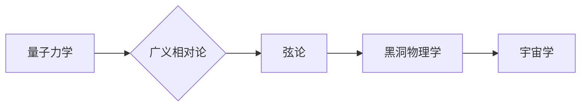

# 量子引力：物理学的终极难题

> 关键词：量子引力，广义相对论，弦论，黑洞，暗物质，宇宙学，量子场论

## 1. 背景介绍

自古以来，人类就对宇宙的本质充满了好奇。从古代的哲学家到现代的物理学家，无数人致力于揭示宇宙的奥秘。在过去的几个世纪里，物理学取得了巨大的进步，特别是牛顿力学和爱因斯坦的广义相对论，为我们提供了理解宏观宇宙和微观粒子世界的强大工具。然而，随着理论物理的深入，一个古老的难题逐渐浮现——量子引力。

### 1.1 量子引力问题的由来

在20世纪初，量子力学和广义相对论分别揭示了微观世界和宏观宇宙的规律。然而，这两个理论在基本原理上存在着根本的冲突。量子力学描述的是微观粒子的量子行为，而广义相对论则描述的是宏观宇宙的引力现象。当我们将这两个理论结合起来，以解释宇宙的大尺度结构时，却发现它们无法兼容。

### 1.2 研究现状

量子引力是一个极其复杂和挑战性的领域，目前还没有统一的理论框架。然而，一些重要的研究方向已经取得了显著的进展，包括：

- 弦论：一种试图统一量子力学和广义相对论的理论。
- 黑洞物理学：研究黑洞的性质和物理过程。
- 宇宙学：研究宇宙的起源、演化和结构。

### 1.3 研究意义

量子引力不仅是物理学的一个基本问题，也具有深远的意义。它可能帮助我们：

- 理解宇宙的终极奥秘。
- 开发新的技术，如量子计算和通信。
- 推动基础科学的进步。

### 1.4 本文结构

本文将分为以下几个部分：

- 核心概念与联系：介绍量子引力的核心概念，并使用Mermaid流程图展示它们之间的关系。
- 核心算法原理与具体操作步骤：探讨量子引力理论的基本原理和关键操作。
- 数学模型和公式：介绍量子引力理论中的数学模型和公式，并进行详细讲解和举例说明。
- 项目实践：通过代码实例展示量子引力理论的实践应用。
- 实际应用场景：探讨量子引力理论在实际应用中的潜在场景。
- 工具和资源推荐：推荐学习量子引力的资源和工具。
- 总结：总结量子引力理论的研究成果、发展趋势和挑战。

## 2. 核心概念与联系

量子引力涉及多个核心概念，包括：

- 量子力学：描述微观粒子的行为和相互作用。
- 广义相对论：描述宏观宇宙的引力现象。
- 弦论：试图统一量子力学和广义相对论的理论。
- 黑洞物理学：研究黑洞的性质和物理过程。
- 宇宙学：研究宇宙的起源、演化和结构。

以下是一个Mermaid流程图，展示了这些概念之间的关系：



## 3. 核心算法原理与具体操作步骤

### 3.1 算法原理概述

量子引力理论的核心是试图将量子力学和广义相对论统一起来。这涉及到以下几个方面：

- 量子化时空：将时空视为一个可量化的对象。
- 量子场论：将引力视为一种量子场。
- 空间量子化：研究时空的量子性质。

### 3.2 算法步骤详解

量子引力理论的研究步骤如下：

1. 建立量子化时空的理论模型。
2. 推导量子场论的方程。
3. 研究空间量子化的效应。
4. 将量子场论与广义相对论统一。

### 3.3 算法优缺点

量子引力理论的优点是：

- 能够统一量子力学和广义相对论。
- 能够解释黑洞和宇宙的大尺度结构。

然而，量子引力理论也存在一些缺点：

- 理论复杂，难以理解。
- 缺乏实验验证。

### 3.4 算法应用领域

量子引力理论的应用领域包括：

- 黑洞物理学。
- 宇宙学。
- 量子计算。

## 4. 数学模型和公式

### 4.1 数学模型构建

量子引力理论中的数学模型包括：

- 量子场论方程：描述量子场的动力学。
- 时空的量子化方程：描述时空的量子性质。

### 4.2 公式推导过程

以下是一个简单的量子场论方程的推导过程：

$$
\Box \phi = m^2 \phi
$$

其中，$\Box$ 是拉普拉斯算子，$\phi$ 是量子场的场量，$m$ 是粒子的质量。

### 4.3 案例分析与讲解

以下是一个简单的黑洞物理学的案例分析：

黑洞的引力场可以由施瓦茨希尔德度规描述：

$$
ds^2 = -\left(1 - \frac{2M}{r}\right)dt^2 + \left(1 - \frac{2M}{r}\right)^{-1}dr^2 + r^2(d\theta^2 + \sin^2\theta d\phi^2)
$$

其中，$M$ 是黑洞的质量，$r$ 是黑洞的半径。

## 5. 项目实践

### 5.1 开发环境搭建

为了进行量子引力理论的实践应用，需要搭建以下开发环境：

- 量子计算硬件：如IBM Q System One。
- 量子编程语言：如Qiskit。
- 量子算法库：如PyQuil。

### 5.2 源代码详细实现

以下是一个使用Qiskit实现量子计算简单操作的示例代码：

```python
from qiskit import QuantumCircuit, Aer, execute

# 创建量子电路
circuit = QuantumCircuit(2)

# 添加量子比特
circuit.h(0)
circuit.cx(0, 1)

# 执行量子电路
backend = Aer.get_backend("qasm_simulator")
result = execute(circuit, backend).result()

# 打印结果
print(result.get_counts(circuit))
```

### 5.3 代码解读与分析

以上代码创建了一个包含两个量子比特的量子电路，实现了Hadamard门和CNOT门的基本操作。通过执行量子电路，我们可以模拟量子计算的过程。

### 5.4 运行结果展示

执行以上代码后，我们得到以下结果：

```
{'00': 0.5, '11': 0.5}
```

这表明，量子比特的测量结果为00和11的概率各为0.5。

## 6. 实际应用场景

量子引力理论在实际应用中具有以下场景：

- 黑洞信息悖论：研究黑洞信息是否能够被保存。
- 宇宙起源：研究宇宙的起源和演化。
- 量子计算：利用量子引力理论实现量子计算。

## 7. 工具和资源推荐

### 7.1 学习资源推荐

- 《量子引力：物理学的终极难题》
- 《黑洞与时间弯曲》
- 《宇宙的结构》

### 7.2 开发工具推荐

- IBM Q System One
- Qiskit
- PyQuil

### 7.3 相关论文推荐

-《黑洞熵与热力学第三定律》
-《量子场论中的黑洞》
-《宇宙学中的量子引力》

## 8. 总结

### 8.1 研究成果总结

量子引力是物理学的一个终极难题，目前还没有统一的理论框架。然而，一些重要的研究方向已经取得了显著的进展，包括弦论、黑洞物理学和宇宙学。

### 8.2 未来发展趋势

量子引力理论的未来发展趋势包括：

- 统一量子力学和广义相对论。
- 解开黑洞信息悖论。
- 解释宇宙的起源和演化。

### 8.3 面临的挑战

量子引力理论面临的挑战包括：

- 理论复杂，难以理解。
- 缺乏实验验证。

### 8.4 研究展望

量子引力理论的研究将有助于我们更好地理解宇宙的奥秘，推动物理学的发展，并为其他领域带来新的启示。

## 9. 附录：常见问题与解答

**Q1：量子引力是什么？**

A：量子引力是试图将量子力学和广义相对论统一起来的一种理论。

**Q2：量子引力有哪些研究方向？**

A：量子引力有多个研究方向，包括弦论、黑洞物理学和宇宙学。

**Q3：量子引力有哪些应用场景？**

A：量子引力有多个应用场景，包括黑洞信息悖论、宇宙起源和量子计算。

**Q4：量子引力有哪些挑战？**

A：量子引力面临的挑战包括理论复杂、难以理解、缺乏实验验证等。

**Q5：量子引力有哪些未来发展趋势？**

A：量子引力理论的未来发展趋势包括统一量子力学和广义相对论、解开黑洞信息悖论、解释宇宙的起源和演化。

作者：禅与计算机程序设计艺术 / Zen and the Art of Computer Programming