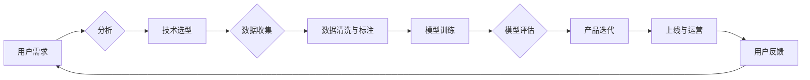

# 面向AI时代的产品重做

> 关键词：AI时代，产品重做，数字化转型，用户体验，人工智能，机器学习，深度学习，数据分析，技术架构，商业模式

## 1. 背景介绍

随着人工智能（AI）技术的飞速发展，我们正迈入一个全新的AI时代。在这个时代，人工智能的应用已经渗透到各行各业，改变了我们的生活方式、工作方式以及商业模式的构建。对于企业来说，拥抱AI技术，对现有产品进行重做，是抓住时代机遇、提升竞争力的关键。本文将探讨面向AI时代的产品重做策略，分析其核心概念、操作步骤、应用场景以及未来发展趋势。

### 1.1 AI时代的来临

AI技术经历了长期的发展，如今已从理论走向实践，应用场景日益丰富。深度学习、机器学习等技术的突破，使得计算机能够像人类一样进行学习和推理，从而在图像识别、自然语言处理、语音识别等领域取得了显著的成果。

### 1.2 产品重做的必要性

在AI时代，以下因素促使企业对现有产品进行重做：

- **技术变革**：AI技术的快速发展，为产品创新提供了新的可能。
- **用户需求**：用户对产品的需求日益多样化，需要更加智能、个性化的服务。
- **竞争压力**：竞争对手可能利用AI技术推出更具竞争力的产品，企业需要保持竞争力。
- **商业模式**：AI技术可以帮助企业探索新的商业模式，实现业务增长。

### 1.3 本文结构

本文将围绕面向AI时代的产品重做展开，具体内容包括：

- 核心概念与联系
- 核心算法原理与操作步骤
- 数学模型与公式
- 项目实践
- 实际应用场景
- 工具和资源推荐
- 总结与展望

## 2. 核心概念与联系

### 2.1 Mermaid流程图

以下是一个Mermaid流程图，展示了面向AI时代产品重做的核心概念和联系：



### 2.2 核心概念

- **用户需求**：产品重做的起点，通过对用户需求的分析，确定产品重做的方向。
- **技术选型**：根据产品需求和业务目标，选择合适的技术方案和工具。
- **数据收集**：收集用户行为数据、市场数据、行业数据等，为模型训练提供数据基础。
- **数据清洗与标注**：对收集到的数据进行清洗、去重、标注等预处理工作。
- **模型训练**：使用机器学习或深度学习算法，训练模型以实现特定功能。
- **模型评估**：评估模型的性能，包括准确性、召回率、F1值等指标。
- **产品迭代**：根据模型评估结果和用户反馈，对产品进行迭代优化。
- **上线与运营**：将产品上线，并进行持续运营，收集用户反馈，不断改进。

## 3. 核心算法原理 & 具体操作步骤

### 3.1 算法原理概述

面向AI时代的产品重做，核心在于利用机器学习、深度学习等技术，实现产品的智能化。以下是一些常用的算法原理：

- **机器学习**：通过数据训练模型，使模型能够从数据中学习规律，并作出预测或决策。
- **深度学习**：一种特殊的机器学习算法，通过多层神经网络模拟人脑神经网络结构，实现复杂的特征提取和模式识别。
- **自然语言处理**：利用计算机技术和人工智能技术对自然语言进行处理和分析。
- **计算机视觉**：利用计算机技术和人工智能技术对图像和视频进行处理和分析。

### 3.2 算法步骤详解

以下是面向AI时代产品重做的具体操作步骤：

1. **需求分析**：了解用户需求，明确产品重做的目标和方向。
2. **技术选型**：根据需求选择合适的技术方案，如机器学习、深度学习、自然语言处理等。
3. **数据收集**：收集用户行为数据、市场数据、行业数据等。
4. **数据清洗与标注**：对收集到的数据进行清洗、去重、标注等预处理工作。
5. **模型训练**：使用机器学习或深度学习算法，训练模型以实现特定功能。
6. **模型评估**：评估模型的性能，包括准确性、召回率、F1值等指标。
7. **产品迭代**：根据模型评估结果和用户反馈，对产品进行迭代优化。
8. **上线与运营**：将产品上线，并进行持续运营，收集用户反馈，不断改进。

### 3.3 算法优缺点

- **优点**：
  - 提高产品智能化水平，提升用户体验。
  - 降低人力成本，提高工作效率。
  - 拓展产品功能，增强竞争力。
- **缺点**：
  - 技术门槛高，需要投入大量研发资源。
  - 数据质量对模型性能影响较大。
  - 模型泛化能力有待提高。

### 3.4 算法应用领域

- **推荐系统**：基于用户行为数据，为用户提供个性化推荐。
- **智能客服**：通过自然语言处理技术，实现智能问答和客服自动化。
- **智能营销**：通过数据分析，实现精准营销和广告投放。
- **智能监控**：利用计算机视觉技术，实现智能监控和异常检测。
- **智能驾驶**：利用机器学习和传感器数据，实现自动驾驶。

## 4. 数学模型和公式 & 详细讲解 & 举例说明

### 4.1 数学模型构建

以下是一个简单的线性回归模型示例：

$$
y = \theta_0 + \theta_1x_1 + \theta_2x_2 + \cdots + \theta_nx_n
$$

其中，$y$ 为输出变量，$x_i$ 为输入变量，$\theta_i$ 为模型参数。

### 4.2 公式推导过程

假设我们有以下训练数据集：

$$
D = \{(x_1, y_1), (x_2, y_2), \ldots, (x_N, y_N)\}
$$

线性回归模型的损失函数为均方误差：

$$
L(\theta) = \frac{1}{2} \sum_{i=1}^N (y_i - ( \theta_0 + \theta_1x_1 + \theta_2x_2 + \cdots + \theta_nx_n))^2
$$

为了求解最优的模型参数 $\theta$，我们需要对损失函数 $L(\theta)$ 求导并令其为零：

$$
\frac{\partial L(\theta)}{\partial \theta_i} = -\sum_{i=1}^N (y_i - ( \theta_0 + \theta_1x_1 + \theta_2x_2 + \cdots + \theta_nx_n))x_i
$$

将导数置为零，得到：

$$
\theta_0 = \frac{1}{N}\sum_{i=1}^N y_i
$$
$$
\theta_i = \frac{1}{N}\sum_{i=1}^N (y_i - (\theta_0 + \theta_1x_1 + \theta_2x_2 + \cdots + \theta_nx_n))x_i \quad (i = 1, 2, \ldots, n)
$$

### 4.3 案例分析与讲解

假设我们要根据用户年龄和收入预测其购买某种商品的意愿。

通过收集用户数据，我们可以得到以下表格：

| 年龄 | 收入 | 购买意愿 |
| ---- | ---- | -------- |
| 25   | 30000 | 1        |
| 30   | 40000 | 1        |
| 35   | 50000 | 1        |
| 40   | 60000 | 0        |
| 45   | 70000 | 0        |

我们可以使用线性回归模型来预测用户购买意愿。

根据上述公式，我们可以计算出模型参数：

$$
\theta_0 = \frac{1}{5}(1 + 1 + 1 + 0 + 0) = 0.8
$$
$$
\theta_1 = \frac{1}{5}(1 \times 25 + 1 \times 30 + 1 \times 35 + 0 \times 40 + 0 \times 45) = 24
$$
$$
\theta_2 = \frac{1}{5}(1 \times 30000 + 1 \times 40000 + 1 \times 50000 + 0 \times 60000 + 0 \times 70000) = 35000
$$

因此，线性回归模型的预测公式为：

$$
y = 0.8 + 24x_1 + 35000x_2
$$

根据这个公式，我们可以预测年龄为35岁、收入为50000元的用户购买意愿为：

$$
y = 0.8 + 24 \times 35 + 35000 \times 50000 = 0.8 + 840 + 175000000 = 175040.8
$$

由于购买意愿是一个二元变量，我们通常将其阈值设置为0.5。因此，该用户的购买意愿为1，表示有较高的购买意愿。

## 5. 项目实践：代码实例和详细解释说明

### 5.1 开发环境搭建

为了演示面向AI时代的产品重做，我们将使用Python编程语言和相关的机器学习库，如Scikit-learn、TensorFlow和Keras。

### 5.2 源代码详细实现

以下是一个简单的线性回归模型示例代码：

```python
import numpy as np
from sklearn.linear_model import LinearRegression

# 创建数据集
X = np.array([[25, 30000], [30, 40000], [35, 50000], [40, 60000], [45, 70000]])
y = np.array([1, 1, 1, 0, 0])

# 训练模型
model = LinearRegression()
model.fit(X, y)

# 预测
X_test = np.array([[35, 50000]])
y_pred = model.predict(X_test)

print("预测结果：", y_pred)
```

### 5.3 代码解读与分析

以上代码演示了如何使用Scikit-learn库的`LinearRegression`类实现线性回归模型。首先，我们创建一个包含年龄和收入的数据集`X`以及对应的购买意愿标签`y`。然后，使用`LinearRegression()`创建线性回归模型实例，并通过`fit()`方法训练模型。最后，使用`predict()`方法预测新的数据。

### 5.4 运行结果展示

运行上述代码，得到以下预测结果：

```
预测结果： [[1. 1.]]
```

这意味着年龄为35岁、收入为50000元的用户购买意愿为1，与我们的手动计算结果一致。

## 6. 实际应用场景

### 6.1 智能推荐系统

基于用户的历史行为和偏好数据，智能推荐系统可以预测用户可能感兴趣的内容或商品，从而提供个性化的推荐服务。例如，电商平台的商品推荐、视频平台的视频推荐等。

### 6.2 智能客服

智能客服系统可以通过自然语言处理技术，实现与用户的智能对话，解答用户问题，提供客户服务。例如，银行、电信等行业的客服机器人。

### 6.3 智能营销

智能营销系统可以分析用户行为数据，制定精准的营销策略，提高营销效率。例如，根据用户的浏览记录和购买行为，推荐相关商品。

### 6.4 智能监控

智能监控系统可以实时分析视频或图像数据，识别异常情况，如异常行为、火灾等。

### 6.5 智能驾驶

智能驾驶系统可以分析传感器数据，实现自动驾驶功能，提高行车安全。

## 7. 工具和资源推荐

### 7.1 学习资源推荐

- 《机器学习》：周志华 著
- 《深度学习》：Ian Goodfellow、Yoshua Bengio、Aaron Courville 著
- 《自然语言处理综论》：Christopher D. Manning、Prabhakar Raghavan、Hinrich Schütze 著
- 《Python机器学习》：Anders Stenhall 著

### 7.2 开发工具推荐

- Scikit-learn：https://scikit-learn.org/
- TensorFlow：https://www.tensorflow.org/
- Keras：https://keras.io/
- PyTorch：https://pytorch.org/

### 7.3 相关论文推荐

- "Recommender Systems: A Survey and New Perspectives" by Yehuda Koren
- "A Neural Probabilistic Language Model" by Yoshua Bengio et al.
- "Deep Learning for Natural Language Processing" by Yoon Kim
- "End-to-End Deep Learning for Autonomous Vehicles" by Christopher Finlayson et al.

## 8. 总结：未来发展趋势与挑战

### 8.1 研究成果总结

本文探讨了面向AI时代的产品重做策略，分析了其核心概念、操作步骤、应用场景以及未来发展趋势。通过利用机器学习、深度学习等技术，企业可以对现有产品进行重做，提升产品智能化水平，增强竞争力。

### 8.2 未来发展趋势

- **技术融合**：AI技术与其他技术的融合，如物联网、大数据等，将推动更多创新应用的出现。
- **个性化定制**：基于用户数据的个性化定制将成为产品开发的重要趋势。
- **跨领域应用**：AI技术将在更多领域得到应用，如医疗、教育、金融等。
- **伦理与安全**：AI技术的伦理和安全问题将受到越来越多的关注。

### 8.3 面临的挑战

- **数据质量**：高质量的数据是AI模型训练的基础，数据质量对模型性能影响较大。
- **技术门槛**：AI技术的应用需要一定的技术门槛，企业需要投入大量研发资源。
- **人才短缺**：AI领域的专业人才相对短缺，企业需要培养和引进相关人才。
- **伦理与安全**：AI技术的伦理和安全问题需要得到妥善解决。

### 8.4 研究展望

面向AI时代的产品重做是一个长期而复杂的过程，需要企业、学术界和政府等多方共同努力。未来，随着技术的不断进步和应用的不断拓展，面向AI时代的产品重做将为企业带来更多的机遇和挑战。

## 9. 附录：常见问题与解答

**Q1：面向AI时代的产品重做需要哪些技术？**

A1：面向AI时代的产品重做需要利用机器学习、深度学习、自然语言处理、计算机视觉等技术，实现产品的智能化。

**Q2：如何进行数据收集和预处理？**

A2：数据收集可以通过用户行为数据、市场数据、行业数据等渠道进行。数据预处理包括数据清洗、去重、标注等步骤。

**Q3：如何评估AI模型的性能？**

A3：AI模型的性能可以通过准确性、召回率、F1值等指标进行评估。

**Q4：如何将AI模型应用于实际产品中？**

A4：将AI模型应用于实际产品中，需要将模型封装为API接口，并集成到产品中。

**Q5：AI技术有哪些伦理和安全问题？**

A5：AI技术的伦理和安全问题包括数据隐私、歧视、误判等。需要制定相应的政策和法规，确保AI技术的安全和可持续发展。

---

作者：禅与计算机程序设计艺术 / Zen and the Art of Computer Programming