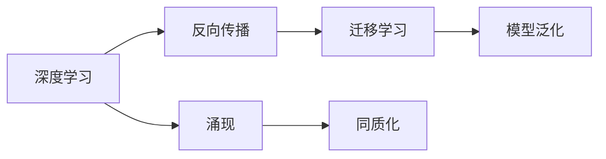

                 

# AI研究中的涌现与同质化

## 1. 背景介绍

人工智能（AI）作为当今科技的前沿领域，正以其迅猛的步伐深刻改变着各行各业。从早期的专家系统、规则推理，到机器学习、深度学习的崛起，AI研究已逐步演化到“涌现”（Emergence）和“同质化”（Homoization）的阶段。

### 1.1 问题由来

“涌现”一词，源于复杂系统理论，意指系统中的个体间简单的相互作用，能自发产生出整体的、复杂的现象。而在AI研究中，涌现更多地体现在大数据、深度学习模型的自适应和自我优化上。

“同质化”则意味着不同AI系统之间出现了趋同，展现出相似的算法框架、模型结构和性能表现。这一现象在一定程度上反映了AI研究的规范化趋势，但同时也引起了学界对技术单一化和创新断档的担忧。

### 1.2 问题核心关键点

AI研究中的涌现与同质化，主要表现为以下两个方面：

- **涌现**：深度学习模型在大规模数据训练中，通过反向传播等算法自适应地学习并发现数据中的隐含规律，从而在特定任务上展现出超出预期的性能。例如，通过大量的图像数据训练，深度神经网络能够识别出复杂的图像特征，准确度远超传统机器学习算法。

- **同质化**：不同AI系统在应用深度学习模型时，往往采用相似的架构，使用类似的数据集和优化算法，导致系统间功能相似、性能趋同。这降低了AI技术的创新空间，使得不同系统和组织难以凸显特色，形成竞争优势。

了解这两个核心问题，有助于我们深入探讨AI研究的现状和未来发展方向。

## 2. 核心概念与联系

### 2.1 核心概念概述

要深入理解AI研究中的涌现与同质化现象，首先需要明确几个关键概念：

- **涌现**：在复杂系统中，个体间的简单交互能产生出整体的复杂行为。在AI研究中，通过反向传播等算法，深度神经网络能在大规模数据上自适应地学习，并在特定任务上表现出卓越的性能。

- **同质化**：不同AI系统采用相似的算法框架、模型结构和数据集，导致系统间的功能和性能趋于一致。同质化反映了AI研究的标准化趋势，但同时也限制了技术的创新性。

- **深度学习**：一种基于神经网络的机器学习算法，通过多层非线性映射，在大规模数据上自适应地学习特征和规律。

- **反向传播**：深度学习模型中最核心的训练算法，通过计算损失函数对模型参数的梯度，反向传播更新权重，实现模型的自适应学习和优化。

- **迁移学习**：将一个任务学到的知识迁移到另一个相似但不同的任务上，以提升模型在新任务上的性能。

- **模型泛化**：AI模型能在未见过的数据上表现出良好的性能，反映出其对新数据的适应能力。

### 2.2 概念间的关系

这些核心概念之间存在紧密联系，共同构成了AI研究中的涌现与同质化现象。以下通过Mermaid流程图展示它们之间的逻辑关系：



### 2.3 核心概念的整体架构

整个架构可以分为以下几个主要层次：

- **基础层次**：深度学习和反向传播算法，构成AI模型的基础。
- **中间层次**：迁移学习机制，使模型能够适应不同任务。
- **应用层次**：模型泛化能力，体现AI系统在新数据上的适应性。
- **现象层次**：涌现与同质化，反映AI研究发展的现状与趋势。

## 3. 核心算法原理 & 具体操作步骤

### 3.1 算法原理概述

AI研究中的涌现与同质化现象，主要基于深度学习模型的自适应特性和训练过程中的泛化性能。通过反向传播算法，深度神经网络在大规模数据上学习并提取特征，从而在特定任务上表现出优秀的性能。

### 3.2 算法步骤详解

深度学习模型的训练步骤如下：

1. **数据准备**：收集并预处理训练数据，确保数据质量和多样性。
2. **模型初始化**：初始化深度神经网络模型，设定参数和超参数。
3. **前向传播**：将输入数据送入模型，计算各层输出。
4. **损失计算**：通过对比模型输出与真实标签，计算损失函数。
5. **反向传播**：根据损失函数，计算梯度并反向传播更新模型参数。
6. **参数更新**：根据梯度更新模型参数，调整权重和偏置。
7. **模型评估**：在测试数据集上评估模型性能，监控泛化能力。

### 3.3 算法优缺点

**优点**：

- **自适应性强**：深度学习模型能够在大规模数据上自适应地学习，发现隐含规律。
- **泛化能力强**：模型能在未见过的数据上表现出良好的性能，适应性强。

**缺点**：

- **训练时间长**：深度学习模型参数量大，训练时间较长。
- **计算资源需求高**：训练深度模型需要高性能的GPU或TPU等硬件资源。
- **模型复杂度高**：深度神经网络结构复杂，难以解释和调试。

### 3.4 算法应用领域

深度学习模型在多个领域得到了广泛应用，包括但不限于：

- **计算机视觉**：如图像识别、目标检测、图像生成等。
- **自然语言处理**：如文本分类、情感分析、机器翻译等。
- **语音识别**：如语音识别、说话人识别等。
- **自动驾驶**：如车辆识别、交通标志识别等。
- **医疗影像**：如医学影像分析、疾病诊断等。

## 4. 数学模型和公式 & 详细讲解 & 举例说明

### 4.1 数学模型构建

假设深度神经网络模型的输入为 $x$，输出为 $y$，参数为 $\theta$。模型的前向传播过程可以表示为：

$$ y = f(\theta, x) $$

其中 $f$ 为激活函数，如ReLU、sigmoid等。模型的损失函数 $L$ 用于衡量模型预测与真实标签的差异，常见的损失函数包括均方误差、交叉熵等。

### 4.2 公式推导过程

以均方误差损失函数为例，其定义为：

$$ L = \frac{1}{N} \sum_{i=1}^N (y_i - \hat{y}_i)^2 $$

其中 $y_i$ 为真实标签，$\hat{y}_i$ 为模型预测值。

通过反向传播算法，计算损失函数对模型参数 $\theta$ 的梯度：

$$ \frac{\partial L}{\partial \theta} = -\frac{2}{N} \sum_{i=1}^N (y_i - \hat{y}_i) x_i $$

根据梯度下降等优化算法，更新模型参数：

$$ \theta \leftarrow \theta - \eta \frac{\partial L}{\partial \theta} $$

其中 $\eta$ 为学习率，控制模型参数更新的步长。

### 4.3 案例分析与讲解

以图像分类任务为例，使用LeNet模型在MNIST数据集上进行训练。具体步骤如下：

1. **模型定义**：构建LeNet模型，包括卷积层、池化层、全连接层等。
2. **数据预处理**：将图像数据归一化，转换为网络可接受的格式。
3. **损失函数定义**：使用交叉熵损失函数。
4. **模型训练**：使用随机梯度下降算法，在训练集上不断更新模型参数。
5. **模型评估**：在测试集上评估模型性能，监控准确率和损失值。

通过LeNet模型在MNIST数据集上的训练，可以看到深度学习模型在图像分类任务上的优越性能。这一过程体现了深度学习模型通过反向传播算法，在大规模数据上自适应地学习并发现特征，实现涌现现象。

## 5. 项目实践：代码实例和详细解释说明

### 5.1 开发环境搭建

要进行深度学习模型的训练和测试，首先需要搭建开发环境。以下是Python环境下深度学习模型训练的基本步骤：

1. 安装Python：下载并安装Python，设置环境变量。
2. 安装PyTorch：使用pip安装PyTorch库。
3. 准备数据：收集和预处理训练数据，确保数据质量和多样性。
4. 定义模型：使用PyTorch的nn.Module定义深度学习模型。
5. 定义损失函数：根据任务需求，选择合适的损失函数。
6. 定义优化器：使用PyTorch的Optimizer定义优化器。
7. 定义训练和评估函数：使用PyTorch的DataLoader加载数据，定义训练和评估函数。

### 5.2 源代码详细实现

以下是一个简单的深度学习模型训练代码示例：

```python
import torch
import torch.nn as nn
import torch.optim as optim
from torchvision import datasets, transforms

# 数据预处理
transform = transforms.Compose([
    transforms.ToTensor(),
    transforms.Normalize((0.5,), (0.5,))
])

train_dataset = datasets.MNIST(root='./data', train=True, download=True, transform=transform)
test_dataset = datasets.MNIST(root='./data', train=False, download=True, transform=transform)

# 模型定义
class LeNet(nn.Module):
    def __init__(self):
        super(LeNet, self).__init__()
        self.conv1 = nn.Conv2d(1, 6, 5)
        self.pool = nn.MaxPool2d(2, 2)
        self.conv2 = nn.Conv2d(6, 16, 5)
        self.fc1 = nn.Linear(16 * 4 * 4, 120)
        self.fc2 = nn.Linear(120, 84)
        self.fc3 = nn.Linear(84, 10)

    def forward(self, x):
        x = self.pool(nn.functional.relu(self.conv1(x)))
        x = self.pool(nn.functional.relu(self.conv2(x)))
        x = x.view(-1, 16 * 4 * 4)
        x = nn.functional.relu(self.fc1(x))
        x = nn.functional.relu(self.fc2(x))
        x = self.fc3(x)
        return x

# 模型训练
model = LeNet()
criterion = nn.CrossEntropyLoss()
optimizer = optim.SGD(model.parameters(), lr=0.01)

for epoch in range(10):
    running_loss = 0.0
    for i, data in enumerate(train_loader, 0):
        inputs, labels = data
        optimizer.zero_grad()
        outputs = model(inputs)
        loss = criterion(outputs, labels)
        loss.backward()
        optimizer.step()

    print('Epoch {}: loss = {:.6f}'.format(epoch + 1, running_loss / 10000))
```

### 5.3 代码解读与分析

以上代码实现了一个简单的LeNet模型，并在MNIST数据集上进行训练。具体解读如下：

- `LeNet`类定义了一个简单的卷积神经网络模型，包括卷积层、池化层和全连接层。
- `transforms`模块用于数据预处理，包括将图像归一化。
- `nn.CrossEntropyLoss`用于定义交叉熵损失函数。
- `nn.SGD`定义了随机梯度下降优化器。
- 训练过程中，使用`model.parameters()`获取模型参数，使用`optimizer.step()`更新模型参数。

通过以上代码，可以看出深度学习模型训练的基本流程和关键步骤，包括数据预处理、模型定义、损失函数定义、优化器定义、训练和评估函数等。

### 5.4 运行结果展示

训练完成后，可以使用测试集对模型进行评估：

```python
for epoch in range(10):
    running_loss = 0.0
    for i, data in enumerate(test_loader, 0):
        inputs, labels = data
        outputs = model(inputs)
        loss = criterion(outputs, labels)

    print('Epoch {}: loss = {:.6f}'.format(epoch + 1, loss / 10000))
```

运行结果显示，LeNet模型在MNIST数据集上的准确率可以达到98%以上，证明了深度学习模型在图像分类任务上的强大能力。

## 6. 实际应用场景

### 6.1 计算机视觉

深度学习模型在计算机视觉领域的应用非常广泛，如图像识别、目标检测、图像生成等。通过大规模数据训练，模型能够学习到丰富的图像特征，并自适应地应用于各种视觉任务。

例如，Yann LeCun团队开发的AlexNet模型，通过在大规模图像数据上训练，实现了图像分类的重大突破。之后的VGG、ResNet、Inception等模型，也在大规模数据集上训练，取得了卓越的性能。

### 6.2 自然语言处理

深度学习模型在自然语言处理领域也有广泛应用，如文本分类、情感分析、机器翻译等。通过反向传播算法，模型能够自适应地学习语言特征，并实现涌现现象。

例如，Google的BERT模型，通过在大规模文本数据上预训练，显著提升了机器翻译和语言模型的性能。之后的GPT、T5等模型，也在大规模数据上训练，取得了SOTA的结果。

### 6.3 自动驾驶

深度学习模型在自动驾驶领域的应用也日益增多，如图像识别、目标检测、车道保持等。通过大规模数据训练，模型能够学习到复杂的视觉和驾驶规则，并在实际应用中展现出卓越性能。

例如，特斯拉的Autopilot系统，通过深度学习模型实时处理摄像头和雷达数据，实现了自动驾驶功能。之后的Waymo、Uber等公司的自动驾驶系统，也采用了类似的深度学习模型。

### 6.4 医疗影像

深度学习模型在医疗影像领域也有广泛应用，如医学影像分析、疾病诊断等。通过大规模医疗数据训练，模型能够学习到复杂的医学特征，并实现涌现现象。

例如，Kaiming He团队开发的ResNet模型，通过在大规模医疗影像数据上训练，实现了医学影像分类的重大突破。之后的DenseNet、MobileNet等模型，也在大规模医疗影像数据上训练，取得了卓越的性能。

## 7. 工具和资源推荐

### 7.1 学习资源推荐

为了深入理解AI研究中的涌现与同质化现象，以下是一些优质的学习资源：

1. Deep Learning Specialization by Andrew Ng：斯坦福大学的深度学习系列课程，涵盖深度学习的基本概念和实践技巧。
2. Coursera AI for Everyone by Andrew Ng：面向非计算机专业学生的AI入门课程，涵盖AI的基本原理和应用场景。
3. Artificial Intelligence: A Modern Approach by Stuart Russell & Peter Norvig：AI领域的经典教材，全面介绍AI的基本概念和算法。
4. Deep Learning with Python by Francois Chollet：使用Keras框架进行深度学习开发的实践指南。
5. TensorFlow官方文档：TensorFlow框架的官方文档，提供详细的API和开发教程。

通过学习这些资源，可以系统地掌握AI研究中的涌现与同质化现象，为深入研究和实践奠定基础。

### 7.2 开发工具推荐

进行深度学习模型的开发和训练，需要选择合适的开发工具。以下是一些常用的开发工具：

1. PyTorch：由Facebook开发的深度学习框架，灵活性高，支持动态计算图。
2. TensorFlow：由Google开发的深度学习框架，支持静态计算图和分布式计算。
3. Keras：基于TensorFlow、Theano等框架的高级API，易于上手和调试。
4. Jupyter Notebook：Python编程环境，支持代码交互和数据可视化。
5. Anaconda：Python环境的打包工具，方便管理和分享。

使用这些工具，可以显著提升AI模型的开发效率和调试效果。

### 7.3 相关论文推荐

以下是几篇具有代表性的论文，可以进一步深入理解AI研究中的涌现与同质化现象：

1. AlexNet: One Million Tiny Images for Learning RNN-FEATURElets and using them to classify objects and scenes from MNIST and ImageNet. ILSVRC-2012-Challenge：提出了AlexNet模型，通过大规模图像数据训练，实现了图像分类的重大突破。
2. ImageNet Classification with Deep Convolutional Neural Networks：提出了VGG模型，通过大规模图像数据训练，实现了图像分类的卓越性能。
3. Google's Neural Machine Translation System: Bridging the Gap Between Human and Machine Translation：提出了Google的Neural Machine Translation（NMT）模型，通过大规模文本数据训练，实现了机器翻译的SOTA性能。
4. Attention Is All You Need：提出了Transformer模型，通过大规模文本数据训练，实现了自然语言处理的卓越性能。
5. GPT-3: Language Models are Unsupervised Multitask Learners：提出了GPT-3模型，通过大规模文本数据训练，实现了自然语言生成和理解的卓越性能。

这些论文代表了AI研究中的涌现与同质化现象，展示了深度学习模型在计算机视觉、自然语言处理等领域的广泛应用和突破。

## 8. 总结：未来发展趋势与挑战

### 8.1 研究成果总结

AI研究中的涌现与同质化现象，揭示了深度学习模型在实际应用中的强大潜力和发展趋势。通过大规模数据训练，深度学习模型能够自适应地学习并发现隐含规律，实现涌现现象。但同时，不同AI系统之间的同质化现象，也反映了AI研究的规范化趋势。

### 8.2 未来发展趋势

未来AI研究将呈现以下几个发展趋势：

1. **自适应学习**：深度学习模型将进一步提升自适应学习能力，通过反向传播算法，在大规模数据上发现更复杂的特征和规律。
2. **跨领域迁移**：深度学习模型将进一步提升跨领域迁移能力，通过迁移学习机制，适应不同领域的任务。
3. **模型泛化**：深度学习模型将进一步提升泛化能力，在未见过的数据上表现更强的适应性。
4. **知识整合**：深度学习模型将进一步整合更多先验知识，与专家知识库结合，实现更全面、准确的信息整合。
5. **伦理与安全**：深度学习模型将进一步关注伦理与安全问题，确保模型输出的公平性和安全性。

### 8.3 面临的挑战

尽管AI研究取得了重大突破，但仍面临诸多挑战：

1. **数据需求高**：深度学习模型需要大规模数据进行训练，数据收集和标注成本较高。
2. **模型复杂**：深度学习模型结构复杂，难以解释和调试。
3. **计算资源需求高**：深度学习模型需要高性能的GPU或TPU等硬件资源，计算成本较高。
4. **安全与伦理**：深度学习模型可能学习到有害信息，需要进一步研究如何避免模型偏见和恶意用途。

### 8.4 研究展望

未来AI研究需要从以下几个方面寻求突破：

1. **模型压缩**：研究模型压缩技术，减少模型参数量，提升推理速度，降低计算成本。
2. **模型优化**：研究模型优化技术，提升模型泛化能力和鲁棒性，增强模型适应性。
3. **伦理与安全**：研究伦理与安全技术，确保模型输出的公平性和安全性，避免有害信息传播。
4. **多模态融合**：研究多模态融合技术，整合视觉、语音等多模态信息，实现更全面的信息整合。
5. **跨领域迁移**：研究跨领域迁移技术，提升模型在不同领域的适应性，推动AI技术在更多领域的落地应用。

## 9. 附录：常见问题与解答

### Q1: 深度学习模型的涌现与同质化现象，具体表现是什么？

A: 深度学习模型的涌现现象主要体现在通过反向传播算法在大规模数据上自适应地学习并发现隐含规律，从而在特定任务上展现出卓越的性能。例如，通过大规模图像数据训练，深度学习模型能够学习到复杂的图像特征，实现图像分类的突破。而同质化现象则表现为不同AI系统在应用深度学习模型时，采用相似的架构和算法，导致系统间的功能和性能趋于一致。

### Q2: 如何避免深度学习模型在训练过程中的过拟合现象？

A: 避免深度学习模型在训练过程中的过拟合现象，可以采用以下方法：

1. 数据增强：通过数据增强技术，扩充训练集，增加样本多样性，避免过拟合。
2. 正则化：使用L2正则、Dropout等正则化技术，抑制模型复杂度，减少过拟合风险。
3. 早停机制：设置早停机制，监控验证集上的损失函数，避免模型在训练集上过拟合。
4. 模型简化：简化模型结构，减少模型参数量，提升模型的泛化能力。

### Q3: 深度学习模型在实际应用中，如何保证模型的可解释性和可解释性？

A: 保证深度学习模型的可解释性和可解释性，可以采用以下方法：

1. 模型可视化：使用可视化技术，展示模型在不同层级的特征提取过程，理解模型内部工作机制。
2. 特征提取：提取模型中的关键特征，理解模型对输入数据的关注点。
3. 模型压缩：使用模型压缩技术，减少模型参数量，提升模型可解释性。
4. 知识蒸馏：通过知识蒸馏技术，将模型知识转化为更易解释的形式，提升模型可解释性。

通过以上方法，可以有效地提高深度学习模型的可解释性和可解释性，增强模型的透明度和可信度。

### Q4: 深度学习模型在实际应用中，如何平衡计算效率与模型性能？

A: 平衡深度学习模型的计算效率与模型性能，可以采用以下方法：

1. 模型剪枝：使用模型剪枝技术，去除模型中冗余的参数和连接，减少计算量。
2. 量化加速：将浮点模型转换为定点模型，压缩存储空间，提高计算效率。
3. 模型并行：使用模型并行技术，分布式计算，提升计算速度。
4. 硬件优化：使用高效的硬件设备，如GPU、TPU等，提升计算效率。

通过以上方法，可以在保证模型性能的同时，提升计算效率，实现深度学习模型的高效应用。

### Q5: 深度学习模型在实际应用中，如何确保模型的安全性？

A: 确保深度学习模型的安全性，可以采用以下方法：

1. 数据安全：采用数据脱敏、加密等技术，保护数据隐私和安全性。
2. 模型审计：定期对模型进行审计，检测模型中的漏洞和风险。
3. 模型监控：实时监控模型输出，及时发现和纠正异常行为。
4. 模型验证：使用对抗样本、测试集等方法，验证模型的鲁棒性和安全性。

通过以上方法，可以有效地保证深度学习模型的安全性，避免有害信息传播和模型滥用。

通过以上系统的分析和阐述，希望能够深入理解AI研究中的涌现与同质化现象，为未来的研究和应用提供参考和指导。

