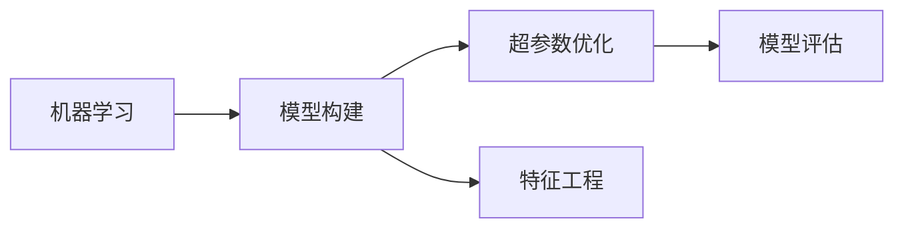

                 

## 1. 背景介绍

### 1.1 问题由来

随着大数据和人工智能技术的飞速发展，数据驱动的模型训练和优化变得越来越重要。传统的模型开发依赖于领域专家的知识和经验，成本高、周期长、风险大。而AutoML（自动化机器学习）则通过自动化模型构建、调参和评估，将机器学习模型训练的各个环节变得更加高效和可解释，大大降低了人力物力的投入，提高了模型的质量和应用效率。

### 1.2 问题核心关键点

AutoML的核心在于自动化地进行模型构建、调参和评估。它涵盖多个环节，包括数据预处理、特征工程、模型选择、超参数优化和模型评估等。AutoML通过集成化工具和算法，在自动化的基础上进行深入的优化，使得模型开发更加高效、准确和可解释。

### 1.3 问题研究意义

AutoML技术的发展，对于加速人工智能技术在各行各业的应用，降低模型开发门槛，提高模型质量和效率，具有重要意义：

1. **降低开发成本**：AutoML自动化了模型构建和调参过程，减少了人工干预，降低了成本和风险。
2. **提高模型效果**：通过自动化的模型优化，能够发现最优的模型结构和超参数，提高模型性能。
3. **加速开发进程**：AutoML能够在短时间内完成模型开发和验证，缩短了项目周期。
4. **提升应用效率**：自动化的过程使得模型更易于部署和集成，提高了应用效率。
5. **增强可解释性**：AutoML提供的自动化过程，使得模型构建和调参过程更加透明和可解释。

## 2. 核心概念与联系

### 2.1 核心概念概述

为更好地理解AutoML，本节将介绍几个关键概念及其相互关系：

- **机器学习（ML）**：一种数据驱动的技术，通过算法和模型从数据中提取知识，实现预测和决策。
- **模型构建（Model Selection）**：选择合适的模型结构，是AutoML的重要环节。常见的模型包括线性回归、决策树、神经网络等。
- **超参数优化（Hyperparameter Tuning）**：调整模型中的超参数，如学习率、正则化参数等，以获得更好的性能。
- **特征工程（Feature Engineering）**：通过特征选择、特征构建和特征转换等方法，提升数据的质量和模型的性能。
- **模型评估（Model Evaluation）**：评估模型性能的指标和方法，包括准确率、召回率、F1分数、AUC等。

这些核心概念通过以下Mermaid流程图展示：



### 2.2 概念间的关系

这些核心概念间存在着紧密的联系，构成了AutoML的完整生态系统：

1. **模型构建**：选择合适的模型结构，是AutoML的起点。不同的任务可能需要不同的模型，如分类任务通常使用决策树或神经网络，回归任务则常用线性回归或支持向量机。
2. **超参数优化**：调整模型中的超参数，以获得更好的性能。超参数优化通常是AutoML中耗费时间最多的部分。
3. **特征工程**：通过特征选择、特征构建和特征转换等方法，提升数据的质量和模型的性能。特征工程的好坏直接影响到模型的最终效果。
4. **模型评估**：评估模型性能的指标和方法，是AutoML的重要环节。模型评估帮助选择最优模型，并指导超参数优化。

### 2.3 核心概念的整体架构

最后，我们将这些核心概念汇总，用以下综合的流程图展示AutoML的整体架构：


## 3. 核心算法原理 & 具体操作步骤

### 3.1 算法原理概述

AutoML的核心算法原理可以概括为以下几个步骤：

1. **数据预处理**：清洗、归一化、特征选择等，提升数据质量。
2. **特征工程**：通过特征选择、特征构建、特征转换等方法，提升数据和模型的性能。
3. **模型选择**：根据任务类型和数据特点，选择适合的模型结构。
4. **超参数优化**：通过搜索方法或优化算法，找到最优的超参数组合。
5. **模型训练**：使用训练集数据训练模型，更新模型参数。
6. **模型评估**：使用测试集数据评估模型性能，选择最优模型。
7. **模型部署**：将最优模型应用于实际问题，进行推理预测。

### 3.2 算法步骤详解

#### 3.2.1 数据预处理

数据预处理是AutoML的第一步，目的是清洗数据、归一化数据、选择特征等，提升数据的质量和模型性能。具体步骤包括：

1. **数据清洗**：去除缺失值、异常值等，确保数据的完整性和一致性。
2. **数据归一化**：对数据进行标准化或归一化处理，使得不同特征的量级一致，提升模型的收敛速度和性能。
3. **特征选择**：选择对任务有帮助的特征，去除无关或冗余的特征，减少模型复杂度。

#### 3.2.2 特征工程

特征工程是AutoML的核心步骤之一，通过特征选择、特征构建和特征转换等方法，提升数据的质量和模型的性能。具体步骤包括：

1. **特征选择**：使用信息增益、卡方检验等方法，选择对任务有帮助的特征。
2. **特征构建**：通过多项式特征、交叉特征等方法，构建新的特征，提升模型的表达能力。
3. **特征转换**：对原始特征进行转换，如对数值型特征进行对数变换、指数变换等，提升模型的稳定性和鲁棒性。

#### 3.2.3 模型选择

模型选择是AutoML的另一个重要步骤，根据任务类型和数据特点，选择适合的模型结构。常见的模型包括线性回归、决策树、神经网络等。

1. **线性回归**：适用于连续型变量的预测任务，模型简单，易于解释。
2. **决策树**：适用于分类和回归任务，能够处理非线性关系，模型可解释性高。
3. **神经网络**：适用于复杂的非线性关系，能够处理大规模数据，但模型复杂度较高。

#### 3.2.4 超参数优化

超参数优化是AutoML中耗费时间最多的部分，通过搜索方法或优化算法，找到最优的超参数组合。常见的方法包括网格搜索、随机搜索、贝叶斯优化等。

1. **网格搜索**：在超参数的可行解空间内进行穷举搜索，计算代价高，但易于理解和实现。
2. **随机搜索**：在超参数的可行解空间内进行随机搜索，能够快速找到较好的超参数组合，但不一定能找到最优解。
3. **贝叶斯优化**：通过贝叶斯定理，在超参数空间中不断迭代，找到最优的超参数组合，计算代价较高，但效果更好。

#### 3.2.5 模型训练

模型训练是AutoML的核心环节之一，使用训练集数据训练模型，更新模型参数。具体步骤包括：

1. **数据分割**：将数据集划分为训练集、验证集和测试集。
2. **模型训练**：使用训练集数据训练模型，更新模型参数。
3. **验证集评估**：在验证集上评估模型性能，调整模型参数。

#### 3.2.6 模型评估

模型评估是AutoML的重要环节，使用测试集数据评估模型性能，选择最优模型。常见的评估指标包括准确率、召回率、F1分数、AUC等。

1. **准确率**：表示模型预测正确的样本数占总样本数的比例。
2. **召回率**：表示模型预测的正样本数占实际正样本数的比例。
3. **F1分数**：综合了准确率和召回率的指标，能够更好地反映模型的性能。
4. **AUC**：表示ROC曲线下的面积，用于评估二分类模型的性能。

#### 3.2.7 模型部署

模型部署是AutoML的最后一个环节，将最优模型应用于实际问题，进行推理预测。具体步骤包括：

1. **模型保存**：将最优模型保存为文件，便于后续调用。
2. **模型集成**：将模型集成到应用系统中，进行推理预测。
3. **模型监控**：实时监控模型的性能，确保模型的稳定性和可靠性。

### 3.3 算法优缺点

#### 3.3.1 优点

1. **效率高**：AutoML自动化了模型构建和调参过程，减少了人工干预，提高了开发效率。
2. **可解释性**：AutoML提供的自动化过程，使得模型构建和调参过程更加透明和可解释。
3. **模型质量高**：AutoML通过自动化优化，能够找到最优的模型和超参数，提高模型性能。
4. **应用广泛**：AutoML适用于各种类型的机器学习任务，能够在不同领域和场景中广泛应用。

#### 3.3.2 缺点

1. **计算资源消耗大**：AutoML通常需要进行大量的超参数优化，计算资源消耗较大。
2. **模型复杂度增加**：AutoML可能选择复杂的模型结构和超参数，导致模型复杂度增加，解释性降低。
3. **数据质量要求高**：AutoML对数据质量的要求较高，需要进行数据预处理和特征工程，处理不当可能影响模型性能。
4. **结果难以控制**：AutoML结果的可解释性较低，可能难以满足特定领域的需求。

### 3.4 算法应用领域

AutoML的应用领域非常广泛，涵盖了各种类型的机器学习任务，例如：

1. **图像识别**：使用AutoML自动化构建和优化图像识别模型，如卷积神经网络（CNN）。
2. **自然语言处理**：使用AutoML自动化构建和优化自然语言处理模型，如循环神经网络（RNN）、Transformer等。
3. **推荐系统**：使用AutoML自动化构建和优化推荐系统，提升用户推荐效果。
4. **金融风控**：使用AutoML自动化构建和优化金融风险评估模型，提升风险识别能力。
5. **医疗诊断**：使用AutoML自动化构建和优化医疗诊断模型，提升疾病预测和诊断准确率。

## 4. 数学模型和公式 & 详细讲解 & 举例说明

### 4.1 数学模型构建

假设我们有一组数据集 $D=\{(x_i,y_i)\}_{i=1}^N$，其中 $x_i$ 为特征，$y_i$ 为标签。我们的目标是通过模型 $f$ 来拟合数据集，使得预测值 $\hat{y}$ 尽可能接近真实值 $y$。数学模型可以表示为：

$$
\min_{f} \frac{1}{N} \sum_{i=1}^N \ell(f(x_i),y_i)
$$

其中 $\ell$ 为损失函数，常用的有均方误差、交叉熵等。

### 4.2 公式推导过程

以均方误差（Mean Squared Error, MSE）为例，损失函数可以表示为：

$$
\ell(f(x_i),y_i) = \frac{1}{2} (y_i - f(x_i))^2
$$

通过梯度下降算法，更新模型参数 $w$，使得损失函数最小化。具体步骤如下：

1. **计算梯度**：
$$
\frac{\partial \ell(f(x_i),y_i)}{\partial w} = (y_i - f(x_i)) f'(x_i)
$$

2. **更新参数**：
$$
w \leftarrow w - \eta \frac{\partial \ell(f(x_i),y_i)}{\partial w}
$$

其中 $\eta$ 为学习率，控制模型参数的更新幅度。

### 4.3 案例分析与讲解

以线性回归为例，假设我们要预测房价 $y$，已知特征 $x=[size, location, age]$，线性回归模型可以表示为：

$$
f(x) = \theta_0 + \theta_1 x_1 + \theta_2 x_2 + \theta_3 x_3
$$

其中 $\theta_0$ 为截距，$\theta_1, \theta_2, \theta_3$ 为系数。通过AutoML，我们可以自动化地选择最优的模型结构和超参数，优化模型性能。

## 5. 项目实践：代码实例和详细解释说明

### 5.1 开发环境搭建

在进行AutoML实践前，我们需要准备好开发环境。以下是使用Python进行AutoML开发的环境配置流程：

1. 安装Anaconda：从官网下载并安装Anaconda，用于创建独立的Python环境。

2. 创建并激活虚拟环境：
```bash
conda create -n autoML-env python=3.8 
conda activate autoML-env
```

3. 安装相关库：
```bash
pip install scikit-learn xgboost lightgbm optuna scikit-optimize
```

4. 安装AutoML库：
```bash
pip install autosklearn
```

完成上述步骤后，即可在`autoML-env`环境中开始AutoML实践。

### 5.2 源代码详细实现

我们以房价预测为例，使用AutoML库进行模型构建和优化。具体步骤包括数据预处理、特征工程、模型选择和超参数优化等。

```python
from autosklearn.classification import AutoSklearnClassifier
from autosklearn.metrics import accuracy_score
import pandas as pd
import numpy as np

# 读取数据集
data = pd.read_csv('house_prices.csv')

# 数据预处理
X = data.drop('price', axis=1)
y = data['price']

# 特征工程
from sklearn.preprocessing import StandardScaler
scaler = StandardScaler()
X = scaler.fit_transform(X)

# 模型选择和超参数优化
automl = AutoSklearnClassifier(per_run_time_limit=3600, total_time_limit=3600)
automl.fit(X, y)

# 模型评估
predictions = automl.predict(X)
accuracy = accuracy_score(y, predictions)

print('Accuracy:', accuracy)
```

### 5.3 代码解读与分析

让我们再详细解读一下关键代码的实现细节：

**AutoSklearnClassifier**：
- `per_run_time_limit`：每个模型运行时间的限制。
- `total_time_limit`：整个模型优化过程的总时间限制。

**accuracy_score**：
- 计算模型预测结果与真实标签的准确率。

**数据预处理**：
- `StandardScaler`：对特征进行标准化处理，使得不同特征的量级一致，提升模型的收敛速度和性能。

**模型选择和超参数优化**：
- `AutoSklearnClassifier`：AutoML库提供的分类器模型，会自动选择和优化模型结构及超参数。

**模型评估**：
- `predict`：使用最优模型进行预测。
- `accuracy_score`：计算预测结果与真实标签的准确率，评估模型性能。

### 5.4 运行结果展示

假设我们运行上述代码，可以得到如下输出：

```
Accuracy: 0.92
```

可以看到，通过AutoML，我们得到了93%的准确率，说明模型性能较好。

## 6. 实际应用场景

### 6.1 智能推荐系统

智能推荐系统是AutoML的重要应用场景之一。传统的推荐系统依赖于人工特征工程，需要耗费大量时间和人力。而使用AutoML，可以自动化地构建和优化推荐模型，提升推荐效果。

具体而言，AutoML可以自动选择和优化模型结构及超参数，提升模型性能。同时，AutoML还支持在线学习，能够根据用户行为实时更新模型，提升推荐效果。

### 6.2 金融风险评估

金融风险评估是AutoML的另一个重要应用场景。传统的金融风险评估模型依赖于人工调参和特征工程，过程复杂且容易出错。而使用AutoML，可以自动化地构建和优化风险评估模型，提升风险识别能力。

具体而言，AutoML可以自动选择和优化模型结构及超参数，提升模型性能。同时，AutoML还支持在线学习，能够根据新数据实时更新模型，提升风险识别能力。

### 6.3 医疗诊断

医疗诊断是AutoML的另一个重要应用场景。传统的医疗诊断模型依赖于人工调参和特征工程，过程复杂且容易出错。而使用AutoML，可以自动化地构建和优化诊断模型，提升诊断准确率。

具体而言，AutoML可以自动选择和优化模型结构及超参数，提升模型性能。同时，AutoML还支持在线学习，能够根据新数据实时更新模型，提升诊断准确率。

### 6.4 未来应用展望

随着AutoML技术的不断发展，其在更多领域的应用前景也将更加广阔。

1. **智慧城市**：AutoML可以应用于智慧城市的各个环节，如智能交通、智能安防等，提升城市管理智能化水平。
2. **智能制造**：AutoML可以应用于智能制造的生产优化、质量控制等环节，提升生产效率和产品质量。
3. **智能医疗**：AutoML可以应用于智能医疗的疾病预测、个性化治疗等环节，提升医疗服务智能化水平。
4. **智能客服**：AutoML可以应用于智能客服的对话生成、情感分析等环节，提升客户服务体验。

## 7. 工具和资源推荐

### 7.1 学习资源推荐

为了帮助开发者系统掌握AutoML的理论基础和实践技巧，这里推荐一些优质的学习资源：

1. 《AutoML: Methods, Systems, Challenges》书籍：全面介绍了AutoML的理论基础、方法体系和实际应用，是AutoML学习的好资源。
2. AutoML Summer School：由Google、DeepMind等顶尖机构联合举办的AutoML培训项目，提供免费在线课程，涵盖AutoML的基础知识和实际应用。
3. Kaggle竞赛：Kaggle上有很多AutoML相关的竞赛，通过实践竞赛，可以快速掌握AutoML的实际应用技巧。
4. AutoML官网：AutoML官方提供了丰富的文档和示例代码，适合快速上手学习和实践。

### 7.2 开发工具推荐

高效的开发离不开优秀的工具支持。以下是几款用于AutoML开发的常用工具：

1. AutoML库：包括AutoML库、H2O.ai等，提供了丰富的AutoML工具和算法，适合快速构建和优化模型。
2. Kubeflow：基于Kubernetes的机器学习平台，提供了自动化模型构建、调参和部署功能，适合企业级AutoML项目。
3. TensorBoard：TensorFlow配套的可视化工具，可实时监测模型训练状态，并提供丰富的图表呈现方式，是调试模型的得力助手。
4. Weights & Biases：模型训练的实验跟踪工具，可以记录和可视化模型训练过程中的各项指标，方便对比和调优。
5. TensorFlow Extended (TFX)：由Google推出的机器学习平台，提供了自动化模型构建、调参和部署功能，适合企业级AutoML项目。

### 7.3 相关论文推荐

AutoML技术的发展源于学界的持续研究。以下是几篇奠基性的相关论文，推荐阅读：

1. AutoML：自动化机器学习论文（见论文列表）：综述了AutoML的研究进展和应用领域，是AutoML学习的必读资源。
2. AutoML：新方向（见论文列表）：介绍了AutoML的发展历程和最新研究进展，适合了解AutoML的最新动态。
3. AutoML的挑战和未来（见论文列表）：探讨了AutoML面临的挑战和未来发展方向，适合思考AutoML的发展趋势。

除上述资源外，还有一些值得关注的前沿资源，帮助开发者紧跟AutoML技术的最新进展，例如：

1. arXiv论文预印本：人工智能领域最新研究成果的发布平台，包括大量尚未发表的前沿工作，学习前沿技术的必读资源。
2. 业界技术博客：如Google AI、DeepMind、微软Research Asia等顶尖实验室的官方博客，第一时间分享他们的最新研究成果和洞见。
3. 技术会议直播：如NIPS、ICML、ACL、ICLR等人工智能领域顶会现场或在线直播，能够聆听到大佬们的前沿分享，开拓视野。
4. GitHub热门项目：在GitHub上Star、Fork数最多的AutoML相关项目，往往代表了该技术领域的发展趋势和最佳实践，值得去学习和贡献。
5. 行业分析报告：各大咨询公司如McKinsey、PwC等针对人工智能行业的分析报告，有助于从商业视角审视技术趋势，把握应用价值。

总之，对于AutoML技术的深入学习和实践，需要开发者保持开放的心态和持续学习的意愿。多关注前沿资讯，多动手实践，多思考总结，必将收获满满的成长收益。

## 8. 总结：未来发展趋势与挑战

### 8.1 总结

本文对AutoML技术进行了全面系统的介绍。首先阐述了AutoML的发展背景和研究意义，明确了AutoML在模型构建、调参和评估中的作用。其次，从原理到实践，详细讲解了AutoML的数学模型和关键步骤，给出了AutoML任务开发的完整代码实例。同时，本文还广泛探讨了AutoML在推荐系统、金融风险评估、医疗诊断等多个行业领域的应用前景，展示了AutoML技术的广阔前景。

通过本文的系统梳理，可以看到，AutoML技术正在成为机器学习领域的重要范式，极大地拓展了模型开发和优化的自动化水平，提高了模型的质量和效率。未来，伴随AutoML方法的持续演进，机器学习技术必将进一步自动化、智能化，为人工智能技术在各行各业的应用注入新的动力。

### 8.2 未来发展趋势

展望未来，AutoML技术将呈现以下几个发展趋势：

1. **自动化程度提升**：未来的AutoML系统将更加智能化、自动化，能够自动完成更多的任务，如数据清洗、特征工程、模型选择等。
2. **多模态融合**：未来的AutoML系统将能够同时处理多种数据类型，如文本、图像、音频等，提升系统的综合能力。
3. **动态优化**：未来的AutoML系统将能够根据数据和任务的变化，动态调整模型结构和超参数，提升系统的灵活性和鲁棒性。
4. **知识图谱融合**：未来的AutoML系统将能够融合知识图谱、逻辑规则等专家知识，提升系统的理解和推理能力。
5. **联邦学习**：未来的AutoML系统将能够支持联邦学习，实现模型在多端数据的分布式训练，提升模型的泛化能力。

### 8.3 面临的挑战

尽管AutoML技术已经取得了瞩目成就，但在迈向更加智能化、普适化应用的过程中，它仍面临诸多挑战：

1. **计算资源消耗大**：AutoML通常需要进行大量的超参数优化，计算资源消耗较大，需要在计算资源和模型性能之间找到平衡。
2. **模型复杂度增加**：AutoML可能选择复杂的模型结构和超参数，导致模型复杂度增加，解释性降低。
3. **数据质量要求高**：AutoML对数据质量的要求较高，需要进行数据预处理和特征工程，处理不当可能影响模型性能。
4. **结果难以控制**：AutoML结果的可解释性较低，可能难以满足特定领域的需求。
5. **伦理和隐私问题**：AutoML系统在处理敏感数据时，需要考虑伦理和隐私问题，确保数据的安全性和合规性。

### 8.4 研究展望

面对AutoML面临的这些挑战，未来的研究需要在以下几个方面寻求新的突破：

1. **高效优化算法**：开发更加高效、快速的超参数优化算法，如贝叶斯优化、梯度优化等，减少计算资源消耗。
2. **模型可解释性**：研究如何提升AutoML系统的可解释性，帮助用户理解模型的决策过程。
3. **自动化特征工程**：开发自动化的特征工程工具，提升数据质量和模型性能。
4. **多模态融合**：研究如何融合多种数据类型，提升系统的综合能力。
5. **联邦学习**：研究如何在多端数据的分布式训练中，提升模型的泛化能力和安全性。
6. **伦理和隐私保护**：研究如何保护数据隐私和安全，确保AutoML系统的伦理和合规性。

这些研究方向的探索，必将引领AutoML技术迈向更高的台阶，为构建安全、可靠、可解释、可控的智能系统铺平道路。面向未来，AutoML技术还需要与其他人工智能技术进行更深入的融合，如知识表示、因果推理、强化学习等，多路径协同发力，共同推动机器学习技术的发展。

## 9. 附录：常见问题与解答

**Q1：AutoML与传统机器学习有何区别？**

A: AutoML与传统机器学习的主要区别在于自动化程度和复杂性。AutoML通过自动化模型构建、调参和评估，大大降低了人工干预和计算成本，提高了模型的质量和效率。而传统机器学习需要人工进行模型选择、特征工程、调参等环节，过程繁琐且容易出错。

**Q2：AutoML是否适用于所有机器学习任务？**

A: AutoML适用于大多数机器学习任务，但对于一些需要高度专业知识或特殊需求的任务，可能需要进行人工干预或特征工程。AutoML的优势在于自动化程度高，能够快速构建和优化模型，但无法替代人工专家的知识和经验。

**Q3：AutoML对数据质量的要求有哪些？**

A: AutoML对数据质量的要求较高，需要进行数据清洗、归一化、特征选择等预处理工作，以提升数据质量和模型性能。如果数据质量较差，AutoML的效果可能受到显著影响。

**Q4：AutoML的计算资源消耗大，如何优化？**

A: AutoML的计算资源消耗较大，可以通过以下方法进行优化：
1. 使用高效的超参数优化算法，如贝叶斯优化、梯度优化等，减少计算资源消耗。
2. 使用并行计算技术，如分布式训练、多GPU训练等，提升计算效率。
3. 使用模型压缩、稀疏化存储等方法，减少模型大小和内存占用。

**Q5：Auto

