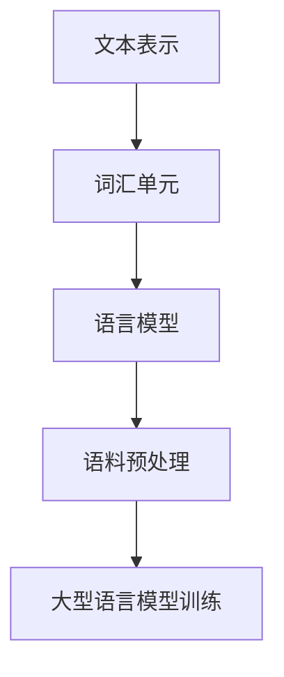

# 大语言模型原理与工程实践：手把手教你训练 7B 大语言模型 语料预处理

## 1. 背景介绍

### 1.1 问题的由来

随着人工智能技术的不断发展,大型语言模型在自然语言处理领域展现出了令人惊叹的能力。然而,训练一个高质量的大型语言模型需要大量的计算资源和海量的高质量语料数据。语料数据的质量直接影响着模型的性能表现,因此对语料进行适当的预处理是训练大型语言模型的关键环节之一。

### 1.2 研究现状

目前,主流的语料预处理方法包括文本清理、标记化、词形还原、词性标注、命名实体识别等。这些预处理步骤有助于提高语料的质量,但同时也增加了处理的复杂性。此外,不同的任务和领域可能需要采用不同的预处理策略,如何选择合适的预处理方法并将其有效集成是一个值得探讨的问题。

### 1.3 研究意义

本文旨在为读者提供一个全面的指南,介绍如何为训练大型语言模型(如7B参数量级)进行高质量的语料预处理。我们将详细讨论各种预处理技术的原理和实现方法,并提供实践案例供读者参考。通过本文的学习,读者将能够掌握语料预处理的核心概念和最佳实践,为训练高质量的大型语言模型奠定坚实的基础。

### 1.4 本文结构

本文首先介绍语料预处理的背景和重要性,然后详细阐述核心概念和算法原理。接下来,我们将深入探讨数学模型和公式推导,并通过案例分析加深理解。随后,我们将提供一个完整的项目实践,包括代码实现和运行结果展示。最后,我们将讨论实际应用场景、相关工具和资源,并总结未来发展趋势和挑战。

## 2. 核心概念与联系

语料预处理是自然语言处理领域的一个关键环节,它涉及多个核心概念,包括文本表示、词汇单元、语言模型等。下面我们将详细介绍这些概念及其相互关系。



1. **文本表示**:文本是自然语言处理的基础数据形式,需要将其转换为计算机可以理解和处理的数值表示形式。常见的文本表示方式包括One-Hot编码、Word Embedding等。

2. **词汇单元**:在文本表示的基础上,我们需要确定词汇单元的粒度,即将文本划分为最小的有意义的单元。常见的词汇单元包括字符、词、子词等。

3. **语言模型**:语言模型是自然语言处理的核心,它通过学习大量语料数据,捕捉语言的统计规律和上下文信息,从而对语言进行建模和预测。

4. **语料预处理**:为了提高语言模型的质量,我们需要对原始语料进行适当的预处理,包括文本清理、标记化、词形还原、词性标注等步骤,以提高语料的质量和一致性。

5. **大型语言模型训练**:经过语料预处理后,我们可以使用高质量的语料数据训练大型语言模型,以捕捉更加复杂和丰富的语言模式,从而提高模型的性能表现。

## 3. 核心算法原理 & 具体操作步骤

在本节中,我们将详细介绍语料预处理的核心算法原理和具体操作步骤。

### 3.1 算法原理概述

语料预处理算法的核心思想是通过一系列的文本处理操作,将原始语料转换为标准化、结构化的形式,以提高语料的质量和一致性。这些操作包括但不限于以下几个方面:

1. **文本清理**:去除无用的字符、标点符号、HTML标签等,并进行大小写统一、拼写纠正等处理。
2. **标记化**:将文本划分为最小的有意义的单元(如字符、词、子词等)。
3. **词形还原**:将不同的词形(如时态、复数等)归并为同一个基本形式。
4. **词性标注**:为每个词汇单元赋予相应的词性标记(如名词、动词等)。
5. **命名实体识别**:识别出文本中的命名实体(如人名、地名、组织机构名等)。

通过这些操作,我们可以将原始语料转换为结构化的形式,为后续的语言模型训练提供高质量的输入数据。

### 3.2 算法步骤详解

下面我们将详细介绍语料预处理算法的具体步骤:

1. **文本清理**
   - 去除HTML标签、特殊字符、无用标点符号等
   - 进行大小写统一、拼写纠正等处理
   - 使用正则表达式或其他文本处理工具实现

2. **标记化**
   - 基于空格、标点符号等分隔符将文本划分为词汇单元
   - 使用基于规则或基于统计的标记化工具,如NLTK、spaCy等
   - 处理特殊情况,如缩写、连字符等

3. **词形还原**
   - 将不同的词形(如时态、复数等)归并为同一个基本形式
   - 使用词形还原工具,如NLTK的PorterStemmer或LancasterStemmer
   - 考虑上下文信息,避免过度归并

4. **词性标注**
   - 为每个词汇单元赋予相应的词性标记(如名词、动词等)
   - 使用基于规则或基于统计的词性标注工具,如NLTK、spaCy等
   - 考虑上下文信息,提高标注准确性

5. **命名实体识别**
   - 识别出文本中的命名实体(如人名、地名、组织机构名等)
   - 使用基于规则或基于统计的命名实体识别工具,如spaCy、Stanford NER等
   - 考虑领域知识,提高识别准确性

在实际应用中,我们可以根据具体需求选择合适的预处理步骤,并将它们有机结合,以获得最佳的预处理效果。

### 3.3 算法优缺点

语料预处理算法具有以下优点:

1. 提高语料的质量和一致性,为后续的语言模型训练提供高质量的输入数据。
2. 减少噪声和冗余信息,提高模型的泛化能力。
3. 增强语言模型对特定领域或任务的适应性。

然而,语料预处理算法也存在一些缺点和挑战:

1. 预处理步骤可能会引入新的错误或噪声,影响最终的模型性能。
2. 不同的预处理步骤之间可能存在冲突或矛盾,需要进行权衡和调整。
3. 预处理算法的性能和效果受限于所使用的工具和资源的质量。
4. 对于特定领域或任务,可能需要设计和实现定制的预处理步骤。

### 3.4 算法应用领域

语料预处理算法广泛应用于自然语言处理的各个领域,包括但不限于:

1. **机器翻译**:对源语言和目标语言的语料进行预处理,提高翻译质量。
2. **文本分类**:对文本进行预处理,提高分类器的性能。
3. **信息检索**:对文档集合进行预处理,提高检索的准确性和效率。
4. **情感分析**:对社交媒体数据进行预处理,提高情感分析的准确性。
5. **对话系统**:对对话数据进行预处理,提高对话系统的自然语言理解能力。

总的来说,语料预处理是自然语言处理领域的一个关键环节,对于提高语言模型的质量和性能具有重要意义。

## 4. 数学模型和公式 & 详细讲解 & 举例说明

在本节中,我们将介绍与语料预处理相关的数学模型和公式,并通过详细的讲解和案例分析,加深读者对这些概念的理解。

### 4.1 数学模型构建

在语料预处理过程中,我们需要构建数学模型来描述和量化文本数据。常见的数学模型包括:

1. **词袋模型(Bag-of-Words)**

词袋模型是一种简单但有效的文本表示方法。它将文本表示为一个向量,其中每个维度对应一个词汇单元,向量的值表示该词汇单元在文本中出现的频率。

$$\text{BoW}(d) = (n_1, n_2, \ldots, n_V)$$

其中,$ n_i $表示第$ i $个词汇单元在文档$ d $中出现的次数,$ V $表示词汇表的大小。

2. **TF-IDF模型(Term Frequency-Inverse Document Frequency)**

TF-IDF模型是一种常用的加权词袋模型,它不仅考虑了词频,还考虑了词在整个语料中的重要性。

$$\text{TF-IDF}(t, d) = \text{TF}(t, d) \times \text{IDF}(t)$$

其中,$ \text{TF}(t, d) $表示词$ t $在文档$ d $中出现的频率,$ \text{IDF}(t) $表示词$ t $的逆文档频率,用于衡量词$ t $的重要性。

$$\text{IDF}(t) = \log \frac{N}{|\{d \in D: t \in d\}|}$$

其中,$ N $表示语料库中文档的总数,分母表示包含词$ t $的文档数量。

3. **Word Embedding模型**

Word Embedding模型通过将词汇单元映射到低维连续向量空间,捕捉词与词之间的语义和语法关系。常见的Word Embedding模型包括Word2Vec、GloVe等。

$$\text{Word2Vec}(w_t) = \frac{1}{T} \sum_{t=1}^T \log P(w_{t+j} | w_t)$$

其中,$ w_t $表示目标词,$ w_{t+j} $表示上下文窗口中的词,$ T $表示训练样本的总数。

这些数学模型为语料预处理提供了理论基础和量化工具,有助于更好地表示和处理文本数据。

### 4.2 公式推导过程

在本小节中,我们将详细推导TF-IDF模型的公式,以加深读者对该模型的理解。

首先,我们定义词频(Term Frequency)$ \text{TF}(t, d) $为词$ t $在文档$ d $中出现的次数,即:

$$\text{TF}(t, d) = \text{count}(t, d)$$

然而,仅仅考虑词频是不够的,因为一些常见词(如"the"、"and"等)在任何文档中都会出现很多次,但它们对于表示文档的主题意义并不大。因此,我们需要引入逆文档频率(Inverse Document Frequency)$ \text{IDF}(t) $来衡量词$ t $的重要性。

$ \text{IDF}(t) $的计算公式为:

$$\text{IDF}(t) = \log \frac{N}{|\{d \in D: t \in d\}|}$$

其中,$ N $表示语料库中文档的总数,分母表示包含词$ t $的文档数量。

我们可以看到,如果一个词在语料库中出现的文档数量越多,则它的$ \text{IDF} $值就越小,说明该词的重要性越低。相反,如果一个词在语料库中出现的文档数量越少,则它的$ \text{IDF} $值就越大,说明该词的重要性越高。

最后,我们将$ \text{TF} $和$ \text{IDF} $相结合,得到TF-IDF模型:

$$\text{TF-IDF}(t, d) = \text{TF}(t, d) \times \text{IDF}(t)$$

$ \text{TF-IDF}(t, d) $的值越大,表示词$ t $在文档$ d $中越重要。

通过上述推导,我们可以清楚地理解TF-IDF模型的原理和公式,为语料预处理提供了有力的数学支持。

### 4.3 案例分析与讲解

为了加深对数学模型和公式的理解,我们将通过一个具体的案例进行分析和讲解。

假设我们有一个包含5个文档的小型语料库,每个文档的内容如下:

```