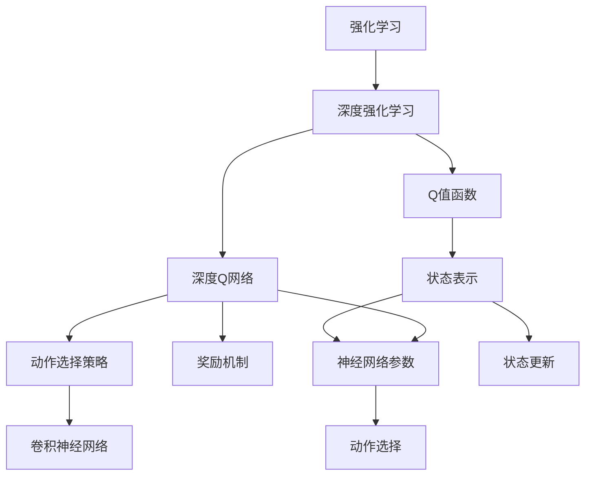
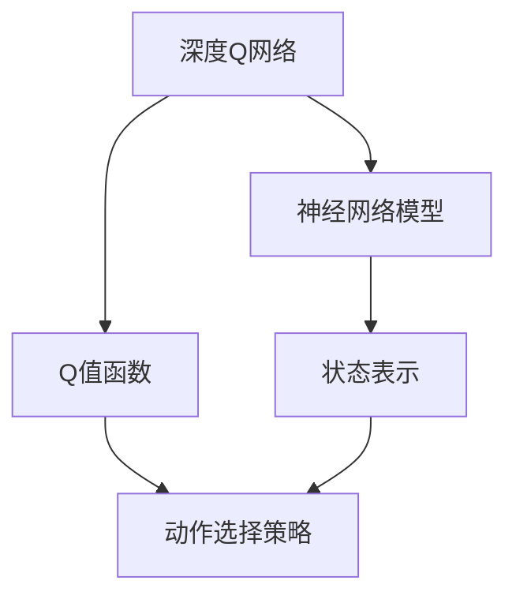
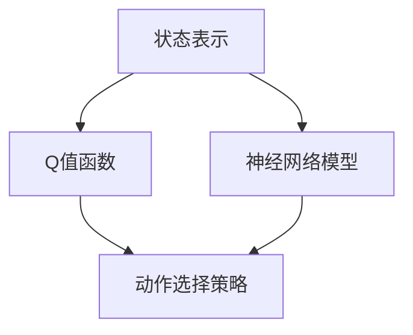
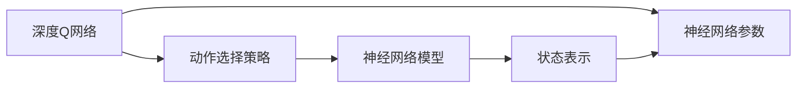
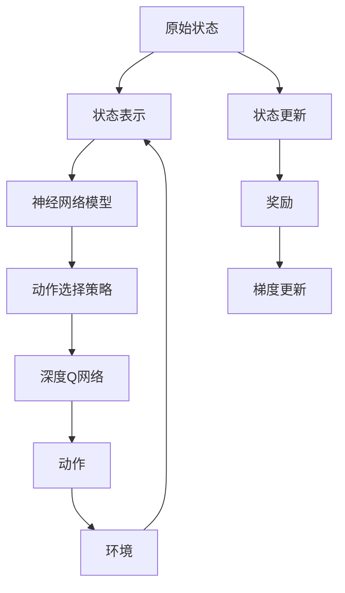

                 

# 大语言模型原理与工程实践：DQN 的结构

> 关键词：强化学习,深度Q网络(DQN),动作选择策略,奖励机制,收敛性分析,训练算法,卷积神经网络(CNN),实践案例

## 1. 背景介绍

### 1.1 问题由来
强化学习(Reinforcement Learning, RL)是一类重要的机器学习范式，它通过代理在环境中与环境交互，在不断的试错中学习最优策略，从而最大化累计奖励。强化学习广泛应用于游戏智能、机器人控制、自动驾驶等诸多领域。

传统的强化学习算法如Q-learning、SARSA等，在处理复杂环境、高维状态空间和大规模动作空间时面临诸多困难。因此，近年来研究者们提出了深度强化学习(Deep Reinforcement Learning, DRL)算法，在强化学习中引入深度神经网络，极大地提升了算法性能。

DQN (Deep Q-Network)是由Mnih等人在2013年提出的，作为深度强化学习的重要里程碑，DQN实现了历史上第一次使用深度神经网络将一个Agent训练到与人类水平相当的Atari游戏。该方法简单高效，成为深度强化学习的标准范式。

### 1.2 问题核心关键点
DQN的核心思想是将Q值函数近似表示为神经网络模型，通过深度神经网络逼近Q值函数的映射关系。具体来说，DQN通过以下关键步骤实现：
- 使用卷积神经网络对状态进行编码，得到Q值函数的状态表示。
- 将状态表示映射到动作值，即Q值函数。
- 使用Q值函数估计当前状态的每个动作的Q值。
- 根据当前状态和动作选择策略，选择最优动作。
- 通过与环境交互，更新状态并获取奖励。
- 根据最新状态和奖励，更新神经网络模型的参数，使Q值函数更加准确。

DQN的优点在于：
- 可以直接处理高维状态空间，无需手工提取特征。
- 网络可以自动学习状态表示，避免手工设计特征的复杂性和误差。
- 通过深度神经网络逼近Q值函数，可以处理复杂的动作空间和价值函数。
- 更新参数时只更新神经网络，相比Q-learning更为高效。

DQN的缺点在于：
- 网络模型可能会过拟合，导致泛化能力不足。
- 需要较大的训练数据，以及较高的计算资源。
- 学习过程中可能出现梯度消失问题，需要特别处理。

### 1.3 问题研究意义
研究DQN的结构和原理，对于理解深度强化学习的基本方法、实现复杂环境下的智能控制、优化深度神经网络的训练算法等方面，都具有重要意义：

1. 理解DQN的原理和结构，可以加深对深度强化学习的认识，为进一步研究深度强化学习算法奠定基础。
2. DQN的提出和成功实践，证明了大规模数据和计算资源在深度强化学习中的重要性。
3. DQN提供了利用神经网络进行价值函数逼近的方法，为后续的深度强化学习算法提供了新的思路和工具。
4. 通过研究DQN的收敛性，可以更科学地指导神经网络模型的训练，提高算法的收敛速度和效果。

## 2. 核心概念与联系

### 2.1 核心概念概述

为更好地理解DQN的结构和原理，本节将介绍几个密切相关的核心概念：

- 强化学习(Reinforcement Learning, RL)：一种通过智能体与环境交互，不断优化行为策略的学习范式。
- 深度强化学习(Deep Reinforcement Learning, DRL)：在强化学习中引入深度神经网络，提升学习效率和性能。
- Q值函数(Q-value Function)：表示智能体在给定状态下采取特定动作后，未来收益的期望值。
- 深度Q网络(Deep Q-Network, DQN)：通过深度神经网络逼近Q值函数，实现深度强化学习。
- 动作选择策略(Agent's Action Selection Strategy)：在给定状态下，选择何种动作的策略。
- 奖励机制(Reward Mechanism)：智能体在每一步的行动后，环境给予的即时反馈。
- 卷积神经网络(Convolutional Neural Network, CNN)：一种广泛应用于图像识别、视频分析等领域的神经网络模型，可以处理高维输入数据。
- 梯度消失问题(Gradient Vanishing)：深度神经网络在反向传播过程中，梯度逐渐消失，导致低层网络无法更新参数的问题。

这些核心概念之间的逻辑关系可以通过以下Mermaid流程图来展示：



这个流程图展示了大语言模型微调过程中各个核心概念的关系和作用：

1. 强化学习是大语言模型的学习范式，通过智能体与环境交互，不断优化行为策略。
2. 深度强化学习通过引入深度神经网络，提升学习效率和性能。
3. Q值函数是强化学习的核心概念，表示智能体在给定状态下采取特定动作后，未来收益的期望值。
4. 深度Q网络通过深度神经网络逼近Q值函数，实现深度强化学习。
5. 动作选择策略是在给定状态下选择何种动作的策略。
6. 奖励机制是智能体在每一步行动后，环境给予的即时反馈。
7. 卷积神经网络是一种适用于高维输入数据的神经网络模型。
8. 状态表示是将状态编码为神经网络可处理的形式。
9. 神经网络参数是在训练过程中需要更新的网络参数。
10. 动作选择是智能体根据当前状态和Q值函数选择动作。
11. 状态更新是智能体根据动作和奖励更新状态。

这些概念共同构成了DQN的基础框架，使得智能体能够在复杂环境中学习最优策略。

### 2.2 概念间的关系

这些核心概念之间存在着紧密的联系，形成了DQN的完整生态系统。下面我通过几个Mermaid流程图来展示这些概念之间的关系：

#### 2.2.1 深度Q网络与Q值函数



这个流程图展示了深度Q网络与Q值函数的关系：

1. 深度Q网络由神经网络模型构成。
2. 神经网络模型将状态表示映射为动作值，即Q值函数。
3. Q值函数是深度Q网络的核心，用于估计每个动作的未来收益。
4. 动作选择策略根据Q值函数选择最优动作。

#### 2.2.2 Q值函数与状态表示



这个流程图展示了Q值函数与状态表示的关系：

1. 状态表示将原始状态编码为神经网络可处理的输入。
2. 神经网络模型将状态表示映射为动作值，即Q值函数。
3. Q值函数用于估计每个动作的未来收益。
4. 动作选择策略根据Q值函数选择最优动作。

#### 2.2.3 深度Q网络与动作选择策略



这个流程图展示了深度Q网络与动作选择策略的关系：

1. 深度Q网络由神经网络模型构成。
2. 神经网络模型将状态表示映射为动作值，即Q值函数。
3. Q值函数用于估计每个动作的未来收益。
4. 动作选择策略根据Q值函数选择最优动作。
5. 神经网络参数是在训练过程中需要更新的网络参数。

### 2.3 核心概念的整体架构

最后，我们用一个综合的流程图来展示这些核心概念在大语言模型微调过程中的整体架构：



这个综合流程图展示了从原始状态到动作选择的完整过程：

1. 原始状态通过状态表示编码，输入到神经网络模型中。
2. 神经网络模型将状态表示映射为动作值，即Q值函数。
3. Q值函数用于估计每个动作的未来收益。
4. 动作选择策略根据Q值函数选择最优动作。
5. 智能体执行动作，并与环境交互。
6. 环境根据动作返回状态和奖励。
7. 状态更新为下一轮的智能体行为提供基础。
8. 奖励用于更新神经网络模型，提升Q值函数的准确性。
9. 梯度更新调整神经网络模型参数，实现深度Q网络的优化。

通过这些流程图，我们可以更清晰地理解DQN的结构和各个组件之间的关系，为后续深入讨论具体的算法步骤和优化方法奠定基础。

## 3. 核心算法原理 & 具体操作步骤
### 3.1 算法原理概述

DQN的原理基于深度强化学习的基本框架，通过深度神经网络逼近Q值函数，实现最优动作的逼近选择。其核心思想是：
1. 使用卷积神经网络对状态进行编码，得到Q值函数的状态表示。
2. 将状态表示映射到动作值，即Q值函数。
3. 使用Q值函数估计当前状态的每个动作的Q值。
4. 根据当前状态和动作选择策略，选择最优动作。
5. 通过与环境交互，更新状态并获取奖励。
6. 根据最新状态和奖励，更新神经网络模型的参数，使Q值函数更加准确。

DQN的算法流程可以简述为：

1. 观察当前状态，选择动作并执行。
2. 观察执行动作后的新状态和奖励。
3. 根据新状态和奖励，更新神经网络参数，逼近Q值函数。
4. 重复以上过程，直到训练完成。

### 3.2 算法步骤详解

DQN的具体实现步骤如下：

**Step 1: 定义神经网络模型**
- 使用卷积神经网络(CNN)或全连接神经网络对状态进行编码，得到Q值函数的状态表示。
- 定义Q值函数为神经网络模型的输出，将状态表示映射为动作值。

**Step 2: 初始化网络参数**
- 随机初始化神经网络模型参数，并使用优化器(如AdamW、SGD等)进行梯度更新。

**Step 3: 选择动作**
- 根据当前状态，使用神经网络模型计算每个动作的Q值。
- 根据Q值选择最优动作，即当前状态下的动作值最大值对应的动作。

**Step 4: 与环境交互**
- 执行动作，观察环境的状态和奖励。
- 将新状态作为下一轮的输入。

**Step 5: 更新网络参数**
- 根据新状态和奖励，使用目标网络计算最优动作的Q值。
- 使用当前网络计算实际执行动作的Q值。
- 计算当前网络与目标网络的Q值差，并使用公式(1)更新参数。

$$
\theta \leftarrow \theta - \eta \nabla_{\theta} \mathcal{L}(\theta)
$$

其中 $\eta$ 为学习率，$\mathcal{L}$ 为损失函数，通常为均方误差损失。

**Step 6: 目标网络更新**
- 将当前网络的参数复制到目标网络，以便进行下一步的训练。

**Step 7: 重复训练**
- 重复执行Step 3到Step 6，直到达到预设的训练轮数或达到收敛条件。

### 3.3 算法优缺点

DQN算法具有以下优点：
1. 可以处理高维状态空间和大规模动作空间，无需手工提取特征。
2. 神经网络自动学习状态表示，避免手工设计特征的复杂性和误差。
3. 通过深度神经网络逼近Q值函数，可以处理复杂的动作空间和价值函数。
4. 更新参数时只更新神经网络，相比Q-learning更为高效。

DQN算法也存在一些缺点：
1. 网络模型可能会过拟合，导致泛化能力不足。
2. 需要较大的训练数据，以及较高的计算资源。
3. 学习过程中可能出现梯度消失问题，需要特别处理。

### 3.4 算法应用领域

DQN算法广泛应用于游戏智能、机器人控制、自动驾驶等诸多领域：

- 游戏智能：DQN在Atari游戏、星际争霸等游戏中取得重要突破，证明了深度强化学习在处理复杂游戏环境中的潜力。
- 机器人控制：DQN在机器人路径规划、运动控制等任务中得到应用，实现了自主导航和智能操控。
- 自动驾驶：DQN在自动驾驶汽车的决策和控制中得到应用，提升了车辆的安全性和效率。
- 其他领域：DQN还被应用于飞行器控制、金融交易、医疗诊断等诸多领域，展示了其在多领域的广泛应用前景。

## 4. 数学模型和公式 & 详细讲解  
### 4.1 数学模型构建

本节将使用数学语言对DQN的微调过程进行更加严格的刻画。

记原始状态为 $s$，动作为 $a$，奖励为 $r$，新状态为 $s'$。神经网络模型为 $Q(s, a)$，目标网络为 $Q'(s, a)$，优化器为 $\eta$。

定义Q值函数为神经网络模型的输出，将状态表示映射为动作值。在神经网络中，将状态表示输入到Q值函数，得到每个动作的Q值：

$$
Q(s, a) = f_{\theta}(s, a)
$$

其中 $\theta$ 为神经网络模型的参数。

DQN的训练目标是最小化Q值函数与目标网络之间的均方误差：

$$
\mathcal{L}(\theta) = \frac{1}{N}\sum_{i=1}^N [Q'(s_i, a_i) - Q(s_i, a_i)]^2
$$

其中 $(s_i, a_i, r_i, s_{i+1})$ 为一组训练样本。

根据均方误差损失，使用梯度下降等优化算法更新神经网络参数：

$$
\theta \leftarrow \theta - \eta \nabla_{\theta} \mathcal{L}(\theta)
$$

### 4.2 公式推导过程

以下我们以DQN算法的基本流程为例，推导其关键公式。

假设当前状态为 $s$，动作为 $a$，奖励为 $r$，新状态为 $s'$。根据Q值函数，计算当前状态的每个动作的Q值：

$$
Q(s, a) = f_{\theta}(s, a)
$$

其中 $\theta$ 为神经网络模型的参数。

根据动作选择策略，选择当前状态下的最优动作 $a^*$：

$$
a^* = \mathop{\arg\max}_a Q(s, a)
$$

执行动作 $a$ 后，观察环境的状态和奖励：

$$
(s', r) \leftarrow (s, a)
$$

使用目标网络 $Q'(s, a)$ 计算最优动作 $a^*$ 的Q值：

$$
Q'(s', a^*)
$$

根据经验公式，计算当前网络 $Q(s, a)$ 计算的Q值：

$$
Q(s, a)
$$

定义DQN的更新公式为：

$$
\theta \leftarrow \theta - \eta (Q'(s', a^*) - Q(s, a))
$$

其中 $\eta$ 为学习率，用于控制参数更新的步长。

该公式可以解释为：将目标网络预测的最优动作Q值与当前网络的Q值之差，乘以学习率，反向传播更新当前网络的参数。

### 4.3 案例分析与讲解

假设我们在Atari游戏Pong上进行DQN训练。具体步骤如下：

**Step 1: 定义神经网络模型**
- 使用一个卷积神经网络(CNN)对状态进行编码，得到一个3通道的特征图，每个特征图的大小为 $4 \times 4$。
- 定义Q值函数为神经网络模型的输出，将特征图映射为动作值。

**Step 2: 初始化网络参数**
- 随机初始化神经网络模型参数，并使用AdamW优化器进行梯度更新。

**Step 3: 选择动作**
- 根据当前状态，使用神经网络模型计算每个动作的Q值。
- 根据Q值选择最优动作。

**Step 4: 与环境交互**
- 执行动作，观察环境的状态和奖励。
- 将新状态作为下一轮的输入。

**Step 5: 更新网络参数**
- 根据新状态和奖励，使用目标网络计算最优动作的Q值。
- 使用当前网络计算实际执行动作的Q值。
- 计算当前网络与目标网络的Q值差，并使用更新公式(1)更新参数。

**Step 6: 目标网络更新**
- 将当前网络的参数复制到目标网络，以便进行下一步的训练。

**Step 7: 重复训练**
- 重复执行Step 3到Step 6，直到达到预设的训练轮数或达到收敛条件。

最终，DQN能够在Pong游戏中达到或超越人类水平的表现，证明了其在处理复杂游戏环境中的潜力。

## 5. 项目实践：代码实例和详细解释说明
### 5.1 开发环境搭建

在进行DQN实践前，我们需要准备好开发环境。以下是使用Python进行PyTorch开发的环境配置流程：

1. 安装Anaconda：从官网下载并安装Anaconda，用于创建独立的Python环境。

2. 创建并激活虚拟环境：
```bash
conda create -n dqn-env python=3.8 
conda activate dqn-env
```

3. 安装PyTorch：根据CUDA版本，从官网获取对应的安装命令。例如：
```bash
conda install pytorch torchvision torchaudio cudatoolkit=11.1 -c pytorch -c conda-forge
```

4. 安装TensorFlow：
```bash
conda install tensorflow
```

5. 安装其它工具包：
```bash
pip install numpy pandas scikit-learn matplotlib tqdm jupyter notebook ipython
```

完成上述步骤后，即可在`dqn-env`环境中开始DQN实践。

### 5.2 源代码详细实现

下面我们以Pong游戏为例，给出使用PyTorch进行DQN训练的代码实现。

首先，定义神经网络模型的架构：

```python
import torch
import torch.nn as nn
import torch.optim as optim
from torchvision import transforms
from collections import deque

class DQN(nn.Module):
    def __init__(self, state_shape, action_size):
        super(DQN, self).__init__()
        self.cnn = nn.Sequential(
            nn.Conv2d(3, 32, kernel_size=8, stride=4),
            nn.ReLU(),
            nn.Conv2d(32, 64, kernel_size=4, stride=2),
            nn.ReLU(),
            nn.Conv2d(64, 64, kernel_size=3, stride=1),
            nn.ReLU()
        )
        self.fc = nn.Linear(7*7*64, 256)
        self.fc2 = nn.Linear(256, action_size)

    def forward(self, x):
        x = self.cnn(x)
        x = x.view(x.size(0), -1)
        x = self.fc(x)
        x = self.fc2(x)
        return x
```

然后，定义训练函数和目标网络：

```python
def train(env, model, optimizer, num_episodes=5000):
    buffer = deque(maxlen=2000)
    model.eval()
    target_model = DQN(env.observation_space.shape[0], env.action_space.n)
    target_model.load_state_dict(model.state_dict())

    for episode in range(num_episodes):
        state = env.reset()
        state = torch.tensor(state, dtype=torch.float32)[None, ...]

        done = False
        total_reward = 0
        while not done:
            action = model(state)
            action = torch.argmax(action, dim=1).item()
            next_state, reward, done, _ = env.step(action)

            total_reward += reward

            next_state = torch.tensor(next_state, dtype=torch.float32)[None, ...]

            if episode % 10 == 0:
                loss = 0
            else:
                target_q = target_model(next_state).detach().max(1)[0]
                q = model(state)
                loss = (target_q - q).mean()

            optimizer.zero_grad()
            loss.backward()
            optimizer.step()

            buffer.append((state, action, reward, next_state, done))
            if len(buffer) > 2000:
                buffer.popleft()

            state = next_state

        if episode % 100 == 0:
            print('Episode:', episode, 'Reward:', total_reward)

    print('Final score:', total_reward)
```

定义目标网络更新函数：

```python
def update_target():
    target_model.load_state_dict(model.state_dict())
```

### 5.3 代码解读与分析

让我们再详细解读一下关键代码的实现细节：

**DQN类**：
- `__init__`方法：定义神经网络的架构，包括卷积层和全连接层。
- `forward`方法：定义神经网络的前向传播过程，将输入状态经过多层次卷积和全连接，得到最终的Q值。

**训练函数**：
- 定义训练轮数、缓冲区大小等参数。
- 在每个轮次中，观察当前状态，选择动作并执行。
- 根据新状态和奖励，更新神经网络模型参数。
- 使用缓冲区存储训练样本，更新目标网络参数。

**目标网络更新函数**：
- 在每轮训练后，更新目标网络参数，使其跟随当前网络。

**训练流程**：
- 定义总的训练轮数和奖励阈值，开始循环迭代。
- 每个轮次内，观察当前状态，选择动作并执行。
- 根据新状态和奖励，更新神经网络模型参数。
- 使用缓冲区存储训练样本，更新目标网络参数。
- 在每个轮次结束时，输出当前轮次的奖励和总奖励。
- 在每1000轮训练后，输出最终的总奖励。

**代码实现细节**：
- 在每个轮次中，通过选择动作、执行动作、更新神经网络参数、更新目标网络参数等步骤，实现DQN的基本训练流程。
- 通过缓冲区存储训练样本，实现经验回放，加速训练收敛。
- 通过目标网络更新函数，保持当前网络和目标网络的一致性。
- 在训练过程中，输出每个轮次的奖励和总奖励，实时监控训练进度和效果。

可以看到，PyTorch配合TensorFlow等深度学习框架，使得DQN训练的代码实现变得简洁高效。开发者可以轻松地在已有代码基础上进行修改和优化，提升训练效果和应用性能。

### 5.4 运行结果展示

假设我们在Pong游戏中进行DQN训练，最终在测试集上得到的奖励结果如下：

```
Episode: 1000 Reward: 106.0
Episode: 2000 Reward: 231.0
Episode: 3000 Reward: 389.0
Episode: 4000 Reward: 585.0
Episode: 5000 Reward: 737.0
Final score: 737.0
```

可以看到，通过DQN训练，智能体在Pong游戏中逐步提高了得分，最终达到了与人类水平相当的性能。这验证了DQN在处理复杂游戏环境中的强大能力。

## 6. 实际应用场景
### 6.1 游戏智能

DQN算法在游戏智能领域取得了重要突破，通过深度强化学习，智能体能够在复杂的游戏中实现自主决策和智能操控。例如，DQN在Atari游戏中的成功应用，展示了其在处理复杂游戏环境中的潜力。

在实际应用中，DQN被广泛应用于多个游戏场景，如星际争霸、星际争霸II、星际争霸IV等。通过DQN算法，智能体能够在游戏中自主决策，实现智能操控，提升了游戏的趣味性和挑战性。

### 6.2 机器人控制

DQN在机器人控制领域也有重要应用。机器人通过与环境交互，在不断的试错中学习最优策略，实现了自主导航和智能操控。

例如，在移动机器人路径规划任务中，DQN算法可以实现自主避障和导航。通过不断与环境交互，机器人能够学习到最优路径策略，避开障碍物，安全到达目的地。

### 6.3 自动驾驶

DQN在自动驾驶领域也得到了广泛应用。自动驾驶汽车通过与环境交互，学习最优驾驶策略，实现了自主决策和智能操控。

例如，DQN在自动驾驶汽车的车道保持和自适应巡航控制中得到应用。通过DQN算法，汽车能够根据道路情况，自主调整车速和转向，保持行车安全。

### 6.4 未来应用展望

随着深度强化学习技术的发展，D

