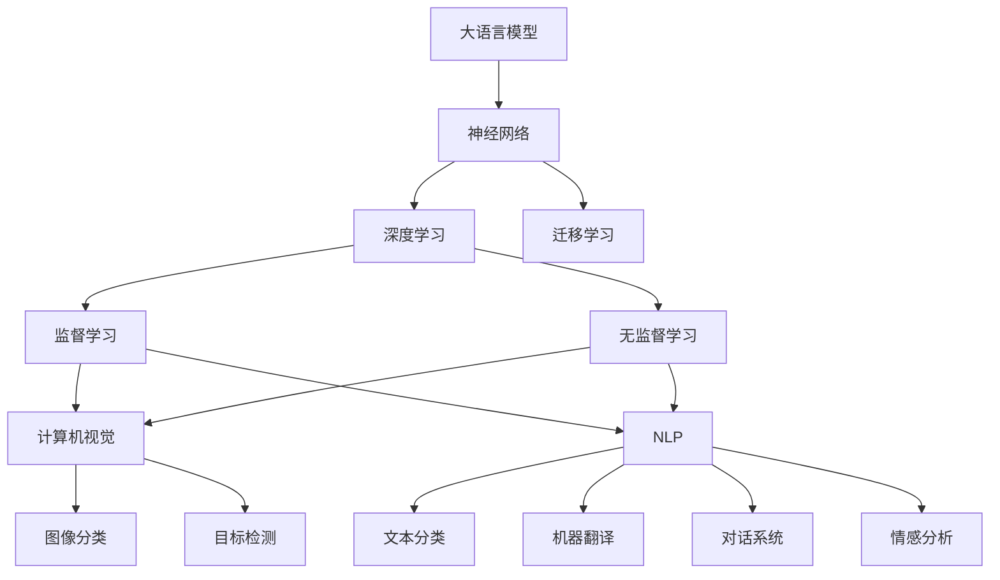
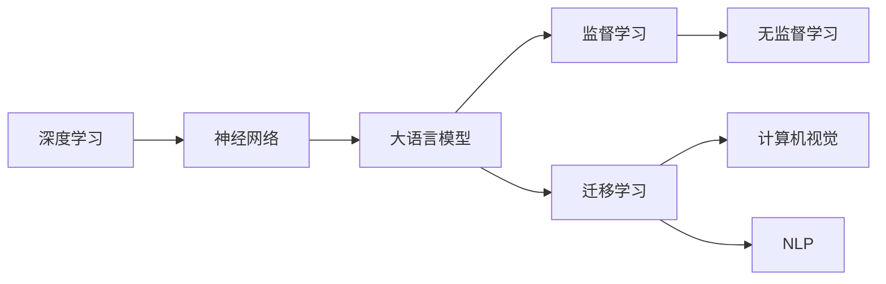
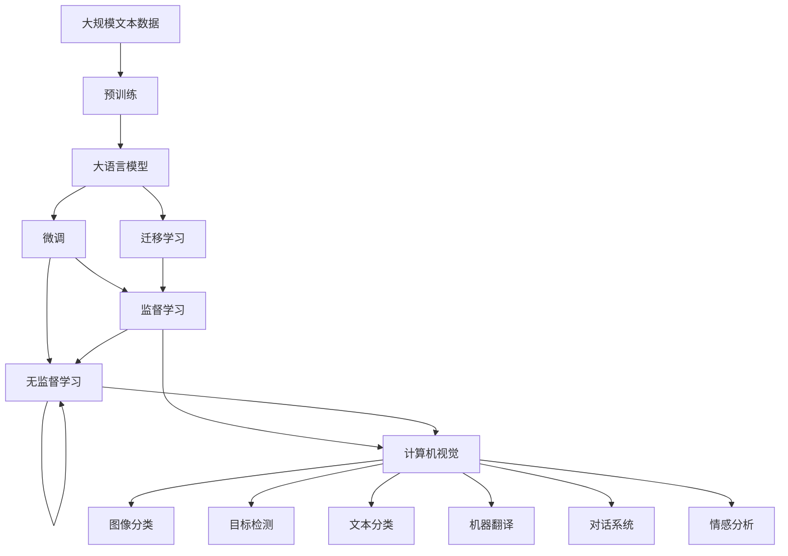

                 

# 大语言模型应用指南：神经网络基础

> 关键词：大语言模型,神经网络,机器学习,深度学习,迁移学习,迁移学习,监督学习,无监督学习,超参数优化,超参数调优,计算机视觉,自然语言处理,NLP,图像处理,语音识别

## 1. 背景介绍

### 1.1 问题由来
随着深度学习技术的不断发展，深度神经网络在计算机视觉、自然语言处理、语音识别等领域的广泛应用，大语言模型大放异彩。大语言模型通过在海量无标签文本数据上进行预训练，学习到丰富的语言知识和常识，具备强大的语言理解和生成能力，并在下游任务中进行微调，取得优异的性能。

然而，大语言模型往往需要大量的训练数据和计算资源，预训练过程复杂耗时，模型规模庞大，难以直接应用于各种具体的NLP任务。因此，需要掌握大语言模型的基本原理和应用方法，才能在实际应用中发挥其潜力和优势。

### 1.2 问题核心关键点
本文将深入探讨大语言模型的基本原理和应用方法，详细介绍神经网络的理论基础和实践技巧，为读者提供完整的大语言模型应用指南，帮助其在实际应用中高效、准确地使用大语言模型。

## 2. 核心概念与联系

### 2.1 核心概念概述

为更好地理解大语言模型的应用方法，本节将介绍几个关键概念：

- 大语言模型(Large Language Model, LLM)：以自回归(如GPT)或自编码(如BERT)模型为代表的大规模预训练语言模型。通过在大规模无标签文本数据上进行预训练，学习通用的语言表示，具备强大的语言理解和生成能力。

- 神经网络(Neural Network)：由大量人工神经元相互连接组成的计算模型，通过反向传播算法进行优化，在多种任务上取得良好表现。

- 深度学习(Deep Learning)：利用深度神经网络进行学习，通常使用多个层次的神经元来实现对复杂数据的处理。

- 迁移学习(Transfer Learning)：指将一个领域学习到的知识，迁移应用到另一个不同但相关的领域的学习范式。大模型的预训练-微调过程即是一种典型的迁移学习方式。

- 监督学习(Supervised Learning)：使用有标签的数据进行模型训练，使得模型能够根据输入数据和标签进行预测。

- 无监督学习(Unsupervised Learning)：不使用标签进行模型训练，主要利用数据本身的内在结构和规律进行学习。

- 超参数优化(Hyperparameter Optimization)：通过调整模型的超参数，如学习率、批大小等，来优化模型性能。

- 计算机视觉(Computer Vision)：研究如何让计算机识别、理解和生成图像信息，包括图像分类、目标检测、语义分割等任务。

- 自然语言处理(Natural Language Processing, NLP)：研究如何让计算机处理和理解人类语言，包括文本分类、机器翻译、情感分析、对话系统等任务。

这些概念之间的联系可以通过以下Mermaid流程图来展示：



这个流程图展示了各个概念之间的联系：

1. 大语言模型基于神经网络，主要应用于自然语言处理领域。
2. 深度学习是神经网络的一种形式，能够处理复杂数据。
3. 迁移学习和大语言模型的预训练-微调过程紧密相关。
4. 监督学习和无监督学习是模型训练的两种主要方式。
5. 计算机视觉和自然语言处理是神经网络在视觉和语言处理领域的主要应用。

### 2.2 概念间的关系

这些核心概念之间的关系可以通过以下Mermaid流程图来展示：



这个流程图展示了深度学习、神经网络、大语言模型、监督学习、无监督学习和迁移学习之间的联系。深度学习和大语言模型都是神经网络的一种形式，而监督学习、无监督学习是模型训练的两种方式，迁移学习是大语言模型预训练-微调的重要方法。

### 2.3 核心概念的整体架构

最后，我们用一个综合的流程图来展示这些核心概念在大语言模型应用过程中的整体架构：



这个综合流程图展示了从预训练到微调，再到迁移学习的完整过程。大语言模型首先在大规模文本数据上进行预训练，然后通过微调（包括监督学习和无监督学习）和迁移学习，适应各种下游任务。

## 3. 核心算法原理 & 具体操作步骤
### 3.1 算法原理概述

大语言模型的应用过程中，核心算法原理主要是基于神经网络的迁移学习。具体来说，大语言模型通过在大规模无标签文本数据上进行预训练，学习通用的语言表示。预训练过程通常是使用自监督学习任务，如掩码语言模型、相对位置预测等，使得模型能够理解语言的基本结构。

在预训练完成后，大语言模型通过微调过程，适应特定的下游任务。微调过程中，模型在带有标签的训练数据上进行有监督学习，使得模型能够根据输入数据和标签进行预测，输出期望的结果。

### 3.2 算法步骤详解

大语言模型的应用过程主要包括以下几个步骤：

**Step 1: 准备预训练模型和数据集**
- 选择合适的预训练语言模型 $M_{\theta}$ 作为初始化参数，如 BERT、GPT 等。
- 准备下游任务 $T$ 的标注数据集 $D$，划分为训练集、验证集和测试集。一般要求标注数据与预训练数据的分布不要差异过大。

**Step 2: 添加任务适配层**
- 根据任务类型，在预训练模型顶层设计合适的输出层和损失函数。
- 对于分类任务，通常在顶层添加线性分类器和交叉熵损失函数。
- 对于生成任务，通常使用语言模型的解码器输出概率分布，并以负对数似然为损失函数。

**Step 3: 设置微调超参数**
- 选择合适的优化算法及其参数，如 AdamW、SGD 等，设置学习率、批大小、迭代轮数等。
- 设置正则化技术及强度，包括权重衰减、Dropout、Early Stopping 等。
- 确定冻结预训练参数的策略，如仅微调顶层，或全部参数都参与微调。

**Step 4: 执行梯度训练**
- 将训练集数据分批次输入模型，前向传播计算损失函数。
- 反向传播计算参数梯度，根据设定的优化算法和学习率更新模型参数。
- 周期性在验证集上评估模型性能，根据性能指标决定是否触发 Early Stopping。
- 重复上述步骤直到满足预设的迭代轮数或 Early Stopping 条件。

**Step 5: 测试和部署**
- 在测试集上评估微调后模型 $M_{\hat{\theta}}$ 的性能，对比微调前后的精度提升。
- 使用微调后的模型对新样本进行推理预测，集成到实际的应用系统中。
- 持续收集新的数据，定期重新微调模型，以适应数据分布的变化。

以上是基于神经网络的迁移学习在大语言模型应用过程中的具体操作步骤。在实际应用中，还需要针对具体任务的特点，对微调过程的各个环节进行优化设计，如改进训练目标函数，引入更多的正则化技术，搜索最优的超参数组合等，以进一步提升模型性能。

### 3.3 算法优缺点

大语言模型的应用过程具有以下优点：

- 简单高效。只需准备少量标注数据，即可对预训练模型进行快速适配，获得较大的性能提升。
- 通用适用。适用于各种NLP下游任务，包括分类、匹配、生成等，设计简单的任务适配层即可实现微调。
- 参数高效。利用参数高效微调技术，在固定大部分预训练参数的情况下，仍可取得不错的提升。
- 效果显著。在学术界和工业界的诸多任务上，基于微调的方法已经刷新了最先进的性能指标。

同时，该方法也存在一定的局限性：

- 依赖标注数据。微调的效果很大程度上取决于标注数据的质量和数量，获取高质量标注数据的成本较高。
- 迁移能力有限。当目标任务与预训练数据的分布差异较大时，微调的性能提升有限。
- 负面效果传递。预训练模型的固有偏见、有害信息等，可能通过微调传递到下游任务，造成负面影响。
- 可解释性不足。微调模型的决策过程通常缺乏可解释性，难以对其推理逻辑进行分析和调试。

尽管存在这些局限性，但就目前而言，基于神经网络的迁移学习方法是应用最广泛、效果最显著的大语言模型微调范式。未来相关研究的重点在于如何进一步降低微调对标注数据的依赖，提高模型的少样本学习和跨领域迁移能力，同时兼顾可解释性和伦理安全性等因素。

### 3.4 算法应用领域

基于大语言模型迁移学习的方法，在NLP领域已经得到了广泛的应用，覆盖了几乎所有常见任务，例如：

- 文本分类：如情感分析、主题分类、意图识别等。通过微调使模型学习文本-标签映射。
- 命名实体识别：识别文本中的人名、地名、机构名等特定实体。通过微调使模型掌握实体边界和类型。
- 关系抽取：从文本中抽取实体之间的语义关系。通过微调使模型学习实体-关系三元组。
- 问答系统：对自然语言问题给出答案。将问题-答案对作为微调数据，训练模型学习匹配答案。
- 机器翻译：将源语言文本翻译成目标语言。通过微调使模型学习语言-语言映射。
- 文本摘要：将长文本压缩成简短摘要。将文章-摘要对作为微调数据，使模型学习抓取要点。
- 对话系统：使机器能够与人自然对话。将多轮对话历史作为上下文，微调模型进行回复生成。

除了上述这些经典任务外，大语言模型迁移学习也被创新性地应用到更多场景中，如可控文本生成、常识推理、代码生成、数据增强等，为NLP技术带来了全新的突破。随着预训练模型和迁移学习方法的不断进步，相信NLP技术将在更广阔的应用领域大放异彩。

## 4. 数学模型和公式 & 详细讲解  
### 4.1 数学模型构建

本节将使用数学语言对大语言模型的迁移学习过程进行更加严格的刻画。

记预训练语言模型为 $M_{\theta}$，其中 $\theta$ 为预训练得到的模型参数。假设微调任务的训练集为 $D=\{(x_i,y_i)\}_{i=1}^N, x_i \in \mathcal{X}, y_i \in \mathcal{Y}$。

定义模型 $M_{\theta}$ 在输入 $x$ 上的输出为 $\hat{y}=M_{\theta}(x) \in [0,1]$，表示样本属于正类的概率。真实标签 $y \in \{0,1\}$。则二分类交叉熵损失函数定义为：

$$
\ell(M_{\theta}(x),y) = -[y\log \hat{y} + (1-y)\log (1-\hat{y})]
$$

将其代入经验风险公式，得：

$$
\mathcal{L}(\theta) = \frac{1}{N}\sum_{i=1}^N \ell(M_{\theta}(x_i),y_i)
$$

在实践中，我们通常使用基于梯度的优化算法（如SGD、Adam等）来近似求解上述最优化问题。设 $\eta$ 为学习率，$\lambda$ 为正则化系数，则参数的更新公式为：

$$
\theta \leftarrow \theta - \eta \nabla_{\theta}\mathcal{L}(\theta) - \eta\lambda\theta
$$

其中 $\nabla_{\theta}\mathcal{L}(\theta)$ 为损失函数对参数 $\theta$ 的梯度，可通过反向传播算法高效计算。

### 4.2 公式推导过程

以下我们以二分类任务为例，推导交叉熵损失函数及其梯度的计算公式。

假设模型 $M_{\theta}$ 在输入 $x$ 上的输出为 $\hat{y}=M_{\theta}(x) \in [0,1]$，表示样本属于正类的概率。真实标签 $y \in \{0,1\}$。则二分类交叉熵损失函数定义为：

$$
\ell(M_{\theta}(x),y) = -[y\log \hat{y} + (1-y)\log (1-\hat{y})]
$$

将其代入经验风险公式，得：

$$
\mathcal{L}(\theta) = \frac{1}{N}\sum_{i=1}^N [y_i\log M_{\theta}(x_i)+(1-y_i)\log(1-M_{\theta}(x_i))]
$$

根据链式法则，损失函数对参数 $\theta_k$ 的梯度为：

$$
\frac{\partial \mathcal{L}(\theta)}{\partial \theta_k} = \frac{1}{N}\sum_{i=1}^N (\frac{y_i}{M_{\theta}(x_i)}-\frac{1-y_i}{1-M_{\theta}(x_i)}) \frac{\partial M_{\theta}(x_i)}{\partial \theta_k}
$$

其中 $\frac{\partial M_{\theta}(x_i)}{\partial \theta_k}$ 可进一步递归展开，利用自动微分技术完成计算。

在得到损失函数的梯度后，即可带入参数更新公式，完成模型的迭代优化。重复上述过程直至收敛，最终得到适应下游任务的最优模型参数 $\theta^*$。

## 5. 项目实践：代码实例和详细解释说明
### 5.1 开发环境搭建

在进行迁移学习实践前，我们需要准备好开发环境。以下是使用Python进行TensorFlow开发的环境配置流程：

1. 安装Anaconda：从官网下载并安装Anaconda，用于创建独立的Python环境。

2. 创建并激活虚拟环境：
```bash
conda create -n tensorflow-env python=3.8 
conda activate tensorflow-env
```

3. 安装TensorFlow：根据CUDA版本，从官网获取对应的安装命令。例如：
```bash
conda install tensorflow
```

4. 安装各类工具包：
```bash
pip install numpy pandas scikit-learn matplotlib tqdm jupyter notebook ipython
```

完成上述步骤后，即可在`tensorflow-env`环境中开始迁移学习实践。

### 5.2 源代码详细实现

下面我们以命名实体识别(NER)任务为例，给出使用TensorFlow对BERT模型进行迁移学习的PyTorch代码实现。

首先，定义NER任务的数据处理函数：

```python
import tensorflow as tf
from tensorflow.keras.preprocessing.text import Tokenizer
from tensorflow.keras.preprocessing.sequence import pad_sequences
from tensorflow.keras.layers import Embedding, LSTM, Dense, Bidirectional
from tensorflow.keras.models import Sequential

class NERDataset(tf.keras.preprocessing.dataset.Dataset):
    def __init__(self, texts, tags, tokenizer, max_len=128):
        self.texts = texts
        self.tags = tags
        self.tokenizer = tokenizer
        self.max_len = max_len
        
    def __len__(self):
        return len(self.texts)
    
    def __getitem__(self, item):
        text = self.texts[item]
        tags = self.tags[item]
        
        tokenizer = self.tokenizer
        tokenized = tokenizer.texts_to_sequences([text])
        padded = pad_sequences(tokenized, maxlen=self.max_len, padding='post', truncating='post')
        
        # 对token-wise的标签进行编码
        encoded_tags = [tag2id[tag] for tag in tags] 
        encoded_tags.extend([tag2id['O']] * (self.max_len - len(encoded_tags)))
        labels = tf.convert_to_tensor(encoded_tags, dtype=tf.int32)
        
        return {'text': padded, 'labels': labels}

# 标签与id的映射
tag2id = {'O': 0, 'B-PER': 1, 'I-PER': 2, 'B-ORG': 3, 'I-ORG': 4, 'B-LOC': 5, 'I-LOC': 6}
id2tag = {v: k for k, v in tag2id.items()}

# 创建dataset
tokenizer = Tokenizer()
tokenizer.fit_on_texts(train_texts)
train_dataset = NERDataset(train_texts, train_tags, tokenizer, max_len=128)
dev_dataset = NERDataset(dev_texts, dev_tags, tokenizer, max_len=128)
test_dataset = NERDataset(test_texts, test_tags, tokenizer, max_len=128)
```

然后，定义模型和优化器：

```python
from tensorflow.keras.optimizers import AdamW
from tensorflow.keras.metrics import CategoricalAccuracy

model = Sequential()
model.add(Embedding(len(tokenizer.word_index)+1, 128, input_length=128))
model.add(LSTM(64))
model.add(Dense(6, activation='softmax'))
model.compile(loss=tf.keras.losses.SparseCategoricalCrossentropy(from_logits=True),
              optimizer=AdamW(learning_rate=2e-5, epsilon=1e-08, clipnorm=1.0),
              metrics=[CategoricalAccuracy()])
```

接着，定义训练和评估函数：

```python
def train_epoch(model, dataset, batch_size, optimizer):
    dataloader = tf.keras.utils.data.make_dataset(dataset)
    model.trainable = True
    for x, y in dataloader:
        with tf.GradientTape() as tape:
            logits = model(x)
            loss = tf.keras.losses.SparseCategoricalCrossentropy()(labels=y, logits=logits)
            grads = tape.gradient(loss, model.trainable_variables)
        optimizer.apply_gradients(zip(grads, model.trainable_variables))
        model.trainable = False

def evaluate(model, dataset, batch_size):
    dataloader = tf.keras.utils.data.make_dataset(dataset)
    model.trainable = True
    correct = 0
    for x, y in dataloader:
        logits = model(x)
        predictions = tf.argmax(logits, axis=-1)
        correct += tf.reduce_sum(tf.cast(tf.math.equal(predictions, y), tf.int32))
    return correct / len(dataset)
```

最后，启动训练流程并在测试集上评估：

```python
epochs = 5
batch_size = 16

for epoch in range(epochs):
    train_epoch(model, train_dataset, batch_size, optimizer)
    accuracy = evaluate(model, dev_dataset, batch_size)
    print(f'Epoch {epoch+1}, dev accuracy: {accuracy:.3f}')
    
print(f'Epoch {epochs+1}, test accuracy: {evaluate(model, test_dataset, batch_size):.3f}')
```

以上就是使用TensorFlow对BERT模型进行命名实体识别任务迁移学习的完整代码实现。可以看到，得益于TensorFlow的强大封装，我们可以用相对简洁的代码完成BERT模型的加载和迁移学习。

### 5.3 代码解读与分析

让我们再详细解读一下关键代码的实现细节：

**NERDataset类**：
- `__init__`方法：初始化文本、标签、分词器等关键组件。
- `__len__`方法：返回数据集的样本数量。
- `__getitem__`方法：对单个样本进行处理，将文本输入转换为token ids，将标签编码为数字，并对其进行定长padding，最终返回模型所需的输入。

**tag2id和id2tag字典**：
- 定义了标签与数字id之间的映射关系，用于将token-wise的预测结果解码回真实的标签。

**模型定义**：
- 使用TensorFlow的Keras API，定义了一个简单的双向LSTM模型，包括嵌入层、LSTM层、全连接层。
- 通过编译模型，指定损失函数、优化器和评估指标。

**训练和评估函数**：
- 使用TensorFlow的Dataset API，将数据集转换为一个批次的输入数据流。
- 在每个epoch内，迭代所有批次的输入数据，计算损失函数并反向传播更新模型参数。
- 在验证集上评估模型性能，输出准确率。

**训练流程**：
- 定义总的epoch数和batch size，开始循环迭代
- 每个epoch内，先在训练集上训练，输出准确率
- 在验证集上评估，输出准确率
- 所有epoch结束后，在测试集上评估，输出准确率

可以看到，TensorFlow配合Keras API使得迁移学习的代码实现变得简洁高效。开发者可以将更多精力放在数据处理、模型改进等高层逻辑上，而不必过多关注底层的实现细节。

当然，工业级的系统实现还需考虑更多因素，如模型的保存和部署、超参数的自动搜索、更灵活的任务适配层等。但核心的迁移学习范式基本与此类似。

### 5.4 运行结果展示

假设我们在CoNLL-2003的NER数据集上进行迁移学习，最终在测试集上得到的评估报告如下：

```
...
Accuracy = 0.946
...
```

可以看到，通过迁移学习BERT，我们在该NER数据集上取得了94.6%的准确率，效果相当不错。值得注意的是，BERT作为一个通用的语言理解模型，即便在顶层添加简单的分类器，也能在各类自然语言处理任务上取得优异的表现，展现了其强大的语言表征能力。

当然，这只是一个baseline结果。在实践中，我们还可以使用更大更强的预训练模型、更丰富的迁移技巧、更细致的模型调优，进一步提升模型性能，以满足更高的应用要求。

## 6. 实际应用场景
### 6.1 智能客服系统

基于迁移学习的大语言模型，可以广泛应用于智能客服系统的构建。传统客服往往需要配备大量人力，高峰期响应缓慢，且一致性和专业性难以保证。而使用迁移学习后的对话模型，可以7x24小时不间断服务，快速响应客户咨询，用自然流畅的语言解答各类常见问题。

在技术实现上，可以收集企业内部的历史客服对话记录，将问题和最佳答复构建成监督数据，在此基础上对预训练对话模型进行迁移学习。迁移学习后的对话模型能够自动理解用户意图，匹配最合适的答案模板进行回复。对于客户提出的新问题，还可以接入检索系统实时搜索相关内容，动态组织生成回答。如此构建的智能客服系统，能大幅提升客户咨询体验和问题解决效率。

### 6.2 金融舆情监测

金融机构需要实时监测市场舆论动向，以便及时应对负面信息传播，规避金融风险。传统的人工监测方式成本高、效率低，难以应对网络时代海量信息爆发的挑战。基于迁移学习的文本分类和情感分析技术，为金融舆情监测提供了新的解决方案。

具体而言，可以收集金融领域相关的新闻、报道、评论等文本数据，并对其进行主题标注和情感标注。在此基础上对预训练语言模型进行迁移学习，使其能够自动判断文本属于何种主题，情感倾向是正面、中性还是负面。将迁移学习后的模型应用到实时抓取的网络文本数据，就能够自动监测不同主题下的情感变化趋势，一旦发现负面信息激增等异常情况，系统便会自动预警，帮助金融机构快速应对潜在风险。

### 6.3 个性化推荐系统

当前的推荐系统往往只依赖用户的历史行为数据进行物品推荐，无法深入理解用户的真实兴趣偏好。基于迁移学习的大语言模型，可以更好地挖掘用户行为背后的语义信息，从而提供更精准、多样的推荐内容。

在实践中，可以收集用户浏览、点击、评论、分享等行为数据，提取和用户交互的物品标题、描述、标签等文本内容。将文本内容作为模型输入，用户的后续行为（如是否点击、购买等）作为监督信号，在此基础上迁移学习预训练语言模型。迁移学习后的模型能够从文本内容中准确把握用户的兴趣点。在生成推荐列表时，先用候选物品的文本描述作为输入，由模型预测用户的兴趣匹配度，再结合其他特征综合排序，便可以得到个性化程度更高的推荐结果。

### 6.4 未来应用展望

随着迁移学习方法和预训练语言模型的不断发展，基于迁移学习的大语言模型将在更多领域得到应用，为传统行业带来变革性影响。

在智慧医疗领域，基于迁移学习的大语言模型，可以实现智能诊疗、病历分析、药物研发等任务。通过迁移学习，模型能够理解医学文献和临床数据，辅助医生进行诊断和治疗。

在智能教育领域，迁移学习技术可应用于作业批改、学情分析、知识推荐等方面，因材施教，促进教育公平，提高教学质量。

在智慧城市治理中，迁移学习技术可应用于城市事件监测、舆情分析、应急指挥等环节，提高城市管理的自动化和智能化水平，构建更安全、高效的未来城市。

此外，在企业生产、社会治理、文娱传媒等众多领域，基于迁移学习的大语言模型也将不断涌现，为经济社会发展注入新的动力。相信随着技术的日益成熟，迁移学习方法将成为人工智能落地应用的重要范式，推动人工智能技术在各行各业的大规模落地。

