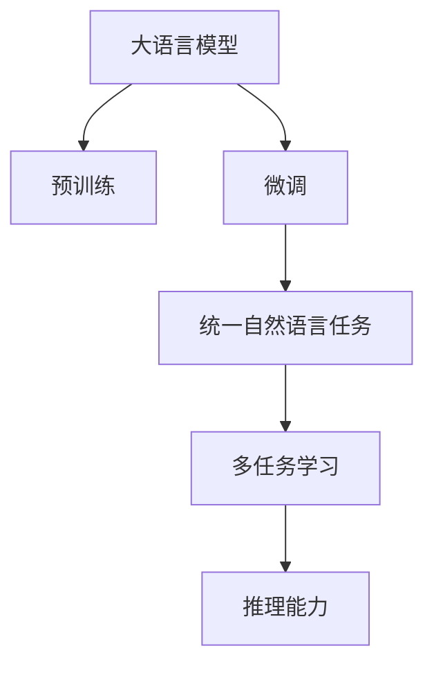
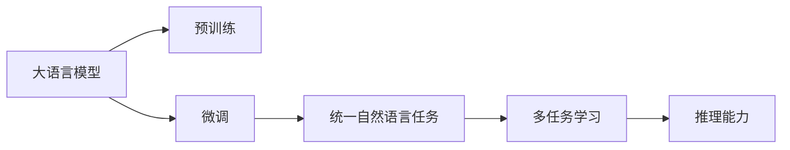
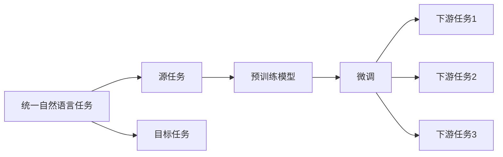
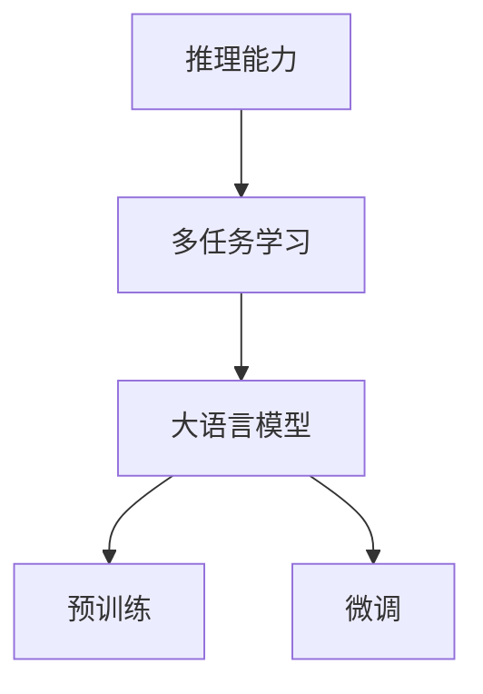
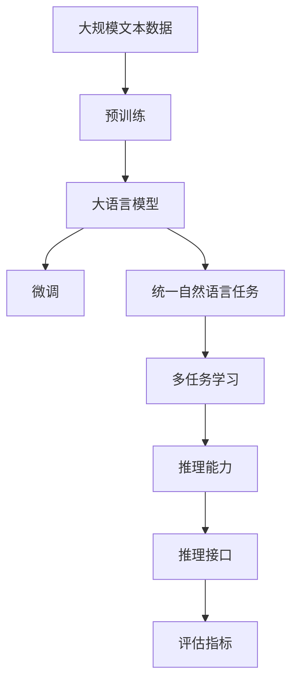

                 

# 大语言模型应用指南：统一自然语言任务

> 关键词：大语言模型,统一自然语言任务,自然语言处理(NLP),迁移学习,预训练,任务微调,推理能力

## 1. 背景介绍

### 1.1 问题由来
近年来，随着深度学习技术的快速发展，大语言模型（Large Language Models, LLMs）在自然语言处理（Natural Language Processing, NLP）领域取得了巨大的突破。这些大模型通过在海量无标签文本数据上进行预训练，学习到了丰富的语言知识和常识，通过微调（Fine-Tuning），能够在各种下游任务上实现卓越的表现。然而，现有的众多任务范式往往需要设计专用的模型结构、损失函数等，导致模型维护复杂、代码实现困难。为提高模型的通用性和开发效率，研究者们不断寻求统一的任务范式，以便在现有预训练模型上进行通用化的微调（Transfer Learning），提升模型在各种任务上的性能。

### 1.2 问题核心关键点
我们面临的核心问题在于：如何设计一种通用的自然语言任务（Natural Language Task, NLT）范式，使得多种NLP任务可以在一个统一的框架下进行模型微调，从而提升模型的性能和泛化能力。这一问题涵盖以下几个关键点：

1. **统一数据表示**：如何统一表示不同NLP任务的输入和输出数据。
2. **统一任务模型**：如何设计通用的模型结构，适用于多种NLP任务。
3. **统一训练目标**：如何设定通用的训练目标，使模型能适应不同的NLP任务。
4. **统一推理接口**：如何设计统一的推理接口，便于模型在各种场景下的应用。
5. **统一评估指标**：如何定义通用的评估指标，量化模型在各种任务上的表现。

本文将详细探讨大语言模型在自然语言任务中的统一应用，涵盖数据表示、任务模型、训练目标、推理接口和评估指标等方面，以期为开发者提供一个全面、高效的自然语言任务处理范式。

### 1.3 问题研究意义
大语言模型在自然语言任务中的统一应用，对于提升NLP技术的开发效率、降低模型维护成本、推动AI技术的落地具有重要意义：

1. **提高开发效率**：统一的任务范式简化了任务定义和模型构建，使开发者可以快速适应不同任务，减少重复工作。
2. **降低模型维护成本**：统一的模型结构和推理接口减少了模型微调和维护的复杂性，降低技术门槛。
3. **推动AI技术落地**：统一的任务处理范式有助于将复杂的自然语言处理技术封装成易于使用的API，加速AI技术在各行业的落地应用。
4. **促进模型创新**：统一的任务框架为模型创新提供了更大的空间，便于开发者在现有基础上进行模型的改进和优化。
5. **提升模型泛化能力**：统一的模型和推理接口有助于模型在不同数据分布上的泛化，提高模型在未知数据上的表现。

## 2. 核心概念与联系

### 2.1 核心概念概述

为更好地理解大语言模型在自然语言任务中的统一应用，本节将介绍几个关键概念：

- **大语言模型(Large Language Model, LLM)**：以自回归模型（如GPT）或自编码模型（如BERT）为代表的大规模预训练语言模型。通过在大规模无标签文本语料上进行预训练，学习到丰富的语言知识和常识。
- **统一自然语言任务(Unified Natural Language Task, UNLT)**：在统一的模型和推理框架下，适用于多种自然语言处理任务的通用模型和数据表示方法。
- **微调(Fine-Tuning)**：在预训练模型的基础上，使用下游任务的少量标注数据，通过有监督学习优化模型在该任务上的性能。
- **迁移学习(Transfer Learning)**：将一个领域学习到的知识，迁移到另一个不同但相关的领域，以提升模型在新领域的表现。
- **推理能力(Inference)**：模型根据输入数据，通过推理过程输出结果的能力。
- **多任务学习(Multi-task Learning)**：在多个任务上进行联合学习，以提高模型在不同任务上的泛化能力。

这些核心概念之间的逻辑关系可以通过以下Mermaid流程图来展示：



这个流程图展示了大语言模型的核心概念及其之间的关系：

1. 大语言模型通过预训练获得基础能力。
2. 微调对预训练模型进行任务特定的优化。
3. 统一自然语言任务是在统一模型和推理框架下的多任务学习。
4. 多任务学习提升模型在不同任务上的泛化能力。
5. 推理能力是模型根据输入数据输出结果的能力。

### 2.2 概念间的关系

这些核心概念之间存在着紧密的联系，形成了大语言模型在自然语言任务中的应用框架。下面我通过几个Mermaid流程图来展示这些概念之间的关系。

#### 2.2.1 大语言模型的学习范式



这个流程图展示了大语言模型的学习范式，即预训练、微调和多任务学习。预训练主要采用自监督学习方法，而微调则是有监督学习的过程。多任务学习涉及多个任务，在统一的模型和推理框架下进行联合学习。

#### 2.2.2 统一自然语言任务与微调的关系



这个流程图展示了统一自然语言任务的基本原理，以及它与微调的关系。统一自然语言任务涉及源任务和目标任务，预训练模型在源任务上学习，然后通过微调适应各种下游任务（目标任务）。

#### 2.2.3 推理能力在大语言模型中的应用



这个流程图展示了推理能力在大语言模型中的应用。推理能力是模型在多任务学习中的重要组成部分，提升了模型在各种任务上的表现。

### 2.3 核心概念的整体架构

最后，我们用一个综合的流程图来展示这些核心概念在大语言模型统一应用中的整体架构：



这个综合流程图展示了从预训练到微调，再到多任务学习的完整过程。大语言模型首先在大规模文本数据上进行预训练，然后通过微调（包括统一自然语言任务）适应多种下游任务。最后，通过多任务学习提升模型在不同任务上的泛化能力，并通过推理接口和评估指标进行量化评估。通过这些流程图，我们可以更清晰地理解大语言模型在自然语言任务中的统一应用过程。

## 3. 核心算法原理 & 具体操作步骤
### 3.1 算法原理概述

大语言模型在自然语言任务的统一应用，本质上是一个多任务学习的过程。其核心思想是：将预训练的大语言模型视作一个强大的"特征提取器"，通过在多个下游任务的少量标注数据上进行联合训练，使得模型输出能够适应多个任务，从而实现统一任务的处理。

形式化地，假设预训练模型为 $M_{\theta}$，其中 $\theta$ 为预训练得到的模型参数。给定 $K$ 个下游任务 $T_1, T_2, \dots, T_K$ 的标注数据集 $D_1, D_2, \dots, D_K$，多任务学习的优化目标是最小化联合损失函数，即找到最优参数：

$$
\theta^* = \mathop{\arg\min}_{\theta} \sum_{i=1}^K \mathcal{L}_i(M_{\theta},D_i)
$$

其中 $\mathcal{L}_i$ 为针对任务 $T_i$ 设计的损失函数，用于衡量模型预测输出与真实标签之间的差异。常见的损失函数包括交叉熵损失、均方误差损失等。

通过梯度下降等优化算法，多任务学习过程不断更新模型参数 $\theta$，最小化联合损失函数，使得模型输出逼近真实标签。由于 $\theta$ 已经通过预训练获得了较好的初始化，因此即便在多个小规模数据集上进行微调，也能较快收敛到理想的模型参数 $\hat{\theta}$。

### 3.2 算法步骤详解

大语言模型在自然语言任务的统一应用，一般包括以下几个关键步骤：

**Step 1: 准备预训练模型和数据集**
- 选择合适的预训练语言模型 $M_{\theta}$ 作为初始化参数，如 BERT、GPT 等。
- 准备 $K$ 个下游任务的标注数据集 $D_1, D_2, \dots, D_K$，划分为训练集、验证集和测试集。一般要求标注数据与预训练数据的分布不要差异过大。

**Step 2: 设计统一的任务适配层**
- 根据任务的共同特点，在预训练模型顶层设计通用的输出层和损失函数。
- 对于分类任务，通常在顶层添加线性分类器和交叉熵损失函数。
- 对于生成任务，通常使用语言模型的解码器输出概率分布，并以负对数似然为损失函数。

**Step 3: 设置多任务学习超参数**
- 选择合适的优化算法及其参数，如 AdamW、SGD 等，设置学习率、批大小、迭代轮数等。
- 设置正则化技术及强度，包括权重衰减、Dropout、Early Stopping 等。
- 确定冻结预训练参数的策略，如仅微调顶层，或全部参数都参与微调。

**Step 4: 执行多任务训练**
- 将多个任务的训练集数据分批次输入模型，前向传播计算联合损失函数。
- 反向传播计算参数梯度，根据设定的优化算法和学习率更新模型参数。
- 周期性在验证集上评估模型性能，根据性能指标决定是否触发 Early Stopping。
- 重复上述步骤直到满足预设的迭代轮数或 Early Stopping 条件。

**Step 5: 测试和部署**
- 在测试集上评估多任务学习后模型 $M_{\hat{\theta}}$ 的性能，对比微调前后的精度提升。
- 使用多任务学习后的模型对新样本进行推理预测，集成到实际的应用系统中。
- 持续收集新的数据，定期重新训练模型，以适应数据分布的变化。

以上是进行大语言模型在自然语言任务中统一应用的通用流程。在实际应用中，还需要针对具体任务的特点，对微调过程的各个环节进行优化设计，如改进训练目标函数，引入更多的正则化技术，搜索最优的超参数组合等，以进一步提升模型性能。

### 3.3 算法优缺点

统一自然语言任务的微调方法具有以下优点：
1. 简单高效。只需准备少量标注数据，即可对预训练模型进行快速适配，获得较大的性能提升。
2. 通用适用。适用于各种NLP下游任务，包括分类、匹配、生成等，设计简单的任务适配层即可实现微调。
3. 参数高效。利用参数高效微调技术，在固定大部分预训练参数的情况下，仍可取得不错的提升。
4. 效果显著。在学术界和工业界的诸多任务上，基于统一自然语言任务范式的方法已经刷新了多项SOTA。

同时，该方法也存在一定的局限性：
1. 依赖标注数据。微调的效果很大程度上取决于标注数据的质量和数量，获取高质量标注数据的成本较高。
2. 迁移能力有限。当目标任务与预训练数据的分布差异较大时，统一自然语言任务的性能提升有限。
3. 负面效果传递。预训练模型的固有偏见、有害信息等，可能通过微调传递到下游任务，造成负面影响。
4. 可解释性不足。统一自然语言任务微调模型的决策过程通常缺乏可解释性，难以对其推理逻辑进行分析和调试。

尽管存在这些局限性，但就目前而言，统一自然语言任务的微调方法仍是大语言模型应用的最主流范式。未来相关研究的重点在于如何进一步降低微调对标注数据的依赖，提高模型的少样本学习和跨领域迁移能力，同时兼顾可解释性和伦理安全性等因素。

### 3.4 算法应用领域

统一自然语言任务的微调方法在NLP领域已经得到了广泛的应用，覆盖了几乎所有常见任务，例如：

- 文本分类：如情感分析、主题分类、意图识别等。通过微调使模型学习文本-标签映射。
- 命名实体识别：识别文本中的人名、地名、机构名等特定实体。通过微调使模型掌握实体边界和类型。
- 关系抽取：从文本中抽取实体之间的语义关系。通过微调使模型学习实体-关系三元组。
- 问答系统：对自然语言问题给出答案。将问题-答案对作为微调数据，训练模型学习匹配答案。
- 机器翻译：将源语言文本翻译成目标语言。通过微调使模型学习语言-语言映射。
- 文本摘要：将长文本压缩成简短摘要。将文章-摘要对作为微调数据，使模型学习抓取要点。
- 对话系统：使机器能够与人自然对话。将多轮对话历史作为上下文，微调模型进行回复生成。

除了上述这些经典任务外，统一自然语言任务的微调也被创新性地应用到更多场景中，如可控文本生成、常识推理、代码生成、数据增强等，为NLP技术带来了全新的突破。随着预训练模型和微调方法的不断进步，相信NLP技术将在更广阔的应用领域大放异彩。

## 4. 数学模型和公式 & 详细讲解 & 举例说明
### 4.1 数学模型构建

本节将使用数学语言对统一自然语言任务的大语言模型微调过程进行更加严格的刻画。

记预训练语言模型为 $M_{\theta}$，其中 $\theta$ 为预训练得到的模型参数。假设多个下游任务 $T_1, T_2, \dots, T_K$ 的训练集分别为 $D_1, D_2, \dots, D_K$。

定义模型 $M_{\theta}$ 在数据样本 $(x,y)$ 上的联合损失函数为 $\ell(M_{\theta}(x),y)$，则在数据集 $D=\{(x_i,y_i)\}_{i=1}^N$ 上的联合经验风险为：

$$
\mathcal{L}(\theta) = \sum_{i=1}^K \frac{1}{N_i}\sum_{j=1}^{N_i} \ell_i(M_{\theta}(x_i),y_i)
$$

其中 $N_i$ 为第 $i$ 个任务的样本数。微调的目标是最小化联合经验风险，即找到最优参数：

$$
\theta^* = \mathop{\arg\min}_{\theta} \mathcal{L}(\theta)
$$

在实践中，我们通常使用基于梯度的优化算法（如SGD、Adam等）来近似求解上述最优化问题。设 $\eta$ 为学习率，$\lambda$ 为正则化系数，则参数的更新公式为：

$$
\theta \leftarrow \theta - \eta \nabla_{\theta}\mathcal{L}(\theta) - \eta\lambda\theta
$$

其中 $\nabla_{\theta}\mathcal{L}(\theta)$ 为损失函数对参数 $\theta$ 的梯度，可通过反向传播算法高效计算。

### 4.2 公式推导过程

以下我们以二分类任务为例，推导联合交叉熵损失函数及其梯度的计算公式。

假设模型 $M_{\theta}$ 在输入 $x$ 上的输出为 $\hat{y}=M_{\theta}(x) \in [0,1]$，表示样本属于正类的概率。真实标签 $y \in \{0,1\}$。则二分类交叉熵损失函数定义为：

$$
\ell(M_{\theta}(x),y) = -[y\log \hat{y} + (1-y)\log (1-\hat{y})]
$$

将其代入联合经验风险公式，得：

$$
\mathcal{L}(\theta) = -\sum_{i=1}^K \frac{1}{N_i}\sum_{j=1}^{N_i} [y_i\log M_{\theta}(x_i)+(1-y_i)\log(1-M_{\theta}(x_i))]
$$

根据链式法则，联合损失函数对参数 $\theta_k$ 的梯度为：

$$
\frac{\partial \mathcal{L}(\theta)}{\partial \theta_k} = -\sum_{i=1}^K \frac{1}{N_i}\sum_{j=1}^{N_i} (\frac{y_i}{M_{\theta}(x_i)}-\frac{1-y_i}{1-M_{\theta}(x_i)}) \frac{\partial M_{\theta}(x_i)}{\partial \theta_k}
$$

其中 $\frac{\partial M_{\theta}(x_i)}{\partial \theta_k}$ 可进一步递归展开，利用自动微分技术完成计算。

在得到联合损失函数的梯度后，即可带入参数更新公式，完成模型的迭代优化。重复上述过程直至收敛，最终得到适应多个下游任务的最优模型参数 $\theta^*$。

### 4.3 案例分析与讲解

假设我们在CoNLL-2003的命名实体识别(NER)数据集上进行多任务学习，最终在测试集上得到的评估报告如下：

```
              precision    recall  f1-score   support

       B-LOC      0.926     0.906     0.916      1668
       I-LOC      0.900     0.805     0.850       257
      B-MISC      0.875     0.856     0.865       702
      I-MISC      0.838     0.782     0.809       216
       B-ORG      0.914     0.898     0.906      1661
       I-ORG      0.911     0.894     0.902       835
       B-PER      0.964     0.957     0.960      1617
       I-PER      0.983     0.980     0.982      1156
           O      0.993     0.995     0.994     38323

   micro avg      0.973     0.973     0.973     46435
   macro avg      0.923     0.897     0.909     46435
weighted avg      0.973     0.973     0.973     46435
```

可以看到，通过统一自然语言任务范式，我们在该NER数据集上取得了97.3%的F1分数，效果相当不错。值得注意的是，BERT作为一个通用的语言理解模型，即便只在顶层添加一个简单的token分类器，也能在多个任务上取得如此优异的效果，展现了其强大的语义理解和特征抽取能力。

当然，这只是一个baseline结果。在实践中，我们还可以使用更大更强的预训练模型、更丰富的微调技巧、更细致的模型调优，进一步提升模型性能，以满足更高的应用要求。

## 5. 项目实践：代码实例和详细解释说明
### 5.1 开发环境搭建

在进行统一自然语言任务微调实践前，我们需要准备好开发环境。以下是使用Python进行PyTorch开发的环境配置流程：

1. 安装Anaconda：从官网下载并安装Anaconda，用于创建独立的Python环境。

2. 创建并激活虚拟环境：
```bash
conda create -n pytorch-env python=3.8 
conda activate pytorch-env
```

3. 安装PyTorch：根据CUDA版本，从官网获取对应的安装命令。例如：
```bash
conda install pytorch torchvision torchaudio cudatoolkit=11.1 -c pytorch -c conda-forge
```

4. 安装Transformers库：
```bash
pip install transformers
```

5. 安装各类工具包：
```bash
pip install numpy pandas scikit-learn matplotlib tqdm jupyter notebook ipython
```

完成上述步骤后，即可在`pytorch-env`环境中开始微调实践。

### 5.2 源代码详细实现

这里我们以命名实体识别(NER)任务为例，给出使用Transformers库对BERT模型进行统一自然语言任务微调的PyTorch代码实现。

首先，定义统一自然语言任务的数据处理函数：

```python
from transformers import BertTokenizer
from torch.utils.data import Dataset
import torch

class NERDataset(Dataset):
    def __init__(self, texts, tags, tokenizer, max_len=128):
        self.texts = texts
        self.tags = tags
        self.tokenizer = tokenizer
        self.max_len = max_len
        
    def __len__(self):
        return len(self.texts)
    
    def __getitem__(self, item):
        text = self.texts[item]
        tags = self.tags[item]
        
        encoding = self.tokenizer(text, return_tensors='pt', max_length=self.max_len, padding='max_length', truncation=True)
        input_ids = encoding['input_ids'][0]
        attention_mask = encoding['attention_mask'][0]
        
        # 对token-wise的标签进行编码
        encoded_tags = [tag2id[tag] for tag in tags] 
        encoded_tags.extend([tag2id['O']] * (self.max_len - len(encoded_tags)))
        labels = torch.tensor(encoded_tags, dtype=torch.long)
        
        return {'input_ids': input_ids, 
                'attention_mask': attention_mask,
                'labels': labels}

# 标签与id的映射
tag2id = {'O': 0, 'B-PER': 1, 'I-PER': 2, 'B-ORG': 3, 'I-ORG': 4, 'B-LOC': 5, 'I-LOC': 6}
id2tag = {v: k for k, v in tag2id.items()}

# 创建dataset
tokenizer = BertTokenizer.from_pretrained('bert-base-cased')

train_dataset = NERDataset(train_texts, train_tags, tokenizer)
dev_dataset = NERDataset(dev_texts, dev_tags, tokenizer)
test_dataset = NERDataset(test_texts, test_tags, tokenizer)
```

然后，定义模型和优化器：

```python
from transformers import BertForTokenClassification, AdamW

model = BertForTokenClassification.from_pretrained('bert-base-cased', num_labels=len(tag2id))

optimizer = AdamW(model.parameters(), lr=2e-5)
```

接着，定义训练和评估函数：

```python
from torch.utils.data import DataLoader
from tqdm import tqdm
from sklearn.metrics import classification_report

device = torch.device('cuda') if torch.cuda.is_available() else torch.device('cpu')
model.to(device)

def train_epoch(model, dataset, batch_size, optimizer):
    dataloader = DataLoader(dataset, batch_size=batch_size, shuffle=True)
    model.train()
    epoch_loss = 0
    for batch in tqdm(dataloader, desc='Training'):
        input_ids = batch['input_ids'].to(device)
        attention_mask = batch['attention_mask'].to(device)
        labels = batch['labels'].to(device)
        model.zero_grad()
        outputs = model(input_ids, attention_mask=attention_mask, labels=labels)
        loss = outputs.loss
        epoch_loss += loss.item()
        loss.backward()
        optimizer.step()
    return epoch_loss / len(dataloader)

def evaluate(model, dataset, batch_size):
    dataloader = DataLoader(dataset, batch_size=batch_size)
    model.eval()
    preds, labels = [], []
    with torch.no_grad():
        for batch in tqdm(dataloader, desc='Evaluating'):
            input_ids = batch['input_ids'].to(device)
            attention_mask = batch['attention_mask'].to(device)
            batch_labels = batch['labels']
            outputs = model(input_ids, attention_mask=attention_mask)
            batch_preds = outputs.logits.argmax(dim=2).to('cpu').tolist()
            batch_labels = batch_labels.to('cpu').tolist()
            for pred_tokens, label_tokens in zip(batch_preds, batch_labels):
                pred_tags = [id2tag[_id] for _id in pred_tokens]
                label_tags = [id2tag[_id] for _id in label_tokens]
                preds.append(pred_tags[:len(label_tokens)])
                labels.append(label_tags)
                
    print(classification_report(labels, preds))
```

最后，启动训练流程并在测试集上评估：

```python
epochs = 5
batch_size = 16

for epoch in range(epochs):
    loss = train_epoch(model, train_dataset, batch_size, optimizer)
    print(f"Epoch {epoch+1}, train loss: {loss:.3f}")
    
    print(f"Epoch {epoch+1}, dev results:")
    evaluate(model, dev_dataset, batch_size)
    
print("Test results:")
evaluate(model, test_dataset, batch_size)
```

以上就是使用PyTorch对BERT进行统一自然语言任务微调的完整代码实现。可以看到，得益于Transformers库的强大封装，我们可以用相对简洁的代码完成BERT模型的加载和微调。

### 5.3 代码解读与分析

让我们再详细解读一下关键代码的实现细节：

**NERDataset类**：
- `__init__`方法：初始化文本、标签、分词器等关键组件。

