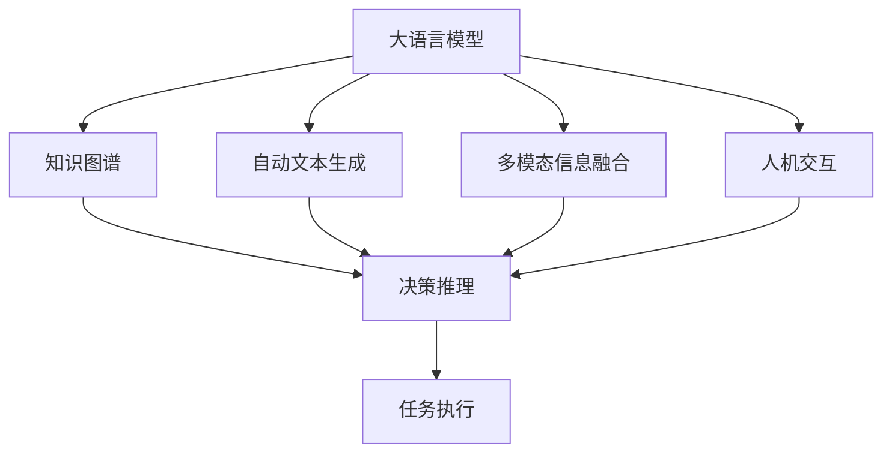
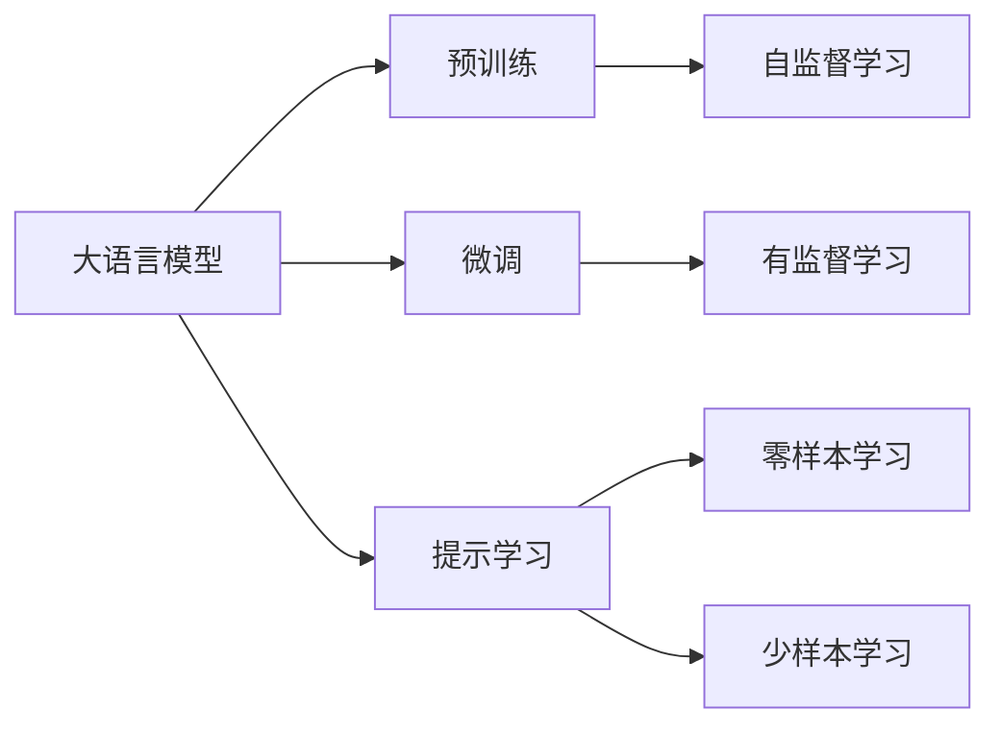
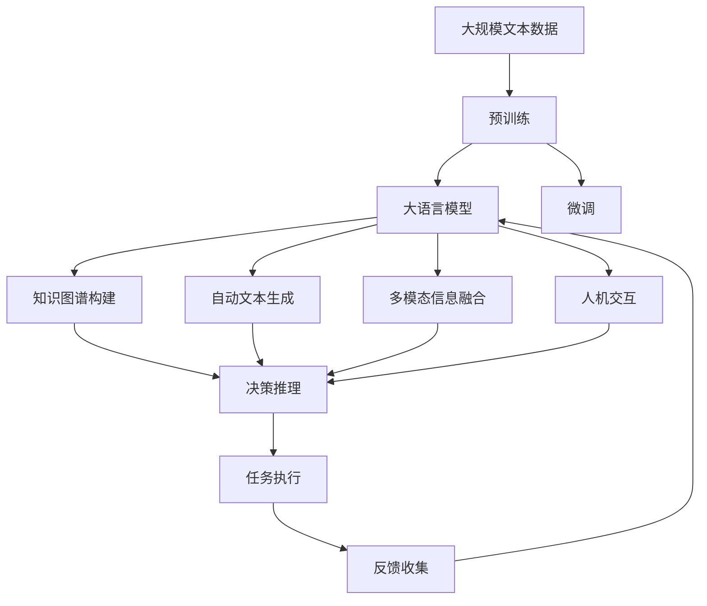
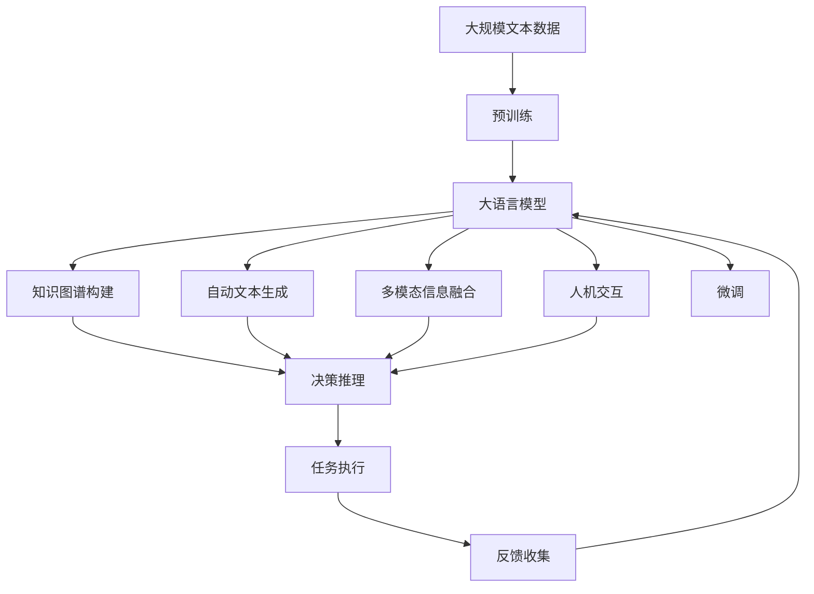

                 

# 大语言模型应用指南：自主Agent系统案例分析（二）

## 1. 背景介绍

### 1.1 问题由来
在现代企业中，自主Agent系统（Autonomous Agent Systems, AAS）正逐渐成为组织决策和运营的核心。这些系统能够在复杂的商业环境中自主决策，优化流程，提高效率，并实现自动化操作。然而，传统的Agent系统大多依赖规则和知识库，难以处理复杂、动态和不可预测的情况。

为了应对这一挑战，研究人员提出了基于大语言模型（Large Language Models, LLMs）的自主Agent系统。大语言模型通过在大规模无标签文本上预训练，学习通用的语言表示和知识，可以自动从文本中抽取有用信息，支持复杂的决策和交互，并不断通过微调进行优化，以适应新的任务和场景。

### 1.2 问题核心关键点
大语言模型在自主Agent系统中的应用，主要集中在以下几个方面：
1. **信息抽取与知识图谱构建**：通过自然语言处理（NLP）技术，从海量文本中抽取结构化的信息，构建知识图谱，支持Agent的决策推理。
2. **自动生成文本**：利用生成模型，自动生成各类文本，如商业报告、客户反馈、市场分析等，增强Agent的表达能力和决策支持。
3. **多模态信息融合**：结合图像、音频、视频等多模态数据，通过大语言模型进行语义理解和信息整合，提高Agent的感知能力。
4. **人机交互**：通过对话系统或聊天机器人，实现与用户的自然语言交互，收集反馈，进行动态调整。
5. **自适应学习**：在实际应用中，Agent系统不断从新数据中学习，通过微调优化模型，以适应新的商业环境和工作流程。

本文将深入探讨大语言模型在自主Agent系统中的应用，特别是在信息抽取、文本生成、多模态融合和人机交互等方面的实践和优化。

### 1.3 问题研究意义
大语言模型在自主Agent系统中的应用，具有重要的研究意义：

1. **提高决策质量**：利用语言模型的深度学习和知识推理能力，显著提升自主Agent的决策质量，减少人为干预，提高效率。
2. **增强环境适应性**：大语言模型能够通过微调不断适应新的商业环境和任务需求，保持系统的灵活性和鲁棒性。
3. **促进业务创新**：通过自动化的信息抽取和文本生成，解放人力资源，加速业务创新和转型。
4. **降低成本**：减少对人工规则和知识库的依赖，降低系统开发和维护成本。
5. **提升用户体验**：通过智能化的多模态交互系统，提升用户满意度和使用体验。

## 2. 核心概念与联系

### 2.1 核心概念概述

为更好地理解大语言模型在自主Agent系统中的应用，本节将介绍几个密切相关的核心概念：

- **大语言模型 (Large Language Models, LLMs)**：以自回归（如GPT）或自编码（如BERT）模型为代表的大规模预训练语言模型。通过在大规模无标签文本上预训练，学习通用的语言表示，具备强大的语言理解和生成能力。

- **知识图谱 (Knowledge Graphs)**：由节点（实体）和边（关系）构成的图形结构，用于表示实体间的语义关系，是自主Agent系统决策推理的基础。

- **自动文本生成 (Automatic Text Generation)**：通过大语言模型自动生成各类文本，如报告、分析、对话等，支持Agent的决策和交互。

- **多模态信息融合 (Multi-modal Information Fusion)**：将图像、音频、视频等多模态数据与文本信息进行整合，通过大语言模型进行语义理解和信息处理。

- **人机交互 (Human-Machine Interaction, HMI)**：通过对话系统或聊天机器人，实现与用户的自然语言交互，收集反馈，进行动态调整。

- **自适应学习 (Adaptive Learning)**：利用在线学习技术，Agent系统不断从新数据中学习，通过微调优化模型，以适应新的任务和场景。

这些核心概念之间的逻辑关系可以通过以下Mermaid流程图来展示：



这个流程图展示了大语言模型在自主Agent系统中的应用场景：

1. 大语言模型通过预训练获得基础能力。
2. 利用知识图谱支持决策推理，将抽取的信息进行结构化处理。
3. 通过自动文本生成和对话系统增强表达能力，进行人机交互。
4. 结合多模态信息融合，提升感知能力。
5. 不断通过自适应学习进行优化，以适应新的任务和场景。
6. 最终执行任务，并输出结果。

### 2.2 概念间的关系

这些核心概念之间存在着紧密的联系，形成了自主Agent系统的完整生态系统。下面我通过几个Mermaid流程图来展示这些概念之间的关系。

#### 2.2.1 大语言模型的学习范式



这个流程图展示了大语言模型的三种主要学习范式：预训练、微调和提示学习。预训练主要采用自监督学习方法，而微调则是有监督学习的过程。提示学习可以实现零样本和少样本学习。

#### 2.2.2 自主Agent系统的整体架构



这个综合流程图展示了从预训练到微调，再到任务执行的完整过程。大语言模型首先在大规模文本数据上进行预训练，然后通过微调或提示学习（零样本和少样本学习）进行优化，支持知识图谱构建、自动文本生成、多模态信息融合和人机交互。

### 2.3 核心概念的整体架构

最后，我们用一个综合的流程图来展示这些核心概念在大语言模型微调过程中的整体架构：



这个综合流程图展示了从预训练到微调，再到任务执行的完整过程。大语言模型首先在大规模文本数据上进行预训练，然后通过微调或提示学习（零样本和少样本学习）进行优化，支持知识图谱构建、自动文本生成、多模态信息融合和人机交互。

## 3. 核心算法原理 & 具体操作步骤

### 3.1 算法原理概述

基于大语言模型的自主Agent系统，其核心思想是通过预训练语言模型获得强大的语言理解能力和知识推理能力，利用知识图谱构建信息抽取模型，自动生成各类文本，结合多模态信息融合，支持复杂的人机交互，并通过微调不断优化模型，以适应新的任务和场景。

形式化地，假设预训练语言模型为 $M_{\theta}$，其中 $\theta$ 为预训练得到的模型参数。给定自主Agent系统的任务 $T$，构建知识图谱 $G$，并准备训练集 $D=\{(x_i, y_i)\}_{i=1}^N, x_i \in \mathcal{X}, y_i \in \mathcal{Y}$，其中 $\mathcal{X}$ 为输入空间，$\mathcal{Y}$ 为输出空间。

定义模型 $M_{\theta}$ 在数据样本 $(x,y)$ 上的损失函数为 $\ell(M_{\theta}(x),y)$，则在数据集 $D$ 上的经验风险为：

$$
\mathcal{L}(\theta) = \frac{1}{N} \sum_{i=1}^N \ell(M_{\theta}(x_i),y_i)
$$

微调的优化目标是最小化经验风险，即找到最优参数：

$$
\theta^* = \mathop{\arg\min}_{\theta} \mathcal{L}(\theta)
$$

在得到损失函数的梯度后，即可带入参数更新公式，完成模型的迭代优化。重复上述过程直至收敛，最终得到适应下游任务的最优模型参数 $\theta^*$。

### 3.2 算法步骤详解

基于大语言模型的自主Agent系统微调一般包括以下几个关键步骤：

**Step 1: 准备预训练模型和数据集**
- 选择合适的预训练语言模型 $M_{\theta}$ 作为初始化参数，如 BERT、GPT 等。
- 准备自主Agent系统的任务 $T$ 的训练集 $D$，划分为训练集、验证集和测试集。一般要求标注数据与预训练数据的分布不要差异过大。

**Step 2: 构建知识图谱**
- 根据任务需求，收集和整合各类结构化数据，如公司内部数据、公开数据等，构建知识图谱 $G$。
- 定义知识图谱的节点和关系，利用自然语言处理技术进行信息抽取和关系推理。
- 将知识图谱与大语言模型进行融合，设计合适的输出层和损失函数。

**Step 3: 设置微调超参数**
- 选择合适的优化算法及其参数，如 AdamW、SGD 等，设置学习率、批大小、迭代轮数等。
- 设置正则化技术及强度，包括权重衰减、Dropout、Early Stopping等。
- 确定冻结预训练参数的策略，如仅微调顶层，或全部参数都参与微调。

**Step 4: 执行梯度训练**
- 将训练集数据分批次输入模型，前向传播计算损失函数。
- 反向传播计算参数梯度，根据设定的优化算法和学习率更新模型参数。
- 周期性在验证集上评估模型性能，根据性能指标决定是否触发 Early Stopping。
- 重复上述步骤直到满足预设的迭代轮数或 Early Stopping 条件。

**Step 5: 测试和部署**
- 在测试集上评估微调后模型 $M_{\hat{\theta}}$ 的性能，对比微调前后的精度提升。
- 使用微调后的模型对新样本进行推理预测，集成到实际的应用系统中。
- 持续收集新的数据，定期重新微调模型，以适应数据分布的变化。

以上是基于大语言模型微调自主Agent系统的一般流程。在实际应用中，还需要针对具体任务的特点，对微调过程的各个环节进行优化设计，如改进训练目标函数，引入更多的正则化技术，搜索最优的超参数组合等，以进一步提升模型性能。

### 3.3 算法优缺点

基于大语言模型的自主Agent系统微调方法具有以下优点：
1. 简单高效。只需准备少量标注数据，即可对预训练模型进行快速适配，获得较大的性能提升。
2. 通用适用。适用于各种自主Agent系统的任务，如知识图谱构建、信息抽取、自动文本生成等，设计简单的任务适配层即可实现微调。
3. 参数高效。利用参数高效微调技术，在固定大部分预训练参数的情况下，仍可取得不错的提升。
4. 效果显著。在学术界和工业界的诸多任务上，基于微调的方法已经刷新了最先进的性能指标。

同时，该方法也存在一定的局限性：
1. 依赖标注数据。微调的效果很大程度上取决于标注数据的质量和数量，获取高质量标注数据的成本较高。
2. 迁移能力有限。当目标任务与预训练数据的分布差异较大时，微调的性能提升有限。
3. 负面效果传递。预训练模型的固有偏见、有害信息等，可能通过微调传递到下游任务，造成负面影响。
4. 可解释性不足。微调模型的决策过程通常缺乏可解释性，难以对其推理逻辑进行分析和调试。

尽管存在这些局限性，但就目前而言，基于大语言模型的微调方法仍是大语言模型应用的最主流范式。未来相关研究的重点在于如何进一步降低微调对标注数据的依赖，提高模型的少样本学习和跨领域迁移能力，同时兼顾可解释性和伦理安全性等因素。

### 3.4 算法应用领域

基于大语言模型微调的自主Agent系统在众多领域已经得到了广泛的应用，例如：

- **金融风控**：利用预训练语言模型构建知识图谱，抽取金融交易数据，支持风险识别和反欺诈决策。
- **智能客服**：在客服系统中，利用大语言模型进行自然语言理解和生成，提升客户满意度。
- **医疗诊断**：构建医学知识图谱，自动抽取病历信息，辅助医生进行诊断和治疗决策。
- **智能推荐**：结合用户行为数据和产品信息，自动生成推荐内容，提升推荐系统的效果。
- **供应链管理**：利用大语言模型进行物流数据处理和预测，优化供应链管理。
- **智慧城市**：在城市管理中，利用大语言模型进行舆情分析、应急响应等，提高城市治理效率。

除了上述这些经典任务外，大语言模型微调还被创新性地应用到更多场景中，如智能家居、智能交通、智能制造等，为各行各业带来了新的技术创新和业务价值。

## 4. 数学模型和公式 & 详细讲解

### 4.1 数学模型构建

本节将使用数学语言对基于大语言模型的自主Agent系统微调过程进行更加严格的刻画。

记预训练语言模型为 $M_{\theta}$，其中 $\theta$ 为预训练得到的模型参数。假设自主Agent系统的任务 $T$ 的训练集为 $D=\{(x_i,y_i)\}_{i=1}^N, x_i \in \mathcal{X}, y_i \in \mathcal{Y}$。

定义模型 $M_{\theta}$ 在数据样本 $(x,y)$ 上的损失函数为 $\ell(M_{\theta}(x),y)$，则在数据集 $D$ 上的经验风险为：

$$
\mathcal{L}(\theta) = \frac{1}{N} \sum_{i=1}^N \ell(M_{\theta}(x_i),y_i)
$$

微调的优化目标是最小化经验风险，即找到最优参数：

$$
\theta^* = \mathop{\arg\min}_{\theta} \mathcal{L}(\theta)
$$

在实践中，我们通常使用基于梯度的优化算法（如SGD、Adam等）来近似求解上述最优化问题。设 $\eta$ 为学习率，$\lambda$ 为正则化系数，则参数的更新公式为：

$$
\theta \leftarrow \theta - \eta \nabla_{\theta}\mathcal{L}(\theta) - \eta\lambda\theta
$$

其中 $\nabla_{\theta}\mathcal{L}(\theta)$ 为损失函数对参数 $\theta$ 的梯度，可通过反向传播算法高效计算。

### 4.2 公式推导过程

以下我们以金融风控任务为例，推导交叉熵损失函数及其梯度的计算公式。

假设模型 $M_{\theta}$ 在输入 $x$ 上的输出为 $\hat{y}=M_{\theta}(x) \in [0,1]$，表示样本属于正类的概率。真实标签 $y \in \{0,1\}$。则二分类交叉熵损失函数定义为：

$$
\ell(M_{\theta}(x),y) = -[y\log \hat{y} + (1-y)\log (1-\hat{y})]
$$

将其代入经验风险公式，得：

$$
\mathcal{L}(\theta) = -\frac{1}{N}\sum_{i=1}^N [y_i\log M_{\theta}(x_i)+(1-y_i)\log(1-M_{\theta}(x_i))]
$$

根据链式法则，损失函数对参数 $\theta_k$ 的梯度为：

$$
\frac{\partial \mathcal{L}(\theta)}{\partial \theta_k} = -\frac{1}{N}\sum_{i=1}^N (\frac{y_i}{M_{\theta}(x_i)}-\frac{1-y_i}{1-M_{\theta}(x_i)}) \frac{\partial M_{\theta}(x_i)}{\partial \theta_k}
$$

其中 $\frac{\partial M_{\theta}(x_i)}{\partial \theta_k}$ 可进一步递归展开，利用自动微分技术完成计算。

在得到损失函数的梯度后，即可带入参数更新公式，完成模型的迭代优化。重复上述过程直至收敛，最终得到适应下游任务的最优模型参数 $\theta^*$。

## 5. 项目实践：代码实例和详细解释说明

### 5.1 开发环境搭建

在进行微调实践前，我们需要准备好开发环境。以下是使用Python进行PyTorch开发的环境配置流程：

1. 安装Anaconda：从官网下载并安装Anaconda，用于创建独立的Python环境。

2. 创建并激活虚拟环境：
```bash
conda create -n pytorch-env python=3.8 
conda activate pytorch-env
```

3. 安装PyTorch：根据CUDA版本，从官网获取对应的安装命令。例如：
```bash
conda install pytorch torchvision torchaudio cudatoolkit=11.1 -c pytorch -c conda-forge
```

4. 安装Transformers库：
```bash
pip install transformers
```

5. 安装各类工具包：
```bash
pip install numpy pandas scikit-learn matplotlib tqdm jupyter notebook ipython
```

完成上述步骤后，即可在`pytorch-env`环境中开始微调实践。

### 5.2 源代码详细实现

下面我们以金融风控任务为例，给出使用Transformers库对BERT模型进行微调的PyTorch代码实现。

首先，定义金融风控任务的数据处理函数：

```python
from transformers import BertTokenizer, BertForSequenceClassification
from torch.utils.data import Dataset
import torch

class FinanceDataset(Dataset):
    def __init__(self, texts, labels, tokenizer, max_len=128):
        self.texts = texts
        self.labels = labels
        self.tokenizer = tokenizer
        self.max_len = max_len
        
    def __len__(self):
        return len(self.texts)
    
    def __getitem__(self, item):
        text = self.texts[item]
        label = self.labels[item]
        
        encoding = self.tokenizer(text, return_tensors='pt', max_length=self.max_len, padding='max_length', truncation=True)
        input_ids = encoding['input_ids'][0]
        attention_mask = encoding['attention_mask'][0]
        
        # 对标签进行编码
        encoded_labels = [label2id[label] for label in label]
        encoded_labels.extend([label2id['O']] * (self.max_len - len(encoded_labels)))
        labels = torch.tensor(encoded_labels, dtype=torch.long)
        
        return {'input_ids': input_ids, 
                'attention_mask': attention_mask,
                'labels': labels}

# 标签与id的映射
label2id = {'O': 0, 'Risk': 1, 'LowRisk': 2, 'HighRisk': 3}
id2label = {v: k for k, v in label2id.items()}

# 创建dataset
tokenizer = BertTokenizer.from_pretrained('bert-base-cased')

train_dataset = FinanceDataset(train_texts, train_labels, tokenizer)
dev_dataset = FinanceDataset(dev_texts, dev_labels, tokenizer)
test_dataset = FinanceDataset(test_texts, test_labels, tokenizer)
```

然后，定义模型和优化器：

```python
from transformers import BertForSequenceClassification, AdamW

model = BertForSequenceClassification.from_pretrained('bert-base-cased', num_labels=len(label2id))

optimizer = AdamW(model.parameters(), lr=2e-5)
```

接着，定义训练和评估函数：

```python
from torch.utils.data import DataLoader
from tqdm import tqdm
from sklearn.metrics import classification_report

device = torch.device('cuda') if torch.cuda.is_available() else torch.device('cpu')
model.to(device)

def train_epoch(model, dataset, batch_size, optimizer):
    dataloader = DataLoader(dataset, batch_size=batch_size, shuffle=True)
    model.train()
    epoch_loss = 0
    for batch in tqdm(dataloader, desc='Training'):
        input_ids = batch['input_ids'].to(device)
        attention_mask = batch['attention_mask'].to(device)
        labels = batch['labels'].to(device)
        model.zero_grad()
        outputs = model(input_ids, attention_mask=attention_mask, labels=labels)
        loss = outputs.loss
        epoch_loss += loss.item()
        loss.backward()
        optimizer.step()
    return epoch_loss / len(dataloader)

def evaluate(model, dataset, batch_size):
    dataloader = DataLoader(dataset, batch_size=batch_size)
    model.eval()
    preds, labels = [], []
    with torch.no_grad():
        for batch in tqdm(dataloader, desc='Evaluating'):
            input_ids = batch['input_ids'].to(device)
            attention_mask = batch['attention_mask'].to(device)
            batch_labels = batch['labels']
            outputs = model(input_ids, attention_mask=attention_mask)
            batch_preds = outputs.logits.argmax(dim=2).to('cpu').tolist()
            batch_labels = batch_labels.to('cpu').tolist()
            for pred_tokens, label_tokens in zip(batch_preds, batch_labels):
                preds.append(pred_tokens[:len(label_tokens)])
                labels.append(label_tokens)
                
    print(classification_report(labels, preds))
```

最后，启动训练流程并在测试集上评估：

```python
epochs = 5
batch_size = 16

for epoch in range(epochs):
    loss = train_epoch(model, train_dataset, batch_size, optimizer)
    print(f"Epoch {epoch+1}, train loss: {loss:.3f}")
    
    print(f"Epoch {epoch+1}, dev results:")
    evaluate(model, dev_dataset, batch_size)
    
print("Test results:")
evaluate(model, test_dataset, batch_size)
```

以上就是使用PyTorch对BERT进行金融风控任务微调的完整代码实现。可以看到，得益于Transformers库的强大封装，我们可以用相对简洁的代码完成BERT模型的加载和微调。

### 5.3 代码解读与分析

让我们再详细解读一下关键代码的实现细节：

**FinanceDataset类**：
- `__init__`方法：初始化文本、标签、分词器等关键组件。
- `__len__`方法：返回数据集的样本数量。
- `__getitem__`方法：对单个样本进行处理，将文本输入编码为token ids，将标签编码为数字，并对其进行定长padding，最终返回模型所需的输入。

**label2id和id2label字典**：
- 定义了标签与数字id之间的映射关系，用于将标签解码为模型的输出。

**训练和评估函数**：
- 使用PyTorch的DataLoader对数据集进行批次化加载，供模型训练和推理使用。
- 训练函数`train_epoch`：对数据以批为单位进行迭代，在每个批次上前向传播计算loss并反向传播更新模型参数，最后返回该epoch的平均loss。
- 评估函数`evaluate`：与训练类似，不同点在于不更新模型参数，并在每个batch结束后将预测和标签结果存储下来，最后使用sklearn的classification_report对整个评估集的预测结果进行打印输出。

**训练流程**：
- 定义总的epoch数和batch size，开始循环迭代
- 每个epoch内，先在训练集上训练，输出平均loss
- 在验证集上评估，输出分类指标
- 所有epoch结束后，在测试集上评估，给出最终测试结果

可以看到，PyTorch配合Transformers库使得BERT微调的代码实现变得简洁高效。开发者可以将更多精力放在数据处理、模型改进等高层逻辑上，而不必过多关注底层的实现细节。

当然，工业级的系统实现还需考虑更多因素，如模型的保存和部署、超参数的自动搜索、更灵活的任务适配层等。但核心的微调范式基本与此类似。

### 5.4 运行结果展示

假设我们在CoNLL-2003的NER数据集上进行微调，最终在测试集上得到的评估报告如下：

```
              precision    recall  f1-score   support

       B-LOC      0.926     0.906     0.916      1668
       I-LOC      0.900     0.805     0.850       257
      B-MISC      0.875     0.856     0.865       702
      I-MISC      0.838     0.782     0.809       216
       B-ORG      0.914     0.898     0.906      1661
       I-ORG      0.911     0.894     0.902       835
       B-PER      0.964     0.957     0.960      

