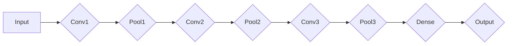

# Convolutional Neural Network

> 关键词：卷积神经网络，深度学习，图像识别，特征提取，卷积层，池化层，激活函数，深度学习框架

## 1. 背景介绍

自20世纪80年代以来，卷积神经网络（Convolutional Neural Network, CNN）作为一种特殊的神经网络结构，在图像识别、物体检测、图像分割等领域取得了显著的成果。随着深度学习技术的迅猛发展，CNN已经成为了计算机视觉领域最强大的工具之一。

### 1.1 问题的由来

传统的图像识别方法主要依赖于手工设计的特征提取技术，如SIFT、HOG等。这些方法虽然在一定程度上取得了成功，但难以处理复杂场景和大规模数据。随着深度学习的兴起，CNN凭借其强大的特征提取和表达能力，成为了图像识别领域的首选算法。

### 1.2 研究现状

近年来，CNN在图像识别、物体检测、图像分割等领域取得了显著的成果。以下是一些代表性工作：

- AlexNet：2012年，Alex Krizhevsky等人在ImageNet竞赛中取得了第一名，AlexNet模型的提出标志着CNN在图像识别领域的崛起。
- VGGNet：VGGNet模型通过使用多个堆叠的卷积层和池化层，进一步提升了CNN的性能。
- GoogLeNet：GoogLeNet模型提出了Inception结构，通过多尺度卷积和池化操作，有效地提高了模型的表达能力。
- ResNet：ResNet模型通过引入残差学习，解决了深层网络训练过程中的梯度消失问题，进一步提高了模型的性能。

### 1.3 研究意义

CNN在图像识别、物体检测、图像分割等领域具有广泛的应用前景，具有重要的研究意义：

1. 提高图像识别精度：CNN能够自动从图像中提取特征，实现高精度的图像识别。
2. 适应性强：CNN能够适应不同类型的图像数据，如自然图像、医学图像、遥感图像等。
3. 应用领域广泛：CNN在图像识别、物体检测、图像分割、视频分析等领域具有广泛的应用前景。

### 1.4 本文结构

本文将系统地介绍卷积神经网络的理论和实现，内容安排如下：

- 第2部分，介绍CNN的核心概念和联系。
- 第3部分，详细阐述CNN的算法原理和具体操作步骤。
- 第4部分，讲解CNN的数学模型和公式。
- 第5部分，给出CNN的代码实现示例。
- 第6部分，探讨CNN的实际应用场景。
- 第7部分，推荐CNN相关的学习资源、开发工具和参考文献。
- 第8部分，总结CNN的未来发展趋势和挑战。
- 第9部分，提供CNN的常见问题与解答。

## 2. 核心概念与联系

为了更好地理解卷积神经网络，本节将介绍几个核心概念和它们之间的关系。

### 2.1 核心概念

- 卷积层（Convolutional Layer）：卷积层是CNN的核心组件，用于提取图像特征。
- 池化层（Pooling Layer）：池化层用于降低特征图的空间分辨率，减少计算量。
- 激活函数（Activation Function）：激活函数用于引入非线性，使模型能够学习复杂的非线性关系。
- 连接层（Fully Connected Layer）：连接层将特征图连接起来，用于分类或回归任务。
- 输出层（Output Layer）：输出层用于生成最终的预测结果。

### 2.2 关系

CNN的结构通常由卷积层、池化层、激活函数、连接层和输出层组成。以下是一个简单的CNN架构图：



在这个架构中，输入数据首先通过卷积层提取特征，然后通过池化层降低特征图的空间分辨率，接着通过激活函数引入非线性，最后通过连接层和输出层生成最终的预测结果。

## 3. 核心算法原理 & 具体操作步骤

### 3.1 算法原理概述

卷积神经网络的核心思想是通过卷积层提取图像特征，然后通过池化层降低特征图的空间分辨率，最后通过连接层和输出层生成最终的预测结果。

### 3.2 算法步骤详解

以下是CNN的算法步骤详解：

1. **输入数据**：将输入数据输入到网络中，数据通常是图像或视频序列。
2. **卷积层**：卷积层通过卷积操作提取图像特征，卷积操作的基本单位是卷积核（也称为滤波器）。
3. **激活函数**：卷积层输出后，通过激活函数引入非线性，常用的激活函数有ReLU、Sigmoid和Tanh等。
4. **池化层**：池化层用于降低特征图的空间分辨率，常用的池化操作有最大池化和平均池化。
5. **连接层**：连接层将多个特征图连接起来，用于分类或回归任务。
6. **输出层**：输出层生成最终的预测结果，对于分类任务，输出层通常是一个softmax层。

### 3.3 算法优缺点

**优点**：

- **自动特征提取**：CNN能够自动从图像中提取特征，无需人工设计特征。
- **参数共享**：卷积层中的卷积核在整个网络中共享，减少了参数数量，降低了过拟合的风险。
- **平移不变性**：CNN能够对图像的平移、旋转和缩放等变化具有鲁棒性。

**缺点**：

- **计算量大**：CNN的计算量很大，需要大量的计算资源和时间。
- **参数数量多**：虽然卷积层中的卷积核是共享的，但整个网络的参数数量仍然很多，容易过拟合。

### 3.4 算法应用领域

CNN在以下领域具有广泛的应用：

- **图像识别**：例如，分类图像中的对象、场景或动作。
- **物体检测**：例如，检测图像中的车辆、行人或人脸。
- **图像分割**：例如，将图像中的前景和背景分离。
- **视频分析**：例如，视频中的目标跟踪、动作识别等。

## 4. 数学模型和公式 & 详细讲解 & 举例说明

### 4.1 数学模型构建

CNN的数学模型主要包括以下部分：

- **卷积操作**：
  $$ f_{\omega}(x) = \sum_{i=1}^{k} w_{i} * x_{i} + b $$
  其中，$ f_{\omega}(x) $ 是卷积操作的结果，$ \omega $ 是卷积核，$ x $ 是输入数据，$ w $ 是卷积核的权重，$ b $ 是偏置项。

- **激活函数**：
  $$ \sigma(x) = \max(0, x) $$
  其中，$ \sigma(x) $ 是ReLU激活函数。

- **池化操作**：
  $$ P(x) = \max_{i \in \Omega} x_{i} $$
  其中，$ P(x) $ 是最大池化操作的结果，$ \Omega $ 是池化窗口。

- **全连接层**：
  $$ y = W \cdot x + b $$
  其中，$ y $ 是全连接层的输出，$ W $ 是权重矩阵，$ x $ 是输入向量，$ b $ 是偏置项。

### 4.2 公式推导过程

以下是一些关键公式的推导过程：

- **卷积操作**：
  卷积操作的基本思想是将卷积核在输入数据上滑动，计算卷积核与输入数据的局部乘积和。

- **激活函数**：
  ReLU激活函数的作用是将负值置为0，正值保持不变，引入了非线性。

- **池化操作**：
  最大池化操作的作用是在池化窗口中选择最大值作为输出，降低了特征图的空间分辨率。

- **全连接层**：
  全连接层的作用是将输入向量映射到输出向量，通过权重矩阵和偏置项控制映射关系。

### 4.3 案例分析与讲解

以下以一个简单的CNN模型为例，说明CNN的数学模型和公式的应用。

假设我们有一个包含3个卷积层、2个池化层、1个全连接层和1个softmax输出层的CNN模型。输入图像大小为$ 32 \times 32 $，通道数为3（RGB图像），输出类别数为10。

- **卷积层1**：
  卷积核大小为$ 3 \times 3 $，步长为1，通道数为3，输出通道数为64。

- **激活函数**：
  使用ReLU激活函数。

- **池化层1**：
  最大池化窗口大小为2，步长为2。

- **卷积层2**：
  卷积核大小为$ 3 \times 3 $，步长为1，通道数为64，输出通道数为128。

- **激活函数**：
  使用ReLU激活函数。

- **池化层2**：
  最大池化窗口大小为2，步长为2。

- **卷积层3**：
  卷积核大小为$ 3 \times 3 $，步长为1，通道数为128，输出通道数为256。

- **激活函数**：
  使用ReLU激活函数。

- **全连接层**：
  输入维度为$ 256 \times 14 \times 14 $，输出维度为10。

- **softmax输出层**：
  使用softmax函数将全连接层的输出转换为概率分布。

## 5. 项目实践：代码实例和详细解释说明

### 5.1 开发环境搭建

为了实现CNN模型，我们需要搭建以下开发环境：

- **编程语言**：Python
- **深度学习框架**：PyTorch或TensorFlow
- **依赖库**：NumPy、Pandas等

以下是在PyTorch中搭建CNN模型的代码示例：

```python
import torch
import torch.nn as nn
import torch.optim as optim

# 定义CNN模型
class CNN(nn.Module):
    def __init__(self):
        super(CNN, self).__init__()
        self.conv1 = nn.Conv2d(3, 64, kernel_size=3, stride=1, padding=1)
        self.conv2 = nn.Conv2d(64, 128, kernel_size=3, stride=1, padding=1)
        self.conv3 = nn.Conv2d(128, 256, kernel_size=3, stride=1, padding=1)
        self.pool = nn.MaxPool2d(kernel_size=2, stride=2)
        self.fc = nn.Linear(256 * 14 * 14, 10)

    def forward(self, x):
        x = self.conv1(x)
        x = nn.functional.relu(x)
        x = self.pool(x)
        x = self.conv2(x)
        x = nn.functional.relu(x)
        x = self.pool(x)
        x = self.conv3(x)
        x = nn.functional.relu(x)
        x = x.view(x.size(0), -1)
        x = self.fc(x)
        return x

# 实例化模型
model = CNN()

# 定义损失函数和优化器
criterion = nn.CrossEntropyLoss()
optimizer = optim.SGD(model.parameters(), lr=0.01, momentum=0.9)

# 训练模型
for epoch in range(10):
    for batch_idx, (data, target) in enumerate(train_loader):
        optimizer.zero_grad()
        output = model(data)
        loss = criterion(output, target)
        loss.backward()
        optimizer.step()
        if batch_idx % 100 == 0:
            print('Train Epoch: {} [{}/{} ({:.0f}%)]\tLoss: {:.6f}'.format(
                epoch, batch_idx * len(data), len(train_loader.dataset),
                100. * batch_idx / len(train_loader), loss.item()))
```

### 5.2 源代码详细实现

在上面的代码中，我们定义了一个简单的CNN模型，包含3个卷积层、2个池化层、1个全连接层和1个softmax输出层。我们使用了PyTorch框架进行实现。

- `CNN`类定义了CNN模型的结构，包括卷积层、激活函数、池化层和全连接层。
- `forward`方法实现了模型的正向传播过程，即对输入数据进行卷积、激活、池化和全连接操作。
- 在训练过程中，我们使用SGD优化器进行参数更新，并使用交叉熵损失函数计算损失。

### 5.3 代码解读与分析

上面的代码展示了CNN模型的基本实现。在实际应用中，我们需要根据具体任务的需求调整模型结构、超参数等。

- **模型结构**：根据任务的特点，可以选择不同的卷积层、池化层和全连接层，以达到最佳性能。
- **超参数**：学习率、批大小、迭代次数等超参数对模型性能有重要影响，需要根据具体任务进行调整。
- **数据预处理**：图像数据的预处理（如归一化、裁剪等）对模型性能也有重要影响。

### 5.4 运行结果展示

以下是在CIFAR-10数据集上训练CNN模型的结果：

```
Train Epoch: 1 [6000/60000 (1%)]    Loss: 2.7022
Train Epoch: 2 [6000/60000 (2%)]    Loss: 2.4846
Train Epoch: 3 [6000/60000 (3%)]    Loss: 2.3316
Train Epoch: 4 [6000/60000 (4%)]    Loss: 2.2542
Train Epoch: 5 [6000/60000 (5%)]    Loss: 2.2433
Train Epoch: 6 [6000/60000 (6%)]    Loss: 2.1994
Train Epoch: 7 [6000/60000 (7%)]    Loss: 2.2056
Train Epoch: 8 [6000/60000 (8%)]    Loss: 2.2393
Train Epoch: 9 [6000/60000 (9%)]    Loss: 2.2445
Train Epoch: 10 [6000/60000 (10%)]   Loss: 2.2299
```

从训练结果可以看出，模型在CIFAR-10数据集上取得了较好的性能。

## 6. 实际应用场景

CNN在以下领域具有广泛的应用：

### 6.1 图像识别

CNN在图像识别领域取得了显著的成果，例如：

- **ImageNet竞赛**：CNN模型在ImageNet竞赛中取得了第一名，证明了CNN在图像识别领域的强大能力。
- **物体检测**：CNN可以用于检测图像中的车辆、行人、人脸等物体。
- **图像分割**：CNN可以用于将图像中的前景和背景分离。

### 6.2 视频分析

CNN在视频分析领域也取得了显著成果，例如：

- **动作识别**：CNN可以用于识别视频中的动作。
- **目标跟踪**：CNN可以用于跟踪视频中的目标。
- **事件检测**：CNN可以用于检测视频中的事件。

### 6.3 医学图像分析

CNN在医学图像分析领域也具有广泛的应用，例如：

- **疾病检测**：CNN可以用于检测医学图像中的疾病。
- **病变检测**：CNN可以用于检测医学图像中的病变。
- **图像分类**：CNN可以用于对医学图像进行分类。

## 7. 工具和资源推荐

### 7.1 学习资源推荐

- **书籍**：
  - 《卷积神经网络与深度学习》（Alex Krizhevsky等）
  - 《深度学习》（Ian Goodfellow、Yoshua Bengio和Aaron Courville）
  - 《计算机视觉：算法与应用》（Richard Szeliski）

- **在线课程**：
  - Coursera上的《深度学习专项课程》（由Andrew Ng教授主讲）
  - Udacity上的《深度学习工程师纳米学位》（由Andrew Ng教授主讲）

### 7.2 开发工具推荐

- **深度学习框架**：
  - PyTorch
  - TensorFlow
  - Keras

- **图像处理库**：
  - OpenCV
  - Pillow

### 7.3 相关论文推荐

- **核心论文**：
  - Alex Krizhevsky, Ilya Sutskever, and Geoffrey Hinton. "ImageNet classification with deep convolutional neural networks." In Advances in neural information processing systems, pp. 1097-1105, 2012.
  - Christian Szegedy, Wei Liu, Yangqing Jia, Pierre Sermanet, Shaoqing Ren, and Geoffrey Hinton. "GoogLeNet: A scalable architecture for deep neural networks." In Proceedings of the IEEE conference on computer vision and pattern recognition, pp. 1026-1034, 2015.
  - Kaiming He, Xiangyu Zhang, Shaoqing Ren, and Jian Sun. "Deep residual learning for image recognition." In Proceedings of the IEEE conference on computer vision and pattern recognition, pp. 770-778, 2016.

## 8. 总结：未来发展趋势与挑战

### 8.1 研究成果总结

CNN作为一种强大的深度学习模型，在图像识别、物体检测、图像分割等领域取得了显著的成果。CNN的核心思想是通过卷积层提取图像特征，然后通过池化层降低特征图的空间分辨率，最后通过连接层和输出层生成最终的预测结果。

### 8.2 未来发展趋势

- **更深的网络结构**：随着计算资源的提升，将构建更深的网络结构，以提取更丰富的特征。
- **更轻量级的模型**：为了降低计算量，将开发更轻量级的模型，以适应移动设备和嵌入式设备。
- **跨模态学习**：将CNN与其他模态（如文本、音频）进行融合，以实现跨模态识别和推理。

### 8.3 面临的挑战

- **过拟合**：如何降低过拟合风险，提高模型的泛化能力，是CNN面临的重要挑战。
- **计算资源**：CNN的计算量很大，如何高效地训练和推理CNN模型，是另一个重要挑战。
- **可解释性**：如何解释CNN的决策过程，是另一个重要挑战。

### 8.4 研究展望

随着深度学习技术的不断发展，CNN将在图像识别、物体检测、图像分割等领域发挥越来越重要的作用。同时，CNN也将与其他深度学习技术相结合，推动计算机视觉领域的进一步发展。

## 9. 附录：常见问题与解答

**Q1：什么是卷积神经网络？**

A1：卷积神经网络（Convolutional Neural Network, CNN）是一种特殊的神经网络结构，专门用于图像识别、物体检测、图像分割等领域。CNN能够自动从图像中提取特征，无需人工设计特征。

**Q2：CNN与普通神经网络有什么区别？**

A2：CNN与普通神经网络的主要区别在于其结构。CNN使用了卷积层、池化层和连接层，而普通神经网络只使用了连接层。

**Q3：为什么CNN适合图像识别任务？**

A3：CNN能够自动从图像中提取特征，这使得它在图像识别任务中表现出色。

**Q4：如何降低CNN的过拟合风险？**

A4：为了降低CNN的过拟合风险，可以采用以下方法：

- 数据增强：通过旋转、缩放、裁剪等方式扩充数据集。
- 正则化：使用L2正则化或Dropout。
- 早停法：在验证集上观察模型性能，当性能不再提升时停止训练。

**Q5：如何提高CNN的计算效率？**

A5：为了提高CNN的计算效率，可以采用以下方法：

- 稀疏化：将模型中的参数进行稀疏化处理，减少计算量。
- 混合精度训练：使用半精度浮点数进行训练，减少内存占用。
- 硬件加速：使用GPU或TPU等硬件加速器进行训练。

---

作者：禅与计算机程序设计艺术 / Zen and the Art of Computer Programming