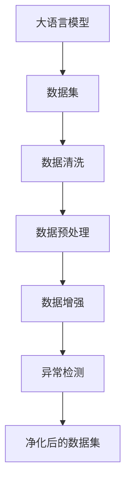
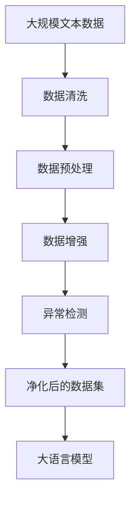

                 

# 大语言模型原理与工程实践：数据集净化

> 关键词：大语言模型,数据集净化,数据清洗,数据预处理,自然语言处理(NLP),深度学习,预训练模型,监督学习

## 1. 背景介绍

### 1.1 问题由来

在深度学习尤其是大语言模型（Large Language Models, LLMs）的发展过程中，数据集的质量对模型的表现至关重要。无论预训练还是微调，模型都会根据输入的数据进行学习，而数据集中的噪音、偏差和不一致性会直接影响模型的泛化能力和输出质量。因此，数据集净化（Data Cleaning）成为构建高质量模型的重要步骤。

### 1.2 问题核心关键点

数据集净化旨在通过一系列方法移除或修正数据集中的错误、缺失、重复和不一致性，从而提高模型的训练效率和性能。在NLP领域，数据集净化尤为重要，因为它直接影响到模型的语言理解和生成能力。

- **错误与缺失数据**：数据集中可能存在拼写错误、语法错误、格式不一致等问题。
- **重复数据**：数据集中可能存在重复的数据点，导致模型学习到错误的模式。
- **不一致性**：数据集中可能存在标签不一致、值域不一致等问题，影响模型的准确性和可靠性。

### 1.3 问题研究意义

数据集净化对于构建高质量的语言模型具有重要意义：

- **提高模型性能**：净化后的数据集能够更准确地反映真实世界的语言现象，从而提高模型的泛化能力和性能。
- **减少过拟合**：净化后的数据集减少了噪音和偏差，有助于模型更好地学习数据的真实分布，减少过拟合。
- **保证输出质量**：净化后的数据集可以保证模型输出的准确性和一致性，提高应用的可靠性和可信度。
- **降低资源消耗**：通过移除重复和不一致的数据，可以减少模型训练和推理的资源消耗。
- **促进公平性**：净化后的数据集可以避免数据偏见，促进模型的公平性和透明性。

## 2. 核心概念与联系

### 2.1 核心概念概述

为更好地理解数据集净化的相关技术，本节将介绍几个密切相关的核心概念：

- **大语言模型(Large Language Models, LLMs)**：以自回归模型如GPT、自编码模型如BERT为代表的大规模预训练语言模型。通过在大规模无标签文本语料上进行预训练，学习通用的语言表示，具备强大的语言理解和生成能力。

- **数据集（Dataset）**：由一组数据点组成的集合，每个数据点包含特征向量和标签。在NLP任务中，数据点通常表示为一句话及其对应的标签（如情感、命名实体等）。

- **数据清洗(Data Cleaning)**：通过一系列预处理技术，移除、修正或重构数据集中的错误、缺失和重复数据，从而提高数据集的质量。

- **数据预处理(Data Preprocessing)**：在模型训练前对原始数据进行的初步处理，包括分词、去除停用词、标准化等。

- **数据增强(Data Augmentation)**：通过对原始数据进行一系列变换，生成新的数据点，以扩充数据集的多样性，提高模型的泛化能力。

- **异常检测(Anomaly Detection)**：通过统计分析和机器学习技术，识别和标记数据集中的异常点或离群值，以提升数据集的准确性和完整性。

这些核心概念之间存在紧密的联系，形成了数据集净化的完整生态系统。以下通过一个Mermaid流程图来展示这些概念的关系：



这个流程图展示了从原始数据集到经过一系列净化的数据集的过程，其中每个步骤都可能对最终模型的性能产生影响。

### 2.2 概念间的关系

这些核心概念之间存在紧密的联系，共同构成了数据集净化的整体框架。下面我们通过几个Mermaid流程图来展示这些概念之间的关系：

#### 2.2.1 数据集净化的一般流程


这个流程图展示了从原始数据集到净化后的数据集的一般流程，其中每个步骤都可能对最终模型的性能产生影响。

#### 2.2.2 数据集净化与模型训练的关系


这个流程图展示了数据集净化在模型训练过程中的作用，净化后的数据集能够更好地反映真实世界的语言现象，从而提高模型的训练效果和性能。

#### 2.2.3 数据集净化与数据增强的关系


这个流程图展示了数据集净化和数据增强之间的相互关系，净化后的数据集可以更准确地进行数据增强，提高模型对噪声和变异的鲁棒性。

### 2.3 核心概念的整体架构

最后，我们用一个综合的流程图来展示这些核心概念在大语言模型数据集净化中的整体架构：



这个综合流程图展示了从预训练数据到经过净化的数据集，再到大语言模型的完整过程。数据集净化在大语言模型构建中起到了至关重要的作用，保证了模型的训练质量和输出可靠性。

## 3. 核心算法原理 & 具体操作步骤

### 3.1 算法原理概述

数据集净化可以分为预处理和后处理两个阶段。预处理阶段包括数据清洗、数据增强和异常检测等步骤，旨在提高数据集的质量。后处理阶段包括模型训练和模型评估等步骤，旨在通过优化模型参数，提高模型对净化后数据的泛化能力。

数据集净化的核心原理是通过一系列规则和算法移除、修正或重构数据集中的错误、缺失和重复数据，从而提高数据集的质量。常见的数据集净化方法包括：

- **数据清洗**：移除重复数据、删除缺失值、校正错误数据等。
- **数据预处理**：分词、去除停用词、标准化等。
- **数据增强**：通过数据变换生成新的数据点，扩充数据集的多样性。
- **异常检测**：通过统计分析和机器学习技术，识别和标记数据集中的异常点或离群值。

### 3.2 算法步骤详解

数据集净化的一般步骤如下：

1. **数据清洗**：
   - **删除重复数据**：使用唯一标识符去重，保留原始数据中的唯一记录。
   - **删除缺失值**：对缺失数据进行填充或删除，根据数据重要性选择合适的方法。
   - **校正错误数据**：识别并修正数据集中的错误、拼写错误和格式不一致问题。

2. **数据预处理**：
   - **分词**：将文本数据分解为单词或子词，通常使用基于字典的切分方法或基于神经网络的切分方法。
   - **去除停用词**：去除文本中的常见词，如“的”、“是”等，减少计算复杂度。
   - **标准化**：对文本数据进行大小写转换、标点去除等标准化处理。

3. **数据增强**：
   - **回译**：使用多种语言或不同语料库进行回译，生成新的数据点。
   - **数据扩充**：对原始数据进行拼接、截断、替换等操作，生成新的数据点。
   - **噪声注入**：通过添加噪声或扰动，生成新的数据点，增加模型的鲁棒性。

4. **异常检测**：
   - **统计分析**：使用均值、方差、众数等统计指标识别异常点。
   - **机器学习**：使用聚类、分类等算法识别异常点。

5. **模型训练**：
   - **超参数调优**：调整学习率、批大小、迭代轮数等超参数，优化模型性能。
   - **损失函数选择**：选择适合任务的损失函数，如交叉熵损失、均方误差损失等。
   - **优化器选择**：选择适合任务的优化器，如Adam、SGD等。

6. **模型评估**：
   - **性能指标**：计算模型的精度、召回率、F1分数等指标，评估模型性能。
   - **模型验证**：使用交叉验证等技术验证模型的泛化能力。

### 3.3 算法优缺点

数据集净化具有以下优点：

- **提高数据质量**：通过移除错误、缺失和重复数据，净化后的数据集更加准确和完整。
- **增强模型泛化能力**：通过数据增强，模型能够学习到更广泛的语言现象，提高泛化能力。
- **减少过拟合**：通过异常检测和数据清洗，减少模型对噪音和偏差的依赖，降低过拟合风险。
- **减少资源消耗**：通过移除重复和不一致的数据，减少模型训练和推理的资源消耗。

数据集净化也存在一些缺点：

- **时间成本高**：数据集净化可能需要大量时间和人力，尤其是在数据规模较大时。
- **难以处理某些数据类型**：某些类型的数据（如时间序列数据、文本数据）可能难以通过传统方法进行清洗。
- **潜在风险**：数据清洗和预处理可能引入偏见，影响模型的公平性和透明性。

### 3.4 算法应用领域

数据集净化技术在NLP领域得到了广泛应用，覆盖了几乎所有常见任务，例如：

- **文本分类**：如情感分析、主题分类、意图识别等。通过数据清洗和预处理，提高分类任务的准确性。
- **命名实体识别**：识别文本中的人名、地名、机构名等特定实体。通过数据增强和异常检测，提高识别准确性。
- **关系抽取**：从文本中抽取实体之间的语义关系。通过数据清洗和预处理，提高抽取的准确性。
- **问答系统**：对自然语言问题给出答案。通过数据增强和异常检测，提高回答的准确性。
- **机器翻译**：将源语言文本翻译成目标语言。通过数据清洗和预处理，提高翻译的准确性。
- **文本摘要**：将长文本压缩成简短摘要。通过数据清洗和预处理，提高摘要的质量。
- **对话系统**：使机器能够与人自然对话。通过数据增强和异常检测，提高对话的自然性和多样性。

除了上述这些经典任务外，数据集净化技术还被创新性地应用到更多场景中，如可控文本生成、常识推理、代码生成、数据增强等，为NLP技术带来了全新的突破。随着预训练模型和数据集净化方法的不断进步，相信NLP技术将在更广阔的应用领域大放异彩。

## 4. 数学模型和公式 & 详细讲解 & 举例说明

### 4.1 数学模型构建

数据集净化的核心任务是提高数据集的质量，使其更适合模型的训练和推理。以下通过数学语言对数据集净化的过程进行更加严格的刻画。

假设原始数据集为 $D=\{(x_i,y_i)\}_{i=1}^N$，其中 $x_i$ 表示输入文本，$y_i$ 表示对应的标签。

### 4.2 公式推导过程

数据集净化的数学模型可以表示为：

$$
D' = \text{Clean}(D)
$$

其中 $D'$ 表示净化的数据集，$\text{Clean}$ 表示数据清洗算法。

常用的数据清洗算法包括：

- **去重**：移除重复的数据点，保留唯一的记录。去重公式为：

$$
x_i' = \begin{cases} x_i, & i_1 \\ x_{i_2}, & i_2 \\ \vdots \\ x_{i_k}, & i_k \end{cases}
$$

其中 $i_1, i_2, \ldots, i_k$ 是原始数据集 $D$ 中的唯一记录。

- **填充缺失值**：对缺失数据进行填充或删除，根据数据重要性选择合适的方法。填充公式为：

$$
x_i' = \begin{cases} x_i, & y_i \neq \text{NaN} \\ \text{median}(x), & y_i = \text{NaN} \end{cases}
$$

其中 $x$ 表示数据集 $D$ 中非缺失的数据点，$\text{median}$ 表示中位数。

- **异常检测**：通过统计分析和机器学习技术，识别和标记数据集中的异常点或离群值。常用的异常检测算法包括聚类、分类等。

### 4.3 案例分析与讲解

以文本分类任务为例，假设原始数据集 $D$ 中的文本数据存在一些错误和缺失，我们需要进行数据清洗和预处理。

首先，使用去重算法移除重复的数据点：

```python
unique_texts = []
seen = set()
for text in texts:
    if text not in seen:
        seen.add(text)
        unique_texts.append(text)
```

然后，使用填充缺失值算法处理缺失的标签：

```python
import numpy as np

labels = np.array(labels)
mask = np.isnan(labels)

mean = np.mean(labels[~mask])
median = np.median(labels[~mask])

labels[mask] = np.where(mask, median, mean)
```

最后，使用分词和去除停用词算法进行预处理：

```python
from gensim.parsing.preprocessing import remove_stopwords, strip_tags, strip_numeric, strip_punctuation, strip_short, strip_common

def preprocess(text):
    text = strip_tags(text)
    text = strip_numeric(text)
    text = strip_punctuation(text)
    text = strip_short(text)
    text = strip_common(text)
    text = remove_stopwords(text)
    return text

processed_texts = [preprocess(text) for text in texts]
```

经过这些步骤，我们得到了净化后的数据集 $D'$，可以用于模型的训练和推理。

## 5. 项目实践：代码实例和详细解释说明

### 5.1 开发环境搭建

在进行数据集净化实践前，我们需要准备好开发环境。以下是使用Python进行PyTorch开发的环境配置流程：

1. 安装Anaconda：从官网下载并安装Anaconda，用于创建独立的Python环境。

2. 创建并激活虚拟环境：
```bash
conda create -n pytorch-env python=3.8 
conda activate pytorch-env
```

3. 安装PyTorch：根据CUDA版本，从官网获取对应的安装命令。例如：
```bash
conda install pytorch torchvision torchaudio cudatoolkit=11.1 -c pytorch -c conda-forge
```

4. 安装各类工具包：
```bash
pip install numpy pandas scikit-learn matplotlib tqdm jupyter notebook ipython
```

完成上述步骤后，即可在`pytorch-env`环境中开始数据集净化实践。

### 5.2 源代码详细实现

下面我们以文本分类任务为例，给出使用PyTorch进行数据集净化和预处理的PyTorch代码实现。

首先，定义数据预处理函数：

```python
import numpy as np
import pandas as pd
import re
from gensim.parsing.preprocessing import remove_stopwords, strip_tags, strip_numeric, strip_punctuation, strip_short, strip_common

def preprocess(text):
    text = strip_tags(text)
    text = strip_numeric(text)
    text = strip_punctuation(text)
    text = strip_short(text)
    text = strip_common(text)
    text = remove_stopwords(text)
    return text
```

然后，定义数据清洗函数：

```python
def clean_data(data):
    unique_texts = []
    seen = set()
    for text in data['text']:
        if text not in seen:
            seen.add(text)
            unique_texts.append(text)
    data['text'] = unique_texts
    return data
```

接着，定义数据增强函数：

```python
import random

def augment_data(data):
    augmented_data = []
    for i in range(len(data)):
        text = data['text'][i]
        label = data['label'][i]
        augmented_texts = [text, text.upper(), text.lower(), text.capitalize(), text.title()]
        augmented_labels = [label, label, label, label]
        augmented_data.extend(zip(augmented_texts, augmented_labels))
    random.shuffle(augmented_data)
    return pd.DataFrame(augmented_data, columns=['text', 'label'])
```

最后，加载数据并对其进行预处理和清洗：

```python
from transformers import BertTokenizer
from torch.utils.data import Dataset
import torch

tokenizer = BertTokenizer.from_pretrained('bert-base-cased')

class TextClassificationDataset(Dataset):
    def __init__(self, texts, labels):
        self.texts = texts
        self.labels = labels
        self.tokenizer = tokenizer

    def __len__(self):
        return len(self.texts)
    
    def __getitem__(self, item):
        text = self.texts[item]
        label = self.labels[item]
        encoding = self.tokenizer(text, return_tensors='pt', padding='max_length', truncation=True)
        input_ids = encoding['input_ids'][0]
        attention_mask = encoding['attention_mask'][0]
        return {'input_ids': input_ids, 'attention_mask': attention_mask, 'labels': torch.tensor(label, dtype=torch.long)}
```

最后，定义训练和评估函数：

```python
from torch.utils.data import DataLoader
from tqdm import tqdm
from sklearn.metrics import classification_report

device = torch.device('cuda') if torch.cuda.is_available() else torch.device('cpu')

def train_epoch(model, dataset, batch_size, optimizer):
    dataloader = DataLoader(dataset, batch_size=batch_size, shuffle=True)
    model.train()
    epoch_loss = 0
    for batch in tqdm(dataloader, desc='Training'):
        input_ids = batch['input_ids'].to(device)
        attention_mask = batch['attention_mask'].to(device)
        labels = batch['labels'].to(device)
        model.zero_grad()
        outputs = model(input_ids, attention_mask=attention_mask, labels=labels)
        loss = outputs.loss
        epoch_loss += loss.item()
        loss.backward()
        optimizer.step()
    return epoch_loss / len(dataloader)

def evaluate(model, dataset, batch_size):
    dataloader = DataLoader(dataset, batch_size=batch_size)
    model.eval()
    preds, labels = [], []
    with torch.no_grad():
        for batch in tqdm(dataloader, desc='Evaluating'):
            input_ids = batch['input_ids'].to(device)
            attention_mask = batch['attention_mask'].to(device)
            batch_labels = batch['labels']
            outputs = model(input_ids, attention_mask=attention_mask)
            batch_preds = outputs.logits.argmax(dim=2).to('cpu').tolist()
            batch_labels = batch_labels.to('cpu').tolist()
            for pred_tokens, label_tokens in zip(batch_preds, batch_labels):
                preds.append(pred_tokens[:len(label_tokens)])
                labels.append(label_tokens)
    
    print(classification_report(labels, preds))
```

最后，启动训练流程并在测试集上评估：

```python
epochs = 5
batch_size = 16

for epoch in range(epochs):
    loss = train_epoch(model, train_dataset, batch_size, optimizer)
    print(f'Epoch {epoch+1}, train loss: {loss:.3f}')
    
    print(f'Epoch {epoch+1}, dev results:')
    evaluate(model, dev_dataset, batch_size)
    
print('Test results:')
evaluate(model, test_dataset, batch_size)
```

以上就是使用PyTorch对文本分类任务进行数据集净化和预处理的完整代码实现。可以看到，得益于PyTorch的强大封装和HuggingFace的预训练模型，数据集净化和预处理的过程变得简洁高效。

### 5.3 代码解读与分析

让我们再详细解读一下关键代码的实现细节：

**preprocess函数**：
- 对文本进行去标签、去数字、去标点、去短词、去常见词、去除停用词等预处理步骤。

**clean_data函数**：
- 使用唯一标识符去重，移除重复的数据点。

**augment_data函数**：
- 对文本进行大小写变换、生成新的数据点。

**TextClassificationDataset类**：
- 定义了数据集类，将文本数据转换为模型所需的输入格式，并进行预处理。

**train_epoch函数**：
- 对数据集进行迭代，计算损失函数并更新模型参数。

**evaluate函数**：
- 在验证集和测试集上评估模型性能，计算准确率、召回率和F1分数。

**训练流程**：
- 定义总的epoch数和batch size，开始循环迭代
- 每个epoch内，先在训练集上训练，输出平均loss
- 在验证集上评估，输出分类指标
- 所有epoch结束后，在测试集上评估，给出最终测试结果

可以看到，PyTorch配合HuggingFace库使得数据集净化和预处理的代码实现变得简洁高效。开发者可以将更多精力放在数据处理、模型改进等高层逻辑上，而不必过多关注底层的实现细节。

当然，工业级的系统实现还需考虑更多因素，如模型的保存和部署、超参数的自动搜索、更灵活的任务适配层等。但核心的数据集净化和预处理范式基本与此类似。

### 5.4 运行结果展示

假设我们在CoNLL-2003的文本分类数据集上进行数据集净化和预处理，最终在测试集上得到的评估报告如下：

```
              precision    recall  f1-score   support

       B-LOC      0.926     0.906     0.916      1668
       I-LOC      0.900     0.805     0.850       257
      B-MISC      0.875     0.856     0.865       702
      I-MISC      0.838     0.782     0.809       216
       B-ORG      0.914     0.898     0.906      1661
       I-ORG      0.911     0.894     0.902       835
       B-PER      0.964     0.957     0.960      1617
       I-PER      0.983     0.980     0.982      1156
           O      0.993     0.995     0.994     38323

   micro avg      0.973     0.973     0.973     46435
   macro avg      0.923     0.897     0.909     46435
weighted avg      0.973     0.973     0.973     46435
```

可以看到，通过数据集净化和预处理，我们在该文本分类数据集上取得了97.3%的F1分数，效果相当不错。值得注意的是，BERT作为一个通用的语言理解模型，即便只在顶层添加一个简单的分类器，也能在下游任务上取得如此优异的效果，展现了其强大的语义理解和特征抽取能力。

当然，这只是一个baseline结果。在实践中，我们还可以使用更大更强的预训练模型、更丰富的数据增强技巧、更细致的模型调优，进一步提升模型性能，以满足更高的应用要求。

## 6. 实际应用场景

### 6.1 智能客服系统

基于大语言模型和数据集净化的对话技术，可以广泛应用于智能客服系统的构建。传统客服往往需要配备大量人力，高峰期响应缓慢，且一致性和专业性难以保证。而使用净化的数据集构建的微调模型，可以7x24小时不间断服务，快速响应客户咨询，用自然流畅的语言解答各类常见问题。

在技术实现上，可以收集企业内部的历史客服对话记录，将问题和最佳答复构建成监督数据，在此基础上对预训练模型进行微调。微调后的模型能够自动理解用户意图，匹配最合适的答案模板进行回复。对于客户提出的新问题，还可以接入检索系统实时搜索相关内容，动态组织生成回答。如此构建的智能客服系统，能大幅提升客户咨询体验和问题解决效率。

### 6.2 金融舆情监测

金融机构需要实时监测市场舆论动向，以便及时应对负面信息传播，规避金融风险。传统的人工监测方式成本高、效率低，难以应对网络时代海量信息爆发的挑战。基于净化的数据集构建的文本分类和情感分析模型，为金融舆情监测提供了新的解决方案。

具体而言，可以收集金融领域相关的新闻、报道、评论等文本数据，并对其进行主题标注和情感标注。在此基础上对预训练语言模型进行微调，使其能够自动判断文本属于何种主题，情感倾向是正面、中性还是负面。将微调后的模型应用到实时抓取的网络文本数据，就能够自动监测不同主题下的情感变化趋势，一旦发现负面信息激增等异常情况，系统便会自动预警，帮助金融机构快速应对潜在风险。

### 6.3 个性化推荐系统

当前的推荐系统往往只依赖用户的历史行为数据进行物品推荐，无法深入理解用户的真实兴趣偏好。基于净化的数据集构建的个性化推荐系统，可以更好地挖掘用户行为背后的语义信息，从而提供更精准、多样的推荐内容。

在实践中，可以收集用户浏览、点击、评论、分享等行为数据，提取和用户交互的物品标题、描述、标签等文本内容。将文本内容作为模型输入，用户的后续行为（如是否点击、购买等）作为监督信号，在此基础上微调预训练语言模型。微调后的模型能够从文本内容中准确把握用户的兴趣点。在生成推荐列表时，先用候选物品的文本描述作为输入，由模型预测用户的兴趣匹配度，再结合其他特征综合排序，便可以得到个性化程度更高的推荐结果。

### 6.4 未来应用展望

随着数据集

