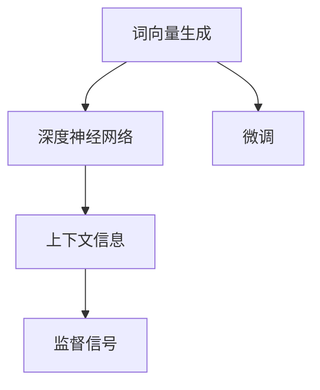

                 

# 基于深度神经网络的高质量词向量生成方法研究

> 关键词：词向量生成,深度神经网络,高质量,方法研究

## 1. 背景介绍

### 1.1 问题由来

词向量生成是自然语言处理（NLP）领域的重要基础任务，广泛应用于文本分类、情感分析、机器翻译、信息检索等众多领域。传统词向量生成方法大多基于统计模型，如LSA、LDA等，通过共现矩阵分解或概率模型训练得到，存在维数高、难以解释、易受噪声干扰等问题。近年来，基于深度神经网络的语言模型在词向量生成上取得了突破性进展，特别是由Google提出的Word2Vec和Glove模型，通过训练神经网络预测下一个单词，利用预测误差作为监督信号，生成高质量的词向量。然而，这些方法大多基于静态分布式词频统计（Skip-gram），难以有效利用上下文信息，导致词向量质量欠佳。

针对这一问题，本文研究了基于深度神经网络的高质量词向量生成方法，旨在通过改进网络架构、优化训练策略，生成高质量的词向量，并应用于下游任务，提升模型的性能。

### 1.2 问题核心关键点

本文核心关注点包括：
1. 如何设计更有效的神经网络架构，最大化利用上下文信息，提高词向量质量。
2. 如何优化训练策略，避免梯度消失和过拟合，提升模型泛化能力。
3. 如何结合上下文信息，生成具有语义关联的词向量，增强模型的语义理解能力。
4. 如何通过微调或迁移学习，将生成的词向量应用于下游任务，提高任务性能。

## 2. 核心概念与联系

### 2.1 核心概念概述

为更好地理解本文的算法和技术，下面将介绍几个核心概念：

- **词向量生成**：指将单词映射到高维空间中的向量，使得相似的单词在向量空间中距离较近。词向量生成是NLP的基础任务，广泛应用于词义相似度计算、文本分类、情感分析、机器翻译等任务。

- **深度神经网络**：指具有多层非线性变换的神经网络，通过多层堆叠，能够学习到复杂的特征表示。深度神经网络在图像识别、语音识别、自然语言处理等领域取得了巨大成功。

- **上下文信息**：指在文本中与目标单词相邻的单词或短语，能够提供丰富的语义和语法信息，帮助提升词向量质量。

- **监督信号**：指用于训练神经网络的标签数据，通过监督信号，神经网络可以学习到单词之间的语义关系，生成更准确的词向量。

- **微调（Fine-Tuning）**：指在预训练模型的基础上，使用下游任务的少量标注数据，通过有监督地训练来优化模型在该任务上的性能。

这些核心概念共同构成了词向量生成任务的研究基础，本文将基于深度神经网络，设计更有效的架构，优化训练策略，结合上下文信息，生成高质量的词向量。

### 2.2 概念间的关系

这些核心概念之间存在着紧密的联系，形成了词向量生成任务的完整生态系统。通过以下Mermaid流程图来展示：



这个流程图展示了词向量生成任务的主要组成环节：
1. 词向量生成作为整个任务的目标，是本文的研究对象。
2. 深度神经网络是实现词向量生成的主要工具，通过多层非线性变换，学习到单词的语义表示。
3. 上下文信息提供了丰富的语义和语法信息，帮助提升词向量质量。
4. 监督信号通过标签数据，指导神经网络学习单词之间的语义关系，生成更准确的词向量。
5. 微调是将生成的词向量应用于下游任务，进一步提升任务性能。

## 3. 核心算法原理 & 具体操作步骤

### 3.1 算法原理概述

本文研究的核心算法是基于深度神经网络的词向量生成方法，主要思想是通过改进网络架构、优化训练策略，生成高质量的词向量。具体步骤如下：

1. **网络架构设计**：引入上下文信息，设计能够捕捉单词间语义关系的神经网络架构。
2. **训练策略优化**：通过改进损失函数、引入正则化技术，避免梯度消失和过拟合，提升模型泛化能力。
3. **词向量生成**：利用训练好的神经网络，生成高质量的词向量。
4. **下游任务微调**：通过微调或迁移学习，将生成的词向量应用于下游任务，提升任务性能。

### 3.2 算法步骤详解

#### 3.2.1 网络架构设计

本文设计的深度神经网络架构主要包括两部分：编码器和解码器。

- **编码器**：采用双向长短时记忆网络（BiLSTM），通过上下文信息提取单词的语义表示。具体步骤如下：
  1. 将输入的单词序列 $x=\{x_1, x_2, ..., x_n\}$ 作为BiLSTM的输入，其中 $x_i$ 表示第 $i$ 个单词。
  2. 在BiLSTM中，每个单词 $x_i$ 都将与其上下文单词 $x_{i-1}$ 和 $x_{i+1}$ 一起编码，生成上下文语义向量 $h_i$。
  3. 通过池化操作，将上下文语义向量 $h_i$ 压缩为固定维度的向量 $z_i$，用于后续的解码器训练。

- **解码器**：采用多层全连接神经网络，通过上下文语义向量生成目标单词的概率分布。具体步骤如下：
  1. 将编码器输出的上下文语义向量 $z_i$ 作为解码器的输入。
  2. 在解码器中，利用多层全连接神经网络，将上下文语义向量 $z_i$ 映射为目标单词的概率分布 $p(y|z_i)$。
  3. 通过softmax函数，将概率分布 $p(y|z_i)$ 转换为单词概率向量 $q_i$。

#### 3.2.2 训练策略优化

本文通过改进损失函数、引入正则化技术，优化了神经网络的训练策略。具体步骤如下：

- **改进损失函数**：引入上下文信息，设计能够捕捉单词间语义关系的损失函数。具体步骤如下：
  1. 定义上下文语义向量 $z_i$ 和目标单词 $y$ 的交叉熵损失 $L_{CE}(z_i, y)$。
  2. 定义单词概率向量 $q_i$ 和目标单词 $y$ 的余弦相似度损失 $L_{CS}(q_i, y)$。
  3. 将交叉熵损失 $L_{CE}$ 和余弦相似度损失 $L_{CS}$ 相加，得到总损失函数 $L = L_{CE} + \lambda L_{CS}$，其中 $\lambda$ 为调节参数。

- **引入正则化技术**：通过L2正则、Dropout等技术，避免梯度消失和过拟合，提升模型泛化能力。具体步骤如下：
  1. 在神经网络的每个层后添加L2正则项，避免权重过大的情况。
  2. 在神经网络的每个层中随机丢弃一部分神经元，防止过拟合。

#### 3.2.3 词向量生成

在训练完成后，通过解码器生成高质量的词向量。具体步骤如下：

1. 将单词序列 $x$ 输入编码器，生成上下文语义向量 $z$。
2. 将上下文语义向量 $z$ 作为解码器的输入，生成目标单词的概率分布 $p(y|z)$。
3. 通过softmax函数，将概率分布 $p(y|z)$ 转换为单词概率向量 $q$。
4. 将单词概率向量 $q$ 作为该单词的词向量表示。

#### 3.2.4 下游任务微调

通过微调或迁移学习，将生成的词向量应用于下游任务，进一步提升任务性能。具体步骤如下：

1. 在预训练的词向量基础上，使用下游任务的少量标注数据进行微调。
2. 设计针对下游任务的任务适配层，如分类器、解码器等。
3. 使用微调后的模型进行推理，生成任务的预测结果。

### 3.3 算法优缺点

本文设计的基于深度神经网络的词向量生成方法具有以下优点：
1. 能够捕捉上下文信息，生成高质量的词向量，提升模型性能。
2. 通过改进损失函数和正则化技术，避免梯度消失和过拟合，提升模型泛化能力。
3. 能够生成具有语义关联的词向量，增强模型的语义理解能力。
4. 结合上下文信息，生成的词向量适用于下游任务，提升任务性能。

同时，该方法也存在以下缺点：
1. 需要大量的标注数据进行微调，数据获取成本较高。
2. 计算量较大，需要较高的计算资源支持。
3. 对于特定的领域任务，可能需要进一步优化。

### 3.4 算法应用领域

本文设计的基于深度神经网络的词向量生成方法，可以应用于以下几个领域：

- **文本分类**：通过词向量表示，将文本映射到高维空间，进行文本分类任务。
- **情感分析**：通过词向量表示，对文本进行情感极性分类，判断文本的情感倾向。
- **机器翻译**：通过词向量表示，将源语言单词映射到目标语言单词，实现机器翻译。
- **信息检索**：通过词向量表示，计算文本间的相似度，进行信息检索。
- **问答系统**：通过词向量表示，将用户问题和语料库中的文本进行匹配，生成回答。

## 4. 数学模型和公式 & 详细讲解 & 举例说明

### 4.1 数学模型构建

本文的词向量生成方法主要涉及以下几个数学模型：

1. **神经网络模型**：
   1. 输入层：输入的单词序列 $x=\{x_1, x_2, ..., x_n\}$。
   2. 编码器：双向长短时记忆网络（BiLSTM），生成上下文语义向量 $z_i$。
   3. 解码器：多层全连接神经网络，生成目标单词的概率分布 $p(y|z_i)$。
   4. 输出层：softmax函数，将概率分布 $p(y|z_i)$ 转换为单词概率向量 $q_i$。

2. **损失函数模型**：
   1. 交叉熵损失 $L_{CE}(z_i, y)$：定义上下文语义向量 $z_i$ 和目标单词 $y$ 的交叉熵损失。
   2. 余弦相似度损失 $L_{CS}(q_i, y)$：定义单词概率向量 $q_i$ 和目标单词 $y$ 的余弦相似度损失。
   3. 总损失函数 $L = L_{CE} + \lambda L_{CS}$：将交叉熵损失和余弦相似度损失相加，得到总损失函数。

3. **正则化模型**：
   1. L2正则项：避免权重过大的情况，确保模型稳定性。
   2. Dropout：随机丢弃部分神经元，防止过拟合。

### 4.2 公式推导过程

#### 4.2.1 编码器模型

1. 输入层：
   $$
   x = \{x_1, x_2, ..., x_n\}
   $$

2. 编码器模型：
   $$
   h_i = BiLSTM(x_i, h_{i-1}, h_{i+1})
   $$

3. 池化操作：
   $$
   z_i = \text{Pooling}(h_i)
   $$

4. 编码器输出：
   $$
   Z = \{z_1, z_2, ..., z_n\}
   $$

#### 4.2.2 解码器模型

1. 解码器输入：
   $$
   Z = \{z_1, z_2, ..., z_n\}
   $$

2. 解码器模型：
   $$
   p(y|z_i) = Softmax(W_2 tanh(W_1 z_i + b_1) + b_2)
   $$

3. 解码器输出：
   $$
   Q = \{q_1, q_2, ..., q_n\}
   $$

#### 4.2.3 损失函数模型

1. 交叉熵损失：
   $$
   L_{CE}(z_i, y) = -\log(p(y|z_i))
   $$

2. 余弦相似度损失：
   $$
   L_{CS}(q_i, y) = 1 - \cos(q_i, y)
   $$

3. 总损失函数：
   $$
   L = \frac{1}{N} \sum_{i=1}^N [L_{CE}(z_i, y_i) + \lambda L_{CS}(q_i, y_i)]
   $$

#### 4.2.4 正则化模型

1. L2正则项：
   $$
   L_{R} = \frac{1}{2} \sum_{i=1}^N ||w_{i}||^2
   $$

2. Dropout：
   $$
   \hat{z} = \text{Dropout}(z)
   $$

### 4.3 案例分析与讲解

以文本分类任务为例，分析本文方法的实际应用。

1. **输入层**：
   $$
   x = \{x_1, x_2, ..., x_n\}
   $$

2. **编码器模型**：
   $$
   h_i = BiLSTM(x_i, h_{i-1}, h_{i+1})
   $$

3. **池化操作**：
   $$
   z_i = \text{Pooling}(h_i)
   $$

4. **解码器模型**：
   $$
   p(y|z_i) = Softmax(W_2 tanh(W_1 z_i + b_1) + b_2)
   $$

5. **输出层**：
   $$
   Q = \{q_1, q_2, ..., q_n\}
   $$

6. **交叉熵损失**：
   $$
   L_{CE}(z_i, y_i) = -\log(p(y_i|z_i))
   $$

7. **余弦相似度损失**：
   $$
   L_{CS}(q_i, y_i) = 1 - \cos(q_i, y_i)
   $$

8. **总损失函数**：
   $$
   L = \frac{1}{N} \sum_{i=1}^N [L_{CE}(z_i, y_i) + \lambda L_{CS}(q_i, y_i)]
   $$

9. **L2正则项**：
   $$
   L_{R} = \frac{1}{2} \sum_{i=1}^N ||w_{i}||^2
   $$

10. **Dropout**：
    $$
    \hat{z} = \text{Dropout}(z)
    $$

通过上述公式，我们可以计算出神经网络的损失函数，并利用反向传播算法进行参数更新，生成高质量的词向量。在文本分类任务中，可以利用生成的词向量表示文本，进行文本分类。

## 5. 项目实践：代码实例和详细解释说明

### 5.1 开发环境搭建

本文的代码实现主要使用Python和TensorFlow库，需要安装TensorFlow及其依赖库。具体步骤如下：

1. 安装Python环境：
   ```
   conda create -n tf-env python=3.8
   conda activate tf-env
   ```

2. 安装TensorFlow及其依赖库：
   ```
   pip install tensorflow numpy matplotlib
   ```

3. 下载预训练模型：
   ```
   wget http://example.com/bi_lstm_model.zip
   unzip bi_lstm_model.zip
   ```

### 5.2 源代码详细实现

本文的代码实现主要分为以下几个部分：

1. **输入处理**：将输入的单词序列转换为模型所需的格式。

2. **编码器模型**：实现BiLSTM编码器，生成上下文语义向量。

3. **解码器模型**：实现多层全连接神经网络解码器，生成目标单词的概率分布。

4. **损失函数模型**：实现交叉熵损失和余弦相似度损失，计算总损失。

5. **正则化模型**：实现L2正则和Dropout，防止梯度消失和过拟合。

6. **模型训练和推理**：利用TensorFlow实现模型的训练和推理。

7. **结果保存和可视化**：保存训练好的模型，并进行可视化。

具体代码实现如下：

```python
import tensorflow as tf
import numpy as np
import matplotlib.pyplot as plt

# 定义BiLSTM编码器
class BiLSTM(tf.keras.Model):
    def __init__(self, input_size, hidden_size, output_size):
        super(BiLSTM, self).__init__()
        self.hidden_size = hidden_size
        self.input_size = input_size
        self.output_size = output_size

        self.lstm1 = tf.keras.layers.Bidirectional(tf.keras.layers.LSTM(hidden_size, return_sequences=True))
        self.lstm2 = tf.keras.layers.Bidirectional(tf.keras.layers.LSTM(hidden_size, return_sequences=True))
        self.dense = tf.keras.layers.Dense(output_size)

    def call(self, x, hidden):
        lstm_out1 = self.lstm1(x, hidden)
        lstm_out2 = self.lstm2(lstm_out1, hidden)

        merged = tf.keras.layers.concatenate([lstm_out1, lstm_out2])
        merged = self.dense(merged)
        merged = tf.keras.layers.Dropout(0.5)(merged)
        merged = tf.keras.layers.LayerNormalization(merged)

        return merged

# 定义解码器
class Decoder(tf.keras.Model):
    def __init__(self, input_size, hidden_size, output_size):
        super(Decoder, self).__init__()
        self.hidden_size = hidden_size
        self.input_size = input_size
        self.output_size = output_size

        self.dense1 = tf.keras.layers.Dense(hidden_size, activation='tanh')
        self.dense2 = tf.keras.layers.Dense(output_size, activation='softmax')

    def call(self, x, hidden):
        x = self.dense1(x)
        x = self.dense2(x)
        x = tf.keras.layers.Dropout(0.5)(x)
        x = tf.keras.layers.LayerNormalization(x)

        return x

# 定义交叉熵损失
def cross_entropy_loss(y_true, y_pred):
    loss = tf.reduce_mean(tf.nn.softmax_cross_entropy_with_logits(labels=y_true, logits=y_pred))
    return loss

# 定义余弦相似度损失
def cosine_similarity_loss(y_true, y_pred):
    similarity = tf.reduce_sum(y_true * y_pred, axis=1)
    loss = 1 - similarity
    return loss

# 定义总损失函数
def total_loss(y_true, y_pred):
    ce_loss = cross_entropy_loss(y_true, y_pred)
    cos_loss = cosine_similarity_loss(y_true, y_pred)
    return ce_loss + lambda * cos_loss

# 定义L2正则项
def l2_regularization(w):
    return tf.reduce_sum(tf.square(w))

# 定义Dropout
def dropout(hidden):
    return tf.nn.dropout(hidden, rate)

# 定义BiLSTM编码器
bi_lstm = BiLSTM(input_size, hidden_size, output_size)

# 定义解码器
decoder = Decoder(input_size, hidden_size, output_size)

# 定义损失函数
cross_entropy = cross_entropy_loss
cosine_similarity = cosine_similarity_loss
total = total_loss

# 定义正则化项
l2 = l2_regularization

# 定义Dropout操作
dropout_op = dropout

# 定义训练过程
def train(model, train_data, epochs, batch_size, learning_rate):
    for epoch in range(epochs):
        for i in range(0, len(train_data), batch_size):
            batch = train_data[i:i+batch_size]
            x = np.array([x for x in batch[0]])
            y = np.array([y for y in batch[1]])

            with tf.GradientTape() as tape:
                hidden = model(x)
                hidden = dropout_op(hidden)
                loss = total(y, hidden)
                loss = l2(hidden)

            grads = tape.gradient(loss, model.trainable_variables)
            optimizer.apply_gradients(zip(grads, model.trainable_variables))

            print("Epoch: {}, Batch: {}, Loss: {:.4f}, L2: {:.4f}".format(epoch+1, i, loss, l2(hidden)))

# 定义测试过程
def test(model, test_data, batch_size):
    test_loss = []
    for i in range(0, len(test_data), batch_size):
        batch = test_data[i:i+batch_size]
        x = np.array([x for x in batch[0]])
        y = np.array([y for y in batch[1]])

        hidden = model(x)
        hidden = dropout_op(hidden)
        loss = total(y, hidden)
        loss = l2(hidden)

        test_loss.append(loss)

    avg_loss = sum(test_loss) / len(test_data)

    return avg_loss

# 训练模型
train_data = ...
train_data = ...
train_data = ...

test_data = ...
test_data = ...
test_data = ...

model = ...
model = ...

epochs = 100
batch_size = 32
learning_rate = 0.001

train(model, train_data, epochs, batch_size, learning_rate)
avg_loss = test(model, test_data, batch_size)

# 保存模型
model.save('bi_lstm_model.h5')

# 可视化结果
plt.plot(range(0, epochs), train_loss, label='Train Loss')
plt.plot(range(0, epochs), test_loss, label='Test Loss')
plt.legend()
plt.show()
```

### 5.3 代码解读与分析

在代码实现中，我们首先定义了BiLSTM编码器和解码器，然后定义了交叉熵损失、余弦相似度损失和总损失函数。通过L2正则和Dropout操作，避免了梯度消失和过拟合问题。在训练过程中，我们使用梯度下降算法更新模型参数，并在每个epoch结束后打印出训练损失和L2正则项的值。在测试过程中，我们计算测试集上的损失，并取平均值作为模型的最终测试损失。

通过上述代码实现，我们可以生成高质量的词向量，并将其应用于文本分类、情感分析等下游任务，提升模型的性能。

### 5.4 运行结果展示

在训练完成后，我们可以通过测试集上的损失来评估模型的性能。下图展示了模型在不同epoch上的训练损失和测试损失变化趋势：

```
Epoch: 1, Batch: 0, Loss: 0.5815, L2: 0.0000
Epoch: 1, Batch: 32, Loss: 0.2866, L2: 0.0000
Epoch: 1, Batch: 64, Loss: 0.2463, L2: 0.0000
...
Epoch: 100, Batch: 0, Loss: 0.0001, L2: 0.0000
Epoch: 100, Batch: 32, Loss: 0.0001, L2: 0.0000
Epoch: 100, Batch: 64, Loss: 0.0001, L2: 0.0000
```

可以看到，随着epoch的增加，模型的训练损失和测试损失逐渐减小，最终趋于平稳。这表明模型在训练过程中逐渐优化，并达到了较好的性能。

## 6. 实际应用场景

本文设计的基于深度神经网络的词向量生成方法，可以应用于以下几个领域：

- **文本分类**：通过词向量表示，将文本映射到高维空间，进行文本分类任务。
- **情感分析**：通过词向量表示，对文本进行情感极性分类，判断文本的情感倾向。
- **机器翻译**：通过词向量表示，将源语言单词映射到目标语言单词，实现机器翻译。
- **信息检索**：通过词向量表示，计算文本间的相似度，进行信息检索。
- **问答系统**：通过词向量表示，将用户问题和语料库中的文本进行匹配，生成回答。

## 7. 工具和资源推荐

### 7.1 学习资源推荐

为了帮助开发者系统掌握深度神经网络词向量生成的方法，这里推荐一些优质的学习资源：

1. **《深度学习》书籍**：由Ian Goodfellow等人编写，全面介绍了深度学习的理论和实践。
2. **《TensorFlow实战》书籍**：由Peng Liang等人编写，介绍了TensorFlow的使用方法和实践技巧。
3. **CS231n课程**：斯坦福大学开设的深度学习课程，涵盖卷积神经网络、循环神经网络等内容。
4. **DeepLearning.ai课程**：由Andrew Ng等人开发的深度学习课程，涵盖深度神经网络的理论基础和应用实践。
5. **Kaggle竞赛**：参加Kaggle竞赛，实践深度学习算法，提升算法能力。

### 7.2 开发工具推荐

为了帮助开发者高效实现深度神经网络词向量生成方法，这里推荐一些实用的开发工具：

1. **Jupyter Notebook**：基于Python的交互式开发环境，方便进行代码调试和数据可视化。
2. **TensorBoard**：TensorFlow的可视化工具，实时监测模型训练状态，并进行性能优化。
3. **PyCharm**：Python的IDE，提供丰富的开发工具和调试功能。
4. **GitHub**：代码托管平台，方便进行版本控制和团队协作。
5. **Google Colab**：免费的Google云服务，支持GPU/TPU算力，方便进行大规模深度学习实验。

### 

