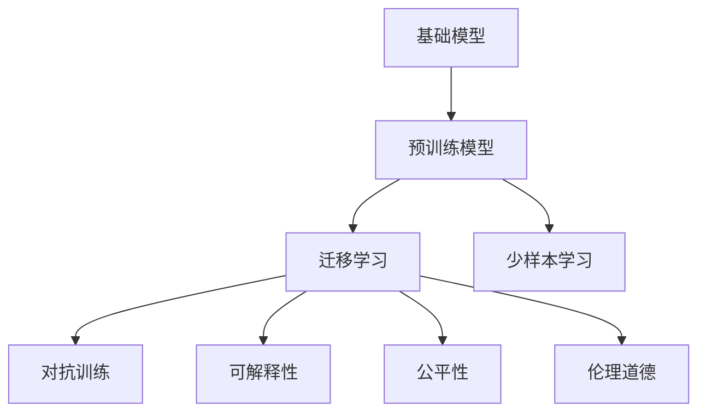
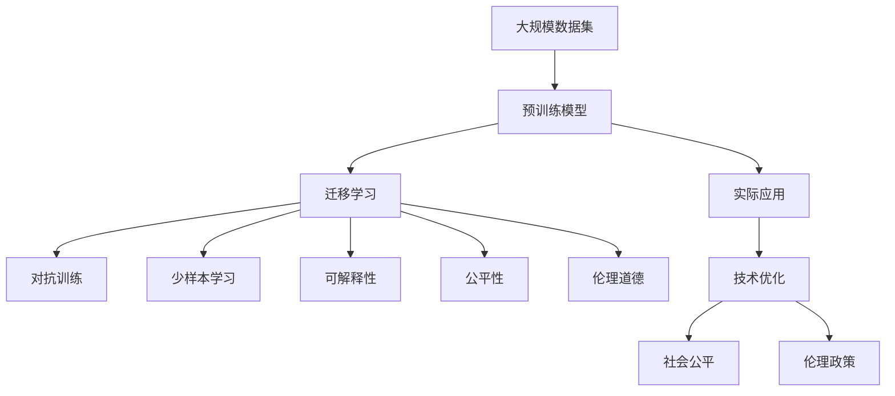

                 

## 1. 背景介绍

### 1.1 问题由来

在人工智能（AI）领域，基础模型（即早期期的AI系统）的研究与发展对当前的技术进步和应用场景起着关键作用。基础模型通常指由特定算法和数据构建的原始AI系统，如早期期的神经网络模型、逻辑推理系统等。它们在过去几十年中经历了从简单到复杂、从局部应用到全局部署的演变，逐步成为现代AI系统的重要基石。

随着深度学习和数据科学的发展，特别是大数据和高效计算能力的提升，基础模型进入了一个全新的发展阶段。大型预训练模型（Large Pre-trained Models），如BERT、GPT等，以其强大的语言处理和图像识别能力，在自然语言处理（NLP）、计算机视觉（CV）等多个领域取得了显著的突破，重新定义了基础模型的概念和作用。

然而，这些基础模型在带来巨大技术进步的同时，也引发了一系列关于技术、社会和伦理的深层次问题。这些问题不仅关系到技术的可行性和实用性，更关系到技术的安全性、公平性和可解释性。

### 1.2 问题核心关键点

本文聚焦于基础模型的社会技术性质，主要探讨以下几个关键问题：

- 基础模型的定义及其在现代AI中的作用。
- 基础模型的训练和部署过程中的数据、算法和技术挑战。
- 基础模型在实际应用中的社会、伦理和技术问题。
- 解决这些问题的技术和政策建议。

### 1.3 问题研究意义

对基础模型的社会技术性质进行深入研究，具有以下重要意义：

- **技术优化**：理解基础模型在实际应用中的表现和挑战，有助于改进算法和数据处理流程，提升系统性能。
- **社会公平**：研究基础模型对不同群体的影响，有助于制定政策确保技术的普惠性和公平性。
- **伦理考量**：在基础模型的设计和使用过程中考虑伦理道德问题，保障技术的可持续发展。
- **政策引导**：提供技术支持和政策建议，指导未来AI技术的健康发展。

## 2. 核心概念与联系

### 2.1 核心概念概述

为了更好地理解基础模型的社会技术性质，本节将介绍几个关键概念：

- **基础模型**：早期AI系统，基于特定算法和数据构建，如神经网络、逻辑推理等。
- **预训练模型**：在大量无标注数据上预训练的大型模型，如BERT、GPT等，具有通用知识表示能力。
- **迁移学习**：利用预训练模型在新任务上微调，提升模型性能。
- **少样本学习**：在少量标注数据下进行模型训练和推理。
- **对抗训练**：在训练中加入对抗样本，提高模型鲁棒性。
- **可解释性**：模型决策过程的可理解性和透明度。
- **公平性**：模型输出结果的公正性和非歧视性。
- **伦理道德**：模型设计和应用过程中的伦理考量。

这些概念共同构成了基础模型的社会技术框架，影响着其在现实世界中的应用。

### 2.2 概念间的关系

这些核心概念之间的关系可以通过以下Mermaid流程图来展示：



这个流程图展示了基础模型、预训练模型与迁移学习等关键技术之间的关系。预训练模型通过在大规模数据上学习通用知识，然后在特定任务上微调，提升性能。对抗训练、可解释性和公平性都是确保模型鲁棒性和可信度的关键因素。伦理道德则要求模型设计和使用过程中遵循社会价值和法律法规。

### 2.3 核心概念的整体架构

最后，我们用一个综合的流程图来展示这些核心概念在基础模型构建和应用过程中的整体架构：



这个综合流程图展示了基础模型的构建和应用过程中的关键步骤，包括数据预处理、模型训练、微调、评估和优化等环节，以及模型在实际应用中的技术、社会和伦理考量。

## 3. 核心算法原理 & 具体操作步骤

### 3.1 算法原理概述

基础模型的社会技术性质研究涉及算法原理、数据处理、技术优化和社会影响等多个方面。其核心算法原理可以概述为：

1. **数据预处理**：选择和清洗数据，去除噪声和异常，确保数据的质量和代表性。
2. **模型训练**：在预处理后的数据集上训练基础模型，获取初始知识表示。
3. **迁移学习**：将训练好的模型在新任务上进行微调，适应特定应用场景。
4. **对抗训练**：在训练中加入对抗样本，提高模型鲁棒性。
5. **技术优化**：使用先进算法和硬件，提升模型性能和可扩展性。
6. **社会评估**：通过测试和社会实验，评估模型的影响和公平性。

### 3.2 算法步骤详解

以下是基础模型构建和应用的具体操作步骤：

**Step 1: 数据预处理**
- 收集和清洗数据集，去除噪声和异常，确保数据质量和代表性。
- 对数据进行标准化和归一化，准备模型输入。
- 使用数据增强技术，扩充训练集。

**Step 2: 模型训练**
- 选择合适的算法和模型架构，如深度神经网络、逻辑推理等。
- 在预处理后的数据集上训练模型，获取初始知识表示。
- 使用交叉验证和网格搜索等技术，选择最佳超参数。

**Step 3: 迁移学习**
- 将训练好的模型在新任务上进行微调，适应特定应用场景。
- 选择合适的微调算法，如全参数微调、参数高效微调等。
- 在微调过程中使用对抗训练等技术，提高模型鲁棒性。

**Step 4: 技术优化**
- 使用先进算法和硬件，提升模型性能和可扩展性。
- 采用模型压缩、量化等技术，优化模型存储空间和推理速度。
- 进行持续学习和增量学习，保持模型时效性。

**Step 5: 社会评估**
- 在特定应用场景中测试模型性能，评估模型的影响和公平性。
- 使用社会实验和用户反馈，收集模型使用效果和用户满意度。
- 根据评估结果调整模型参数和训练策略，优化模型表现。

### 3.3 算法优缺点

基础模型的构建和应用过程具有以下优缺点：

**优点**：
- 数据驱动的模型构建，能够利用大数据和先进算法提升模型性能。
- 在特定任务上进行迁移学习，能够快速适应新应用场景。
- 使用先进技术优化，能够提高模型效率和可扩展性。

**缺点**：
- 对标注数据依赖较大，数据收集和处理成本高。
- 模型复杂度高，计算资源消耗大。
- 模型输出结果缺乏解释性，难以理解模型决策过程。
- 模型可能存在偏见和歧视，影响公平性。

### 3.4 算法应用领域

基础模型在多个领域都有广泛应用，例如：

- 自然语言处理（NLP）：如文本分类、情感分析、机器翻译等。
- 计算机视觉（CV）：如图像识别、目标检测、人脸识别等。
- 推荐系统：如商品推荐、内容推荐等。
- 医疗诊断：如疾病诊断、影像分析等。
- 金融分析：如信用评分、风险评估等。

这些领域的应用展示了基础模型的强大生命力和广泛影响力。

## 4. 数学模型和公式 & 详细讲解

### 4.1 数学模型构建

基础模型的构建通常涉及多个数学模型和算法。以下是一个基础的逻辑回归模型的数学模型构建：

- **输入层**：原始数据，如文本、图像等。
- **隐藏层**：神经网络层，进行特征提取和特征转换。
- **输出层**：根据模型目标，进行分类或回归等。

### 4.2 公式推导过程

以逻辑回归模型为例，其损失函数公式为：

$$
L(y, \hat{y}) = -\frac{1}{N} \sum_{i=1}^N [y_i \log \hat{y_i} + (1-y_i) \log (1-\hat{y_i})]
$$

其中，$y$为真实标签，$\hat{y}$为模型预测结果，$N$为样本数。使用梯度下降等优化算法，通过反向传播计算梯度，更新模型参数。

### 4.3 案例分析与讲解

以下是一个简单的逻辑回归模型案例分析：

假设我们有一个二分类问题，模型输出结果为0或1。在训练集上，模型预测结果为：

$$
\hat{y} = \sigma(Wx + b)
$$

其中，$\sigma$为激活函数，$W$和$b$为模型参数。我们定义损失函数为：

$$
L(y, \hat{y}) = -\frac{1}{N} \sum_{i=1}^N [y_i \log \hat{y_i} + (1-y_i) \log (1-\hat{y_i})]
$$

通过反向传播算法，计算梯度并更新模型参数。重复这个过程直到模型收敛。

## 5. 项目实践：代码实例和详细解释说明

### 5.1 开发环境搭建

在进行项目实践前，我们需要准备好开发环境。以下是使用Python进行TensorFlow开发的环境配置流程：

1. 安装Anaconda：从官网下载并安装Anaconda，用于创建独立的Python环境。

2. 创建并激活虚拟环境：
```bash
conda create -n tf-env python=3.8 
conda activate tf-env
```

3. 安装TensorFlow：根据CUDA版本，从官网获取对应的安装命令。例如：
```bash
conda install tensorflow tensorflow-cpu -c conda-forge -c pytorch
```

4. 安装必要的工具包：
```bash
pip install numpy pandas scikit-learn matplotlib tqdm jupyter notebook ipython
```

5. 安装TensorBoard：
```bash
pip install tensorboard
```

完成上述步骤后，即可在`tf-env`环境中开始项目实践。

### 5.2 源代码详细实现

下面我们以逻辑回归模型为例，给出使用TensorFlow进行基础模型构建和微调的PyTorch代码实现。

首先，定义模型类：

```python
import tensorflow as tf
import numpy as np

class LogisticRegressionModel:
    def __init__(self, input_dim):
        self.input_dim = input_dim
        self.weights = tf.Variable(tf.random.normal([input_dim, 1]))
        self.bias = tf.Variable(tf.random.normal([1]))
        
    def predict(self, X):
        return tf.sigmoid(tf.matmul(X, self.weights) + self.bias)
        
    def loss(self, y_true, y_pred):
        return -tf.reduce_mean(y_true * tf.math.log(y_pred) + (1 - y_true) * tf.math.log(1 - y_pred))
        
    def train(self, X, y, learning_rate, epochs):
        optimizer = tf.optimizers.SGD(learning_rate)
        for i in range(epochs):
            with tf.GradientTape() as tape:
                y_pred = self.predict(X)
                loss = self.loss(y_true=y, y_pred=y_pred)
            grads = tape.gradient(loss, [self.weights, self.bias])
            optimizer.apply_gradients(zip(grads, [self.weights, self.bias]))
            print(f"Epoch {i+1}, Loss: {loss.numpy():.4f}")
```

然后，准备数据集：

```python
from sklearn.datasets import load_breast_cancer

data = load_breast_cancer()
X = data.data
y = data.target.reshape(-1, 1)

X_train = X[:100]
X_test = X[100:]
y_train = y[:100]
y_test = y[100:]
```

接着，训练模型：

```python
model = LogisticRegressionModel(input_dim=X.shape[1])
model.train(X_train, y_train, learning_rate=0.01, epochs=100)
```

最后，评估模型：

```python
y_pred = model.predict(X_test)
print(f"Accuracy: {np.mean(y_pred == y_test):.2f}")
```

以上就是使用TensorFlow进行逻辑回归模型构建和微调的完整代码实现。可以看到，TensorFlow提供了丰富的API和工具，能够快速构建和训练基础模型。

### 5.3 代码解读与分析

让我们再详细解读一下关键代码的实现细节：

**LogisticRegressionModel类**：
- `__init__`方法：初始化模型参数。
- `predict`方法：使用模型进行预测。
- `loss`方法：定义损失函数。
- `train`方法：使用梯度下降算法训练模型。

**数据准备**：
- 使用scikit-learn加载乳腺癌数据集，将其分为训练集和测试集。

**训练流程**：
- 定义模型、学习率和训练轮数，开始循环迭代
- 在每个epoch内，计算损失并更新模型参数
- 输出损失值，逐步改进模型

**评估流程**：
- 使用训练好的模型对测试集进行预测
- 计算预测结果和真实标签的准确率

## 6. 实际应用场景

### 6.1 医疗诊断

基础模型在医疗诊断中的应用非常广泛。例如，使用逻辑回归模型对病人症状进行分类，判断是否患有某种疾病。这种方法可以大幅提高诊断速度和准确性，帮助医生做出更快、更准确的诊断。

在实际应用中，可以通过大规模医疗数据的预训练，构建更加精准的疾病分类模型。然后通过微调和对抗训练，提升模型鲁棒性和泛化能力，确保诊断结果的可靠性。

### 6.2 金融分析

基础模型在金融分析领域也有广泛应用。例如，使用逻辑回归模型预测股票市场走势，进行投资组合优化。这种方法可以帮助投资者更好地理解市场动态，做出明智的投资决策。

在实际应用中，可以通过历史金融数据的预训练，构建更精准的市场预测模型。然后通过微调和对抗训练，提升模型鲁棒性和泛化能力，确保预测结果的可靠性。

### 6.3 推荐系统

基础模型在推荐系统中的应用也非常广泛。例如，使用逻辑回归模型对用户行为进行分类，推荐用户可能感兴趣的商品或内容。这种方法可以大幅提升推荐系统的个性化程度，提高用户满意度。

在实际应用中，可以通过用户行为数据的预训练，构建更精准的用户行为分类模型。然后通过微调和对抗训练，提升模型鲁棒性和泛化能力，确保推荐结果的可靠性。

### 6.4 未来应用展望

随着基础模型技术的不断进步，其在更多领域的应用前景将更加广阔。

- **智慧城市**：基础模型可以应用于城市事件监测、舆情分析、应急指挥等环节，提高城市管理的自动化和智能化水平。
- **智慧交通**：基础模型可以应用于交通流量预测、路径优化、自动驾驶等，提升交通系统的效率和安全性。
- **智能制造**：基础模型可以应用于生产线监控、设备预测性维护、质量控制等，提高生产效率和产品质量。

未来，基础模型必将在更多行业领域发挥重要作用，推动人工智能技术在各行各业的深度应用。

## 7. 工具和资源推荐

### 7.1 学习资源推荐

为了帮助开发者系统掌握基础模型的理论和实践，这里推荐一些优质的学习资源：

1. 《深度学习》系列书籍：由Ian Goodfellow、Yoshua Bengio、Aaron Courville等人所著，深入浅出地介绍了深度学习的基本概念和算法。
2. 《TensorFlow实战》系列书籍：由TensorFlow官方编写，提供了丰富的实战案例和代码示例。
3. 《PyTorch深度学习》系列书籍：由DeepLearning.AI等机构编写，详细介绍了PyTorch框架的使用和优化技巧。
4. 《机器学习实战》系列书籍：由Peter Harrington编写，提供了大量实用的机器学习应用案例和代码实现。
5. 《计算机视觉：算法与应用》系列书籍：由Richard Szeliski等人编写，详细介绍了计算机视觉领域的经典算法和应用。

通过对这些资源的学习实践，相信你一定能够快速掌握基础模型的精髓，并用于解决实际的AI问题。

### 7.2 开发工具推荐

高效的开发离不开优秀的工具支持。以下是几款用于基础模型开发的常用工具：

1. TensorFlow：由Google主导开发的开源深度学习框架，生产部署方便，适合大规模工程应用。
2. PyTorch：基于Python的开源深度学习框架，灵活动态的计算图，适合快速迭代研究。
3. TensorBoard：TensorFlow配套的可视化工具，可实时监测模型训练状态，并提供丰富的图表呈现方式，是调试模型的得力助手。
4. Weights & Biases：模型训练的实验跟踪工具，可以记录和可视化模型训练过程中的各项指标，方便对比和调优。
5. Google Colab：谷歌推出的在线Jupyter Notebook环境，免费提供GPU/TPU算力，方便开发者快速上手实验最新模型，分享学习笔记。

合理利用这些工具，可以显著提升基础模型的开发效率，加快创新迭代的步伐。

### 7.3 相关论文推荐

基础模型和微调技术的发展源于学界的持续研究。以下是几篇奠基性的相关论文，推荐阅读：

1. Deep Learning（Ian Goodfellow等人）：全面介绍了深度学习的基本概念、算法和应用，奠定了深度学习领域的理论基础。
2. ImageNet Classification with Deep Convolutional Neural Networks（Alex Krizhevsky等人）：提出了卷积神经网络（CNN），并应用于大规模图像分类任务，取得了当时SOTA的成绩。
3. Logistic Regression（R.A. Fisher）：经典的逻辑回归模型，被广泛应用于分类和回归问题。
4. Support Vector Machines（Vapnik）：提出了支持向量机（SVM），被广泛应用于模式识别和机器学习领域。
5. Gradient Descent Algorithms（Ronald E. Grinblatt）：介绍了梯度下降算法的基本原理和应用，是深度学习中最基础的优化算法之一。

这些论文代表了大语言模型微调技术的发展脉络。通过学习这些前沿成果，可以帮助研究者把握学科前进方向，激发更多的创新灵感。

除上述资源外，还有一些值得关注的前沿资源，帮助开发者紧跟基础模型微调技术的最新进展，例如：

1. arXiv论文预印本：人工智能领域最新研究成果的发布平台，包括大量尚未发表的前沿工作，学习前沿技术的必读资源。
2. 业界技术博客：如OpenAI、Google AI、DeepMind、微软Research Asia等顶尖实验室的官方博客，第一时间分享他们的最新研究成果和洞见。
3. 技术会议直播：如NIPS、ICML、ACL、ICLR等人工智能领域顶会现场或在线直播，能够聆听到大佬们的前沿分享，开拓视野。
4. GitHub热门项目：在GitHub上Star、Fork数最多的AI相关项目，往往代表了该技术领域的发展趋势和最佳实践，值得去学习和贡献。
5. 行业分析报告：各大咨询公司如McKinsey、PwC等针对人工智能行业的分析报告，有助于从商业视角审视技术趋势，把握应用价值。

总之，对于基础模型的学习与实践，需要开发者保持开放的心态和持续学习的意愿。多关注前沿资讯，多动手实践，多思考总结，必将收获满满的成长收益。

## 8. 总结：未来发展趋势与挑战

### 8.1 总结

本文对基础模型的社会技术性质进行了全面系统的介绍。首先阐述了基础模型在现代AI中的定义和作用，明确了其在实际应用中的重要价值。其次，从原理到实践，详细讲解了基础模型的构建、训练和部署过程，给出了基础模型构建的完整代码实例。同时，本文还广泛探讨了基础模型在多个行业领域的应用前景，展示了其强大的生命力和影响力。

通过本文的系统梳理，可以看到，基础模型作为早期期的AI系统，虽然技术相对简单，但通过数据驱动、算法优化和社会评估等环节，逐步构建了现代AI系统的基石。未来，随着基础模型技术的不断进步，其在更多领域的应用前景将更加广阔，为人工智能技术的深度应用铺平道路。

### 8.2 未来发展趋势

展望未来，基础模型的构建与应用将呈现以下几个发展趋势：

1. 数据驱动的范式：数据作为AI系统的核心要素，将发挥越来越重要的作用。未来，基于大规模数据集构建的基础模型，将具备更强的普适性和鲁棒性。
2. 跨模态融合：未来的基础模型将融合视觉、语音、文本等多种模态信息，构建多模态智能系统。
3. 智能推理：未来的基础模型将具备更强的逻辑推理和因果推断能力，能够在复杂环境中做出更加智能的决策。
4. 自监督学习：未来的基础模型将更多地利用无标注数据进行预训练，减少对标注数据的依赖。
5. 联邦学习：未来的基础模型将利用联邦学习技术，构建分布式智能系统，提升模型的泛化能力和公平性。

以上趋势凸显了基础模型技术的广阔前景。这些方向的探索发展，必将进一步提升AI系统的性能和应用范围，为构建更加智能的AI系统奠定坚实基础。

### 8.3 面临的挑战

尽管基础模型在AI技术中占据重要地位，但其发展过程中仍面临诸多挑战：

1. 数据隐私和安全：大规模数据集的应用带来了隐私和安全问题，如何保护用户隐私，确保数据安全，是一个亟待解决的难题。
2. 算法公平性：基础模型可能存在偏见和歧视，影响模型的公平性和可靠性。如何在算法层面确保模型的公平性，还需要更多研究和实践。
3. 模型可解释性：基础模型的决策过程缺乏可解释性，难以理解其内部工作机制和推理逻辑。如何赋予模型更强的可解释性，增强用户信任，将是重要的研究课题。
4. 技术复杂度：基础模型构建和应用过程中的技术复杂度较高，需要大量研发投入和资源支持。如何在技术复杂度和实际应用之间找到平衡，需要更多技术优化和工程实践。

### 8.4 研究展望

面对基础模型面临的挑战，未来的研究需要在以下几个方面寻求新的突破：

1. 数据隐私保护：利用联邦学习、差分隐私等技术，保护用户隐私，确保数据安全。
2. 算法公平性：引入公平性约束和正则化技术，消除模型偏见和歧视。
3. 模型可解释性：引入可解释性算法和可视化工具，增强模型决策过程的透明度。
4. 技术简化：开发更高效、更简单的算法和框架，降低技术复杂度，提升模型可扩展性。

这些研究方向的探索，必将引领基础模型技术的健康发展，为构建安全、可靠、可解释、可控的智能系统提供有力保障。面向未来，基础模型技术需要与其他人工智能技术进行更深入的融合，如知识表示、因果推理、强化学习等，多路径协同发力，共同推动自然语言理解和智能交互系统的进步。只有勇于创新、敢于突破，才能不断拓展基础模型的边界，让智能技术更好地造福人类社会。

## 9. 附录：常见问题与解答

**Q1：基础模型与预训练模型的区别是什么？**

A: 基础模型通常指早期期的AI系统，基于特定算法和数据构建，如神经网络、逻辑推理等。而预训练模型指在大规模无标注数据上预训练的大型模型，如BERT、GPT等，具有通用知识表示能力。

**Q2：如何避免基础模型的过拟合问题？**

A: 过拟合是基础模型面临的主要挑战。常见的缓解策略包括：
1. 数据增强：通过回译、近义替换等方式扩充训练集
2. 正则化：使用L2正则、Dropout、Early Stopping等防止过拟合
3. 对抗训练：加入对抗样本，提高模型鲁棒性
4. 参数高效微调：只调整少量参数(如Adapter、Prefix等)，减小过拟合风险
5. 多模型集成：训练多个基础模型，取平均输出，抑制过拟合

这些策略往往需要根据具体任务和数据特点进行灵活组合。只有在数据、模型、训练、推理等各环节进行全面优化，才能最大限度地发挥基础模型的威力。

**Q3：如何确保基础模型的公平性？**

A: 确保基础模型的公平性需要从多个角度入手：
1. 数据公平：确保训练数据的多样性和代表性，避免数据偏见。
2. 算法公平：引入公平性约束和正则化技术，消除模型偏见和歧视。
3. 评估公平：使用公平性评估指标，定期监测模型的公平性。
4. 持续改进：根据评估结果调整模型参数和训练策略，优化模型表现。

这些策略需要多方协作，才能确保基础模型的公平性和可靠性。

**Q4：基础模型在实际应用中可能面临哪些伦理道德问题？**

A: 基础模型在实际应用中可能面临以下伦理道德问题：
1. 数据隐私：大规模数据集的应用带来了隐私和安全问题，如何保护用户隐私，确保数据安全，是一个亟待解决的难题。
2. 算法公平：基础模型可能存在偏见和歧视，影响模型的公平性和可靠性。如何在算法层面确保模型的公平性，还需要更多研究和实践。
3. 模型可解释性：基础模型的决策过程缺乏可解释性，难以理解其内部工作机制和推理逻辑。如何赋予模型更强的可解释性，增强用户信任，将是重要的研究课题。
4. 技术复杂度：基础模型构建和应用过程中的技术复杂度较高，需要大量研发投入和资源支持。如何在技术复杂度和实际应用之间找到平衡，需要更多技术优化和工程实践。

这些挑战需要学界和产业界共同努力，才能确保基础模型技术的安全、可靠、可解释、可控。

