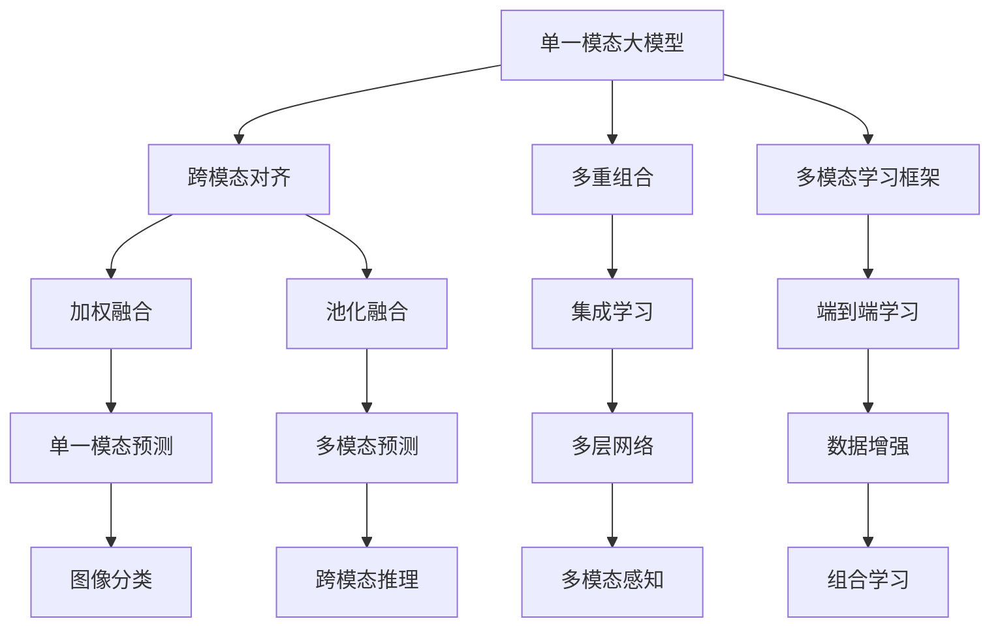
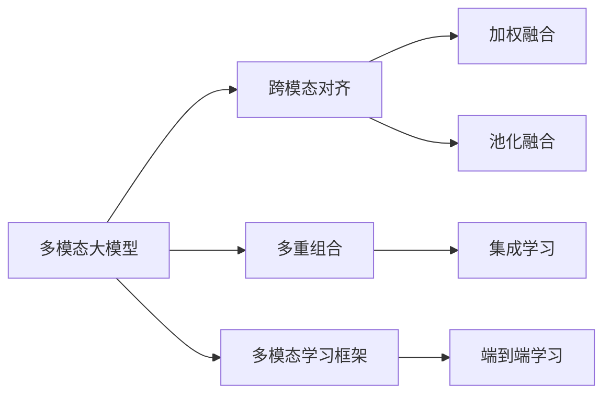
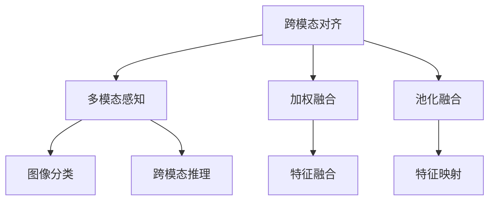
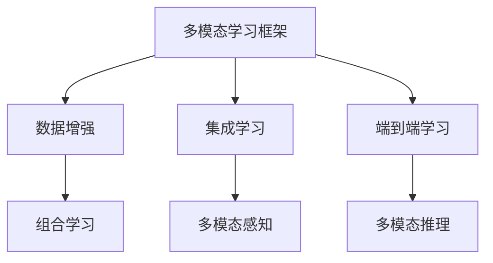
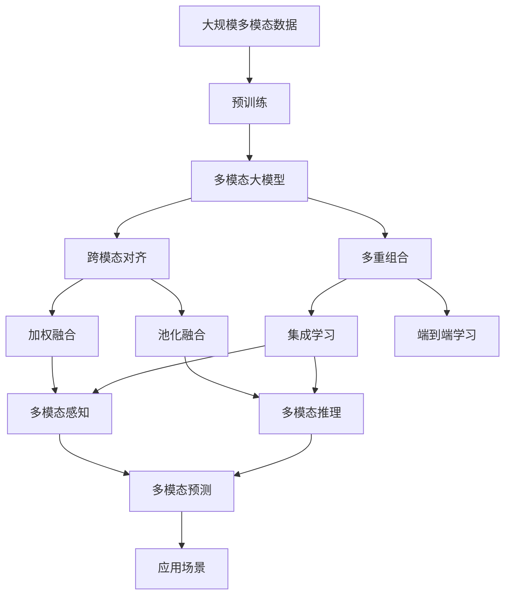

                 

# 多模态大模型：技术原理与实战 跨模态多重组合技术

## 1. 背景介绍

### 1.1 问题由来
近年来，随着深度学习技术的飞速发展，单一模态大模型在处理复杂、多模态数据时面临诸多挑战。传统的单一模态模型无法充分利用多模态数据的互补优势，使得在大规模数据、复杂任务下表现不佳。为解决这一问题，学术界和工业界积极探索多模态大模型的研究，旨在通过整合多种模态的信息，提升模型的表现力。

### 1.2 问题核心关键点
多模态大模型的核心挑战在于：如何有效融合不同模态数据，最大化利用多模态数据的信息互补性，提升模型的泛化能力和适应性。

当前，多模态大模型的研究主要围绕以下几个核心技术展开：
1. **跨模态对齐**：通过不同模态特征之间的对齐和融合，使得多模态数据在语义层面更加一致。
2. **多重组合**：将多种模态的信息通过不同的方式组合，如加权融合、集成学习等，进一步提升模型的性能。
3. **多模态学习框架**：设计高效的多模态学习算法，使模型能够在多模态数据上高效学习。

这些技术不仅需要算法创新，还需要在大规模数据集上进行充分的验证和应用。因此，了解多模态大模型的技术原理和实战应用变得尤为重要。

### 1.3 问题研究意义
研究多模态大模型的技术原理与实战应用，对于提升模型在复杂任务中的表现、推动多模态数据处理技术的进步具有重要意义：

1. **性能提升**：通过跨模态对齐和多重组合技术，可以显著提升模型在多模态数据上的泛化能力和表现。
2. **任务适应性**：多模态大模型可以更好地适应多变的任务需求，提升模型在实际应用中的灵活性。
3. **泛化能力增强**：多模态数据整合带来的信息丰富性，有助于模型更好地理解复杂场景，提升泛化能力。
4. **应用范围扩展**：多模态大模型可以应用于语音、图像、文本等多模态数据的处理，拓宽了模型应用的场景和范围。

## 2. 核心概念与联系

### 2.1 核心概念概述

为更好地理解多模态大模型的核心概念和技术，本节将介绍几个密切相关的核心概念：

- **单一模态大模型**：指仅处理单一模态数据（如文本、图像、语音）的大规模预训练模型，如BERT、GPT、ResNet等。
- **多模态大模型**：指能够同时处理多种模态数据的大规模预训练模型，如BERT-ViT、DALL-E、VIT等。
- **跨模态对齐**：通过不同模态特征之间的对齐和融合，使得多模态数据在语义层面更加一致。
- **多重组合**：将多种模态的信息通过不同的方式组合，如加权融合、集成学习等，进一步提升模型的性能。
- **多模态学习框架**：设计高效的多模态学习算法，使模型能够在多模态数据上高效学习。

这些核心概念之间的逻辑关系可以通过以下Mermaid流程图来展示：



这个流程图展示了大模型的核心概念及其之间的关系：

1. 单一模态大模型通过跨模态对齐、多重组合、多模态学习框架等技术进行改进，演变成多模态大模型。
2. 跨模态对齐通过加权融合、池化融合等技术，将不同模态的特征对齐，使得多模态数据在语义层面更加一致。
3. 多重组合通过集成学习、端到端学习等技术，将多种模态的信息通过不同的方式组合，进一步提升模型的性能。
4. 多模态学习框架设计高效的多模态学习算法，使模型能够在多模态数据上高效学习。

这些核心概念共同构成了多模态大模型的学习框架，使其能够在各种场景下发挥强大的多模态处理能力。通过理解这些核心概念，我们可以更好地把握多模态大模型的工作原理和优化方向。

### 2.2 概念间的关系

这些核心概念之间存在着紧密的联系，形成了多模态大模型的完整生态系统。下面我通过几个Mermaid流程图来展示这些概念之间的关系。

#### 2.2.1 多模态大模型的学习范式



这个流程图展示了大模型的三种主要学习范式：跨模态对齐、多重组合和多模态学习框架。

#### 2.2.2 跨模态对齐与多重组合的关系



这个流程图展示了跨模态对齐与多重组合之间的关系。通过跨模态对齐技术，将不同模态的特征对齐，使得多模态数据在语义层面更加一致。在此基础上，通过加权融合、池化融合等技术，将多种模态的信息通过不同的方式组合，进一步提升模型的性能。

#### 2.2.3 多模态学习框架与跨模态对齐的关系



这个流程图展示了多模态学习框架与跨模态对齐的关系。通过多模态学习框架，设计高效的多模态学习算法，使模型能够在多模态数据上高效学习。而跨模态对齐技术则通过将不同模态的特征对齐，使得多模态数据在语义层面更加一致，从而提升模型在多模态数据上的学习效率和性能。

### 2.3 核心概念的整体架构

最后，我们用一个综合的流程图来展示这些核心概念在大模型微调过程中的整体架构：



这个综合流程图展示了从预训练到跨模态对齐、多重组合，再到多模态学习框架的完整过程。多模态大模型首先在大规模多模态数据上进行预训练，然后通过跨模态对齐、多重组合技术进行优化，最后通过多模态学习框架进行进一步的提升，最终适应具体的应用场景。

## 3. 核心算法原理 & 具体操作步骤
### 3.1 算法原理概述

多模态大模型的核心思想是通过跨模态对齐和多重组合技术，将多种模态数据融合为一个统一的整体，从而提升模型在多模态数据上的表现。具体来说，跨模态对齐技术通过对齐不同模态的特征表示，使得多模态数据在语义层面更加一致；多重组合技术则通过不同的方式融合多种模态的信息，进一步提升模型的泛化能力和表现。

形式化地，假设多模态大模型为 $M_{\theta}$，其中 $\theta$ 为模型的参数。设 $X_1, X_2, \cdots, X_M$ 分别代表不同模态的数据，$F_i(X_i)$ 表示模态 $i$ 的数据特征表示。多模态对齐过程可以表示为：

$$
\min_{\theta} \mathcal{L}(\theta) = \sum_{i=1}^M \mathcal{L}_i(F_i(X_i), M_{\theta})
$$

其中 $\mathcal{L}_i$ 表示模态 $i$ 的对齐损失，$M_{\theta}$ 表示融合后的多模态特征表示。通过最小化对齐损失，多模态大模型可以学习到更加一致的语义表示。

接下来，多重组合技术通过将不同模态的信息进行组合，进一步提升模型的表现。假设 $W$ 为组合权重向量，多重组合过程可以表示为：

$$
Y = \sum_{i=1}^M W_i F_i(X_i)
$$

其中 $Y$ 表示多模态特征表示，$W_i$ 为模态 $i$ 的组合权重。通过优化组合权重，使得 $Y$ 能够更好地捕捉多模态数据的特征。

最终，多模态大模型在多模态数据上的表现可以通过：

$$
\min_{\theta} \mathcal{L}_{\text{multi}}(M_{\theta}, \{X_1, X_2, \cdots, X_M\})
$$

进行优化。其中 $\mathcal{L}_{\text{multi}}$ 表示多模态数据上的损失函数。

### 3.2 算法步骤详解

多模态大模型的微调过程包括以下几个关键步骤：

**Step 1: 准备多模态数据集**
- 收集不同模态的数据集，如文本、图像、音频等，并将其划分为训练集、验证集和测试集。
- 对于图像和音频等非文本模态，需要将其转换为文本格式，例如通过文字描述或自动转录等方式。

**Step 2: 设计跨模态对齐模块**
- 根据不同模态数据的特征，设计跨模态对齐模块，如特征嵌入层、池化层等，将不同模态的特征映射到一个统一的语义空间。

**Step 3: 设计多重组合模块**
- 设计多重组合模块，如加权融合、集成学习等，将不同模态的信息进行组合。

**Step 4: 设置多模态学习框架**
- 选择合适的优化算法，如AdamW、SGD等，设置学习率、批大小、迭代轮数等。
- 设置正则化技术及强度，包括权重衰减、Dropout、Early Stopping等。
- 确定冻结预训练参数的策略，如仅微调顶层，或全部参数都参与微调。

**Step 5: 执行梯度训练**
- 将训练集数据分批次输入模型，前向传播计算损失函数。
- 反向传播计算参数梯度，根据设定的优化算法和学习率更新模型参数。
- 周期性在验证集上评估模型性能，根据性能指标决定是否触发 Early Stopping。
- 重复上述步骤直到满足预设的迭代轮数或 Early Stopping 条件。

**Step 6: 测试和部署**
- 在测试集上评估多模态大模型的性能，对比微调前后的精度提升。
- 使用微调后的模型对新样本进行推理预测，集成到实际的应用系统中。
- 持续收集新的数据，定期重新微调模型，以适应数据分布的变化。

以上是多模态大模型微调的一般流程。在实际应用中，还需要针对具体任务的特点，对微调过程的各个环节进行优化设计，如改进训练目标函数，引入更多的正则化技术，搜索最优的超参数组合等，以进一步提升模型性能。

### 3.3 算法优缺点

多模态大模型的微调方法具有以下优点：
1. 提高泛化能力。通过跨模态对齐和多重组合技术，多模态大模型能够更好地适应多模态数据，提升模型的泛化能力。
2. 提升性能。多模态数据整合带来的信息丰富性，有助于模型更好地理解复杂场景，提升模型在多模态数据上的表现。
3. 灵活性高。多模态大模型可以处理多种模态数据，适用于各种多模态应用场景，如图像与文本的联合分类、语音与文本的对话生成等。

同时，该方法也存在一定的局限性：
1. 数据获取难度大。多模态数据的获取和处理成本较高，需要大量标注数据和预处理工作。
2. 模型复杂度高。多模态大模型参数量较大，训练和推理速度较慢。
3. 计算资源需求高。多模态大模型的计算复杂度较高，需要高性能计算设备和充足的算力支持。
4. 模型可解释性不足。多模态大模型的内部机制复杂，难以进行直观的解释和调试。

尽管存在这些局限性，但就目前而言，多模态大模型的微调方法仍然是大规模多模态数据处理的重要范式。未来相关研究的重点在于如何进一步降低多模态数据获取和处理的成本，提高模型的泛化能力和计算效率，同时兼顾可解释性和伦理安全性等因素。

### 3.4 算法应用领域

多模态大模型的微调方法已经在诸多领域得到了广泛应用，覆盖了几乎所有常见任务，例如：

- **医疗影像分析**：多模态大模型可以同时处理影像、基因、临床数据等多种数据，提升疾病的诊断和治疗效果。
- **智能驾驶**：多模态大模型可以整合图像、雷达、激光雷达等多种传感器数据，提升自动驾驶的感知和决策能力。
- **人机交互**：多模态大模型可以处理语音、图像、文本等多种交互方式，提升人机交互的自然性和智能化水平。
- **社交媒体分析**：多模态大模型可以同时处理文本、图像、视频等多种社交媒体数据，提升情感分析、舆情监测等应用效果。
- **虚拟现实**：多模态大模型可以整合视觉、听觉、触觉等多种感官数据，提升虚拟现实体验的沉浸感和互动性。

除了上述这些经典任务外，多模态大模型还被创新性地应用到更多场景中，如工业视觉检测、智能家居、增强现实等，为多模态数据处理带来了新的突破。随着预训练模型和微调方法的不断进步，相信多模态大模型在更广阔的应用领域将大放异彩。

## 4. 数学模型和公式 & 详细讲解  
### 4.1 数学模型构建

本节将使用数学语言对多模态大模型的微调过程进行更加严格的刻画。

记多模态大模型为 $M_{\theta}:\mathcal{X}_1 \times \mathcal{X}_2 \times \cdots \times \mathcal{X}_M \rightarrow \mathcal{Y}$，其中 $\mathcal{X}_i$ 为第 $i$ 模态的数据空间，$\mathcal{Y}$ 为输出空间，$\theta \in \mathbb{R}^d$ 为模型参数。假设多模态任务的训练集为 $D=\{(X_1^i, X_2^i, \cdots, X_M^i, Y_i)\}_{i=1}^N, X_i^i \in \mathcal{X}_i, Y_i \in \mathcal{Y}$。

定义模型 $M_{\theta}$ 在多模态数据 $X=(X_1, X_2, \cdots, X_M)$ 上的损失函数为 $\ell(M_{\theta}(X), Y)$，则在数据集 $D$ 上的经验风险为：

$$
\mathcal{L}(\theta) = \frac{1}{N} \sum_{i=1}^N \ell(M_{\theta}(X^i), Y_i)
$$

其中 $X^i=(X_1^i, X_2^i, \cdots, X_M^i)$ 为第 $i$ 模态的输入数据。

多模态大模型的微调优化目标是最小化经验风险，即找到最优参数：

$$
\theta^* = \mathop{\arg\min}_{\theta} \mathcal{L}(\theta)
$$

在实践中，我们通常使用基于梯度的优化算法（如AdamW、SGD等）来近似求解上述最优化问题。设 $\eta$ 为学习率，$\lambda$ 为正则化系数，则参数的更新公式为：

$$
\theta \leftarrow \theta - \eta \nabla_{\theta}\mathcal{L}(\theta) - \eta\lambda\theta
$$

其中 $\nabla_{\theta}\mathcal{L}(\theta)$ 为损失函数对参数 $\theta$ 的梯度，可通过反向传播算法高效计算。

### 4.2 公式推导过程

以下我们以多模态分类任务为例，推导损失函数及其梯度的计算公式。

假设模型 $M_{\theta}$ 在输入 $X=(X_1, X_2, \cdots, X_M)$ 上的输出为 $\hat{Y}=M_{\theta}(X) \in [0,1]$，表示样本属于正类的概率。真实标签 $Y \in \{0,1\}$。则多模态分类任务的损失函数定义为：

$$
\ell(M_{\theta}(X),Y) = -[y\log \hat{Y} + (1-y)\log (1-\hat{Y})]
$$

将其代入经验风险公式，得：

$$
\mathcal{L}(\theta) = -\frac{1}{N}\sum_{i=1}^N [y_i\log M_{\theta}(X^i)+(1-y_i)\log(1-M_{\theta}(X^i))]
$$

根据链式法则，损失函数对参数 $\theta_k$ 的梯度为：

$$
\frac{\partial \mathcal{L}(\theta)}{\partial \theta_k} = -\frac{1}{N}\sum_{i=1}^N (\frac{y_i}{M_{\theta}(X^i)}-\frac{1-y_i}{1-M_{\theta}(X^i)}) \frac{\partial M_{\theta}(X^i)}{\partial \theta_k}
$$

其中 $\frac{\partial M_{\theta}(X^i)}{\partial \theta_k}$ 可进一步递归展开，利用自动微分技术完成计算。

在得到损失函数的梯度后，即可带入参数更新公式，完成模型的迭代优化。重复上述过程直至收敛，最终得到适应多模态任务的最优模型参数 $\theta^*$。

## 5. 项目实践：代码实例和详细解释说明
### 5.1 开发环境搭建

在进行多模态大模型微调实践前，我们需要准备好开发环境。以下是使用Python进行PyTorch开发的环境配置流程：

1. 安装Anaconda：从官网下载并安装Anaconda，用于创建独立的Python环境。

2. 创建并激活虚拟环境：
```bash
conda create -n pytorch-env python=3.8 
conda activate pytorch-env
```

3. 安装PyTorch：根据CUDA版本，从官网获取对应的安装命令。例如：
```bash
conda install pytorch torchvision torchaudio cudatoolkit=11.1 -c pytorch -c conda-forge
```

4. 安装Transformers库：
```bash
pip install transformers
```

5. 安装各类工具包：
```bash
pip install numpy pandas scikit-learn matplotlib tqdm jupyter notebook ipython
```

完成上述步骤后，即可在`pytorch-env`环境中开始多模态大模型微调实践。

### 5.2 源代码详细实现

下面我们以医疗影像分类任务为例，给出使用Transformers库对多模态BERT模型进行微调的PyTorch代码实现。

首先，定义多模态分类任务的数据处理函数：

```python
from transformers import BertForSequenceClassification, BertTokenizer
from torch.utils.data import Dataset
import torch

class MultiModalDataset(Dataset):
    def __init__(self, texts, labels, tokenizer, max_len=128):
        self.texts = texts
        self.labels = labels
        self.tokenizer = tokenizer
        self.max_len = max_len
        
    def __len__(self):
        return len(self.texts)
    
    def __getitem__(self, item):
        text = self.texts[item]
        label = self.labels[item]
        
        encoding = self.tokenizer(text, return_tensors='pt', max_length=self.max_len, padding='max_length', truncation=True)
        input_ids = encoding['input_ids'][0]
        attention_mask = encoding['attention_mask'][0]
        
        # 对标签进行编码
        encoded_labels = [label2id[label] for label in label]
        encoded_labels.extend([label2id['O']] * (self.max_len - len(encoded_labels)))
        labels = torch.tensor(encoded_labels, dtype=torch.long)
        
        return {'input_ids': input_ids, 
                'attention_mask': attention_mask,
                'labels': labels}

# 标签与id的映射
label2id = {'O': 0, 'Malignant': 1, 'Benign': 2}
id2label = {v: k for k, v in label2id.items()}

# 创建dataset
tokenizer = BertTokenizer.from_pretrained('bert-base-cased')

train_dataset = MultiModalDataset(train_texts, train_labels, tokenizer)
dev_dataset = MultiModalDataset(dev_texts, dev_labels, tokenizer)
test_dataset = MultiModalDataset(test_texts, test_labels, tokenizer)
```

然后，定义模型和优化器：

```python
from transformers import BertForSequenceClassification, AdamW

model = BertForSequenceClassification.from_pretrained('bert-base-cased', num_labels=len(label2id))

optimizer = AdamW(model.parameters(), lr=2e-5)
```

接着，定义训练和评估函数：

```python
from torch.utils.data import DataLoader
from tqdm import tqdm
from sklearn.metrics import classification_report

device = torch.device('cuda') if torch.cuda.is_available() else torch.device('cpu')
model.to(device)

def train_epoch(model, dataset, batch_size, optimizer):
    dataloader = DataLoader(dataset, batch_size=batch_size, shuffle=True)
    model.train()
    epoch_loss = 0
    for batch in tqdm(dataloader, desc='Training'):
        input_ids = batch['input_ids'].to(device)
        attention_mask = batch['attention_mask'].to(device)
        labels = batch['labels'].to(device)
        model.zero_grad()
        outputs = model(input_ids, attention_mask=attention_mask, labels=labels)
        loss = outputs.loss
        epoch_loss += loss.item()
        loss.backward()
        optimizer.step()
    return epoch_loss / len(dataloader)

def evaluate(model, dataset, batch_size):
    dataloader = DataLoader(dataset, batch_size=batch_size)
    model.eval()
    preds, labels = [], []
    with torch.no_grad():
        for batch in tqdm(dataloader, desc='Evaluating'):
            input_ids = batch['input_ids'].to(device)
            attention_mask = batch['attention_mask'].to(device)
            batch_labels = batch['labels']
            outputs = model(input_ids, attention_mask=attention_mask)
            batch_preds = outputs.logits.argmax(dim=2).to('cpu').tolist()
            batch_labels = batch_labels.to('cpu').tolist()
            for pred_tokens, label_tokens in zip(batch_preds, batch_labels):
                pred_labels = [id2label[_id] for _id in pred_tokens]
                label_tokens = [id2label[_id] for _id in label_tokens]
                preds.append(pred_labels[:len(label_tokens)])
                labels.append(label_tokens)
                
    print(classification_report(labels, preds))
```

最后，启动训练流程并在测试集上评估：

```python
epochs = 5
batch_size = 16

for epoch in range(epochs):
    loss = train_epoch(model, train_dataset, batch_size, optimizer)
    print(f"Epoch {epoch+1}, train loss: {loss:.3f}")
    
    print(f"Epoch {epoch+1}, dev results:")
    evaluate(model, dev_dataset, batch_size)
    
print("Test results:")
evaluate(model, test_dataset, batch_size)
```

以上就是使用PyTorch对多模态BERT模型进行医疗影像分类任务微调的完整代码实现。可以看到，得益于Transformers库的强大封装，我们可以用相对简洁的代码完成多模态模型的加载和微调。

### 5.3 代码解读与分析

让我们再详细解读一下关键代码的实现细节：

**MultiModalDataset类**：
- `__init__`方法：初始化文本、标签、分词器等关键组件。
- `__len__`方法：返回数据集的样本数量。
- `__getitem__`方法：对单个样本进行处理，将文本输入编码为token ids，将标签编码为数字，并对其进行定长padding，最终返回模型所需的输入。

**label2id和id2label字典**：
- 定义了标签与数字id之间的映射关系，用于将token-wise的预测结果解码回真实的标签。

**训练和评估函数**：
- 使用

