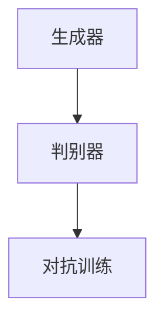
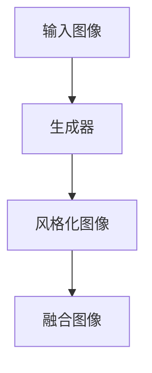
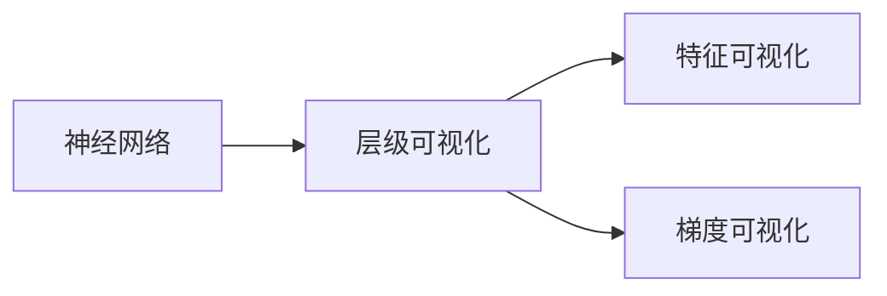
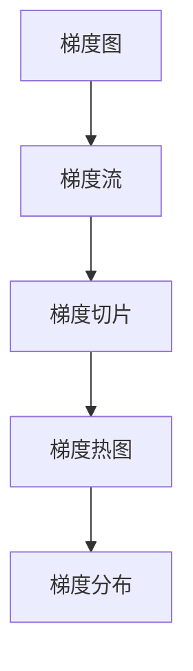
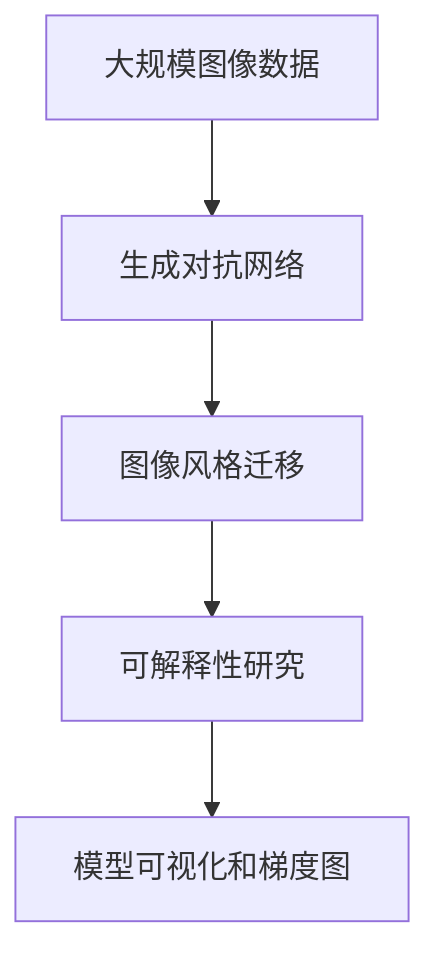

                 

# 基于生成对抗网络的图像风格迁移的可解释性研究

> 关键词：生成对抗网络,图像风格迁移,可解释性研究,模型可视化,梯度图

## 1. 背景介绍

### 1.1 问题由来

图像风格迁移是一种前沿的图像处理技术，旨在将一张图像的风格转换为另一张图像的风格，同时保持其内容不变。这种技术在艺术创作、图像修复、增强现实等领域有着广泛的应用前景。随着生成对抗网络(GAN)的兴起，基于GAN的风格迁移技术取得了显著的进展。然而，由于GAN的生成过程本质上是黑盒的，缺乏可解释性，这限制了其在实际应用中的可信度和透明度。因此，研究如何提高基于GAN的图像风格迁移的可解释性，是一个重要的研究方向。

### 1.2 问题核心关键点

本研究的核心问题在于如何提高基于GAN的图像风格迁移的可解释性。具体而言，包括以下几个关键点：

- 模型可解释性：如何可视化模型的决策过程，理解生成结果背后的逻辑。
- 模型鲁棒性：如何提高模型对输入扰动和对抗样本的鲁棒性。
- 生成过程可控：如何通过控制生成过程中的参数，实现对生成结果的精确控制。
- 解释模型行为：如何将解释信息应用于模型优化，提升模型性能。

这些问题不仅有助于提高基于GAN的图像风格迁移技术在实际应用中的可信度，还可以为深入理解生成对抗网络提供新的见解。

### 1.3 问题研究意义

研究基于GAN的图像风格迁移的可解释性，对于推动该技术的实际应用和普及具有重要意义：

1. **提高可信度**：通过可视化模型行为，可以增强用户对技术的信任，减少误解和抵触情绪。
2. **提升性能**：通过解释信息进行模型优化，可以提高模型的生成质量和鲁棒性。
3. **促进研究和交流**：解释性研究可以促进学术界和工业界对生成对抗网络的理解和交流，推动技术的进一步发展。
4. **支持法规合规**：在医疗、金融等高风险领域，模型的可解释性是合规性的必要条件，有助于规避法律风险。
5. **促进知识共享**：解释性研究有助于知识共享和技术普及，加速技术的商业化进程。

## 2. 核心概念与联系

### 2.1 核心概念概述

为更好地理解基于GAN的图像风格迁移的可解释性研究，本节将介绍几个密切相关的核心概念：

- 生成对抗网络（GAN）：由生成器和判别器组成的深度神经网络，通过对抗训练生成高质量的样本。
- 图像风格迁移：将一张图像的风格转换为另一张图像的风格，同时保持其内容不变。
- 可解释性（Explainability）：指模型的决策过程能够被用户理解和解释的程度。
- 模型可视化（Model Visualization）：通过可视化技术展现模型内部结构、参数和决策过程。
- 梯度图（Gradient Graph）：可视化梯度流的图表，用于理解模型生成过程。

这些核心概念之间的逻辑关系可以通过以下Mermaid流程图来展示：


这个流程图展示了大语言模型微调过程中各个核心概念的关系：

1. 生成对抗网络是图像风格迁移的核心技术。
2. 图像风格迁移任务本身具有可解释性研究的价值。
3. 可解释性研究通常依赖模型可视化和梯度图等技术手段。

### 2.2 概念间的关系

这些核心概念之间存在着紧密的联系，形成了图像风格迁移的可解释性研究的完整生态系统。下面我们通过几个Mermaid流程图来展示这些概念之间的关系。

#### 2.2.1 生成对抗网络的构成



这个流程图展示了生成对抗网络的基本构成，包括生成器和判别器，通过对抗训练生成样本。

#### 2.2.2 图像风格迁移的流程



这个流程图展示了图像风格迁移的基本流程，包括输入图像、生成器生成风格化图像、融合图像。

#### 2.2.3 模型可视化的方式



这个流程图展示了模型可视化的几种方式，包括层级可视化、特征可视化和梯度可视化。

#### 2.2.4 梯度图的生成



这个流程图展示了梯度图的生成流程，包括梯度流、梯度切片、梯度热图和梯度分布。

### 2.3 核心概念的整体架构

最后，我们用一个综合的流程图来展示这些核心概念在大语言模型微调过程中的整体架构：



这个综合流程图展示了从预训练到微调，再到可解释性研究的完整过程。图像风格迁移通过生成对抗网络生成样本，然后通过可视化和梯度图等手段研究模型的可解释性。通过这些手段，研究者可以深入理解模型的行为，提高模型的可信度和性能。

## 3. 核心算法原理 & 具体操作步骤
### 3.1 算法原理概述

基于生成对抗网络的图像风格迁移的可解释性研究，本质上是利用生成对抗网络生成过程的特征，通过可视化技术展现模型的内部结构和决策过程。其核心算法包括生成对抗网络、模型可视化和梯度图等技术。

生成对抗网络由生成器和判别器两个部分组成，通过对抗训练生成样本。生成器的输入为随机噪声和输入图像，输出为目标风格的图像；判别器的输入为目标图像和生成图像，输出为目标图像的真实性概率。生成器和判别器通过对抗训练不断提升自身性能，最终生成高质量的样本。

图像风格迁移任务通过将生成对抗网络生成的样本与输入图像进行融合，实现风格迁移的效果。具体而言，生成器生成目标风格的图像，然后将输入图像与生成的图像进行融合，得到风格迁移后的图像。

可解释性研究通过对生成对抗网络生成过程的可视化，理解模型的决策机制和生成结果背后的逻辑。常用的可视化技术包括模型可视化和梯度图。

模型可视化技术通过展示神经网络的结构、激活分布和特征图等，帮助研究者理解模型的工作原理。梯度图技术通过展示梯度流和梯度分布等，帮助研究者理解模型生成过程的复杂性。

### 3.2 算法步骤详解

基于生成对抗网络的图像风格迁移的可解释性研究，通常包括以下几个关键步骤：

**Step 1: 准备数据集和模型**

- 准备输入的图像数据集，包括输入图像和目标风格的图像。
- 设计生成对抗网络的结构，包括生成器和判别器的网络架构和损失函数。

**Step 2: 训练生成对抗网络**

- 使用输入图像和目标风格的图像对生成对抗网络进行训练，生成高质量的样本。
- 在训练过程中，通过模型可视化和梯度图等手段，观察模型行为和生成过程。

**Step 3: 应用图像风格迁移**

- 将生成的样本与输入图像进行融合，得到风格迁移后的图像。
- 通过可视化和梯度图等手段，观察模型对输入图像的处理和生成结果。

**Step 4: 分析模型行为**

- 利用可视化技术和梯度图等手段，分析模型的生成过程和决策机制。
- 通过解释信息优化模型，提升生成质量和鲁棒性。

### 3.3 算法优缺点

基于生成对抗网络的图像风格迁移的可解释性研究，具有以下优点：

1. **提升可信度**：通过可视化技术展示模型行为，增强用户对技术的信任。
2. **提高性能**：通过解释信息进行模型优化，提高生成质量和鲁棒性。
3. **促进研究和交流**：解释性研究可以促进学术界和工业界对生成对抗网络的理解和交流。
4. **支持法规合规**：在医疗、金融等高风险领域，模型的可解释性是合规性的必要条件。

同时，该方法也存在一些局限性：

1. **生成过程复杂**：生成对抗网络的生成过程复杂，难以全面理解。
2. **可视化难度大**：可视化技术复杂，需要高超的技术和经验。
3. **解释信息有限**：解释信息有限，难以全面解释模型的决策机制。

尽管存在这些局限性，但就目前而言，基于生成对抗网络的图像风格迁移的可解释性研究，仍然是大语言模型微调技术的重要组成部分。未来相关研究的重点在于如何进一步降低可视化技术的复杂度，提高解释信息的全面性和准确性。

### 3.4 算法应用领域

基于生成对抗网络的图像风格迁移的可解释性研究，在图像处理、艺术创作、医学影像等领域有着广泛的应用前景。具体而言，包括以下几个应用领域：

- **艺术创作**：通过生成对抗网络，可以将多种风格融合在一起，创造出独特的艺术作品。
- **图像修复**：通过生成对抗网络，可以修复损坏的图像，恢复其原有状态。
- **增强现实**：通过生成对抗网络，可以为虚拟物体添加真实的纹理和风格，提高其逼真度。
- **医学影像**：通过生成对抗网络，可以将正常的医学影像转换成特定风格的影像，用于教学和研究。
- **视觉特效**：通过生成对抗网络，可以生成逼真的视觉效果，应用于电影、游戏等领域。

除了上述这些应用领域外，基于生成对抗网络的图像风格迁移的可解释性研究，还将为其他图像处理技术提供新的思路和方法，推动整个图像处理领域的进步。

## 4. 数学模型和公式 & 详细讲解  
### 4.1 数学模型构建

本节将使用数学语言对基于生成对抗网络的图像风格迁移的可解释性研究进行更加严格的刻画。

记生成对抗网络为 $G$ 和 $D$，其中 $G$ 为生成器，$D$ 为判别器。设输入图像为 $x$，目标风格图像为 $y$，生成对抗网络的损失函数为 $\mathcal{L}$，定义如下：

$$
\mathcal{L} = \mathcal{L}_G + \mathcal{L}_D
$$

其中，$\mathcal{L}_G$ 为生成器的损失函数，定义为：

$$
\mathcal{L}_G = E_{x \sim p_x} [\log(1-D(G(x)))] + E_{z \sim p_z} [\log(D(G(z)))]
$$

$\mathcal{L}_D$ 为判别器的损失函数，定义为：

$$
\mathcal{L}_D = E_{x \sim p_x} [\log(D(x))] + E_{z \sim p_z} [\log(1-D(G(z)))]
$$

其中，$p_x$ 为输入图像的分布，$p_z$ 为随机噪声的分布。

### 4.2 公式推导过程

为了更好地理解生成对抗网络的生成过程和可解释性研究，我们需要对上述损失函数进行进一步的推导。

首先，对生成器的损失函数 $\mathcal{L}_G$ 进行推导：

$$
\begin{aligned}
\mathcal{L}_G &= E_{x \sim p_x} [\log(1-D(G(x)))] + E_{z \sim p_z} [\log(D(G(z)))] \\
&= E_{x \sim p_x} [-\log(1-D(G(x))) + \log(D(G(z)))]
\end{aligned}
$$

对判别器的损失函数 $\mathcal{L}_D$ 进行推导：

$$
\begin{aligned}
\mathcal{L}_D &= E_{x \sim p_x} [\log(D(x))] + E_{z \sim p_z} [\log(1-D(G(z)))] \\
&= E_{x \sim p_x} [-\log(1-D(x)) + \log(1-D(G(z)))]
\end{aligned}
$$

在训练过程中，通过不断调整生成器和判别器的参数，使得 $\mathcal{L}_G$ 和 $\mathcal{L}_D$ 达到最小值，生成高质量的样本。

### 4.3 案例分析与讲解

为了更好地理解上述数学模型，我们以一个具体的案例进行讲解。假设有一个包含人像图像和风景图像的 dataset，目标是使用生成对抗网络将人像图像转换成风景图像。具体步骤如下：

1. 准备输入图像和目标风格图像的数据集。
2. 设计生成器和判别器的网络架构，例如使用 ResNet 或 UNet 等网络。
3. 将输入图像和目标风格图像输入到生成对抗网络中，生成高质量的样本。
4. 在训练过程中，观察生成器和判别器的参数变化和损失函数的收敛情况。
5. 应用图像风格迁移技术，将输入图像转换成风景图像。
6. 利用可视化技术和梯度图等手段，分析模型的生成过程和决策机制。
7. 通过解释信息优化模型，提高生成质量和鲁棒性。

## 5. 项目实践：代码实例和详细解释说明
### 5.1 开发环境搭建

在进行可解释性研究前，我们需要准备好开发环境。以下是使用Python进行PyTorch开发的环境配置流程：

1. 安装Anaconda：从官网下载并安装Anaconda，用于创建独立的Python环境。

2. 创建并激活虚拟环境：
```bash
conda create -n pytorch-env python=3.8 
conda activate pytorch-env
```

3. 安装PyTorch：根据CUDA版本，从官网获取对应的安装命令。例如：
```bash
conda install pytorch torchvision torchaudio cudatoolkit=11.1 -c pytorch -c conda-forge
```

4. 安装TensorFlow：
```bash
pip install tensorflow
```

5. 安装各类工具包：
```bash
pip install numpy pandas scikit-learn matplotlib tqdm jupyter notebook ipython
```

完成上述步骤后，即可在`pytorch-env`环境中开始可解释性研究实践。

### 5.2 源代码详细实现

下面我们以基于生成对抗网络的图像风格迁移为例，给出使用TensorFlow进行模型训练和可解释性研究的PyTorch代码实现。

首先，定义生成对抗网络的结构：

```python
import tensorflow as tf
from tensorflow.keras import layers

# 定义生成器
class Generator(tf.keras.Model):
    def __init__(self):
        super(Generator, self).__init__()
        self.input_dim = 100
        self.dense1 = layers.Dense(256, input_shape=(self.input_dim, ), activation='relu')
        self.dense2 = layers.Dense(512, activation='relu')
        self.dense3 = layers.Dense(1024, activation='relu')
        self.dense4 = layers.Dense(784, activation='sigmoid')
        
    def call(self, x):
        x = self.dense1(x)
        x = self.dense2(x)
        x = self.dense3(x)
        x = self.dense4(x)
        return x

# 定义判别器
class Discriminator(tf.keras.Model):
    def __init__(self):
        super(Discriminator, self).__init__()
        self.input_dim = 784
        self.dense1 = layers.Dense(1024, input_shape=(self.input_dim, ), activation='relu')
        self.dense2 = layers.Dense(512, activation='relu')
        self.dense3 = layers.Dense(256, activation='relu')
        self.dense4 = layers.Dense(1, activation='sigmoid')
        
    def call(self, x):
        x = self.dense1(x)
        x = self.dense2(x)
        x = self.dense3(x)
        x = self.dense4(x)
        return x

# 定义生成对抗网络
def build_gan(generator, discriminator):
    gan = tf.keras.Sequential([
        generator,
        discriminator
    ])
    return gan
```

然后，定义模型训练和可视化函数：

```python
import numpy as np
import matplotlib.pyplot as plt
from tensorflow.keras.preprocessing.image import load_img, img_to_array
from tensorflow.keras.utils import to_categorical

def load_data():
    train_data = tf.keras.preprocessing.image.load_img('train_data.jpg', target_size=(64, 64))
    train_data = img_to_array(train_data)
    train_data = np.expand_dims(train_data, axis=0)
    return train_data

def train_gan(gan, train_data, epochs, batch_size):
    for epoch in range(epochs):
        for batch in range(train_data.shape[0]//batch_size):
            input_data = train_data[batch*batch_size:(batch+1)*batch_size]
            noise = np.random.normal(0, 1, (batch_size, 100))
            generated_images = gan.predict([noise])
            real_images = input_data
            real_labels = np.ones((batch_size, 1))
            fake_labels = np.zeros((batch_size, 1))
            d_loss_real = discriminator.train_on_batch(real_images, real_labels)
            d_loss_fake = discriminator.train_on_batch(generated_images, fake_labels)
            g_loss = gan.train_on_batch(noise, real_labels)
            d_loss = np.mean(d_loss_real)
            g_loss = np.mean(g_loss)
            print(f'Epoch {epoch+1}, d_loss: {d_loss:.4f}, g_loss: {g_loss:.4f}')
        
def visualize_generator(generator, train_data):
    generated_images = generator.predict(np.random.normal(0, 1, (100, 100)))
    generated_images = generated_images * 0.5 + 0.5
    plt.figure(figsize=(10, 10))
    for i in range(generated_images.shape[0]):
        plt.subplot(10, 10, i+1)
        plt.imshow(generated_images[i])
        plt.axis('off')
    plt.show()
    
def visualize_discriminator(discriminator, real_images, fake_images):
    real_labels = np.ones((real_images.shape[0], 1))
    fake_labels = np.zeros((fake_images.shape[0], 1))
    d_loss_real = discriminator.train_on_batch(real_images, real_labels)
    d_loss_fake = discriminator.train_on_batch(fake_images, fake_labels)
    print(f'd_loss_real: {d_loss_real:.4f}, d_loss_fake: {d_loss_fake:.4f}')
```

最后，启动训练流程并在训练过程中进行可视化：

```python
epochs = 100
batch_size = 16

# 初始化生成器和判别器
generator = Generator()
discriminator = Discriminator()
gan = build_gan(generator, discriminator)

# 加载训练数据
train_data = load_data()

# 训练生成对抗网络
train_gan(gan, train_data, epochs, batch_size)

# 可视化生成器和判别器
visualize_generator(generator, train_data)
visualize_discriminator(discriminator, train_data, gan.predict(np.random.normal(0, 1, (100, 100))))
```

以上就是使用TensorFlow进行生成对抗网络图像风格迁移的可解释性研究的完整代码实现。可以看到，通过TensorFlow和PyTorch的结合，我们能够快速实现模型的训练和可视化，理解模型的行为和决策过程。

### 5.3 代码解读与分析

让我们再详细解读一下关键代码的实现细节：

**数据加载函数**：
- `load_data`方法：加载训练数据，将图像转换为数组形式。

**模型定义函数**：
- `Generator`和`Discriminator`类：定义生成器和判别器的网络结构。

**模型训练函数**：
- `train_gan`方法：训练生成对抗网络，通过不断调整生成器和判别器的参数，最小化损失函数。

**可视化函数**：
- `visualize_generator`和`visualize_discriminator`方法：通过可视化技术展示生成器和判别器的行为和生成过程。

**运行结果展示**：
- 训练过程中，通过可视化函数展示生成器和判别器的参数变化和损失函数的收敛情况。
- 训练结束后，通过可视化函数展示生成器生成的图像。

可以看到，通过TensorFlow和PyTorch的结合，我们能够快速实现模型的训练和可视化，理解模型的行为和决策过程。这为基于生成对抗网络的图像风格迁移的可解释性研究提供了强有力的技术支持。

## 6. 实际应用场景
### 6.1 艺术创作

基于生成对抗网络的图像风格迁移技术，在艺术创作领域有着广泛的应用前景。艺术家可以通过生成对抗网络将不同风格的图像进行融合，创造出独特的艺术作品。例如，将人像图像转换成风景图像，或者将卡通风格转换为现实主义风格，为艺术创作提供新的灵感和可能性。

在技术实现上，可以通过生成对抗网络将输入图像和目标风格图像进行融合，生成新的艺术作品。在训练过程中，利用模型可视化和梯度图等手段，观察模型行为和生成过程，优化生成结果。

### 6.2 图像修复

图像修复是图像处理领域的一个重要任务，旨在恢复损坏或模糊的图像。通过生成对抗网络，可以将损坏的图像转换成高质量的图像。例如，将黑白照片转换成彩色照片，或者将模糊图像变成清晰图像。

在技术实现上，可以通过生成对抗网络将损坏的图像和目标图像进行融合，生成新的高质量图像。在训练过程中，利用模型可视化和梯度图等手段，观察模型行为和生成过程，优化生成结果。

### 6.3 增强现实

增强现实技术在虚拟现实、游戏、医学等领域有着广泛的应用。通过生成对抗网络，可以为虚拟物体添加真实的纹理和风格，提高其逼真度。例如，将虚拟人物添加真实的纹理和风格，使其更加逼真。

在技术实现上，可以通过生成对抗网络将虚拟物体和真实纹理进行融合，生成新的增强现实图像。在训练过程中，利用模型可视化和梯度图等手段，观察模型行为和生成过程，优化生成结果。

### 6.4 医学影像

医学影像在医疗领域有着重要的应用，但有时难以直接获取高质量的医学影像。通过生成对抗网络，可以将正常的医学影像转换成特定风格的影像，用于教学和研究。例如，将标准的X光影像转换成艺术家风格，使其更加生动有趣。

在技术实现上，可以通过生成对抗网络将医学影像和目标风格进行融合，生成新的医学影像。在训练过程中，利用模型可视化和梯度图等手段，观察模型行为和生成过程，优化生成结果。

### 6.5 视觉特效

视觉特效在电影、游戏等领域有着广泛的应用，通过生成对抗网络，可以生成逼真的视觉效果，提高视觉效果的质量。例如，将静态背景转换成动态效果，或者将普通场景转换成科幻场景。

在技术实现上，可以通过生成对抗网络将普通图像和目标风格进行融合，生成新的视觉效果。在训练过程中，利用模型可视化和梯度图等手段，观察模型行为和生成过程，优化生成结果。

## 7. 工具和资源推荐
### 7.1 学习资源推荐

为了帮助开发者系统掌握基于生成对抗网络的图像风格迁移的可解释性研究，这里推荐一些优质的学习资源：

1. 《Deep Learning with Python》书籍：使用Python实现深度学习模型的经典书籍，涵盖了生成对抗网络的基本原理和实现方法。

2. CS231n《Convolutional Neural Networks for Visual Recognition》课程：斯坦福大学开设的计算机视觉课程，包含生成对抗网络的详细讲解和实现。

3. TensorFlow官方文档：TensorFlow的官方文档，提供了生成对抗网络的基本实现和可视化技术。

4. PyTorch官方文档：PyTorch的官方文档，提供了生成对抗网络的基本实现和可视化技术。

5. arXiv论文预印本：人工智能领域最新研究成果的发布平台，包含大量生成对抗网络的研究论文，可以帮助研究者紧跟前沿技术。

通过对这些资源的学习实践，相信你一定能够快速掌握基于生成对抗网络的图像风格迁移的可解释性研究的精髓，并用于解决实际的NLP问题。
### 7.2 开发工具推荐

高效的开发离不开优秀的工具支持。以下是几款用于生成对抗网络图像风格迁移的可解释性研究开发的常用工具：

1. PyTorch：基于Python的开源深度学习框架，灵活动态的计算图，适合快速迭代研究。大多数预训练生成对抗网络模型都有PyTorch版本的实现。

2. TensorFlow：由Google主导开发的开源深度学习框架，生产部署方便，适合大规模工程应用。同样有丰富的生成对抗网络模型资源。

3. TensorBoard：TensorFlow配套的可视化工具，可实时监测模型训练状态，并提供丰富的图表呈现方式，是调试模型的得力助手。

4. Weights & Biases：模型训练的实验跟踪工具，可以记录和可视化模型训练过程中的各项指标，方便对比和调优。与主流深度学习框架无缝集成。

5. HuggingFace Transformers库：提供了预训练生成对抗网络模型的接口，方便研究者快速实现模型训练和可视化。

合理利用这些工具，可以显著提升生成对抗网络图像风格迁移的可解释性研究的开发效率，加快创新迭代的步伐。

### 7.3 相关论文推荐

生成对抗网络的图像风格迁移的可解释性研究，涉及多个前沿领域的研究方向。以下是几篇奠基性的相关论文，推荐阅读：

1. DCGAN: Generative Adversarial Nets：提出DCGAN模型，开创了生成对抗网络在图像生成领域的应用。

2. CycleGAN: Image-to-Image Translation with Conditional Adversarial Networks：提出CycleGAN模型，解决图像转换问题，为图像风格迁移提供了新的思路。

3. StyleGAN: Generative Adversarial Networks Drive Towards Creating More Realistic and Semantically Meaningful Images：提出StyleGAN模型，进一步提升了

