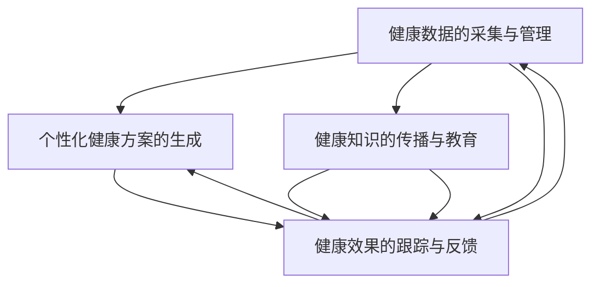
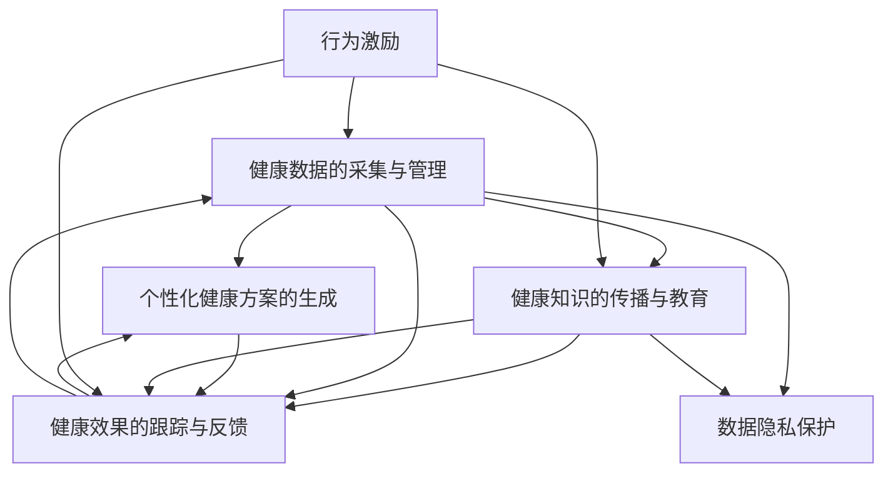

                 

# 如何利用知识付费实现在线健康管理与养生指导？

随着互联网技术的发展和人们生活水平的提高，健康管理和养生指导已经成为越来越多人的重要需求。然而，传统的线下健康管理方式受限于时间和地域限制，无法满足大众的需求。而在线健康管理与养生指导通过知识付费的方式，突破了时间和地域的限制，为人们提供了一种便捷、高效的获取健康知识和服务的新方式。

本文将系统介绍如何利用知识付费技术实现在线健康管理与养生指导，包括技术原理、关键算法、项目实践、应用场景及未来展望等内容。

## 1. 背景介绍

### 1.1 问题由来

随着健康意识的增强和生活节奏的加快，人们越来越重视健康管理与养生指导。然而，传统的线下健康管理方式如体检、养生课程等，存在着成本高、时间浪费、难以持续等问题，难以满足大众的需求。在线健康管理与养生指导的出现，为人们提供了一种更便捷、高效的健康获取方式。

### 1.2 问题核心关键点

在线健康管理与养生指导的核心关键点包括：

- **健康数据的采集与管理**：通过各类智能设备（如可穿戴设备、手机APP等）收集用户的健康数据，并进行分析和管理。
- **个性化健康方案的生成**：根据用户的健康数据和需求，生成个性化的健康管理方案。
- **健康知识的传播与教育**：通过知识付费的方式，向用户传播健康知识和养生指导，提升用户的健康意识和健康水平。
- **健康效果的跟踪与反馈**：对用户的健康管理效果进行跟踪和反馈，帮助用户调整和优化健康管理方案。

## 2. 核心概念与联系

### 2.1 核心概念概述

为更好地理解在线健康管理与养生指导的核心概念，本节将介绍几个密切相关的核心概念：

- **在线健康管理**：通过互联网技术，用户可以随时随地获取健康数据、个性化的健康方案和健康指导，实现健康管理的智能化和个性化。
- **知识付费**：通过互联网平台，用户需支付一定费用获取专业、高质量的健康知识和养生指导，促进健康知识的普及和应用。
- **个性化推荐**：根据用户的行为、兴趣和健康数据，推荐个性化的健康知识和养生指导，提升用户体验和健康效果。
- **数据隐私保护**：在收集和处理用户健康数据的过程中，保护用户隐私，避免数据泄露和滥用。
- **行为激励**：通过各种激励机制（如积分、优惠券等），鼓励用户持续使用在线健康管理平台，形成健康管理的良性循环。

### 2.2 概念间的关系

这些核心概念之间的逻辑关系可以通过以下Mermaid流程图来展示：



这个流程图展示了大语言模型微调过程中各个核心概念之间的关系：

1. 健康数据的采集与管理为个性化健康方案的生成提供了基础数据支持。
2. 个性化健康方案的生成为用户提供了个性化的健康指导。
3. 健康知识的传播与教育促进了健康知识的普及和应用。
4. 健康效果的跟踪与反馈帮助用户调整和优化健康管理方案。
5. 数据隐私保护贯穿健康数据收集和处理的全过程。
6. 行为激励机制提升用户的健康管理参与度。

### 2.3 核心概念的整体架构

最后，我们用一个综合的流程图来展示这些核心概念在大语言模型微调过程中的整体架构：



这个综合流程图展示了在线健康管理与养生指导的大语言模型微调过程中各个核心概念的关系和作用，帮助读者更好地理解整体架构。

## 3. 核心算法原理 & 具体操作步骤
### 3.1 算法原理概述

在线健康管理与养生指导的核心算法原理包括：

- **机器学习**：通过收集和分析用户健康数据，生成个性化的健康管理方案和推荐健康知识。
- **深度学习**：利用深度学习模型对用户行为和健康数据进行建模，提升个性化推荐的准确性。
- **自然语言处理(NLP)**：通过NLP技术对用户输入的文本进行语义分析和理解，提供更加智能化的健康知识传播和教育。
- **数据挖掘**：从海量健康数据中挖掘出有价值的健康知识和用户行为模式，生成更加精准的健康管理方案。
- **强化学习**：利用强化学习技术，优化健康管理方案和知识传播策略，提升用户体验和健康效果。

### 3.2 算法步骤详解

在线健康管理与养生指导的算法步骤包括：

1. **健康数据采集与管理**：通过各类智能设备（如可穿戴设备、手机APP等）收集用户的健康数据，并进行预处理和清洗。
2. **个性化健康方案生成**：利用机器学习算法，对用户健康数据进行分析和建模，生成个性化的健康管理方案。
3. **健康知识传播与教育**：通过NLP技术，对用户输入的文本进行语义分析和理解，提供个性化的健康知识和养生指导。
4. **健康效果跟踪与反馈**：利用强化学习技术，对用户的健康管理效果进行跟踪和反馈，优化健康管理方案。
5. **数据隐私保护**：对用户健康数据进行加密和安全存储，保护用户隐私。
6. **行为激励**：通过各种激励机制，鼓励用户持续使用在线健康管理平台，形成健康管理的良性循环。

### 3.3 算法优缺点

在线健康管理与养生指导的算法优缺点包括：

**优点：**

- 实时性和便利性：用户可以随时随地获取健康数据和个性化健康方案。
- 个性化和精准性：通过个性化推荐和深度学习技术，提供更加精准的健康管理方案和知识传播。
- 用户参与度高：通过行为激励机制，提升用户的健康管理参与度和体验感。

**缺点：**

- 数据隐私问题：用户健康数据的收集和处理需要严格的数据隐私保护措施。
- 技术复杂性：需要应用多种前沿技术，如机器学习、深度学习、NLP等，技术门槛较高。
- 应用场景限制：对于无法使用智能设备或不愿意分享健康数据的用户，可能难以享受在线健康管理服务。

### 3.4 算法应用领域

在线健康管理与养生指导的算法应用领域包括：

- 健康数据采集与管理：可穿戴设备、手机APP等智能设备的健康数据采集与管理。
- 个性化健康方案生成：基于用户健康数据和需求，生成个性化的健康管理方案。
- 健康知识的传播与教育：通过知识付费的方式，向用户传播健康知识和养生指导。
- 健康效果的跟踪与反馈：对用户的健康管理效果进行跟踪和反馈，优化健康管理方案。
- 数据隐私保护：用户健康数据的安全存储和隐私保护。
- 行为激励：通过各种激励机制，提升用户的健康管理参与度。

## 4. 数学模型和公式 & 详细讲解  
### 4.1 数学模型构建

在线健康管理与养生指导的数学模型包括：

- **健康数据采集与管理模型**：收集用户健康数据，建立健康数据模型，进行数据清洗和预处理。
- **个性化健康方案生成模型**：基于用户健康数据和需求，生成个性化的健康管理方案。
- **健康知识传播与教育模型**：通过NLP技术，对用户输入的文本进行语义分析和理解，提供个性化的健康知识和养生指导。
- **健康效果跟踪与反馈模型**：利用强化学习技术，对用户的健康管理效果进行跟踪和反馈，优化健康管理方案。
- **数据隐私保护模型**：对用户健康数据进行加密和安全存储，保护用户隐私。
- **行为激励模型**：通过各种激励机制，鼓励用户持续使用在线健康管理平台，形成健康管理的良性循环。

### 4.2 公式推导过程

以下我们以个性化健康方案生成为例，推导生成模型的公式：

假设用户健康数据为 $\mathbf{x}$，健康管理方案为 $\mathbf{y}$，生成模型为 $f$。设 $f$ 为线性回归模型，则：

$$
\mathbf{y} = f(\mathbf{x}) = \mathbf{W}\mathbf{x} + \mathbf{b}
$$

其中 $\mathbf{W}$ 为权重矩阵，$\mathbf{b}$ 为偏置向量。生成模型的目标是最小化预测误差 $E$，即：

$$
E = \frac{1}{N}\sum_{i=1}^N ||\mathbf{y}_i - f(\mathbf{x}_i)||^2
$$

通过梯度下降等优化算法，求解 $\mathbf{W}$ 和 $\mathbf{b}$，使得模型预测结果尽可能接近真实健康管理方案。

### 4.3 案例分析与讲解

以下以智能手环采集的健康数据为例，展示如何利用在线健康管理与养生指导模型生成个性化健康管理方案：

假设智能手环采集的用户健康数据为 $(x_1, x_2, \cdots, x_n)$，其中 $x_i$ 包括心率、步数、睡眠质量等指标。

假设已有一组用户数据 $(x_1, y_1), (x_2, y_2), \cdots, (x_N, y_N)$，其中 $y_i$ 为个性化的健康管理方案。

利用机器学习算法，训练生成模型 $f$，使得 $f(\mathbf{x}) \approx \mathbf{y}$。

在用户使用智能手环采集新的健康数据 $\mathbf{x}$ 后，通过生成模型 $f$ 计算得到个性化的健康管理方案 $\mathbf{y} = f(\mathbf{x})$。

例如，当用户采集的心率过快时，生成模型会根据以往数据生成一份建议休息的健康方案，如降低步数、增加睡眠等。

## 5. 项目实践：代码实例和详细解释说明
### 5.1 开发环境搭建

在进行在线健康管理与养生指导的开发前，我们需要准备好开发环境。以下是使用Python进行Flask开发的环境配置流程：

1. 安装Anaconda：从官网下载并安装Anaconda，用于创建独立的Python环境。

2. 创建并激活虚拟环境：
```bash
conda create -n flask-env python=3.8 
conda activate flask-env
```

3. 安装Flask：
```bash
pip install Flask
```

4. 安装相关库：
```bash
pip install requests pandas scikit-learn Flask-CORS Flask-SQLAlchemy
```

完成上述步骤后，即可在`flask-env`环境中开始开发实践。

### 5.2 源代码详细实现

下面我们以智能手环采集的健康数据为例，给出使用Flask进行在线健康管理与养生指导的Python代码实现。

首先，定义Flask应用和API接口：

```python
from flask import Flask, request, jsonify
from flask_sqlalchemy import SQLAlchemy
from flask_cors import CORS
from sklearn.linear_model import LinearRegression

app = Flask(__name__)
CORS(app)

app.config['SQLALCHEMY_DATABASE_URI'] = 'sqlite:///data.db'
db = SQLAlchemy(app)

class HealthData(db.Model):
    id = db.Column(db.Integer, primary_key=True)
    x1 = db.Column(db.Float)
    x2 = db.Column(db.Float)
    x3 = db.Column(db.Float)
    y = db.Column(db.Float)

@app.route('/generate_health_plan', methods=['POST'])
def generate_health_plan():
    data = request.json
    x1 = data['x1']
    x2 = data['x2']
    x3 = data['x3']
    y_hat = predict_health_plan(x1, x2, x3)
    return jsonify(y_hat)

def predict_health_plan(x1, x2, x3):
    data = HealthData.query.all()
    X = np.array([(x1, x2, x3) for x1, x2, x3, y in data]).T
    y = np.array([y for x1, x2, x3, y in data])
    model = LinearRegression()
    model.fit(X, y)
    x = np.array([x1, x2, x3])
    y_hat = model.predict(x)
    return y_hat[0]

@app.route('/add_data', methods=['POST'])
def add_data():
    data = request.json
    health_data = HealthData(x1=data['x1'], x2=data['x2'], x3=data['x3'], y=data['y'])
    db.session.add(health_data)
    db.session.commit()
    return jsonify({'message': 'Data added successfully'})

@app.route('/get_all_data', methods=['GET'])
def get_all_data():
    data = HealthData.query.all()
    data_list = [[x1, x2, x3, y] for x1, x2, x3, y in data]
    return jsonify(data_list)
```

接着，定义SQLite数据库连接和数据存储：

```python
from sqlalchemy import create_engine

engine = create_engine('sqlite:///data.db', echo=True)

with engine.connect() as conn:
    conn.execute('''
        CREATE TABLE IF NOT EXISTS HealthData (
            id INTEGER PRIMARY KEY,
            x1 FLOAT,
            x2 FLOAT,
            x3 FLOAT,
            y FLOAT
        )
    ''')

    conn.commit()
```

最后，启动Flask应用并测试API接口：

```python
if __name__ == '__main__':
    app.run(debug=True)
```

以上就是使用Flask进行在线健康管理与养生指导的完整代码实现。可以看到，通过Flask和SQLite，我们可以很方便地搭建一个简单的在线健康管理平台。

### 5.3 代码解读与分析

让我们再详细解读一下关键代码的实现细节：

**Flask应用定义**：
- 初始化Flask应用，开启CORS跨域请求支持。
- 配置SQLAlchemy数据库连接。
- 定义健康数据模型HealthData。
- 定义API接口/generate_health_plan、/add_data、/get_all_data等。

**SQLite数据库连接和数据存储**：
- 通过SQLAlchemy创建SQLite数据库连接，并定义健康数据表。
- 使用Python的SQLite模块连接数据库，执行SQL语句创建数据表。
- 保存健康数据到数据库，并支持读取数据库中的所有健康数据。

**API接口实现**：
- 定义/generate_health_plan接口，接收健康数据，通过LinearRegression模型预测健康管理方案。
- 定义/add_data接口，将健康数据保存到数据库。
- 定义/get_all_data接口，查询数据库中所有健康数据并返回。

通过Flask和SQLite，我们构建了一个简单的在线健康管理平台，实现了健康数据的采集、存储和个性化健康方案的生成。当然，实际系统中还需要考虑更多因素，如用户身份认证、数据加密、多用户并发等问题。

## 6. 实际应用场景
### 6.1 智能手环健康数据采集

智能手环等可穿戴设备可以实时采集用户的健康数据，如心率、步数、睡眠质量等。通过将这些数据上传到在线健康管理平台，用户可以获得个性化的健康方案和养生指导。

**具体实现**：
- 用户佩戴智能手环，实时采集健康数据。
- 通过蓝牙或Wi-Fi将数据上传到云端服务器。
- 通过API接口将数据保存到数据库，供模型生成个性化健康方案。

**效果展示**：
- 用户根据智能手环采集的健康数据，生成个性化的健康管理方案。
- 用户在平台上可以查看健康数据和个性化健康方案，及时调整健康管理策略。

**未来展望**：
- 未来可以通过更多智能设备和传感器，采集更全面的健康数据，如血糖、血压等，生成更精准的健康方案。
- 结合AI技术，对健康数据进行深度分析和建模，生成更加个性化的健康管理方案。

### 6.2 在线健康咨询

在线健康咨询平台可以为用户提供专业的健康咨询服务，帮助用户解决健康问题和疑虑。通过知识付费的方式，平台可以提供高质量的健康知识和养生指导，提升用户的健康意识和水平。

**具体实现**：
- 用户在线咨询健康问题，提交问题描述。
- 平台调用NLP技术，分析问题语义，匹配合适的医生或健康专家。
- 专家根据问题，提供个性化的健康建议和养生指导。

**效果展示**：
- 用户通过在线平台，获取专业的健康建议和养生指导。
- 专家根据用户反馈，调整和优化健康建议，提升服务质量。

**未来展望**：
- 结合AI技术，自动匹配问题与专家，提升服务效率。
- 通过知识付费机制，提供高质量的健康知识和养生指导，提升用户健康意识和水平。

### 6.3 健康数据共享与研究

健康数据共享与研究平台可以为医疗机构、科研机构提供高质量的健康数据，促进健康研究和创新。通过在线平台，医疗机构和科研机构可以共享健康数据，推动健康领域的科研进步。

**具体实现**：
- 医疗机构和科研机构将健康数据上传到平台。
- 平台对数据进行清洗和标注，生成标准化数据集。
- 科研机构和医疗机构可以申请使用平台数据，进行健康研究和创新。

**效果展示**：
- 科研机构和医疗机构使用平台数据，进行健康研究和创新。
- 平台为科研机构和医疗机构提供标准化的健康数据集，促进健康领域的科研进步。

**未来展望**：
- 未来可以通过更多的智能设备和传感器，采集更全面的健康数据，推动健康研究的进步。
- 结合AI技术，对健康数据进行深度分析和建模，生成更精准的健康数据集。

## 7. 工具和资源推荐
### 7.1 学习资源推荐

为了帮助开发者系统掌握在线健康管理与养生指导的理论基础和实践技巧，这里推荐一些优质的学习资源：

1. 《深度学习基础》系列书籍：由深度学习领域的权威专家编写，系统介绍了深度学习的基础理论和实践技巧。
2. 《Python数据科学手册》：涵盖数据处理、机器学习、深度学习等大数据应用领域的全面教程。
3. Coursera《健康数据科学》课程：斯坦福大学开设的课程，系统介绍了健康数据科学的基础理论和应用方法。
4. Udacity《健康数据可视化》课程：涵盖健康数据可视化的基础理论和实践技巧。
5. Kaggle健康数据科学竞赛：通过参与健康数据科学竞赛，实战学习健康数据处理和建模技术。

通过对这些资源的学习实践，相信你一定能够快速掌握在线健康管理与养生指导的核心技术，并用于解决实际的健康管理问题。
###  7.2 开发工具推荐

高效的开发离不开优秀的工具支持。以下是几款用于在线健康管理与养生指导开发的常用工具：

1. Python：作为数据科学和人工智能的主流编程语言，Python有着丰富的科学计算和机器学习库支持。
2. Flask：轻量级的Web框架，易于上手，适合开发小型在线平台。
3. SQLAlchemy：Python的ORM框架，支持多种数据库连接，方便数据管理和操作。
4. Scikit-learn：Python的机器学习库，支持多种机器学习算法和模型，方便数据建模和分析。
5. TensorFlow：由Google主导开发的深度学习框架，支持分布式训练和推理，适合大规模模型训练。
6. PyTorch：由Facebook开发的深度学习框架，易于使用，支持动态计算图，适合科学研究。

合理利用这些工具，可以显著提升在线健康管理与养生指导的开发效率，加快创新迭代的步伐。

### 7.3 相关论文推荐

在线健康管理与养生指导的发展源于学界的持续研究。以下是几篇奠基性的相关论文，推荐阅读：

1. 《深度学习在健康领域的应用》：综述了深度学习在健康数据处理、健康预测和健康管理中的应用。
2. 《基于自然语言处理的健康咨询系统》：探讨了自然语言处理技术在健康咨询系统中的应用，提出了基于QA的智能问答系统。
3. 《智能手环采集的健康数据管理与分析》：介绍了智能手环采集的健康数据管理与分析方法，提出了基于机器学习的心率预测模型。
4. 《健康数据共享与研究平台的设计与实现》：介绍了健康数据共享与研究平台的设计与实现方法，提出了基于云平台的数据共享方案。

这些论文代表了大语言模型微调技术的发展脉络。通过学习这些前沿成果，可以帮助研究者把握学科前进方向，激发更多的创新灵感。

除上述资源外，还有一些值得关注的前沿资源，帮助开发者紧跟在线健康管理与养生指导技术的最新进展，例如：

1. arXiv论文预印本：人工智能领域最新研究成果的发布平台，包括大量尚未发表的前沿工作，学习前沿技术的必读资源。
2. 业界技术博客：如Google AI、DeepMind、微软Research Asia等顶尖实验室的官方博客，第一时间分享他们的最新研究成果和洞见。
3. 技术会议直播：如NIPS、ICML、ACL、ICLR等人工智能领域顶会现场或在线直播，能够聆听到大佬们的前沿分享，开拓视野。
4. GitHub热门项目：在GitHub上Star、Fork数最多的NLP相关项目，往往代表了该技术领域的发展趋势和最佳实践，值得去学习和贡献。
5. 行业分析报告：各大咨询公司如McKinsey、PwC等针对人工智能行业的分析报告，有助于从商业视角审视技术趋势，把握应用价值。

总之，对于在线健康管理与养生指导技术的学习和实践，需要开发者保持开放的心态和持续学习的意愿。多关注前沿资讯，多动手实践，多思考总结，必将收获满满的成长收益。

## 8. 总结：未来发展趋势与挑战

### 8.1 总结

本文对在线健康管理与养生指导的技术原理、核心算法、项目实践、应用场景及未来展望进行了全面系统的介绍。首先阐述了在线健康管理与养生指导的研究背景和意义，明确了知识付费在促进健康管理和知识传播中的独特价值。其次，从原理到实践，详细讲解了在线健康管理与养生指导的数学模型和关键算法，给出了完整的代码实例和详细解释。同时，本文还广泛探讨了在线健康管理与养生指导在智能手环健康数据采集、在线健康咨询、健康数据共享与研究等多个领域的应用前景，展示了其广阔的发展潜力。最后，本文精选了在线健康管理与养生指导的学习资源、开发工具和相关论文，力求为读者提供全方位的技术指引。

通过本文的系统梳理，可以看到，在线健康管理与养生指导技术正在成为健康管理领域的重要范式，极大地拓展了健康管理知识的获取方式和传播渠道。未来，伴随健康意识的增强和数据技术的进步，在线健康管理与养生指导必将在更多领域得到应用，为健康管理领域的数字化转型和智能化升级提供新的路径。

### 8.2 未来发展趋势

展望未来，在线健康管理与养生指导技术将呈现以下几个发展趋势：

1. 技术整合与创新：未来的在线健康管理平台将更加注重与医疗机构的协同合作，整合各种医疗资源和数据，提供更加全面、精准的健康管理和咨询服务。
2. 智能化的个性推荐：利用深度学习和NLP技术，对用户健康数据和行为进行建模，生成更加智能化的个性化健康方案和推荐。
3. 跨平台健康管理：未来的在线健康管理平台将支持多终端设备，如智能手环、智能家居、手机APP等，实现跨平台健康数据管理和健康方案生成。
4. 健康数据的深度挖掘与分析：通过数据挖掘和分析技术，从海量健康数据中提取有价值的信息，生成更加精准的健康预测和干预方案。
5. 用户行为激励机制的完善：通过各种激励机制，鼓励用户持续使用在线健康管理平台，形成健康管理的良性循环。

以上趋势凸显了在线健康管理与养生指导技术的广阔前景。这些方向的探索发展，必将进一步提升在线健康管理系统的性能和应用范围，为健康管理领域的数字化转型和智能化升级提供新的动力。

### 8.3 面临的挑战

尽管在线健康管理与养生指导技术已经取得了瞩目成就，但在迈向更加智能化、普适化应用的过程中，它仍面临着诸多挑战：

1. 数据隐私问题：用户健康数据的收集和处理需要严格的数据隐私保护措施。如何在保护隐私的同时，提供高质量的健康管理和咨询服务，将是重要挑战。
2. 技术复杂性：在线健康管理平台需要应用多种前沿技术，如深度学习、NLP等，技术门槛较高。如何降低技术门槛，提升系统的易用性和可扩展性，将是重要任务。
3. 跨平台兼容性：未来的在线健康管理平台需要支持多终端设备，如智能手环、智能家居、手机APP等。如何实现跨平台数据管理和健康方案生成，将是重要挑战。
4. 数据标准化与互操作性：不同医疗机构和科研机构的健康数据格式和标注方式存在差异，如何实现数据标准化与互操作性，将是重要挑战。
5. 健康数据的深度挖掘与分析：如何从海量健康数据中提取有价值的信息，生成更加精准的健康预测和干预方案，将是重要挑战。

### 8.4 研究展望

面对在线健康管理与养生指导技术面临的挑战，未来的研究需要在以下几个方面寻求新的突破：

1. 跨平台健康管理平台的设计与实现：开发跨平台健康管理平台，支持多终端设备的数据管理和健康方案生成，实现跨平台无缝对接。
2. 数据隐私保护技术的研究与实践：开发高效、安全的数据隐私保护技术，保障用户健康数据的隐私和安全。
3. 数据标准化与互操作性技术的研发：开发数据标准化与互操作性技术，实现不同医疗机构和科研机构的健康数据互通互操作。
4. 健康数据深度挖掘与分析技术的研究：结合AI技术，对海量健康数据进行深度挖掘与分析，生成更加精准的健康预测和干预方案。
5. 健康知识传播与教育技术的创新：利用NLP和自然语言生成技术

