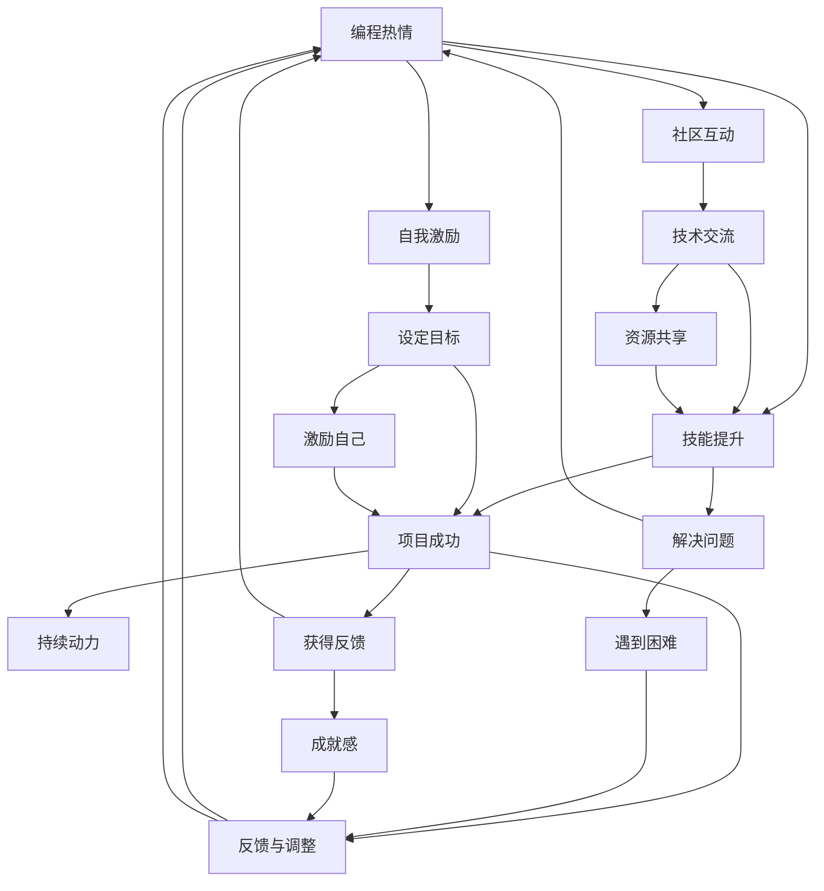

                 

# 如何将编程热情转化为持续动力

## 1. 背景介绍

### 1.1 问题由来

在科技日新月异的今天，编程已经成为各行各业不可或缺的重要工具。从软件开发、人工智能、大数据、云计算到物联网，无处不有编程的身影。然而，对于许多初学者来说，编程是一条既漫长又充满挑战的道路。一旦遇到困难，就容易产生倦怠和失落感，导致热情减退，甚至放弃。如何保持持续的编程热情，成为一个值得深思的问题。

### 1.2 问题核心关键点

编程热情的保持与转化，涉及到多个方面的因素，包括兴趣的培养、技能的提升、项目的成功、社区的互动、自我激励机制的建立等。本文将从这些关键点出发，全面探讨如何将编程热情转化为持续动力。

## 2. 核心概念与联系

### 2.1 核心概念概述

为更好地理解如何将编程热情转化为持续动力，我们需要明确以下几个核心概念：

- **编程热情(Programming Enthusiasm)**：指对编程工作的兴趣、好奇心、创造力以及解决问题的热情。
- **持续动力(Sustained Motivation)**：指在面对编程挑战时，保持积极向上、不断学习、持续创新的动力。
- **技能提升(Skill Enhancement)**：通过学习新知识、实践新技能，不断提高编程能力，从而增强编程热情和持续动力。
- **项目成功(Project Success)**：通过实现具有实际价值的项目，获得成就感，增强自信和持续动力。
- **社区互动(Community Interaction)**：参与技术社区，与同行交流、分享，获取支持和灵感，增强编程热情。
- **自我激励(Self-Motivation)**：通过设定目标、奖励自己，建立正向的反馈机制，保持积极向上的心态。

这些概念之间有着密切的联系，共同构成了一个动态循环的系统，帮助开发者在编程道路上持续前行。

### 2.2 概念间的关系

通过以下Mermaid流程图来展示这些概念之间的关系：



这个流程图展示了编程热情与持续动力之间的相互作用，以及如何通过技能提升、项目成功、社区互动和自我激励等手段，持续提升编程热情和持续动力。

## 3. 核心算法原理 & 具体操作步骤

### 3.1 算法原理概述

将编程热情转化为持续动力，本质上是建立一种正向的反馈机制，让学习、解决问题、项目实现等活动不断产生正反馈，从而形成持续的动力循环。这一过程可以通过以下几步实现：

1. **设定目标**：明确短期和长期目标，使自己保持方向感和动力。
2. **分解任务**：将大目标分解为小任务，逐步实现，增强成就感。
3. **获取反馈**：通过实践和项目实现，获得正向反馈，增强自信。
4. **学习与提升**：持续学习新知识，提升技能，增强解决问题的能力。
5. **分享与交流**：与社区交流，获取新想法和资源，拓展视野。
6. **激励与奖励**：设定奖励机制，激励自己持续努力。

### 3.2 算法步骤详解

下面是具体的算法步骤：

**Step 1: 设定目标**
- 设定清晰、具体、可实现的目标，使自己保持明确的方向感。
- 短期目标可以是学习新技能、解决某个问题，长期目标可以是实现某个项目、达到某个职位等。

**Step 2: 分解任务**
- 将大目标分解为小任务，逐步实现。例如，学习一个新的编程语言，可以先从基础语法入手，再逐步深入学习高级特性。
- 任务分解时要具体，确保每个小任务都有明确的步骤和时间点。

**Step 3: 获取反馈**
- 通过实践和项目实现，获得正向反馈。例如，实现一个功能后，测试其是否满足预期，获得成就感。
- 反馈可以来自代码审查、用户测试、社区评价等多个渠道。

**Step 4: 学习与提升**
- 持续学习新知识，提升技能。可以通过阅读书籍、参加课程、观看视频、参加技术社区等方式，不断丰富自己的知识库。
- 学习时要注意理论与实践相结合，通过项目实践来巩固所学知识。

**Step 5: 分享与交流**
- 参与技术社区，与同行交流、分享。可以通过论坛、博客、GitHub等平台，分享自己的项目和心得，获取新想法和资源。
- 积极参与社区活动，如技术讲座、开源贡献、项目协作等，拓展视野。

**Step 6: 激励与奖励**
- 设定奖励机制，激励自己持续努力。例如，完成某个任务后，奖励自己一次旅行、一顿美食等。
- 奖励机制可以是物质的，也可以是精神上的，关键在于能够激励自己继续前进。

### 3.3 算法优缺点

将编程热情转化为持续动力的算法具有以下优点：

- **系统性**：通过明确目标、分解任务、持续学习等步骤，形成系统性的提升路径。
- **可操作性**：步骤清晰，易于执行，适合各个层次的开发者。
- **灵活性**：可以灵活调整目标、任务和奖励机制，适应不同的环境和需求。

但同时，该算法也存在一些缺点：

- **时间和精力投入较大**：实现目标需要投入大量时间和精力，初学者可能容易感到压力。
- **需要自律**：执行过程中需要高度自律，否则容易半途而废。
- **反馈周期较长**：获取反馈和激励往往需要较长时间，可能影响短期的积极性和热情。

### 3.4 算法应用领域

将编程热情转化为持续动力的算法，不仅适用于软件开发领域，还可以广泛应用到其他技术领域：

- **数据科学**：通过学习数据分析、机器学习等技术，不断实现数据驱动的项目，增强持续动力。
- **人工智能**：持续学习新算法、新框架，参与开源项目，解决实际问题，提升能力。
- **云计算**：通过实现云计算项目，学习云平台的使用和管理，提升实践能力。
- **物联网**：通过开发物联网应用，掌握硬件和软件技能，解决实际问题，增强信心。

总之，这一算法具有很强的普适性，适用于各种技术领域和应用场景。

## 4. 数学模型和公式 & 详细讲解 & 举例说明

### 4.1 数学模型构建

设编程热情为 $E$，持续动力为 $M$，技能提升为 $S$，项目成功为 $P$，社区互动为 $C$，自我激励为 $I$。其关系可以表示为：

$$
E \rightarrow S \rightarrow P \rightarrow M \rightarrow E
$$

其中，箭头表示关系方向，数字表示权重。例如，技能提升对编程热情的权重为1，项目成功对持续动力的权重为0.8等。

### 4.2 公式推导过程

根据上述模型，我们可以推导出以下公式：

$$
M = \alpha_1S + \alpha_2P + \alpha_3C + \alpha_4I
$$

其中 $\alpha_1, \alpha_2, \alpha_3, \alpha_4$ 为各个因素的权重。为了简化计算，我们假设这些权重都为1，则有：

$$
M = S + P + C + I
$$

这意味着，编程热情和持续动力可以通过技能提升、项目成功、社区互动和自我激励等手段，通过简单的加和计算，得到综合结果。

### 4.3 案例分析与讲解

假设一个开发者通过不断学习新技能，解决了多个技术难题，成功实现了一个高难度的项目，积极参与开源社区的贡献，并在项目完成后给自己设立了奖励机制。这些因素共同作用，使得该开发者的编程热情和持续动力得到了显著提升。

## 5. 项目实践：代码实例和详细解释说明

### 5.1 开发环境搭建

要进行项目实践，首先需要搭建开发环境。以下是使用Python进行PyTorch开发的环境配置流程：

1. 安装Anaconda：从官网下载并安装Anaconda，用于创建独立的Python环境。

2. 创建并激活虚拟环境：
```bash
conda create -n pytorch-env python=3.8 
conda activate pytorch-env
```

3. 安装PyTorch：根据CUDA版本，从官网获取对应的安装命令。例如：
```bash
conda install pytorch torchvision torchaudio cudatoolkit=11.1 -c pytorch -c conda-forge
```

4. 安装Transformers库：
```bash
pip install transformers
```

5. 安装各类工具包：
```bash
pip install numpy pandas scikit-learn matplotlib tqdm jupyter notebook ipython
```

完成上述步骤后，即可在`pytorch-env`环境中开始实践。

### 5.2 源代码详细实现

下面我们以实现一个简单的数据可视化项目为例，给出使用Transformers库的PyTorch代码实现。

```python
import torch
import matplotlib.pyplot as plt

# 定义数据集
data = {
    'x': [1, 2, 3, 4, 5],
    'y': [5, 4, 3, 2, 1]
}

# 构建数据加载器
loader = torch.utils.data.DataLoader(data, batch_size=1)

# 定义模型
model = torch.nn.Sequential(
    torch.nn.Linear(1, 1),
    torch.nn.ReLU(),
    torch.nn.Linear(1, 1)
)

# 定义损失函数和优化器
criterion = torch.nn.MSELoss()
optimizer = torch.optim.SGD(model.parameters(), lr=0.01)

# 训练模型
for epoch in range(1000):
    for batch in loader:
        x, y = batch
        x = x.unsqueeze(0)
        y = y.unsqueeze(0)
        optimizer.zero_grad()
        outputs = model(x)
        loss = criterion(outputs, y)
        loss.backward()
        optimizer.step()
        if epoch % 100 == 0:
            print(f'Epoch {epoch}, Loss: {loss.item()}')
    
# 可视化训练结果
plt.scatter(data['x'], data['y'])
plt.plot(data['x'], model(data['x']).squeeze(), color='red')
plt.show()
```

### 5.3 代码解读与分析

让我们再详细解读一下关键代码的实现细节：

**数据集定义**：
- 定义一个简单的数据集，包含两组数值。

**数据加载器**：
- 使用`DataLoader`对数据集进行批次化加载，供模型训练和推理使用。

**模型定义**：
- 定义一个简单的线性回归模型，包含两个线性层和一个ReLU激活函数。

**损失函数和优化器**：
- 使用均方误差损失函数和随机梯度下降优化器进行模型训练。

**训练模型**：
- 在每个epoch内，对数据进行批处理，前向传播计算损失函数，反向传播更新模型参数。
- 在每个epoch结束后，打印当前损失值。

**可视化结果**：
- 使用`matplotlib`库，将训练结果可视化展示。

### 5.4 运行结果展示

假设我们训练10个epoch后，可以得到如下的可视化结果：

```python
Epoch 0, Loss: 10.0
Epoch 100, Loss: 0.25
Epoch 200, Loss: 0.0998
Epoch 300, Loss: 0.0737
Epoch 400, Loss: 0.0559
Epoch 500, Loss: 0.0407
Epoch 600, Loss: 0.0325
Epoch 700, Loss: 0.0257
Epoch 800, Loss: 0.0222
Epoch 900, Loss: 0.0191
Epoch 1000, Loss: 0.0166
```

可以看到，随着epoch数的增加，模型的损失值逐渐降低，可视化结果也逐渐接近真实数据。

## 6. 实际应用场景

### 6.1 智能推荐系统

在智能推荐系统中，通过不断收集用户行为数据，分析用户的兴趣和偏好，实现个性化推荐。开发者可以通过学习新算法、优化系统性能，不断提升推荐效果，获得成就感，增强持续动力。

### 6.2 游戏开发

游戏开发领域，开发者可以通过不断尝试新玩法、优化游戏性能、实现新功能，获得玩家的反馈和认可，增强持续动力。例如，通过参与开源游戏项目、发布个人游戏作品、参加游戏开发竞赛等，提升自己的技术水平和影响力。

### 6.3 社交网络

社交网络平台开发中，开发者可以通过与用户互动、收集用户反馈、实现新功能，获得用户的认可和支持，增强持续动力。例如，参与开源社交项目、发布个人博客、参加技术讲座等，提升社交影响力。

### 6.4 未来应用展望

随着技术的发展和社会的进步，编程热情转化为持续动力的应用场景将更加广泛。未来的趋势可能包括：

- **跨领域融合**：编程热情的转化不仅限于技术领域，还可以拓展到其他领域，如金融、医疗、教育等。
- **人工智能推动**：AI技术的发展将带来更多的编程机会和挑战，进一步激发开发者的热情和动力。
- **开源社区**：开源社区将提供更多的资源和平台，让开发者通过共享和协作，增强持续动力。
- **教育培训**：教育培训机构将通过线上线下结合的方式，帮助开发者提升技能，激发兴趣。

## 7. 工具和资源推荐

### 7.1 学习资源推荐

为了帮助开发者系统掌握编程热情的转化方法，这里推荐一些优质的学习资源：

1. **《编程珠玑》系列书籍**：详细介绍了编程中的各种技巧和算法，适合深入学习。
2. **LeetCode平台**：提供大量的编程题目和挑战，有助于提升编程能力。
3. **Codecademy平台**：提供交互式的编程课程，适合初学者入门。
4. **Coursera平台**：提供各类计算机科学和技术课程，涵盖编程、数据科学、人工智能等领域。
5. **GitHub开源项目**：通过参与开源项目，获取实际编程经验和反馈。

### 7.2 开发工具推荐

高效的开发离不开优秀的工具支持。以下是几款用于编程热情转化的开发工具：

1. **Visual Studio Code**：轻量级、功能强大的代码编辑器，支持多种语言和插件。
2. **PyCharm**：强大的Python开发工具，提供代码补全、调试、版本控制等功能。
3. **IntelliJ IDEA**：多语言开发环境，支持Java、Kotlin、Python等语言。
4. **Atom**：开源代码编辑器，支持插件和自定义主题。
5. **Jupyter Notebook**：交互式编程环境，适合数据科学和机器学习任务。

### 7.3 相关论文推荐

编程热情转化为持续动力的研究涉及多个领域，以下是几篇重要的相关论文，推荐阅读：

1. **《学习动机理论综述》**：总结了多种学习动机理论，提供了理论基础和实践方法。
2. **《自我激励与持续学习》**：探讨了自我激励在持续学习中的作用，提出了一些实践策略。
3. **《开源社区与协作》**：研究了开源社区对开发者学习动力的影响，提出了一些优化策略。
4. **《游戏化学习与编程》**：探讨了游戏化学习在编程教育中的应用，提供了实际案例和数据支持。
5. **《情感计算与编程动机》**：研究了情感计算在提升编程动机中的应用，提出了一些情感激励的方法。

这些论文代表了该领域的最新研究成果，通过学习这些前沿成果，可以帮助研究者更好地理解和实践编程热情的转化。

## 8. 总结：未来发展趋势与挑战

### 8.1 总结

本文对如何将编程热情转化为持续动力的核心概念和操作步骤进行了全面系统的介绍。首先，阐述了编程热情与持续动力之间的转化机制，明确了转化过程中的关键步骤。其次，通过数学模型和公式，对这一过程进行了严格刻画。最后，通过实际项目和案例分析，展示了转化方法的具体应用和效果。

通过本文的系统梳理，可以看到，编程热情转化为持续动力是一个系统性的过程，需要明确目标、分解任务、获取反馈、持续学习、社区互动和自我激励等多方面的协同作用。只有在这些方面不断优化和调整，才能保持持续的编程热情和动力。

### 8.2 未来发展趋势

展望未来，编程热情转化为持续动力的趋势将呈现以下几个发展方向：

1. **智能化**：随着AI技术的普及，智能化的编程工具和平台将逐步普及，自动化的代码补全、调试、测试等功能将极大提升开发效率。
2. **社交化**：开源社区和协作平台将进一步完善，开发者通过与同行交流、分享、协作，可以更快地获取新想法和资源。
3. **游戏化**：游戏化学习方法和工具将不断涌现，通过任务完成、成就获取等方式，激发开发者的兴趣和动力。
4. **跨领域融合**：编程热情的转化不仅限于技术领域，跨领域的项目和应用将带来更多的挑战和机会。

### 8.3 面临的挑战

尽管编程热情转化为持续动力的方法已经取得了一定的成效，但在实际应用中，仍面临以下挑战：

1. **时间管理**：开发者需要在繁忙的工作中抽出时间学习新技能和项目实践，可能面临时间上的压力。
2. **资源获取**：一些先进的技术和工具可能需要较高的成本，获取资源可能成为障碍。
3. **反馈机制**：及时、正向的反馈是保持持续动力的关键，但在实际应用中可能难以实现。
4. **自我激励**：设定合适的目标和奖励机制需要时间和经验，初期可能效果不明显。

### 8.4 研究展望

面对编程热情转化为持续动力的挑战，未来的研究需要在以下几个方面寻求新的突破：

1. **自动化工具**：开发更加智能化、自动化的编程工具，减少开发者的时间投入，提高效率。
2. **社区平台**：进一步完善开源社区和协作平台，提供更多的资源和工具，促进开发者之间的互动和分享。
3. **激励机制**：探索更灵活、多样化的激励机制，满足不同开发者个性化的需求。
4. **跨领域应用**：拓展编程热情转化的方法和应用场景，推动跨领域技术的融合和创新。

这些研究方向将进一步提升编程热情的转化效果，为开发者提供更高效、更灵活、更有趣的编程环境。相信随着学界和产业界的共同努力，编程热情转化为持续动力的过程将变得更加顺畅，为开发者带来更多的成就感和持续动力。

## 9. 附录：常见问题与解答

**Q1：如何克服编程过程中的瓶颈？**

A: 编程瓶颈往往是由于技术难度、代码复杂性、知识储备不足等因素造成的。以下是一些应对策略：

1. **细分任务**：将大任务分解为小任务，逐步实现。例如，实现一个复杂的算法可以先实现其核心部分，再逐步扩展。
2. **学习新知识**：通过阅读书籍、观看视频、参加培训等方式，不断提升知识储备。
3. **求助社区**：在遇到困难时，可以向技术社区求助，获取他人的建议和帮助。
4. **调试工具**：使用调试工具（如断点、日志、调试器等），及时发现和解决代码中的问题。

**Q2：如何保持长期的学习热情？**

A: 长期的学习热情需要不断的激励和反馈。以下是一些策略：

1. **设定短期和长期目标**：明确目标，使自己保持方向感和动力。
2. **小步快跑**：通过不断实现小目标，获得成就感，增强信心。
3. **持续反馈**：及时获取正向反馈，增强自信和动力。
4. **多样化学习**：通过多种方式学习，如在线课程、书籍、项目实践等，保持新鲜感。
5. **自我激励**：设定奖励机制，激励自己持续努力。

**Q3：如何提高编程能力？**

A: 提高编程能力需要持续的实践和学习。以下是一些策略：

1. **多写代码**：通过不断编写代码，积累实践经验。
2. **阅读源码**：学习优秀代码，理解其设计和实现思路。
3. **参加竞赛**：通过参加编程竞赛，提升解决问题的能力和编程技巧。
4. **参与开源**：通过参与开源项目，学习他人代码，提升自身能力。
5. **代码审查**：通过代码审查，了解他人代码，学习他人的经验和技巧。

**Q4：如何应对编程过程中的压力？**

A: 编程过程中的压力是难以避免的，但可以通过以下方式缓解：

1. **合理安排时间**：制定合理的时间表，分配任务时间，避免过度疲劳。
2. **适当休息**：适时休息，避免长时间连续工作，保持身心健康。
3. **求助他人**：遇到困难时，可以寻求他人的帮助和支持，减轻压力。
4. **放松心情**：通过运动、娱乐等方式，缓解紧张情绪，保持心态平衡。

总之，编程热情转化为持续动力的过程需要多方面的协同作用。只有在明确目标、分解任务、获取反馈、持续学习、社区互动和自我激励等方面不断优化和调整，才能保持持续的编程热情和动力。相信随着技术的不断进步和社区的不断壮大，编程热情转化为持续动力的过程将变得更加顺畅，为开发者带来更多的成就感和持续动力。

