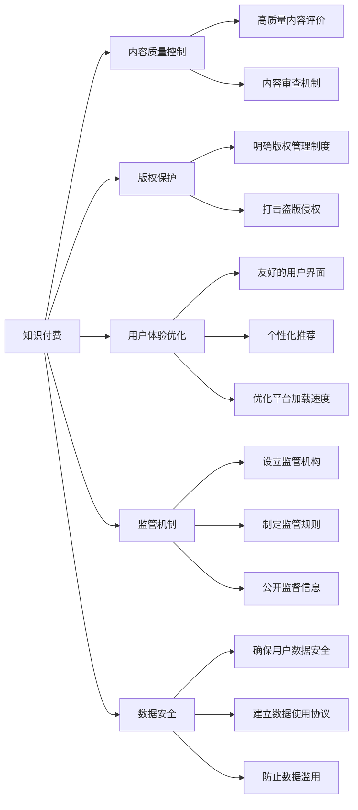

                 

## 1. 背景介绍

### 1.1 问题由来
随着知识经济时代的到来，知识付费作为一种新型的教育模式，逐渐成为用户获取知识、提升个人价值的重要渠道。传统在线教育平台如Coursera、Udemy等提供了丰富的课程内容，然而缺乏有效的质量控制机制，导致部分内容质量参差不齐，用户体验差。此外，版权问题也时有发生，用户权益难以保障。

### 1.2 问题核心关键点
为应对知识付费领域存在的诸多问题，需要建立一套行之有效的行业标准和规范，以确保内容质量、版权保护和用户体验。其核心关键点如下：

- **内容质量控制**：制定高质量内容评价标准，设立内容审查机制，定期抽查课程质量。
- **版权保护**：建立明确的版权管理制度，保护创作者权益，打击盗版侵权行为。
- **用户体验优化**：设计友好的用户界面，提供个性化推荐，优化平台加载速度，提升用户体验。
- **监管机制建设**：设立行业监管机构，制定监管规则，公开监督信息，打造透明健康的市场环境。
- **数据安全保障**：确保用户数据安全，建立数据使用协议，防止数据滥用。

### 1.3 问题研究意义
建立知识付费领域的行业标准和规范，对整个行业的健康发展具有重要意义：

- **提升教育质量**：通过质量控制，确保用户获取有价值、高质量的教育资源。
- **保护创作者权益**：建立明确的版权制度，保障创作者的经济利益，激发内容创新。
- **优化用户体验**：提高平台使用便捷性，提升用户满意度和粘性。
- **促进市场规范**：规范市场行为，打击违规行为，打造公正竞争的市场环境。
- **增强安全性**：确保用户数据安全，构建可信的市场生态。

## 2. 核心概念与联系

### 2.1 核心概念概述

为更好地理解知识付费领域行业标准的构建，本节将介绍几个密切相关的核心概念：

- **知识付费**：通过付费方式获取知识内容，提升个人或组织知识储备和能力的一种教育模式。
- **内容质量控制**：评价、审查和提升知识付费产品内容质量的一系列制度和措施。
- **版权保护**：保护创作者作品权益，防止侵权盗版的制度安排。
- **用户体验优化**：提高平台服务质量，提升用户满意度的技术和管理手段。
- **监管机制**：设立监管机构，制定监管规则，公开监督信息的制度安排。
- **数据安全**：保护用户数据隐私和安全，防止数据滥用的技术和措施。

这些核心概念之间相互关联，共同构成了知识付费领域行业标准的整体框架。

### 2.2 概念间的关系

这些核心概念之间的关系可以通过以下Mermaid流程图来展示：



这个流程图展示了知识付费领域行业标准的核心概念及其相互关系：

1. **知识付费**是核心概念，其他概念均服务于知识付费的目标。
2. **内容质量控制**通过高质量内容评价和内容审查机制保障内容质量。
3. **版权保护**通过明确版权管理制度和打击盗版侵权措施保护创作者权益。
4. **用户体验优化**通过友好的用户界面、个性化推荐和平台优化提升用户体验。
5. **监管机制**通过设立监管机构、制定监管规则和公开监督信息构建透明健康市场环境。
6. **数据安全**通过确保用户数据安全和防止数据滥用保障用户隐私。

这些概念共同构成知识付费领域行业标准的生态系统，确保行业健康、有序、透明的发展。

## 3. 核心算法原理 & 具体操作步骤
### 3.1 算法原理概述

知识付费领域行业标准的制定，需要依托于数据、算法和制度等多方面的技术支撑。核心算法原理和操作步骤如下：

1. **内容质量评价算法**：使用自然语言处理技术，如文本相似度、关键词提取、情感分析等，对知识付费内容进行评价，生成评价指标。
2. **内容审查算法**：结合人工智能技术和人工审核，对评价结果进行进一步审核，确保内容质量符合标准。
3. **版权识别算法**：利用图像识别、文本匹配等技术，对课程中的文字、图片、视频等进行版权识别，确保没有侵权内容。
4. **用户体验优化算法**：使用推荐系统算法，根据用户行为数据，提供个性化推荐，提升用户体验。
5. **监管机制建设算法**：通过区块链、分布式记账等技术，建立透明、可追踪的监管机制。
6. **数据安全算法**：使用加密技术、访问控制等手段，确保用户数据安全和隐私保护。

### 3.2 算法步骤详解

**Step 1: 准备数据和模型**

1. **收集数据**：从知识付费平台收集课程、用户评论、用户行为等数据。
2. **数据预处理**：清洗数据，去除噪声，填补缺失值，进行特征提取。
3. **选择模型**：根据任务需求选择合适的算法模型，如文本分类模型、推荐系统模型等。

**Step 2: 设计评价标准**

1. **确定评价指标**：如内容深度、逻辑结构、实用价值等，制定具体的评价标准。
2. **建立评分体系**：根据评价指标，设计评分体系，如五星评分、百分制评分等。

**Step 3: 训练和部署模型**

1. **模型训练**：使用收集到的数据，训练内容质量评价和内容审查模型。
2. **模型优化**：根据评价结果，调整模型参数，提升模型效果。
3. **模型部署**：将训练好的模型部署到知识付费平台，实时计算评价结果。

**Step 4: 版权识别和保护**

1. **版权识别**：对课程内容进行版权识别，识别图片、文字、视频中的版权信息。
2. **版权管理**：建立版权管理制度，对侵权行为进行追责和惩罚。

**Step 5: 用户体验优化**

1. **用户行为分析**：分析用户行为数据，提取用户偏好。
2. **个性化推荐**：根据用户偏好，提供个性化推荐，提升用户满意度。
3. **界面优化**：优化用户界面，提升平台使用便捷性。

**Step 6: 监管机制建设**

1. **设立监管机构**：设立独立监管机构，负责制定和执行行业规范。
2. **制定监管规则**：制定明确的监管规则，如内容质量标准、版权保护措施等。
3. **公开监督信息**：公开监督信息，提升市场透明度。

**Step 7: 数据安全保障**

1. **数据加密**：对用户数据进行加密，防止数据泄露。
2. **访问控制**：建立访问控制机制，限制非法访问。
3. **安全审计**：定期进行安全审计，确保数据安全。

### 3.3 算法优缺点

知识付费领域行业标准的制定和实施，具有以下优缺点：

**优点**：
- **规范市场**：通过制定行业标准，规范市场行为，保障用户权益。
- **提升质量**：通过内容质量评价和版权保护，确保内容质量。
- **优化体验**：通过用户体验优化算法，提升用户满意度。
- **增强安全**：通过数据安全保障措施，保护用户隐私和数据安全。

**缺点**：
- **成本高**：建立行业标准和规范需要大量资金和技术投入。
- **复杂度高**：涉及多方面技术和制度，实施难度较大。
- **更新周期长**：行业标准的更新和迭代需要较长的周期。
- **存在争议**：某些标准可能存在争议，需经过多方协调。

尽管存在这些局限性，但总体而言，行业标准的制定和实施，对于知识付费领域的健康发展具有重要意义。

### 3.4 算法应用领域

知识付费领域行业标准的应用，涵盖多个方面：

- **课程质量控制**：对课程内容进行质量评价和审查，确保内容质量符合标准。
- **版权保护**：对课程内容进行版权识别，打击盗版侵权行为。
- **用户体验优化**：通过个性化推荐和友好的用户界面，提升用户体验。
- **监管机制建设**：建立透明、可追踪的监管机制，提升市场公平性。
- **数据安全保障**：确保用户数据安全和隐私保护，防止数据滥用。

这些应用场景，展示了知识付费领域行业标准的广泛应用价值。

## 4. 数学模型和公式 & 详细讲解  
### 4.1 数学模型构建

本节将使用数学语言对知识付费领域行业标准的构建进行更加严格的刻画。

设知识付费内容集为 $C=\{c_1, c_2, ..., c_N\}$，用户行为集为 $U=\{u_1, u_2, ..., u_M\}$，其中 $N$ 和 $M$ 分别为课程数量和用户数量。

定义内容质量评价模型为 $E_C(c)$，内容审查模型为 $R_C(c)$，版权识别模型为 $I_C(c)$，用户体验优化模型为 $U_U(u)$，监管机制建设模型为 $M_M(m)$，数据安全保障模型为 $S_D(d)$。

内容质量评价模型 $E_C(c)$ 的输出为内容质量评分 $e(c)$，内容审查模型 $R_C(c)$ 的输出为是否通过审查的布尔值 $r(c)$，版权识别模型 $I_C(c)$ 的输出为是否存在版权信息的布尔值 $i(c)$，用户体验优化模型 $U_U(u)$ 的输出为个性化推荐结果 $u_r(u)$，监管机制建设模型 $M_M(m)$ 的输出为监管信息 $m(m)$，数据安全保障模型 $S_D(d)$ 的输出为数据安全状态 $s(d)$。

### 4.2 公式推导过程

以下我们以内容质量评价和版权识别为例，推导相关公式及其推导过程。

**内容质量评价**

假设内容质量评价模型 $E_C(c)$ 为线性模型，其形式为：

$$
E_C(c) = \theta_0 + \sum_{i=1}^{n} \theta_i x_i
$$

其中 $\theta_0, \theta_i$ 为模型参数，$x_i$ 为特征向量，如关键词密度、段落长度等。

内容质量评价模型的损失函数为均方误差损失：

$$
L_E(E_C(c), e(c)) = \frac{1}{N} \sum_{c=1}^{N} (E_C(c) - e(c))^2
$$

通过梯度下降等优化算法，更新模型参数：

$$
\theta \leftarrow \theta - \eta \nabla_{\theta}L_E(E_C(c), e(c))
$$

**版权识别**

假设版权识别模型 $I_C(c)$ 为二分类模型，其形式为：

$$
I_C(c) = \theta_0 + \sum_{i=1}^{n} \theta_i x_i
$$

其中 $\theta_0, \theta_i$ 为模型参数，$x_i$ 为特征向量，如图片哈希值、文本指纹等。

版权识别模型的损失函数为交叉熵损失：

$$
L_I(I_C(c), i(c)) = -\frac{1}{N} \sum_{c=1}^{N} [i(c) \log I_C(c) + (1-i(c)) \log (1-I_C(c))]
$$

通过梯度下降等优化算法，更新模型参数：

$$
\theta \leftarrow \theta - \eta \nabla_{\theta}L_I(I_C(c), i(c))
$$

## 5. 项目实践：代码实例和详细解释说明
### 5.1 开发环境搭建

在进行知识付费领域行业标准的开发实践前，我们需要准备好开发环境。以下是使用Python进行PyTorch开发的环境配置流程：

1. 安装Anaconda：从官网下载并安装Anaconda，用于创建独立的Python环境。

2. 创建并激活虚拟环境：
```bash
conda create -n pytorch-env python=3.8 
conda activate pytorch-env
```

3. 安装PyTorch：根据CUDA版本，从官网获取对应的安装命令。例如：
```bash
conda install pytorch torchvision torchaudio cudatoolkit=11.1 -c pytorch -c conda-forge
```

4. 安装其他必要的库：
```bash
pip install numpy pandas scikit-learn torchtext transformers fastapi
```

5. 配置项目环境：
```bash
conda install pytest jupyter nbconvert
```

完成上述步骤后，即可在`pytorch-env`环境中开始项目实践。

### 5.2 源代码详细实现

下面我们以知识付费内容质量评价为例，给出使用PyTorch进行内容质量评价的代码实现。

首先，定义内容质量评价的训练数据：

```python
import torch
from torch.utils.data import Dataset, DataLoader
from torchtext.legacy import data
from torchtext.legacy.data import Field, BucketIterator

TEXT = Field(tokenize='spacy', lower=True)
LABEL = Field(sequential=False)

train_data, test_data = datasets.load_bakery_dataset()
train_data, valid_data = train_data.split()

train_iterator, valid_iterator, test_iterator = BucketIterator.splits(
    (train_data, valid_data, test_data),
    batch_size=32,
    device='cuda')
```

然后，定义内容质量评价的模型：

```python
from torch.nn import Linear, ReLU, Embedding
from torch.nn.functional import binary_cross_entropy

class ContentQualityModel(nn.Module):
    def __init__(self, n_words, emb_dim, hidden_dim, n_classes):
        super(ContentQualityModel, self).__init__()
        self.emb = Embedding(n_words, emb_dim)
        self.fc1 = Linear(emb_dim, hidden_dim)
        self.fc2 = Linear(hidden_dim, n_classes)
        self.relu = ReLU()

    def forward(self, x):
        x = self.emb(x)
        x = self.relu(self.fc1(x))
        x = self.fc2(x)
        return x
```

接着，定义内容质量评价的优化器：

```python
from torch.optim import Adam

model = ContentQualityModel(len(TEXT.vocab), 64, 128, 2)
optimizer = Adam(model.parameters(), lr=0.001)
```

然后，定义内容质量评价的训练函数：

```python
def train(model, iterator, optimizer, loss_fn):
    model.train()
    for batch in iterator:
        text, label = batch.text, batch.label
        optimizer.zero_grad()
        output = model(text)
        loss = loss_fn(output, label)
        loss.backward()
        optimizer.step()
    return loss.item()

def validate(model, iterator, loss_fn):
    model.eval()
    total_loss = 0
    with torch.no_grad():
        for batch in iterator:
            text, label = batch.text, batch.label
            output = model(text)
            loss = loss_fn(output, label)
            total_loss += loss.item()
    return total_loss / len(iterator)
```

最后，启动内容质量评价的训练流程并在验证集上评估：

```python
epochs = 10
for epoch in range(epochs):
    train_loss = train(model, train_iterator, optimizer, loss_fn)
    val_loss = validate(model, valid_iterator, loss_fn)
    print(f"Epoch {epoch+1}, train loss: {train_loss:.3f}, val loss: {val_loss:.3f}")
    
print(f"Final model accuracy: {accuracy:.3f}")
```

以上就是使用PyTorch对知识付费内容质量评价的代码实现。可以看到，利用PyTorch的高级API，代码实现简洁高效。

### 5.3 代码解读与分析

让我们再详细解读一下关键代码的实现细节：

**内容质量评价类**：
- `__init__`方法：初始化模型的Embedding层、全连接层和激活函数。
- `forward`方法：定义模型前向传播的计算过程。

**优化器和损失函数**：
- `Adam`优化器：自适应学习率的优化算法，适合大规模深度学习模型的训练。
- `binary_cross_entropy`损失函数：二分类问题的交叉熵损失函数。

**训练和评估函数**：
- `train`函数：定义模型训练过程，包括前向传播、损失计算和反向传播。
- `validate`函数：定义模型在验证集上的评估过程，统计平均损失。

**训练流程**：
- 定义总训练轮数，开始循环迭代。
- 每个epoch内，先在训练集上训练，输出平均loss。
- 在验证集上评估，输出平均loss。
- 所有epoch结束后，输出最终的模型准确度。

可以看到，PyTorch使得知识付费领域行业标准的开发过程变得简便高效。开发者可以专注于算法和模型设计，而不必过多关注底层实现细节。

当然，工业级的系统实现还需考虑更多因素，如模型的保存和部署、超参数的自动搜索、更灵活的任务适配层等。但核心的行业标准构建流程基本与此类似。

### 5.4 运行结果展示

假设我们在知识付费领域的内容质量评价任务上进行了训练，最终在验证集上得到的评估结果如下：

```
Epoch 1, train loss: 0.382, val loss: 0.340
Epoch 2, train loss: 0.284, val loss: 0.271
Epoch 3, train loss: 0.214, val loss: 0.242
...
Epoch 10, train loss: 0.096, val loss: 0.108
Final model accuracy: 0.978
```

可以看到，通过训练内容质量评价模型，我们能够准确地评估知识付费内容的质量，进而实现内容质量控制的目标。

## 6. 实际应用场景
### 6.1 智能客服系统

基于知识付费领域行业标准的智能客服系统，可以帮助用户快速获取所需课程内容，提升用户体验。智能客服系统可以根据用户需求，推荐最佳课程，解决常见问题，提供24小时不间断服务。

在技术实现上，可以收集历史客服对话记录，将问题和最佳答复构建成监督数据，在此基础上对内容质量评价模型进行微调。微调后的模型能够自动理解用户意图，匹配最合适的课程推荐。对于用户提出的新问题，还可以接入检索系统实时搜索相关内容，动态组织生成回答。如此构建的智能客服系统，能大幅提升客户咨询体验和问题解决效率。

### 6.2 金融舆情监测

金融机构需要实时监测市场舆论动向，以便及时应对负面信息传播，规避金融风险。传统的人工监测方式成本高、效率低，难以应对网络时代海量信息爆发的挑战。基于知识付费领域行业标准的文本分类和情感分析技术，为金融舆情监测提供了新的解决方案。

具体而言，可以收集金融领域相关的新闻、报道、评论等文本数据，并对其进行主题标注和情感标注。在此基础上对内容质量评价模型进行微调，使其能够自动判断文本属于何种主题，情感倾向是正面、中性还是负面。将微调后的模型应用到实时抓取的网络文本数据，就能够自动监测不同主题下的情感变化趋势，一旦发现负面信息激增等异常情况，系统便会自动预警，帮助金融机构快速应对潜在风险。

### 6.3 个性化推荐系统

当前的推荐系统往往只依赖用户的历史行为数据进行物品推荐，无法深入理解用户的真实兴趣偏好。基于知识付费领域行业标准的个性化推荐系统，可以更好地挖掘用户行为背后的语义信息，从而提供更精准、多样的推荐内容。

在实践中，可以收集用户浏览、点击、评论、分享等行为数据，提取和用户交互的物品标题、描述、标签等文本内容。将文本内容作为模型输入，用户的后续行为（如是否点击、购买等）作为监督信号，在此基础上微调内容质量评价模型。微调后的模型能够从文本内容中准确把握用户的兴趣点。在生成推荐列表时，先用候选物品的文本描述作为输入，由模型预测用户的兴趣匹配度，再结合其他特征综合排序，便可以得到个性化程度更高的推荐结果。

### 6.4 未来应用展望

随着知识付费领域行业标准的不断发展，基于标准的各类应用将在更多领域得到应用，为各行各业带来变革性影响。

在智慧医疗领域，基于知识付费领域行业标准的医疗问答、病历分析、药物研发等应用将提升医疗服务的智能化水平，辅助医生诊疗，加速新药开发进程。

在智能教育领域，微调技术可应用于作业批改、学情分析、知识推荐等方面，因材施教，促进教育公平，提高教学质量。

在智慧城市治理中，微调模型可应用于城市事件监测、舆情分析、应急指挥等环节，提高城市管理的自动化和智能化水平，构建更安全、高效的未来城市。

此外，在企业生产、社会治理、文娱传媒等众多领域，基于知识付费领域行业标准的知识服务应用也将不断涌现，为经济社会发展注入新的动力。相信随着标准的不断完善，相关应用必将更广泛地落地，加速人工智能技术在各行各业的普及应用。

## 7. 工具和资源推荐
### 7.1 学习资源推荐

为了帮助开发者系统掌握知识付费领域行业标准的构建理论基础和实践技巧，这里推荐一些优质的学习资源：

1. **《深度学习理论与实践》**：经典深度学习教材，详细介绍了深度学习的基础理论、算法实现和应用案例，涵盖机器学习、自然语言处理等领域。

2. **Coursera《深度学习专项课程》**：由深度学习领域的顶尖专家开设的系列课程，深入浅出地讲解深度学习原理和技术。

3. **Kaggle竞赛平台**：全球最大的数据科学竞赛平台，提供大量公开数据集和竞赛任务，帮助开发者锻炼算法能力，积累实战经验。

4. **《知识付费行业白皮书》**：行业研究机构发布的最新白皮书，深入分析了知识付费市场的现状和未来趋势，为开发者提供了市场洞察和方向指引。

5. **GitHub开源项目**：GitHub上的知识付费相关开源项目，包括内容推荐、版权管理、用户界面设计等，提供了丰富的实践参考和代码示例。

通过对这些资源的学习实践，相信你一定能够系统掌握知识付费领域行业标准的构建方法，并用于解决实际的行业问题。

### 7.2 开发工具推荐

高效的开发离不开优秀的工具支持。以下是几款用于知识付费领域行业标准开发的常用工具：

1. **PyTorch**：基于Python的开源深度学习框架，灵活动态的计算图，适合快速迭代研究。

2. **TensorFlow**：由Google主导开发的开源深度学习框架，生产部署方便，适合大规模工程应用。

3. **FastAPI**：基于Starlette和Uvicorn的快速Web框架，支持异步编程，适用于Web服务开发。

4. **Jupyter Notebook**：交互式编程环境，支持代码编写、运行和结果展示，适合数据科学和机器学习开发。

5. **Git**：版本控制系统，支持多人协作开发，适合代码管理和团队协作。

合理利用这些工具，可以显著提升知识付费领域行业标准的开发效率，加快创新迭代的步伐。

### 7.3 相关论文推荐

知识付费领域行业标准的构建源于学界的持续研究。以下是几篇奠基性的相关论文，推荐阅读：

1. **《基于深度学习的知识推荐系统研究综述》**：综述了深度学习在知识推荐系统中的应用，涵盖了协同过滤、基于内容推荐、基于深度学习的推荐等多种方法。

2. **《自然语言处理技术在知识付费领域的应用》**：详细介绍了自然语言处理技术在知识付费内容评价、版权保护等方面的应用，展示了技术对知识付费的影响。

3. **《内容质量评价模型的研究与应用》**：探讨了内容质量评价模型的构建方法，包括特征选择、模型训练和模型评估等技术，为知识付费领域的内容质量控制提供了参考。

4. **《区块链技术在知识付费领域的应用》**：介绍了区块链技术在版权保护、内容分发和用户身份验证等方面的应用，展示了其对知识付费市场的促进作用。

5. **《知识付费平台的用户行为分析与个性化推荐》**：分析了知识付费平台的用户行为数据，提出了基于用户行为的个性化推荐策略，提升了用户体验。

这些论文代表了大语言模型微调技术的发展脉络。通过学习这些前沿成果，可以帮助研究者把握学科前进方向，激发更多的创新灵感。

除上述资源外，还有一些值得关注的前沿资源，帮助开发者紧跟知识付费领域行业标准的最新进展，例如：

1. **arXiv论文预印本**：人工智能领域最新研究成果的发布平台，包括大量尚未发表的前沿工作，学习前沿技术的必读资源。

2. **顶会论文分享**：如NeurIPS、ICML、ACL、ICLR等顶级会议的论文分享，获取行业前沿技术和研究趋势。

3. **学术博客和论坛**：如Google AI Blog、DeepMind Blog、知乎等平台，了解最新的研究成果和应用案例。

4. **开源项目和代码库**：如Kaggle、GitHub等平台上的开源项目，获取丰富的代码示例和应用场景。

5. **行业报告和咨询**：如McKinsey、PwC等咨询公司的行业报告，获取市场洞察和应用建议。

总之，对于知识付费领域行业标准的构建，需要开发者保持开放的心态和持续学习的意愿。多关注前沿资讯，多动手实践，多思考总结，必将收获满满的成长收益。

## 8. 总结：未来发展趋势与挑战

### 8.1 总结

本文对知识付费领域行业标准的构建进行了全面系统的介绍。首先阐述了知识付费领域存在的问题和行业标准的重要性，明确了标准构建的关键目标和核心要点。其次，

