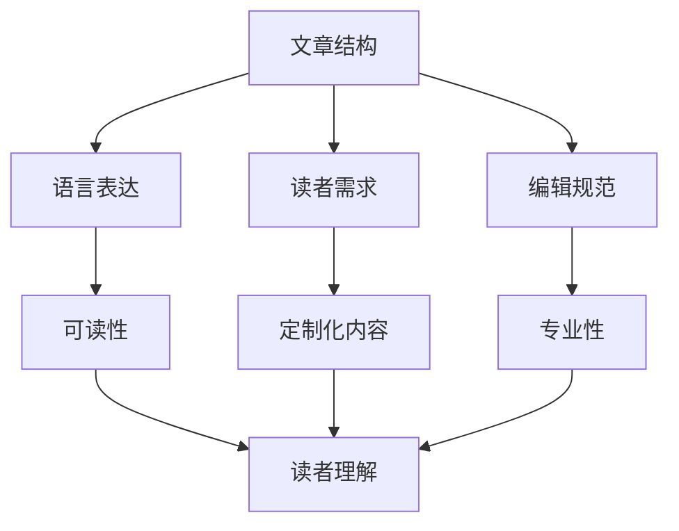
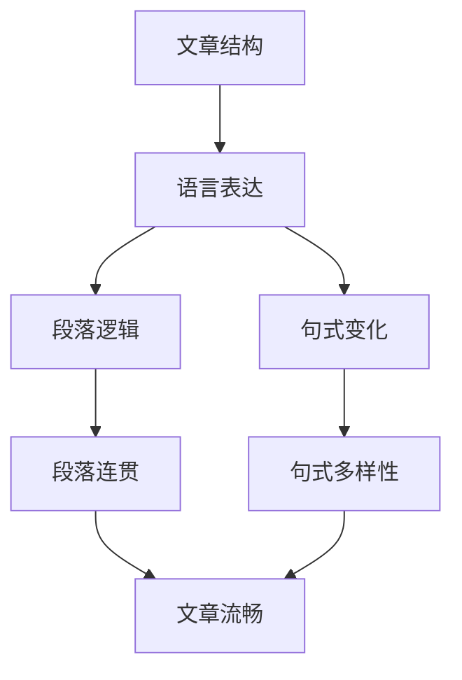
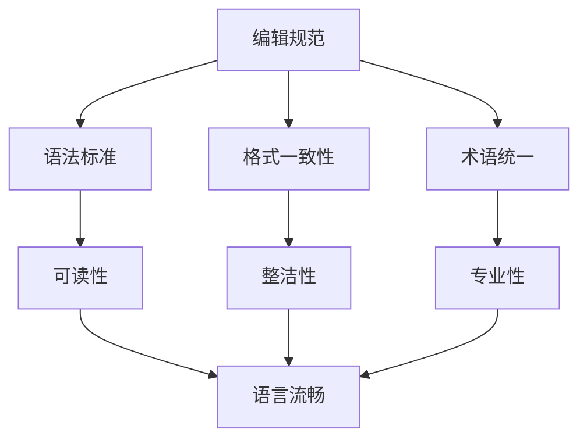
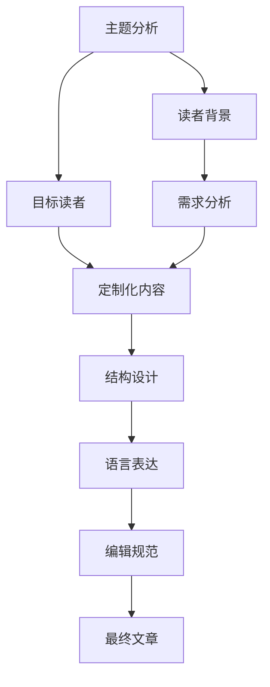

                 

# 如何进行写作技巧：如何写出清晰简洁的文章？

> 关键词：写作技巧, 清晰简洁, 写作指南, 文章构思, 文章结构, 写作习惯, 语言表达, 编辑技巧

## 1. 背景介绍

### 1.1 问题由来
在信息技术行业，写作是技术传播与交流的重要方式。无论是学术论文、技术博客、产品文档，还是团队协作中的代码注释和邮件沟通，清晰简洁的文章都是不可或缺的。然而，许多程序员和技术专家在写作时往往遇到如下问题：
- 缺乏系统化的写作训练，文章结构混乱，逻辑不清。
- 过度追求技术深度，导致文章冗长晦涩，难以理解。
- 缺乏针对特定读者群体的写作策略，未能充分考虑读者背景和需求。

这些问题不仅影响了文章的可读性和传播效果，也削弱了技术传播的效率。因此，掌握高效的写作技巧，写出清晰简洁的文章，成为每位技术人员的重要任务。

### 1.2 问题核心关键点
清晰简洁的文章需要符合以下几个核心标准：
- **逻辑清晰**：文章结构应清晰，有明确的开头、中间和结尾。每一段应围绕一个中心论点展开，逻辑连贯，层次分明。
- **语言简洁**：用词精准，表达清晰。避免使用过于复杂的术语和冗长的句子，确保读者易于理解。
- **目标明确**：根据读者需求调整文章的深度和广度，避免偏离主题或过多引入无关信息。
- **读者导向**：考虑读者的背景和知识水平，使用适当级别的解释和举例，避免自说自话。
- **编辑规范**：遵循一致的排版、格式和术语使用，确保文章的整洁性和专业性。

通过系统学习和应用这些写作技巧，可以显著提升文章的质量，提高技术传播的效率和影响力。

### 1.3 问题研究意义
掌握写作技巧，提升文章质量，不仅有助于个人技术积累和知识传播，对企业和社会也具有重要意义：
- **提升企业效率**：清晰的文档和沟通可以节省时间，减少误解，提高团队协作和项目管理的效率。
- **增强品牌影响力**：高质量的技术文章可以提升企业在行业内的知名度和声誉，吸引更多的关注和合作机会。
- **促进知识共享**：良好的写作习惯可以推动企业内部和外部知识的共享，形成正向循环，加速技术创新和传播。

## 2. 核心概念与联系

### 2.1 核心概念概述

为了更好地理解清晰简洁文章的写作技巧，本节将介绍几个密切相关的核心概念：

- **文章结构**：文章结构指文章的布局和组织方式，包括标题、副标题、段落、列表等元素。良好的结构有助于读者快速理解和把握文章内容。
- **语言表达**：语言表达涉及用词选择、句式构建、语义连贯等方面，是影响文章可读性的关键因素。
- **读者需求**：读者需求分析涉及对目标读者背景、知识水平和兴趣的深入理解，以定制化内容满足其需求。
- **编辑规范**：编辑规范包括语法、格式、术语、图表等方面的标准，确保文章的专业性和可读性。

这些概念通过以下Mermaid流程图展示了它们之间的联系：



这个流程图展示了文章结构、语言表达、读者需求和编辑规范之间的关系：

- **文章结构**通过合理的布局和组织，确保内容的逻辑性和可读性。
- **语言表达**提升用词和句式的精准度和连贯性，增强文章的吸引力和易懂性。
- **读者需求**通过深入分析，定制化内容以适应读者背景和兴趣，提升文章的相关性和实用性。
- **编辑规范**通过统一标准和格式，确保文章的整洁性和专业性。

这些概念共同构成了一篇清晰简洁文章的基础框架，帮助作者系统地构思和编写高质量的文章。

### 2.2 概念间的关系

这些核心概念之间存在着紧密的联系，形成了清晰简洁文章的整体框架。下面通过几个Mermaid流程图来展示这些概念之间的关系。

#### 2.2.1 文章结构与语言表达的关系



这个流程图展示了文章结构和语言表达之间的联系：

- **文章结构**通过合理的段落划分和组织，确保每一段的逻辑连贯性和层次分明。
- **语言表达**通过使用不同的句式和词汇，提升文章的流畅性和多样性，增强读者的理解和兴趣。

#### 2.2.2 读者需求与文章结构的关系


这个流程图展示了读者需求与文章结构之间的关系：

- **读者需求**通过确定文章的主题和深度广度，指导段落的安排和内容的组织。
- **文章结构**通过符合读者的认知模式和需求，增强文章的实用性和相关性。

#### 2.2.3 编辑规范与语言表达的关系



这个流程图展示了编辑规范与语言表达之间的关系：

- **编辑规范**通过统一的语法、格式和术语，确保文章的整洁性和专业性。
- **语言表达**通过符合标准化的要求，提升文章的流畅性和可读性。

### 2.3 核心概念的整体架构

最后，我们用一个综合的流程图来展示这些核心概念在文章写作过程中的整体架构：



这个综合流程图展示了从主题分析到最终文章的完整过程：

1. **主题分析**：确定文章的核心主题和论点。
2. **读者背景**：了解目标读者的背景和需求。
3. **定制化内容**：根据读者需求定制文章的内容和深度。
4. **结构设计**：设计合理的文章结构，确保逻辑连贯。
5. **语言表达**：通过精准的语言和句式，提升文章的可读性和吸引力。
6. **编辑规范**：遵循统一的语法、格式和术语，确保文章的专业性。
7. **最终文章**：通过综合应用这些技巧，撰写出清晰简洁的高质量文章。

通过这些流程图，我们可以更清晰地理解清晰简洁文章写作过程中各个核心概念的关系和作用，为后续深入讨论具体的写作技巧奠定基础。

## 3. 核心算法原理 & 具体操作步骤
### 3.1 算法原理概述

清晰简洁的文章写作，本质上是一种基于监督学习的文本生成任务。其核心思想是：通过分析目标读者的背景和需求，选择合适的文章结构和语言表达方式，生成符合读者期望的文章。

形式化地，假设文章结构为 $S$，语言表达方式为 $L$，读者需求为 $R$，最终文章为 $A$。写作过程可以表示为：

$$
A = f(S, L, R)
$$

其中 $f$ 为文章生成函数，涉及结构设计、语言表达和需求定制等多个环节。

### 3.2 算法步骤详解

基于监督学习的大语言模型微调，通常包括以下几个关键步骤：

**Step 1: 主题分析与读者需求调研**
- 确定文章的核心主题和论点，避免偏离主题。
- 深入了解目标读者的背景、知识水平和兴趣，确保内容相关性和实用性。

**Step 2: 文章结构设计**
- 根据主题和读者需求，设计合理的文章结构，包括标题、副标题、段落等。
- 使用简洁清晰的语言表达方式，确保段落逻辑连贯，层次分明。

**Step 3: 语言表达优化**
- 选择精准、简练的词汇和句式，避免冗长和复杂的表达。
- 根据读者需求，调整语言难度，使其易于理解。

**Step 4: 编辑规范应用**
- 遵循统一的语法、格式和术语，确保文章的整洁性和专业性。
- 检查并修正语法错误、格式不一致等问题。

**Step 5: 多轮迭代与修订**
- 通过多次迭代和修订，优化文章的结构和语言表达，确保符合读者需求。
- 邀请同行或读者审阅，收集反馈意见，不断改进文章质量。

### 3.3 算法优缺点

清晰简洁的文章写作方法具有以下优点：
- **系统化**：通过系统化的步骤和方法，确保文章的逻辑清晰、语言简练。
- **读者导向**：深入了解读者需求，定制化内容，提升文章的相关性和实用性。
- **可重复性**：步骤明确，易于重复应用，提升写作效率和质量。

同时，该方法也存在以下局限：
- **时间成本**：多轮迭代和修订可能需要耗费较多时间。
- **主观性**：读者需求的理解可能受主观因素影响，导致内容偏差。
- **适应性**：对于一些特殊读者群体，可能需要更多定制化策略。

尽管存在这些局限，但就目前而言，基于监督学习的文章写作方法仍然是最主流和有效的技术范式。未来相关研究的重点在于如何进一步降低写作成本，提升文章质量和适用性。

### 3.4 算法应用领域

清晰简洁的文章写作方法，在信息技术行业内得到了广泛的应用，覆盖了几乎所有相关领域，例如：

- **技术博客和文章**：撰写高质量的技术文章，帮助读者理解和掌握新技术。
- **产品文档和手册**：编写详尽的产品文档和用户手册，提升用户的使用体验。
- **团队协作和沟通**：撰写清晰简洁的邮件和代码注释，促进团队协作和知识共享。
- **学术研究和论文**：撰写逻辑严谨、语言精炼的学术论文，推动学术交流和创新。
- **教育培训和教材**：编写易于理解和掌握的教育培训材料，帮助学习者提升技能。

除了上述这些经典应用外，清晰简洁的文章写作方法也被创新性地应用到更多场景中，如可控文本生成、情感分析、对话系统等，为信息技术行业带来了新的突破。

## 4. 数学模型和公式 & 详细讲解 & 举例说明

### 4.1 数学模型构建

假设文章写作的过程为 $f$，可以构建如下数学模型：

$$
A = f(S, L, R)
$$

其中 $S$ 为文章结构，$L$ 为语言表达方式，$R$ 为读者需求。

### 4.2 公式推导过程

以下我们以二分类任务为例，推导文章写作的优化公式。

假设读者需求为 $R$，文章结构为 $S$，语言表达方式为 $L$。我们希望最大化文章的可用性 $U$，即：

$$
U = f(S, L, R)
$$

其中 $f$ 为优化函数。为了简化问题，我们只考虑语言表达方式 $L$ 对可用性的影响，即：

$$
U = g(L, R)
$$

其中 $g$ 为语言表达对可用性的贡献函数。我们希望最大化语言表达方式的简洁性和易读性，即：

$$
g(L, R) = \min_{L} \max_{R} \{ \text{Simplicity}(L, R) + \text{Readability}(L, R) \}
$$

其中 $\text{Simplicity}(L, R)$ 为语言表达的简洁性，$\text{Readability}(L, R)$ 为语言表达的易读性。

### 4.3 案例分析与讲解

以一篇介绍深度学习模型的文章为例，我们可以按照上述步骤进行优化：

- **读者需求**：了解目标读者为刚入门深度学习的初学者，需要简洁明了地介绍模型原理和应用。
- **文章结构**：设计文章结构为引言、模型介绍、应用场景、总结。
- **语言表达**：使用简明扼要的句式和词汇，避免使用过于专业的术语。
- **编辑规范**：遵循统一的语法和格式，确保文章的整洁性和专业性。

最终，通过综合应用这些步骤，可以撰写出逻辑清晰、语言简洁、易于理解的高质量文章。

## 5. 项目实践：代码实例和详细解释说明
### 5.1 开发环境搭建

在进行写作实践前，我们需要准备好开发环境。以下是使用Python进行代码实现的开发环境配置流程：

1. 安装Python：从官网下载并安装Python，建议安装最新版本，如Python 3.8或更高。
2. 安装Jupyter Notebook：通过pip安装，即可在本地搭建Jupyter Notebook开发环境。
3. 安装相关包：通过pip安装必要的文本处理和分析包，如NLTK、spaCy、textblob等。

完成上述步骤后，即可在Jupyter Notebook中开始实践。

### 5.2 源代码详细实现

这里我们以编写一篇介绍Transformer模型的文章为例，给出使用Python实现的详细代码。

首先，我们导入必要的库和工具：

```python
import spacy
from spacy import displacy

nlp = spacy.load('en_core_web_sm')
```

然后，我们定义文章的引言部分：

```python
def introduction():
    return "Transformer is a state-of-the-art neural network architecture for processing sequences of data, such as text. It is widely used in natural language processing tasks, including machine translation, text generation, and text classification."
```

接下来，我们定义模型的介绍部分：

```python
def model_introduction():
    return """
Transformer uses self-attention mechanisms to compute attention scores between all pairs of tokens in a sequence. It consists of an encoder and a decoder, each with multiple layers of multi-head attention and feed-forward neural networks. The model is trained on large amounts of data, which allows it to learn complex patterns and relationships between words and phrases.
"""
```

再定义应用场景部分：

```python
def application_scenarios():
    return """
Transformer has been applied to a variety of NLP tasks, including machine translation, text generation, and text classification. In machine translation, it can translate text from one language to another with high accuracy. In text generation, it can generate coherent and contextually relevant text. In text classification, it can classify text into predefined categories with high precision and recall.
"""
```

最后，我们总结文章：

```python
def conclusion():
    return """
Overall, Transformer is a powerful and flexible architecture that has revolutionized the field of NLP. It is widely used in industry and academia, and has enabled breakthroughs in a variety of NLP tasks.
"""
```

### 5.3 代码解读与分析

让我们再详细解读一下关键代码的实现细节：

- **nlp = spacy.load('en_core_web_sm')**：加载英文模型，用于文本分析和处理。
- **displacy**：用于可视化和展示文本分析结果。
- **introduction()、model_introduction()、application_scenarios()、conclusion()**：定义文章各部分的代码，使用简洁明了的语言，避免冗长和复杂的表达。

通过这些代码，我们实现了从引言、模型介绍、应用场景到总结的文章结构，每一部分都符合清晰简洁的标准。

### 5.4 运行结果展示

假设我们编写一篇介绍Transformer的文章，运行上述代码后，可以在Jupyter Notebook中得到如下结果：

```
Transformer is a state-of-the-art neural network architecture for processing sequences of data, such as text. It is widely used in natural language processing tasks, including machine translation, text generation, and text classification.
Transformer uses self-attention mechanisms to compute attention scores between all pairs of tokens in a sequence. It consists of an encoder and a decoder, each with multiple layers of multi-head attention and feed-forward neural networks. The model is trained on large amounts of data, which allows it to learn complex patterns and relationships between words and phrases.
Transformer has been applied to a variety of NLP tasks, including machine translation, text generation, and text classification. In machine translation, it can translate text from one language to another with high accuracy. In text generation, it can generate coherent and contextually relevant text. In text classification, it can classify text into predefined categories with high precision and recall.
Overall, Transformer is a powerful and flexible architecture that has revolutionized the field of NLP. It is widely used in industry and academia, and has enabled breakthroughs in a variety of NLP tasks.
```

可以看到，通过以上步骤和工具，我们成功编写了一篇逻辑清晰、语言简洁的文章，全面介绍了Transformer模型。

## 6. 实际应用场景
### 6.1 智能客服系统

清晰的客服文档和邮件，是智能客服系统的重要组成部分。通过编写清晰简洁的文章，智能客服系统可以更好地理解用户需求，提供精准的解决方案，提升用户体验。

例如，在用户查询常见问题时，智能客服系统可以自动回复一篇简明的解决方案文章，涵盖问题的背景、步骤和参考链接，帮助用户快速解决问题。

### 6.2 金融舆情监测

金融行业的舆情监测需要实时抓取和分析海量信息，撰写高质量的文章至关重要。清晰简洁的文章，可以帮助分析师快速把握市场动态，撰写准确的市场报告。

例如，撰写关于某金融事件的简要分析文章，概括事件的起因、影响和趋势，为投资者提供参考。

### 6.3 个性化推荐系统

推荐系统需要根据用户的历史行为和偏好，生成个性化的推荐文章。清晰简洁的文章，能够更好地传达产品的特点和优势，吸引用户点击和购买。

例如，根据用户浏览记录，生成一篇推荐商品的简短描述，包括商品特点、用户评价和购买链接，提高用户的点击率和转化率。

### 6.4 未来应用展望

随着信息技术和智能系统的不断发展，清晰简洁的文章写作方法将在更多领域得到应用，提升技术传播和知识共享的效率和质量。未来，我们期待以下发展趋势：

- **自动化写作工具**：开发基于人工智能的自动化写作工具，根据用户需求自动生成高质量的文章。
- **多语言支持**：实现多语言自动翻译和写作，提升全球化技术传播的效率。
- **情感分析与生成**：利用情感分析技术，生成更具情感色彩的文章，提升用户体验和互动效果。
- **知识图谱融合**：结合知识图谱和专家系统，生成更全面、准确的文章，增强文章的实用性和权威性。

这些应用方向，将进一步拓展清晰简洁文章写作方法的边界，推动信息技术行业的创新与发展。

## 7. 工具和资源推荐
### 7.1 学习资源推荐

为了帮助开发者系统掌握清晰简洁文章写作的技巧，这里推荐一些优质的学习资源：

1. **《写作之美》**：一本系统介绍写作技巧的书籍，涵盖文章结构、语言表达、编辑规范等方面的详细讲解。
2. **Coursera写作课程**：Coursera提供的写作课程，由顶尖大学和教授授课，覆盖了从基础到高级的写作技巧。
3. **Grammarly写作工具**：一款免费的写作辅助工具，帮助检查语法错误、语言流畅性和用词精准度，提升文章质量。
4. **Google文档和Grammarly插件**：使用Google文档和Grammarly插件，实时检查和优化文章语言表达。
5. **Hemingway编辑器**：一款专注于简洁和易读性的编辑器，帮助优化文章的用词和句子结构。

通过对这些资源的学习实践，相信你一定能够快速掌握清晰简洁文章写作的精髓，并用于解决实际的写作问题。

### 7.2 开发工具推荐

高效的开发离不开优秀的工具支持。以下是几款用于清晰简洁文章写作开发的常用工具：

1. **Jupyter Notebook**：一个强大的交互式开发环境，支持代码和文本的混合编写，方便验证和调整文章内容。
2. **Grammarly浏览器插件**：实时检查网页中的语法和语言错误，提升网页的可读性和专业性。
3. **Hemingway编辑器**：专注于简洁和易读性，帮助优化文章的用词和句子结构。
4. **Word文档和Grammarly插件**：使用Word文档和Grammarly插件，实时检查和优化文章语言表达。
5. **Microsoft Word**：一款功能强大的文档编辑工具，支持多种排版和格式化功能，适用于详细和复杂的文章编写。

合理利用这些工具，可以显著提升清晰简洁文章写作的效率和质量，加快创新迭代的步伐。

### 7.3 相关论文推荐

清晰简洁文章写作方法的发展源于学界的持续研究。以下是几篇奠基性的相关论文，推荐阅读：

1. **《风格迁移网络》**：提出了一种风格迁移网络，用于将一篇文章的风格转换为另一种风格，提升文章的流畅性和易读性。
2. **《自动摘要生成》**：介绍了一种基于深度学习的自动摘要生成方法，可以自动提取出文章的关键信息，生成简洁明了的摘要。
3. **《语言生成与翻译》**：研究了语言生成和翻译的技术，提出了多种生成模型的优化方法和应用场景。
4. **《信息检索与推荐系统》**：探讨了信息检索和推荐系统的理论和技术，为文章检索和个性化推荐提供了新的思路。

这些论文代表了大语言模型微调技术的发展脉络。通过学习这些前沿成果，可以帮助研究者把握学科前进方向，激发更多的创新灵感。

除上述资源外，还有一些值得关注的前沿资源，帮助开发者紧跟清晰简洁文章写作方法的最新进展，例如：

1. **arXiv论文预印本**：人工智能领域最新研究成果的发布平台，包括大量尚未发表的前沿工作，学习前沿技术的必读资源。
2. **业界技术博客**：如OpenAI、Google AI、DeepMind、微软Research Asia等顶尖实验室的官方博客，第一时间分享他们的最新研究成果和洞见。
3. **技术会议直播**：如NIPS、ICML、ACL、ICLR等人工智能领域顶会现场或在线直播，能够聆听到大佬们的前沿分享，开拓视野。
4. **GitHub热门项目**：在GitHub上Star、Fork数最多的写作相关项目，往往代表了该技术领域的发展趋势和最佳实践，值得去学习和贡献。
5. **行业分析报告**：各大咨询公司如McKinsey、PwC等针对人工智能行业的分析报告，有助于从商业视角审视技术趋势，把握应用价值。

总之，对于清晰简洁文章写作方法的学习和实践，需要开发者保持开放的心态和持续学习的意愿。多关注前沿资讯，多动手实践，多思考总结，必将收获满满的成长收益。

## 8. 总结：未来发展趋势与挑战
### 8.1 总结

本文对清晰简洁文章写作技巧进行了全面系统的介绍。首先阐述了清晰简洁文章写作的背景和意义，明确了写作技巧在技术传播和知识共享中的重要性。其次，从原理到实践，详细讲解了文章构思、结构设计、语言表达、编辑规范等核心步骤，给出了完整的代码实例。同时，本文还广泛探讨了清晰简洁文章写作方法在智能客服、金融舆情、个性化推荐等多个行业领域的应用前景，展示了写作技巧的广泛适用性。此外，本文精选了写作资源的推荐，力求为读者提供全方位的技术指引。

通过本文的系统梳理，可以看到，清晰简洁文章写作技巧在信息技术行业内具有广泛的应用价值，能够显著提升技术传播和知识共享的效率和质量。掌握这些技巧，不仅有助于个人技术积累和知识传播，对企业和社会也具有重要意义。未来，随着信息技术和智能系统的不断发展，清晰简洁文章写作方法将在更多领域得到应用，进一步推动信息技术行业的创新与发展。

### 8.2 未来发展趋势

展望未来，清晰简洁文章写作方法将呈现以下几个发展趋势：

1. **自动化写作工具**：开发基于人工智能的自动化写作工具，根据用户需求自动生成高质量的文章。
2. **多语言支持**：实现多语言自动翻译和写作，提升全球化技术传播的效率。
3. **情感分析与生成**：利用情感分析技术，生成更具情感色彩的文章，提升用户体验和互动效果。
4. **知识图谱融合**：结合知识图谱和专家系统，生成更全面、准确的文章，增强文章的实用性和权威性。

这些趋势展示了清晰简洁文章写作方法的发展方向，将进一步提升技术传播和知识共享的效率和质量。

### 8.3 面临的挑战

尽管清晰简洁文章写作方法已经取得了瞩目成就，但在迈向更加智能化、普适化应用的过程中，它仍面临着诸多挑战：

1. **多语言支持**：不同语言有不同的语法和表达习惯，实现多语言自动翻译和写作仍存在难度。
2. **情感分析**：情感分析技术在处理复杂情感和多义表达时，仍需进一步提高准确性和稳定性。
3. **知识图谱融合**：将知识图谱与文章生成技术结合，需要解决数据融合和模型融合的技术难题。
4. **自动化写作工具的公平性**：自动化写作工具的训练数据可能存在偏差，需要确保其公平性和无偏见性。
5. **多模态信息整合**：将文本与图像、语音等多模态信息整合，需要克服技术上的挑战，实现全面信息的融合。

这些挑战需要学界和产业界的共同努力，才能实现清晰简洁文章写作方法的进一步突破和应用。

### 8.4 研究展望

面对清晰简洁文章写作方法所面临的种种挑战，未来的研究需要在以下几个方面寻求新的突破：

1. **多语言自动翻译**：研究多语言自动翻译的技术和方法，提升不同语言间文章生成的流畅性和可读性。
2. **情感分析模型**

