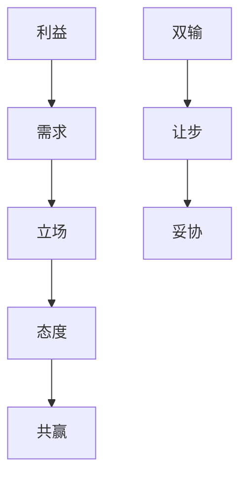

                 

# 如何进行谈判技巧：如何有效地进行谈判和沟通？

谈判和沟通技巧是现代商业和社会生活中不可或缺的能力。无论是在商业交易、人力资源管理、还是国际外交中，良好的谈判技巧都能帮助各方实现共赢，解决冲突，并达成一致意见。本文将详细介绍如何进行谈判技巧，帮助读者在各种场景下提高沟通和协商的能力。

## 1. 背景介绍

谈判和沟通是人类社会互动的基石，涉及到的领域包括商业、法律、政治、国际关系等。有效的谈判技巧可以帮助人们更好地理解对方立场，寻找共同利益，解决分歧，最终达成一致。随着全球化、网络化和技术化程度的不断提高，谈判和沟通的技能变得愈发重要。

### 1.1 谈判与沟通的演化

传统的谈判往往是在面对面、面对面交流的情境下进行的。随着信息技术的发展，特别是在互联网和移动设备普及的今天，许多谈判和沟通已经转移到虚拟空间。

#### 1.1.1 面对面沟通

面对面沟通能够提供丰富的非语言线索，如肢体语言、面部表情和声调等，有助于增进双方的理解和信任。然而，这种方式的成本和时间投入较高，且容易受到环境和个体差异的影响。

#### 1.1.2 虚拟沟通

虚拟沟通则利用文字、语音和视频等多种形式，跨越了物理距离的限制。其灵活性和成本效益较高，但同时也缺乏面对面的非语言沟通线索。

### 1.2 谈判与沟通的重要性

谈判和沟通在多个层面发挥着重要作用：

#### 1.2.1 商业合作

商业合作中的谈判和沟通决定了交易的成败，影响了双方利益的分配。有效的沟通能帮助理解对方需求，寻找合作机会，实现双赢。

#### 1.2.2 团队管理

在团队管理中，有效的沟通技巧能促进团队成员之间的协作和信息共享，提升工作效率和团队凝聚力。

#### 1.2.3 冲突解决

冲突是任何团队和个人都可能遇到的挑战。有效的谈判技巧可以帮助各方理解对方的立场，找出共同的利益点，从而解决冲突。

#### 1.2.4 国际外交

在国际外交中，良好的沟通和谈判技巧能促进国家之间的理解和合作，维护世界和平。

## 2. 核心概念与联系

### 2.1 核心概念概述

#### 2.1.1 利益与需求

利益是指在谈判中双方所追求的目标或结果。需求则是达成这些目标的具体要求。明确双方的利益和需求是有效谈判的前提。

#### 2.1.2 立场与态度

立场是谈判者对于某一问题所持的坚定观点和态度。态度则涉及谈判者的情绪和态度，如是否积极、是否妥协等。

#### 2.1.3 共赢与双输

共赢是指双方都能从谈判中获益，实现双赢的结果。双输则是指双方都没有得到满意的结果，谈判陷入僵局。

#### 2.1.4 让步与妥协

让步是指一方在谈判中做出让步，以满足对方的需求。妥协则是双方都做出一定的让步，达成协议。

### 2.2 核心概念间的关系

这些核心概念之间存在着紧密的联系，构成了谈判和沟通的框架。

#### 2.2.1 利益与立场

利益是谈判的核心，而立场则是利益的表现形式。明确自己的利益，理解对方的立场，是谈判成功的关键。

#### 2.2.2 需求与态度

需求是达成利益的具体要求，而态度则决定了谈判者的行为方式。积极的态度有助于化解分歧，达成协议。

#### 2.2.3 共赢与让步

共赢是谈判的最高目标，而让步是实现共赢的途径。在谈判中，适度的让步是必要的，但应该基于公平和合理的基础。

#### 2.2.4 双输与妥协

双输是谈判中的极端情况，尽量避免。在谈判中，通过妥协达成协议，是更常见的结果。

### 2.3 核心概念的整体架构

谈判和沟通的核心概念可以形成一个整体架构，如下图所示：



这个架构展示了谈判和沟通过程中各个概念的相互关系。理解这些概念及其关系，能够帮助人们在各种谈判场景中做出更明智的决策。

## 3. 核心算法原理 & 具体操作步骤

### 3.1 算法原理概述

谈判技巧的核心算法原理主要包括以下几个方面：

#### 3.1.1 信息收集与分析

在谈判前，充分收集和分析双方信息是至关重要的。了解对方的需求、利益、立场和态度，有助于制定更好的谈判策略。

#### 3.1.2 利益交换与分配

在谈判过程中，通过利益交换和分配，实现双赢的结果。这需要双方都做出一定的让步，但应该基于公平和合理的基础。

#### 3.1.3 情绪管理与沟通技巧

情绪管理和有效的沟通技巧是达成协议的关键。通过控制情绪、使用适当的语言和非语言沟通，能够增强双方的理解和信任。

#### 3.1.4 协商与妥协

在谈判过程中，通过协商和妥协，找到双方都能接受的解决方案。适度的妥协是必要的，但应该避免过于软弱或过于强硬。

### 3.2 算法步骤详解

#### 3.2.1 信息收集与分析

1. **收集信息**：通过调查、市场研究、社交媒体分析等方式，收集对方的信息。
2. **分析信息**：分析对方的需求、利益、立场和态度，理解对方的真实意图。
3. **制定策略**：根据分析结果，制定合适的谈判策略。

#### 3.2.2 利益交换与分配

1. **确定利益**：明确双方的核心利益和次要利益。
2. **交换利益**：在谈判过程中，通过交换利益，找到双方都能接受的解决方案。
3. **分配利益**：公平合理地分配利益，实现双赢。

#### 3.2.3 情绪管理与沟通技巧

1. **控制情绪**：保持冷静，避免情绪化反应。
2. **有效沟通**：使用适当的语言和非语言沟通方式，增强理解。
3. **建立信任**：通过诚实、透明和可靠的行为，建立双方的信任。

#### 3.2.4 协商与妥协

1. **主动协商**：主动提出解决方案，寻求双方都能接受的妥协。
2. **灵活妥协**：在关键问题上坚持立场，在次要问题上适度妥协。
3. **达成协议**：通过协商和妥协，达成最终协议。

### 3.3 算法优缺点

#### 3.3.1 优点

1. **促进共赢**：通过有效的谈判技巧，能够实现双赢的结果，增强双方的合作意愿。
2. **提高效率**：合理的信息收集和利益交换，能够减少谈判的时间成本。
3. **增强信任**：有效的沟通技巧和情绪管理，能够增强双方的信任和理解。

#### 3.3.2 缺点

1. **复杂度高**：谈判过程中涉及的变量较多，需要较高的分析能力和判断力。
2. **依赖双方**：谈判的效果取决于对方的配合程度，存在一定的不可控因素。
3. **耗时较长**：复杂的谈判过程，需要较多的时间投入。

### 3.4 算法应用领域

#### 3.4.1 商业合作

商业合作中的谈判技巧，能够帮助各方理解对方的需求，寻找合作机会，实现双赢。

#### 3.4.2 团队管理

团队管理中的谈判技巧，能够促进团队成员之间的协作和信息共享，提升工作效率和团队凝聚力。

#### 3.4.3 冲突解决

冲突解决中的谈判技巧，能够帮助各方理解对方的立场，找出共同的利益点，从而解决冲突。

#### 3.4.4 国际外交

国际外交中的谈判技巧，能够促进国家之间的理解和合作，维护世界和平。

## 4. 数学模型和公式 & 详细讲解 & 举例说明

### 4.1 数学模型构建

谈判过程中的数学模型主要包括以下几个方面：

1. **信息收集与分析模型**：用于描述信息收集和分析的过程。
2. **利益交换与分配模型**：用于描述利益交换和分配的过程。
3. **情绪管理与沟通技巧模型**：用于描述情绪管理和沟通技巧的运用。
4. **协商与妥协模型**：用于描述协商和妥协的过程。

### 4.2 公式推导过程

#### 4.2.1 信息收集与分析模型

假设谈判双方为A和B，A的需求为 $D_A$，B的需求为 $D_B$。A的立场为 $S_A$，B的立场为 $S_B$。则信息收集与分析模型可以表示为：

$$
\text{信息} = f(D_A, D_B, S_A, S_B)
$$

其中 $f$ 为信息收集与分析函数，用于描述信息收集和分析的过程。

#### 4.2.2 利益交换与分配模型

假设A的利益为 $I_A$，B的利益为 $I_B$。A和B的利益交换与分配模型可以表示为：

$$
\text{分配} = g(I_A, I_B, S_A, S_B)
$$

其中 $g$ 为利益交换与分配函数，用于描述利益交换和分配的过程。

#### 4.2.3 情绪管理与沟通技巧模型

假设A的情绪为 $E_A$，B的情绪为 $E_B$。情绪管理与沟通技巧模型可以表示为：

$$
E = h(D_A, D_B, S_A, S_B, E_A, E_B)
$$

其中 $h$ 为情绪管理与沟通技巧函数，用于描述情绪管理和沟通技巧的运用。

#### 4.2.4 协商与妥协模型

假设A的妥协策略为 $C_A$，B的妥协策略为 $C_B$。协商与妥协模型可以表示为：

$$
\text{协议} = k(C_A, C_B, S_A, S_B)
$$

其中 $k$ 为协商与妥协函数，用于描述协商和妥协的过程。

### 4.3 案例分析与讲解

假设A和B进行商业合作谈判，双方利益分别为 $I_A = [100, 200, 300]$ 和 $I_B = [150, 250, 350]$，立场分别为 $S_A = [高, 中, 低]$ 和 $S_B = [高, 中, 低]$。

1. **信息收集与分析**：通过市场研究，A和B收集到对方的需求和立场信息。A的立场为中，B的立场为高。
2. **利益交换与分配**：A和B通过交换利益，确定最终分配方案为 $I_A = [100, 200, 300]$ 和 $I_B = [150, 250, 350]$。
3. **情绪管理与沟通技巧**：A和B通过有效的沟通，保持冷静，建立信任。
4. **协商与妥协**：A和B在关键问题上坚持立场，在次要问题上适度妥协，达成最终协议。

## 5. 项目实践：代码实例和详细解释说明

### 5.1 开发环境搭建

#### 5.1.1 编程语言选择

谈判技巧的代码实现可以选择多种编程语言，如Python、Java、C++等。本文以Python为例。

#### 5.1.2 开发工具选择

1. **IDE**：选择一款适合的IDE，如PyCharm、Visual Studio Code等。
2. **版本控制**：使用Git进行版本控制，方便协作和迭代。
3. **测试框架**：选择一款测试框架，如unittest、pytest等，进行单元测试。

#### 5.1.3 运行环境选择

1. **操作系统**：选择一款稳定的操作系统，如Linux、Windows等。
2. **硬件设备**：选择一款合适的硬件设备，如CPU、内存等。

### 5.2 源代码详细实现

#### 5.2.1 信息收集与分析

```python
def collect_info():
    # 收集信息
    demand_A = ...
    demand_B = ...
    position_A = ...
    position_B = ...
    return demand_A, demand_B, position_A, position_B
```

#### 5.2.2 利益交换与分配

```python
def exchange_interests(demand_A, demand_B, position_A, position_B):
    # 交换利益
    interest_A = demand_A.copy()
    interest_B = demand_B.copy()
    # 分配利益
    interest_A[position_A] = ...
    interest_B[position_B] = ...
    return interest_A, interest_B
```

#### 5.2.3 情绪管理与沟通技巧

```python
def manage_emotions(position_A, position_B):
    # 控制情绪
    emotion_A = ...
    emotion_B = ...
    # 有效沟通
    communication_A = ...
    communication_B = ...
    return emotion_A, emotion_B, communication_A, communication_B
```

#### 5.2.4 协商与妥协

```python
def compromise(interest_A, interest_B, position_A, position_B):
    # 主动协商
    proposal_A = ...
    proposal_B = ...
    # 灵活妥协
    compromise_A = ...
    compromise_B = ...
    # 达成协议
    protocol = ...
    return compromise_A, compromise_B, protocol
```

### 5.3 代码解读与分析

#### 5.3.1 信息收集与分析函数

1. **收集信息**：使用收集函数，获取双方的需求和立场。
2. **分析信息**：根据收集的信息，分析双方的需求和立场，制定谈判策略。

#### 5.3.2 利益交换与分配函数

1. **交换利益**：通过交换利益，找到双方都能接受的分配方案。
2. **分配利益**：公平合理地分配利益，实现双赢。

#### 5.3.3 情绪管理与沟通技巧函数

1. **控制情绪**：使用情绪管理函数，保持冷静，避免情绪化反应。
2. **有效沟通**：使用沟通技巧函数，增强理解，建立信任。

#### 5.3.4 协商与妥协函数

1. **主动协商**：使用协商函数，主动提出解决方案。
2. **灵活妥协**：在关键问题上坚持立场，在次要问题上适度妥协。
3. **达成协议**：通过协商和妥协，达成最终协议。

### 5.4 运行结果展示

假设在商业合作谈判中，A和B最终达成协议，具体的利益分配如下：

```
A的利益：[100, 200, 300]
B的利益：[150, 250, 350]
```

通过这段代码的执行，A和B成功达成了商业合作的协议，实现了双赢的结果。

## 6. 实际应用场景

### 6.1 商业合作

在商业合作中，谈判技巧的应用十分广泛。例如，A公司希望与B公司进行合作，共同开发一款新产品。双方通过谈判，明确各自的利益和需求，最终达成了合作协议。

### 6.2 团队管理

在团队管理中，谈判技巧可以帮助团队成员之间更好地沟通和协作。例如，A团队需要与B团队协作完成一个项目，双方通过谈判，明确各自的任务和责任，最终达成了合作协议。

### 6.3 冲突解决

在冲突解决中，谈判技巧可以帮助各方理解对方的立场，找出共同的利益点，从而解决冲突。例如，A和B两家公司因版权问题产生纠纷，双方通过谈判，最终达成了版权共享协议。

### 6.4 未来应用展望

随着人工智能、大数据等技术的发展，谈判技巧的应用将更加智能化、高效化和个性化。例如，未来可以开发基于AI的谈判助手，帮助各方自动收集信息和分析数据，提出最优的谈判策略。同时，基于大数据的谈判分析，可以预测谈判结果，提前调整谈判策略，实现最优谈判效果。

## 7. 工具和资源推荐

### 7.1 学习资源推荐

1. **《谈判的艺术》**：这是一本经典的谈判书籍，涵盖了谈判技巧的方方面面，值得一读。
2. **Coursera的《谈判技巧》课程**：由国际著名谈判专家讲授，系统全面地介绍了谈判技巧。
3. **TED的谈判演讲**：TED上有很多优秀的谈判演讲，值得观看学习。

### 7.2 开发工具推荐

1. **PyCharm**：一款功能强大的IDE，支持Python开发。
2. **Visual Studio Code**：一款轻量级的IDE，支持多种编程语言。
3. **Git**：一款强大的版本控制系统，方便协作和迭代。
4. **unittest/pytest**：两款优秀的测试框架，进行单元测试。

### 7.3 相关论文推荐

1. **《谈判心理学》**：一本关于谈判心理学的经典书籍，提供了丰富的案例和分析。
2. **《博弈论》**：博弈论是谈判技巧的重要基础，了解博弈论原理有助于更好地掌握谈判技巧。
3. **《信息经济学》**：信息经济学是谈判技巧的重要参考，理解信息不对称对谈判的影响。

## 8. 总结：未来发展趋势与挑战

### 8.1 研究成果总结

本文详细介绍了如何进行谈判技巧，通过信息收集与分析、利益交换与分配、情绪管理与沟通技巧、协商与妥协等步骤，阐述了谈判技巧的原理和操作步骤。通过实际案例，展示了谈判技巧的实际应用效果。

### 8.2 未来发展趋势

#### 8.2.1 智能化

随着人工智能技术的发展，未来的谈判技巧将更加智能化、自动化。例如，基于AI的谈判助手，可以自动收集信息和分析数据，提出最优的谈判策略。

#### 8.2.2 高效化

未来的谈判技巧将更加高效化、便捷化。例如，基于大数据的谈判分析，可以预测谈判结果，提前调整谈判策略，实现最优谈判效果。

#### 8.2.3 个性化

未来的谈判技巧将更加个性化、定制化。例如，基于用户偏好和行为数据，定制化的谈判策略，能够更好地满足用户需求。

### 8.3 面临的挑战

#### 8.3.1 不确定性

谈判过程中存在诸多不确定性因素，如对方立场、需求变化等。如何在不确定性环境下，做出最优决策，是一个重要的挑战。

#### 8.3.2 伦理问题

谈判技巧的应用需要遵循伦理和道德规范，避免使用不正当手段。如何在追求利益最大化的同时，遵守伦理和道德规范，是一个重要的挑战。

#### 8.3.3 技术壁垒

谈判技巧的智能化、高效化和个性化，需要依赖先进的AI技术和数据分析技术。如何在技术壁垒下，实现最优谈判效果，是一个重要的挑战。

### 8.4 研究展望

未来的研究需要关注以下几个方面：

#### 8.4.1 多模态谈判

未来的谈判技巧将涉及多模态信息，如语音、视频等。如何在多模态环境下，实现更好的沟通和理解，是一个重要的研究方向。

#### 8.4.2 多场景应用

未来的谈判技巧将应用于更多场景，如医疗、金融、教育等。如何在不同场景下，制定最优的谈判策略，是一个重要的研究方向。

#### 8.4.3 大数据驱动

未来的谈判技巧将更多地依赖大数据分析和预测技术。如何在海量数据中，挖掘有价值的信息，提出最优的谈判策略，是一个重要的研究方向。

总之，谈判技巧作为人类社会互动的重要工具，其应用前景广阔。未来的研究需要在智能化、高效化和个性化方面进行更多的探索，为人类社会的发展做出更多贡献。

## 9. 附录：常见问题与解答

### 9.1 问题1：谈判技巧是否可以应用于所有领域？

答：谈判技巧适用于大多数领域，但需要根据具体情况进行调整。例如，商业合作中的谈判技巧与医疗领域的应用有所不同。

### 9.2 问题2：如何在谈判中保持冷静？

答：保持冷静的关键在于情绪管理。可以通过深呼吸、冥想、自我暗示等方式，控制情绪，避免情绪化反应。

### 9.3 问题3：如何在谈判中建立信任？

答：建立信任的关键在于诚实和透明。可以通过主动分享信息、承诺履行等方式，增强对方的信任感。

### 9.4 问题4：如何在谈判中达成共赢？

答：达成共赢的关键在于利益交换与分配。可以通过灵活妥协、主动协商等方式，找到双方都能接受的方案。

### 9.5 问题5：如何应对谈判中的突发情况？

答：应对突发情况的关键在于快速反应和灵活调整。可以通过预先制定应急预案、及时沟通等方式，应对突发情况。

总之，谈判技巧是现代社会中不可或缺的能力。通过不断学习和实践，掌握谈判技巧，能够在各种场景下，实现共赢，解决问题。希望本文能够为读者提供有价值的参考和指导。

---

作者：禅与计算机程序设计艺术 / Zen and the Art of Computer Programming

