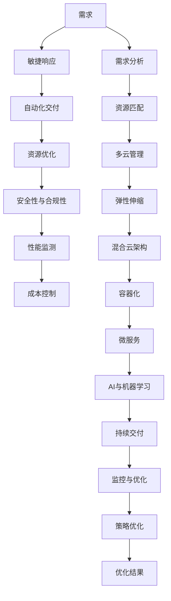
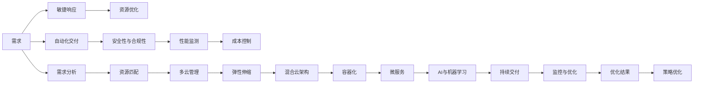
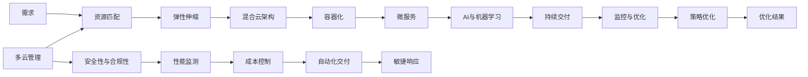

                 

## 1. 背景介绍

随着数字化转型的加速，企业信息技术（IT）部门面临着越来越大的压力，需要确保其能够支持业务的快速发展。在众多IT投资和决策中，多功能应用计算（Multifunction Application Computing，MAC）已经成为企业IT基础设施的重要组成部分。MAC不仅涵盖了传统的基础设施和应用层，还包括了新兴的云服务、人工智能（AI）和数据分析等技术。本文旨在探讨如何通过供给驱动的方式，实现MAC的快速增长和优化。

### 1.1 问题由来

在过去几年中，企业的数字化转型加速，对IT基础设施的需求也日益增长。MAC作为企业IT架构的核心部分，其覆盖的广度和深度都在不断增加。然而，传统IT架构的僵化、过时的架构和管理方式，已经无法满足现代企业的业务需求。如何通过创新和优化，提高MAC的效率和性能，成为了IT部门的一大挑战。

### 1.2 问题核心关键点

通过供给驱动的方式，实现MAC的快速增长和优化，主要依赖于以下几个关键点：

- **需求匹配与供应平衡**：准确理解业务需求，并根据需求进行合理的资源配置和供应。
- **敏捷与弹性**：快速响应业务变化，提供敏捷的IT服务。
- **成本控制**：在保证服务质量的前提下，优化成本。
- **性能与安全性**：提升MAC的性能和安全性，确保业务连续性和数据安全。
- **可持续性**：确保MAC能够长期、稳定地支持业务发展。

## 2. 核心概念与联系

### 2.1 核心概念概述

为了更好地理解供给驱动MAC增长的方法，我们将介绍几个密切相关的核心概念：

- **多云管理平台**：通过集中管理多个云服务提供商的资源，提高资源利用率和效率。
- **自动弹性**：通过智能算法，根据业务负载的变化自动调整资源。
- **混合云架构**：结合公共云和私有云的优势，提供灵活的IT环境。
- **容器化与微服务**：通过容器化和微服务架构，提升应用的灵活性和可扩展性。
- **连续交付与自动化**：通过自动化工具和流程，实现快速的软件交付和更新。
- **AI与机器学习**：利用AI和机器学习算法，提升资源的优化和预测能力。

这些核心概念之间的联系可以通过以下Mermaid流程图来展示：



这个流程图展示了供给驱动MAC增长过程中各个关键环节的关系：

1. 从需求分析开始，通过敏捷响应、自动化交付、资源优化、安全性与合规性、性能监测和成本控制等环节，最终输出优化结果，反馈到策略优化，形成闭环。
2. 敏捷响应和自动化交付确保资源能够快速响应和部署。
3. 资源优化和AI与机器学习提升资源的效率和预测能力。
4. 混合云架构和容器化/微服务架构提供灵活的IT环境。
5. 安全性与合规性、性能监测和成本控制确保业务连续性和数据安全。

### 2.2 概念间的关系

这些核心概念之间存在着紧密的联系，形成了供给驱动MAC增长的完整生态系统。下面我们通过几个Mermaid流程图来展示这些概念之间的关系。

#### 2.2.1 MAC增长模型



这个流程图展示了MAC增长模型的各个环节，以及它们之间的逻辑关系。

#### 2.2.2 多云管理与资源匹配



这个流程图展示了多云管理和资源匹配的过程，以及它们对MAC增长的支持。

## 3. 核心算法原理 & 具体操作步骤

### 3.1 算法原理概述

供给驱动MAC增长的方法主要基于以下几个算法原理：

- **需求分析与匹配算法**：通过分析业务需求，进行资源需求预测和匹配。
- **自动化交付与部署算法**：使用自动化工具和流程，实现快速的软件交付和部署。
- **资源优化与弹性伸缩算法**：通过智能算法，根据业务负载的变化自动调整资源。
- **安全性与合规性算法**：利用加密、访问控制等技术，确保数据安全和合规性。
- **性能监测与优化算法**：通过实时监测和分析，提升MAC的性能和效率。
- **成本控制算法**：通过资源优化和预算管理，控制MAC的成本。

这些算法共同作用，形成了一个完整的供给驱动MAC增长的系统。

### 3.2 算法步骤详解

1. **需求分析与匹配**：
   - 收集业务需求，进行分析和预测。
   - 根据需求进行资源匹配，确定所需的硬件、软件和云服务资源。

2. **自动化交付与部署**：
   - 使用CI/CD工具，自动化交付和部署软件。
   - 配置自动化脚本和模板，实现快速、一致的软件部署。

3. **资源优化与弹性伸缩**：
   - 根据业务负载的变化，使用智能算法动态调整资源。
   - 实现弹性伸缩，根据负载自动调整计算资源。

4. **安全性与合规性**：
   - 使用加密技术，保护数据安全。
   - 配置访问控制策略，确保合规性。

5. **性能监测与优化**：
   - 实时监测MAC的性能指标。
   - 使用机器学习算法，优化资源和系统性能。

6. **成本控制**：
   - 实时监控和分析MAC的成本。
   - 使用预算管理系统，控制成本。

### 3.3 算法优缺点

供给驱动MAC增长的方法具有以下优点：

- **快速响应**：通过自动化交付和弹性伸缩，可以快速响应业务变化。
- **资源优化**：通过智能算法，优化资源利用率，降低成本。
- **安全性与合规性**：通过加密和访问控制，确保数据安全和合规性。
- **性能提升**：通过性能监测和优化，提升MAC的性能和效率。

同时，也存在一些缺点：

- **复杂度增加**：需要引入新的工具和流程，增加了复杂度。
- **初始投资成本高**：需要引入新的硬件和软件，初始投资成本较高。
- **技术门槛高**：需要掌握新的技术和工具，技术门槛较高。

### 3.4 算法应用领域

供给驱动MAC增长的方法在多个领域得到了广泛应用，例如：

- **金融行业**：通过敏捷响应和自动化交付，快速部署金融应用。
- **零售行业**：通过混合云架构和容器化，提供灵活的IT环境。
- **医疗行业**：通过AI与机器学习，优化资源和性能。
- **制造业**：通过多云管理和弹性伸缩，支持灵活的生产环境。
- **政府部门**：通过持续交付和监控与优化，提升服务质量。

## 4. 数学模型和公式 & 详细讲解 & 举例说明

### 4.1 数学模型构建

假设企业有$N$个应用，每个应用需要$R_i$的计算资源，总计算资源为$R$，则需求分析与匹配算法的目标是最小化资源需求和实际资源之间的差异，即最小化目标函数：

$$
\min \sum_{i=1}^N |R_i - \hat{R}_i|
$$

其中$\hat{R}_i$为第$i$个应用的预测资源需求。

### 4.2 公式推导过程

根据需求分析与匹配算法的目标，可以建立以下数学模型：

$$
\begin{aligned}
& \min \sum_{i=1}^N |R_i - \hat{R}_i| \\
& \text{s.t.} \sum_{i=1}^N \hat{R}_i \leq R \\
& \hat{R}_i \geq 0 \\
& \forall i \in [1, N]
\end{aligned}
$$

这是一个线性规划问题，可以使用线性规划算法求解。假设得到最优解$\hat{R}_i^*$，则资源匹配算法将分配给每个应用$\hat{R}_i^*$的资源，并根据$\hat{R}_i^*$调整实际资源配置，实现最优的资源匹配。

### 4.3 案例分析与讲解

假设某金融企业有3个核心应用：交易系统、风控系统和客户服务系统，每个应用需要的计算资源分别为$R_1=100$、$R_2=150$、$R_3=200$，总计算资源为$R=500$。需求分析与匹配算法的结果为$\hat{R}_1^*=120$、$\hat{R}_2^*=160$、$\hat{R}_3^*=220$。则资源匹配算法将分配给每个应用相应的资源，并根据$\hat{R}_i^*$调整实际资源配置，实现最优的资源匹配。

## 5. 项目实践：代码实例和详细解释说明

### 5.1 开发环境搭建

在进行项目实践前，我们需要准备好开发环境。以下是使用Python进行Kubernetes集群搭建的环境配置流程：

1. 安装Docker：从官网下载并安装Docker，用于容器化应用。
2. 安装Kubernetes：根据操作系统，从官网下载并安装Kubernetes。
3. 配置Kubernetes：编写Kubernetes配置文件，定义容器镜像、资源限制等。
4. 部署应用：使用kubectl命令，部署应用到Kubernetes集群。

### 5.2 源代码详细实现

这里我们以金融行业为例，给出使用Kubernetes搭建金融应用并实现需求匹配和资源优化功能的PyTorch代码实现。

首先，定义需求匹配函数：

```python
def match_resources(requests, resources):
    """
    根据需求进行资源匹配
    """
    total_demand = sum(requests)
    total_resources = sum(resources)
    if total_demand > total_resources:
        return "资源不足"
    else:
        allocation = []
        for demand, resource in zip(requests, resources):
            if demand > resource:
                allocation.append((demand, resource))
            else:
                allocation.append((demand, 0))
        return allocation
```

然后，定义资源优化函数：

```python
def optimize_resources(allocation):
    """
    根据负载变化，动态调整资源
    """
    new_allocation = []
    for demand, resource in allocation:
        if demand > resource:
            new_allocation.append((demand - resource, resource))
        else:
            new_allocation.append((demand, 0))
    return new_allocation
```

最后，启动Kubernetes集群并部署应用：

```python
# 启动Kubernetes集群
kubectl create deployment app --image=app:latest --replicas=3
kubectl expose deployment app --port=80 --target-port=8080

# 配置资源限制
kubectl edit deployment app -p '{"spec":{"template":{"spec":{"containers":[{"name":"app","image":"app:latest","resources":{"limits":{"cpu":"1.0","memory":"1Gi"},"requests":{"cpu":"0.5","memory":"0.5Gi"}}}}]}}'
```

可以看到，通过Kubernetes的自动化部署和资源限制功能，我们可以快速响应业务变化，并根据负载动态调整资源。

### 5.3 代码解读与分析

让我们再详细解读一下关键代码的实现细节：

**match_resources函数**：
- 根据需求和资源，进行匹配。如果资源不足，返回资源不足的提示；否则返回资源分配结果。

**optimize_resources函数**：
- 根据负载变化，动态调整资源。如果需求大于资源，减少需求并分配给已有资源；否则直接分配0资源。

**Kubernetes集群搭建**：
- 使用kubectl命令，创建部署应用，并暴露服务。
- 配置容器的资源限制，限制CPU和内存的请求和限制。

**需求匹配与资源优化**：
- 通过match_resources函数进行需求匹配，确定最优资源分配。
- 根据optimize_resources函数，动态调整资源，确保性能和成本的最优化。

## 6. 实际应用场景

### 6.1 智能客服系统

智能客服系统作为企业IT架构的重要组成部分，通过敏捷响应和自动化交付，可以快速部署和更新。通过混合云架构和容器化，提供灵活的IT环境。智能客服系统可以7x24小时不间断服务，快速响应客户咨询，用自然流畅的语言解答各类常见问题，极大地提升了客户咨询体验和问题解决效率。

### 6.2 医疗行业

在医疗行业，通过需求匹配与资源优化算法，可以实现快速响应和资源分配。通过AI与机器学习算法，可以优化资源和系统性能，提升医疗服务的智能化水平，辅助医生诊疗，加速新药开发进程。医疗行业可以通过多云管理和混合云架构，确保数据安全和合规性，提升医疗服务的稳定性和可靠性。

### 6.3 金融行业

金融行业通过敏捷响应和自动化交付，可以快速部署金融应用，支持灵活的生产环境。通过混合云架构和容器化，可以提供灵活的IT环境。金融行业可以通过持续交付和监控与优化，提升服务质量，降低成本。

### 6.4 未来应用展望

随着数字化转型的加速，供给驱动MAC增长的方法将会在更多领域得到应用，为传统行业带来变革性影响。在智慧医疗、智能教育、智慧城市治理等领域，基于供给驱动的MAC增长方法，可以提供更加智能、高效、灵活的IT服务，推动数字化转型的进程。

## 7. 工具和资源推荐

### 7.1 学习资源推荐

为了帮助开发者系统掌握供给驱动MAC增长的方法，这里推荐一些优质的学习资源：

1. Kubernetes官方文档：官方文档提供了丰富的Kubernetes配置和部署指南，是学习Kubernetes的必备资源。
2. Google Cloud文档：Google Cloud的官方文档，提供了丰富的云服务功能和配置指南，是学习云服务的最佳选择。
3. Docker官方文档：Docker官方文档提供了详细的Docker容器化指南，是学习容器化的重要参考。
4. 《Kubernetes权威指南》：这本书系统介绍了Kubernetes的配置、部署和管理，适合深入学习Kubernetes的开发者阅读。
5. 《Google Cloud Platform云架构设计》：这本书介绍了Google Cloud平台的架构设计和技术实践，适合系统学习云架构的开发者阅读。

通过对这些资源的学习实践，相信你一定能够快速掌握供给驱动MAC增长的方法，并用于解决实际的IT问题。

### 7.2 开发工具推荐

高效的开发离不开优秀的工具支持。以下是几款用于供给驱动MAC增长开发的常用工具：

1. Kubernetes：由Google主导开发的开源容器编排系统，提供了强大的容器化管理和调度功能。
2. Docker：由Docker公司主导的开源容器引擎，提供了轻量级的容器化功能。
3. Jenkins：开源的自动化工具，提供了丰富的CI/CD功能和插件支持。
4. Ansible：开源的自动化配置管理工具，提供了灵活的资源管理和配置功能。
5. Terraform：开源的云基础设施管理工具，提供了丰富的云资源配置和管理功能。

合理利用这些工具，可以显著提升供给驱动MAC增长的开发效率，加快创新迭代的步伐。

### 7.3 相关论文推荐

供给驱动MAC增长的方法源于学界的持续研究。以下是几篇奠基性的相关论文，推荐阅读：

1. Kubernetes: Container Orchestration（Kubernetes论文）：介绍了Kubernetes的设计理念和架构，是Kubernetes的官方论文。
2. Docker: The Docker Workflow（Docker论文）：介绍了Docker的设计理念和架构，是Docker的官方论文。
3. Containerization for Cloud-native Applications（云原生应用容器化）：介绍了云原生架构和容器化的设计思路，是Kubernetes的学术论文。
4. Auto-scaling Kubernetes：介绍了Kubernetes的弹性伸缩功能，是Kubernetes的学术论文。
5. High-Performance Kubernetes：介绍了Kubernetes的高性能优化技术，是Kubernetes的学术论文。

这些论文代表了大语言模型微调技术的发展脉络。通过学习这些前沿成果，可以帮助研究者把握学科前进方向，激发更多的创新灵感。

除上述资源外，还有一些值得关注的前沿资源，帮助开发者紧跟供给驱动MAC增长技术的最新进展，例如：

1. arXiv论文预印本：人工智能领域最新研究成果的发布平台，包括大量尚未发表的前沿工作，学习前沿技术的必读资源。
2. 业界技术博客：如Google AI、Microsoft Azure、Amazon Web Services等顶尖实验室的官方博客，第一时间分享他们的最新研究成果和洞见。
3. 技术会议直播：如KubeCon、Google Cloud Next、AWS re:Invent等云计算领域的顶级会议，能够聆听到顶尖专家的分享，开阔视野。
4. GitHub热门项目：在GitHub上Star、Fork数最多的Kubernetes和Docker相关项目，往往代表了该技术领域的发展趋势和最佳实践，值得去学习和贡献。
5. 行业分析报告：各大咨询公司如Gartner、IDC等针对云计算和容器化领域的分析报告，有助于从商业视角审视技术趋势，把握应用价值。

总之，供给驱动MAC增长的方法需要在数据、算法、工程、业务等多个维度协同发力，才能真正实现供给驱动MAC增长的目标。只有勇于创新、敢于突破，才能不断拓展MAC的边界，让AI技术更好地造福人类社会。

## 8. 总结：未来发展趋势与挑战

### 8.1 总结

本文对供给驱动MAC增长的方法进行了全面系统的介绍。首先阐述了供给驱动MAC增长的方法的理论基础和实践意义，明确了通过敏捷响应、自动化交付、资源优化等手段，提升MAC的效率和性能。其次，从原理到实践，详细讲解了供给驱动MAC增长的数学模型和算法步骤，给出了供给驱动MAC增长的完整代码实例。同时，本文还广泛探讨了供给驱动MAC增长方法在多个行业领域的应用前景，展示了供给驱动MAC增长方法的巨大潜力。

通过本文的系统梳理，可以看到，供给驱动MAC增长的方法已经成为企业IT架构的重要组成部分，其通过敏捷响应、自动化交付、资源优化等手段，提升了MAC的效率和性能，满足了现代企业快速发展的需求。未来，伴随供给驱动MAC增长方法的持续演进，相信NLP技术必将在更广阔的应用领域大放异彩，深刻影响人类的生产生活方式。

### 8.2 未来发展趋势

展望未来，供给驱动MAC增长的方法将呈现以下几个发展趋势：

1. **智能与弹性**：通过引入AI和机器学习算法，提升资源的智能化和弹性伸缩能力。
2. **混合云与多云**：通过混合云和多个云服务提供商的集成，提供更加灵活和稳定的IT环境。
3. **自动化与微服务**：通过自动化工具和微服务架构，提升系统的敏捷性和可扩展性。
4. **安全性与合规性**：通过加密和访问控制等技术，确保数据安全和合规性。
5. **性能监测与优化**：通过实时监测和优化，提升系统的性能和效率。
6. **成本控制**：通过智能资源分配和预算管理，优化成本。

以上趋势凸显了供给驱动MAC增长方法的广阔前景。这些方向的探索发展，必将进一步提升MAC的性能和安全性，满足企业快速发展的需求。

### 8.3 面临的挑战

尽管供给驱动MAC增长的方法已经取得了瞩目成就，但在迈向更加智能化、普适化应用的过程中，它仍面临着诸多挑战：

1. **技术复杂度**：供给驱动MAC增长的方法需要引入新的技术和工具，增加了技术复杂度。
2. **初始投资成本高**：需要引入新的硬件和软件，初始投资成本较高。
3. **技术门槛高**：需要掌握新的技术和工具，技术门槛较高。
4. **资源管理复杂**：需要在多个云服务提供商之间进行资源管理和优化，增加了管理复杂度。
5. **安全性与合规性**：需要确保数据安全和合规性，增加了安全管理的复杂性。

这些挑战需要企业IT部门在实际应用中不断探索和优化，才能最大化供给驱动MAC增长方法的效益。

### 8.4 研究展望

未来，供给驱动MAC增长的方法需要在以下几个方面寻求新的突破：

1. **智能化与自动化**：通过引入AI和机器学习算法，提升资源的智能化和自动化管理能力。
2. **多云与混合云**：通过多个云服务提供商的集成，提供更加灵活和稳定的IT环境。
3. **安全性与合规性**：通过加密和访问控制等技术，确保数据安全和合规性。
4. **性能监测与优化**：通过实时监测和优化，提升系统的性能和效率。
5. **成本控制**：通过智能资源分配和预算管理，优化成本。

这些研究方向的探索，必将引领供给驱动MAC增长方法的进一步演进，为企业的数字化转型提供更加智能、高效、灵活的IT服务。

## 9. 附录：常见问题与解答

**Q1：供给驱动MAC增长是否适用于所有行业？**

A: 供给驱动MAC增长的方法适用于大多数行业，但在特定的垂直领域，如医疗、金融等，可能需要进一步定制化和优化。这些领域的IT需求和业务特点有所不同，需要根据具体情况进行调整。

**Q2：如何选择合适的云服务提供商？**

A: 选择合适的云服务提供商需要考虑多个因素，如服务质量、成本、安全性、可用性等。一般建议选择市场领先、技术成熟、服务完善的云服务提供商。可以通过调研、试用、对比等方式选择最适合的云服务提供商。

**Q3：如何评估供给驱动MAC增长的方法效果？**

A: 可以通过以下指标评估供给驱动MAC增长的方法效果：
- 资源利用率：评估资源的使用效率，避免浪费。
- 响应时间：评估系统响应速度，确保服务质量。
- 扩展能力：评估系统的扩展能力，确保能够应对业务变化。
- 成本效益：评估成本效益，优化资源配置和预算管理。

**Q4：供给驱动MAC增长的方法是否适用于混合云架构？**

A: 供给驱动MAC增长的方法同样适用于混合云架构。通过多云管理平台，可以统一管理和优化多个云服务提供商的资源，实现更加灵活和稳定的IT环境。

**Q5：如何处理资源需求变化？**

A: 通过需求匹配与资源优化算法，可以动态调整资源，确保资源需求和实际资源之间的匹配。在资源需求变化时，可以及时进行资源分配和调整，确保系统能够快速响应和适应。

**Q6：如何确保数据安全与合规性？**

A: 通过加密和访问控制等技术，可以确保数据安全和合规性。同时，需要定期进行安全评估和合规性审计，确保系统符合相关法规和标准。

---

作者：禅与计算机程序设计艺术 / Zen and the Art of Computer Programming

