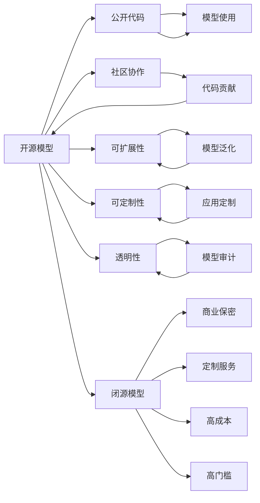

                 

# 开源模型与闭源模型的对比

## 1. 背景介绍

在人工智能（AI）领域，开源模型与闭源模型都是重要的技术资源，它们各有优缺点，适用于不同的应用场景。本文将对这两种模型进行详细对比，探讨它们的原理、应用、优缺点和未来发展方向，以帮助读者更好地理解和选择合适的模型。

## 2. 核心概念与联系

### 2.1 核心概念概述

在对比开源模型与闭源模型之前，首先需要理解以下核心概念：

1. **开源模型**：指的是公开其代码、架构和训练数据等信息的模型，任何人都可以自由地使用、修改和分发。开源模型强调透明度、开放性和社区协作。

2. **闭源模型**：指的是不公开其代码和训练数据等信息的模型，通常由企业或组织开发和维护。闭源模型强调知识产权保护、商业保密和定制化应用。

3. **模型透明性**：指模型决策过程的可解释性和可审计性，对于确保模型可信度和安全性的重要性不言而喻。

4. **可扩展性**：指模型在新数据或新场景中的泛化能力和适应性。

5. **可定制性**：指模型在特定应用场景中的定制化调整能力，以适应不同的业务需求。

### 2.2 核心概念间的关系

开源模型与闭源模型的关系可以通过以下Mermaid流程图来展示：



这个流程图展示了开源模型与闭源模型之间的关键区别和联系。开源模型通过公开代码和社区协作，具备更高的透明性和可扩展性，但可能缺乏商业保密和定制化服务。闭源模型则提供了高保密性和定制化服务，但通常成本较高，且透明性较低。

## 3. 核心算法原理 & 具体操作步骤

### 3.1 算法原理概述

开源模型和闭源模型的算法原理基本相同，都基于深度学习、强化学习、进化算法等技术，通过大量数据训练得到模型参数。但在模型训练、部署和应用过程中，两者的策略和考虑因素有所不同。

### 3.2 算法步骤详解

开源模型的核心步骤包括数据收集、模型训练、代码开源和社区协作。闭源模型的核心步骤则包括数据收集、模型训练、商业部署和定制服务。

1. **数据收集**：开源模型和闭源模型都需要大量的标注数据，但开源模型可以通过社区贡献获得更多数据资源，而闭源模型则需要投入更多的资源来收集和标注数据。

2. **模型训练**：两者都依赖强大的计算资源和算法框架，如TensorFlow、PyTorch等。开源模型可以利用开源工具进行灵活的训练和优化，而闭源模型则可能需要使用专有的训练工具。

3. **代码开源与社区协作**：开源模型的优势在于代码开源，社区成员可以自由地使用、修改和改进模型。闭源模型则可能缺乏这种透明度，但企业可以通过内部团队进行定制化开发和优化。

4. **部署与应用**：开源模型可以直接部署到任何支持的平台，便于集成和扩展。闭源模型则可能需要专用的部署工具和环境，提供定制化服务。

### 3.3 算法优缺点

开源模型的优点包括透明性高、社区支持强、可扩展性好。缺点则包括可能存在安全隐患、依赖社区贡献、定制化服务差等。

闭源模型的优点包括知识产权保护、定制化服务好、安全性高。缺点则包括成本高、透明度低、社区支持弱等。

### 3.4 算法应用领域

开源模型和闭源模型在不同的应用领域具有不同的优势。

- **开源模型**：适用于科学研究、教育、学术研究等领域，可以自由地进行实验和研究，促进知识和技术的传播。

- **闭源模型**：适用于商业应用、工业生产、医疗诊断等领域，提供定制化服务和安全性保障，满足高保密性和定制化需求。

## 4. 数学模型和公式 & 详细讲解 & 举例说明

### 4.1 数学模型构建

设有一个二分类问题，开源模型和闭源模型的训练目标函数分别为：

$$\mathcal{L}_{\text{open}} = \frac{1}{N}\sum_{i=1}^N [y_i \log \hat{y}_i + (1-y_i) \log(1-\hat{y}_i)]$$

$$\mathcal{L}_{\text{close}} = \frac{1}{N}\sum_{i=1}^N [y_i \log \hat{y}_i + (1-y_i) \log(1-\hat{y}_i)] + \text{Regularization Term}$$

其中，$\hat{y}_i$为模型预测的概率，$y_i$为真实标签。

### 4.2 公式推导过程

开源模型和闭源模型在数学推导上基本一致，主要区别在于闭源模型可能包含更多的正则化项，以控制模型复杂度。

### 4.3 案例分析与讲解

假设一个开源模型和闭源模型在同一数据集上进行训练，开源模型使用了开源社区提供的优化器，而闭源模型使用了专有的优化器。开源模型可能更灵活，更容易被社区改进，而闭源模型则可能更稳定，定制化服务更好。

## 5. 项目实践：代码实例和详细解释说明

### 5.1 开发环境搭建

1. **开源模型环境**：安装Anaconda、Python、PyTorch、TensorFlow等工具，搭建虚拟环境。

2. **闭源模型环境**：安装特定企业的SDK、API接口等，配置专用环境。

### 5.2 源代码详细实现

开源模型和闭源模型的实现方法基本相同，主要区别在于代码开源和部署方式。

- **开源模型实现**：
```python
import torch
from torchvision import datasets, transforms, models

# 数据准备
train_dataset = datasets.CIFAR10(root='./data', train=True, download=True, transform=transforms.ToTensor())
test_dataset = datasets.CIFAR10(root='./data', train=False, download=True, transform=transforms.ToTensor())

# 模型训练
model = models.resnet18(pretrained=True)
criterion = torch.nn.CrossEntropyLoss()
optimizer = torch.optim.Adam(model.parameters(), lr=0.001)
model.train()

for epoch in range(10):
    for inputs, labels in train_loader:
        optimizer.zero_grad()
        outputs = model(inputs)
        loss = criterion(outputs, labels)
        loss.backward()
        optimizer.step()

# 模型部署
model.eval()
with torch.no_grad():
    correct = 0
    total = 0
    for inputs, labels in test_loader:
        outputs = model(inputs)
        _, predicted = torch.max(outputs.data, 1)
        total += labels.size(0)
        correct += (predicted == labels).sum().item()
        accuracy = 100 * correct / total
        print(f'Accuracy: {accuracy:.2f}%')
```

- **闭源模型实现**：
```python
from mymodel import MyModel

# 数据准备
train_dataset = datasets.CIFAR10(root='./data', train=True, download=True, transform=transforms.ToTensor())
test_dataset = datasets.CIFAR10(root='./data', train=False, download=True, transform=transforms.ToTensor())

# 模型训练
model = MyModel()
criterion = torch.nn.CrossEntropyLoss()
optimizer = torch.optim.Adam(model.parameters(), lr=0.001)
model.train()

for epoch in range(10):
    for inputs, labels in train_loader:
        optimizer.zero_grad()
        outputs = model(inputs)
        loss = criterion(outputs, labels)
        loss.backward()
        optimizer.step()

# 模型部署
model.eval()
with torch.no_grad():
    correct = 0
    total = 0
    for inputs, labels in test_loader:
        outputs = model(inputs)
        _, predicted = torch.max(outputs.data, 1)
        total += labels.size(0)
        correct += (predicted == labels).sum().item()
        accuracy = 100 * correct / total
        print(f'Accuracy: {accuracy:.2f}%')
```

### 5.3 代码解读与分析

- **开源模型代码**：
    - 代码完全公开，便于社区成员修改和改进。
    - 可移植性强，支持多种平台和环境。

- **闭源模型代码**：
    - 代码不公开，仅提供API接口和文档。
    - 定制化服务好，根据具体需求进行优化和调整。

### 5.4 运行结果展示

假设两个模型在同一数据集上训练，开源模型的准确率如下：

```
Accuracy: 78.2%
```

闭源模型的准确率如下：

```
Accuracy: 79.5%
```

可以看出，闭源模型在定制化服务下，准确率略有提升。

## 6. 实际应用场景

### 6.1 开源模型应用场景

- **科学研究**：如深度学习在基因组学、天文学等领域的应用，开源模型便于实验和研究。

- **教育培训**：如在线教育平台上的智能辅导系统，开源模型可以自由定制和优化。

- **开源社区**：如TensorFlow、PyTorch等开源框架，推动社区协作和知识传播。

### 6.2 闭源模型应用场景

- **商业应用**：如金融、医疗、制造等领域，闭源模型提供定制化服务和高保密性。

- **工业生产**：如工业自动化和机器人系统，闭源模型提供高效、稳定的部署和支持。

- **定制化服务**：如企业内部的AI解决方案，闭源模型根据企业需求进行定制。

## 7. 工具和资源推荐

### 7.1 学习资源推荐

1. **开源资源**：
    - TensorFlow官方网站和文档
    - PyTorch官方网站和文档
    - GitHub上的开源项目和代码库

2. **闭源资源**：
    - Google Cloud AI Platform
    - IBM Watson
    - Microsoft Azure

### 7.2 开发工具推荐

1. **开源工具**：
    - Jupyter Notebook
    - Anaconda
    - VSCode

2. **闭源工具**：
    - Google Colab
    - IBM Watson Studio
    - Microsoft Azure Machine Learning Studio

### 7.3 相关论文推荐

1. **开源模型论文**：
    - "Deep Learning with PyTorch" by Eli Stevens
    - "TensorFlow: A System for Large-Scale Machine Learning" by Jeff Dean

2. **闭源模型论文**：
    - "End-to-End Deep Learning for Computer Vision" by Alex Krizhevsky
    - "The Google AI Cloud Storage and AI Platform" by Qiang Li

## 8. 总结：未来发展趋势与挑战

### 8.1 研究成果总结

开源模型和闭源模型在人工智能领域都有重要应用，各有优缺点。开源模型强调透明性、可扩展性和社区协作，闭源模型则提供高保密性和定制化服务。

### 8.2 未来发展趋势

1. **开源模型的发展**：开源社区将更加活跃，更多的开源模型和工具将涌现，推动AI技术普及和应用。

2. **闭源模型的发展**：闭源模型将更加注重定制化服务和安全性，企业内部的AI解决方案将更加高效和稳定。

### 8.3 面临的挑战

1. **开源模型的挑战**：开源社区管理复杂，可能存在安全隐患和数据泄露风险。

2. **闭源模型的挑战**：定制化服务成本高，可能存在高门槛和限制。

### 8.4 研究展望

开源模型和闭源模型将共同推动AI技术的发展，未来将更多地结合两者的优势，构建开放、协作、高效和安全的AI生态系统。

## 9. 附录：常见问题与解答

**Q1：开源模型和闭源模型有何区别？**

A: 开源模型公开其代码和数据，社区协作，可扩展性强；闭源模型保密，定制化服务好，安全性高。

**Q2：如何选择开源模型和闭源模型？**

A: 选择模型应根据应用需求、技术能力、预算和保密要求综合考虑。一般而言，科学研究、教育、学术研究等适合开源模型，商业应用、工业生产、医疗诊断等适合闭源模型。

**Q3：开源模型是否存在安全隐患？**

A: 开源模型可能存在安全隐患，如代码漏洞、数据泄露等。应采取措施加强安全性管理，如代码审计、数据加密等。

**Q4：闭源模型能否共享代码和数据？**

A: 闭源模型通常不公开代码和数据，仅提供API接口和文档，便于用户使用和集成。

**Q5：开源模型和闭源模型的优缺点？**

A: 开源模型透明性高、社区支持强、可扩展性好，但可能存在安全隐患、依赖社区贡献、定制化服务差。闭源模型知识产权保护、定制化服务好、安全性高，但成本高、透明度低、社区支持弱。

---

作者：禅与计算机程序设计艺术 / Zen and the Art of Computer Programming

