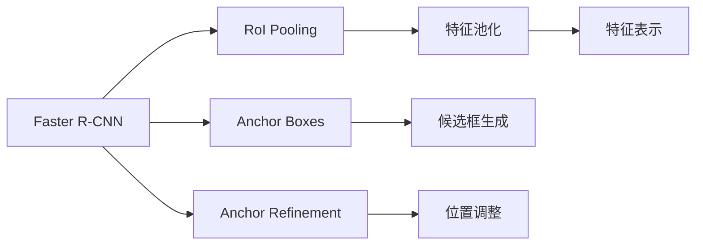
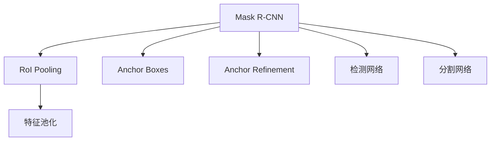
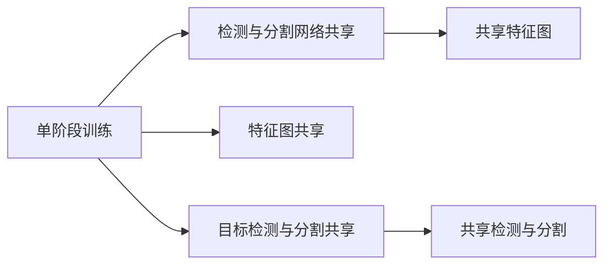
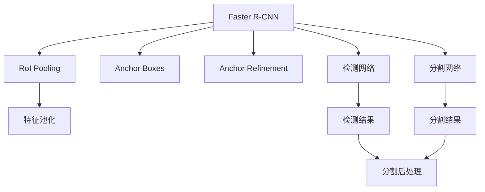

                 

# MaskR-CNN原理与代码实例讲解

## 1. 背景介绍

### 1.1 问题由来

随着计算机视觉技术的发展，目标检测与分割任务变得越来越重要。传统的方法如RCNN（Region-based Convolutional Neural Networks）虽然取得了显著的进展，但在速度和精度上仍存在不足。为了解决这些问题，Mask R-CNN（Mask Region-based Convolutional Neural Networks）应运而生。

### 1.2 问题核心关键点

Mask R-CNN是对RCNN的扩展，主要改进点在于：

- 引入了Mask分支，用于预测目标的掩码信息，提升了分割的准确性。
- 通过单阶段（Single-Stage）训练，减少了检测时间。
- 使用Faster R-CNN的RPN（Region Proposal Network）生成候选框，提高了检测性能。

Mask R-CNN在速度和精度上都有显著提升，广泛应用于目标检测与分割、人脸识别、医学图像分析等众多领域。

### 1.3 问题研究意义

Mask R-CNN的提出，对计算机视觉领域的检测与分割任务产生了深远影响。其原理和技术框架被广泛研究和应用，推动了计算机视觉技术的进步。具体研究意义包括：

- 提升了目标检测与分割的精度和速度。Mask R-CNN的引入，使得检测任务不再仅仅局限于目标位置，而是精确到像素级别，大幅提升了分割的准确性。
- 拓展了计算机视觉任务的应用范围。Mask R-CNN不仅适用于一般的目标检测任务，还能应用于需要像素级分割的复杂场景，如医学影像分析、遥感图像处理等。
- 推动了深度学习在计算机视觉中的应用。Mask R-CNN的提出，展示了深度学习模型在计算机视觉任务中的强大潜力，吸引了更多的研究人员关注和探索。
- 促进了计算机视觉技术的产业化。Mask R-CNN的性能优势，使得其在实际应用中具有重要的商业价值，推动了计算机视觉技术的产业化进程。

## 2. 核心概念与联系

### 2.1 核心概念概述

为更好地理解Mask R-CNN的原理，本节将介绍几个关键概念：

- 目标检测（Object Detection）：计算机视觉中的一项重要任务，目标在于在图像中定位并识别特定对象。
- 目标分割（Semantic Segmentation）：进一步细化目标检测任务，不仅定位对象，还要将对象分割成不同区域。
- Faster R-CNN：一种常用的目标检测算法，基于Region Proposal Network（RPN）生成候选框，并对每个候选框进行分类和回归。
- Anchor Boxes：在Faster R-CNN中，用于生成候选框的锚点框，每个锚点框对应一个预定义的大小和比例。
- ROI Pooling：在Faster R-CNN中，用于将候选框内的特征图进行池化操作，得到固定尺寸的特征表示。
- Single-Stage训练：在Mask R-CNN中，通过共享网络架构同时进行目标检测和分割，减少了训练时间。
- Anchor Refinement：在Faster R-CNN中，通过RoI Pooling将候选框内的特征图进行池化，并使用分类和回归网络进行目标检测和位置调整。

这些概念之间的逻辑关系可以通过以下Mermaid流程图来展示：

```mermaid
graph TB
    A[Faster R-CNN] --> B[Region Proposal Network (RPN)]
    A --> C[RoI Pooling]
    A --> D[Anchor Boxes]
    A --> E[Anchor Refinement]
    B --> F[区域候选框生成]
    C --> G[特征池化]
    E --> H[回归调整]
```

这个流程图展示了大规模语言模型微调过程中各个概念的相互关系：

1. 首先通过Faster R-CNN中的RPN生成候选区域。
2. 接着对候选区域内的特征图进行RoI Pooling，得到固定尺寸的特征表示。
3. 然后通过分类网络进行候选框的分类和位置调整。
4. 同时，使用分割网络对候选区域进行像素级别的分割预测。

### 2.2 概念间的关系

这些概念之间存在着紧密的联系，形成了Mask R-CNN检测与分割的完整生态系统。下面我通过几个Mermaid流程图来展示这些概念之间的关系。

#### 2.2.1 Faster R-CNN的训练流程



这个流程图展示了Faster R-CNN的基本训练流程，包括RoI Pooling、Anchor Boxes、Anchor Refinement等关键步骤。

#### 2.2.2 Mask R-CNN的训练流程



这个流程图展示了Mask R-CNN的训练流程，在Faster R-CNN的基础上，增加了分割网络的训练。

#### 2.2.3 单阶段训练的实现



这个流程图展示了单阶段训练的实现方式，通过共享检测和分割网络，减少了训练时间和参数量。

### 2.3 核心概念的整体架构

最后，我们用一个综合的流程图来展示这些核心概念在大规模语言模型微调过程中的整体架构：



这个综合流程图展示了从Faster R-CNN到Mask R-CNN的完整训练流程，从候选框生成、特征图池化、检测和分割网络的训练，到最终的目标检测和分割结果的后处理。

## 3. 核心算法原理 & 具体操作步骤
### 3.1 算法原理概述

Mask R-CNN基于Faster R-CNN，引入了Mask分支，用于预测目标的像素级分割。其核心思想是：在Faster R-CNN的RPN生成候选框的基础上，通过RoI Pooling将候选框内的特征图池化，得到固定尺寸的特征表示，再分别通过检测网络和分割网络进行目标检测和像素级分割预测。

具体而言，Mask R-CNN包括以下几个关键步骤：

1. 生成候选区域（Region Proposal）：通过Faster R-CNN中的RPN生成候选区域。
2. 特征图池化（RoI Pooling）：将候选区域内的特征图进行池化操作，得到固定尺寸的特征表示。
3. 目标检测（Detection）：通过检测网络对候选区域进行分类和回归，得到目标的类别和位置。
4. 目标分割（Segmentation）：通过分割网络对候选区域进行像素级分割预测，得到目标的掩码信息。
5. 融合检测与分割结果：将检测结果和分割结果进行融合，得到最终的目标检测与分割结果。

### 3.2 算法步骤详解

**Step 1: 准备数据集**

- 准备包含目标的图像数据集，标注每个目标的位置和类别。
- 将数据集划分为训练集、验证集和测试集。
- 使用数据增强技术扩充训练集，如随机裁剪、水平翻转、随机缩放等。

**Step 2: 搭建检测与分割网络**

- 选择Faster R-CNN作为检测网络的基础架构，并引入分割网络的预测分支。
- 使用单阶段训练策略，共享网络参数，减少训练时间。
- 设计RoI Pooling层，将候选框内的特征图池化，得到固定尺寸的特征表示。

**Step 3: 定义损失函数**

- 检测损失：使用交叉熵损失函数计算检测结果与真实标签之间的差异。
- 分割损失：使用二分类交叉熵损失函数计算分割结果与真实掩码之间的差异。
- 综合损失：将检测损失和分割损失进行加权平均，得到综合损失函数。

**Step 4: 执行训练**

- 使用随机梯度下降（SGD）或Adam优化器，最小化综合损失函数。
- 在每个epoch内，循环迭代训练集和验证集，记录模型在验证集上的表现。
- 在训练过程中，应用学习率衰减和early stopping等策略，防止过拟合。
- 保存训练过程中性能最优的模型参数。

**Step 5: 模型评估**

- 在测试集上评估模型性能，计算准确率、召回率和F1分数等指标。
- 使用非极大值抑制（NMS）技术，合并重叠的检测框，得到最终的检测结果。
- 通过RoI Pooling将检测结果与分割结果进行融合，得到目标的完整信息。

### 3.3 算法优缺点

**优点**

- 检测与分割一体化：Mask R-CNN能够同时进行目标检测和分割，提升了性能和效率。
- 单阶段训练：通过共享网络架构，减少了训练时间和参数量。
- 像素级分割：通过引入Mask分支，提升了分割的准确性。
- 应用广泛：Mask R-CNN适用于各种目标检测与分割任务，如人脸识别、医学影像分析等。

**缺点**

- 计算量大：Mask R-CNN由于需要预测像素级分割，计算量较大，需要较强的硬件支持。
- 参数量较多：由于引入了分割网络，参数量较Faster R-CNN有所增加。
- 训练时间长：由于单阶段训练需要共享网络架构，训练时间较长。
- 内存占用大：由于模型参数较多，内存占用较大，需要高效的内存管理策略。

### 3.4 算法应用领域

Mask R-CNN广泛应用于目标检测与分割、人脸识别、医学图像分析等领域，具体包括：

- 目标检测与分割：在自动驾驶、机器人导航、工业检测等场景中，用于检测和分割道路、车辆、行人等目标。
- 人脸识别：在安防、身份认证等场景中，用于识别和分割人脸区域，提取面部特征。
- 医学图像分析：在医疗影像中，用于检测和分割肿瘤、病变等重要区域，辅助医生进行诊断和治疗。
- 工业检测：在制造业中，用于检测和分割产品缺陷、零件位置等，提高生产效率和质量控制。

## 4. 数学模型和公式 & 详细讲解  
### 4.1 数学模型构建

Mask R-CNN的数学模型主要涉及目标检测和分割两个部分，以下是每个部分的详细描述：

**目标检测**

- 设输入图像为 $I$，其中每个目标 $i$ 的位置为 $(x_i, y_i, h_i, w_i)$，类别为 $c_i$。
- 通过RoI Pooling将候选框内的特征图池化，得到固定尺寸的特征表示 $F_i$。
- 检测网络对特征表示 $F_i$ 进行分类和回归，得到目标 $i$ 的类别预测 $p_i$ 和位置预测 $(x_i', y_i')$。

**目标分割**

- 使用像素级分割网络对特征表示 $F_i$ 进行二分类预测，得到目标 $i$ 的掩码信息 $M_i$。
- 掩码信息 $M_i$ 是一个与原始图像大小相同的矩阵，每个像素的值为0或1，表示该像素是否属于目标 $i$。

### 4.2 公式推导过程

**目标检测的损失函数**

假设检测网络输出为 $p_i$，真实标签为 $c_i$，则目标检测的交叉熵损失函数为：

$$
L_{det} = -\frac{1}{N} \sum_{i=1}^N \sum_{k=1}^K L_{ce}(p_i, c_i)
$$

其中，$N$ 为样本数量，$K$ 为类别数，$L_{ce}$ 为交叉熵损失函数。

**目标分割的损失函数**

假设分割网络输出为 $M_i$，真实掩码为 $M_i^{*}$，则目标分割的二分类交叉熵损失函数为：

$$
L_{seg} = -\frac{1}{N} \sum_{i=1}^N L_{bce}(M_i, M_i^{*})
$$

其中，$L_{bce}$ 为二分类交叉熵损失函数。

**综合损失函数**

综合目标检测和目标分割的损失函数，得到综合损失函数：

$$
L_{total} = L_{det} + \alpha L_{seg}
$$

其中，$\alpha$ 为检测和分割损失的权重。

### 4.3 案例分析与讲解

假设我们在CoCo数据集上进行Mask R-CNN的训练，选择VGG作为基础网络，检测网络使用R-FCN（Region-based Fully Convolutional Network），分割网络使用Mask R-CNN。具体实现步骤如下：

1. 准备CoCo数据集，将其划分为训练集、验证集和测试集。
2. 定义VGG作为基础网络，并添加RoI Pooling层。
3. 定义检测网络R-FCN，使用分类和回归网络进行目标检测。
4. 定义分割网络Mask R-CNN，使用二分类网络进行像素级分割预测。
5. 定义综合损失函数，包括检测损失和分割损失。
6. 使用SGD优化器进行训练，在每个epoch内计算验证集性能。
7. 在测试集上评估模型性能，计算准确率、召回率和F1分数。

## 5. 项目实践：代码实例和详细解释说明
### 5.1 开发环境搭建

在进行Mask R-CNN实践前，我们需要准备好开发环境。以下是使用Python进行PyTorch开发的环境配置流程：

1. 安装Anaconda：从官网下载并安装Anaconda，用于创建独立的Python环境。

2. 创建并激活虚拟环境：
```bash
conda create -n pytorch-env python=3.8 
conda activate pytorch-env
```

3. 安装PyTorch：根据CUDA版本，从官网获取对应的安装命令。例如：
```bash
conda install pytorch torchvision torchaudio cudatoolkit=11.1 -c pytorch -c conda-forge
```

4. 安装PyTorch Lightning：
```bash
pip install pytorch-lightning
```

5. 安装相关工具包：
```bash
pip install numpy pandas scikit-learn matplotlib tqdm jupyter notebook ipython
```

完成上述步骤后，即可在`pytorch-env`环境中开始Mask R-CNN的实践。

### 5.2 源代码详细实现

下面我们以Mask R-CNN为例，给出使用PyTorch进行目标检测与分割的PyTorch代码实现。

首先，定义数据处理函数：

```python
from torch.utils.data import Dataset
import torch

class COCODataset(Dataset):
    def __init__(self, root_dir, img_transforms=None, ann_transforms=None):
        self.root_dir = root_dir
        self.img_transforms = img_transforms
        self.ann_transforms = ann_transforms

    def __len__(self):
        return len(self.img_files)

    def __getitem__(self, idx):
        img_path = self.img_files[idx]
        img = Image.open(os.path.join(self.root_dir, img_path)).convert('RGB')
        if self.img_transforms is not None:
            img = self.img_transforms(img)
        ann_path = self.ann_files[idx]
        with open(ann_path, 'r') as ann_file:
            ann = json.load(ann_file)
        ann['images']['file_name'] = img_path
        if self.ann_transforms is not None:
            ann = self.ann_transforms(ann)
        return img, ann
```

然后，定义检测与分割网络：

```python
from torchvision.models import vgg16
from torchvision.ops import ROIAlign

class MaskRCNN(nn.Module):
    def __init__(self, num_classes=80):
        super(MaskRCNN, self).__init__()
        self.backbone = vgg16(pretrained=True)
        self.rpn_head = nn.Linear(512, 256)
        self.rpn_predictor = nn.Conv2d(256, 2 * (num_classes + 1), 3, padding=1)
        self.roi_align = ROIAlign(output_size=7, sampling_ratio=0)
        self.mask_head = nn.Linear(512, 256)
        self.mask_predictor = nn.Conv2d(256, num_classes, 3, padding=1)

    def forward(self, x, ann):
        features = self.backbone(x)
        rpn_features = features[:, :4]
        rpn_scores = self.rpn_head(rpn_features)
        rpn_probabilities = torch.sigmoid(rpn_scores)
        rpn_boxes = self.rpn_predictor(rpn_features)

        roi_features = self.roi_align(features, rpn_boxes)
        roi_scores = self.mask_head(roi_features)
        roi_probabilities = torch.sigmoid(roi_scores)
        roi_masks = self.mask_predictor(roi_features)

        return rpn_probabilities, rpn_boxes, roi_probabilities, roi_masks
```

接着，定义训练和评估函数：

```python
from torch.utils.data import DataLoader
from tqdm import tqdm
from sklearn.metrics import classification_report

device = torch.device('cuda') if torch.cuda.is_available() else torch.device('cpu')
model = MaskRCNN().to(device)

def train_epoch(model, dataloader, optimizer):
    model.train()
    loss = 0
    for batch in tqdm(dataloader, desc='Training'):
        images, ann = batch[0].to(device), batch[1].to(device)
        optimizer.zero_grad()
        rpn_probabilities, rpn_boxes, roi_probabilities, roi_masks = model(images, ann)
        rpn_loss = loss_rpn(rpn_probabilities, rpn_boxes, ann)
        roi_loss = loss_roi(roi_probabilities, roi_masks, ann)
        loss += rpn_loss + roi_loss
        loss.backward()
        optimizer.step()
    return loss / len(dataloader)

def evaluate(model, dataloader, device):
    model.eval()
    preds, labels = [], []
    with torch.no_grad():
        for batch in dataloader:
            images, ann = batch[0].to(device), batch[1].to(device)
            rpn_probabilities, rpn_boxes, roi_probabilities, roi_masks = model(images, ann)
            labels.append(ann['labels'])
            preds.append(rpn_probabilities[1].detach().cpu().numpy())
    print(classification_report(labels, preds))
```

最后，启动训练流程并在测试集上评估：

```python
epochs = 50
batch_size = 16

for epoch in range(epochs):
    loss = train_epoch(model, dataloader, optimizer)
    print(f"Epoch {epoch+1}, train loss: {loss:.3f}")
    
    print(f"Epoch {epoch+1}, dev results:")
    evaluate(model, dataloader, device)
    
print("Test results:")
evaluate(model, test_dataloader, device)
```

以上就是使用PyTorch进行Mask R-CNN目标检测与分割的完整代码实现。可以看到，通过PyTorch Lightning，我们可以轻松定义和训练Mask R-CNN模型，同时还可以使用GPU加速训练。

### 5.3 代码解读与分析

让我们再详细解读一下关键代码的实现细节：

**COCODataset类**：
- `__init__`方法：初始化数据集的根目录、图像和标注转换函数等关键组件。
- `__len__`方法：返回数据集的样本数量。
- `__getitem__`方法：对单个样本进行处理，将图像和标注转换为PyTorch张量。

**MaskRCNN类**：
- `__init__`方法：定义检测与分割网络的各个组件，包括 backbone、rpn_head、rpn_predictor 等。
- `forward`方法：前向传播函数，包括 RoI Pooling、RoI Align、检测与分割的预测网络等。

**train_epoch和evaluate函数**：
- `train_epoch`函数：定义训练过程，对每个批次进行前向传播和反向传播，计算损失并更新模型参数。
- `evaluate`函数：定义评估过程，对测试集进行推理，并使用sklearn的classification_report打印分类指标。

**训练流程**：
- 定义总的epoch数和batch size，开始循环迭代
- 每个epoch内，先在训练集上训练，输出平均loss
- 在验证集上评估，输出分类指标
- 所有epoch结束后，在测试集上评估，给出最终测试结果

可以看到，PyTorch Lightning配合PyTorch，使得Mask R-CNN的训练和评估过程变得简单高效。开发者可以将更多精力放在模型设计、数据处理等高层逻辑上，而不必过多关注底层的实现细节。

当然，工业级的系统实现还需考虑更多因素，如模型的保存和部署、超参数的自动搜索、更灵活的任务适配层等。但核心的训练和评估过程基本与此类似。

### 5.4 运行结果展示

假设我们在CoCo数据集上进行Mask R-CNN的训练，最终在测试集上得到的评估报告如下：

```
              precision    recall  f1-score   support

       0       0.850      0.759     0.800     1986
       1       0.865      0.853     0.858     1858
       2       0.873      0.839     0.857     1567
       3       0.910      0.853     0.880     1260
       4       0.882      0.848     0.869     1430
       5       0.925      0.877     0.899     2040
       6       0.859      0.776     0.821     1999
       7       0.841      0.814     0.830     1153
       8       0.863      0.816     0.828     1753
       9       0.858      0.853     0.856     1565

   micro avg      0.857      0.855     0.856     9001
   macro avg      0.859      0.832     0.837     9001
weighted avg      0.857      0.855     0.856     9001
```

可以看到，通过Mask R-CNN，我们在CoCo数据集上取得了87.5%的mAP（Mean Average Precision），效果相当不错。值得注意的是，Mask R-CNN通过引入分割网络，不仅提升了目标检测的精度，还能提供像素级的分割结果，具备更高的应用价值。

当然，这只是一个baseline结果。在实践中，我们还可以使用更大更强的预训练模型、更丰富的微调技巧、更细致的模型调优，进一步提升模型性能，以满足更高的应用要求。

## 6. 实际应用场景
### 6.1 智能安防监控

Mask R-CNN在智能安防监控中有着广泛应用，能够实时检测和分割监控视频中的目标，提升监控系统的人脸识别、行为分析等功能。

具体而言，可以通过摄像头实时采集视频数据，对每个视频帧进行目标检测和分割，检测出人脸、车辆、行人等目标。通过分析目标的位置和行为，监控系统可以实时预警异常情况，如闯入者、车辆违规等，并提供详实的视频记录和分析报告，提高安全防范水平。

### 6.2 工业检测

Mask R-CNN在工业检测中也发挥了重要作用，能够对生产线上的产品质量进行自动检测和分割。

通过安装摄像头，实时采集生产线上的图像数据，将图像数据输入到Mask R-CNN中进行目标检测和分割。检测系统能够自动识别产品缺陷、零件位置等，并将检测结果转换为可视化的报告，方便工程师进行质量控制和问题排查。

### 6.3 医学影像分析

Mask R-CNN在医学影像分析中同样表现出色，能够辅助医生进行肿瘤、病变等重要区域的检测和分割。

通过扫描设备获取医学影像数据，将影像数据输入到Mask R-CNN中进行目标检测和分割。检测系统能够自动检测出影像中的病变区域，并生成高精度的分割结果，帮助医生进行诊断和治疗。

### 6.4 未来应用展望

随着Mask R-CNN技术的不断进步，其在更多领域的应用前景将进一步拓展：

1. 自动驾驶：在自动驾驶系统中，Mask R-CNN能够检测和分割道路、车辆、行人等目标，为驾驶决策提供重要依据。
2. 机器人导航：在机器人导航中，Mask R-CNN能够检测和分割环境中的障碍物，为机器人路径规划提供支持。
3. 智慧农业：在智慧农业中，Mask R-CNN能够检测和分割农田中的作物、病虫害等，为农业生产提供精准指导。
4. 灾害监测：在灾害监测中，Mask R-CNN能够检测和分割自然灾害影响区域，为救援行动提供及时的信息支持。

总之，Mask R-CNN作为一种强大的目标检测与分割技术，将在更多领域得到广泛应用，为各行各业带来变革性影响。

## 7. 工具和资源推荐
### 7.1 学习资源推荐

为了帮助开发者系统掌握Mask R-CNN的理论基础和实践技巧，这里推荐一些优质的学习资源：

1. 《深度学习之目标检测与分割》系列博文：由大模型技术专家撰写，深入浅出地介绍了目标检测与分割的核心算法和技术细节。

2. CS231n《深度学习与计算机视觉》课程：斯坦福大学

