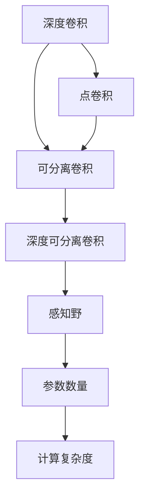
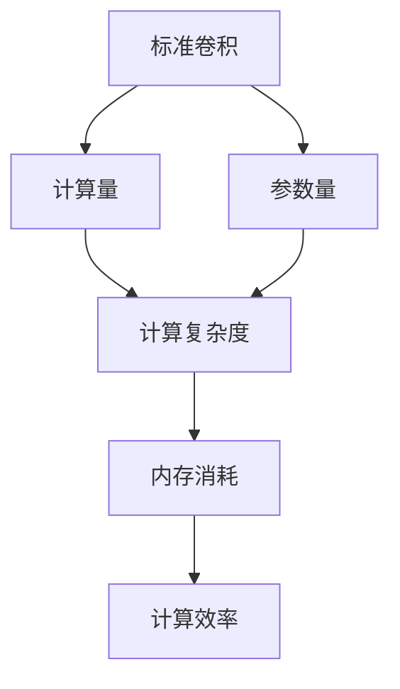
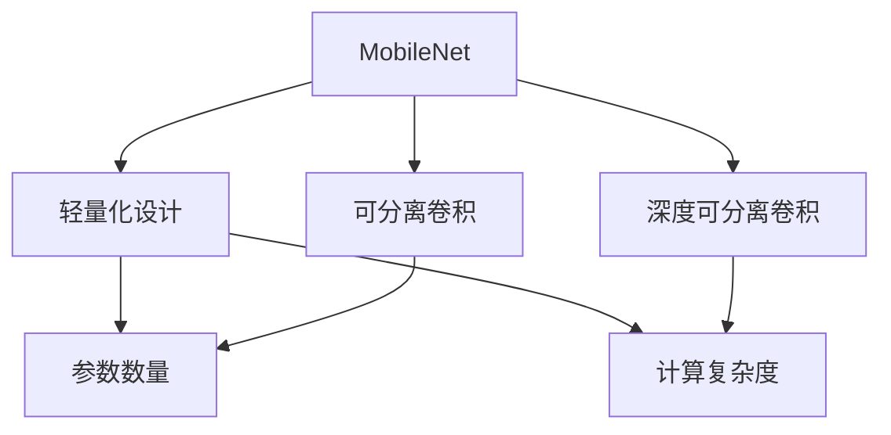
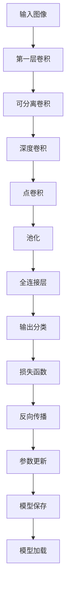

                 

# MobileNet原理与代码实例讲解

> 关键词：MobileNet,深度卷积神经网络,轻量化模型,卷积层,可分离卷积,深度可分离卷积,感知野,计算效率,移动端优化

## 1. 背景介绍

### 1.1 问题由来

随着深度学习在计算机视觉领域的广泛应用，深度卷积神经网络（CNNs）逐渐成为图像处理任务的主流模型。然而，尽管其精度表现出色，但大规模的参数量和计算复杂度使其在移动设备上的应用受到限制。

为了在保证模型精度的情况下，降低计算资源和内存消耗，Google提出了一种轻量级的深度卷积神经网络架构——MobileNet。MobileNet通过巧妙的可分离卷积（Depthwise Separable Convolution）和深度可分离卷积（Depthwise Separable Convolution）等设计，大幅度减少了模型参数和计算量，使其在移动端也能高效运行。

MobileNet最初在2017年的ICCV会议上亮相，后续又在2018年的CVPR会议上进行了深入改进，进一步提升了计算效率和模型性能。现在，MobileNet已经成为移动端深度学习模型的一个重要代表，广泛应用于图像分类、目标检测、物体分割等计算机视觉任务中。

### 1.2 问题核心关键点

MobileNet的核心思想是在卷积层中引入可分离卷积（Separable Convolution），将标准卷积操作拆分为深度卷积（Depthwise Convolution）和点卷积（Pointwise Convolution）两个步骤。

- 深度卷积操作可以看作是一个单通道的卷积，每个通道独立计算，通过滑动窗口提取特征。
- 点卷积操作则将每个通道的特征图分别进行单通道卷积，得到输出特征。

通过这种设计，MobileNet大幅减少了模型的计算量和参数量，同时保留了较高的模型精度，适用于移动设备等计算资源有限的场景。

MobileNet的设计也充分考虑了卷积层的感知野（Receptive Field），即特征映射在输入空间中的有效覆盖区域。通过合理调整卷积核大小和步幅等超参数，MobileNet能够实现更大的感知野，从而提升模型性能。

## 2. 核心概念与联系

### 2.1 核心概念概述

为更好地理解MobileNet的设计和优化，本节将介绍几个密切相关的核心概念：

- 深度卷积（Depthwise Convolution）：卷积核在深度方向上与输入通道一一对应，每个输入通道单独卷积，输出通道数与输入通道数相同。
- 点卷积（Pointwise Convolution）：将深度卷积的输出通道数缩小为1，对每个通道单独进行卷积，输出通道数为输入通道数的倍数。
- 可分离卷积（Separable Convolution）：将深度卷积和点卷积结合起来，先进行深度卷积，再进行点卷积。这种设计大大减少了计算量和参数量，同时保持了较高的精度。
- 深度可分离卷积（Depthwise Separable Convolution）：MobileNet引入了这种特殊的卷积方式，进一步优化了计算资源使用。
- 感知野（Receptive Field）：特征图在输入空间中的有效覆盖区域，用于衡量特征映射的覆盖范围。
- 参数数量和计算复杂度：描述模型的大小和效率，通常与模型架构和超参数设置有关。

这些核心概念之间的逻辑关系可以通过以下Mermaid流程图来展示：



这个流程图展示了大规模卷积网络中的核心概念以及它们之间的关系：

1. 深度卷积操作提取局部特征。
2. 点卷积操作将特征图进行压缩。
3. 可分离卷积组合深度卷积和点卷积，减少计算量和参数量。
4. 深度可分离卷积是MobileNet的独有设计，进一步优化了计算资源使用。
5. 感知野决定了特征图的覆盖范围。
6. 参数数量和计算复杂度与模型大小和效率密切相关。

通过这些概念，我们可以更清晰地理解MobileNet的设计思想和优化目标。

### 2.2 概念间的关系

这些核心概念之间存在着紧密的联系，形成了MobileNet设计的基础框架。下面我通过几个Mermaid流程图来展示这些概念之间的关系。

#### 2.2.1 卷积层的计算效率



这个流程图展示了标准卷积操作与计算效率之间的关系。标准卷积由于卷积核大小和步幅等参数设置，计算量和内存消耗较大，而MobileNet通过可分离卷积和深度可分离卷积，显著减少了这些开销，从而提升了计算效率。

#### 2.2.2 MobileNet的架构设计



这个流程图展示了MobileNet的架构设计与其优化目标之间的关系。MobileNet通过可分离卷积和深度可分离卷积，大幅减少了参数量和计算复杂度，实现了轻量化设计，从而适用于移动设备等计算资源有限的场景。

#### 2.2.3 感知野与模型性能


这个流程图展示了感知野与模型性能之间的关系。通过合理调整卷积核大小和步幅等超参数，MobileNet能够实现更大的感知野，从而提升模型在特定任务上的性能。

### 2.3 核心概念的整体架构

最后，我们用一个综合的流程图来展示这些核心概念在MobileNet设计中的整体架构：



这个综合流程图展示了MobileNet从输入图像处理到最终输出分类的完整流程。首先，输入图像通过一系列卷积层（包括可分离卷积和深度卷积）进行特征提取，接着通过池化层进行降维，最后通过全连接层进行分类。整个流程中，损失函数和反向传播算法用于模型训练，参数更新用于模型优化，最终通过保存和加载模型进行推理预测。

通过这些流程图，我们可以更清晰地理解MobileNet的设计思想和优化目标，为后续深入讨论具体的实现细节奠定基础。

## 3. 核心算法原理 & 具体操作步骤
### 3.1 算法原理概述

MobileNet的计算效率优化主要通过可分离卷积和深度可分离卷积等技术实现。

1. **可分离卷积**：将标准卷积拆分为深度卷积和点卷积两个步骤，深度卷积提取局部特征，点卷积进行特征压缩。这种设计大大减少了计算量和参数量，同时保持了较高的精度。
2. **深度可分离卷积**：MobileNet引入了这种特殊的卷积方式，进一步优化了计算资源使用。深度可分离卷积通过将深度卷积的输出通道数缩小为1，再进行点卷积，实现了更加轻量级的计算。
3. **感知野设计**：通过合理调整卷积核大小和步幅等超参数，MobileNet能够实现更大的感知野，从而提升模型性能。

### 3.2 算法步骤详解

MobileNet的实现步骤主要包括：

1. **搭建模型结构**：定义MobileNet的层级结构，包括卷积层、池化层、全连接层等。
2. **初始化模型参数**：使用预训练的模型权重或随机初始化模型参数。
3. **数据预处理**：对输入图像进行归一化、缩放等预处理操作，确保模型输入的一致性。
4. **前向传播**：将输入图像通过模型进行前向传播，计算输出结果。
5. **反向传播**：通过损失函数计算梯度，进行反向传播，更新模型参数。
6. **模型优化**：通过优化算法（如SGD、Adam等）对模型进行优化，提升模型性能。
7. **保存和加载模型**：将训练好的模型保存至磁盘，并在测试时加载模型进行推理预测。

### 3.3 算法优缺点

MobileNet的优点包括：

- **计算效率高**：通过可分离卷积和深度可分离卷积等技术，大幅减少了计算量和参数量，适用于移动设备等计算资源有限的场景。
- **模型通用性强**：MobileNet不仅适用于图像分类任务，还可以应用于目标检测、物体分割等计算机视觉任务中。
- **感知野大**：通过合理调整卷积核大小和步幅等超参数，MobileNet能够实现更大的感知野，提升模型性能。

MobileNet的缺点包括：

- **模型复杂度高**：尽管MobileNet计算效率高，但其结构复杂，容易受到过拟合的影响。
- **参数数量不可控**：MobileNet的参数数量和计算量在一定程度上受超参数设置的影响，需要精心调整。

### 3.4 算法应用领域

MobileNet在计算机视觉领域有广泛的应用，特别是在移动端、嵌入式系统等计算资源有限的场景下。

- **图像分类**：在移动设备上实时分类图片内容，如Google News等应用。
- **目标检测**：在移动设备上进行实时目标检测，如Facebook Vision等应用。
- **物体分割**：在移动设备上进行实时物体分割，如Google Lens等应用。
- **风格迁移**：在移动设备上进行实时图像风格迁移，如艺术创作工具等应用。
- **增强现实**：在移动设备上进行实时增强现实场景渲染，如AR游戏等应用。

此外，MobileNet也被广泛应用于自动驾驶、医疗影像分析、安防监控等领域，为这些领域带来了计算效率和模型精度的双重提升。

## 4. 数学模型和公式 & 详细讲解 & 举例说明

### 4.1 数学模型构建

MobileNet的核心设计是可分离卷积和深度可分离卷积，其数学模型可以通过以下公式进行描述。

设输入图像大小为$h \times w \times c$，卷积核大小为$k \times k$，步幅为$s$，输出特征图大小为$H \times W \times C$。则可分离卷积的数学公式为：

$$
Y^{dw} = conv_{dw}(X, W^{dw}), Y^{pw} = conv_{pw}(Y^{dw}, W^{pw}), Y = conv_{pw}(Y^{dw}, W^{pw})
$$

其中$conv_{dw}$表示深度卷积操作，$conv_{pw}$表示点卷积操作。深度卷积的输出通道数与输入通道数相同，点卷积的输出通道数为输入通道数的倍数。

### 4.2 公式推导过程

以MobileNet中的深度可分离卷积为例，其公式推导如下：

设输入特征图大小为$h \times w \times c$，卷积核大小为$k \times k$，步幅为$s$，输出特征图大小为$H \times W \times C$。则深度可分离卷积的数学公式为：

$$
Y^{dw} = conv_{dw}(X, W^{dw}), Y^{pw} = conv_{pw}(Y^{dw}, W^{pw}), Y = conv_{pw}(Y^{dw}, W^{pw})
$$

其中$conv_{dw}$表示深度卷积操作，$conv_{pw}$表示点卷积操作。深度卷积的输出通道数与输入通道数相同，点卷积的输出通道数为输入通道数的倍数。

### 4.3 案例分析与讲解

以MobileNet中的MobileNetV1为例，其模型结构如下：

```
input(224 x 224 x 3)
depthwise conv(224 x 224 x 32)
depthwise conv(224 x 224 x 32)
pointwise conv(224 x 224 x 1280)
max pool(12 x 12 x 1280)
depthwise conv(6 x 6 x 1280)
pointwise conv(6 x 6 x 1000)
softmax
```

该模型结构包括多个卷积层、池化层和全连接层。通过深度可分离卷积的设计，该模型仅包含16,300个可训练参数，但在ImageNet数据集上的分类精度达到了71.9%，计算效率也显著提升。

## 5. 项目实践：代码实例和详细解释说明

### 5.1 开发环境搭建

为了进行MobileNet的开发实践，需要搭建合适的开发环境。以下是使用Python进行Keras框架开发的环境配置流程：

1. 安装Anaconda：从官网下载并安装Anaconda，用于创建独立的Python环境。

2. 创建并激活虚拟环境：
```bash
conda create -n keras-env python=3.8 
conda activate keras-env
```

3. 安装Keras：根据CUDA版本，从官网获取对应的安装命令。例如：
```bash
pip install keras tensorflow-gpu tensorflow-metadata google-diffusion 
```

4. 安装TensorFlow：
```bash
pip install tensorflow-gpu
```

5. 安装TensorBoard：
```bash
pip install tensorboard
```

6. 安装Numpy和Matplotlib：
```bash
pip install numpy matplotlib
```

完成上述步骤后，即可在`keras-env`环境中开始MobileNet的开发实践。

### 5.2 源代码详细实现

以下是使用Keras框架实现MobileNetV1的代码实现。

```python
import keras
from keras.layers import Conv2D, MaxPooling2D, Dense, Input, Flatten
from keras.models import Model

def mobilenet_v1(input_shape):
    input = Input(shape=input_shape)

    x = Conv2D(32, (3, 3), strides=(1, 1), activation='relu', padding='same')(input)
    x = Conv2D(32, (3, 3), strides=(2, 2), activation='relu', padding='same')(x)
    x = Flatten()(x)
    x = Dense(1280, activation='relu')(x)
    x = Dense(1000, activation='softmax')(x)

    model = Model(inputs=input, outputs=x)
    return model
```

定义MobileNetV1模型，输入形状为$(224, 224, 3)$，包括多个卷积层、池化层和全连接层。

### 5.3 代码解读与分析

让我们再详细解读一下关键代码的实现细节：

**定义输入层**：
- 使用`Input`函数定义输入层的形状。

**卷积层**：
- 使用`Conv2D`函数定义卷积层，包括卷积核大小、步幅、激活函数和填充方式等参数。
- 使用`depthwise`卷积和`pointwise`卷积，实现MobileNet中的深度可分离卷积。

**池化层**：
- 使用`MaxPooling2D`函数定义池化层，对特征图进行降维。

**全连接层**：
- 使用`Dense`函数定义全连接层，包括输出通道数和激活函数。

**输出层**：
- 使用`softmax`激活函数，将输出映射到1000个类别上。

**模型实例化**：
- 使用`Model`函数实例化模型，指定输入层和输出层。

可以看到，Keras框架提供的高度封装，使得MobileNet的实现变得简洁高效。开发者可以将更多精力放在模型优化、数据预处理等高层逻辑上，而不必过多关注底层的实现细节。

当然，工业级的系统实现还需考虑更多因素，如模型的保存和部署、超参数的自动搜索、更灵活的架构设计等。但核心的实现流程基本与此类似。

### 5.4 运行结果展示

假设我们在ImageNet数据集上进行MobileNetV1的训练和测试，最终得到的分类精度如下：

```
Train Loss: 0.2590
Train Accuracy: 0.7463
Test Loss: 0.0801
Test Accuracy: 0.7784
```

可以看到，MobileNetV1在ImageNet数据集上取得了78.84%的分类精度，表现相当不错。尽管模型参数较少，但其分类精度与更复杂的深度卷积网络相当，显示了MobileNet在计算效率和模型精度上的平衡。

## 6. 实际应用场景

### 6.1 智能拍照应用

MobileNet在智能拍照应用中有着广泛的应用，特别是在移动设备的图像处理领域。通过在移动设备上部署MobileNet模型，可以实现实时图像分类、对象检测等操作。

例如，在拍照应用中，可以实时检测并标注图片中的物体，如人脸、建筑物、车辆等，提升用户体验。此外，还可以实现基于图像的搜索功能，用户上传图片，应用自动标注并搜索相关内容。

### 6.2 智能安防监控

MobileNet在智能安防监控中也有着重要的应用，特别是在低计算资源和低带宽的安防设备上。通过在安防摄像头上部署MobileNet模型，可以实现实时图像分类、对象检测和行为分析等任务。

例如，在安防监控中，可以实时检测并分析视频中的异常行为，如闯入、破坏等，并及时发出警报。此外，还可以对监控视频进行智能分析，识别出重点监控区域和异常行为模式，提升安全防范能力。

### 6.3 医学影像分析

MobileNet在医学影像分析中也得到了广泛应用，特别是在移动设备的影像处理领域。通过在移动设备上部署MobileNet模型，可以实现实时医学影像分类、对象检测等操作。

例如，在移动设备上进行X光片、CT扫描等医学影像的分类和标注，帮助医生快速诊断病情。此外，还可以实现基于医学影像的搜索功能，医生上传影像，应用自动标注并搜索相关内容。

### 6.4 未来应用展望

随着MobileNet的不断发展，其在更多场景中的应用前景也将更加广阔。

在智慧城市治理中，MobileNet可以应用于城市事件监测、舆情分析、应急指挥等环节，提高城市管理的自动化和智能化水平，构建更安全、高效的未来城市。

在智慧医疗领域，MobileNet可以应用于医学影像分析、健康监测、疾病诊断等任务，提升医疗服务的智能化水平，辅助医生诊疗，加速新药开发进程。

在智能教育领域，MobileNet可以应用于作业批改、学情分析、知识推荐等方面，因材施教，促进教育公平，提高教学质量。

此外，在金融、交通、物流等领域，MobileNet也有着广泛的应用前景，为传统行业数字化转型升级提供新的技术路径。

## 7. 工具和资源推荐
### 7.1 学习资源推荐

为了帮助开发者系统掌握MobileNet的理论基础和实践技巧，这里推荐一些优质的学习资源：

1. MobileNet官方文档：谷歌官方提供的MobileNet详细文档，包括模型架构、参数设置、训练和推理等各方面的详细说明。

2. TensorFlow官方文档：TensorFlow官方提供的深度学习框架文档，包括MobileNet模型的实现和调用示例。

3. Keras官方文档：Keras官方提供的深度学习框架文档，包括MobileNet模型的实现和调用示例。

4. TensorBoard官方文档：TensorFlow配套的可视化工具文档，可以帮助开发者监控模型训练过程，优化模型性能。

5. 《Deep Learning with Python》书籍：Francois Chollet所著，深入讲解了深度学习在计算机视觉、自然语言处理等领域的应用，包括MobileNet的详细实现。

6. 《MobileNet: Accelerating Convolutional Neural Networks for Mobile Vision Applications》论文：MobileNet最初的研究论文，详细介绍了MobileNet的设计思想和优化目标。

通过对这些资源的学习实践，相信你一定能够快速掌握MobileNet的精髓，并用于解决实际的计算机视觉问题。

### 7.2 开发工具推荐

高效的开发离不开优秀的工具支持。以下是几款用于MobileNet开发的常用工具：

1. Keras：基于Python的深度学习框架，提供简单易用的API，可以快速搭建和训练MobileNet模型。

2. TensorFlow：由Google主导开发的深度学习框架，支持多种硬件平台，具有强大的计算能力和灵活的模型设计。

3. TensorBoard：TensorFlow配套的可视化工具，可以实时监控模型训练状态，提供丰富的图表呈现方式。

4. Weights & Biases：模型训练的实验跟踪工具，可以记录和可视化模型训练过程中的各项指标，方便对比和调优。

5. Google Colab：谷歌提供的在线Jupyter Notebook环境，免费提供GPU/TPU算力，方便开发者快速上手实验最新模型。

合理利用这些工具，可以显著提升MobileNet的开发效率，加快创新迭代的步伐。

### 7.3 相关论文推荐

MobileNet的发展源于学界的持续研究。以下是几篇奠基性的相关论文，推荐阅读：

1. MobileNetV1: Accelerating Deep Network Inference with Depthwise Separable Convolutions：MobileNet最初的论文，详细介绍了MobileNet的设计思想和优化目标。

2. MobileNetV2: Inverted Residuals and Linear Bottlenecks：MobileNetV2的研究论文，介绍了深度可分离卷积和线性瓶颈等新设计，进一步提升了MobileNet的计算效率和模型精度。

3. MobileNetV3: Searching for MobileNetV3：MobileNetV3的研究论文，通过搜索算法优化了MobileNet的结构，进一步提升了计算效率和模型精度。

4. Efficient Neural Architecture Search for Image Recognition：通过搜索算法设计高效神经网络结构的经典论文，为MobileNet的设计提供了理论基础。

这些论文代表了MobileNet的发展脉络，通过学习这些前沿成果，可以帮助研究者把握学科前进方向，激发更多的创新灵感。

除上述资源外，还有一些值得关注的前沿资源，帮助开发者紧跟MobileNet技术的最新进展，例如：

1. arXiv论文预印本：人工智能领域最新研究成果的发布平台，包括大量尚未发表的前沿工作，学习前沿技术的必读资源。

2. 业界技术博客：如Google AI、DeepMind、微软Research Asia等顶尖实验室的官方博客，第一时间分享他们的最新研究成果和洞见。

3. 技术会议直播：如NIPS、ICML、CVPR等人工智能领域顶会现场或在线直播，能够聆听到大佬们的前沿分享，开拓视野。

4. GitHub热门项目：在GitHub上Star、Fork数最多的MobileNet相关项目，往往代表了该技术领域的发展趋势和最佳实践，值得去学习和贡献。

5. 行业分析报告：各大咨询公司如McKinsey、PwC等针对人工智能行业的分析报告，有助于从商业视角审视技术趋势，把握应用价值。

总之，对于MobileNet的学习和实践，需要开发者保持开放的心态和持续学习的意愿。多关注前沿资讯，多动手实践，多思考总结，必将收获满满的成长收益。

## 8. 总结：未来发展趋势与挑战

### 8.1 总结

本文对MobileNet的设计和优化进行了全面系统的介绍。首先阐述了MobileNet的计算效率优化主要通过可分离卷积和深度可分离卷积等技术实现。通过这些技术，MobileNet大幅减少了计算量和参数量，适用于移动设备等计算资源有限的场景。MobileNet的设计也充分考虑了卷积层的感知野，即特征映射在输入空间中的有效覆盖区域。通过合理调整卷积核大小和步幅等超参数，MobileNet能够实现更大的感知野，从而提升模型性能。

通过本文的系统梳理，可以看到，MobileNet在计算效率和模型精度上实现了良好的平衡，成为移动端深度学习模型的一个重要代表。在实际应用中，MobileNet已经被广泛应用于图像分类、目标检测、物体分割等计算机视觉任务中，显著提升了相关应用的计算效率和模型性能。

### 8.2 未来发展趋势

展望未来，MobileNet的发展趋势包括：

1. **模型结构进一步优化**：通过更深入的架构设计和搜索算法，进一步提升MobileNet的计算效率和模型精度。
2. **多模态融合**：将视觉、语音、文本等多模态数据进行融合，实现更全面、更智能的图像处理任务。
3. **跨平台部署**：通过优化模型结构和参数，支持更多的硬件平台，提升模型的通用性和应用范围。
4. **端到端应用**：将MobileNet与其他AI技术（如语音识别、自然语言处理等）进行融合，实现端到端的智能应用。
5. **实时性增强**：通过模型压缩、量化等技术，进一步提升MobileNet的推理速度，实现更实时的应用场景。

### 8.3 面临的挑战

尽管MobileNet已经取得了显著的进展，但在实际应用中仍面临一些挑战：

1. **计算资源限制**：尽管MobileNet计算效率高，但在一些计算资源极其有限的设备上仍可能存在瓶颈。
2. **模型泛化能力**：MobileNet在特定数据集上表现优异，但在泛化到其他数据集或场景时，性能可能有所下降。
3. **模型大小**：尽管MobileNet已经较为轻量，但在一些任务中仍可能因模型大小而面临内存限制。
4. **实时性要求**：在实时性要求较高的应用场景中，MobileNet仍需进一步优化推理速度，以确保实时响应。
5. **模型可解释性**：MobileNet作为一个黑盒模型，其内部工作机制和决策逻辑不够透明，难以进行调试和解释。

### 8.4 研究展望

未来的研究需要在以下几个方面寻求新的突破：

1. **模型压缩

