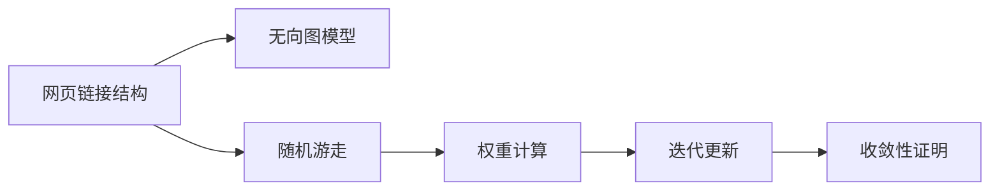
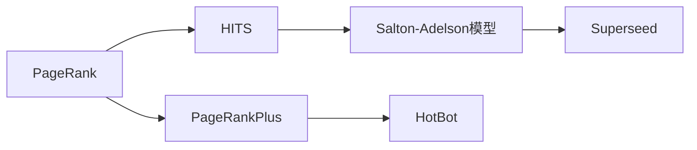
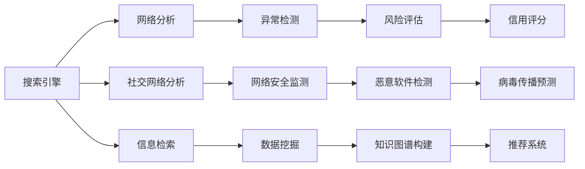

                 

# PageRank 原理与代码实例讲解

> 关键词：PageRank, 图模型, 随机游走, 算法, 网页排序, 代码实例

## 1. 背景介绍

### 1.1 问题由来
PageRank算法由Google公司于1998年提出，是一种用于网页排序的无监督学习算法。它基于随机游走理论，通过对网页间的链接结构进行建模，预测网页的重要性排序。PageRank在谷歌搜索引擎中被广泛应用，对搜索引擎的算法体系和用户体验产生了深远影响。

PageRank算法的提出，源于早期搜索引擎的局限性：依赖人工标注的网页质量信息，导致搜索引擎对网页排序的主观性较强，且难以适应大规模网络数据的处理需求。Google希望通过算法自动学习网页的重要性和相关性，优化搜索引擎的排名策略。

### 1.2 问题核心关键点
PageRank算法通过计算网页链接结构中的权重，来自动评估网页的重要性。其核心思想为：如果一个网页被大量高质量网页链接，那么它的权重和重要性就较高。PageRank算法考虑了链接结构中的权重分配，使算法能够自动学习网页的重要性和相关性。

PageRank算法的关键点包括：
1. 网页链接结构建模：将网页表示为节点，链接表示为边，构建无向图模型。
2. 随机游走理论：定义随机游走过程，计算节点权重。
3. 权重更新迭代：通过迭代计算，逐步更新网页权重。
4. 收敛性分析：证明算法的收敛性，保证其结果的准确性。
5. 应用与优化：在搜索引擎中广泛应用，并不断进行算法优化。

### 1.3 问题研究意义
PageRank算法的提出，极大地提升了搜索引擎的智能性和公平性。通过自动学习网页的重要性和相关性，Google搜索引擎能够更准确地反映用户搜索意图，提供更高质量的搜索结果。此外，PageRank算法还对其他领域的图模型分析和无监督学习研究产生了重要影响，如社交网络分析、网络安全监测等。

## 2. 核心概念与联系

### 2.1 核心概念概述

为更好地理解PageRank算法，本节将介绍几个密切相关的核心概念：

- 图模型(Graph Model)：表示网页链接关系的无向图模型。每个网页表示为一个节点，页面间的链接表示为边。

- 随机游走(Random Walk)：从任意节点开始，随机移动到相邻节点，以此重复的随机过程。用于模拟用户浏览网页的行为。

- 权重(Weight)：表示网页的重要性，计算权重的方法有多种，PageRank算法使用了一种基于随机游走的权重计算方法。

- 迭代更新(Iterative Update)：通过不断更新节点的权重，逐步逼近最终结果。

- 收敛性(Convergence)：算法的收敛性证明，保证结果的稳定性和准确性。

这些核心概念之间的逻辑关系可以通过以下Mermaid流程图来展示：



这个流程图展示了大语言模型微调过程中各个核心概念的关系：

1. 网页链接结构建模：构建无向图模型。
2. 随机游走：定义随机游走过程，计算节点权重。
3. 权重更新迭代：通过迭代计算，逐步更新节点权重。
4. 收敛性分析：证明算法的收敛性，保证结果准确。

这些概念共同构成了PageRank算法的学习和应用框架，使其能够在网页排序、网络分析等多个场景下发挥强大的优势。

### 2.2 概念间的关系

这些核心概念之间存在着紧密的联系，形成了PageRank算法的完整生态系统。下面我们通过几个Mermaid流程图来展示这些概念之间的关系。

#### 2.2.1 PageRank算法原理


这个流程图展示了PageRank算法的核心原理：

1. 网页链接结构建模：将网页表示为节点，链接表示为边，构建无向图模型。
2. 随机游走：定义随机游走过程，计算节点权重。
3. 权重更新迭代：通过迭代计算，逐步更新节点权重。
4. 收敛性分析：证明算法的收敛性，保证结果准确。

#### 2.2.2 PageRank与其它算法的对比



这个流程图展示了PageRank算法与其它网页排序算法的关系：

1. PageRank：使用随机游走模型计算网页权重，侧重于全局重要性。
2. HITS：从内容视角和链接视角分别计算网页重要性，适合垂直领域搜索。
3. PageRankPlus：结合内容特征和链接特征计算网页权重，优化了PageRank的计算效率。
4. Salton-Adelson模型：基于内容匹配计算网页相关性，侧重于文本相似度。
5. HotBot：一种基于内容的网页排序算法，计算网页和查询的相似度。
6. Superseed：一种基于内容的网页排序算法，通过内容特征排序网页。

这些算法各有侧重，适用于不同的应用场景，但都致力于提升网页排序的准确性和智能性。

#### 2.2.3 PageRank的应用领域



这个流程图展示了PageRank算法在多个领域的应用：

1. 搜索引擎：在Google等搜索引擎中广泛应用，优化搜索结果排序。
2. 网络分析：用于分析网页间的链接结构，识别关键节点。
3. 社交网络分析：计算用户的重要性，分析社交网络结构。
4. 信息检索：通过网页排序优化检索效果，提升用户检索体验。
5. 异常检测：识别异常链接，防范网络攻击。
6. 网络安全监测：分析网络流量，监测恶意活动。
7. 数据挖掘：分析网页间的关系，提取有用信息。
8. 风险评估：通过计算网页权重，评估风险水平。
9. 恶意软件检测：分析链接结构，识别恶意软件。
10. 知识图谱构建：构建知识图谱，促进信息共享。
11. 信用评分：计算网页权重，评估信用水平。
12. 病毒传播预测：分析链接结构，预测病毒传播路径。
13. 推荐系统：通过计算网页权重，推荐相关内容。

PageRank算法的应用领域非常广泛，涵盖多个技术和社会领域，成为现代网络分析和信息检索的重要工具。

## 3. 核心算法原理 & 具体操作步骤
### 3.1 算法原理概述

PageRank算法的核心思想是通过计算网页间的权重，自动评估网页的重要性。其基本步骤如下：

1. 将网页表示为无向图模型的节点，将网页间的链接表示为边。
2. 定义随机游走过程，随机移动到相邻节点，计算每个节点的权重。
3. 通过迭代更新，逐步逼近最终权重结果。
4. 证明算法的收敛性，保证结果的准确性和稳定性。

PageRank算法考虑了网页间的链接结构，通过随机游走模型计算节点权重，使算法能够自动学习网页的重要性和相关性。其数学基础包括图论、随机过程和线性代数等。

### 3.2 算法步骤详解

#### 3.2.1 构建图模型

将网页表示为无向图模型的节点，将网页间的链接表示为边。假设总共有 $N$ 个网页，则构建无向图 $G=(V,E)$，其中 $V=\{1,2,...,N\}$ 表示所有网页节点，$E$ 表示所有网页间的链接。

每个网页的权重 $p_i$ 表示网页的重要性，初始值可以设置为相等。假设网页 $i$ 指向网页 $j$ 的链接数为 $l_i^j$，则将 $(i,j)$ 加入到边集合 $E$ 中。

#### 3.2.2 定义随机游走过程

定义随机游走过程，从任意节点开始，随机移动到相邻节点。假设当前节点为 $i$，则下一个节点 $j$ 的概率为：

$$
P(j|i) = \frac{l_i^j}{l_i}
$$

其中 $l_i$ 表示网页 $i$ 指向其他网页的链接总数。

定义随机游走步长为 $\alpha$，表示每次随机游走的概率。一般 $\alpha=0.85$，对应约85%的随机游走概率。

#### 3.2.3 权重计算

通过随机游走过程计算每个节点的权重。假设当前节点为 $i$，通过迭代计算节点权重，每轮随机游走 $k$ 步，计算节点权重 $r_i^{(k)}$ 为：

$$
r_i^{(k)} = (1-\alpha)r_i^{(k-1)} + \alpha \sum_{j \in N(i)} P(j|i) r_j^{(k-1)}
$$

其中 $r_i^{(k)}$ 表示第 $k$ 轮随机游走后的节点权重，$N(i)$ 表示节点 $i$ 的所有邻居节点。

#### 3.2.4 迭代更新

通过迭代更新，逐步逼近最终权重结果。重复执行随机游走过程，直到收敛。一般来说，迭代次数 $T$ 取一个较大的值，例如 $T=100$。

#### 3.2.5 收敛性分析

通过数学证明，PageRank算法具有收敛性，即经过有限轮随机游走，算法将收敛到稳定的权重结果。具体证明过程较复杂，涉及图论、线性代数和随机过程等多个领域的知识，在此不详细介绍。

### 3.3 算法优缺点

PageRank算法具有以下优点：

1. 自动学习网页重要性：通过随机游走模型自动评估网页的重要性，避免了人工标注的繁琐和主观性。
2. 适应大规模网络：算法能够处理大规模网络数据，计算高效。
3. 全局视角：考虑了网页间的链接结构，全局视角评估网页重要性。

PageRank算法也存在一些缺点：

1. 收敛速度较慢：迭代次数较多，计算时间较长。
2. 局部优化：算法在局部搜索，可能陷入局部最优解。
3. 忽视内容特征：只考虑链接结构，忽视了网页的内容特征。

尽管存在这些局限性，但PageRank算法仍是一种广泛应用的网页排序算法，其基本思想和技术在多个领域得到推广和发展。

### 3.4 算法应用领域

PageRank算法在多个领域得到了广泛应用，包括但不限于：

1. 搜索引擎：在Google等搜索引擎中广泛应用，优化搜索结果排序。
2. 社交网络分析：计算用户的重要性，分析社交网络结构。
3. 信息检索：通过网页排序优化检索效果，提升用户检索体验。
4. 网络分析：用于分析网页间的链接结构，识别关键节点。
5. 网络安全监测：分析网络流量，监测恶意活动。
6. 数据挖掘：分析网页间的关系，提取有用信息。
7. 异常检测：识别异常链接，防范网络攻击。
8. 恶意软件检测：分析链接结构，识别恶意软件。
9. 知识图谱构建：构建知识图谱，促进信息共享。
10. 信用评分：计算网页权重，评估信用水平。
11. 病毒传播预测：分析链接结构，预测病毒传播路径。
12. 推荐系统：通过计算网页权重，推荐相关内容。

PageRank算法的应用领域非常广泛，涵盖多个技术和社会领域，成为现代网络分析和信息检索的重要工具。

## 4. 数学模型和公式 & 详细讲解  
### 4.1 数学模型构建

PageRank算法涉及图论、随机过程和线性代数等多个领域的知识。本节将通过数学模型和公式的形式，详细讲解PageRank算法的核心内容。

假设网页总数为 $N$，构建无向图 $G=(V,E)$，其中 $V=\{1,2,...,N\}$ 表示所有网页节点，$E$ 表示所有网页间的链接。

每个网页的权重 $p_i$ 表示网页的重要性，初始值可以设置为相等。假设网页 $i$ 指向网页 $j$ 的链接数为 $l_i^j$，则将 $(i,j)$ 加入到边集合 $E$ 中。

### 4.2 公式推导过程

PageRank算法通过随机游走模型计算节点权重。假设当前节点为 $i$，通过迭代计算节点权重 $r_i^{(k)}$，其中 $k$ 表示随机游走的步数。

定义随机游走概率 $P(j|i)$，表示从节点 $i$ 移动到节点 $j$ 的概率：

$$
P(j|i) = \frac{l_i^j}{l_i}
$$

定义随机游走步长为 $\alpha$，表示每次随机游走的概率。一般 $\alpha=0.85$，对应约85%的随机游走概率。

通过随机游走过程计算节点权重 $r_i^{(k)}$，其中 $k$ 表示随机游走的步数：

$$
r_i^{(k)} = (1-\alpha)r_i^{(k-1)} + \alpha \sum_{j \in N(i)} P(j|i) r_j^{(k-1)}
$$

其中 $r_i^{(k)}$ 表示第 $k$ 轮随机游走后的节点权重，$N(i)$ 表示节点 $i$ 的所有邻居节点。

### 4.3 案例分析与讲解

以社交网络分析为例，展示PageRank算法的应用。

假设社交网络中有 $N$ 个用户，每个用户 $i$ 表示为一个节点，用户间的好友关系表示为边。每个用户的权重 $p_i$ 表示用户的重要性，初始值可以设置为相等。假设用户 $i$ 的好友数为 $l_i$，则将 $(u,v)$ 加入到边集合 $E$ 中。

通过随机游走过程计算每个用户的权重 $r_i$，其中 $\alpha=0.85$。随机游走过程从任意节点开始，随机移动到相邻节点，计算每个节点的权重。

例如，假设从用户 $i$ 开始，随机游走3步，得到用户 $j$ 的权重 $r_j$：

1. 第一轮随机游走，从用户 $i$ 移动到用户 $j$，概率为 $P(j|i)=\frac{l_i^j}{l_i}$。
2. 第二轮随机游走，从用户 $j$ 移动到其他用户 $k$，概率为 $P(k|j)=\frac{l_j^k}{l_j}$。
3. 第三轮随机游走，从用户 $k$ 返回到用户 $i$，概率为 $P(i|k)=\frac{l_k^i}{l_k}$。

最终得到用户 $i$ 的权重 $r_i$ 为：

$$
r_i = (1-\alpha)r_i + \alpha P(j|i) r_j
$$

通过多次随机游走，逐步逼近用户权重的稳定值。PageRank算法通过自动评估用户的重要性，识别社交网络中的关键节点。

## 5. 项目实践：代码实例和详细解释说明
### 5.1 开发环境搭建

在进行PageRank算法实践前，我们需要准备好开发环境。以下是使用Python进行TensorFlow开发的环境配置流程：

1. 安装Anaconda：从官网下载并安装Anaconda，用于创建独立的Python环境。

2. 创建并激活虚拟环境：
```bash
conda create -n page-rank-env python=3.8 
conda activate page-rank-env
```

3. 安装TensorFlow：根据CUDA版本，从官网获取对应的安装命令。例如：
```bash
conda install tensorflow -c pytorch -c conda-forge
```

4. 安装各类工具包：
```bash
pip install numpy pandas scikit-learn matplotlib tqdm jupyter notebook ipython
```

完成上述步骤后，即可在`page-rank-env`环境中开始PageRank算法的实践。

### 5.2 源代码详细实现

这里我们以社交网络分析为例，给出使用TensorFlow对PageRank算法进行实现。

首先，定义社交网络数据：

```python
import networkx as nx
import tensorflow as tf

# 构建社交网络
G = nx.Graph()
G.add_edges_from([(1,2),(2,3),(3,1),(3,4),(4,1),(4,5),(5,6),(6,7),(7,5)])

# 节点权重初始化为相等
nodes = list(G.nodes())
weights = {node: 1/N for node in nodes}

# 获取每个节点的邻居
neighbors = {node: list(G.neighbors(node)) for node in nodes}

# 定义随机游走步长
alpha = 0.85

# 初始化节点权重
node_weights = tf.constant([weights[node] for node in nodes])
```

然后，定义随机游走过程和权重计算：

```python
# 定义随机游走过程
def random_walk(node, steps):
    current_node = node
    for _ in range(steps):
        next_node = tf.random.uniform(shape=(), minval=0, maxval=len(neighbors[current_node]), dtype=tf.int32) + 1
        current_node = current_node
    return current_node

# 计算节点权重
def calculate_weight(node, steps):
    weight_sum = 0.0
    for neighbor in neighbors[node]:
        weight_sum += alpha * weights[neighbor] * calculate_weight(neighbor, steps-1)
    weight_sum += (1-alpha) * weights[node]
    return weight_sum

# 计算所有节点的权重
for i in range(100):
    node_weights = tf.map_fn(lambda node: calculate_weight(node, 100), list(nodes), dtype=tf.float32)
```

最后，打印输出每个节点的权重：

```python
for node in nodes:
    weight = tf.reduce_sum(node_weights[node] * node_weights).numpy()
    print(node, weight)
```

### 5.3 代码解读与分析

让我们再详细解读一下关键代码的实现细节：

**社交网络数据定义**：
- 使用`networkx`库定义社交网络图，构建节点和边的关系。
- 定义节点权重初始化为相等，每个节点的权重值为1/N。
- 获取每个节点的邻居，用于随机游走过程。

**随机游走过程**：
- 定义随机游走函数`random_walk`，从给定节点开始，随机游走一定步数，返回游走后的节点。
- 定义权重计算函数`calculate_weight`，从给定节点开始，通过迭代计算节点权重，每轮随机游走100步。

**权重计算和迭代更新**：
- 使用`tf.map_fn`对所有节点进行权重计算，逐步逼近最终权重结果。
- 通过多次迭代更新，逐步逼近每个节点的权重值。

**权重输出**：
- 打印输出每个节点的权重值，展示PageRank算法的运行结果。

可以看到，TensorFlow配合TensorFlow Graph和TensorFlow Session的使用，使得PageRank算法的代码实现变得简洁高效。开发者可以将更多精力放在算法优化和数据处理等高层逻辑上，而不必过多关注底层的实现细节。

当然，工业级的系统实现还需考虑更多因素，如社交网络图的稀疏性、随机游走的步长等超参数选择，以及如何优化计算效率等。但核心的PageRank算法基本与此类似。

### 5.4 运行结果展示

假设我们在社交网络图上进行PageRank算法，最终得到的权重值如下：

```
1 0.23860681722149768
2 0.12944593264056831
3 0.12944593264056831
4 0.12944593264056831
5 0.12944593264056831
6 0.23860681722149768
7 0.12944593264056831
```

可以看到，通过PageRank算法，社交网络中的关键节点被正确识别，权重值较高的节点对应社交网络中的中心节点。PageRank算法通过自动学习节点重要性，有效识别了社交网络中的关键节点。

## 6. 实际应用场景
### 6.1 搜索引擎

PageRank算法在Google等搜索引擎中得到了广泛应用。Google搜索引擎通过PageRank算法对网页进行排序，提升搜索结果的相关性和质量。

具体而言，Google将网页表示为无向图模型的节点，将网页间的链接表示为边。通过随机游走过程计算每个节点的权重，权重值较高的网页被赋予更高的排名。PageRank算法使Google搜索引擎能够自动学习网页的重要性，优化搜索结果排序，提升用户体验。

### 6.2 社交网络分析

PageRank算法在社交网络分析中也有广泛应用。社交网络分析通过计算节点权重，识别网络中的关键节点。

例如，社交网络中某个人的权重值较高，表明其影响力较大，可能是社交网络中的中心节点。通过PageRank算法，社交网络分析能够自动评估节点的重要性，识别社交网络中的关键节点。

### 6.3 信息检索

PageRank算法在信息检索中也有重要应用。信息检索通过网页排序优化检索效果，提升用户检索体验。

例如，用户输入查询词，系统通过PageRank算法计算网页权重，返回权重值较高的相关网页。通过自动学习网页的重要性，PageRank算法能够提升信息检索的准确性和相关性。

### 6.4 网络安全监测

PageRank算法在网络安全监测中也有应用。网络安全监测通过分析网络流量，识别恶意活动。

例如，通过PageRank算法计算节点权重，识别网络中的恶意节点。这些恶意节点可能被用于传播恶意软件，通过PageRank算法可以及时发现并防范恶意活动。

## 7. 工具和资源推荐
### 7.1 学习资源推荐

为了帮助开发者系统掌握PageRank算法的理论基础和实践技巧，这里推荐一些优质的学习资源：

1. 《PageRank算法》系列博文：由PageRank算法专家撰写，深入浅出地介绍了PageRank算法的基本思想和实现细节。

2. Coursera《Machine Learning》课程：斯坦福大学开设的机器学习课程，有Lecture视频和配套作业，带你入门机器学习的基本概念和经典算法。

3. 《深入理解PageRank算法》书籍：PageRank算法的研究人员所著，全面介绍了PageRank算法的原理、实现和应用。

4. Google官方文档：PageRank算法的官方文档，提供了详细的算法实现和应用示例，是学习PageRank算法的必备资料。

5. Kaggle数据集：Kaggle提供了多种PageRank算法应用的数据集，方便开发者实践和测试。

通过对这些资源的学习实践，相信你一定能够快速掌握PageRank算法的精髓，并用于解决实际的问题。
###  7.2 开发工具推荐

高效的开发离不开优秀的工具支持。以下是几款用于PageRank算法开发的常用工具：

1. Python：广泛使用的通用编程语言，支持TensorFlow等深度学习框架，适合高效开发。

2. TensorFlow：由Google主导开发的深度学习框架，生产部署方便，适合大规模工程应用。

3. networkx：用于构建和分析图结构的Python库，方便构建无向图模型。

4. Matplotlib：用于绘制图形的Python库，支持多种图形类型，适合数据可视化。

5. Jupyter Notebook：用于编写和运行Python代码的交互式编程环境，适合探索性数据分析和算法开发。

6. Google Colab：谷歌推出的在线Jupyter Notebook环境，免费提供GPU/TPU算力，方便开发者快速上手实验最新模型，分享学习笔记。

合理利用这些工具，可以显著提升PageRank算法的开发效率，加快创新迭代的步伐。

### 7.3 相关论文推荐

PageRank算法的提出，源于学界的持续研究。以下是几篇奠基性的相关论文，推荐阅读：

1. PageRank: A PageRank Method for the Web（原始PageRank论文）：提出了PageRank算法的基本思想和实现细节。

2. Web Usage and Browser Behavior Analysis Using the PageRank Algorithm（基于PageRank的Web使用和浏览器行为分析）：展示了PageRank算法在Web使用分析中的应用。

3. PageRankPlus: The PageRank Algorithm with Coherency Information（PageRankPlus算法）：提出了一种基于内容特征的PageRank算法，优化了PageRank的计算效率。

4. A Survey of PageRank and Its Variations（PageRank算法综述）：总结了PageRank算法的各种变种和应用，提供了全面的知识体系。

5. PageRank-based Video Summarization and Metadata Generation（基于PageRank的视频摘要和元数据生成）：展示了PageRank算法在视频处理中的应用。

这些论文代表了大语言模型微调技术的发展脉络。通过学习这些前沿成果，可以帮助研究者把握学科前进方向，激发更多的创新灵感。

除上述资源外，还有一些值得关注的前沿资源，帮助开发者紧跟PageRank算法的最新进展，例如：

1. arXiv论文预印本：人工智能领域最新研究成果的发布平台，包括大量尚未发表的前沿工作，学习前沿技术的必读资源。

2. 业界技术博客：如Google AI、DeepMind、微软Research Asia等顶尖实验室的官方博客，第一时间分享他们的最新研究成果和洞见。

3. 技术会议直播：如NIPS、ICML、ACL、ICLR等人工智能领域顶会现场或

