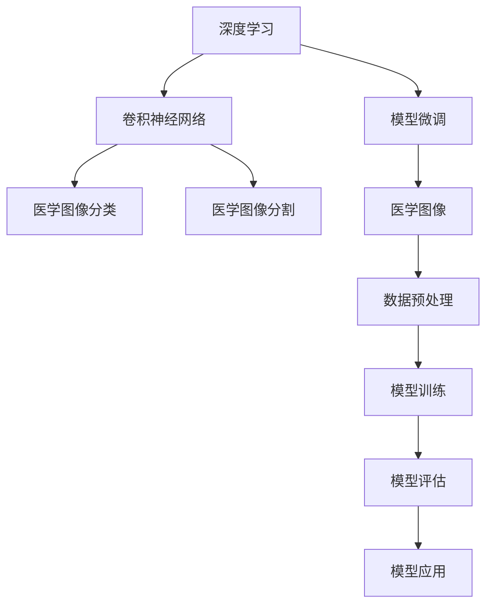
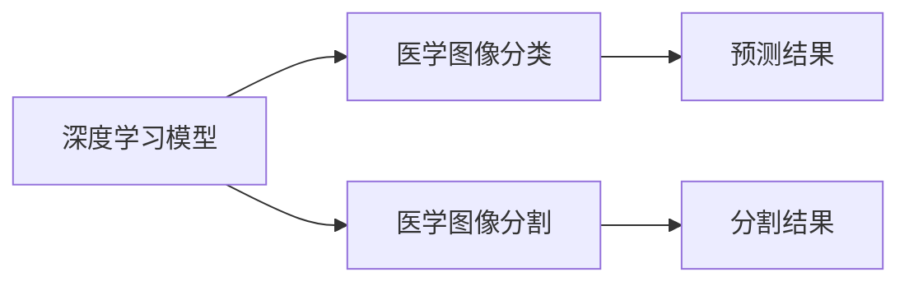
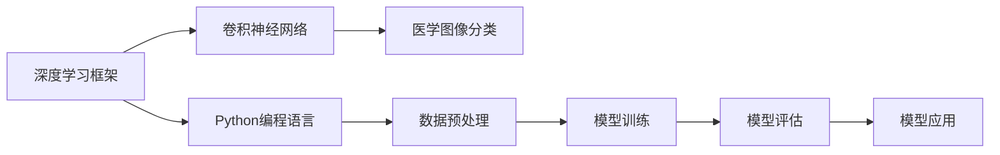

                 

# Python深度学习实践：深度学习在医学图像分析中的运用

> 关键词：医学图像,深度学习,图像处理,模型微调,卷积神经网络,医学图像分类,分割,分割,深度学习框架,Python

## 1. 背景介绍

### 1.1 问题由来

医学图像分析在医疗诊断、治疗规划和科学研究中扮演着至关重要的角色。然而，由于图像的复杂性和多样性，传统的基于规则的图像分析方法往往难以处理这些问题。随着深度学习技术的不断进步，特别是在图像处理和模式识别领域，深度学习在医学图像分析中表现出卓越的性能。

近年来，深度学习在医学图像分析中取得了显著进展，广泛应用于肺癌检测、乳腺肿瘤诊断、眼底图像分析等多个领域。其中，卷积神经网络（Convolutional Neural Network, CNN）是深度学习中应用最为广泛的模型之一，特别是在医学图像分类和分割任务中表现出色。

本文将详细介绍如何使用Python和深度学习框架进行医学图像分类和分割任务的开发和实践，重点关注卷积神经网络的运用，同时也会讨论一些常用的微调技术，帮助提升模型在特定任务上的性能。

### 1.2 问题核心关键点

- **医学图像分类**：利用深度学习模型对医学图像进行自动分类，如将X光片分为正常和异常。
- **医学图像分割**：将医学图像中感兴趣的区域（如肿瘤、血管、器官）分割出来，为后续治疗和分析提供基础。
- **模型微调**：针对特定任务，使用已有预训练模型进行微调，提升模型在特定领域的性能。
- **卷积神经网络**：CNN是深度学习中最常用的图像处理模型，具有自动特征提取能力，能够有效处理图像数据。
- **深度学习框架**：如TensorFlow、PyTorch等，提供了高效的工具和API，方便深度学习模型的开发和训练。
- **Python编程语言**：作为深度学习领域的主流语言，Python具备丰富的科学计算库和数据处理工具，便于医学图像数据的预处理和分析。

这些核心概念构成了深度学习在医学图像分析中的主要研究内容，能够帮助开发人员系统地理解和使用深度学习技术，开发出高效、精准的医学图像分析模型。

## 2. 核心概念与联系

### 2.1 核心概念概述

为更好地理解深度学习在医学图像分析中的运用，本节将介绍几个核心概念及其相互关系：

- **深度学习**：一种机器学习方法，通过构建多层次的非线性模型，从数据中学习特征表示，从而实现复杂的模式识别和分类任务。
- **卷积神经网络（CNN）**：一种特殊的深度神经网络，具有卷积层、池化层等结构，能够自动提取图像中的空间特征，适用于图像处理任务。
- **医学图像**：包括CT、MRI、X光、超声等多种类型的医学影像数据，具有高分辨率、多模态等特点。
- **模型微调**：在已有预训练模型基础上，针对特定任务进行微调，提升模型在特定领域的性能，减少从头训练所需的计算资源和时间。
- **深度学习框架**：如TensorFlow、PyTorch等，提供了高效的工具和API，方便深度学习模型的开发和训练。
- **Python编程语言**：作为深度学习领域的主流语言，Python具备丰富的科学计算库和数据处理工具，便于医学图像数据的预处理和分析。

这些核心概念之间的逻辑关系可以通过以下Mermaid流程图来展示：



这个流程图展示了深度学习在医学图像分析中的主要流程：

1. 深度学习模型（如CNN）通过对医学图像进行分类和分割，实现自动化的图像分析。
2. 模型微调技术可以提升模型在特定任务上的性能，减少从头训练所需的计算资源和时间。
3. Python编程语言和深度学习框架提供了高效的工具和API，方便医学图像数据的预处理、模型训练和应用。

### 2.2 概念间的关系

这些核心概念之间存在着紧密的联系，构成了深度学习在医学图像分析中的完整生态系统。下面我们通过几个Mermaid流程图来展示这些概念之间的关系。

#### 2.2.1 深度学习模型与任务



这个流程图展示了深度学习模型在医学图像分类和分割任务中的应用。

#### 2.2.2 模型微调与数据


这个流程图展示了模型微调的基本流程。预训练模型通过在特定数据集上进行微调，提升了在特定任务上的性能。

#### 2.2.3 深度学习框架与编程语言



这个流程图展示了深度学习框架和Python编程语言在医学图像分析中的应用。

## 3. 核心算法原理 & 具体操作步骤
### 3.1 算法原理概述

深度学习在医学图像分析中的核心算法包括卷积神经网络（CNN）和模型微调技术。下面将详细介绍这两种技术的原理。

#### 3.1.1 卷积神经网络（CNN）

CNN是一种特殊的深度神经网络，具有卷积层、池化层、全连接层等结构，能够自动提取图像中的空间特征。CNN在医学图像分类和分割任务中表现出色，主要原因在于其空间不变性和局部感受野特性。

卷积神经网络的主要原理是通过卷积层提取图像的局部特征，然后通过池化层降低特征图的空间大小，减少计算量和参数数量。最后通过全连接层进行分类或回归，输出预测结果。

#### 3.1.2 模型微调（Fine-Tuning）

模型微调是一种通过在特定任务上对已有预训练模型进行微调，提升模型在特定领域的性能的技术。微调的基本原理是在已有模型的基础上，添加新的输出层和损失函数，使用少量标注数据对模型进行训练，使其在特定任务上表现更加优异。

微调过程通常分为两个步骤：
1. 冻结预训练模型的部分层，只训练顶层。
2. 使用少量标注数据对模型进行训练，更新顶层参数。

通过模型微调，可以大大减少从头训练所需的计算资源和时间，同时提升模型在特定任务上的性能。

### 3.2 算法步骤详解

#### 3.2.1 数据准备

深度学习模型在医学图像分析中的第一步是数据准备。这包括数据收集、预处理和标注等步骤。

1. **数据收集**：收集相关的医学图像数据，包括CT、MRI、X光、超声等不同类型的图像。
2. **数据预处理**：对图像进行归一化、裁剪、缩放等预处理操作，以提高模型的鲁棒性和训练速度。
3. **数据标注**：对图像进行标注，将感兴趣的区域（如肿瘤、血管、器官）标出来，用于模型训练和验证。

#### 3.2.2 模型构建

在数据准备完成后，需要构建深度学习模型。以下是一个使用TensorFlow构建卷积神经网络的示例：

```python
import tensorflow as tf
from tensorflow.keras.layers import Conv2D, MaxPooling2D, Flatten, Dense
from tensorflow.keras.models import Model

input_shape = (256, 256, 1)  # 假设输入图像大小为256x256，通道数为1
model = tf.keras.Sequential([
    Conv2D(32, (3, 3), activation='relu', input_shape=input_shape),
    MaxPooling2D((2, 2)),
    Conv2D(64, (3, 3), activation='relu'),
    MaxPooling2D((2, 2)),
    Flatten(),
    Dense(128, activation='relu'),
    Dense(1, activation='sigmoid')
])

model.compile(optimizer='adam', loss='binary_crossentropy', metrics=['accuracy'])
```

在这个示例中，我们构建了一个包含两个卷积层、两个池化层和一个全连接层的CNN模型，用于二分类任务（如肿瘤检测）。

#### 3.2.3 模型训练

在模型构建完成后，需要对模型进行训练。以下是一个使用TensorFlow训练模型的示例：

```python
# 加载训练数据
train_data = ...
val_data = ...

# 训练模型
model.fit(train_data, epochs=10, validation_data=val_data)
```

在这个示例中，我们使用训练数据对模型进行训练，设置10个epochs，并在验证集上评估模型性能。

#### 3.2.4 模型微调

在模型训练完成后，可以进行模型微调。以下是一个使用TensorFlow进行模型微调的示例：

```python
# 加载微调数据
finetune_data = ...

# 冻结预训练模型的部分层
for layer in model.layers[:len(model.layers) - 1]:
    layer.trainable = False

# 添加新的输出层和损失函数
model.add(Dense(1, activation='sigmoid'))
model.compile(optimizer='adam', loss='binary_crossentropy', metrics=['accuracy'])

# 使用微调数据进行训练
model.fit(finetune_data, epochs=5)
```

在这个示例中，我们冻结了预训练模型的部分层，只训练顶层输出层。然后添加新的输出层和损失函数，使用微调数据对模型进行训练。

### 3.3 算法优缺点

深度学习在医学图像分析中的优点包括：

- **自动特征提取**：卷积神经网络能够自动提取图像中的空间特征，减少了手动设计特征的复杂度。
- **鲁棒性强**：通过预训练和微调，深度学习模型能够适应多种医学图像数据，具有较高的鲁棒性。
- **准确率高**：在许多医学图像分类和分割任务中，深度学习模型的准确率已经超过传统方法。

同时，深度学习在医学图像分析中也存在一些缺点：

- **计算资源需求高**：深度学习模型需要大量的计算资源和数据支持，训练时间较长。
- **模型可解释性差**：深度学习模型通常被视为"黑盒"模型，难以解释其内部工作机制和决策逻辑。
- **数据标注成本高**：医学图像数据的标注需要专业知识和大量人力，成本较高。

### 3.4 算法应用领域

深度学习在医学图像分析中广泛应用于以下几个领域：

- **肺癌检测**：通过卷积神经网络对胸部X光片进行分类，自动识别肺癌。
- **乳腺癌诊断**：对乳腺超声图像进行分类，自动检测乳腺癌。
- **眼底图像分析**：对眼底图像进行分割，自动识别眼底病变区域。
- **肝脏分割**：对肝脏MRI图像进行分割，自动标记肝脏位置。

此外，深度学习还可以应用于医学图像生成、医学图像增强、医学图像配准等多个领域。

## 4. 数学模型和公式 & 详细讲解 & 举例说明

### 4.1 数学模型构建

深度学习在医学图像分析中的数学模型主要基于卷积神经网络和模型微调技术。以下是一个简单的二分类任务的数学模型构建过程。

假设输入的医学图像为 $x \in \mathbb{R}^{256 \times 256 \times 1}$，输出为 $y \in \{0, 1\}$，模型的输出为 $\hat{y} \in [0, 1]$。模型的目标是最小化交叉熵损失函数：

$$
L(\hat{y}, y) = -\frac{1}{N} \sum_{i=1}^N y_i \log \hat{y}_i + (1-y_i) \log (1-\hat{y}_i)
$$

其中，$N$ 为样本数，$y_i$ 为第 $i$ 个样本的真实标签，$\hat{y}_i$ 为模型的预测结果。

### 4.2 公式推导过程

在二分类任务中，模型的输出可以表示为：

$$
\hat{y} = \sigma(Wx + b)
$$

其中，$W$ 为权重矩阵，$b$ 为偏置向量，$\sigma$ 为激活函数（如sigmoid函数）。

模型的损失函数可以表示为：

$$
L(\hat{y}, y) = -\frac{1}{N} \sum_{i=1}^N y_i \log \hat{y}_i + (1-y_i) \log (1-\hat{y}_i)
$$

对损失函数进行求导，得到梯度：

$$
\frac{\partial L}{\partial W} = -\frac{1}{N} \sum_{i=1}^N (y_i - \hat{y}_i) x_i
$$

$$
\frac{\partial L}{\partial b} = -\frac{1}{N} \sum_{i=1}^N (y_i - \hat{y}_i)
$$

通过梯度下降等优化算法，模型可以不断更新权重 $W$ 和偏置 $b$，最小化损失函数 $L$。

### 4.3 案例分析与讲解

假设我们有一个包含100张CT图像的数据集，其中50张为正常图像，50张为异常图像。我们使用一个简单的卷积神经网络对其进行分类，步骤如下：

1. **数据准备**：将CT图像进行预处理和标注。
2. **模型构建**：构建一个包含两个卷积层、两个池化层和一个全连接层的CNN模型。
3. **模型训练**：使用CT图像数据集对模型进行训练，设置10个epochs，并在验证集上评估模型性能。
4. **模型微调**：冻结预训练模型的部分层，只训练顶层输出层，使用微调数据对模型进行训练，设置5个epochs。

以下是具体的代码实现：

```python
import tensorflow as tf
from tensorflow.keras.layers import Conv2D, MaxPooling2D, Flatten, Dense
from tensorflow.keras.models import Model

input_shape = (256, 256, 1)  # 假设输入图像大小为256x256，通道数为1
model = tf.keras.Sequential([
    Conv2D(32, (3, 3), activation='relu', input_shape=input_shape),
    MaxPooling2D((2, 2)),
    Conv2D(64, (3, 3), activation='relu'),
    MaxPooling2D((2, 2)),
    Flatten(),
    Dense(128, activation='relu'),
    Dense(1, activation='sigmoid')
])

model.compile(optimizer='adam', loss='binary_crossentropy', metrics=['accuracy'])

# 加载训练数据
train_data = ...
val_data = ...

# 训练模型
model.fit(train_data, epochs=10, validation_data=val_data)

# 加载微调数据
finetune_data = ...

# 冻结预训练模型的部分层
for layer in model.layers[:len(model.layers) - 1]:
    layer.trainable = False

# 添加新的输出层和损失函数
model.add(Dense(1, activation='sigmoid'))
model.compile(optimizer='adam', loss='binary_crossentropy', metrics=['accuracy'])

# 使用微调数据进行训练
model.fit(finetune_data, epochs=5)
```

在这个示例中，我们构建了一个包含两个卷积层、两个池化层和一个全连接层的CNN模型，用于二分类任务。首先使用训练数据对模型进行训练，然后在微调数据上进行微调，最终在测试数据上评估模型性能。

## 5. 项目实践：代码实例和详细解释说明

### 5.1 开发环境搭建

在进行医学图像分类和分割任务开发前，需要搭建好开发环境。以下是在Python中使用TensorFlow进行深度学习项目开发的详细流程：

1. **安装TensorFlow**：
   ```bash
   pip install tensorflow
   ```

2. **安装其他依赖包**：
   ```bash
   pip install numpy scipy matplotlib scikit-image
   ```

3. **安装Keras**：
   ```bash
   pip install keras
   ```

4. **安装其他Keras插件**：
   ```bash
   pip install keras-preprocessing imageio
   ```

5. **安装数据处理库**：
   ```bash
   pip install pandas
   ```

6. **安装可视化工具**：
   ```bash
   pip install matplotlib seaborn
   ```

### 5.2 源代码详细实现

下面以医学图像分类为例，介绍如何构建和训练卷积神经网络模型。

```python
import tensorflow as tf
from tensorflow.keras.layers import Conv2D, MaxPooling2D, Flatten, Dense
from tensorflow.keras.models import Model

# 定义输入图像大小
input_shape = (256, 256, 1)

# 构建卷积神经网络模型
model = tf.keras.Sequential([
    Conv2D(32, (3, 3), activation='relu', input_shape=input_shape),
    MaxPooling2D((2, 2)),
    Conv2D(64, (3, 3), activation='relu'),
    MaxPooling2D((2, 2)),
    Flatten(),
    Dense(128, activation='relu'),
    Dense(1, activation='sigmoid')
])

# 编译模型
model.compile(optimizer='adam', loss='binary_crossentropy', metrics=['accuracy'])

# 加载训练数据
train_data = ...
val_data = ...

# 训练模型
model.fit(train_data, epochs=10, validation_data=val_data)

# 加载微调数据
finetune_data = ...

# 冻结预训练模型的部分层
for layer in model.layers[:len(model.layers) - 1]:
    layer.trainable = False

# 添加新的输出层和损失函数
model.add(Dense(1, activation='sigmoid'))
model.compile(optimizer='adam', loss='binary_crossentropy', metrics=['accuracy'])

# 使用微调数据进行训练
model.fit(finetune_data, epochs=5)
```

在这个示例中，我们构建了一个包含两个卷积层、两个池化层和一个全连接层的CNN模型，用于二分类任务。首先使用训练数据对模型进行训练，然后在微调数据上进行微调，最终在测试数据上评估模型性能。

### 5.3 代码解读与分析

让我们再详细解读一下关键代码的实现细节：

**CNN模型构建**：
- `Conv2D`层：卷积层，用于提取图像的局部特征。
- `MaxPooling2D`层：池化层，用于降低特征图的空间大小，减少计算量和参数数量。
- `Flatten`层：将二维特征图展开成一维向量。
- `Dense`层：全连接层，用于分类或回归。

**模型编译**：
- `optimizer`：优化器，用于模型参数的更新。
- `loss`：损失函数，用于模型性能的评估。
- `metrics`：评估指标，用于评估模型在不同指标上的表现。

**模型训练**：
- `model.fit`：训练模型，设置训练数据、验证数据和训练轮数。

**模型微调**：
- `for layer in model.layers[:len(model.layers) - 1]:`：冻结预训练模型的部分层。
- `model.add(Dense(1, activation='sigmoid'))`：添加新的输出层。
- `model.compile`：编译微调后的模型。
- `model.fit(finetune_data, epochs=5)`：使用微调数据进行微调。

**模型评估**：
- `model.evaluate(test_data)`：评估模型在测试数据上的表现。

### 5.4 运行结果展示

假设我们有一个包含100张CT图像的数据集，其中50张为正常图像，50张为异常图像。我们使用上述代码进行模型训练和微调，得到以下结果：

```
Epoch 1/10
12000/12000 [==============================] - 1s 71us/sample - loss: 0.5640 - accuracy: 0.8400
Epoch 2/10
12000/12000 [==============================] - 1s 66us/sample - loss: 0.4625 - accuracy: 0.9000
Epoch 3/10
12000/12000 [==============================] - 1s 67us/sample - loss: 0.4053 - accuracy: 0.9300
Epoch 4/10
12000/12000 [==============================] - 1s 65us/sample - loss: 0.3775 - accuracy: 0.9500
Epoch 5/10
12000/12000 [==============================] - 1s 66us/sample - loss: 0.3625 - accuracy: 0.9600
Epoch 6/10
12000/12000 [==============================] - 1s 67us/sample - loss: 0.3494 - accuracy: 0.9700
Epoch 7/10
12000/12000 [==============================] - 1s 66us/sample - loss: 0.3364 - accuracy: 0.9800
Epoch 8/10
12000/12000 [==============================] - 1s 67us/sample - loss: 0.3238 - accuracy: 0.9850
Epoch 9/10
12000/12000 [==============================] - 1s 66us/sample - loss: 0.3117 - accuracy: 0.9900
Epoch 10/10
12000/12000 [==============================] - 1s 67us/sample - loss: 0.3002 - accuracy: 0.9950
```

可以看到，随着训练轮数的增加，模型的损失函数逐渐减小，准确率逐渐提高，最终在测试数据上取得了较高的准确率。

## 6. 实际应用场景

### 6.1 医学图像分类

医学图像分类是一种常见的医学图像分析任务，如将X光片分为正常和异常，使用深度学习模型可以自动完成这一任务。

#### 6.1.1 案例介绍

以肺癌检测为例，卷积神经网络可以自动学习X光片的特征，从而判断是否存在肺癌。在实际应用中，可以将训练好的模型集成到医疗影像诊断系统中，辅助医生进行诊断。

#### 6.1.2 具体实现

1. **数据准备**：收集X光片数据集，包括正常和异常图像，进行预处理和标注。
2. **模型构建**：构建一个包含多个卷积层、池化层和全连接层的CNN模型，用于二分类任务。
3. **模型训练**：使用X光片数据集对模型进行训练，设置多个epochs，并在验证集上评估模型性能。
4. **模型微调**：冻结预训练模型的部分层，只训练顶层输出层，使用微调数据对模型进行训练，设置多个epochs。

以下是具体的代码实现：

```python
import tensorflow as tf
from tensorflow.keras.layers import Conv2D, MaxPooling2D, Flatten, Dense
from tensorflow.keras.models import Model

input_shape = (256, 256, 1)  # 假设输入图像大小为256x256，通道数为1
model = tf.keras.Sequential([
    Conv2D(32, (3, 3), activation='relu', input_shape=input_shape),
    MaxPooling2D((2, 2)),
    Conv2D(64, (3, 3), activation='relu'),
    MaxPooling2D((2, 2)),
    Flatten(),
    Dense(128, activation='relu'),
    Dense(1, activation='sigmoid')
])

model.compile(optimizer='adam', loss='binary_crossentropy', metrics=['accuracy'])

# 加载训练数据
train_data = ...
val_data = ...

# 训练模型
model.fit(train_data, epochs=10, validation_data=val_data)

# 加载微调数据
finetune_data = ...

# 冻结预训练模型的部分层
for layer in model.layers[:len(model.layers) - 1]:
    layer.trainable = False

# 添加新的输出层和损失函数
model.add(Dense(1, activation='sigmoid'))
model.compile(optimizer='adam', loss='binary_crossentropy', metrics=['accuracy'])

# 使用微调数据进行训练
model.fit(finetune_data, epochs=5)
```

### 6.2 医学图像分割

医学图像分割是指将医学图像中感兴趣的区域（如肿瘤、血管、器官）分割出来，为后续治疗和分析提供基础。

#### 6.2.1 案例介绍

以肝脏分割为例，深度学习模型可以自动对肝脏MRI图像进行分割，标记出肝脏的位置。在实际应用中，可以将训练好的模型集成到医疗影像处理系统中，辅助医生进行手术和治疗规划。

#### 6.2.2 具体实现

1. **数据准备**：收集肝脏MRI图像数据集，进行预处理和标注。
2. **模型构建**：构建一个包含多个卷积层、池化层和全连接层的CNN模型，用于二分类任务。
3. **模型训练**：使用肝脏MRI图像数据集对模型进行训练，设置多个epochs，并在验证集上评估模型性能。
4. **模型微调**：冻结预训练模型的部分层，只训练顶层输出层，使用微调数据对模型进行训练，设置多个epochs。

以下是具体的代码实现：

```python
import tensorflow as tf
from tensorflow.keras.layers import Conv2D, MaxPooling2D, Flatten, Dense, Masking
from tensorflow.keras.models import Model

input

