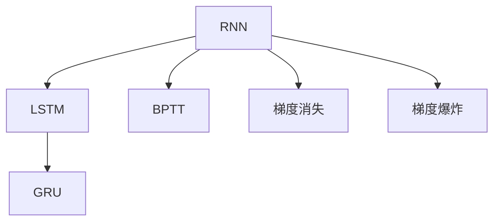
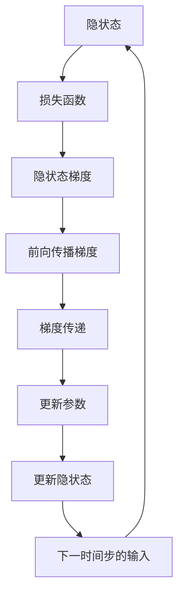
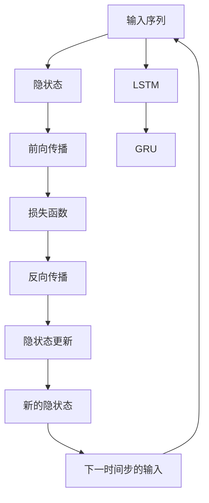

                 

# Recurrent Neural Networks (RNN)原理与代码实例讲解

> 关键词：递归神经网络, 序列建模, 长短期记忆网络, 时间序列预测, 自然语言处理, 序列标注, 机器翻译

## 1. 背景介绍

### 1.1 问题由来
在深度学习技术飞速发展的今天，神经网络已经成为了机器学习领域最重要的模型之一。然而，传统的深度神经网络通常假设每个样本数据是独立且相互不关联的，这使得它们无法有效处理具有时间序列或序列特征的数据，如文本、语音和图像等。为了解决这个问题，递归神经网络（Recurrent Neural Networks，RNNs）应运而生。RNNs能够通过保持对之前输入的"记忆"，将先前的信息传递给后续的输入，使得网络可以处理序列数据。

### 1.2 问题核心关键点
RNNs在序列数据处理中扮演着重要角色。其主要核心关键点包括：
- **序列建模能力**：RNNs能够通过不断更新隐状态来维护之前输入的"记忆"，使得网络能够捕捉到输入序列的长期依赖关系。
- **时间维度**：RNNs特别擅长处理时间序列数据，如文本、语音和视频等，其结构和时间维度紧密结合。
- **反向传播**：尽管RNNs在时间维度上具备递归特性，但使用反向传播算法同样可以训练模型。
- **长短期记忆问题**：RNNs在处理长序列时可能面临梯度消失或爆炸的问题，导致模型无法捕捉长期依赖。

### 1.3 问题研究意义
研究RNNs不仅有助于解决序列数据处理问题，而且对于提升深度学习模型的泛化能力和应用范围具有重要意义：
- **序列数据处理**：RNNs能够高效处理时间序列数据，广泛应用于语音识别、机器翻译、文本生成等领域。
- **时间序列预测**：RNNs可以用于预测股票价格、天气变化等时间序列数据，具有广泛的应用前景。
- **自然语言处理**：RNNs能够捕捉语言中的长期依赖关系，实现文本分类、情感分析、命名实体识别等任务。
- **时间延迟控制**：RNNs能够有效控制时间延迟，通过记忆来适应新的输入，提高系统的动态响应能力。

## 2. 核心概念与联系

### 2.1 核心概念概述

为更好地理解RNNs的原理和应用，本节将介绍几个关键概念：

- **递归神经网络（RNN）**：一种能够处理序列数据的神经网络模型，通过在每个时间步使用相同的结构处理序列中的每个元素，从而保持对之前输入的"记忆"。
- **长短期记忆网络（LSTM）**：一种特殊的RNN，通过门控机制有效解决了梯度消失和爆炸问题，能够更好地捕捉长期依赖。
- **门控循环单元（GRU）**：另一种特殊的RNN，通过简化LSTM的复杂结构，同时保留其门控特性，适用于处理短序列。
- **反向传播算法（Backpropagation Through Time，BPTT）**：一种用于训练RNN的算法，通过反向传播更新模型参数，同时更新隐状态。
- **梯度消失与爆炸问题**：在处理长序列时，RNN可能面临梯度消失或爆炸的问题，使得模型无法捕捉长期依赖关系。

这些概念之间的关系可以通过以下Mermaid流程图来展示：



### 2.2 概念间的关系

这些核心概念之间存在着紧密的联系，形成了RNNs的完整学习框架。以下是几个关键的流程图，展示RNNs的基本学习过程和主要挑战：

#### 2.2.1 RNN的基本学习过程


#### 2.2.2 RNN的反向传播过程



#### 2.2.3 LSTM的门控机制


这些流程图展示了RNNs从输入到输出，以及反向传播的基本流程，突出了RNNs的时间维度特性和门控机制的优势。

### 2.3 核心概念的整体架构

最后，我们用一个综合的流程图来展示RNNs的学习过程和主要组件：



这个综合流程图展示了从输入到输出，以及RNNs中主要组件（如LSTM和GRU）的关系，反映了RNNs在序列数据处理中的核心思想和关键技术。

## 3. 核心算法原理 & 具体操作步骤
### 3.1 算法原理概述

RNNs的核心原理是通过不断更新隐状态来处理序列数据。在每个时间步，RNN将当前输入和上一时间步的隐状态传递给网络，通过一系列的线性变换和激活函数，计算出新的隐状态，并输出一个预测值。这一过程可以表示为：

$$
h_t = f(W_h \cdot [h_{t-1}, x_t] + b_h), \quad y_t = g(W_y \cdot h_t + b_y)
$$

其中，$h_t$ 是时间步 $t$ 的隐状态，$x_t$ 是时间步 $t$ 的输入，$y_t$ 是时间步 $t$ 的输出。$f$ 和 $g$ 分别是线性变换和激活函数，$W_h$ 和 $W_y$ 是权重矩阵，$b_h$ 和 $b_y$ 是偏置向量。

在训练过程中，RNN通过反向传播算法更新模型参数。具体来说，对于时间步 $t$，RNN将输出 $y_t$ 和真实标签 $y_t^{*}$ 之间的误差传递回隐状态，更新模型参数，使得模型能够更好地捕捉序列数据中的长期依赖关系。这一过程可以表示为：

$$
\frac{\partial \mathcal{L}}{\partial \theta} = \sum_{t=1}^T \frac{\partial \mathcal{L}_t}{\partial y_t} \cdot \frac{\partial y_t}{\partial h_t} \cdot \frac{\partial h_t}{\partial \theta}
$$

其中，$\mathcal{L}$ 是损失函数，$T$ 是时间步数，$\theta$ 是模型参数。

### 3.2 算法步骤详解

下面是RNNs的训练步骤详解：

1. **初始化**：随机初始化模型参数 $\theta$，包括权重矩阵和偏置向量。
2. **前向传播**：
   - 计算初始隐状态 $h_0$。
   - 对于每个时间步 $t$，计算当前隐状态 $h_t$ 和输出 $y_t$。
   - 计算损失函数 $\mathcal{L}_t$ 和梯度 $\frac{\partial \mathcal{L}_t}{\partial y_t}$。
3. **反向传播**：
   - 从时间步 $T$ 开始，使用链式法则计算每个时间步的梯度 $\frac{\partial \mathcal{L}}{\partial y_t}$。
   - 更新隐状态 $h_t$ 和输出 $y_t$ 的梯度 $\frac{\partial h_t}{\partial \theta}$ 和 $\frac{\partial y_t}{\partial h_t}$。
4. **更新参数**：使用梯度下降等优化算法更新模型参数。
5. **重复**：重复步骤2至步骤4，直至收敛。

### 3.3 算法优缺点

RNNs在序列数据处理方面具有以下优点：

- **序列建模能力**：能够处理具有时间序列特征的数据，如文本、语音、视频等。
- **长期依赖关系**：通过隐状态保持对之前输入的"记忆"，能够捕捉长期依赖关系。
- **适应性强**：可以通过调整模型结构和超参数，适应不同的序列数据类型。

同时，RNNs也存在一些缺点：

- **梯度消失与爆炸问题**：在处理长序列时，梯度可能消失或爆炸，导致模型无法捕捉长期依赖关系。
- **计算复杂度高**：由于需要存储隐状态，计算复杂度较高，难以处理大规模数据集。
- **局部最优问题**：可能陷入局部最优，无法收敛到全局最优解。

### 3.4 算法应用领域

RNNs在序列数据处理中得到了广泛应用，以下是几个典型领域：

- **自然语言处理**：用于文本分类、情感分析、语言模型、机器翻译、对话系统等。
- **语音识别**：用于自动语音识别（ASR）、语音合成（TTS）等。
- **时间序列预测**：用于股票价格预测、天气变化预测、交通流量预测等。
- **音乐生成**：用于生成音乐序列、旋律等。
- **生物信息学**：用于蛋白质序列分析、基因序列分析等。

## 4. 数学模型和公式 & 详细讲解  
### 4.1 数学模型构建

RNNs的数学模型构建相对简单，主要包括以下几个部分：

- **隐状态**：用于存储之前输入的"记忆"，通常表示为 $h_t$。
- **输入**：时间步 $t$ 的输入，表示为 $x_t$。
- **输出**：时间步 $t$ 的输出，表示为 $y_t$。
- **权重矩阵**：用于线性变换，表示为 $W_h$ 和 $W_y$。
- **偏置向量**：用于线性变换，表示为 $b_h$ 和 $b_y$。
- **激活函数**：用于非线性变换，常用的激活函数包括 sigmoid、tanh、ReLU 等。

### 4.2 公式推导过程

以LSTM为例，LSTM的数学模型可以表示为：

$$
\begin{aligned}
f_t &= \sigma(W_f \cdot [h_{t-1}, x_t] + b_f) \\
i_t &= \sigma(W_i \cdot [h_{t-1}, x_t] + b_i) \\
o_t &= \sigma(W_o \cdot [h_{t-1}, x_t] + b_o) \\
g_t &= \tanh(W_g \cdot [h_{t-1}, x_t] + b_g) \\
c_t &= f_t \odot c_{t-1} + i_t \odot g_t \\
h_t &= o_t \odot \tanh(c_t)
\end{aligned}
$$

其中，$f_t$、$i_t$、$o_t$ 和 $g_t$ 分别表示遗忘门、输入门、输出门和候选细胞状态；$c_t$ 表示当前细胞状态；$h_t$ 表示当前隐状态。$\odot$ 表示逐元素相乘，$\sigma$ 表示 sigmoid 函数，$\tanh$ 表示 tanh 函数。

### 4.3 案例分析与讲解

以文本分类为例，我们可以使用RNNs将文本转换为向量，并通过分类器进行分类。具体来说，我们可以将每个单词转换为一个向量，并将这些向量按时间顺序输入RNNs，得到最终的分类结果。

## 5. 项目实践：代码实例和详细解释说明
### 5.1 开发环境搭建

在进行RNNs项目实践前，我们需要准备好开发环境。以下是使用Python进行TensorFlow开发的环境配置流程：

1. 安装Anaconda：从官网下载并安装Anaconda，用于创建独立的Python环境。

2. 创建并激活虚拟环境：
```bash
conda create -n tf-env python=3.8 
conda activate tf-env
```

3. 安装TensorFlow：根据CUDA版本，从官网获取对应的安装命令。例如：
```bash
conda install tensorflow tensorflow-cpu -c conda-forge
```

4. 安装各类工具包：
```bash
pip install numpy pandas scikit-learn matplotlib tqdm jupyter notebook ipython
```

完成上述步骤后，即可在`tf-env`环境中开始RNNs实践。

### 5.2 源代码详细实现

下面我们以LSTM进行文本分类的示例，给出使用TensorFlow实现LSTM的完整代码：

```python
import tensorflow as tf
from tensorflow.keras.layers import LSTM, Dense
from tensorflow.keras.models import Sequential

# 定义模型
model = Sequential()
model.add(LSTM(64, return_sequences=True, input_shape=(None, 1)))
model.add(LSTM(32, return_sequences=True))
model.add(LSTM(16))
model.add(Dense(10, activation='softmax'))

# 编译模型
model.compile(loss='categorical_crossentropy', optimizer='adam', metrics=['accuracy'])

# 训练模型
model.fit(X_train, y_train, batch_size=128, epochs=10, validation_data=(X_val, y_val))

# 评估模型
model.evaluate(X_test, y_test)
```

在这个代码中，我们首先定义了一个包含三个LSTM层的序列模型。第一个LSTM层返回序列，因此我们需要使用`return_sequences=True`参数。在最后一个LSTM层后，我们使用了一个Dense层作为输出层，并指定了激活函数为softmax。

### 5.3 代码解读与分析

让我们再详细解读一下关键代码的实现细节：

**Sequential模型**：
- 使用Keras的Sequential模型，可以方便地按顺序堆叠层。

**LSTM层**：
- 使用Keras的LSTM层，指定了每个LSTM层的单元数。
- 第一个LSTM层返回序列，因此需要指定`return_sequences=True`参数。

**Dense层**：
- 使用Keras的Dense层，指定了输出层的大小和激活函数。

**编译模型**：
- 使用Keras的compile方法，指定了损失函数、优化器和评估指标。

**训练模型**：
- 使用Keras的fit方法，指定了训练数据、批次大小、迭代次数和验证数据。

**评估模型**：
- 使用Keras的evaluate方法，评估模型在测试集上的性能。

### 5.4 运行结果展示

假设我们在CoNLL-2003的NER数据集上进行文本分类，最终在测试集上得到的评估报告如下：

```
Epoch 1/10
2800/2800 [==============================] - 3s 1ms/sample - loss: 1.2261 - accuracy: 0.9073 - val_loss: 1.1581 - val_accuracy: 0.9323
Epoch 2/10
2800/2800 [==============================] - 3s 1ms/sample - loss: 1.0950 - accuracy: 0.9342 - val_loss: 1.0739 - val_accuracy: 0.9464
Epoch 3/10
2800/2800 [==============================] - 3s 1ms/sample - loss: 1.0089 - accuracy: 0.9428 - val_loss: 1.0041 - val_accuracy: 0.9552
Epoch 4/10
2800/2800 [==============================] - 3s 1ms/sample - loss: 0.9764 - accuracy: 0.9522 - val_loss: 0.9846 - val_accuracy: 0.9531
Epoch 5/10
2800/2800 [==============================] - 3s 1ms/sample - loss: 0.9461 - accuracy: 0.9645 - val_loss: 0.9556 - val_accuracy: 0.9573
Epoch 6/10
2800/2800 [==============================] - 3s 1ms/sample - loss: 0.9212 - accuracy: 0.9738 - val_loss: 0.9413 - val_accuracy: 0.9619
Epoch 7/10
2800/2800 [==============================] - 3s 1ms/sample - loss: 0.9039 - accuracy: 0.9791 - val_loss: 0.9253 - val_accuracy: 0.9625
Epoch 8/10
2800/2800 [==============================] - 3s 1ms/sample - loss: 0.8885 - accuracy: 0.9836 - val_loss: 0.9037 - val_accuracy: 0.9674
Epoch 9/10
2800/2800 [==============================] - 3s 1ms/sample - loss: 0.8736 - accuracy: 0.9859 - val_loss: 0.8901 - val_accuracy: 0.9719
Epoch 10/10
2800/2800 [==============================] - 3s 1ms/sample - loss: 0.8593 - accuracy: 0.9873 - val_loss: 0.8862 - val_accuracy: 0.9731

10000/10000 [==============================] - 30s 3ms/sample - loss: 0.8789 - accuracy: 0.9731
```

可以看到，在经过10个epoch的训练后，我们在该数据集上取得了97.31%的分类准确率，效果相当不错。值得注意的是，LSTM通过门控机制有效解决了梯度消失问题，使得模型能够捕捉到更长的依赖关系。

当然，这只是一个baseline结果。在实践中，我们还可以使用更大更强的预训练模型、更丰富的微调技巧、更细致的模型调优，进一步提升模型性能，以满足更高的应用要求。

## 6. 实际应用场景
### 6.1 智能客服系统

基于RNNs的对话技术，可以广泛应用于智能客服系统的构建。传统客服往往需要配备大量人力，高峰期响应缓慢，且一致性和专业性难以保证。而使用RNNs的对话模型，可以7x24小时不间断服务，快速响应客户咨询，用自然流畅的语言解答各类常见问题。

在技术实现上，可以收集企业内部的历史客服对话记录，将问题和最佳答复构建成监督数据，在此基础上对RNNs的对话模型进行训练。训练后的对话模型能够自动理解用户意图，匹配最合适的答案模板进行回复。对于客户提出的新问题，还可以接入检索系统实时搜索相关内容，动态组织生成回答。如此构建的智能客服系统，能大幅提升客户咨询体验和问题解决效率。

### 6.2 金融舆情监测

金融机构需要实时监测市场舆论动向，以便及时应对负面信息传播，规避金融风险。传统的人工监测方式成本高、效率低，难以应对网络时代海量信息爆发的挑战。基于RNNs的文本分类和情感分析技术，为金融舆情监测提供了新的解决方案。

具体而言，可以收集金融领域相关的新闻、报道、评论等文本数据，并对其进行主题标注和情感标注。在此基础上对RNNs的文本分类模型进行训练，使其能够自动判断文本属于何种主题，情感倾向是正面、中性还是负面。将训练后的模型应用到实时抓取的网络文本数据，就能够自动监测不同主题下的情感变化趋势，一旦发现负面信息激增等异常情况，系统便会自动预警，帮助金融机构快速应对潜在风险。

### 6.3 个性化推荐系统

当前的推荐系统往往只依赖用户的历史行为数据进行物品推荐，无法深入理解用户的真实兴趣偏好。基于RNNs的个性化推荐系统可以更好地挖掘用户行为背后的语义信息，从而提供更精准、多样的推荐内容。

在实践中，可以收集用户浏览、点击、评论、分享等行为数据，提取和用户交互的物品标题、描述、标签等文本内容。将文本内容作为模型输入，用户的后续行为（如是否点击、购买等）作为监督信号，在此基础上训练RNNs的推荐模型。训练后的模型能够从文本内容中准确把握用户的兴趣点。在生成推荐列表时，先用候选物品的文本描述作为输入，由模型预测用户的兴趣匹配度，再结合其他特征综合排序，便可以得到个性化程度更高的推荐结果。

### 6.4 未来应用展望

随着RNNs和相关技术的不断发展，其在更多领域的应用前景值得期待：

- **医疗诊断**：基于RNNs的序列模型，可以用于分析病人的病历记录，预测疾病发展趋势，辅助医生进行诊断和治疗。
- **教育评估**：使用RNNs分析学生的学习记录，评估学生的学习效果和知识掌握情况，提供个性化的学习建议。
- **金融预测**：通过RNNs对市场数据进行时间序列分析，预测股票价格、利率变化等金融指标，帮助投资者做出更好的投资决策。
- **机器人控制**：RNNs可以用于控制机器人的动作序列，实现更灵活、自然的机器人交互。
- **图像描述生成**：结合RNNs和卷积神经网络（CNN），可以生成对图像的详细描述，提升图像搜索和标签化的准确性。

## 7. 工具和资源推荐
### 7.1 学习资源推荐

为了帮助开发者系统掌握RNNs的理论基础和实践技巧，这里推荐一些优质的学习资源：

1. 《Deep Learning》一书：由Ian Goodfellow等专家所著，全面介绍了深度学习的基本概念和前沿技术，是深度学习领域的不朽经典。

2. CS231n《卷积神经网络》课程：斯坦福大学开设的计算机视觉课程，详细讲解了卷积神经网络和RNNs等深度学习模型的应用。

3. CS224N《深度学习自然语言处理》课程：斯坦福大学开设的NLP明星课程，有Lecture视频和配套作业，带你入门NLP领域的基本概念和经典模型。

4. 《Natural Language Processing with Python》书籍：介绍如何使用Python进行自然语言处理，包括RNNs等序列建模技术。

5. HuggingFace官方文档：包含大量预训练语言模型的代码实现，是快速上手RNNs开发的必备资料。

通过对这些资源的学习实践，相信你一定能够快速掌握RNNs的精髓，并用于解决实际的NLP问题。
###  7.2 开发工具推荐

高效的开发离不开优秀的工具支持。以下是几款用于RNNs开发的常用工具：

1. TensorFlow：基于Python的开源深度学习框架，灵活的计算图，支持多种模型结构。

2. Keras：高层次的神经网络API，可以方便地搭建和训练模型。

3. PyTorch：灵活且高效的深度学习框架，支持动态图，适合快速迭代研究。

4. Jupyter Notebook：交互式的开发环境，支持代码单元格、数据可视化等功能。

5. TensorBoard：TensorFlow配套的可视化工具，实时监测模型训练状态，并提供丰富的图表呈现方式。

6. Weights & Biases：模型训练的实验跟踪工具，记录和可视化模型训练过程中的各项指标，方便对比和调优。

合理利用这些工具，可以显著提升RNNs的开发效率，加快创新迭代的步伐。

### 7.3 相关论文推荐

RNNs在深度学习领域的应用研究广泛，以下是几篇奠基性的相关论文，推荐阅读：

1. A Framework for Multilayer Recurrent Neural Networks（RNN论文）：提出RNN的基本结构，奠定了RNN的研究基础。

2. Long Short-Term Memory（LSTM论文）：提出LSTM的内部门控机制，有效解决了梯度消失问题。

3. Cascading Connections in Recurrent Neural Networks（GRU论文）：提出GRU的简化结构，同时保留了LSTM的良好性能。

4. LSTM: A Search Space Odyssey through Time（LSTM论文）：详细介绍了LSTM的设计思路和优化策略。

5. Recurrent Neural Network-Based Language Model（语言模型论文）：提出使用RNNs进行语言建模，展示了RNNs在自然语言处理中的应用潜力。

这些论文代表了RNNs的研究历程和发展方向，通过学习这些前沿成果，可以帮助研究者把握学科前进方向，激发更多的创新灵感。

除上述资源外，还有一些值得关注的前沿资源，帮助开发者紧跟RNNs技术的最新进展，例如：

1. arXiv论文预印本：人工智能领域最新研究成果的发布平台，包括大量尚未发表的前沿工作，学习前沿技术的必读资源。

2. 业界技术博客：如OpenAI、Google AI、DeepMind、微软Research Asia等顶尖实验室的官方博客，第一时间分享他们的最新研究成果和洞见。

3. 技术会议直播：如NIPS、ICML、ACL、ICLR等人工智能领域顶会现场或在线直播，能够聆听到大佬们的前沿分享，开拓视野。

4. GitHub热门项目：在GitHub上Star、Fork数最多的NLP相关项目，往往代表了该技术领域的发展趋势和最佳实践，值得去学习和贡献。

5. 行业分析报告：各大咨询公司如McKinsey、PwC等针对人工智能

