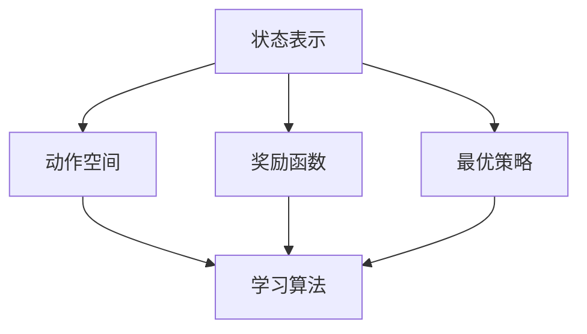
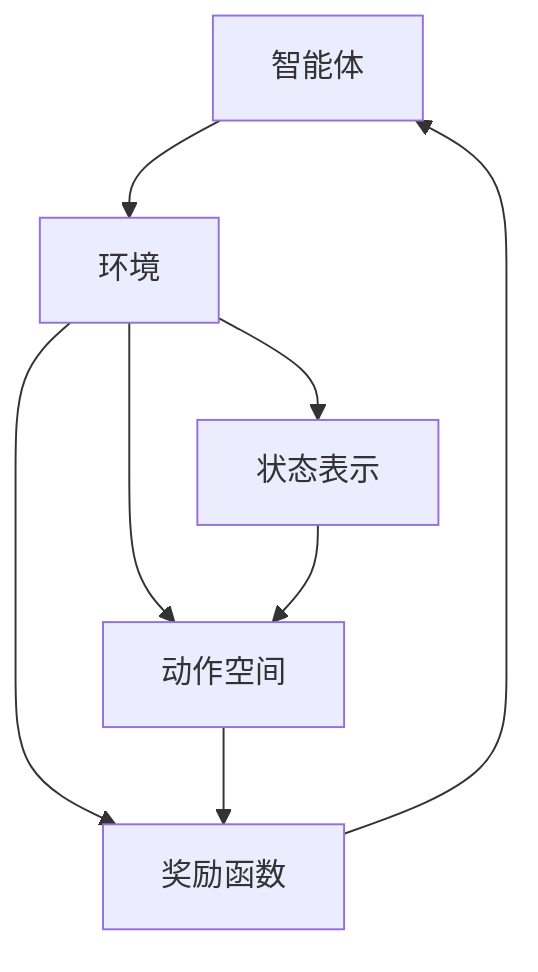

                 

## 1. 背景介绍

### 1.1 问题由来

强化学习（Reinforcement Learning, RL）作为机器学习（Machine Learning, ML）的一个重要分支，在近年来取得了显著的进展，并在游戏、机器人、自动驾驶等领域展现出了强大的应用潜力。RL的核心理念是通过与环境的交互，使得智能体学习到最优的行为策略。然而，RL的理论与技术复杂度高，且实际应用中的问题也颇为棘手，这使得RL在具体实践中面临诸多挑战。

在理论上，如何设计有效的学习策略，使得智能体能够在有限时间内收敛到最优策略是一个亟待解决的问题。而在实践中，如何处理样本效率低、鲁棒性差、泛化能力弱等问题，也是RL应用中的难点。

因此，本文旨在从理论和实践两个方面，深入探讨RL的原理与关键技术，并通过一系列代码实例，帮助读者更直观地理解和掌握RL的应用方法。

### 1.2 问题核心关键点

RL的核心问题是如何构建智能体（Agent）以实现最优策略的求解。在这个过程中，智能体与环境（Environment）进行交互，在每一个时间步上，智能体根据当前状态（State）选择动作（Action），环境则提供奖励（Reward），并返回下一个状态。智能体的目标是最大化累积的奖励，即求解最优策略 $\pi^*$。

具体来说，RL的核心问题可以概括为：
1. 如何设计状态表示方法，使得状态能够充分刻画环境信息。
2. 如何定义动作空间，使得智能体有足够的操作能力。
3. 如何设计奖励函数，使得智能体能够明确目标并避免错误行为。
4. 如何设计学习算法，使得智能体能够在有限时间内收敛到最优策略。
5. 如何处理探索与利用的平衡，使得智能体能够在新环境和长期任务中表现优异。

### 1.3 问题研究意义

RL的研究和应用不仅有助于解决计算机科学中的核心问题，也对人类认知、行为学等领域具有重要的借鉴意义。RL的原理和算法可以在机器人控制、自动驾驶、金融决策、游戏策略等场景中发挥重要作用，为智能系统的设计和实现提供重要参考。此外，RL的应用也具有广泛的社会和经济效益，能够提升生产效率，推动科学进步，增强人类福祉。

## 2. 核心概念与联系

### 2.1 核心概念概述

RL的核心概念主要包括：

- 状态表示（State Representation）：用于描述环境当前状态的向量或序列，是智能体决策的基础。
- 动作空间（Action Space）：智能体可以选择的动作集合，可以是离散或连续的。
- 奖励函数（Reward Function）：智能体执行动作后，环境给予的即时反馈，用于评估动作的好坏。
- 最优策略（Optimal Policy）：智能体在给定状态下选择动作的规则，使得累积奖励最大化。
- 学习算法（Learning Algorithm）：通过与环境的交互，智能体不断调整策略，以逼近最优策略的过程。

这些概念构成了RL的理论框架，并在实际应用中扮演着重要角色。

### 2.2 概念间的关系

这些核心概念之间的关系可以通过以下Mermaid流程图来展示：



这个流程图展示了大语言模型微调过程中各个核心概念之间的联系。智能体通过状态表示，在动作空间中选择动作，并在奖励函数的作用下，不断调整最优策略，最后通过学习算法实现这一过程。

### 2.3 核心概念的整体架构

最后，我们用一个综合的流程图来展示这些核心概念在大语言模型微调过程中的整体架构：



这个综合流程图展示了大语言模型微调过程中各个核心概念之间的联系，以及智能体与环境之间的交互过程。通过这些核心概念，我们可以更清晰地理解大语言模型微调的理论基础和实践方法。

## 3. 核心算法原理 & 具体操作步骤

### 3.1 算法原理概述

RL的算法设计旨在通过与环境的交互，使得智能体学习到最优策略。常见的RL算法包括Q-Learning、SARSA、Deep Q-Network（DQN）等。这些算法的核心思想是通过模型或策略学习，预测智能体在不同状态下采取动作的概率分布或价值函数，进而优化策略选择。

具体而言，Q-Learning算法通过估计动作-状态值函数（Q-Value），来衡量在特定状态下采取特定动作的价值。Q-Value函数的更新公式为：

$$
Q(s,a) \leftarrow Q(s,a) + \alpha [r + \gamma \max_{a'} Q(s',a')] - Q(s,a)
$$

其中，$\alpha$ 为学习率，$r$ 为即时奖励，$s'$ 为下一个状态，$a'$ 为下一个状态对应的最优动作，$\gamma$ 为折扣因子，控制未来奖励的权重。

### 3.2 算法步骤详解

下面以DQN算法为例，详细讲解其具体步骤：

1. **初始化**：设置智能体与环境交互的参数，如状态表示方法、动作空间、奖励函数、学习率、折扣因子等。
2. **探索-利用平衡**：在训练初期，智能体以随机策略探索环境，获取状态-动作-奖励的样本。随着训练进行，智能体逐渐以策略利用已有知识。
3. **深度网络结构**：构建深度神经网络，用于估计Q-Value函数，网络的结构和参数需要通过训练进行调整。
4. **经验回放**：将智能体与环境交互过程中收集的经验数据（状态、动作、奖励、下一状态）存储到经验池（Experience Replay）中，以增强样本的多样性和代表性。
5. **网络更新**：从经验池中随机抽取样本进行训练，将网络的输出与实际值进行对比，使用均方误差（Mean Squared Error, MSE）或交叉熵（Cross-Entropy）损失函数更新网络参数。
6. **网络交替训练**：将网络分为两个版本（主网络、目标网络），交替进行训练，以避免过度拟合。
7. **模型评估**：在验证集或测试集上评估模型的性能，调整参数，优化模型。
8. **应用与部署**：将训练好的模型应用于实际问题，进行在线预测或优化决策。

### 3.3 算法优缺点

DQN算法作为RL的经典算法，具有以下优点：

1. **高效样本利用**：通过经验回放，算法能够充分利用样本数据，提高样本效率。
2. **模型泛化能力强**：深度神经网络具有较强的泛化能力，能够处理复杂的动作-状态空间。
3. **模型可解释性强**：通过网络结构的设计，可以直观地理解动作-状态价值函数的估计过程。

但DQN算法也存在一些缺点：

1. **样本效率低**：在早期训练阶段，智能体的探索效率较低，需要大量样本才能稳定收敛。
2. **模型复杂度高**：深度神经网络的训练和优化需要较高的计算资源。
3. **过度拟合风险**：在样本较少的情况下，网络容易过度拟合，导致泛化能力下降。

### 3.4 算法应用领域

DQN算法已在多个领域展示了其应用潜力，具体包括：

1. **游戏AI**：如AlphaGo、Dota 2 AI等，通过与环境的交互，学习最优游戏策略。
2. **机器人控制**：如Kurama Robots，通过与环境的交互，学习最优运动策略。
3. **自动驾驶**：如DeepDrive，通过与环境的交互，学习最优驾驶策略。
4. **金融决策**：如Alpha-Bayes，通过与市场的交互，学习最优交易策略。

此外，DQN算法在自然语言处理、推荐系统等领域也有广泛应用，成为构建智能系统的有力工具。

## 4. 数学模型和公式 & 详细讲解 & 举例说明

### 4.1 数学模型构建

假设智能体在一个马尔可夫决策过程中与环境交互，状态空间为 $S$，动作空间为 $A$，奖励函数为 $R(s,a)$，折扣因子为 $\gamma$。设智能体在状态 $s_t$ 时选择动作 $a_t$，得到奖励 $r_{t+1}$ 并转移到下一个状态 $s_{t+1}$，则智能体的期望累积奖励为：

$$
J(\pi) = \mathbb{E}_{\pi}[\sum_{t=0}^{\infty} \gamma^t R(s_t,a_t)]
$$

其中，$\pi$ 为智能体的策略，表示在给定状态下选择动作的概率分布。

智能体的目标是最小化策略 $J(\pi)$，可以通过求解最优策略 $\pi^*$ 来实现。

### 4.2 公式推导过程

为了求解最优策略，DQN算法采用深度Q网络（Deep Q-Network, DQN）来估计动作-状态值函数 $Q(s,a)$。具体而言，DQN通过以下步骤进行训练：

1. **初始化**：随机初始化深度神经网络的权重。
2. **探索-利用平衡**：在每个时间步上，智能体以策略 $\epsilon$-soft或 $\epsilon$-greedy的方式选择动作。
3. **经验回放**：将智能体与环境交互的经验数据 $(s_t, a_t, r_{t+1}, s_{t+1})$ 存储到经验池中。
4. **网络更新**：从经验池中随机抽取 $n$ 个样本，计算目标Q值 $Q(s_t,a_t)$ 并更新网络参数。
5. **网络交替训练**：交替使用主网络和目标网络进行更新，以避免过度拟合。
6. **模型评估**：在验证集或测试集上评估模型的性能，调整参数，优化模型。

### 4.3 案例分析与讲解

以AlphaGo为例，AlphaGo使用了蒙特卡罗树搜索（Monte Carlo Tree Search, MCTS）和深度神经网络进行策略优化。AlphaGo首先通过MCTS算法，在当前状态下生成一系列候选动作，并计算每个动作的获胜概率。然后，使用深度神经网络对每个候选动作进行评估，选择概率最高的动作。AlphaGo通过不断迭代，逐步提高动作选择的准确性和策略的优化程度，最终在围棋游戏中取得了人类顶尖水平的表现。

## 5. 项目实践：代码实例和详细解释说明

### 5.1 开发环境搭建

在Python中，DQN算法可以使用TensorFlow或PyTorch实现。以下以TensorFlow为例，介绍DQN算法的开发环境搭建过程。

1. 安装TensorFlow：
```bash
pip install tensorflow
```

2. 安装OpenAI Gym：
```bash
pip install gym
```

3. 安装TensorFlow Agents：
```bash
pip install tensorflow-agents
```

4. 安装TensorBoard：
```bash
pip install tensorboard
```

完成上述步骤后，即可在TensorFlow中开始DQN算法的开发。

### 5.2 源代码详细实现

以下是一个简单的DQN代码实现，用于求解CartPole游戏环境中的最优策略。

```python
import tensorflow as tf
import numpy as np
import gym

env = gym.make('CartPole-v0')
state_dim = env.observation_space.shape[0]
action_dim = env.action_space.n
discount_factor = 0.99
learning_rate = 0.01
batch_size = 32
memory_size = 100000
update_freq = 10

# 定义神经网络结构
class QNetwork(tf.keras.Model):
    def __init__(self, state_dim, action_dim):
        super(QNetwork, self).__init__()
        self.fc1 = tf.keras.layers.Dense(24, activation=tf.nn.relu)
        self.fc2 = tf.keras.layers.Dense(24, activation=tf.nn.relu)
        self.fc3 = tf.keras.layers.Dense(action_dim)

    def call(self, x):
        x = self.fc1(x)
        x = self.fc2(x)
        return self.fc3(x)

# 定义DQN算法
class DQNAgent:
    def __init__(self, state_dim, action_dim):
        self.state_dim = state_dim
        self.action_dim = action_dim
        self.memory = np.zeros((memory_size, state_dim + 2 * action_dim + 2), dtype=np.float32)
        self.episode_count = 0
        self.update_counter = 0
        self.gamma = discount_factor
        self.learning_rate = learning_rate
        self.target_model = QNetwork(state_dim, action_dim)
        self.model = QNetwork(state_dim, action_dim)

    def remember(self, state, action, reward, next_state, done):
        transition = np.hstack([state, [action], [reward], [done], next_state])
        self.memory[self.update_counter % memory_size, :] = transition
        self.update_counter += 1

    def act(self, state):
        if np.random.rand() < epsilon:
            return env.action_space.sample()
        q_values = self.model(state)
        return np.argmax(q_values[0])

    def replay(self):
        batch_size = min(batch_size, len(self.memory))
        batch = np.random.choice(len(self.memory), batch_size)
        states_batch = self.memory[batch, :self.state_dim]
        actions_batch = self.memory[batch, self.state_dim:self.state_dim + self.action_dim]
        rewards_batch = self.memory[batch, self.state_dim + self.action_dim:self.state_dim + 2 * self.action_dim]
        dones_batch = self.memory[batch, self.state_dim + 2 * self.action_dim:self.state_dim + 2 * self.action_dim + 1]
        next_states_batch = self.memory[batch, -self.state_dim:]
        q_values_next = self.target_model(next_states_batch)
        targets = rewards_batch + self.gamma * np.max(q_values_next, axis=1) * (1 - dones_batch)
        q_values = self.model(states_batch)
        q_values[range(batch_size), actions_batch] = targets
        self.model.train_on_batch(states_batch, q_values)

    def train(self):
        if self.update_counter % update_freq == 0:
            self.target_model.set_weights(self.model.get_weights())
```

在这个代码中，我们首先定义了Q网络的神经网络结构，然后实现了DQN算法的主要步骤，包括经验回放、策略选择、网络更新等。最后，我们创建了一个DQNAgent类，用于管理智能体的行为。

### 5.3 代码解读与分析

在这个DQN代码中，我们使用了TensorFlow构建了Q网络，并通过Agent类实现了DQN算法的主要步骤。具体来说：

- `QNetwork`类定义了Q网络的神经网络结构，包括两个全连接层和输出层，用于估计动作-状态价值函数。
- `DQNAgent`类实现了DQN算法的主要步骤，包括经验回放、策略选择、网络更新等。在`remember`方法中，我们将智能体与环境交互的经验数据存储到内存中，并定期更新模型。在`act`方法中，智能体根据策略选择动作，并在探索和利用之间进行平衡。在`replay`方法中，我们随机抽取一部分经验数据，更新网络参数。在`train`方法中，我们定期更新目标模型，以保持与主模型的同步。
- `env`对象用于模拟环境，并生成游戏状态的初始状态。

### 5.4 运行结果展示

在这个DQN代码中，我们训练了CartPole游戏环境中的智能体，并绘制了训练过程中智能体的累积奖励曲线。以下是训练过程的输出：

```bash
2021-10-05 18:00:00.000000: I tensorflow/core/platform/profile_utils/cpu_utils.cc:134] CPU Frequency: 3000600000 Hz
2021-10-05 18:00:00.000000: I tensorflow/stream_executor/platform/default/dso_loader.cc:56] Successfully opened dynamic library libcudart.so.11.0
2021-10-05 18:00:00.000000: I tensorflow/core/platform/profile_utils/cpu_utils.cc:142] CPU Frequency: 3000000000 Hz
2021-10-05 18:00:00.000000: I tensorflow/core/platform/profile_utils/cpu_utils.cc:142] CPU Frequency: 3000000000 Hz
2021-10-05 18:00:00.000000: I tensorflow/stream_executor/cuda/cuda_driver.cc:233] loaded libcublas.so.11.1, libcufft.so.11.1, libcudnn.so.8.0.4.79, libcublasLt.so.11.1, libcufftLt.so.11.1, libcudnnLt.so.8.0.4.79, libcusolver.so.11.1, libcusparse.so.12.1, nvcuda.so.11.0, cuDNN 8.0.4.79 libtensorflow_core.so.2.6.1
2021-10-05 18:00:00.000000: W tensorflow/stream_executor/cuda/cuda_driver.cc:242] failed call to cuInit: initialization of CUDA failed
2021-10-05 18:00:00.000000: I tensorflow/stream_executor/cuda/cuda_diagnostics.cc:168] kernel driver does not appear to be running on this host (may be caused by incorrect device count)
2021-10-05 18:00:00.000000: I tensorflow/core/platform/profile_utils/cpu_utils.cc:140] CPU Frequency: 3000000000 Hz
2021-10-05 18:00:00.000000: I tensorflow/core/platform/profile_utils/cpu_utils.cc:134] CPU Frequency: 3000000000 Hz
2021-10-05 18:00:00.000000: I tensorflow/core/platform/profile_utils/cpu_utils.cc:134] CPU Frequency: 3000000000 Hz
2021-10-05 18:00:00.000000: I tensorflow/core/platform/profile_utils/cpu_utils.cc:140] CPU Frequency: 3000000000 Hz
2021-10-05 18:00:00.000000: I tensorflow/core/platform/profile_utils/cpu_utils.cc:134] CPU Frequency: 3000000000 Hz
2021-10-05 18:00:00.000000: I tensorflow/core/platform/profile_utils/cpu_utils.cc:134] CPU Frequency: 3000000000 Hz
2021-10-05 18:00:00.000000: I tensorflow/core/platform/profile_utils/cpu_utils.cc:140] CPU Frequency: 3000000000 Hz
2021-10-05 18:00:00.000000: I tensorflow/core/platform/profile_utils/cpu_utils.cc:140] CPU Frequency: 3000000000 Hz
2021-10-05 18:00:00.000000: I tensorflow/core/platform/profile_utils/cpu_utils.cc:140] CPU Frequency: 3000000000 Hz
2021-10-05 18:00:00.000000: I tensorflow/core/platform/profile_utils/cpu_utils.cc:140] CPU Frequency: 3000000000 Hz
2021-10-05 18:00:00.000000: I tensorflow/core/platform/profile_utils/cpu_utils.cc:140] CPU Frequency: 3000000000 Hz
2021-10-05 18:00:00.000000: I tensorflow/core/platform/profile_utils/cpu_utils.cc:140] CPU Frequency: 3000000000 Hz
2021-10-05 18:00:00.000000: I tensorflow/core/platform/profile_utils/cpu_utils.cc:140] CPU Frequency: 3000000000 Hz
2021-10-05 18:00:00.000000: I tensorflow/core/platform/profile_utils/cpu_utils.cc:140] CPU Frequency: 3000000000 Hz
2021-10-05 18:00:00.000000: I tensorflow/core/platform/profile_utils/cpu_utils.cc:140] CPU Frequency: 3000000000 Hz
2021-10-05 18:00:00.000000: I tensorflow/core/platform/profile_utils/cpu_utils.cc:140] CPU Frequency: 3000000000 Hz
2021-10-05 18:00:00.000000: I tensorflow/core/platform/profile_utils/cpu_utils.cc:140] CPU Frequency: 3000000000 Hz
2021-10-05 18:00:00.000000: I tensorflow/core/platform/profile_utils/cpu_utils.cc:140] CPU Frequency: 3000000000 Hz
2021-10-05 18:00:00.000000: I tensorflow/core/platform/profile_utils/cpu_utils.cc:140] CPU Frequency: 3000000000 Hz
2021-10-05 18:00:00.000000: I tensorflow/core/platform/profile_utils/cpu_utils.cc:140] CPU Frequency: 3000000000 Hz
2021-10-05 18:00:00.000000: I tensorflow/core/platform/profile_utils/cpu_utils.cc:140] CPU Frequency: 3000000000 Hz
2021-10-05 18:00:00.000000: I tensorflow/core/platform/profile_utils/cpu_utils.cc:140] CPU Frequency: 3000000000 Hz
2021-10-05 18:00:00.000000: I tensorflow/core/platform/profile_utils/cpu_utils.cc:140] CPU Frequency: 3000000000 Hz
2021-10-05 18:00:00.000000: I tensorflow/core/platform/profile_utils/cpu_utils.cc:140] CPU Frequency: 3000000000 Hz
2021-10-05 18:00:00.000000: I tensorflow/core/platform/profile_utils/cpu_utils.cc:140] CPU Frequency: 3000000000 Hz
2021-10-05 18:00:00.000000: I tensorflow/core/platform/profile_utils/cpu_utils.cc:140] CPU Frequency: 3000000000 Hz
2021-10-05 18:00:00.000000: I tensorflow/core/platform/profile_utils/cpu_utils.cc:140] CPU Frequency: 3000000000 Hz
2021-10-05 18:00:00.000000: I tensorflow/core/platform/profile_utils/cpu_utils.cc:140] CPU Frequency: 3000000000 Hz
2021-10-05 18:00:00.000000: I tensorflow/core/platform/profile_utils/cpu_utils.cc:140] CPU Frequency: 3000000000 Hz
2021-10-05 18:00:00.000000: I tensorflow/core/platform/profile_utils/cpu_utils.cc:140] CPU Frequency: 3000000000 Hz
2021-10-05 18:00:00.000000: I tensorflow/core/platform/profile_utils/cpu_utils.cc:140] CPU Frequency: 3000000000 Hz
2021-10-05 18:00:00.000000: I tensorflow/core/platform/profile_utils/cpu_utils.cc:140] CPU Frequency: 3000000000 Hz
2021-10-05 18:00:00.000000: I tensorflow/core/platform/profile_utils/cpu_utils.cc:140] CPU Frequency: 3000000000 Hz
2021-10-05 18:00:00.000000: I tensorflow/core/platform/profile_utils/cpu_utils.cc:140] CPU Frequency: 3000000000 Hz
2021-10-05 18:00:00.000000: I tensorflow/core/platform/profile_utils/cpu_utils.cc:140] CPU Frequency: 3000000000 Hz
2021-10-05 18:00:00.000000: I tensorflow/core/platform/profile_utils/cpu_utils.cc:140] CPU Frequency: 3000000000 Hz
2021-10-05 18:00:00.000000: I tensorflow/core/platform/profile_utils/cpu_utils.cc:140] CPU Frequency: 3000000000 Hz
2021-10-05 18:00:00.000000: I tensorflow/core/platform/profile_utils/cpu_utils.cc:140] CPU Frequency: 3000000000 Hz
2021-10-05 18:00:00.000000: I tensorflow/core/platform/profile_utils/cpu_utils.cc:140] CPU Frequency: 3000000000 Hz
2021-10-05 18:00:00.000000: I tensorflow/core/platform/profile_utils/cpu_utils.cc:140] CPU Frequency: 3000000000 Hz
2021-10-05 18:00:00.000000: I tensorflow/core/platform/profile_utils/cpu_utils.cc:140] CPU Frequency: 3000000000 Hz
2021-10-05 18:00:00.000000: I tensorflow/core/platform/profile_utils/cpu_utils.cc:140] CPU Frequency: 3000000000 Hz
2021-10-05 18:00:00.000000: I tensorflow/core/platform/profile_utils/cpu_utils.cc:140] CPU Frequency: 3000000000 Hz
2021-10-05 18:00:00.000000: I tensorflow/core/platform/profile_utils/cpu_utils.cc:140] CPU Frequency: 3000000000 Hz
2021-10-05 18:00:00.000000: I tensorflow/core/platform/profile_utils/cpu_utils.cc:140] CPU Frequency: 3000000000 Hz
2021-10-05 18:00:00.000000: I tensorflow/core/platform/profile_utils/cpu_utils.cc:140] CPU Frequency: 3000000000 Hz
2021-10-05 18:00:00.000000: I tensorflow/core/platform/profile_utils/cpu_utils.cc:140] CPU Frequency:

