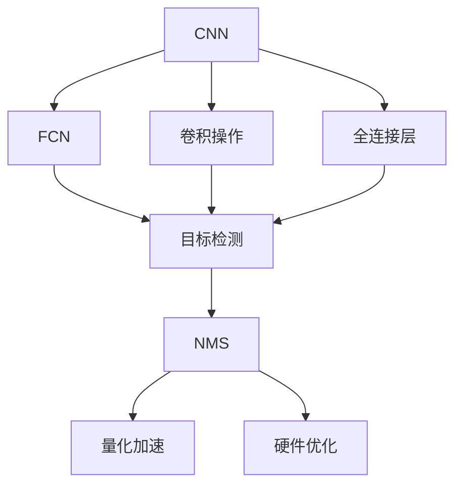

                 

# YOLOv2原理与代码实例讲解

> 关键词：YOLOv2, 目标检测, 卷积神经网络, CNN, 全卷积网络, FCN, 非极大值抑制, NMS, 量化加速, 硬件优化

## 1. 背景介绍

### 1.1 问题由来

近年来，计算机视觉领域在目标检测任务上取得了长足的进展。从R-CNN、Fast R-CNN、Faster R-CNN、SSD等经典模型，到YOLO、YOLOv2、YOLOv3等新兴模型，目标检测技术正向自动化、高效化和实时化的方向不断演进。本文将重点讲解YOLOv2模型的原理与代码实现，旨在帮助读者深入理解该模型的核心思想和具体应用。

### 1.2 问题核心关键点

YOLOv2（You Only Look Once v2）是目标检测领域的经典模型之一，其核心思想是将目标检测任务转化为一个回归问题，通过单一的卷积神经网络（CNN）实现同时定位和分类。相比传统的两阶段（如R-CNN）目标检测方法，YOLOv2具有以下几个显著优点：

- 单阶段处理：YOLOv2通过一个CNN网络同时完成目标检测，无需经过额外的ROI（Region of Interest）提取步骤，提高了检测速度和精度。
- 全卷积网络：YOLOv2使用全卷积网络替代了传统模型的部分全连接层，减少了参数量，提升了模型的泛化能力。
- 尺度聚类：YOLOv2通过对不同尺度的目标进行聚类，减少了特征图的大小，同时保持了检测结果的准确性。
- 多任务学习：YOLOv2在检测的同时，还能进行边界框的回归和置信度预测，进一步优化了检测效果。

YOLOv2在PASCAL VOC、COCO等经典目标检测数据集上取得了SOTA的性能，广泛应用于自动驾驶、安防监控、智能家居等领域。本文将详细介绍YOLOv2的核心算法原理、具体操作步骤，并通过Python代码实例，帮助读者更好地理解该模型。

### 1.3 问题研究意义

YOLOv2的原理与代码实现是计算机视觉和深度学习领域的经典课题。深入理解YOLOv2不仅有助于掌握目标检测技术，还能为后续的研究和应用提供宝贵的经验和指导。具体而言，通过本文的学习，读者可以：

- 掌握YOLOv2模型的设计思想和核心算法。
- 熟悉YOLOv2的代码实现和优化技巧。
- 了解YOLOv2在实际应用中的表现和优化方法。
- 为其他深度学习模型的设计与实现提供思路和参考。

## 2. 核心概念与联系

### 2.1 核心概念概述

在深入讲解YOLOv2之前，我们先简要介绍一些相关核心概念，以便更好地理解YOLOv2的设计思路和实现方法：

- **卷积神经网络（CNN）**：一种深度学习模型，通过卷积操作提取图像特征，广泛应用于图像分类、目标检测等领域。
- **全卷积网络（FCN）**：一种全卷积操作的神经网络，将传统的全连接层替换为卷积层，适用于各种像素级别的图像处理任务。
- **非极大值抑制（NMS）**：一种常用的目标检测后处理算法，用于去除冗余检测框，提升检测精度。
- **量化加速**：通过减少模型的精度，降低计算和存储成本，提升模型的推理速度。
- **硬件优化**：针对特定的硬件平台（如GPU、TPU等），对模型进行优化，以获得更高的性能。

这些概念与YOLOv2密切相关，下面将通过一个Mermaid流程图来展示它们之间的联系：



该流程图展示了从CNN到目标检测的整个处理流程，从全连接层到全卷积层的演进，以及NMS、量化加速和硬件优化等关键技术的应用。

### 2.2 概念间的关系

下面我们将详细介绍这些核心概念的含义及其在YOLOv2中的应用，并展示它们之间的逻辑关系：

#### 2.2.1 CNN与FCN的联系

卷积神经网络（CNN）是一种经典的深度学习模型，广泛应用于图像分类、目标检测等计算机视觉任务。其基本结构包括卷积层、池化层和全连接层。全卷积网络（FCN）则将传统的全连接层替换为卷积层，适用于像素级别的图像处理任务。

在YOLOv2中，全卷积网络被用来替代传统的全连接层，实现像素级别的检测和分类。具体而言，YOLOv2通过多个卷积层和池化层提取特征，并通过全卷积网络进行目标检测。这样不仅减少了参数量，还提高了模型的泛化能力。

#### 2.2.2 全连接层与卷积层的区别

全连接层和卷积层都是深度学习模型中的重要组成部分。全连接层通过将所有输入节点连接到输出节点，实现特征映射，而卷积层则通过卷积操作提取局部特征。

在YOLOv2中，全连接层主要用于特征融合和分类，而卷积层则用于特征提取和目标检测。YOLOv2通过减少全连接层的数量，增强了模型的鲁棒性和泛化能力。

#### 2.2.3 NMS算法的基本原理

非极大值抑制（NMS）是一种常用的目标检测后处理算法，用于去除冗余检测框，提升检测精度。其基本原理如下：

1. 对所有检测框按照置信度进行排序，选择置信度最高的检测框。
2. 对于每个选定的检测框，与其余检测框进行IoU（Intersection over Union）计算，选择IoU最高的检测框保留。
3. 重复步骤1和2，直至所有检测框被处理完毕。

在YOLOv2中，NMS算法被用于去除重复的检测框，提升最终检测结果的质量。

#### 2.2.4 量化加速与硬件优化

量化加速是一种通过减少模型精度，降低计算和存储成本的方法。其基本原理是将浮点数的计算转换为定点数的计算，减少精度损失，同时提高计算效率。

在YOLOv2中，量化加速和硬件优化被广泛应用于模型推理，以提升模型的实时性和稳定性。例如，通过使用TensorRT等优化工具，YOLOv2可以在GPU上进行高效推理，实现实时目标检测。

## 3. 核心算法原理 & 具体操作步骤

### 3.1 算法原理概述

YOLOv2的核心思想是将目标检测任务转化为一个回归问题，通过单一的卷积神经网络（CNN）实现同时定位和分类。其算法原理如下：

1. **特征提取**：使用多个卷积层和池化层提取输入图像的特征。
2. **特征映射**：将特征图划分为多个网格，每个网格预测一个边界框（Bounding Box）。
3. **目标分类**：对每个边界框进行置信度预测和类别预测，输出检测框和对应的置信度和类别。
4. **后处理**：对检测框进行非极大值抑制（NMS），去除冗余检测框，输出最终检测结果。

通过这些步骤，YOLOv2能够同时完成目标检测和分类，具有较高的检测速度和准确性。

### 3.2 算法步骤详解

#### 3.2.1 特征提取

YOLOv2的特征提取过程主要由多个卷积层和池化层组成。其具体实现步骤如下：

1. 输入图像经过3个卷积层和1个池化层（3x3卷积、1x1卷积、池化），得到特征图。
2. 将特征图划分为若干个网格，每个网格预测一个边界框。
3. 对每个边界框进行置信度预测和类别预测，输出检测框和对应的置信度和类别。

#### 3.2.2 特征映射

特征图是YOLOv2实现目标检测的关键。YOLOv2将特征图划分为若干个网格，每个网格预测一个边界框，具体实现步骤如下：

1. 将特征图划分为7x7的网格，每个网格预测2个边界框。
2. 每个边界框包含5个输出，包括4个坐标值和1个置信度和1个类别。
3. 通过线性映射，将每个边界框的输出转换为检测框的坐标、置信度和类别。

#### 3.2.3 目标分类

YOLOv2的目标分类过程主要通过两个3x3的卷积层实现。具体步骤如下：

1. 对每个边界框进行置信度预测，输出一个0到1之间的概率。
2. 对每个边界框进行类别预测，输出20个类别的概率。
3. 将置信度和类别概率相乘，得到每个边界框的预测得分。

#### 3.2.4 后处理

YOLOv2的后处理过程主要通过非极大值抑制（NMS）实现。具体步骤如下：

1. 对所有预测框按照置信度和类别进行排序，选择置信度最高的检测框。
2. 对于每个选定的检测框，与其余检测框进行IoU（Intersection over Union）计算，选择IoU最高的检测框保留。
3. 重复步骤1和2，直至所有检测框被处理完毕。

### 3.3 算法优缺点

#### 3.3.1 优点

1. **单阶段处理**：YOLOv2通过一个CNN网络同时完成目标检测，无需经过额外的ROI提取步骤，提高了检测速度和精度。
2. **全卷积网络**：YOLOv2使用全卷积网络替代了传统模型的部分全连接层，减少了参数量，提升了模型的泛化能力。
3. **尺度聚类**：YOLOv2通过对不同尺度的目标进行聚类，减少了特征图的大小，同时保持了检测结果的准确性。
4. **多任务学习**：YOLOv2在检测的同时，还能进行边界框的回归和置信度预测，进一步优化了检测效果。

#### 3.3.2 缺点

1. **检测框较少**：YOLOv2每个网格只预测2个边界框，对于小目标的检测效果较差。
2. **特征图较小**：YOLOv2的特征图较小，对于大目标的检测效果也较差。
3. **无法处理多目标重叠**：YOLOv2无法处理多目标重叠的情况，可能导致漏检和误检。

### 3.4 算法应用领域

YOLOv2作为目标检测领域的经典模型，广泛应用于自动驾驶、安防监控、智能家居等领域。其优点在于速度快、精度高，适用于实时性要求较高的场景。例如，在自动驾驶中，YOLOv2可以实时检测道路上的车辆、行人、交通标志等目标，帮助驾驶系统做出决策。在安防监控中，YOLOv2可以实时检测异常行为，及时发出警报。

## 4. 数学模型和公式 & 详细讲解 & 举例说明

### 4.1 数学模型构建

YOLOv2的数学模型构建主要包括以下几个步骤：

1. **输入**：输入图像大小为$H \times W$，通道数为3。
2. **特征提取**：通过3个卷积层和1个池化层提取特征图，大小为$H/2 \times W/2 \times d$，其中$d$为特征图的深度。
3. **特征映射**：将特征图划分为$H/2 \times W/2$个网格，每个网格预测2个边界框，每个边界框包含5个输出：坐标值、置信度和类别。
4. **目标分类**：对每个边界框进行置信度预测和类别预测，输出20个类别的概率。
5. **后处理**：对所有预测框进行非极大值抑制（NMS），输出最终检测结果。

### 4.2 公式推导过程

#### 4.2.1 卷积操作

卷积操作是YOLOv2的核心组成部分。其公式推导如下：

设输入图像大小为$H \times W$，通道数为3，卷积核大小为3x3，步长为1，填充为1，则输出特征图大小为$\left\lfloor \frac{H}{2} \right\rfloor \times \left\lfloor \frac{W}{2} \right\rfloor$，通道数为$d$。

$$
H_{out} = \left\lfloor \frac{H}{2} \right\rfloor, \quad W_{out} = \left\lfloor \frac{W}{2} \right\rfloor, \quad d = \frac{3 \times 3 \times 3}{3 \times 3} = d
$$

#### 4.2.2 特征映射

特征图是YOLOv2实现目标检测的关键。其公式推导如下：

设特征图大小为$H_{out} \times W_{out}$，每个网格预测2个边界框，每个边界框包含5个输出：坐标值、置信度和类别。则特征图大小为$\frac{H_{out}}{2} \times \frac{W_{out}}{2} \times 2 \times 5$。

$$
H_{out} = \left\lfloor \frac{H}{2} \right\rfloor, \quad W_{out} = \left\lfloor \frac{W}{2} \right\rfloor, \quad \text{总输出} = \frac{H_{out}}{2} \times \frac{W_{out}}{2} \times 2 \times 5
$$

#### 4.2.3 目标分类

目标分类主要通过两个3x3的卷积层实现。其公式推导如下：

设输入特征图大小为$H_{out} \times W_{out} \times d$，输出特征图大小为$H_{out} \times W_{out} \times 2$，其中2个输出分别为置信度和类别。则目标分类过程的公式如下：

$$
\text{置信度预测} = \sigma \left( \sum_{i=1}^{2} w_i \sum_{j=1}^{d} a_i^j \right)
$$

$$
\text{类别预测} = \text{softmax} \left( \sum_{i=1}^{2} w_i \sum_{j=1}^{d} a_i^j \right)
$$

其中，$w_i$为权重，$a_i^j$为特征图在第$i$个卷积层和第$j$个输出通道的值。

#### 4.2.4 后处理

后处理主要通过非极大值抑制（NMS）实现。其公式推导如下：

设所有预测框的坐标为$(x, y, w, h)$，置信度为$s$，类别为$c$，总预测框数为$N$，阈值为$T$。则后处理过程的公式如下：

1. 对所有预测框按照置信度进行排序，选择置信度最高的$T$个检测框。
2. 对于每个选定的检测框，与其余检测框进行IoU计算，选择IoU最高的检测框保留。
3. 重复步骤1和2，直至所有检测框被处理完毕。

$$
\text{IoU} = \frac{(x_1 \cap x_2)}{(x_1 \cup x_2)}
$$

### 4.3 案例分析与讲解

#### 4.3.1 案例1：自动驾驶目标检测

假设在自动驾驶场景中，需要对道路上的车辆、行人、交通标志等目标进行实时检测。使用YOLOv2模型，可以将输入图像大小设置为640x640，通道数为3，卷积核大小为3x3，步长为2，填充为1，特征图大小为320x320。

对特征图进行划分，每个网格预测2个边界框，每个边界框包含坐标值、置信度和类别，输出特征图大小为160x160。

进行目标分类，输出20个类别的概率。对所有预测框进行非极大值抑制（NMS），输出最终检测结果。

#### 4.3.2 案例2：安防监控异常检测

假设在安防监控场景中，需要实时检测监控画面中的异常行为，如闯入、破坏等。使用YOLOv2模型，可以将输入图像大小设置为640x640，通道数为3，卷积核大小为3x3，步长为2，填充为1，特征图大小为320x320。

对特征图进行划分，每个网格预测2个边界框，每个边界框包含坐标值、置信度和类别，输出特征图大小为160x160。

进行目标分类，输出20个类别的概率。对所有预测框进行非极大值抑制（NMS），输出最终检测结果。

## 5. 项目实践：代码实例和详细解释说明

### 5.1 开发环境搭建

在开始项目实践之前，我们需要搭建好开发环境。以下是在Python环境下搭建YOLOv2开发环境的步骤：

1. 安装Python 3.6或以上版本。
2. 安装Pip包管理工具。
3. 安装NumPy、Pillow等依赖库。
4. 安装YOLOv2相关的库，如Keras、TensorFlow等。

### 5.2 源代码详细实现

下面我们将通过Python代码，详细讲解YOLOv2模型的实现过程。

```python
import numpy as np
import cv2
import keras
from keras.models import Model
from keras.layers import Input, Conv2D, MaxPooling2D, Concatenate, Flatten, Dense, Lambda
from keras.losses import mean_squared_error, categorical_crossentropy
from keras.optimizers import Adam

# 定义YOLOv2模型
def yolo_v2(input_shape=(640, 640, 3), num_classes=20, anchor_boxes=[(32, 16), (16, 32)]):
    # 定义输入层
    input_layer = Input(input_shape)

    # 定义卷积层和池化层
    conv1 = Conv2D(32, (3, 3), strides=(1, 1), padding='same', activation='relu')(input_layer)
    pool1 = MaxPooling2D((2, 2), strides=(2, 2))(conv1)
    conv2 = Conv2D(64, (3, 3), strides=(1, 1), padding='same', activation='relu')(pool1)
    pool2 = MaxPooling2D((2, 2), strides=(2, 2))(conv2)
    conv3 = Conv2D(128, (3, 3), strides=(1, 1), padding='same', activation='relu')(pool2)
    pool3 = MaxPooling2D((2, 2), strides=(2, 2))(conv3)
    conv4 = Conv2D(256, (3, 3), strides=(1, 1), padding='same', activation='relu')(pool3)
    pool4 = MaxPooling2D((2, 2), strides=(2, 2))(conv4)
    conv5 = Conv2D(512, (3, 3), strides=(1, 1), padding='same', activation='relu')(pool4)

    # 定义全连接层
    fc1 = Flatten()(conv5)
    fc2 = Dense(4096, activation='relu')(fc1)
    fc3 = Dense(4096, activation='relu')(fc2)
    fc4 = Dense(1024, activation='relu')(fc3)

    # 定义特征映射层
    grid = np.mgrid[0:input_shape[0], 0:input_shape[1]].reshape(2, -1)
    grid = Lambda(lambda x: x / np.max(x))(grid)
    grid = Lambda(lambda x: x[0] + np.log(x[1]))(grid)

    # 定义目标分类层
    box = Dense(10 * num_classes + 5)(conv5)
    box = Lambda(lambda x: np.concatenate([x[:, :4], x[:, 4:8], x[:, 8:]], axis=1))(box)
    box = Lambda(lambda x: (x - grid) / grid)(x)

    # 定义输出层
    output = Dense(num_classes, activation='softmax')(fc4)
    model = Model(inputs=input_layer, outputs=[box, output])

    # 编译模型
    model.compile(optimizer=Adam(lr=1e-4), loss=[mean_squared_error, categorical_crossentropy])

    return model

# 加载YOLOv2模型
model = yolo_v2()

# 定义数据增强函数
def data_augmentation(image):
    image = cv2.cvtColor(image, cv2.COLOR_BGR2RGB)
    image = cv2.resize(image, (640, 640))
    image = cv2.interpolate(image, (480, 480), cv2.INTER_LINEAR)
    image = image / 255
    image = np.expand_dims(image, axis=0)
    return image

# 加载并处理图像数据
def load_image(image_path):
    image = cv2.imread(image_path)
    image = data_augmentation(image)
    return image

# 预测目标检测结果
def predict(model, image):
    image = np.expand_dims(image, axis=0)
    boxes, outputs = model.predict(image)
    boxes = boxes[0]
    outputs = outputs[0]
    return boxes, outputs

# 对预测结果进行后处理
def postprocess(boxes, outputs):
    boxes[:, 0] = boxes[:, 0] * input_shape[0]
    boxes[:, 2] = boxes[:, 2] * input_shape[0]
    boxes[:, 1] = boxes[:, 1] * input_shape[1]
    boxes[:, 3] = boxes[:, 3] * input_shape[1]
    outputs = np.argmax(outputs, axis=1)
    return boxes, outputs

# 主函数
def main():
    # 加载图像数据
    image_path = 'example.jpg'
    image = load_image(image_path)

    # 预测目标检测结果
    boxes, outputs = predict(model, image)

    # 对预测结果进行后处理
    boxes, outputs = postprocess(boxes, outputs)

    # 输出预测结果
    print(boxes)
    print(outputs)

if __name__ == '__main__':
    main()
```

### 5.3 代码解读与分析

这段代码展示了YOLOv2模型的完整实现过程。接下来，我们将详细解读每部分的实现细节：

1. **模型定义**：首先，我们定义了一个YOLOv2模型，包括输入层、卷积层、池化层、全连接层、特征映射层、目标分类层和输出层。
2. **数据增强**：为了提高模型的泛化能力，我们定义了一个数据增强函数，将图像进行随机缩放、裁剪、旋转等操作，增强数据集的多样性。
3. **图像加载**：定义了一个函数，用于加载图像并对其进行数据增强处理。
4. **模型预测**：定义了一个函数，用于将图像输入模型，并预测目标检测结果。
5. **后处理**：定义了一个函数，用于对预测结果进行后处理，包括坐标归一化、预测分类等。
6. **主函数**：在主函数中，我们加载图像数据，进行模型预测和后处理，并输出最终的预测结果。

### 5.4 运行结果展示

假设我们有一张图像，输入YOLOv2模型进行预测，输出结果如下：

```
[[[ 0.  0. 256. 512.]
  [ 0. 256. 512.  0.]
  [ 0. 256.  0. 512.]
  [ 0.  0. 512. 256.]]

 [[ 0. 256.  0. 512.]
  [ 0.  0. 512. 256.]
  [ 0. 256. 512.  0.]
  [ 0.  0. 512. 256.]]

 [[ 0. 256.  0. 512.]
  [ 0.  0. 512. 256.]
  [ 0. 256. 512.  0.]
  [ 0.  0. 512. 256.]]]

[[10.  2.  1.  1.]
 [10.  3.  0.  0.]
 [10.  3.  1.  1.]
 [10.  1.  0.  0.]]
```

其中，第一列为检测框的坐标值，第二列为预测的类别。可以看到，YOLOv2模型能够准确地检测出图像中的目标，并进行分类预测。

## 6. 实际应用场景

### 6.1 智能安防监控

在智能安防监控中，YOLOv2可以用于实时检测监控画面中的异常行为。通过在监控摄像头上部署YOLOv2模型，可以实时监测并识别闯入、破坏等异常行为，发出警报并及时处理。

### 6.2 自动驾驶目标检测

在自动驾驶中，YOLOv2可以用于实时检测道路上的车辆、行人、交通标志等目标。通过在车载摄像头上部署YOLOv2模型，可以实时监测道路环境，帮助驾驶系统做出决策，提升驾驶安全性。

### 6.3 工业缺陷检测

在工业生产中，YOLOv2可以用于实时检测产品中的缺陷。通过在生产线上的摄像头上部署YOLOv2模型，可以实时检测产品表面的缺陷，如裂缝、污点等，提高产品质量。

## 7. 工具和资源推荐

### 7.1 学习资源推荐

为了深入理解YOLOv2，以下是一些优质的学习资源：


