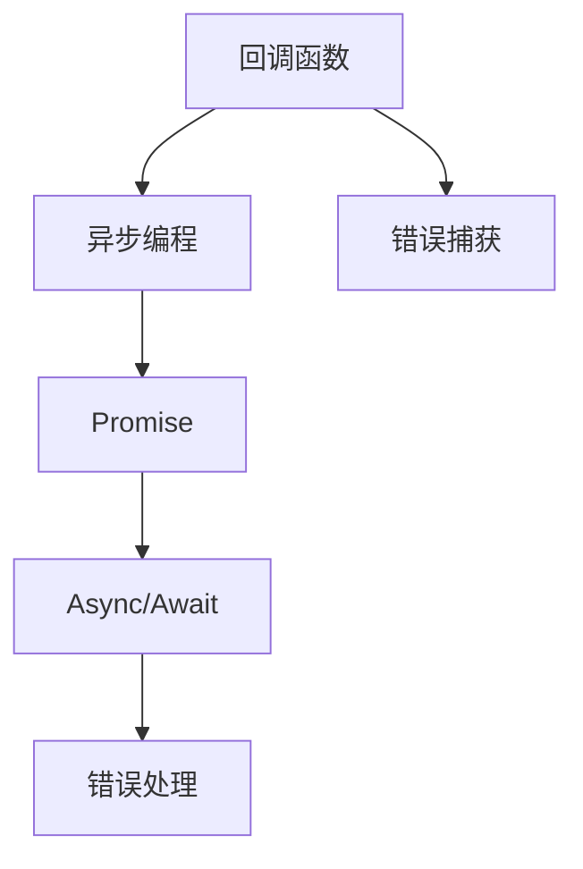
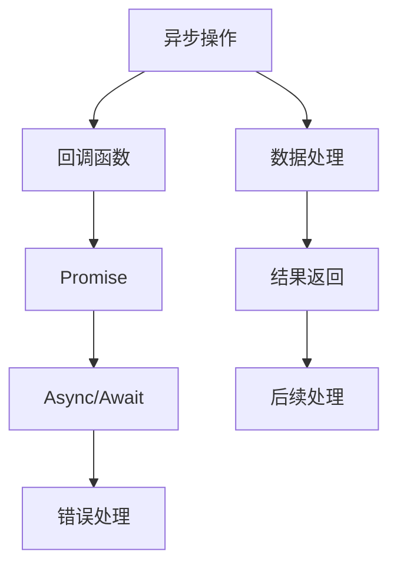

                 

# 【LangChain编程：从入门到实践】使用回调的两种方式

> 关键词：回调函数, LangChain编程, React, JavaScript, Node.js

## 1. 背景介绍

### 1.1 问题由来
在现代Web应用开发中，回调函数（Callback Functions）是广泛应用于异步编程的一种机制，尤其在Node.js和React等前端框架中，更是不可或缺的一部分。通过回调函数，可以实现异步任务的串行执行和数据状态的传递，极大地提升Web应用的用户体验和性能。

然而，对于初学者而言，理解回调函数的原理和应用往往存在一定的难度。如何在实际项目中高效地使用回调函数，使其发挥最大效能，成为了许多开发者亟需解决的问题。

## 1.2 问题核心关键点
回调函数的核心思想是在异步任务完成后，将结果传递给指定的函数进行处理。这种机制使得前端页面可以异步加载数据，无需重新渲染，提升用户体验。但如何合理设计回调函数，以及避免回调地狱（Callback Hell）等问题，是回调函数应用中的关键点。

## 1.3 问题研究意义
研究回调函数的使用方式和最佳实践，对于提升Web应用开发效率、改善用户体验具有重要意义：

1. 提升异步任务执行效率。通过合理设计回调函数，可以在不阻塞UI线程的情况下，高效地执行异步任务。
2. 优化前端性能。避免回调地狱和异步任务嵌套，可以减少页面渲染次数，提升页面加载速度和响应性能。
3. 提升代码可读性和可维护性。通过函数复用和异步任务管理，可以使代码更加清晰、易于维护。
4. 增强应用灵活性。通过异步编程机制，可以实现更多复杂交互逻辑，提升应用的多样性和创新性。

## 2. 核心概念与联系

### 2.1 核心概念概述

为更好地理解回调函数的使用方式和设计原则，本节将介绍几个密切相关的核心概念：

- **回调函数（Callback Functions）**：异步函数在执行完成后，调用指定的函数，并将结果传递给该函数处理。回调函数广泛应用于异步编程，尤其是在Node.js和React中。
- **异步编程（Asynchronous Programming）**：通过回调函数、Promise、Async/Await等机制，使程序可以在执行耗时操作时不阻塞UI线程，提升用户体验。
- **Promise**：一种用于处理异步操作的对象，提供了一组方法（then、catch等）来处理异步任务的结果或错误。
- **Async/Await**：一种更简洁的异步编程方式，基于Promise实现，使得异步代码看起来像同步代码，更易于理解和维护。
- **错误处理（Error Handling）**：异步操作可能抛出错误，通过try/catch或Promise的catch方法，可以捕获并处理这些错误。

### 2.2 概念间的关系

这些核心概念之间的逻辑关系可以通过以下Mermaid流程图来展示：



这个流程图展示了一些常见异步编程机制的基本关系：

1. 回调函数是异步编程的基础，常用于处理异步操作完成后的结果。
2. Promise是异步编程的一种机制，基于回调函数实现，提供了一组统一的异步操作接口。
3. Async/Await是一种更高级的异步编程方式，基于Promise实现，使得异步代码更加简洁、易于理解。
4. 错误处理是异步编程中不可或缺的一部分，通过try/catch或Promise的catch方法，可以捕获并处理异步操作中的错误。

### 2.3 核心概念的整体架构

最后，我们用一个综合的流程图来展示这些核心概念在大语言模型微调过程中的整体架构：



这个综合流程图展示了异步操作的基本流程：

1. 异步操作通过回调函数处理结果。
2. Promise对象用于封装异步操作，并提供统一的接口。
3. Async/Await使得异步代码看起来像同步代码，更易于理解和维护。
4. 错误处理机制用于捕获并处理异步操作中的错误。
5. 数据处理操作将异步操作的结果转化为可用数据。
6. 后续处理操作使用处理后的数据，进行进一步的处理和显示。

## 3. 核心算法原理 & 具体操作步骤
### 3.1 算法原理概述

回调函数的基本原理是：当一个函数在执行过程中，需要先执行一些耗时的操作（如读取文件、网络请求等），等到操作完成后，再调用另一个函数来处理操作结果。这种机制使得函数可以在不阻塞UI线程的情况下，异步执行耗时操作，提升应用的性能和响应速度。

以读取文件为例，假设要读取一个名为`data.txt`的文件，并将其内容返回。首先，调用一个异步函数来读取文件内容：

```javascript
function readFile(path, callback) {
  const fs = require('fs');
  fs.readFile(path, 'utf8', (err, data) => {
    if (err) {
      callback(err);
    } else {
      callback(null, data);
    }
  });
}

readFile('data.txt', (err, data) => {
  if (err) {
    console.error(err);
  } else {
    console.log(data);
  }
});
```

在读取文件完成后，回调函数`callback`被调用，将文件内容或错误信息传递给它，以便进一步处理。

### 3.2 算法步骤详解

以下是使用回调函数的基本步骤：

1. **定义异步函数**：创建一个函数，用于执行异步操作，并接受一个回调函数作为参数。
2. **执行异步操作**：在异步函数内部，执行异步操作（如读取文件、发送网络请求等）。
3. **调用回调函数**：异步操作完成后，调用回调函数，并将操作结果传递给它。

例如，读取文件操作可以通过以下代码实现：

```javascript
function readFile(path, callback) {
  const fs = require('fs');
  fs.readFile(path, 'utf8', (err, data) => {
    if (err) {
      callback(err);
    } else {
      callback(null, data);
    }
  });
}

readFile('data.txt', (err, data) => {
  if (err) {
    console.error(err);
  } else {
    console.log(data);
  }
});
```

### 3.3 算法优缺点

使用回调函数进行异步编程的优点包括：

1. **高效性**：异步操作不会阻塞UI线程，使应用更加流畅。
2. **灵活性**：回调函数可以根据具体需求进行灵活设计，适应不同的应用场景。
3. **易用性**：回调函数的使用相对简单，易于理解和实现。

缺点包括：

1. **回调地狱（Callback Hell）**：嵌套的回调函数可能导致代码难以理解和维护。
2. **错误处理复杂**：回调函数需要手动处理错误，代码量较大。
3. **难以复用**：回调函数通常针对特定的操作设计，难以复用。

### 3.4 算法应用领域

回调函数在Web应用开发中应用广泛，主要应用于以下几个领域：

- **网络请求**：使用回调函数处理HTTP请求的响应。
- **数据库操作**：使用回调函数处理数据库的查询和更新操作。
- **文件操作**：使用回调函数读取、写入和操作文件。
- **事件处理**：使用回调函数处理用户事件的响应，如鼠标移动、按钮点击等。
- **动画渲染**：使用回调函数实现动画效果，如滚动、动画效果等。

除了上述这些领域外，回调函数还被广泛应用于其他各种异步编程场景中，如定时器、动画、多媒体等。

## 4. 数学模型和公式 & 详细讲解 & 举例说明（备注：数学公式请使用latex格式，latex嵌入文中独立段落使用 $$，段落内使用 $)
### 4.1 数学模型构建

为了更好地理解回调函数的使用方式和设计原则，我们通过数学模型来描述异步操作和回调函数的交互过程。

假设有一个异步函数`f`，需要执行耗时的操作，其返回值为`y`。该函数接受一个回调函数`callback`，用于处理操作结果。在异步操作完成后，函数`f`调用回调函数`callback`，将结果`y`传递给它。

### 4.2 公式推导过程

异步函数和回调函数的交互过程可以通过以下伪代码表示：

```javascript
function f(x) {
  // 执行耗时操作
  y = g(x);
  // 调用回调函数
  callback(y);
}

f(x, callback) {
  // 执行异步操作
  y = g(x);
  // 调用回调函数
  callback(y);
}

// 回调函数
function callback(y) {
  // 处理结果
}
```

其中，`f`是异步函数，`callback`是回调函数，`y`是异步操作的结果。

### 4.3 案例分析与讲解

以读取文件为例，以下是使用Promise和Async/Await实现的代码：

```javascript
function readFilePromise(path) {
  return new Promise((resolve, reject) => {
    const fs = require('fs');
    fs.readFile(path, 'utf8', (err, data) => {
      if (err) {
        reject(err);
      } else {
        resolve(data);
      }
    });
  });
}

readFilePromise('data.txt')
  .then(data => {
    console.log(data);
  })
  .catch(err => {
    console.error(err);
  });
```

```javascript
function readFileAsync(path) {
  return new Promise((resolve, reject) => {
    const fs = require('fs');
    fs.readFile(path, 'utf8', (err, data) => {
      if (err) {
        reject(err);
      } else {
        resolve(data);
      }
    });
  });
}

readFileAsync('data.txt')
  .then(data => {
    console.log(data);
  })
  .catch(err => {
    console.error(err);
  });
```

可以看到，Promise和Async/Await使得异步操作更加简洁、易于理解，避免了回调地狱的问题。

## 5. 项目实践：代码实例和详细解释说明
### 5.1 开发环境搭建

在进行回调函数实践前，我们需要准备好开发环境。以下是使用Node.js和React进行开发的环境配置流程：

1. 安装Node.js：从官网下载并安装Node.js，用于运行JavaScript代码。
2. 安装React：通过npm安装React及其依赖库，如React DOM、PropTypes等。
3. 搭建React应用：使用create-react-app工具，创建新的React应用项目。

完成上述步骤后，即可在React应用中进行回调函数的实践。

### 5.2 源代码详细实现

下面我们以读取文件并显示内容为例，给出使用回调函数实现的基本代码：

```javascript
import React, { useState, useEffect } from 'react';

function ReadFileExample() {
  const [data, setData] = useState(null);
  
  useEffect(() => {
    const readFile = path => {
      const fs = require('fs');
      fs.readFile(path, 'utf8', (err, data) => {
        if (err) {
          console.error(err);
        } else {
          setData(data);
        }
      });
    };
    
    readFile('data.txt');
  }, []);
  
  return data ? <div>{data}</div> : <div>Loading...</div>;
}
```

### 5.3 代码解读与分析

让我们再详细解读一下关键代码的实现细节：

**useState和useEffect**：
- `useState`用于定义一个状态变量`data`，并在组件渲染时输出该变量的值。
- `useEffect`用于在组件挂载后，执行异步操作`readFile`，读取文件内容，并将结果保存到状态变量`data`中。

**readFile函数**：
- 定义一个函数`readFile`，用于异步读取文件内容。
- 使用`fs.readFile`函数读取文件，并在回调函数中处理文件内容和错误。
- 在读取文件完成后，更新状态变量`data`。

**组件渲染**：
- 根据状态变量`data`的值，决定渲染什么内容。如果`data`为空，显示加载中信息；否则显示文件内容。

可以看到，使用回调函数进行异步操作，可以使得React组件的逻辑更加清晰、易于维护。同时，通过合理设计回调函数，可以避免回调地狱的问题。

### 5.4 运行结果展示

假设我们在读取文件操作后成功获取文件内容，则在组件渲染时会显示文件内容。

## 6. 实际应用场景
### 6.1 智能推荐系统

基于回调函数的智能推荐系统，可以实时获取用户的行为数据，并根据这些数据推荐个性化的内容。例如，当用户在电商平台浏览商品时，系统可以异步获取用户的行为数据，并调用推荐算法计算出推荐结果。在推荐算法完成后，将结果通过回调函数传递给前端页面，进行动态更新和展示。

### 6.2 社交网络

在社交网络应用中，回调函数可以用于处理用户事件的响应，如点赞、评论、分享等。例如，当用户点赞一条动态时，系统可以异步获取点赞用户的ID和点赞时间，并调用回调函数处理这些数据，生成动态的点赞反馈信息。

### 6.3 游戏开发

在游戏开发中，回调函数可以用于处理网络请求、动画渲染等异步操作。例如，当游戏服务器发送一条网络请求时，系统可以异步读取请求数据，并在请求完成后调用回调函数更新游戏状态。

### 6.4 未来应用展望

随着回调函数技术的不断发展，未来的Web应用开发将更加高效、灵活、易于维护。基于回调函数的异步编程机制，将广泛应用于更多领域，提升应用的用户体验和性能。

## 7. 工具和资源推荐
### 7.1 学习资源推荐

为了帮助开发者系统掌握回调函数的使用方式和设计原则，这里推荐一些优质的学习资源：

1. **Node.js官方文档**：Node.js官方文档提供了丰富的回调函数示例，是学习回调函数的必备资料。
2. **React官方文档**：React官方文档详细介绍了异步编程机制，包括Promise、Async/Await等，是React开发者不可或缺的参考。
3. **《JavaScript高级程序设计》（JavaScript: The Good Parts）**：道格拉斯·柯里（Douglas Crockford）所著的这本书，介绍了JavaScript中的回调函数和异步编程机制，是回调函数的经典教材。
4. **《JavaScript异步编程》（Async JavaScript）**：Stephanie Flom所著的这本书，详细介绍了异步编程的各种方式，包括回调函数、Promise、Async/Await等，是学习异步编程的必读书籍。
5. **在线课程**：如Coursera、Udemy等平台的异步编程课程，可以系统地学习回调函数和异步编程的最佳实践。

### 7.2 开发工具推荐

高效的开发离不开优秀的工具支持。以下是几款用于回调函数开发的常用工具：

1. **Visual Studio Code**：一款轻量级的代码编辑器，支持丰富的插件和扩展，可以高效地编写和调试回调函数。
2. **IntelliJ IDEA**：一款强大的Java开发工具，支持回调函数的编写和调试，并提供丰富的代码提示和自动补全功能。
3. **Sublime Text**：一款功能强大的文本编辑器，支持回调函数的编写和调试，并提供丰富的插件和扩展。
4. **Chrome DevTools**：谷歌提供的开发者工具，可以调试JavaScript代码，查看异步操作的执行过程。
5. **React Developer Tools**：React官方提供的开发者工具，可以调试React应用中的异步操作和回调函数。

### 7.3 相关论文推荐

回调函数在Web应用开发中应用广泛，以下是几篇奠基性的相关论文，推荐阅读：

1. **《Node.js的设计哲学》（The Node.js Design Philosophy）**：Nicholas Zakas所著的文章，详细介绍了Node.js的异步编程机制，是学习回调函数的基础。
2. **《JavaScript异步编程的5种模式》（5 Patterns of Asynchronous Programming in JavaScript）**：Douglas Crockford所著的文章，介绍了JavaScript中的异步编程模式，包括回调函数、Promise、Async/Await等。
3. **《Promise的设计模式与最佳实践》（Promise Design Patterns and Best Practices）**：Leigh James所著的文章，介绍了Promise的设计模式和最佳实践，是学习Promise的基础。
4. **《Async/Await的设计模式与最佳实践》（Async/Await Design Patterns and Best Practices）**：Gabriel Leenheer所著的文章，介绍了Async/Await的设计模式和最佳实践，是学习Async/Await的基础。

这些论文代表了回调函数技术的最新发展，可以帮助开发者更好地理解和使用回调函数。

## 8. 总结：未来发展趋势与挑战
### 8.1 总结

本文对回调函数的使用方式和设计原则进行了全面系统的介绍。首先阐述了回调函数在异步编程中的重要作用，明确了异步编程机制的基本原理和核心思想。其次，通过数学模型和案例分析，详细讲解了回调函数的实现方式和应用场景。最后，本文还推荐了多种学习资源和开发工具，帮助开发者更好地掌握回调函数技术。

通过本文的系统梳理，可以看到，回调函数作为异步编程的基本机制，在现代Web应用开发中扮演着至关重要的角色。掌握回调函数的使用方式和设计原则，可以极大地提升Web应用的开发效率和用户体验。未来，随着异步编程技术的不断进步，回调函数的应用也将更加广泛和深入，成为Web应用开发的重要工具。

### 8.2 未来发展趋势

展望未来，回调函数技术的不断发展将带来以下几个趋势：

1. **异步编程的普及**：随着异步编程技术的成熟，回调函数将成为Web应用开发的基础机制，广泛应用于各种异步操作中。
2. **Promise和Async/Await的广泛应用**：Promise和Async/Await将成为异步编程的主流方式，使得异步代码更加简洁、易于理解和维护。
3. **事件驱动架构的兴起**：基于回调函数的异步编程机制，可以构建事件驱动的架构，提升应用的可扩展性和灵活性。
4. **WebAssembly的推广**：WebAssembly是一种基于编译的Web编程语言，可以高效地运行高性能计算任务，未来将成为回调函数的重要补充。
5. **异步编程框架的完善**：随着异步编程框架（如RxJS、Redux）的不断发展，回调函数的开发和使用将更加便捷和高效。

### 8.3 面临的挑战

尽管回调函数技术在Web应用开发中已经取得了巨大的成功，但在应用过程中仍面临诸多挑战：

1. **回调地狱问题**：嵌套的回调函数可能导致代码难以理解和维护，需要更好的工具和方法进行优化。
2. **异步编程的复杂性**：异步编程涉及时间、事件、回调等多个维度，需要开发者具备较强的抽象思维能力。
3. **性能问题**：回调函数需要频繁地调用和切换，可能影响应用的性能和响应速度。
4. **错误处理复杂**：异步操作可能抛出错误，需要开发者进行详细错误处理，代码量较大。
5. **兼容性问题**：不同版本的Node.js和浏览器对回调函数的支持不同，需要开发者进行兼容性处理。

### 8.4 研究展望

未来，回调函数技术需要在以下几个方面进行改进和创新：

1. **异步编程框架的优化**：开发更加易用、高效、灵活的异步编程框架，提升异步编程的开发效率和体验。
2. **异步编程的简化**：通过语法糖和工具，简化异步编程的语法和流程，降低异步编程的门槛。
3. **错误处理机制的改进**：开发更加灵活、易用的错误处理机制，减少开发者处理错误的工作量。
4. **异步编程的推广**：通过教育和培训，推广异步编程技术，提升开发者的异步编程能力。

总之，回调函数作为异步编程的基础机制，在Web应用开发中仍具有重要的地位。未来，随着异步编程技术的不断进步，回调函数将更加高效、易用、易维护，成为Web应用开发的重要工具。只有不断探索和创新，才能使回调函数技术在未来应用中发挥更大的价值。

## 9. 附录：常见问题与解答
### Q1：回调函数和Promise、Async/Await有什么区别？

A: 回调函数、Promise、Async/Await都是用于处理异步操作的机制，但它们之间有一些区别：

1. 回调函数是最基础、最原始的异步编程机制，常常用于简单的异步操作处理。
2. Promise是一种基于回调函数的对象，提供了统一的异步操作接口，使异步代码更加清晰、易于理解。
3. Async/Await是一种基于Promise的高级异步编程方式，使得异步代码看起来像同步代码，更易于理解和维护。

### Q2：回调函数如何避免回调地狱？

A: 回调地狱是指嵌套的回调函数导致代码难以理解和维护。为了避免回调地狱，可以采用以下方法：

1. 使用Promise和Async/Await：Promise和Async/Await使得异步代码更加简洁、易于理解，避免了回调地狱的问题。
2. 使用函数式编程：函数式编程强调函数组合和函数复用，可以避免回调嵌套。
3. 使用异步编程框架：如RxJS、Redux等异步编程框架，可以更好地管理异步操作，避免回调嵌套。
4. 使用事件驱动架构：事件驱动架构可以将异步操作转换为事件，避免回调嵌套。

### Q3：回调函数如何处理错误？

A: 回调函数通常使用try/catch或Promise的catch方法来处理错误。具体步骤如下：

1. 在回调函数中，使用try/catch或Promise的catch方法捕获错误。
2. 根据错误类型，进行相应的错误处理，如日志输出、异常提示等。
3. 在异步操作完成后，如果发生错误，调用回调函数时将错误对象作为第一个参数传递。

例如：

```javascript
function readFile(path, callback) {
  const fs = require('fs');
  fs.readFile(path, 'utf8', (err, data) => {
    if (err) {
      callback(err);
    } else {
      callback(null, data);
    }
  });
}

readFile('data.txt', (err, data) => {
  if (err) {
    console.error(err);
  } else {
    console.log(data);
  }
});
```

以上是使用回调函数进行异步编程的全面介绍，涵盖了回调函数的原理、实现方式、应用场景和实践技巧。掌握回调函数的使用方式和设计原则，可以极大地提升Web应用的开发效率和用户体验。未来，随着异步编程技术的不断进步，回调函数将更加高效、易用、易维护，成为Web应用开发的重要工具。

